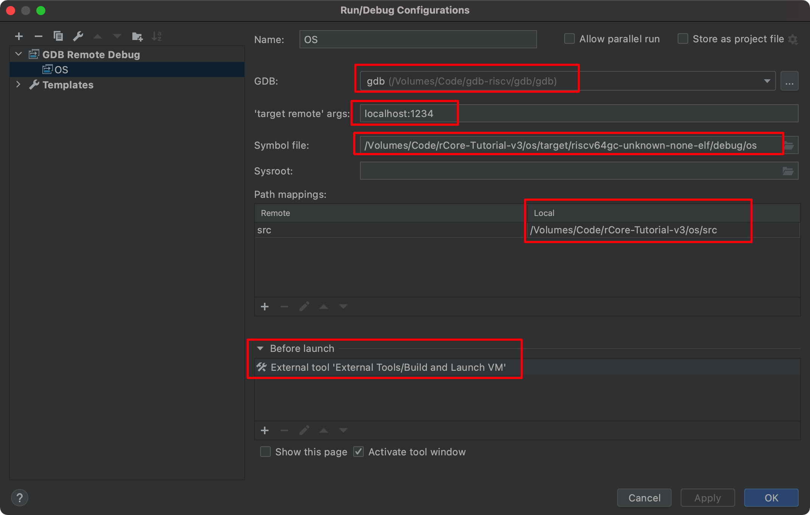

附錄 B：常見工具的使用方法
========================================

.. toctree::
   :hidden:
   :maxdepth: 4

調試工具的使用
------------------------

下載或編譯GDB
^^^^^^^^^^^^^^^^^^^^^^^

可以在 :doc:`/chapter0/5setup-devel-env` 中下載編譯好的二進制（版本為8.3.0，由於包括整個哦那工具鏈，解壓後大小約為1G）,也可以編譯最新版本（僅gdb，大小約為300M）

.. code-block:: console

   wget https://github.com/riscv/riscv-binutils-gdb/archive/refs/heads/riscv-binutils-2.36.1.zip
   unzip riscv-binutils-2.36.1.zip
   mkdir build
   cd build
   ../riscv-binutils-2.36.1/configure --target=riscv64-unknown-elf
   make

如果是編譯好的二進制，gdb在 ``./bin/riscv64-unknown-elf-gdb`` 中。如果是自己編譯的最新版本，gdb在 ``build/bin/gdb`` 中。你可以移動到一個你喜歡的位置。

首先修改 ``Makefile`` ，下以 ``ch1`` 分支的為例：

1. 第三行 ``release`` 改為 ``debug`` 

2. 第46行去掉 ``--release`` 

3. 第66行的qemu的選項中增加 ``-s -S`` 

這時，運行 ``make run`` 應該會停在系統開始前，等待 ``gdb`` 客戶端連接。

在命令行中直接使用gdb
^^^^^^^^^^^^^^^^^^^^^^^

.. code-block:: console

   # 啟動gdb，傳入二進制文件作為參數。
   # 記得修改路徑
   ./bin/riscv64-unknown-elf-gdb  /Volumes/Code/rCore-Tutorial-v3/os/target/riscv64gc-unknown-none-elf/debug/os
   # 導入源碼路徑
   (gdb) directory /Volumes/Code/rCore-Tutorial-v3/os/
   Source directories searched: /Volumes/Code/rCore-Tutorial-v3/os:$cdir:$cwd
   # 連接到qemu中的gdb-server
   (gdb) target remote localhost:1234
   Remote debugging using localhost:1234
   0x0000000000001000 in ?? ()
   # 現在可以開始調試了，下面給出一些示例指令：
   (gdb) b rust_main
   Breakpoint 1 at 0x802005aa: file /Volumes/Code/rCore-Tutorial-v3/os/src/main.rs, line 36.
   (gdb) continue
   Continuing.

   Breakpoint 1, os::rust_main () at /Volumes/Code/rCore-Tutorial-v3/os/src/main.rs:36
   36	    clear_bss();
   (gdb) l
   31	        fn sbss();
   32	        fn ebss();
   33	        fn boot_stack();
   34	        fn boot_stack_top();
   35	    }
   36	    clear_bss();

在IDE中直接使用gdb
^^^^^^^^^^^^^^^^^^^^^^^

下面以[CLion](https://www.jetbrains.com/clion/)中[Rust插件](https://plugins.jetbrains.com/plugin/8182-rust)為例。其他IDE的配置大同小異。

注意：上面提供的GDB二進制版本過低，需要使用自己編譯的最新版本的GDB。

1. 在 CLion 中打開項目（os文件夾），選擇 ``cargo project`` 。

2. 在項目中新建一個 ``sh`` 文件，輸入以下內容並給予可執行權限：

.. code-block:: console

   #!/usr/bin/env bash
   killall qemu-system-riscv64 # 由於無法在debug結束時關閉虛擬機，我們在debug開始時關閉上一次開啟的虛擬機。
   nohup bash -c "make run > run.log 2>&1" & # 後臺啟動qemu
   echo "Done!"

3. 在右上角點擊 ``Edit Configurations`` ,新增一個 ``GDB Remote Debug`` ,並如圖配置：

第 1 個紅框中選擇你的自己編譯的gdb路徑
第 3, 4 個紅框中根據你的代碼路徑做適當修改
第 5 個紅框中，點擊下面加號，選擇`External Tools`，並選擇上面新建的`sh`腳本。

分析可執行文件
------------------------

對於Rust編譯器生成的執行程序，可通過各種有效工具進行分析。如果掌握了對這些工具的使用，那麼在後續的開發工作中，對碰到的各種奇怪問題就進行靈活處理和解決了。
我們以Rust編譯生成的一個簡單的“Hello, world”應用執行程序為分析對象，看看如何進行分析。

讓我們先來通過 ``file`` 工具看看最終生成的可執行文件的格式：

.. code-block:: console

   $ cargo new os
   $ cd os; cargo build
      Compiling os v0.1.0 (/tmp/os)
      Finished dev [unoptimized + debuginfo] target(s) in 0.26s

   $ file target/debug/os
   target/debug/os: ELF 64-bit LSB shared object, x86-64, version 1 (SYSV), dynamically linked, 
   interpreter /lib64/ld-linux-x86-64.so.2, ......

   $

.. _term-elf:
.. _term-metadata:

從中可以看出可執行文件的格式為 **可執行和鏈接格式** (Executable and Linkable Format, ELF)，硬件平臺是 x86-64。在 ELF 文件中，
除了程序必要的代碼、數據段（它們本身都只是一些二進制的數據）之外，還有一些 **元數據** (Metadata) 描述這些段在地址空間中的位置和在
文件中的位置以及一些權限控制信息，這些元數據只能放在代碼、數據段的外面。

rust-readobj
^^^^^^^^^^^^^^^^^^^^^^^

我們可以通過二進制工具 ``rust-readobj`` 來看看 ELF 文件中究竟包含什麼內容，輸入命令：

.. code-block:: console

   $ rust-readobj -all target/debug/os 

首先可以看到一個 ELF header，它位於 ELF 文件的開頭：

.. code-block:: objdump
   :linenos:
   :emphasize-lines: 8,19,20,21,24,25,26,27

   File: target/debug/os
   Format: elf64-x86-64
   Arch: x86_64
   AddressSize: 64bit
   LoadName: 
   ElfHeader {
   Ident {
      Magic: (7F 45 4C 46)
      Class: 64-bit (0x2)
      DataEncoding: LittleEndian (0x1)
      FileVersion: 1
      OS/ABI: SystemV (0x0)
      ABIVersion: 0
      Unused: (00 00 00 00 00 00 00)
   }
   Type: SharedObject (0x3)
   Machine: EM_X86_64 (0x3E)
   Version: 1
   Entry: 0x5070
   ProgramHeaderOffset: 0x40
   SectionHeaderOffset: 0x32D8D0
   Flags [ (0x0)
   ]
   HeaderSize: 64
   ProgramHeaderEntrySize: 56
   ProgramHeaderCount: 12
   SectionHeaderEntrySize: 64
   SectionHeaderCount: 42
   StringTableSectionIndex: 41
   }
   ......

.. _term-magic:

- 第 8 行是一個稱之為 **魔數** (Magic) 獨特的常數，存放在 ELF header 的一個固定位置。當加載器將 ELF 文件加載到內存之前，通常會查看
  該位置的值是否正確，來快速確認被加載的文件是不是一個 ELF 。
- 第 19 行給出了可執行文件的入口點為 ``0x5070`` 。
- 從 20-21 行中，我們可以知道除了 ELF header 之外，還有另外兩種不同的 header，分別稱為 program header 和 section header，
  它們都有多個。ELF header 中給出了其他兩種header 的大小、在文件中的位置以及數目。
- 從 24-27 行中，可以看到有 12 個不同的 program header，它們從文件的 0x40 字節偏移處開始，每個 56 字節；
  有64個section header,它們從文件的 0x2D8D0 字節偏移處開始，每個 64 字節；

有多個不同的 section header，下面是個具體的例子：

.. code-block:: objdump

   ......
   Section {
      Index: 14
      Name: .text (157)
      Type: SHT_PROGBITS (0x1)
      Flags [ (0x6)
         SHF_ALLOC (0x2)
         SHF_EXECINSTR (0x4)
      ]
      Address: 0x5070
      Offset: 0x5070
      Size: 208067
      Link: 0
      Info: 0
      AddressAlignment: 16
      EntrySize: 0
   }
         

每個 section header 則描述一個段的元數據。

其中，我們看到了代碼段 ``.text`` 需要被加載到地址 ``0x5070`` ，大小 208067 字節。
它們分別由元數據的字段 Offset、 Size 和 Address 給出。

我們還能夠看到程序中的符號表：

.. code-block::

  Symbol {
    Name: _start (37994)
    Value: 0x5070
    Size: 47
    Binding: Global (0x1)
    Type: Function (0x2)
    Other: 0
    Section: .text (0xE)
  }
   Symbol {
      Name: main (38021)
      Value: 0x51A0
      Size: 47
      Binding: Global (0x1)
      Type: Function (0x2)
      Other: 0
      Section: .text (0xE)
   }

裡面包括了我們寫的 ``main`` 函數的地址以及用戶態執行環境的起始地址 ``_start`` 函數的地址。

因此，從 ELF header 中可以看出，ELF 中的內容按順序應該是：

- ELF header
- 若干個 program header
- 程序各個段的實際數據
- 若干的 section header

rust-objdump
^^^^^^^^^^^^^^^^^^^^^^^

如果想了解正常的ELF文件的具體指令內容，可以通過 ``rust-objdump`` 工具反彙編ELF文件得到：

.. code-block:: console

   $ rust-objdump -all target/debug/os 

具體結果如下：

.. code-block:: objdump

      505b: e9 c0 ff ff ff                jmp     0x5020 <.plt>

      Disassembly of section .plt.got:

      0000000000005060 <.plt.got>:
         5060: ff 25 5a 3f 04 00             jmpq    *278362(%rip)  # 48fc0 <_GLOBAL_OFFSET_TABLE_+0x628>
         5066: 66 90                         nop

      Disassembly of section .text:

      0000000000005070 <_start>:
         5070: f3 0f 1e fa                   endbr64
         5074: 31 ed                         xorl    %ebp, %ebp
         5076: 49 89 d1                      movq    %rdx, %r9
         5079: 5e                            popq    %rsi
         507a: 48 89 e2                      movq    %rsp, %rdx
         507d: 48 83 e4 f0                   andq    $-16, %rsp
         5081: 50                            pushq   %rax
         5082: 54                            pushq   %rsp
         5083: 4c 8d 05 86 2c 03 00          leaq    208006(%rip), %r8  # 37d10 <__libc_csu_fini>
         508a: 48 8d 0d 0f 2c 03 00          leaq    207887(%rip), %rcx  # 37ca0 <__libc_csu_init>
         5091: 48 8d 3d 08 01 00 00          leaq    264(%rip), %rdi  # 51a0 <main>
         5098: ff 15 d2 3b 04 00             callq   *277458(%rip)  # 48c70 <_GLOBAL_OFFSET_TABLE_+0x2d8>
      ......
      00000000000051a0 <main>:
         51a0: 48 83 ec 18                   subq    $24, %rsp
         51a4: 8a 05 db 7a 03 00             movb    228059(%rip), %al  # 3cc85 <__rustc_debug_gdb_scripts_section__>
         51aa: 48 63 cf                      movslq  %edi, %rcx
         51ad: 48 8d 3d ac ff ff ff          leaq    -84(%rip), %rdi  # 5160 <_ZN2os4main17h717a6a6e05a70248E>
         51b4: 48 89 74 24 10                movq    %rsi, 16(%rsp)
         51b9: 48 89 ce                      movq    %rcx, %rsi
         51bc: 48 8b 54 24 10                movq    16(%rsp), %rdx
         51c1: 88 44 24 0f                   movb    %al, 15(%rsp)
         51c5: e8 f6 00 00 00                callq   0x52c0 <_ZN3std2rt10lang_start17hc258028f546a93a1E>
         51ca: 48 83 c4 18                   addq    $24, %rsp
         51ce: c3                            retq
         51cf: 90                            nop
      ......

從上面的反彙編結果，我們可以看到用戶態執行環境的入口函數 ``_start`` 以及應用程序的主函數 ``main`` 的地址和具體彙編代碼內容。      

rust-objcopy
^^^^^^^^^^^^^^^^^^^^^^^

當前的ELF執行程序有許多與執行無直接關係的信息（如調試信息等），可以通過 ``rust-objcopy`` 工具來清除。

.. code-block:: console

   $ rust-objcopy --strip-all target/debug/os target/debug/os.bin
   $ ls -l target/debug/os*
      -rwxrwxr-x 2 chyyuu chyyuu 3334992 1月  19 22:26 target/debug/os
      -rwxrwxr-x 1 chyyuu chyyuu  297200 1月  19 22:59 target/debug/os.bin

   $ ./target/debug/os.bin
      Hello, world!

可以看到，經過處理的ELF文件 ``os.bin`` 在文件長度上大大減少了，但也能正常執行。

另外，當將程序加載到內存的時候，對於每個 program header 所指向的區域，我們需要將對應的數據從文件複製到內存中。這就需要解析 ELF 的元數據
才能知道數據在文件中的位置以及即將被加載到內存中的位置。但如果我們不需要從 ELF 中解析元數據就知道程序的內存佈局
（這個內存佈局是我們按照需求自己指定的），我們可以手動完成加載任務。

具體的做法是利用 ``rust-objcopy`` 工具刪除掉 ELF 文件中的
所有 header 只保留各個段的實際數據得到一個沒有任何符號的純二進制鏡像文件：

.. code-block:: console

   $ rust-objcopy --strip-all target/debug/os -O binary target/debug/os.bin

這樣就生成了一個沒有任何符號的純二進制鏡像文件。由於缺少了必要的元數據，我們的 ``file`` 工具也沒有辦法
對它完成解析了。而後，我們可直接將這個二進制鏡像文件手動載入到內存中合適位置即可。

qemu 平臺上可執行文件和二進制鏡像的生成流程
----------------------------------------------

make & Makefile
^^^^^^^^^^^^^^^^^^^^^^^

首先我們還原一下可執行文件和二進制鏡像的生成流程：

.. code-block:: makefile

   # os/Makefile
   TARGET := riscv64gc-unknown-none-elf
   MODE := release
   KERNEL_ELF := target/$(TARGET)/$(MODE)/os
   KERNEL_BIN := $(KERNEL_ELF).bin

   $(KERNEL_BIN): kernel
      @$(OBJCOPY) $(KERNEL_ELF) --strip-all -O binary $@

   kernel:
      @cargo build --release

這裡可以看出 ``KERNEL_ELF`` 保存最終可執行文件 ``os`` 的路徑，而 ``KERNEL_BIN`` 保存只保留各個段數據的二進制鏡像文件 ``os.bin`` 
的路徑。目標 ``kernel`` 直接通過 ``cargo build`` 以 release 模式最終可執行文件，目標 ``KERNEL_BIN`` 依賴於目標 ``kernel``，將
可執行文件通過 ``rust-objcopy`` 工具加上適當的配置移除所有的 header 和符號得到二進制鏡像。

我們可以通過 ``make run`` 直接在 qemu 上運行我們的應用程序，qemu 是一個虛擬機，它完整的模擬了一整套硬件平臺，就像是一臺真正的計算機
一樣，我們來看運行 qemu 的具體命令：

.. code-block:: makefile
   :linenos:
   :emphasize-lines: 11,12,13,14,15

   KERNEL_ENTRY_PA := 0x80020000

   BOARD		?= qemu
   SBI			?= rustsbi
   BOOTLOADER	:= ../bootloader/$(SBI)-$(BOARD).bin

   run: run-inner

   run-inner: build
   ifeq ($(BOARD),qemu)
      @qemu-system-riscv64 \
         -machine virt \
         -nographic \
         -bios $(BOOTLOADER) \
         -device loader,file=$(KERNEL_BIN),addr=$(KERNEL_ENTRY_PA)
   else
      @cp $(BOOTLOADER) $(BOOTLOADER).copy
      @dd if=$(KERNEL_BIN) of=$(BOOTLOADER).copy bs=128K seek=1
      @mv $(BOOTLOADER).copy $(KERNEL_BIN)
      @sudo chmod 777 $(K210-SERIALPORT)
      python3 $(K210-BURNER) -p $(K210-SERIALPORT) -b 1500000 $(KERNEL_BIN)
      miniterm --eol LF --dtr 0 --rts 0 --filter direct $(K210-SERIALPORT) 115200
   endif

qemu
^^^^^^^^^^^^^^^^^^^^^^^

注意其中高亮部分給出了傳給 qemu 的參數。

- ``-machine`` 告訴 qemu 使用預設的硬件配置。在整個項目中我們將一直沿用該配置。
- ``-bios`` 告訴 qemu 使用我們放在 ``bootloader`` 目錄下的預編譯版本作為 bootloader。
- ``-device`` 則告訴 qemu 將二進制鏡像加載到內存指定的位置。

可以先輸入 Ctrl+A ，再輸入 X 來退出 qemu 終端。

.. warning::

   **FIXME：使用 GDB 跟蹤 qemu 的運行狀態**

k210 平臺上可執行文件和二進制鏡像的生成流程
-------------------------------------------------------

對於 k210 平臺來說，只需要將 maix 系列開發板通過數據線連接到 PC，然後 ``make run BOARD=k210`` 即可。從 Makefile 中來看：

.. code-block:: makefile
   :linenos:
   :emphasize-lines: 13,16,17

   K210-SERIALPORT	= /dev/ttyUSB0
   K210-BURNER		= ../tools/kflash.py

   run-inner: build
   ifeq ($(BOARD),qemu)
      @qemu-system-riscv64 \
         -machine virt \
         -nographic \
         -bios $(BOOTLOADER) \
         -device loader,file=$(KERNEL_BIN),addr=$(KERNEL_ENTRY_PA)
   else
      @cp $(BOOTLOADER) $(BOOTLOADER).copy
      @dd if=$(KERNEL_BIN) of=$(BOOTLOADER).copy bs=128K seek=1
      @mv $(BOOTLOADER).copy $(KERNEL_BIN)
      @sudo chmod 777 $(K210-SERIALPORT)
      python3 $(K210-BURNER) -p $(K210-SERIALPORT) -b 1500000 $(KERNEL_BIN)
      miniterm --eol LF --dtr 0 --rts 0 --filter direct $(K210-SERIALPORT) 115200
   endif

在構建目標 ``run-inner`` 的時候，根據平臺 ``BOARD`` 的不同，啟動運行的指令也不同。當我們傳入命令行參數 ``BOARD=k210`` 時，就會進入下面
的分支。

- 第 13 行我們使用 ``dd`` 工具將 bootloader 和二進制鏡像拼接到一起，這是因為 k210 平臺的寫入工具每次只支持寫入一個文件，所以我們只能
  將二者合併到一起一併寫入 k210 的內存上。這樣的參數設置可以保證 bootloader 在合併後文件的開頭，而二進制鏡像在文件偏移量 0x20000 的
  位置處。有興趣的同學可以輸入命令 ``man dd`` 查看關於工具 ``dd`` 的更多信息。
- 第 16 行我們使用燒寫工具 ``K210-BURNER`` 將合併後的鏡像燒寫到 k210 開發板的內存的 ``0x80000000`` 地址上。
  參數 ``K210-SERIALPORT`` 表示當前 OS 識別到的 k210 開發板的串口設備名。在 Ubuntu 平臺上一般為 ``/dev/ttyUSB0``。
- 第 17 行我們打開串口終端和 k210 開發板進行通信，可以通過鍵盤向 k210 開發板發送字符並在屏幕上看到 k210 開發板的字符輸出。

可以輸入 Ctrl+] 退出 miniterm。

其他工具和文件格式說明的參考
-------------------------------------------------------

- `鏈接腳本(Linker Scripts)語法和規則解析(翻譯自官方手冊) <https://blog.csdn.net/m0_47799526/article/details/108765403>`_ 
- `Make 命令教程 <https://www.w3cschool.cn/mexvtg/>`_ 
