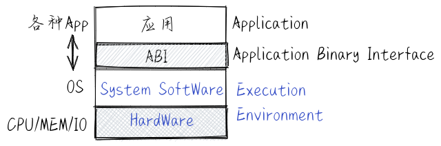
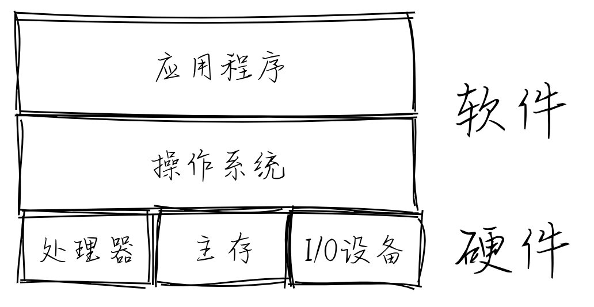

什麼是操作系統
================================================

.. toctree::
   :hidden:
   :maxdepth: 5

站在一萬米的代碼空間維度看
----------------------------------

.. chyyuu What is an Operating System? A historical investigation (1954–1964) Maarten Bullynck

一個操作系統（OS）是一個軟件，它幫助用戶和應用程序使用和管理計算機的資源。操作系統可能對最終用戶不可見，但它控制著嵌入式設備、更通用的系統（如智能手機、臺式計算機和服務器）以及巨型機等各種計算機系統。

今天，我們很難想象在沒有操作系統的情況下使用計算機，它塑造和構建了我們訪問計算機及其外圍設備的交互方式。當第一批電子計算機在第二次世界大戰後被開發出來時，還沒有操作系統這種軟件。在計算機誕生十年後，才首次出現某種操作系統的嘗試。又過了十年，操作系統才被大家廣泛接受。

我們的討論將集中在通用操作系統上，因為它們需要的技術是嵌入式系統所需技術的超集，對操作系統原理、概念和技術的覆蓋更加全面。現在的通用操作系統是一個複雜的系統軟件，比如 Linux 操作系統達到了千萬行的 C 源碼量級。在學習操作系統的初期，如果去分析瞭解這樣大規模的軟件，要付出巨大的代價，因此我們對其進行簡化，只討論最基本的功能。

系統軟件
~~~~~~~~~~~~~~~~~~~~~~~~~~~~~~~~~~~~~~~~~~~~~~~~~~~~~~~~~

系統軟件是為計算機系統提供基本功能，並在計算機系統範圍內使用的軟件，其作用可涉及到整個計算機系統。系統軟件包括操作系統內核、驅動程序、工具軟件、用戶界面、軟件庫等。操作系統內核是系統軟件的核心部分，負責控制計算機的硬件資源併為用戶和應用程序提供服務。驅動程序是操作系統用於控制硬件設備的軟件，如顯卡驅動、聲卡驅動和打印機驅動等。一般情況下，驅動程序是操作系統內核的一部分。

工具軟件是操作系統提供的用於維護、調試和優化計算機系統的軟件，如磁盤碎片整理工具、系統信息工具和病毒查殺工具等。用戶界面可以是圖形用戶界面 (GUI) 或命令行界面 (CLI)。圖形用戶界面是操作系統的一種常見用戶界面，它使用圖形元素（如圖標、菜單和按鈕）來幫助用戶使用操作系統。通常，圖形用戶界面提供了一個桌面環境，其中包含可以打開和關閉的窗口，用戶可以在其中運行應用程序和執行其他操作。

.. chyyuu    
   如果這樣來看，編輯類軟件，如 Vi、Emacs、MS Word等，只涉及到對文本文件的編輯，它們就不能算是系統軟件。

C 語言標準庫 libc（類似的有 Rust 標準庫 等）提供了與 OS 交互的系統調用接口，其功能覆蓋了整個計算機系統，會被許多不同的軟件訪問和調用。

從這個角度來看，操作系統是一種系統軟件。

執行環境
~~~~~~~~~~~~~~~~~~~~~~~~~~~~~~~~~~~~~~~~~~~~~~~~~~~~~~~~~

站在應用程序的角度來看，我們可以發現常見的應用程序其實是運行在由硬件、操作系統內核、運行時庫、圖形界面支持庫等所包起來的一個 :ref:`執行環境 (Execution Environment) <exec-env>` 中，如下圖所示。執行環境提供了運行應用軟件所需的運行時服務，包括內存管理、文件系統訪問、網絡連接等，這些服務大部分是由操作系統來提供的。應用程序只需根據與系統軟件約定好的應用程序二進制接口 (ABI, Application Binary Interface) 來請求執行環境提供的各種服務或功能，從而完成應用程序自己的功能。基於這樣的觀察，我們可以把操作系統的定義簡化為： **應用程序的軟件執行環境** 。這種概括性描述可以適用於操作系統發展的不同歷史時期。從這個角度出發，操作系統可以包括運行時庫、圖形界面支持庫等系統軟件。在 :ref:`後續小節“執行環境” <term-exec-env-define>` 中會對執行環境相關含義進行進一步的闡述。

操作系統的定義與組成
~~~~~~~~~~~~~~~~~~~~~~~~~~~~~~~~~~~~~~~~~~~~~~~~~~~~~~~~~

如果我們站在一萬米的高空來看 :ref:`操作系統 <computer-hw-sw>` ，可以發現操作系統這個系統軟件乾的事主要有兩件：一是向下管理並控制計算機硬件和各種外設，二是向上管理應用軟件並提供各種服務。我們可對其進一步定義為：操作系統是一種系統軟件，主要功能是向下管理CPU、內存和各種外設等硬件資源，並形成軟件執行環境來向上管理和服務應用軟件。這樣的描述也符合大多數操作系統教材上對操作系統的定義。為了完成這些工作，操作系統需要知道如何與硬件打交道，如何給應用軟件提供服務。這就有一系列與操作系統相關的理論、抽象、設計等來支持如何做和做得好這兩件事情。

如果看看我們的身邊， Android 應用運行在 ARM 處理器上的 Android 操作系統執行環境中；微軟的 Office 應用運行在 x86-64 處理器上的 Windows 操作系統執行環境中；Web Server應用運行在 x86-64 處理器上的 Linux 操作系統執行環境中；Web app 應用運行在 x86-64 或 ARM 處理器上的 Chrome OS 操作系統執行環境中。而在一些嵌入式環境中，操作系統以運行時庫的形式與應用程序緊密結合在一起，形成一個可在嵌入式硬件上執行的嵌入式應用。所以，在不同的應用場景下，操作系統的邊界也是不同的，我們可以把運行時庫、圖形界面支持庫等這些可支持不同應用的系統軟件 (System Software) 也看成是操作系統的一部分。

那操作系統的組成部分包含哪些內容呢？在一般情況下，操作系統的主要組成包括：

1. 操作系統內核：操作系統的核心部分，負責控制計算機的硬件資源併為用戶和應用程序提供服務。
2. 系統工具和軟件庫：為操作系統提供基本功能的軟件，包括工具軟件和系統軟件庫等。
3. 用戶接口：是操作系統的外殼，是用戶與操作系統交互的方式。用戶接口包括圖形用戶界面（GUI）和命令行界面（CLI）等。

而本書重點講述的對象是操作系統內核，它的主要組成部分包括：

1. 進程/線程管理：內核負責管理系統中的進程或線程，創建、銷燬、調度和切換進程或線程。
2. 內存管理：內核負責管理系統的內存，分配和回收內存空間，並保證進程之間的內存隔離。
3. 文件系統：內核提供文件系統接口，負責管理存儲設備上的文件和目錄，並允許應用訪問文件系統。
4. 網絡通信：內核提供網絡通信接口，負責管理網絡連接並允許應用進行網絡通信。
5. 設備驅動：內核提供設備驅動接口，負責管理硬件設備並允許應用和內核其他部分訪問設備。
6. 同步互斥：內核負責協調多個進程或線程之間對共享資源的訪問。同步功能主要用於解決進程或線程之間的協作問題，互斥功能主要用於解決進程或線程之間的競爭問題。
7. 系統調用接口：內核提供給應用程序訪問系統服務的入口，應用程序通過系統調用接口調用操作系統提供的服務，如文件系統、網絡通信、進程管理等。

下圖就是一個典型的UNIX操作系統的組成示意圖：

.. image:: ../../os-lectures/lec1/figs/ucorearch.png
   :align: center
   :scale: 100 %
   :name: unix-arch

站在計算機發展的時間尺度看
----------------------------------

雖然電子計算機的出現距今才僅僅七十年左右，但計算機技術和操作系統已經發生了巨大的變化。從計算機發展的短暫的歷史角度看，操作系統也是從計算機誕生大約十年後，從無到有地逐步發展起來的。操作系統主要完成硬件控制和為應用程序提供服務這些必不可少的功能，它的歷史與計算機的發展史密不可分。操作系統的內涵和功能隨著歷史的發展也在一直變化、改進中。如今在二十一世紀初期的大眾眼中，操作系統就是他們的手機/終端上的軟件系統，包括各種應用程序集合，圖形界面和網絡瀏覽器是其中重要的組成部分。

其實，操作系統的內涵和外延隨著歷史的發展也一直在變化，並沒有類似於“1+1=2”這樣的明確定義。參考地球生物的進化史，我們也給操作系統的進化歷史做一個簡單的概述，從中可以看到操作系統在各個時間段上包含什麼，具有什麼樣的特徵。但無論操作系統的內在實現和具體目標如何變化，其管理計算機硬件，給應用提供服務的核心定位沒有變化。

寒武紀生物大爆發時代 [#寒武紀]_
~~~~~~~~~~~~~~~~~~~~~~~~~~~~~~~~~~~~~~~~~~~~~~~~~~~~~~~~~

.. chyyuu https://en.wikipedia.org/wiki/Timeline_of_operating_systems  https://en.wikipedia.org/wiki/History_of_operating_systems https://computerhistory.org/ https://en.wikipedia.org/wiki/Comparison_of_operating_systems

在 1946 年出現電子計算機的時候，只有人類操作員（Operator）來管理和操作機器，還沒有操作系統（Operating System）這種事物 。啟動，扳開關，裝卡片/紙帶等比較辛苦的工作都是計算機操作員或者用戶自己完成。操作員/用戶帶著記錄有程序和數據的卡片 (Punch Card) 或打孔紙帶去操作計算機。裝好卡片/紙帶後，啟動卡片/紙帶閱讀器，把程序和數據讀入計算機內存中之後，計算機就開始工作，並把結果也輸出到卡片/紙帶或顯示屏上，最後程序停止。

隨著程序設計語言和編譯技術的進步，推動了程序員開發翻譯符號程序（即編譯器）來自動把代碼轉換成機器代碼，代替了以前低效的手工機器編碼的方式，提高了程序開發的效率。但程序執行的效率還很低。而且隨著計算機和 I/O 設備變得更強大，程序運行的時間減少了，相比之下，讓計算機運行的準備時間變得更長了，使得計算機的整體執行效率很低。

一般情況下，五十年代初期的計算機每次只能執行一個任務， CPU 大部分時間都在等待人類操作員的緩慢操作。由於過低的人工操作效率浪費了計算機的寶貴機時，所以就引入監控程序（Monitor）輔助完成輸入、輸出、加載、運行程序等工作，從而提高了使用計算機的效率。監控程序就是操作系統最開始的雛形，類似寒武紀生物大爆發中的著名生物--“三葉蟲”。在 1951-1954 年前後，Swinnerton-Dwyer 等在 EDSAC（Electronic Delay Storage Automatic Calculator）計算機上研製了監控程序，這也許是有記錄的最早操作系統雛形 [#UNIX25Y]_ 。這種類似監控程序的初級“輔助操作”過程一直持續到 20 世紀 50 年代中後期。

.. chyyuu http://www.ict.ac.cn/jssgk/lsyg/ http://www.wyzxwk.com/Article/chanye/2020/09/424229.html  https://www.ccf.org.cn/Computing_history/Full_List/2017/Second_class/2018-09-12/652328.shtml https://www.ccf.org.cn/Computing_history/Full_List/2020/First_class/2021-01-20/722002.shtml

在中國，計算機與操作系統相關技術的發展也很快。1958 年 8 月 1 日，在蘇聯專家的指導下，中科院計算所、第四機械工業部（電子工業部）等單位，仿製蘇聯 M-3 小型數字電子計算機，設計完成了中國第一臺以電子管為主的小型數字電子計算機 -- 103 型（即 DJS-1 型）計算機，這個計算機沒有監控程序。1959 年 10 月 1 日，中科院計算所、四機部等單位合作，仿照蘇聯 БЭCM-Ⅱ 大型機，製成了中國第一臺以電子管為主的大型通用數字電子計算機 -- 104 機。在 104 機上的軟件已經比較豐富了，包括具有前期操作系統雛形的自檢程序、標準子程序庫、自動更換地址程序，以及面向應用的算法語言與編譯系統。

.. note::

   **歷史的縮影 -- 寒武紀“三葉蟲”操作系統 -- LibOS**

   可以在 :ref:`本書第一章 <link-chapter1>` 看到初級的“三葉蟲”操作系統 -- LibOS 其實就是一個給應用提供各種服務（比如輸出字符串）的庫，方便了單一應用程序的開發與運行。

泥盆紀 [#泥盆紀]_ 魚類時代和二疊紀  [#二疊紀]_ 兩棲動物時代
~~~~~~~~~~~~~~~~~~~~~~~~~~~~~~~~~~~~~~~~~~~~~~~~~~~~~~~~~~~~~~~~~~~~~~~~~~~~~~~~

在 20 世紀 50~60 年代，計算機發展到大型機階段，計算能力和 I/O 處理能力進一步加強，存儲空間進一步擴展，應用領域逐步擴大，這使得所對應的各種早期操作系統具有多樣化、專用化的特點。計算機生產廠商設計出針對各自硬件的專用操作系統，且大部分用匯編語言編寫。這導致操作系統的開發效率不高，不具有跨硬件平臺的可移植性，進化比較緩慢。而且當時的處理器時間很寶貴，將計算機系統的一次使用過程限制在一個用戶範圍內是一種很大的浪費。例如，在早期計算機系統中，當用戶通過監控程序加載應用程序時，處理器保持空閒狀態，所有其他用戶的程序都不能執行。為提高計算機執行效率，操作系統進化在持續進行，從“手工操作”和“監控程序”階段進化到了“批處理 Batch”和“多道程序 Multiprogramming”階段。

批處理是指把一批作業（英文： **Job** ，古老的術語，可理解為現在的應用程序）以脫機方式（offline mode）輸入到磁帶上，並使這批作業能一個接一個地連續處理，流程如下：

1. 將磁帶上的一個作業裝入內存；
2. 操作系統把運行控制權交給該作業；
3. 當該作業處理完成後，控制權被交還給操作系統；
4. 重複 1-3 的步驟處理下一個作業直到所有作業處理完畢。

.. note::

   脫機方式（offline mode）

   基於脫機方式的操作是指沒有與計算機進行關聯所完成的操作。比如把包含程序的卡片放到卡片機上，把打印紙安裝到打印機上等。與此相反的是聯機方式（online mode）的操作，即通過與計算機相聯所完成的操作，比如計算機把正在運行的應用程序所計算出來的結果通過打印機打印到紙上。

   現在，脫機方式的操作更多的是指斷網下進行的操作，聯機方式是指在聯網下進行的操作。

這樣能充分地利用計算機系統：即儘量使該系統連續運行，減少 CPU 的空閒時間。批處理操作系統分為單道批處理系統和多道批處理系統。單道批處理操作系統只能管理內存中的一個（道）作業，無法充分利用大型計算機系統中的所有資源，致使系統整體性能較差。這就像泥盆紀 [#泥盆紀]_ 的史前魚類--鄧氏魚，有著堅硬的頭部鎧甲，很強壯，但運動緩慢，靈敏度低，離不開水。

.. note::

   **歷史的縮影 -- 泥盆紀“鄧氏魚”操作系統 -- BatchOS**
   
   可以在 :ref:`本書第二章 <link-chapter2>` 看到“鄧氏魚”操作系統 -- BatchOS ，雖然每次只能加載運行一個應用，但BatchOS通過硬件隔離機制讓 APP 與 OS 隔離，加強了系統安全，並在一定程度上提高了執行效率。

1956 年，鮑勃.帕特里克（Bob Patrick）在美國通用汽車的系統監督程序（system monitor）的基礎上，為美國通用汽車和北美航空公司在 IBM 704 計算機上設計了最早的批處理操作系統--GM-NAA I/O [#OSHISTORY]_ 。這個最早的操作系統已經具有了單道批處理系統的基本功能。

1964 年， IBM 公司開發了面向 System/360 系列大型計算機的統一可兼容的操作系統—— OS/360  [#MAN]_ ，它是一種多道批處理操作系統。多道批處理操作系統能管理內存中的多個（道）作業，可比較充分地利用計算機系統中的所有資源，提升系統整體性能。這裡的“多道”是指多個程序，即允許同時把多個程序放入內存，並允許它們交替在 CPU 中運行，它們共享系統中的各種硬、軟件資源。當一個程序因 I/O 請求而暫停運行時， CPU 便立即轉去運行另一個程序。這就像二疊紀  [#二疊紀]_ 的兩棲動物，當水中暫時有危險或食物不多的時候，可以離開水面到陸地上來，並享用陸地上的動植物資源。

.. chyyuu  https://blog.csdn.net/weixin_39716043/article/details/118742378 http://www.wyzxwk.com/Article/lishi/2021/12/445916.html http://www.wyzxwk.com/Article/chanye/2020/09/424229.html  https://www.zhihu.com/question/20984050 https://new.qq.com/omn/20210305/20210305A0G8VW00.html

然而，處理器共享產生了程序間隔離的需求，以避免出現一個程序中的運行錯誤使其他程序崩潰或損壞的情況。為此計算機中進一步添加了硬件級的內存保護機制，限制了一個程序在運行時能訪問的地址空間，提高了故障隔離的能力，並減少了隔離的開銷。另外，雖然批處理操作系統提高了系統的執行效率，但其缺點是人機交互性差，比如，批處理計算的一個實際挑戰是如何調試應用程序和操作系統本身。如果程序員的代碼出現錯誤，必須重新編碼，上傳內存，再執行。這需要花費以小時和天為單位的時間開銷，使得程序員修改和調試程序很不方便。實質上是將計算機重新變成單用戶系統。

1965 年 2 月，哈爾濱軍事工程學院（國防科技大學前身）慈雲桂教授等成功研製我國第一臺晶體管通用電子計算機 441B-I。441B-I 是中國第二代計算機，具有批處理功能的操作系統雛形、彙編語言、FORTRAN 語言及標準程序庫等豐富的軟件。

.. note::

   **歷史的縮影 -- 二疊紀“鋸齒螈”、三疊紀“始初龍”和三疊紀“腔骨龍”操作系統**

   在 :ref:`本書第三章 <link-chapter3>` 可以看到二疊紀“鋸齒螈”操作系統支持在內存中駐留多個應用，形成多道程序操作系統 -- Multiprog OS；三疊紀“始初龍”操作系統 -- Coop OS 進一步進化，支持協作式多道程序，即支持應用程序主動放棄 CPU 並切換到另一個應用繼續執行，從而提高系統整體執行效率；三疊紀“腔骨龍”操作系統 -- Timesharing OS 則可以搶佔應用的執行，從而可以公平和高效地分時執行多個應用，提高系統的整體效率。

侏羅紀 [#侏羅紀]_ 與白堊紀 [#白堊紀]_ 的恐龍時代
~~~~~~~~~~~~~~~~~~~~~~~~~~~~~~~~~~~~~~~~~~~~~~~~~~~~~~~~~~~~~

1965 年，時任仙童半導體公司研發總監的 Gordon Moore 在被要求預測未來半導體產業發展趨勢時提出：“當價格不變時，集成電路上可容納的晶體管數目每年便會增加一倍”，這被稱為摩爾定律。1975 年，Gordon Moore 的同事 David House 認為根據摩爾定律，計算機芯片的性能也將每 18 個月提升一倍。這種累積效應使得計算成本逐漸下降，使得軟件開發者不必將全部精力用於提高處理器利用率，而是可以開始努力提升用戶的使用體驗。例如，UNIX 是在 70 年代初在當時沒有人使用的備用計算機上開發的。20 世紀 50 年代末，提高人機交互方式的分時操作系統越來越嶄露頭角。分時是指多個用戶和多個程序以很小的時間間隔來共享使用同一臺計算機上的 CPU 和其他硬件資源。1961 年，麻省理工學院的 Fernando Corbató 帶領團隊成功研發了在 IBM 709 計算機上的 CTSS（Compatible Time-Sharing System， 兼容時間共享系統）操作系統 [#UNIX25Y]_ ，它擁有分時系統必須有的特徵：支持多個用戶分享使用同一臺計算機，即宏觀上的同一時間段內能完成多個人機交互工作。

在 CTSS 的鼓舞下，1964 年，麻省理工學院、貝爾實驗室及美國通用電氣公司共同研發一個目標遠大的操作系統：MULTICS（MULTiplexed Information and Computing System），它是一套安裝在大型主機上、支持多人多任務的操作系統。 MULTICS 以兼容分時系統（CTSS）做基礎，建置在美國通用電力公司的大型機 GE-645 ，目標是連接 1000 部終端機，支持 300 位用戶同時上線。因 MULTICS 的目標太宏大，而研發工作進度過於緩慢，1969 年 AT&T 的 Bell 實驗室從 MULTICS 研發中撤出。CTSS 和 MULTICS 這就像侏羅紀時期體型龐大的食肉恐龍--霸王龍，稱霸一時，但進化緩慢，最終滅絕。

但貝爾實驗室的兩位軟件工程師 Ken Thompson 與 Dennis Ritchie 借鑑了一些重要的 MULTICS 設計思想和理念，以 C 語言為基礎發展出小巧靈活的 UNIX 操作系統 [#UNIX]_ 。UNIX 操作系統的早期版本是完全免費的，可以輕易獲得並隨意修改，所以它得到了廣泛的接受。後來，它成為開發小型機操作系統的起點。由於早期的廣泛應用，它已經成為分時操作系統的典範。這好像一種生活在侏羅紀晚期的小型恐龍--始祖鳥，它可能是鳥類的祖先，最終進化為可以展翅高飛的飛鳥。

.. note::

   Ken Thompson 與 Dennis Ritchie 於 1974 年 7 月在 the Communications of the ACM 期刊上發表 “The UNIX Time Sharing System”，引起了學術界的廣泛興趣並向他們要源碼進行分析和學習，所以 Unix v5 以“僅用於教育目的”的開放協議，提供給各個大學作為操作系統教學之用，成為當時操作系統課程中的重要學習資料，而且各大學和公司開始進一步研究 Unix，並對 Unix 進行改進和擴展，從而使得 Unix 在世界上廣泛流行。

.. chyyuu https://new.qq.com/omn/20210305/20210305A0G8VW00.html

1973 年，南京大學徐家福、中科院軟件所仲萃豪、北京大學楊芙清合作，研製了系統程序設計語言 XCY。XCY 由徐(Xu)家福、仲萃(Cui)豪、楊(Yang)芙清的姓名漢語拼音各取一個字母組成。南京大學的開發小組還用 XCY 語言編寫開發了 240 機的 DJS200/XT I、DJS200/XT II、XW 等具有分時和進程管理能力的通用操作系統。

.. note::

   **歷史的縮影 -- 侏羅紀和白堊紀的操作系統**

   侏羅紀和白堊紀是恐龍稱霸地球的最後繁榮時期。侏羅紀“頭甲龍”操作系統、白堊紀“傷齒龍”操作系統、白堊紀“霸王龍”操作系統、白堊紀“迅猛龍”操作系統、白堊紀“達科塔盜龍”操作系統、白堊紀“慈母龍”操作系統可以在 :ref:`本書第四章 <link-chapter4>` 到  :ref:`本書第八章 <link-chapter8>` 中看到。

   :ref:`第四章 <link-chapter4>` 的侏羅紀“頭甲龍”操作系統 -- “Address Space OS”主要解決多個應用所在內存隔離的問題，從而確保應用之間不會相互破壞各自的內存空間，並進一步發展出地址空間、虛擬內存等操作系統核心概念。

   :ref:`第五章 <link-chapter5>` 的白堊紀“傷齒龍”操作系統 -- “Process OS”主要解決多個應用靈活創建與執行的問題，並進一步發展出進程、調度等操作系統核心概念。

   :ref:`第六章 <link-chapter6>` 的白堊紀“霸王龍”操作系統-- “Filesystem OS”主要解決數據持久保存的應用需求，並進一步提出文件的概念，並且把文件與地址空間作為進程的資源來進行管理，綜合了操作系統三大核心概念。

   :ref:`第七章 <link-chapter7>` 的白堊紀“迅猛龍”操作系統 -- “IPC OS”主要解決進程間的數據交換與信息通知的應用需求，並把部分IPC功能建立在文件的抽象之下，簡化了應用開發的複雜性。

   :ref:`第八章 <link-chapter8>` 的白堊紀“達科塔盜龍”操作系統 -- “Thread OS”支持線程抽象，把線程作為處理器的調度單位，併成為進程資源管理的一部分內容。線程間通過共享進程的地址空間建立了線程間共享數據和進行數據交換的基礎。而白堊紀“慈母龍”操作系統 -- “SyncMutex OS”通過建立同步互斥機制來讓線程間能夠有序、互斥地訪問共享資源，從而讓基於多線程的應用 能夠高效正確地完成任務。

古近紀 [#古近紀]_ 哺乳動物時代
~~~~~~~~~~~~~~~~~~~~~~~~~~~~~~~~~~~~~~~~~~~~~~~~~~~~

20 世紀 70 年代中後期，微型處理器的快速發展使計算機的應用普及至中小企業及個人愛好者，推動了PC（Personal Computer，個人計算機）的發展，也進一步推動了面向一般大眾使用的操作系統的出現。其代表是由微軟公司在 20 世紀 80 年代為個人計算機開發（實際是購買）的 DOS 操作系統，其特點是簡單易用。後來又開發了有圖形用戶界面（GUI）的操作系統--MS Windows，極大地簡化了一般用戶使用計算機的難度，使得個人計算機得到了快速的普及和廣泛的使用。這裡需要注意的是，第一個帶 GUI 界面的個人計算機原型起源於偉大卻又讓人扼腕嘆息的施樂帕洛阿圖研究中心（PARC, Palo Alto Research Center），PARC 研發出的帶有圖標、彈出式菜單和重疊窗口的圖形交互界面 (GUI, Graphical User Interface)，可利用鼠標的點擊動作來進行操控，這是當今我們所使用的 GUI 系統的基礎。支持便捷的圖形交互界面也成為自 20 世紀 70 年代以來操作系統的主要特徵之一。這就像古近紀 [#古近紀]_ 的哺乳動物，能在陸上跑，空中飛和水裡遊，有很強的適應性和生存能力。

.. chyyuu http://news.newhua.com/news/2009/1224/82274.shtml https://baike.baidu.com/item/CCDOS/2782730 https://zhuanlan.zhihu.com/p/161170166

1980 年左右，用於遠望號測量船的多機實時操作系統 GX-73 誕生了。1983 年，國防科技大學研製了中國第一臺億次巨型機 -- 銀河-I，並研製了配套的多道批處理操作系統 -- YHOS。同年，電子工業部第六研究所設計實現了面向微型計算機的操作系統 CCDOS（漢字磁盤操作系統，英語：Chinese Characters Disk Operation System），這是一個基於微軟公司 DOS 微機操作系統的漢化版本。80 年代到 90 年代，微軟的 DOS 操作系統和後繼的 Windows 操作系統和 Intel 公司的 x86 處理器相互支持，形成了 Wintel 聯盟，逐漸在桌面計算機市場上被廣泛使用。中國的操作系統主要集中在使用範圍較小的科研領域。1989 - 1997 年這段時間，中國計算機服務總公司與中國軟件技術公司聯合國內高校和科研院所，共同承擔了開發與 UNIX 兼容的 COSIX 操作系統的科技攻關計劃。COSIX 取得了很多科研成果，但由於沒基於新的硬件進行研發等多種因素，最終沒有形成廣泛的操作系統產業生態。

.. note::

   **歷史的縮影 -- “侏羅獵龍”操作系統**

   在哺乳動物之前已經出現了具有靈巧感知能力的生物，這就是晚侏羅紀的侏羅獵龍。它體型小巧，有著適應微光環境的大眼睛和具備壓力感應能力的神奇鱗片，能夠發現外部環境的微小變化，這種“小巧靈敏”的特徵為後續哺乳動物的生物進化開闢了一個方向。 :ref:`第九章 <link-chapter9>` 的“侏羅獵龍”操作系統 -- “Device OS”支持與新增的鍵盤、鼠標、GPU 等多種 Virtio 外設的交互，可以形成初級的人機交互 GUI 能力，而且支持在內核中響應中斷來降低 I/O 響應的總體延遲。這在某種程度上體現了當前廣泛使用的有圖形界面的桌面/移動終端操作系統的基本特徵。

第四紀智人時代 [#人類簡史]_
~~~~~~~~~~~~~~~~~~~~~~~~~~~~~~~~~~~~~~~~~~~~~~~~~~~~~

21 世紀以來， Internet 和移動互聯網的迅猛發展，使得在服務器領域和個人終端的應用與需求大增，數據中心和個人終端已經進入了人們的日常生活中。現在我們擁有種類繁多的計算設備，在這些設備上運行著許多不同的操作系統，操作系統設計者面臨的功能權衡取決於硬件的物理能力以及應用程序和用戶需求。下面是一些目前常見類型的操作系統：

- 面向服務器的操作系統：當前大家常用的主流搜索引擎、新媒體、電子商務網站和大數據處理系統等一般都託管在數據中心的計算機上。每臺計算機都是強大的服務器，運行著服務器操作系統，典型的例子是 Linux。通常每臺服務器只運行一個應用服務程序，例如數據庫服務器或 Web 服務器等，用於處理成千上萬個用戶傳入的網絡服務請求，所以吞吐量（每秒處理的請求數量）是一個關鍵的優化目標。而安全和可靠也是服務器操作性系統需要重點關注的目標。服務器操作系統的一種形態是虛擬機（Virtual Machine Monitor，VMM），它可在一臺物理機上虛擬出多臺虛擬計算機，可以像運行應用程序一樣運行另一個操作系統。通過虛擬機可以充分利用數據中心中資源利用率不高的物理服務器，提高整個數據中心的運行效率。典型的服務器操作系統有：FreeBSD、微軟的Windows Server、基於 Linux 系的 RHLS、Ubuntu、openEuler、龍蜥操作系統、麒麟服務器操作系統等。

- 面向臺式機/筆記本電腦和上網本的操作系統：典型的例子是：Windows、Mac OS X、Linux、Chrome OS等。這些操作系統主要面向單個用戶，運行許多應用程序，並具有各種 I/O 設備。有人可能認為只有一個用戶，就沒有必要將系統設計為支持多用戶共享，這會使得操作系統設計更加簡單，但安全性相對弱一些。

- 面向智能移動終端（手機/平板）的操作系統：智能移動終端是一種帶有強大處理器的手機或平板，能夠運行第三方應用程序。智能移動終端操作系統的典型例子包括 兩個霸主 iOS、Android，和曾經輝煌過的 Symbian，還有幾乎快消失的 WebOS、Blackberry OS 和 Windows Phone 等。智能移動終端一般只有一個用戶，對交互響應能力、長效的電池使用時間和各種應用的支持有著迫切的需求。

- 嵌入式操作系統：隨著物聯網的發展，處理器芯片可以集成到各種的消費設備中，從機頂盒、手錶到機器人等，形成各種物聯網中的嵌入式設備。這些嵌入式設備的功能相對單一，通常運行嵌入式操作系統。典型的嵌入式操作系統有 嵌入式 Linux、VxWorks、FreeRTOS、RT-Thread、SylixOS 等。預計在下一個十年，通過面向物聯網設備的操作系統，可以把各種嵌入式設備連接在一起，實現靈活多變的功能協同與組合，形成萬物互聯的新應用場景和生態。

從上面的簡介，我們可以看到，iOS 和 Android 操作系統是 21 世紀個人終端操作系統的代表，Linux 在巨型機到數據中心服務器操作系統中佔據了統治地位。以 Android 系統為例，Android 操作系統是一個包括 Linux 操作系統內核、基於 Java 的中間件、用戶界面和關鍵應用軟件的移動設備軟件棧集合。這裡介紹一下廣泛用在服務器領域、智能移動終端和嵌入式系統中的操作系統內核--Linux 操作系統內核。1991 年 8 月，芬蘭學生 Linus Torvalds \(林納斯·託瓦茲\) 在 comp.os.minix 新聞組貼上了以下這段話： 

  ＂你好，所有使用 minix 的人 -我正在為 386 ( 486 ) AT 做一個免費的操作系統（只是為了愛好）...″

而他所說的“愛好″成為了大家都知道的 Linux 操作系統內核。這個時代的操作系統的特徵是聯網，提高網絡的吞吐量，並降低傳輸延遲是這個時代的網絡操作系統追求的目標。 Linux 就像是第四紀出現的智人，橫掃陸地上的各種強大生物，出現在生物界的頂端，統治了整個地球。

.. chyyuu  https://www.163.com/dy/article/FIIMV82I0538KQKE.html https://blog.csdn.net/itmaster/article/details/27901

中國對 Linux 系統的引進源於在芬蘭讀博士的宮敏。1994 年，他回國休假，隨手帶了 20 張磁盤、存儲了 80GB 的自由軟件，其中就有 Linux。由於 Linux 基於 GPL 協議開放源代碼， Linux 在國內的高校中被小範圍傳播。從 1999 年起，國內出現了很多基於 Linux 的操作系統公司，出現了Xteam、藍點、中科紅旗、銀河麒麟、中軟 Linux 等幾十種發行版。但這些發行版大多數基於 Fedora/CentOS/Debian/Ubuntu 進行二次開發，並沒有形成桌面計算機的應用生態，在二十年左右的時間內，大部分發行版都退出了。目前（2019 年之後）在桌面計算機領域，麒麟操作系統和統信 UOS 操作系統目前有比較好的應用發展趨勢。在服務器領域，華為的 openEuler 操作系統和阿里的龍蜥操作系統藉助於雲計算的快速發展，形成了較好的雲應用生態。在嵌入式操作系統領域，國內有不少有技術特色的操作系統，主要代表是 RT-Thread、SylixOS、LiteOS 等。

.. chyyuu note::

   目前支持聯網的操作系統設計實現在本書中還沒有對應的章節。但其操作系統的內核其實與分時操作系統的設計實現思路基本是一致的。在本書設計的簡單分時操作系統的基礎上，添加一個網卡外設的驅動和一個簡單的網絡協議棧，也許是另一個有趣的操作系統實驗內容。

二十一世紀神人時代 [#未來簡史]_
~~~~~~~~~~~~~~~~~~~~~~~~~~~~~~~

當前，大數據、人工智能、機器學習、高速移動互聯網絡、AR/VR 對操作系統等系統軟件帶來了新的挑戰。如何有效支持和利用這些技術是未來操作系統的方向。我們看到了華為逐步推出的 OpenHarmony 系統；小米也推出了物聯網軟件平臺小米 Vela ；阿里推出了 AliOS Thing；騰訊推出了Tencent OS；蘋果公司接連推出 A14、M1 等基於 ARM 的 CPU，逐步開始淘汰 X86 CPU；微軟推出 Windows 10 IoT，Google 推出 Fuchsia OS。大家都在做著各種位於雲、邊、端操作系統的技術調整和創新，構建多種形態的網絡基礎設施。可以發現操作系統的外延在放大，位於雲、邊、端的操作系統通過多種形態的網絡基礎設施，跳出了傳統單機為主的運行模式，支持應用程序在分佈式環境下的互聯、互通以及互操作，從而進一步延伸為分佈式操作系統。

另外，隨著人工智能和機器學習的快速發展，下一個與人工智能充分融合並帶有分佈式特徵的操作系統即將到來，並試圖通過這種操作系統帶來的連貫用戶體驗，打通從數據中心、服務器、桌面、移動端、邊緣設備等的整個 AI 和物聯網 (IoT, Internet of Things) 的生態。也許這種未來操作系統與之前的操作系統相比，其最大的不同是具有了人工智能的屬性，跳出了單個設備節點，通過多種網絡從不同維度來管理多個設備。這種操作系統也許就是尤瓦爾·赫拉利所著的《未來簡史》 [#未來簡史]_ 中描述的“無所不能”的神人操作系統。

目前支持 AIoT 的操作系統設計實現在本書中還沒有對應的章節，不過我們的同學也設計了 `zCore操作系統 <https://github.com/rcore-os/zCore>`_ ，歡迎看完本書的同學能夠嘗試參與或獨立設計面向未來的操作系統。

 
.. chyyuu https://www.sohu.com/a/323094413_783821 https://it.sohu.com/20050117/n223974639.shtml  https://www.museum.uestc.edu.cn/info/1184/2337.htm

.. [#寒武紀] 5億年前的寒武紀期間生物種類突然豐富起來，呈爆炸式的增加，期間的典型生物是三葉蟲。
.. [#泥盆紀] 4億年前的泥盆紀期間魚類空前繁榮，並在晚期出現了兩棲動物。
.. [#二疊紀] 3億年前的二疊紀期間是一個承上啟下的階段，兩棲類動物最繁盛，爬行動物逐漸繁榮。 
.. [#侏羅紀] 2億年前的侏羅紀期間溫暖潮溼，爬行類動物的代表--恐龍成為當時的統治者，哺乳動物開始發展。
.. [#白堊紀] 1億年前的白堊紀期間溫暖乾旱，恐龍經歷了從鼎盛到滅絕的巨大變化，哺乳動物興起。
.. [#古近紀] 0.6億年前的古近紀時期，哺乳動物迅速發展，且形態多樣化，逐漸統治了地面。
.. [#人類簡史] 尤瓦爾·赫拉利所著的“人類簡史” 書中提到的智人遍佈地球，可類比現在的Linux 。
.. [#未來簡史] 尤瓦爾·赫拉利所著的“未來簡史” 書中描述的神人可類比於未來支持AI的分佈式操作系統 。
.. [#UNIX25Y] Peter H.Salus, A Quarter Century of UNIX, Addison-Wesley Publishing, 1997
.. [#UNIX] Brain W. Kernighan, UNIX: A History and a Memoir, Independently published, 2020 
.. [#OSHISTORY] Maarten Bullynck, What is an Operating System? A historical investigation (1954–1964), https://halshs.archives-ouvertes.fr/halshs-01541602/document
.. [#MAN] 布魯克斯(Brooks, F. P.), 人月神話(40週年中文紀念版),2015
