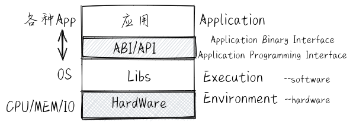
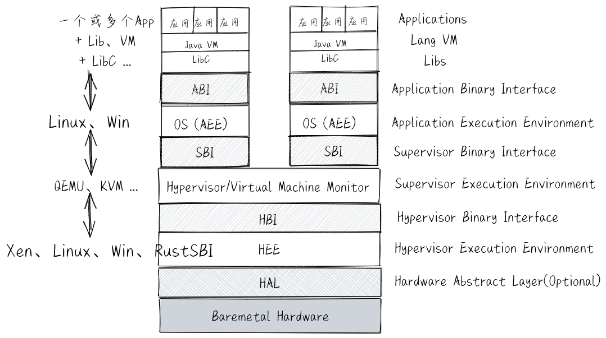
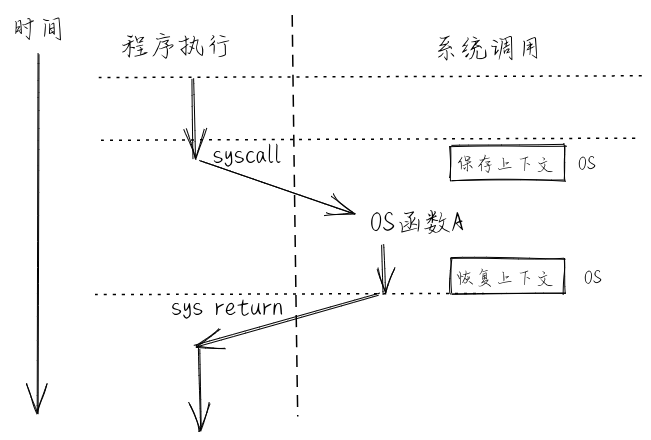
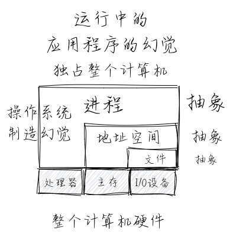
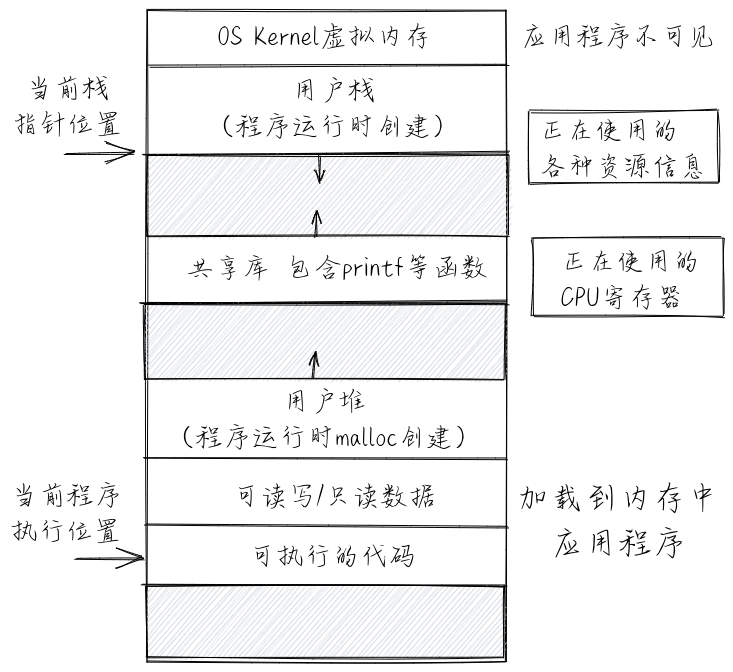
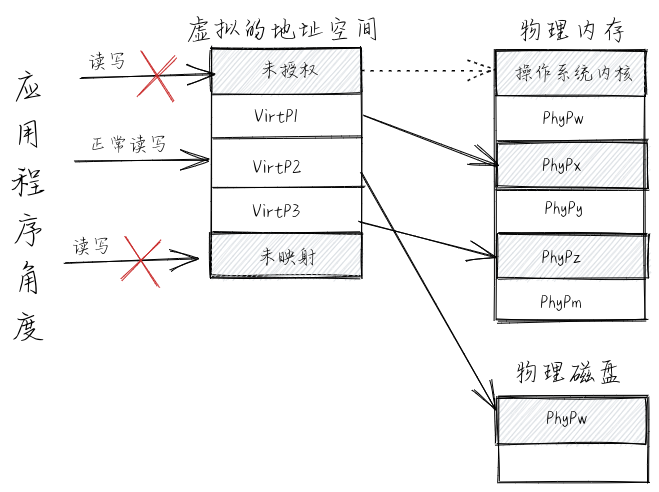
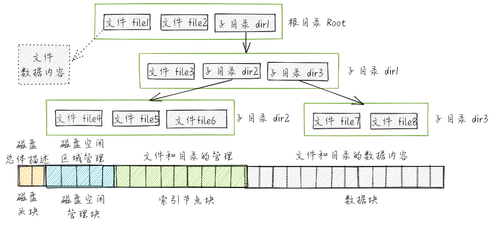

操作系統抽象
================================================

.. toctree::
   :hidden:
   :maxdepth: 5

..
  chyyuu：我覺得需要給出執行環境（EE），Task，...，上下文（函數，trap,task，進程...），執行流等的描述。
  並且有一個圖，展示這些概念的關係。這些概念能夠有鏈接，指向進一步實際定義或使用的地方。

接下來同學可站在操作系統實現的角度來看操作系統。操作系統為了能夠更好地管理計算機系統併為應用程序提供便捷的服務，在計算機和操作系統的技術研究和發展的過程中，形成了一系列的核心（抽象）概念：執行環境、進程、地址空間和文件，這些奠定了操作系統內核設計與實現的基礎。

.. note::

   在本書中，關於執行環境、進程、地址空間和文件的抽象表示不會僅僅就是一個文字描述，還會在後續章節關於具體操作系統設計與運行的講述中，以具體化的靜態數據結構、動態執行導致計算機中物理/虛擬資源的改變來展示。從而讓同學能夠建立操作系統抽象概念與操作系統具體實現之間的內在聯繫。

.. _term-exec-env-define:

執行環境
----------------------------------------

**執行環境** (Execution Environment) 是一個內涵很豐富且有一定變化的術語，它主要負責給在其上執行的軟件提供相應的功能與資源，並可在計算機系統中形成多層次的執行環境。對於現在直接運行在裸機硬件 (Bare-Metal) 上的操作系統，其執行環境是 *計算機的硬件* 。計算機剛剛誕生時，還沒有操作系統的概念，對於直接運行在裸機硬件上的應用程序而言，其執行環境也是 *計算機的硬件* 。 隨著計算機技術的發展，應用程序下面形成了一層比較通用的函數庫，這使得應用程序不需要直接訪問硬件了，它所需要的功能（比如顯示字符串）和資源（比如一塊內存）都可以通過函數庫的函數來幫助完成。在第二個階段，應用程序的執行環境就變成了 *函數庫* -> *計算機硬件* ，而這時函數庫的執行環境就是計算機的硬件。

再進一步，操作系統取代了函數庫來訪問硬件，函數庫通過訪問操作系統的系統調用服務來進一步給應用程序提供豐富的功能和資源。在第三個階段，應用程序的執行環境就變成了 *函數庫* -> *操作系統內核* -> *計算機硬件* 。在後面又出現了基於 Java 語言的應用程序，在函數庫和操作系統之間，多了一層 Java 虛擬機，此時 Java 應用程序的執行環境就變成了 *函數庫* -> *Java 虛擬機* -> *操作系統內核* -> *計算機硬件* 。在雲計算時代，在傳統操作系統與計算機硬件之間多了一層 Hypervisor/VMM ，此時應用程序的執行環境變成了 *函數庫* -> *Java 虛擬機* -> *操作系統內核* -> *Hypervisor/VMM* -> *計算機硬件* 。這裡可以看到，隨著軟件需求的多樣化和複雜化， **執行環境的層次** 也越來越多。

.. _term-ee-switch:

另外，CPU在執行過程中，可以在不同層次的執行環境之間切換，這稱為 **執行環境切換** 。執行環境切換主要是通過特定的 API 或 ABI 來完成的，這樣不同執行環境的軟件就能實現數據交換與互操作，而且還保證了彼此之間有清晰的隔離。

對於應用程序的執行環境而言，應用程序只能看到執行環境直接提供給它的接口（API 或 ABI），這使得應用程序所能得到的服務取決於執行環境提供給它的訪問接口。所以，操作系統可以看成是應用程序執行環境，其形態可以是一個庫，也可以是一個虛擬機等，或者它們的某種組合形式。比如， 手機上的 **Android操作系統** 是 Android 應用程序的執行環境，它包括了庫形態的 Framework 層，執行 Java 程序的虛擬機層，與操作系統交互的系統類 C 庫和 Linux kernel。運行在服務器上的 **麒麟服務器操作系統** 、 **openEuler 服務器操作系統** 、 **龍蜥服務器操作系統** 、 **RHEL-RedHat 服務器操作系統** 是各種服務器應用軟件， 如Web Server 應用、數據庫等的執行環境，這些操作系統都包含了與操作系統交互的系統類 C 庫、Java 虛擬機、容器系統、VMM 虛擬機系統等和Linux kernel。

基於上面的介紹，我們可以給應用程序的執行環境一個基本的定義：執行環境是應用程序正確運行所需的服務與管理環境，用來完成應用程序在運行時的數據與資源管理、應用程序的生存期等方面的處理，它定義了應用程序有權訪問的其他數據或資源，並決定了應用程序的行為限制範圍。

.. note::

   在本書中，我們將主要側重設計與實現類似 Linux kernel 這樣的 **操作系統內核** 形態的執行環境。

.. _term-ccf:

普通控制流
^^^^^^^^^^^^^^^^^^^^^^^^^^^^^^^^^^^^^^

各種應用程序在執行環境中執行其功能，而具體如何執行，取決於 **程序的控制流** 。回顧一下編譯原理課上的知識，程序的控制流 (Flow of Control or Control Flow) 是指以一個程序的指令、語句或基本塊為單位的執行序列。再回顧一下計算機組成原理課上的知識，處理器的控制流是指處理器中程序計數器的控制轉移序列。最簡單的一種控制流（沒有異常或中斷產生的前提下）是一個“平滑的”序列，其中每個要執行的指令地址在內存中都是相鄰的。如果站在程序員的角度來看控制流，會發現控制流是程序員編寫的程序的執行序列，這些序列是程序員預設好的。程序運行時能以多種簡單的控制流（順序、分支、循環結構和多層嵌套函數調用）組合的方式，來一行一行的執行源代碼（以編程語言級的視角），也是一條一條的執行彙編指令（以彙編語言級的視角）。對於上述的不同描述，我們可以統稱其為 **普通控制流** (CCF，Common Control Flow，簡稱 控制流) 。在應用程序視角下，它只能接觸到它所在的執行環境，不會跳到其他執行環境，所以應用程序執行基本上是以普通控制流的形式完成整個運行的過程。

.. _term-ecf:

異常控制流
^^^^^^^^^^^^^^^^^^^^^^^^^^^^^^^^^^^^^^

應用程序在執行過程中，如果發出系統調用請求，或出現外設中斷、CPU 異常等情況，處理器執行的前一條指令和後一條指令將會位於兩個完全不同的位置，即不同的執行環境 。比如，前一條指令還在應用程序的代碼段中，後一條指令就跑到操作系統的代碼段中去了，這就是一種控制流的“突變”，即控制流脫離了其所在的執行環境，併產生 :ref:`執行環境的切換 <term-ee-switch>`。 我們把這種“突變”的控制流稱為 **異常控制流** (ECF, Exceptional Control Flow) 。

應用程序 *感知* 不到這種異常的控制流情況，這主要是由於操作系統把這種情況 *透明* 地進行了執行環境的切換和對各種異常情況的處理，讓應用程序從始至終地 *認為* 沒有這些異常控制流的產生。

簡單地說， **異常控制流** 是處理器在執行過程中的突變，其主要作用是通過硬件和操作系統的協同工作來響應處理器狀態中的特殊變化。比如當應用程序正在執行時，產生了時鐘外設中斷，導致操作系統打斷當前應用程序的執行，轉而進入 **操作系統** 執行環境去處理時鐘外設中斷。處理完畢後，再回到應用程序中被打斷的地方繼續執行。

.. note::

   本書是從操作系統的角度來給出的異常控制流的定義。

   在《深入理解計算機系統（CSAPP）》 [#CSAPP]_ 中，對異常控制流也給出了相關定義：
   系統必須能對系統狀態的變化做出反應，這些系統狀態不是被內部程序變量捕獲，也不一定和程序的執行相關。現代系統通過使控制流發生突變對這些情況做出反應。我們稱這種突變為異常控制流( Exceptional Control Flow, ECF)
   
   我們這裡的異常控制流不涉及C++/Java等編程語言級的exception機制。

.. _term-context:
.. _term-ees:

控制流上下文（執行環境的狀態）
^^^^^^^^^^^^^^^^^^^^^^^^^^^^^^^^^^^^^^

站在硬件的角度來看普通控制流或異常控制流的具體執行過程，我們會發現從控制流起始的某條指令執行開始，指令可訪問的所有物理資源的內容，包括自帶的所有通用寄存器、特權級相關特殊寄存器、以及指令訪問的內存等，會隨著指令的執行而逐漸發生變化。

這裡我們把控制流在執行完某指令時的物理資源內容，即確保下一時刻能繼續 *正確* 執行控制流指令的物理資源內容稱為控制流的 **上下文** (Context) ，也可稱為控制流所在執行環境的狀態。

我們這裡說的控制流的上下文是指僅會影響控制流正確執行的有限的物理/虛擬資源內容。這裡需要理解程序中控制流的上下文對程序 *正確* 執行的影響。如果在某時刻，由於某種有意或無意的原因，控制流的上下文發生了變化（比如某個寄存器的值變了），但並不是由於程序的控制流本身的指令導致的，這就會使得接下來的程序指令執行出現偏差，並最終導致執行過程或執行結果不符合預期，這種情形稱為 **程序執行錯誤** 。 而操作系統有責任來保護應用程序中控制流的上下文，以讓應用程序得以正確執行。

.. note::

   * 物理資源：即計算機硬件資源，如CPU的寄存器、可訪問的物理內存等。
   * 虛擬資源：即操作系統提供的資源，如文件，網絡端口號，網絡地址，信號等。

如果一個控制流屬於某個函數，那麼這個控制流的上下文簡稱為函數調用上下文。如果一個控制流屬於某個應用程序，那麼這個控制流的上下文簡稱為應用程序上下文。如果把某 :ref:`進程 <term-process>` 看做是運行的應用程序，那麼這個屬於某個應用程序的控制流可簡稱為某進程上下文。如果一個控制流屬於操作系統，那麼這個控制流的上下文簡稱為操作系統上下文。如果一個控制流是屬於操作系統中處理中斷/異常/陷入的那段代碼，那麼這個控制流的上下文簡稱為中斷/異常/陷入的上下文。

在 CPU 不斷執行指令的過程中，各種前綴的上下文（執行環境的狀態）會不斷地變化。如果出現了處理器在執行過程中的突變（即異常控制流）或轉移（如多層函數調用），需要由維持執行環境的軟硬件協同起來，保存發生突變或轉移前的控制流上下文，即當前執行環境的狀態（比如突變或函數調用前一刻的指令寄存器，棧寄存器和其他一些通用寄存器等內容），並在完成突變處理或被調用函數執行完畢後，恢復突變或轉移前的控制流上下文。這是由於完成與突變相關的執行會破壞突變前的控制流上下文（比如上述各種寄存器的內容），導致如果不保存之前的控制流上下文，就無法恢復到突變前正確的執行環境，繼續正常的普通控制流的執行。

對於異常控制流的上下文保存與恢復，主要是通過 CPU 和操作系統（手動編寫在棧上保存與恢復寄存器的指令）來協同完成；對於函數轉移控制流的上下文保存與恢復，主要是通過編譯器（自動生成在棧上保存與恢復寄存器的指令）來幫助完成的。

在操作系統中，需要處理三類異常控制流：外設中斷 (Device Interrupt) 、陷入 (Trap) 和異常 (Exception，也稱Fault Interrupt)。

.. chyyuu 可以不要
   .. _term-execution-flow:

   執行流或執行歷史
   ^^^^^^^^^^^^^^^^^^^^^^^^^^^^^^^^^^^^^^

   無論是操作系統還是應用程序，它在某一段時間上的執行過程會讓處理器執行一系列程序的指令，並對計算機的物理資源的內容（即上下文）進行了改變。如果結合上面的抽象概念更加細緻地表述一下，可以認為在它從開始到結束的整個執行過程中，截取其中一個時間段，在這個時間段中，它所執行的指令流形成了這個時間段的控制流，而控制流中的每條執行的指令和它執行後的上下文，形成由二元組<指令指針，上下文>（<pc，context>）構成的有序序列，我們用 **執行流** (Execution Flow) 或 **執行歷史** (Execution History) 來表示這個二元組有序序列。它完整描述了操作系統或應用程序在一段時間內執行的指令流以及計算機物理資源的變化過程。

異常控制流：中斷
^^^^^^^^^^^^^^^^^^^^^^^^^^^^^^^^^^^^^^

外設 **中斷** (Interrupt) 是指由外部設備引起的外部 I/O 事件，如時鐘中斷、控制檯中斷等。外設中斷是異步產生的，與處理器的執行無關。產生中斷後，操作系統需要進行中斷處理來響應中斷請求，這會破壞被打斷前應用程序的控制流上下文，所以操作系統要保存與恢復被打斷前應用程序的控制流上下文。

.. image:: interrupt.png
   :align: center
   :name: interrupt

異常控制流：異常
^^^^^^^^^^^^^^^^^^^^^^^^^^^^^^^^^^^^^^

**異常** (Exception) 是在處理器執行指令期間檢測到不正常的或非法的內部事件（如 x86 平臺上的除零錯、地址訪問越界）。產生異常後，操作系統需要進行異常處理，這會破壞被打斷前應用程序的控制流上下文，所以操作系統要保存與恢復被打斷前應用程序的控制流上下文。

.. note::

   如果是應用程序產生的不可恢復的異常，操作系統有權直接終止該應用程序的執行。

.. image:: exception.png
   :align: center
   :name: exception

異常控制流：陷入
^^^^^^^^^^^^^^^^^^^^^^^^^^^^^^^^^^^^^^

**陷入** (Trap) 是程序在執行過程中由於要通過系統調用請求操作系統服務而有意引發的事件。產生陷入後，操作系統需要執行系統調用服務來響應系統調用請求，這會破壞陷入前應用程序的控制流上下文，所以操作系統要保存與恢復陷入前應用程序的控制流上下文。

在後面的敘述中，如果沒有特別指出，我們將用簡稱中斷、陷入、異常來區分這三種異常控制流。

.. note::
   
   本書是從操作系統的角度來給出的中斷 (Interrupt) 、陷入 (Trap) 和異常（Exception）的定義。

   在不同的書籍中，對於中斷、陷入和異常的定義會有一些差別。有的書籍把中斷、陷入和異常都統一為一種中斷，表示程序的當前控制流被打斷了，要去執行不屬於這個控制流的另外一個沒有程序邏輯先後關係的控制流；也有書籍把這三者統一為一種異常，表示相對於程序的正常控制流而言，出現了一種沒有程序邏輯先後關係的異常控制流。甚至也有書籍把這三者統一為一種陷入，表示相對於程序的正常控制流而言，CPU 會陷入到操作系統內核中去執行。

   在 RISC-V 的特權級規範文檔中，異常指的是由於 CPU 當前指令執行而產生的異常控制流，中斷指的是與 CPU 當前指令執行無關的異常控制流，中斷和異常統稱為陷入。當中斷或異常觸發時，我們首先進行統一的陷入處理流程，隨即根據 ``mcause/scause`` 等寄存器的內容判定目前觸發的是中斷還是異常，再對應進行處理。在操作系統意義上的陷入，在 RISC-V 的語境下屬於異常的一部分。另外，在 x86 架構下的“軟件中斷”（也即指令 ``int 0x80`` ）可以理解為操作系統意義上的陷入，但在 RISC-V 語境下軟件中斷表示一種特殊的處理核間中斷。
   
   這些都是從不同的視角來闡釋中斷、陷入和異常，並沒有一個唯一精確的解釋。對於同學而言，重點是瞭解這些術語在後續章節的操作系統設計實現中所表示的具體含義和特徵。   

.. _term_process:

進程
----------------------------------

站在應用程序自身的角度來看，進程 (Process) 的一個經典定義是一個正在運行的程序實例。當程序運行在操作系統中的時候，從程序的視角來看，它會產生一種“幻覺”：即該程序是整個計算機系統中當前運行的唯一的程序，能夠獨佔使用處理器、內存和外設，而且程序中的代碼和數據是系統內存中唯一的對象。

然而，這種“幻覺”是操作系統為了便於應用的開發且不損失安全性刻意為應用程序營造出來的，它具體表現為“進程”這個抽象概念。站在計算機系統和操作系統的角度來看，並不存在這種“幻覺”。事實上，在一段時間之內，往往會有多個程序同時或交替在操作系統上運行，因此程序並不能獨佔整個計算機系統。具體而言，進程是應用程序的一次執行過程。並且在這個執行過程中，由“操作系統”執行環境來管理程序執行過程中的 **進程上下文** -- 一種控制流上下文。這裡的進程上下文是指程序在運行中的各種物理/虛擬資源（寄存器、可訪問的內存區域、打開的文件、信號等）的內容，特別是與程序執行相關的具體內容：內存中的代碼和數據，棧、堆、當前執行的指令位置（程序計數器的內容）、當前執行時刻的各個通用寄存器中的值等。進程上下文如下圖所示：

我們知道，處理器是計算機系統中的硬件資源。為了提高處理器的利用率，操作系統需要讓處理器足夠忙，即讓不同的程序輪流佔用處理器來運行。如果一個程序因某個事件而不能運行下去時，就通過進程上下文切換把處理器佔用權轉交給另一個可運行程序。進程上下文切換如下圖所示：

.. image:: context-switch.png
   :align: center
   :name: context-switch

基於上面的介紹，我們可以給進程一個更加準確的定義：一個進程是一個具有一定獨立功能的程序在一個數據集合上的一次動態執行過程。操作系統中的進程管理需要採用某種調度策略將處理器資源分配給程序並在適當的時候回收，並且要儘可能充分利用處理器的硬件資源。

地址空間
----------------------------------

**地址空間** (Address Space) 是對物理內存的虛擬化和抽象，也稱虛存 (Virtual Memory)。它就是操作系統通過處理器中的內存管理單元 (MMU, Memory Management Unit) 硬件的支持而給應用程序和用戶提供一個大的（可能超過計算機中的物理內存容量）、連續的（連續的地址空間編址）、私有的（其他應用程序無法破壞）的存儲空間。這需要操作系統將內存和外存（即持久存儲，硬盤是一種典型的外存）結合起來管理，為用戶提供一個容量比實際內存大得多的虛擬存儲器，並且需要操作系統為應用程序分配內存空間，使用戶存放在內存中的程序和數據彼此隔離、互不侵擾。操作系統中的虛存管理與處理器的 MMU 密切相關,在啟動虛存機制後，軟件通過 CPU 訪問的每個虛擬地址都需要通過 CPU 中的 MMU 轉換為一個物理地址來進行訪問。下面是虛擬的地址空間與物理內存和物理磁盤映射的圖示：

文件
----------------------------------

**文件** (File) 主要用於對持久存儲的抽象，並進一步擴展到為外設的抽象。具體而言，文件可理解為存放在持久存儲介質（比如硬盤、光盤、U盤等）上，方便應用程序和用戶讀寫的數據。以磁盤為代表的持久存儲介質的數據訪問單位是一個扇區或一個塊，而在內存中的數據訪問單位是一個字節或一個字。這就需要操作系統通過文件來屏蔽磁盤與內存差異，儘量以內存的讀寫方式來處理持久存儲的數據。當處理器需要訪問文件中的數據時，可通過操作系統把它們裝入內存。文件管理的任務是有效地支持文件的存儲、
檢索和修改等操作。

下面是文件對磁盤的抽象映射圖示：

從一個更高和更廣泛的層次上看，各種外設雖然差異很大，但也有基本的讀寫操作，可以通過文件來進行統一的抽象，並在操作系統內部實現中來隱藏對外設的具體訪問過程，從而讓用戶可以以統一的文件操作來訪問各種外設。這樣就可以把文件看成是對外設的一種統一抽象，應用程序通過基本的讀寫操作來完成對外設的訪問。

.. [#CSAPP] 蘭德爾 E.布萊恩特（Randal E.·Bryant） 著，龔奕利，賀蓮 譯, Computer Systems: A Programmer's Perspective (3rd Edition), 深入理解計算機系統（原書第3版）,機械工業出版社， 2016
