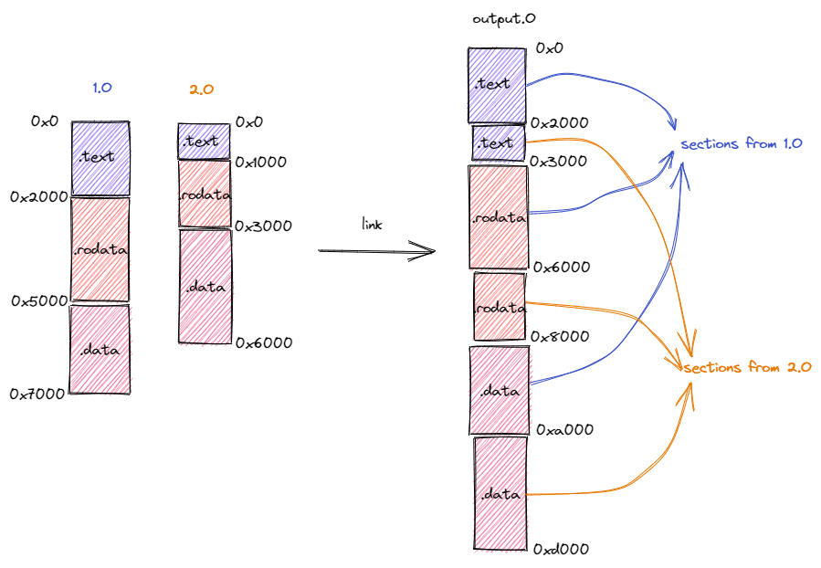

內核第一條指令（基礎篇）
===========================================================================================

.. toctree::
   :hidden:
   :maxdepth: 5

本節導讀
--------------------------------------

接下來兩節我們將進行構建“三葉蟲”操作系統的第二步，即將我們的內核正確加載到 Qemu 模擬器上，使得 Qemu 模擬器可以成功執行內核的第一條指令。本節我們將介紹一些相關基礎知識，首先介紹計算機的各個硬件組成部分，特別是 CPU 和物理內存。其次介紹 Qemu 模擬器的抽象模型、使用方法以及啟動流程。作為知識補充，我們還介紹了一般計算機的啟動流程。最後我們介紹了程序內存佈局和編譯流程，特別是鏈接的相關知識。這些基本知識可以幫助我們更好的理解下一節的實踐操作背後的動機和目的。

計算機組成基礎
--------------------------------------

當編寫應用程序的時候，大多數情況下我們只需調用庫函數即可在操作系統的支持下實現各項功能，而無需關心操作系統如何調度管理各類軟硬件資源。操作系統提供了一些監控工具（如 Windows 上的任務管理器或 Linux 上的 ``ps`` 工具），這些工具可以幫助我們統計 CPU、內存、硬盤、網絡等資源的佔用情況，從而讓我們大致上瞭解這些資源的使用情況，並幫助我們更好地開發或部署應用程序。然而，在實際編寫操作系統的時候，我們就必須直面這些硬件資源，將它們管理起來併為應用程序提供高效易用的抽象。為此，我們必須增進對於這些硬件的瞭解。

.. _term-physical-address:

計算機主要由處理器（Processor，也即中央處理器，CPU，Central Processing Unit），物理內存和 I/O 外設三部分組成。在前八章我們主要用到 CPU 和物理內存，第九章則開始與豐富多彩的外設打交道。處理器的主要功能是從物理內存中讀取指令、譯碼並執行，在此過程中還要與物理內存和 I/O 外設打交道。物理內存則是計算機體系結構中一個重要的組成部分。在存儲方面，CPU 唯一能夠直接訪問的只有物理內存中的數據，它可以通過訪存指令來達到這一目的。從 CPU 的視角看來，可以將物理內存看成一個大字節數組，而物理地址則對應於一個能夠用來訪問數組中某個元素的下標。與我們日常編程習慣不同的是，該下標通常不以 0 開頭，而通常以一個常數，如 ``0x80000000`` 開頭。簡言之，CPU 可以通過物理地址來尋址，並 **逐字節** 地訪問物理內存中保存的數據。

值得一提的是，當 CPU 以多個字節（比如 2/4/8 或更多）為單位訪問物理內存（事實上並不侷限於物理內存，也包括I/O外設的數據空間）中的數據時，就有可能會引入端序（也稱字節順序）和內存地址對齊的問題。由於這並不是重點，我們在這裡不展開說明，如讀者有興趣可以參考下面的補充說明。

.. note::
 
    **端序或尾序**
  
    端序或尾序（Endianness），又稱字節順序。在計算機科學領域中，指電腦內存中或在數字通信鏈路中，多字節組成的字（Word）的字節（Byte）的排列順序。字節的排列方式有兩個通用規則。例如，將一個多位數的低位放在較小的地址處，高位放在較大的地址處，則稱小端序（little-endian）；反之則稱大端序（big-endian）。常見的 x86、RISC-V 等架構採用的是小端序。
 
.. note::
 
    **內存地址對齊**
  
    內存地址對齊是內存中的數據排列，以及 CPU 訪問內存數據的方式，包含了基本數據對齊和結構體數據對齊的兩部分。CPU 在內存中讀寫數據是按字節塊進行操作，理論上任意類型的變量訪問可以從內存的任何地址開始，但在計算機系統中，CPU 訪問內存是通過數據總線（決定了每次讀取的數據位數）和地址總線（決定了尋址範圍）來進行的，基於計算機的物理組成和性能需求，CPU 一般會要求訪問內存數據的首地址的值為 4 或 8 的整數倍。 

    基本類型數據對齊是指數據在內存中的偏移地址必須為一個字的整數倍，這種存儲數據的方式，可以提升系統在讀取數據時的性能。結構體數據對齊，是指在結構體中的上一個數據域結束和下一個數據域開始的地方填充一些無用的字節，以保證每個數據域（假定是基本類型數據）都能夠對齊（即按基本類型數據對齊）。

    對於 RISC-V 處理器而言，load/store 指令進行數據訪存時，數據在內存中的地址應該對齊。如果訪存 32 位數據，內存地址應當按 32 位（4字節）對齊。如果數據的地址沒有對齊，執行訪存操作將產生異常。這也是在學習內核編程中經常碰到的一種 bug。

瞭解 Qemu 模擬器
--------------------------------------

我們編寫的內核將主要在 Qemu 模擬器上運行來檢驗其正確性。這樣做主要是為了方便快捷，只需在命令行輸入一行命令即可讓內核跑起來。為了讓我們的內核能夠正確對接到 Qemu 模擬器上，我們首先要對 Qemu 模擬器有一定的瞭解。在本書中，我們使用軟件 ``qemu-system-riscv64`` 來模擬一臺 64 位 RISC-V 架構的計算機，它包含CPU 、物理內存以及若干 I/O 外設。它的具體配置（比如 CPU 的核數或是物理內存的大小）均可由用戶通過Qemu的執行參數選項來調整。作為模擬器，在宿主機看來它只是一個用戶程序，因此上面提到的資源都是它利用宿主機（即 Qemu 運行所在的平臺，如 Linux/Windows/macOS）提供給它的資源模擬出來的。在 Qemu 上模擬出來的某些硬件資源性能很高，甚至接近宿主機上原生資源的性能；而另一些硬件資源的模擬開銷較大，從而導致Qemu模擬的整體硬件性能相對較慢。但對於本書所實踐的各種操作系統而言，在當前x86-64處理器上的Qemu所模擬的硬件性能已經足夠快了。

接下來我們來看如何啟動 Qemu 。從各章節代碼中的 ``os/Makefile`` 可以看到，我們使用如下命令來啟動 Qemu 並運行我們的內核：

.. code-block:: console
   :linenos:

   $ qemu-system-riscv64 \
       -machine virt \
       -nographic \
       -bios ../bootloader/rustsbi-qemu.bin \
       -device loader,file=target/riscv64gc-unknown-none-elf/release/os.bin,addr=0x80200000

其中各個執行參數選項的含義如下：

.. _term-bootloader:

- ``-machine virt`` 表示將模擬的 64 位 RISC-V 計算機設置為名為 ``virt`` 的虛擬計算機。我們知道，即使同屬同一種指令集架構，也會有很多種不同的計算機配置，比如 CPU 的生產廠商和型號不同，支持的 I/O 外設種類也不同。關於 ``virt`` 平臺的更多信息可以參考 [#virt_platform]_ 。Qemu 還支持模擬其他 RISC-V 計算機，其中包括由 SiFive 公司生產的著名的 HiFive Unleashed 開發板。
- ``-nographic`` 表示模擬器不需要提供圖形界面，而只需要對外輸出字符流。
- 通過 ``-bios`` 可以設置 Qemu 模擬器開機時用來初始化的引導加載程序（bootloader），這裡我們使用預編譯好的 ``rustsbi-qemu.bin`` ，它需要被放在與 ``os`` 同級的 ``bootloader`` 目錄下，該目錄可以從每一章的代碼分支中獲得。
- 通過虛擬設備 ``-device`` 中的 ``loader`` 屬性可以在 Qemu 模擬器開機之前將一個宿主機上的文件載入到 Qemu 的物理內存的指定位置中， ``file`` 和 ``addr`` 屬性分別可以設置待載入文件的路徑以及將文件載入到的 Qemu 物理內存上的物理地址。這裡我們載入的 ``os.bin`` 被稱為 **內核鏡像** ，它會被載入到 Qemu 模擬器內存的 ``0x80200000`` 地址處。 那麼內核鏡像 ``os.bin`` 是怎麼來的呢？上一節中我們移除標準庫依賴後會得到一個內核可執行文件 ``os`` ，將其進一步處理就能得到 ``os.bin`` ，具體處理流程我們會在後面深入討論。

Qemu 啟動流程
^^^^^^^^^^^^^^^^^^^^^^^^^^^^^^^^^^^^^^^

.. _term-physical-memory:

在Qemu模擬的 ``virt`` 硬件平臺上，物理內存的起始物理地址為 ``0x80000000`` ，物理內存的默認大小為 128MiB ，它可以通過 ``-m`` 選項進行配置。如果使用默認配置的 128MiB 物理內存則對應的物理地址區間為 ``[0x80000000,0x88000000)`` 。如果使用上面給出的命令啟動 Qemu ，那麼在 Qemu 開始執行任何指令之前，首先把兩個文件加載到 Qemu 的物理內存中：即作把作為 bootloader 的 ``rustsbi-qemu.bin`` 加載到物理內存以物理地址 ``0x80000000`` 開頭的區域上，同時把內核鏡像 ``os.bin`` 加載到以物理地址 ``0x80200000`` 開頭的區域上。

為什麼加載到這兩個位置呢？這與 Qemu 模擬計算機加電啟動後的運行流程有關。一般來說，計算機加電之後的啟動流程可以分成若干個階段，每個階段均由一層軟件或 :ref:`固件 <term-firmware>` 負責，每一層軟件或固件的功能是進行它應當承擔的初始化工作，並在此之後跳轉到下一層軟件或固件的入口地址，也就是將計算機的控制權移交給了下一層軟件或固件。Qemu 模擬的啟動流程則可以分為三個階段：第一個階段由固化在 Qemu 內的一小段彙編程序負責；第二個階段由 bootloader 負責；第三個階段則由內核鏡像負責。

- 第一階段：將必要的文件載入到 Qemu 物理內存之後，Qemu CPU 的程序計數器（PC, Program Counter）會被初始化為 ``0x1000`` ，因此 Qemu 實際執行的第一條指令位於物理地址 ``0x1000`` ，接下來它將執行寥寥數條指令並跳轉到物理地址 ``0x80000000`` 對應的指令處並進入第二階段。從後面的調試過程可以看出，該地址 ``0x80000000`` 被固化在 Qemu 中，作為 Qemu 的使用者，我們在不觸及 Qemu 源代碼的情況下無法進行更改。
- 第二階段：由於 Qemu 的第一階段固定跳轉到 ``0x80000000`` ，我們需要將負責第二階段的 bootloader ``rustsbi-qemu.bin`` 放在以物理地址 ``0x80000000`` 開頭的物理內存中，這樣就能保證 ``0x80000000`` 處正好保存 bootloader 的第一條指令。在這一階段，bootloader 負責對計算機進行一些初始化工作，並跳轉到下一階段軟件的入口，在 Qemu 上即可實現將計算機控制權移交給我們的內核鏡像 ``os.bin`` 。這裡需要注意的是，對於不同的 bootloader 而言，下一階段軟件的入口不一定相同，而且獲取這一信息的方式和時間點也不同：入口地址可能是一個預先約定好的固定的值，也有可能是在 bootloader 運行期間才動態獲取到的值。我們選用的 RustSBI 則是將下一階段的入口地址預先約定為固定的 ``0x80200000`` ，在 RustSBI 的初始化工作完成之後，它會跳轉到該地址並將計算機控制權移交給下一階段的軟件——也即我們的內核鏡像。
- 第三階段：為了正確地和上一階段的 RustSBI 對接，我們需要保證內核的第一條指令位於物理地址 ``0x80200000`` 處。為此，我們需要將內核鏡像預先加載到 Qemu 物理內存以地址 ``0x80200000`` 開頭的區域上。一旦 CPU 開始執行內核的第一條指令，證明計算機的控制權已經被移交給我們的內核，也就達到了本節的目標。

.. note::

	**真實計算機的加電啟動流程**

	真實計算機的啟動流程大致上也可以分為三個階段：

.. _term-firmware:

	- 第一階段：加電後 CPU 的 PC 寄存器被設置為計算機內部只讀存儲器（ROM，Read-only Memory）的物理地址，隨後 CPU 開始運行 ROM 內的軟件。我們一般將該軟件稱為固件（Firmware），它的功能是對 CPU 進行一些初始化操作，將後續階段的 bootloader 的代碼、數據從硬盤載入到物理內存，最後跳轉到適當的地址將計算機控制權轉移給 bootloader 。它大致對應於 Qemu 啟動的第一階段，即在物理地址 ``0x1000`` 處放置的若干條指令。可以看到 Qemu 上的固件非常簡單，因為它並不需要負責將 bootloader 從硬盤加載到物理內存中，這個任務此前已經由 Qemu 自身完成了。
	- 第二階段：bootloader 同樣完成一些 CPU 的初始化工作，將操作系統鏡像從硬盤加載到物理內存中，最後跳轉到適當地址將控制權轉移給操作系統。可以看到一般情況下 bootloader 需要完成一些數據加載工作，這也就是它名字中 loader 的來源。它對應於 Qemu 啟動的第二階段。在 Qemu 中，我們使用的 RustSBI 功能較弱，它並沒有能力完成加載的工作，內核鏡像實際上是和 bootloader 一起在 Qemu 啟動之前加載到物理內存中的。
	- 第三階段：控制權被轉移給操作系統。由於篇幅所限後面我們就不再贅述了。

	值得一提的是，為了讓計算機的啟動更加靈活，bootloader 目前可能非常複雜：它可能也分為多個階段，並且能管理一些硬件資源，從複雜性上它已接近一個傳統意義上的操作系統。

基於上面對 Qemu 啟動流程的介紹，我們可以知道為了讓我們的內核鏡像能夠正確對接到 Qemu 和 RustSBI 上，我們提交給 Qemu 的內核鏡像文件必須滿足：該文件的開頭即為內核待執行的第一條指令。但後面會講到，在上一節中我們通過移除標準庫依賴得到的可執行文件實際上並不滿足該條件。因此，我們還需要對可執行文件進行一些操作才能得到可提交給 Qemu 的內核鏡像。為了說明這些條件，首先我們需要了解一些關於程序內存佈局和編譯流程的知識。

程序內存佈局與編譯流程
--------------------------------------------------

程序內存佈局
^^^^^^^^^^^^^^^^^^^^^^^^^^^^^^^^^^^^^^^^^^^^^^^^^^

.. _term-section:
.. _term-memory-layout:

在我們將源代碼編譯為可執行文件之後，它就會變成一個看似充滿了雜亂無章的字節的一個文件。但我們知道這些字節至少可以分成代碼和數據兩部分，在程序運行起來的時候它們的功能並不相同：代碼部分由一條條可以被 CPU 解碼並執行的指令組成，而數據部分只是被 CPU 視作可讀寫的內存空間。事實上我們還可以根據其功能進一步把兩個部分劃分為更小的單位： **段** (Section) 。不同的段會被編譯器放置在內存不同的位置上，這構成了程序的 **內存佈局** (Memory Layout)。一種典型的程序相對內存佈局如下所示：

.. figure:: MemoryLayout.png
   :align: center

   一種典型的程序相對內存佈局

在上圖中可以看到，代碼部分只有代碼段 ``.text`` 一個段，存放程序的所有彙編代碼。而數據部分則還可以繼續細化：

.. _term-heap:

- 已初始化數據段保存程序中那些已初始化的全局數據，分為 ``.rodata`` 和 ``.data`` 兩部分。前者存放只讀的全局數據，通常是一些常數或者是
  常量字符串等；而後者存放可修改的全局數據。
- 未初始化數據段 ``.bss`` 保存程序中那些未初始化的全局數據，通常由程序的加載者代為進行零初始化，即將這塊區域逐字節清零；
- **堆** （heap）區域用來存放程序運行時動態分配的數據，如 C/C++ 中的 malloc/new 分配到的數據本體就放在堆區域，它向高地址增長；
- **棧** （stack）區域不僅用作函數調用上下文的保存與恢復，每個函數作用域內的局部變量也被編譯器放在它的棧幀內，它向低地址增長。

.. note::

   **局部變量與全局變量**

   在一個函數的視角中，它能夠訪問的變量包括以下幾種：
   
   - 函數的輸入參數和局部變量：保存在一些寄存器或是該函數的棧幀裡面，如果是在棧幀裡面的話是基於當前棧指針加上一個偏移量來訪問的；
   - 全局變量：保存在數據段 ``.data`` 和 ``.bss`` 中，某些情況下 gp(x3) 寄存器保存兩個數據段中間的一個位置，於是全局變量是基於 gp 加上一個偏移量來訪問的。
   - 堆上的動態變量：本體被保存在堆上，大小在運行時才能確定。而我們只能 *直接* 訪問棧上或者全局數據段中的 **編譯期確定大小** 的變量。因此我們需要通過一個運行時分配內存得到的一個指向堆上數據的指針來訪問它，指針的位寬確實在編譯期就能夠確定。該指針即可以作為局部變量放在棧幀裡面，也可以作為全局變量放在全局數據段中。

編譯流程
^^^^^^^^^^^^^^^^^^^^^^^^^^^^^^^^^^^^^^^^^^^^^^^^^^^^^^^^^

從源代碼得到可執行文件的編譯流程可被細化為多個階段（雖然輸入一條命令便可將它們全部完成）：

.. _term-compiler:
.. _term-assembler:
.. _term-linker:
.. _term-object-file:

1. **編譯器** (Compiler) 將每個源文件從某門高級編程語言轉化為彙編語言，注意此時源文件仍然是一個 ASCII 或其他編碼的文本文件；
2. **彙編器** (Assembler) 將上一步的每個源文件中的文本格式的指令轉化為機器碼，得到一個二進制的 **目標文件** (Object File)；
3. **鏈接器** (Linker) 將上一步得到的所有目標文件以及一些可能的外部目標文件鏈接在一起形成一個完整的可執行文件。

彙編器輸出的每個目標文件都有一個獨立的程序內存佈局，它描述了目標文件內各段所在的位置。而鏈接器所做的事情是將所有輸入的目標文件整合成一個整體的內存佈局。在此期間鏈接器主要完成兩件事情：

- 第一件事情是將來自不同目標文件的段在目標內存佈局中重新排布。如下圖所示，在鏈接過程中，分別來自於目標文件 ``1.o`` 和 ``2.o`` 段被按照段的功能進行分類，相同功能的段被排在一起放在拼裝後的目標文件 ``output.o`` 中。注意到，目標文件 ``1.o`` 和 ``2.o`` 的內存佈局是存在衝突的，同一個地址在不同的內存佈局中存放不同的內容。而在合併後的內存佈局中，這些衝突被消除。

   來自不同目標文件的段的重新排布

- 第二件事情是將符號替換為具體地址。這裡的符號指什麼呢？我們知道，在我們進行模塊化編程的時候，每個模塊都會提供一些向其他模塊公開的全局變量、函數等供其他模塊訪問，也會訪問其他模塊向它公開的內容。要訪問一個變量或者調用一個函數，在源代碼級別我們只需知道它們的名字即可，這些名字被我們稱為符號。取決於符號來自於模塊內部還是其他模塊，我們還可以進一步將符號分成內部符號和外部符號。然而，在機器碼級別（也即在目標文件或可執行文件中）我們並不是通過符號來找到索引我們想要訪問的變量或函數，而是直接通過變量或函數的地址。例如，如果想調用一個函數，那麼在指令的機器碼中我們可以找到函數入口的絕對地址或者相對於當前 PC 的相對地址。

  那麼，符號何時被替換為具體地址呢？因為符號對應的變量或函數都是放在某個段裡面的固定位置（如全局變量往往放在 ``.bss`` 或者 ``.data`` 段中，而函數則放在 ``.text`` 段中），所以我們需要等待符號所在的段確定了它們在內存佈局中的位置之後才能知道它們確切的地址。當一個模塊被轉化為目標文件之後，它的內部符號就已經在目標文件中被轉化為具體的地址了，因為目標文件給出了模塊的內存佈局，也就意味著模塊內的各個段的位置已經被確定了。然而，此時模塊所用到的外部符號的地址無法確定。我們需要將這些外部符號記錄下來，放在目標文件一個名為符號表（Symbol table）的區域內。由於後續可能還需要重定位，內部符號也同樣需要被記錄在符號表中。

  外部符號需要等到鏈接的時候才能被轉化為具體地址。假設模塊 1 用到了模塊 2 提供的內容，當兩個模塊的目標文件鏈接到一起的時候，它們的內存佈局會被合併，也就意味著兩個模塊的各個段的位置均被確定下來。此時，模塊 1 用到的來自模塊 2 的外部符號可以被轉化為具體地址。同時我們還需要注意：兩個模塊的段在合併後的內存佈局中被重新排布，其最終的位置有可能和它們在模塊自身的局部內存佈局中的位置相比已經發生了變化。因此，每個模塊的內部符號的地址也有可能會發生變化，我們也需要進行修正。上面的過程被稱為重定位（Relocation），這個過程形象一些來說很像拼圖：由於模塊 1 用到了模塊 2 的內容，因此二者分別相當於一塊凹進和凸出一部分的拼圖，正因如此我們可以將它們無縫地拼接到一起。

上面我們簡單介紹了程序內存佈局和編譯流程特別是鏈接過程的相關知識。那麼如何得到一個能夠在 Qemu 上成功運行的內核鏡像呢？首先我們需要通過鏈接腳本調整內核可執行文件的內存佈局，使得內核被執行的第一條指令位於地址 ``0x80200000`` 處，同時代碼段所在的地址應低於其他段。這是因為 Qemu 物理內存中低於 ``0x80200000`` 的區域並未分配給內核，而是主要由 RustSBI 使用。其次，我們需要將內核可執行文件中的元數據丟掉得到內核鏡像，此內核鏡像僅包含實際會用到的代碼和數據。這則是因為 Qemu 的加載功能過於簡單直接，它直接將輸入的文件逐字節拷貝到物理內存中，因此也可以說這一步是我們在幫助 Qemu 手動將可執行文件加載到物理內存中。下一節我們將成功生成內核鏡像並在 Qemu 上驗證控制權被轉移到內核。

.. [#virt_platform] https://www.qemu.org/docs/master/system/riscv/virt.html