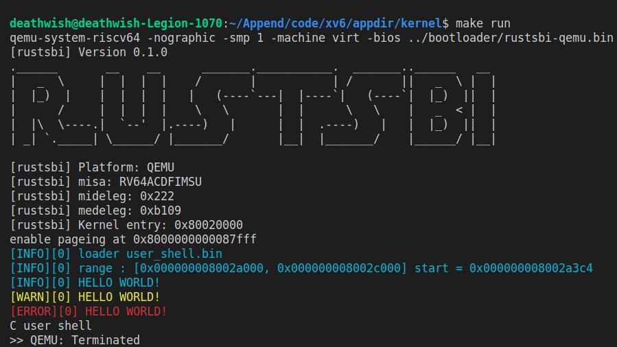

練習
=====================================================

.. toctree::
   :hidden:
   :maxdepth: 4

課後練習
-------------------------------

編程題
~~~~~~~~~~~~~~~~~~~~~~~~~~~~~~~
1. `*` 實現一個linux應用程序A，顯示當前目錄下的文件名。（用C或Rust編程）
2. `***` 實現一個linux應用程序B，能打印出調用棧鏈信息。（用C或Rust編程）
3. `**` 實現一個基於rcore/ucore tutorial的應用程序C，用sleep系統調用睡眠5秒（in rcore/ucore tutorial v3: Branch ch1）

注： 嘗試用GDB等調試工具和輸出字符串的等方式來調試上述程序，能設置斷點，單步執行和顯示變量，理解彙編代碼和源程序之間的對應關係。

問答題
~~~~~~~~~~~~~~~~~~~~~~~~~~~~~~~

1. `*` 應用程序在執行過程中，會佔用哪些計算機資源？
2. `*` 請用相關工具軟件分析並給出應用程序A的代碼段/數據段/堆/棧的地址空間範圍。
3. `*` 請簡要說明應用程序與操作系統的異同之處。
4. `**` 請基於QEMU模擬RISC—V的執行過程和QEMU源代碼，說明RISC-V硬件加電後的幾條指令在哪裡？完成了哪些功能？
5. `*` RISC-V中的SBI的含義和功能是啥？
6. `**` 為了讓應用程序能在計算機上執行，操作系統與編譯器之間需要達成哪些協議？
7. `**` 請簡要說明從QEMU模擬的RISC-V計算機加電開始運行到執行應用程序的第一條指令這個階段的執行過程。
8.  `**` 為何應用程序員編寫應用時不需要建立棧空間和指定地址空間？
9.  `***` 現代的很多編譯器生成的代碼，默認情況下不再嚴格保存/恢復棧幀指針。在這個情況下，我們只要編譯器提供足夠的信息，也可以完成對調用棧的恢復。

    我們可以手動閱讀彙編代碼和棧上的數據，體驗一下這個過程。例如，對如下兩個互相遞歸調用的函數：

    .. code-block::

      void flip(unsigned n) {
          if ((n & 1) == 0) {
              flip(n >> 1);
          } else if ((n & 1) == 1) {
              flap(n >> 1);
          }
      }

      void flap(unsigned n) {
          if ((n & 1) == 0) {
              flip(n >> 1);
          } else if ((n & 1) == 1) {
              flap(n >> 1);
          }
      }

    在某種編譯環境下，編譯器產生的代碼不包括保存和恢復棧幀指針 ``fp`` 的代碼。以下是 GDB 輸出的本次運行的時候，這兩個函數所在的地址和對應地址指令的反彙編，為了方便閱讀節選了重要的控制流和棧操作（省略部分不含棧操作）：

    .. code-block::

       (gdb) disassemble flap
       Dump of assembler code for function flap:
          0x0000000000010730 <+0>:     addi    sp,sp,-16    // 唯一入口
          0x0000000000010732 <+2>:     sd      ra,8(sp)
          ...
          0x0000000000010742 <+18>:    ld      ra,8(sp)
          0x0000000000010744 <+20>:    addi    sp,sp,16
          0x0000000000010746 <+22>:    ret                  // 唯一出口
          ...
          0x0000000000010750 <+32>:    j       0x10742 <flap+18>

       (gdb) disassemble flip
       Dump of assembler code for function flip:
          0x0000000000010752 <+0>:     addi    sp,sp,-16    // 唯一入口
          0x0000000000010754 <+2>:     sd      ra,8(sp)
          ...
          0x0000000000010764 <+18>:    ld      ra,8(sp)
          0x0000000000010766 <+20>:    addi    sp,sp,16
          0x0000000000010768 <+22>:    ret                  // 唯一出口
          ...
          0x0000000000010772 <+32>:    j       0x10764 <flip+18>
       End of assembler dump.

    啟動這個程序，在運行的時候的某個狀態將其打斷。此時的 ``pc``, ``sp``, ``ra`` 寄存器的值如下所示。此外，下面還給出了棧頂的部分內容。（為閱讀方便，棧上的一些未初始化的垃圾數據用 ``???`` 代替。）

    .. code-block::

       (gdb) p $pc
       $1 = (void (*)()) 0x10752 <flip>

       (gdb) p $sp
       $2 = (void *) 0x40007f1310

       (gdb) p $ra
       $3 = (void (*)()) 0x10742 <flap+18>

       (gdb) x/6a $sp
       0x40007f1310:   ???     0x10750 <flap+32>
       0x40007f1320:   ???     0x10772 <flip+32>
       0x40007f1330:   ???     0x10764 <flip+18>

    根據給出這些信息，調試器可以如何復原出最頂層的幾個調用棧信息？假設調試器可以理解編譯器生成的彙編代碼 [#dwarf]_ 。

實驗練習
-------------------------------

實驗練習包括實踐作業和問答作業兩部分。

實踐作業
~~~~~~~~~~~~~~~~~~~~~~~~~~~~~

彩色化 LOG
^^^^^^^^^^^^^^^^^^^^^^^^^^^^^^^

lab1 的工作使得我們從硬件世界跳入了軟件世界，當看到自己的小 os 可以在裸機硬件上輸出 ``hello world`` 是不是很高興呢？但是為了後續的一步開發，更好的調試環境也是必不可少的，第一章的練習要求大家實現更加炫酷的彩色log。

詳細的原理不多說，感興趣的同學可以參考 `ANSI轉義序列 <https://zh.wikipedia.org/wiki/ANSI%E8%BD%AC%E4%B9%89%E5%BA%8F%E5%88%97>`_ ，現在執行如下這條命令試試

.. code-block:: console

   $ echo -e "\x1b[31mhello world\x1b[0m"

如果你明白了我們是如何利用串口實現輸出，那麼要實現彩色輸出就十分容易了，只需要用需要輸出的字符串替換上一條命令中的 ``hello world``，用期望顏色替換 ``31(代表紅色)`` 即可。

.. warning::

   以下內容僅為推薦實現，不是練習要求，有時間和興趣的同學可以嘗試。

我們推薦實現如下幾個等級的輸出，輸出優先級依次降低：

.. list-table:: log 等級推薦
   :header-rows: 1
   :align: center

   * - 名稱
     - 顏色
     - 用途
   * - ERROR
     - 紅色(31)
     - 表示發生嚴重錯誤，很可能或者已經導致程序崩潰
   * - WARN
     - 黃色(93)
     - 表示發生不常見情況，但是並不一定導致系統錯誤
   * - INFO
     - 藍色(34)
     - 比較中庸的選項，輸出比較重要的信息，比較常用
   * - DEBUG
     - 綠色(32)
     - 輸出信息較多，在 debug 時使用
   * - TRACE
     - 灰色(90)
     - 最詳細的輸出，跟蹤了每一步關鍵路徑的執行

我們可以輸出比設定輸出等級以及更高輸出等級的信息，如設置 ``LOG = INFO``，則輸出 ``ERROR``、``WARN``、``INFO`` 等級的信息。簡單 demo 如下，輸出等級為 INFO:

為了方便使用彩色輸出，我們要求同學們實現彩色輸出的宏或者函數，用以代替 print 完成輸出內核信息的功能，它們有著和 prinf 十分相似的使用格式，要求支持可變參數解析，形如：

.. code-block:: rust

    // 這段代碼輸出了 os 內存空間佈局，這到這些信息對於編寫 os 十分重要

    info!(".text [{:#x}, {:#x})", s_text as usize, e_text as usize);
    debug!(".rodata [{:#x}, {:#x})", s_rodata as usize, e_rodata as usize);
    error!(".data [{:#x}, {:#x})", s_data as usize, e_data as usize);

.. code-block:: c

    info("load range : [%d, %d] start = %d\n", s, e, start);

在以後，我們還可以在 log 信息中增加線程、CPU等信息（只是一個推薦，不做要求），這些信息將極大的方便你的代碼調試。

實驗要求
^^^^^^^^^^^^^^^^^^^^^^^^^^^^^^^

- 實現分支：ch1
- 完成實驗指導書中的內容並在裸機上實現 ``hello world`` 輸出。
- 實現彩色輸出宏(只要求可以彩色輸出，不要求 log 等級控制，不要求多種顏色)
- 隱形要求

  可以關閉內核所有輸出。從 lab2 開始要求關閉內核所有輸出（如果實現了 log 等級控制，那麼這一點自然就實現了）。

- 利用彩色輸出宏輸出 os 內存空間佈局

  輸出 ``.text``、``.data``、``.rodata``、``.bss`` 各段位置，輸出等級為 ``INFO``。

challenge: 支持多核，實現多個核的 boot。

實驗檢查
^^^^^^^^^^^^^^^^^^^^^^^^^^^^^^^

- 實驗目錄要求(Rust)

.. code-block::

   ├── os(內核實現)
   │   ├── Cargo.toml(配置文件)
   │   ├── Makefile (要求 make run LOG=xxx 可以正確執行，可以不實現對 LOG 這一屬性的支持，設置默認輸出等級為 INFO)
   │   └── src(所有內核的源代碼放在 os/src 目錄下)
   │       ├── main.rs(內核主函數)
   │       └── ...
   ├── reports
   │   ├── lab1.md/pdf
   │   └── ...
   ├── README.md（其他必要的說明）
   ├── ...

報告命名 labx.md/pdf，統一放在 reports 目錄下。每個實驗新增一個報告，為了方便修改，檢查報告是以最新分支的所有報告為準。

- 檢查

.. code-block:: console

   $ cd os
   $ git checkout ch1
   $ make run LOG=INFO

可以正確執行(可以不支持LOG參數，只有要彩色輸出就好)，可以看到正確的內存佈局輸出，根據實現不同數值可能有差異，但應該位於 ``linker.ld`` 中指示 ``BASE_ADDRESS`` 後一段內存，輸出之後關機。

tips
^^^^^^^^^^^^^^^^^^^^^^^^^^^^^^^

- 對於 Rust, 可以使用 crate `log <https://docs.rs/log/0.4.14/log/>`_ ，推薦參考 `rCore <https://github.com/rcore-os/rCore/blob/master/kernel/src/logging.rs>`_
- 對於 C，可以實現不同的函數（注意不推薦多層可變參數解析，有時會出現不穩定情況），也可以參考 `linux printk <https://github.com/torvalds/linux/blob/master/include/linux/printk.h#L312-L385>`_ 使用宏實現代碼重用。
- 兩種語言都可以使用 ``extern`` 關鍵字獲得在其他文件中定義的符號。

問答作業
~~~~~~~~~~~~~~~~~~~~~~~~~~~~~~

1. 請學習 gdb 調試工具的使用(這對後續調試很重要)，並通過 gdb 簡單跟蹤從機器加電到跳轉到 0x80200000 的簡單過程。只需要描述重要的跳轉即可，只需要描述在 qemu 上的情況。

2. tips:

  - 事實上進入 rustsbi 之後就不需要使用 gdb 調試了。可以直接閱讀代碼。`rustsbi起始代碼 <https://github.com/rustsbi/rustsbi-qemu/blob/main/rustsbi-qemu/src/main.rs#L146>`_ 。
  - 可以使用示例代碼 Makefile 中的 ``make debug`` 指令。
  - 一些可能用到的 gdb 指令：
      - ``x/10i 0x80000000`` : 顯示 0x80000000 處的10條彙編指令。
      - ``x/10i $pc`` : 顯示即將執行的10條彙編指令。
      - ``x/10xw 0x80000000`` : 顯示 0x80000000 處的10條數據，格式為16進制32bit。
      - ``info register``: 顯示當前所有寄存器信息。
      - ``info r t0``: 顯示 t0 寄存器的值。
      - ``break funcname``: 在目標函數第一條指令處設置斷點。
      - ``break *0x80200000``: 在 0x80200000 處設置斷點。
      - ``continue``: 執行直到碰到斷點。
      - ``si``: 單步執行一條彙編指令。

實驗練習的提交報告要求
~~~~~~~~~~~~~~~~~~~~~~~~~~~~~~~~~~

- 簡單總結本次實驗你編程的內容。（控制在5行以內，不要貼代碼）
- 由於彩色輸出不好自動測試，請附正確運行後的截圖。
- 完成問答問題。
- (optional) 你對本次實驗設計及難度/工作量的看法，以及有哪些需要改進的地方，歡迎暢所欲言。

.. [#dwarf] 對編譯器如何向調試器提供生成的代碼的信息，有興趣可以參閱 `DWARF 規範 <https://dwarfstd.org>`_
