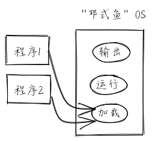

引言
================================

本章導讀
---------------------------------

..
  chyyuu：有一個ascii圖，畫出我們做的OS。

保障系統安全和多應用支持是操作系統的兩個核心目標，本章從這兩個目標出發，思考如何設計應用程序，並進一步展現了操作系統的一系列新功能：

- 構造包含操作系統內核和多個應用程序的單一執行程序
- 通過批處理支持多個程序的自動加載和運行
- 操作系統利用硬件特權級機制，實現對操作系統自身的保護
- 實現特權級的穿越
- 支持跨特權級的系統調用功能

上一章，我們在 RISC-V 64 裸機平臺上成功運行起來了 ``Hello, world!`` 。看起來這個過程非常順利，只需要一條命令就能全部完成。但實際上，在那個計算機剛剛誕生的年代，很多事情並不像我們想象的那麼簡單。 當時，程序被記錄在打孔的卡片上，使用匯編語言甚至機器語言來編寫。而稀缺且昂貴的計算機由專業的管理員負責操作，就和我們在上一章所做的事情一樣，他們手動將卡片輸入計算機，等待程序運行結束或者終止程序的運行。最後，他們從計算機的輸出端——也就是打印機中取出程序的輸出並交給正在休息室等待的程序提交者。

實際上，這樣做是一種對於珍貴的計算資源的浪費。因為當時（二十世紀 60 年代）的大型計算機和今天的個人計算機不同，它的體積極其龐大，能夠佔滿一整個空調房間，像巨大的史前生物。當時用戶（程序員）將程序輸入到穿孔卡片上。用戶將一批這些編程的卡片交給系統操作員，然後系統操作員將它們輸入計算機。系統管理員在房間的各個地方跑來跑去、或是等待打印機的輸出的這些時間段，計算機都並沒有在工作。於是，人們希望計算機能夠不間斷的工作且專注於計算任務本身。

.. chyyuu https://www.bmc.com/blogs/batch-jobs/

.. _term-batch-system:

**批處理系統** (Batch System) 應運而生，它可用來管理無需或僅需少量用戶交互即可運行的程序，在資源允許的情況下它可以自動安排程序的執行，這被稱為“批處理作業”，這個名詞源自二十世紀60年代的大型機時代。批處理系統的核心思想是：將多個程序打包到一起輸入計算機。而當一個程序運行結束後，計算機會 *自動* 加載下一個程序到內存並開始執行。當軟件有了代替操作員的管理和操作能力後，便開始形成真正意義上的操作系統了。

.. chyyuu 特權級 User Mode Versus Privileged Mode 
   https://en.wikipedia.org/wiki/CPU_modes
   https://en.wikipedia.org/wiki/Privilege_(computing)

   在操作系統發展歷史上，在1956年就誕生了有文字歷史記錄的操作系統GM-NAA I/O，並且被實際投入使用，它的一個主要任務就是"自動加載運行一個接一個的程序"，並能以庫函數的形式給應用程序提供基本的硬件訪問服務。
   https://en.wikipedia.org/wiki/GM-NAA_I/O
   http://ethw.org/First-Hand:Operating_System_Roots
   http://www.softwarepreservation.org/projects/os/gm.html
   https://millosh.wordpress.com/2007/09/07/the-worlds-first-computer-operating-system-implemented-at-general-motors-research-labs-in-warren-michigan-in-1955/
   
   https://en.wikipedia.org/wiki/Henry_Gantt

   https://en.wikipedia.org/wiki/Timeline_of_operating_systems 

.. note::
   
   **來自汽車生產線靈感的 GM-NAA I/O System 批處理操作系統**
   
   操作系統歷史上最偉大的想象力飛躍之一是計算機可能通過軟件來安排自己的工作負荷的想法，這體現在早期的批處理操作系統的設計與實現中。

   在 2006 年計算機歷史博物館對 Robert L. Patrick 的一次採訪中，Patrick 回顧了在 1954-1956 年前後他在通用汽車（ General Motors，簡稱 GM）公司設計實現的 GM-NAA I/O 操作系統的有趣開發歷史。當時（1954 年），通用汽車公司購置的 IBM 701 大型計算機使用效率極低，大約 2/3 的時間處於浪費的閒置狀態，而浪費的計算機時間的成本是每月近 15 萬美元，這給公司帶來了巨大的經濟開銷。計算機的用途是程序開發和執行，而開發程序、編譯程序、測試程序、運行程序、操作計算機運行等事務大多都由程序員來完成，編寫好的程序源碼會被程序員手工按順序放到磁帶（磁帶只能串行順序讀寫代碼和數據）上，再串行加載到計算機上被編譯器編譯成可執行程序，再加載可執行程序運行，最後打印輸出執行結果。當時的程序多是機器碼程序或彙編程序等，也有處於試驗階段的早期 FORTRAN 語言編寫的程序，很容易出錯。如果當前正在執行的程序測試運行崩潰或提前終止，其他程序只能等待，整個機器就會閒置。程序員的大量時間是等待機器能運行到他提交的程序。

   Patrick 採用了提高並行處理流程的汽車生產線設計中的一些分析技術來設計面向下一代 704 計算機的操作系統（當時的名字還是 Monitor，監控器），而這些想法起源於 Henry Laurence Gantt，他在 1910 年發明了甘特圖，這是一種條狀圖，可顯示項目、進度以及其他與時間相關的系統進展的內在關係隨著時間進展的情況。然後 Patrick 和來自北美航空公司的 Owen Mock 合作，帶領開發團隊一起設計了 GM-NAA I/O System（General Motors - North America Aviation Input-Output System）操作系統。

   GM-NAA I/O System 操作系統完成對計算機的管理與控制，形成了標準化的輸入和輸出程序以及作業控制語言。以前由程序員承擔的計算機操作工作，如把程序導入磁帶，加載程序，轉儲程序出錯信息並繼續執行下一程序等各種任務，現在都由操作系統來按相互依賴關係分階段進行編排，並自動完成。在原有硬件和程序員工資的情況下，計算機的使用效率提高了 5 倍以上，程序員沒有那麼多空閒的時間用來聊天了。

.. _term-privilege:

應用程序總是難免會出現錯誤，如果一個程序的執行錯誤導致其它程序或者整個計算機系統都無法運行就太糟糕了。人們希望一個應用程序的錯誤不要影響到其它應用程序、操作系統和整個計算機系統。這就需要操作系統能夠終止出錯的應用程序，轉而運行下一個應用程序。這種 *保護* 計算機系統不受有意或無意出錯的程序破壞的機制被稱為 **特權級** (Privilege) 機制，它讓應用程序運行在用戶態，而操作系統運行在內核態，且實現用戶態和內核態的隔離，這需要計算機軟件和硬件的共同努力。

.. chyyuu    
   https://en.wikipedia.org/wiki/Compatible_Time-Sharing_System
   https://multicians.org/thvv/7094.html The IBM 7094 and CTSS 是一種分時系統
   http://larch-www.lcs.mit.edu:8001/~corbato/sjcc62/
   
   https://multicians.org/MULTICS.html
   https://multicians.org/fjcc2.html  System Design of a Computer for Time Sharing Applications GE 635/645 提到特權模式 In the 645 three distinct modes of execution are defined. These are absolute, master and slave. 也提到 虛存，中斷等硬件支持...
   http://www.bitsavers.org/pdf/honeywell/MULTICS/AL39-01C_MULTICS_Processor_Manual_Nov85.pdf
   https://multicians.org/mgr.html#ring 對環的描述
   https://www.acsac.org/2002/papers/classic-MULTICS-orig.pdf  對MULTICS的rings的安全評價論文
   https://www.usenix.org/system/files/login/articles/1070-MULTICS.pdf 指出MULTICS用力過猛

.. note::

   **想法超前且用力過猛的 MULTICS 操作系統**

   1961-1963 年，MIT 的 Fernando Corbató 教授帶領的研究小組在 IBM 7090 上演示和進一步實現了CTSS（Compatible Time-Sharing System）操作系統，當時 CTSS 被認為是一個提供給廣泛和不同用戶群的大規模分時系統，受到廣泛好評。於是他們在 1965 年計劃設計新一代 MULTICS 操作系統，其總體設計目標是創建一個能夠全面滿足大型計算機服務設施的幾乎所有當前和未來要求的計算系統，這是一個更為野心勃勃的目標。在 DARPA 的資助下，MIT 聯合了強大的 GE 公司（負責提供 GE 645 大型機）和貝爾實驗室（負責提供高水平的軟件工程師），開始設計實現 MULTICS 操作系統。MULTICS 操作系統與 GE 645 硬件在同一時間段進行軟硬件協同設計，MULTICS 操作系統的前期設計是在 GE 645 模擬器（運行在 GE 635 計算機上）上進行的。

   MULTICS 操作系統是一開始就為安全系統而設計的通用操作系統，多重保護環（Multiple rings of protection，也稱分級保護域）是MULTICS 操作系統引入的最具革命性的概念之一。儘管 GE 645 計算機有 8 級硬件支持的保護環，它仍不足以滿足 MULTICS 的安全需求，因此 MULTICS 通過軟件方式支持多達 64 級保護環，這樣在不同安全級別的保護環，可以運行不同的管理程序或應用程序。

   這種設計思想具有典型的第二系統效應問題，即在一個簡單的第一個系統（這裡指 CTSS）成功之後，又有一個更復雜的第二個系統（這裡指MULTICS）的誘惑，但其實在當時情況下難以順利完成。8 級硬件多重保護環設計僅存在於 GE 645 中，這使得 MULTICS 操作系統不可移植，無法向更便宜、更開放的硬件系統移植。而且後續成功的計算機系統表明，多級保護環不是必須的，一個簡單兩級保護環（用戶態和內核態）再加上分頁機制，就足以實現絕大多數的安全隔離需求了。

本章主要是設計和實現建立支持批處理系統的泥盆紀“鄧式魚” [#dunk]_ 操作系統，從而對可支持運行一批應用程序的執行環境有一個全面和深入的理解。

本章我們的目標讓泥盆紀“鄧式魚”操作系統能夠感知多個應用程序的存在，並一個接一個地運行這些應用程序，當一個應用程序執行完畢後，會啟動下一個應用程序，直到所有的應用程序都執行完畢。

實踐體驗
---------------------------

本章我們的批處理系統將連續運行三個應用程序，放在 ``user/src/bin`` 目錄下。

獲取本章代碼：

.. code-block:: console

   $ git clone https://github.com/rcore-os/rCore-Tutorial-v3.git
   $ cd rCore-Tutorial-v3
   $ git checkout ch2

在 qemu 模擬器上運行本章代碼：

.. code-block:: console

   $ cd os
   $ make run

如果順利的話，我們可以看到批處理系統自動加載並運行所有的程序並且正確在程序出錯的情況下保護了自身：

.. code-block:: 

    [RustSBI output]
    [kernel] Hello, world!
    [kernel] num_app = 5
    [kernel] app_0 [0x8020a038, 0x8020af90)
    [kernel] app_1 [0x8020af90, 0x8020bf80)
    [kernel] app_2 [0x8020bf80, 0x8020d108)
    [kernel] app_3 [0x8020d108, 0x8020e0e0)
    [kernel] app_4 [0x8020e0e0, 0x8020f0b8)
    [kernel] Loading app_0
    Hello, world!
    [kernel] Application exited with code 0
    [kernel] Loading app_1
    Into Test store_fault, we will insert an invalid store operation...
    Kernel should kill this application!
    [kernel] PageFault in application, kernel killed it.
    [kernel] Loading app_2
    3^10000=5079(MOD 10007)
    3^20000=8202(MOD 10007)
    3^30000=8824(MOD 10007)
    3^40000=5750(MOD 10007)
    3^50000=3824(MOD 10007)
    3^60000=8516(MOD 10007)
    3^70000=2510(MOD 10007)
    3^80000=9379(MOD 10007)
    3^90000=2621(MOD 10007)
    3^100000=2749(MOD 10007)
    Test power OK!
    [kernel] Application exited with code 0
    [kernel] Loading app_3
    Try to execute privileged instruction in U Mode
    Kernel should kill this application!
    [kernel] IllegalInstruction in application, kernel killed it.
    [kernel] Loading app_4
    Try to access privileged CSR in U Mode
    Kernel should kill this application!
    [kernel] IllegalInstruction in application, kernel killed it.
    [kernel] Panicked at src/batch.rs:58 All applications completed!

本章代碼樹
-------------------------------------------------

鄧式魚BatchOS操作系統的總體結構如下圖所示：

.. image:: ../../os-lectures/lec3/figs/batch-os-detail.png
   :align: center
   :scale: 30 %
   :name: batch-os-detail
   :alt: BatchOS總體結構

通過上圖，大致可以看出Qemu把包含多個app的列表和BatchOS的image鏡像加載到內存中，RustSBI（bootloader）完成基本的硬件初始化後，跳轉到鄧式魚BatchOS起始位置，鄧式魚BatchOS首先進行正常運行前的初始化工作，即建立棧空間和清零bss段，然後通過 `AppManager` 內核模塊從app列表中依次加載各個app到指定的內存中在用戶態執行。app在執行過程中，會通過系統調用的方式得到鄧式魚BatchOS提供的OS服務，如輸出字符串等。

位於 ``ch2`` 分支上的鄧式魚BatchOS操作系統的源代碼如下所示：

.. code-block::

   ./os/src
   Rust        13 Files   372 Lines
   Assembly     2 Files    58 Lines

   ├── bootloader
   │   └── rustsbi-qemu.bin
   ├── LICENSE
   ├── os
   │   ├── build.rs(新增：生成 link_app.S 將應用作為一個數據段鏈接到內核)
   │   ├── Cargo.toml
   │   ├── Makefile(修改：構建內核之前先構建應用)
   │   └── src
   │       ├── batch.rs(新增：實現了一個簡單的批處理系統)
   │       ├── console.rs
   │       ├── entry.asm
   │       ├── lang_items.rs
   │       ├── link_app.S(構建產物，由 os/build.rs 輸出)
   │       ├── linker-qemu.ld
   │       ├── main.rs(修改：主函數中需要初始化 Trap 處理並加載和執行應用)
   │       ├── sbi.rs
   │       ├── sync(新增：同步子模塊 sync ，目前唯一功能是提供 UPSafeCell)
   │       │   ├── mod.rs
   │       │   └── up.rs(包含 UPSafeCell，它可以幫助我們以更 Rust 的方式使用全局變量)
   │       ├── syscall(新增：系統調用子模塊 syscall)
   │       │   ├── fs.rs(包含文件 I/O 相關的 syscall)
   │       │   ├── mod.rs(提供 syscall 方法根據 syscall ID 進行分發處理)
   │       │   └── process.rs(包含任務處理相關的 syscall)
   │       └── trap(新增：Trap 相關子模塊 trap)
   │           ├── context.rs(包含 Trap 上下文 TrapContext)
   │           ├── mod.rs(包含 Trap 處理入口 trap_handler)
   │           └── trap.S(包含 Trap 上下文保存與恢復的彙編代碼)
   ├── README.md
   ├── rust-toolchain
   └── user(新增：應用測例保存在 user 目錄下)
      ├── Cargo.toml
      ├── Makefile
      └── src
         ├── bin(基於用戶庫 user_lib 開發的應用，每個應用放在一個源文件中)
         │   ├── 00hello_world.rs
         │   ├── 01store_fault.rs
         │   ├── 02power.rs
         │   ├── 03priv_inst.rs
         │   └── 04priv_csr.rs
         ├── console.rs
         ├── lang_items.rs
         ├── lib.rs(用戶庫 user_lib)
         ├── linker.ld(應用的鏈接腳本)
         └── syscall.rs(包含 syscall 方法生成實際用於系統調用的彙編指令，
                        各個具體的 syscall 都是通過 syscall 來實現的)

本章代碼導讀
-----------------------------------------------------

相比於上一章的兩個簡單操作系統，本章的操作系統有兩個最大的不同之處，一個是操作系統自身運行在內核態，且支持應用程序在用戶態運行，且能完成應用程序發出的系統調用；另一個是能夠一個接一個地自動運行不同的應用程序。所以，我們需要對操作系統和應用程序進行修改，也需要對應用程序的編譯生成過程進行修改。

首先改進應用程序，讓它能夠在用戶態執行，並能發出系統調用。具體而言，編寫多個應用小程序，修改編譯應用所需的 ``linker.ld`` 文件來   :ref:`調整程序的內存佈局  <term-app-mem-layout>` ，讓操作系統能夠把應用加載到指定內存地址，然後順利啟動並運行應用程序。

在應用程序的運行過程中，操作系統要支持應用程序的輸出功能，並還能支持應用程序退出。這需要實現跨特權級的系統調用接口，以及 ``sys_write`` 和 ``sys_exit`` 等具體的系統調用功能。 在具體設計實現上，涉及到內聯彙編的編寫，以及應用與操作系統內核之間系統調用的參數傳遞的約定。為了讓應用程序在還沒實現 ``鄧氏魚`` 操作系統之前就能在Linux for RISC-V 64 上進行運行測試，我們採用了Linux on RISC-V64 的系統調用參數約定。具體實現可參看 :ref:`系統調用 <term-call-syscall>` 小節中的內容。 這樣寫完應用小例子後，就可以通過  ``qemu-riscv64`` 模擬器進行測試了。  

寫完應用程序後，還需實現支持多個應用程序輪流啟動運行的操作系統。這裡首先能把本來相對鬆散的應用程序執行代碼和操作系統執行代碼連接在一起，便於   ``qemu-system-riscv64`` 模擬器一次性地加載二者到內存中，並讓操作系統能夠找到應用程序的位置。為把二者連在一起，需要對生成的應用程序進行改造，首先是把應用程序執行文件從ELF執行文件格式變成Binary格式（通過 ``rust-objcopy`` 可以輕鬆完成）；然後這些Binary格式的文件通過編譯器輔助腳本 ``os/build.rs`` 轉變變成 ``os/src/link_app.S`` 這個彙編文件的一部分，並生成各個Binary應用的輔助信息，便於操作系統能夠找到應用的位置。編譯器會把操作系統的源碼和 ``os/src/link_app.S`` 合在一起，編譯出操作系統+Binary應用的ELF執行文件，並進一步轉變成Binary格式。

為了定位 Binary 應用在被加載後的內存位置，操作系統本身需要完成對 Binary 應用的位置查找，找到後（通過 ``os/src/link_app.S`` 中的變量和標號信息完成），會把 Binary 應用從加載位置拷貝到 ``user/src/linker.ld`` 指定的物理內存位置（OS的加載應用功能）。在一個應用執行完畢後，操作系統還能加載另外一個應用，這主要是通過 ``AppManagerInner`` 數據結構和對應的函數 ``load_app`` 和 ``run_next_app`` 等來完成對應用的一系列管理功能。這主要在 :ref:`實現批處理操作系統  <term-batchos>` 小節中講解。

為了讓 Binary 應用能夠啟動和運行，操作系統還需給 Binary 應用分配好對應執行環境所需一系列的資源。這主要包括設置好用戶棧和內核棧（在用戶態的應用程序與在內核態的操作系統內核需要有各自的棧，避免應用程序破壞內核的執行），實現 Trap 上下文的保存與恢復（讓應用能夠在發出系統調用到內核態後，還能回到用戶態繼續執行），完成Trap 分發與處理等工作。由於系統調用和中斷處理等內核代碼實現涉及用戶態與內核態之間的特權級切換細節的彙編代碼，與硬件細節聯繫緊密，所以 :ref:`這部分內容 <term-trap-handle>` 是本章中理解比較困難的地方。如果要了解清楚，需要對涉及到的 RISC-V CSR 寄存器的功能有明確認識。這就需要查看 `RISC-V手冊 <http://crva.ict.ac.cn/documents/RISC-V-Reader-Chinese-v2p1.pdf>`_ 的第十章或更加詳細的 RISC-V 的特權級規範文檔了。有了上面的實現後，就剩下最後一步，實現 **執行應用程序** 的操作系統功能，其主要實現在 ``run_next_app`` 內核函數中 。完成所有這些功能的實現，“鄧式魚” [#dunk]_ 操作系統就可以正常運行，並能管理多個應用按批處理方式在用戶態一個接一個地執行了。

.. [#dunk] 鄧氏魚是一種晚泥盆紀（距今約3.82億至3.59億年前）的盾皮魚，其中最大種類體長可達8.79米，重量可達4噸，是當時最大的海洋掠食者，但巨大而沉重的身軀極大地影響了它的運動速度和靈敏度。