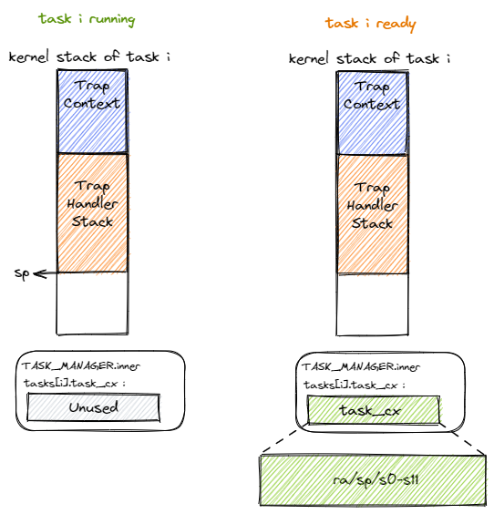

任務切換
================================

本節導讀
--------------------------

在上一節實現的二疊紀“鋸齒螈”操作系統還是比較原始，一個應用會獨佔 CPU 直到它出錯或主動退出。操作系統還是以程序的一次執行過程（從開始到結束）作為處理器切換程序的時間段。為了提高效率，我們需要引入新的操作系統概念 **任務** 、 **任務切換** 、**任務上下文** 。為此，我們需要實現從“螈”到“恐龍”的進化，實現“始初龍”操作系統。

如果把應用程序執行的整個過程進行進一步分析，可以看到，當程序訪問 I/O 外設或睡眠時，其實是不需要佔用處理器的，於是我們可以把應用程序在不同時間段的執行過程分為兩類，佔用處理器執行有效任務的計算階段和不必佔用處理器的等待階段。這些階段就形成了一個我們熟悉的“暫停-繼續...”組合的控制流或執行歷史。從應用程序開始執行到結束的整個控制流就是應用程序的整個執行過程。

本節的重點是操作系統的核心機制—— **任務切換** ，在內核中這種機制是在 ``__switch`` 函數中實現的。 任務切換支持的場景是：一個應用在運行途中便會主動或被動交出 CPU 的使用權，此時它只能暫停執行，等到內核重新給它分配處理器資源之後才能恢復並繼續執行。有了任務切換的能力，“螈”級的操作系統才能跳出水坑，進入陸地，才有能力進化到“恐龍”級的操作系統。

任務的概念形成
---------------------------------

..
    chyyuu：程序執行過程的圖示。

如果操作系統能夠在某個應用程序處於等待階段的時候，把處理器轉給另外一個處於計算階段的應用程序，那麼只要轉換的開銷不大，那麼處理器的執行效率就會大大提高。當然，這需要應用程序在運行途中能主動交出 CPU 的使用權，此時它處於等待階段，等到操作系統讓它再次執行後，那它就可以繼續執行了。

.. _term-task:
.. _term-task-switch:

到這裡，我們就把應用程序的一次執行過程（也是一段控制流）稱為一個 **任務** ，把應用執行過程中的一個時間片段上的執行片段或空閒片段稱為 “ **計算任務片** ” 或“ **空閒任務片** ” 。當應用程序的所有任務片都完成後，應用程序的一次任務也就完成了。從一個程序的任務切換到另外一個程序的任務稱為 **任務切換** 。為了確保切換後的任務能夠正確繼續執行，操作系統需要支持讓任務的執行“暫停”和“繼續”。

.. _term-task-context:

我們又看到了熟悉的“暫停-繼續”組合。一旦一條控制流需要支持“暫停-繼續”，就需要提供一種控制流切換的機制，而且需要保證程序執行的控制流被切換出去之前和切換回來之後，能夠繼續正確執行。這需要讓程序執行的狀態（也稱上下文），即在執行過程中同步變化的資源（如寄存器、棧等）保持不變，或者變化在它的預期之內。不是所有的資源都需要被保存，事實上只有那些對於程序接下來的正確執行仍然有用，且在它被切換出去的時候有被覆蓋風險的那些資源才有被保存的價值。這些需要保存與恢復的資源被稱為 **任務上下文 (Task Context)**  。
    

.. hint::

    **抽象與具體**

    注意：同學會在具體的操作系統設計實現過程中接觸到一些抽象的概念，其實這些概念都是具體代碼的結構和代碼動態執行過程的文字表述而已。

不同類型的上下文與切換
---------------------------------

在控制流切換過程中，我們需要結合硬件機制和軟件實現來保存和恢復任務上下文。任務的一次切換涉及到被換出和即將被換入的兩條控制流（分屬兩個應用的不同任務），通常它們都需要共同遵循某些約定來合作完成這一過程。在前兩章，我們已經看到了兩種上下文保存/恢復的實例。讓我們再來回顧一下它們：

- 第一章“應用程序與基本執行環境”中，我們介紹了 :ref:`函數調用與棧 <term-function-call-and-stack>` 。當時提到過，為了支持嵌套函數調用，不僅需要硬件平臺提供特殊的跳轉指令，還需要保存和恢復 :ref:`函數調用上下文 <term-function-context>` 。注意在上述定義中，函數調用包含在普通控制流（與異常控制流相對）之內，且始終用一個固定的棧來保存執行的歷史記錄，因此函數調用並不涉及控制流的特權級切換。但是我們依然可以將其看成調用者和被調用者兩個執行過程的“切換”，二者的協作體現在它們都遵循調用規範，分別保存一部分通用寄存器，這樣的好處是編譯器能夠有足夠的信息來儘可能減少需要保存的寄存器的數目。雖然當時用了很大的篇幅來說明，但其實整個過程都是編譯器負責完成的，我們只需設置好棧就行了。
- 第二章“批處理系統”中第一次涉及到了某種異常（Trap）控制流，即兩條控制流的特權級切換，需要保存和恢復 :ref:`系統調用（Trap）上下文 <term-trap-context>` 。當時，為了讓內核能夠 *完全掌控* 應用的執行，且不會被應用破壞整個系統，我們必須利用硬件提供的特權級機制，讓應用和內核運行在不同的特權級。應用運行在 U 特權級，它所被允許的操作進一步受限，處處被內核監督管理；而內核運行在 S 特權級，有能力處理應用執行過程中提出的請求或遇到的狀況。
  
應用程序與操作系統打交道的核心在於硬件提供的 Trap 機制，也就是在 U 特權級運行的應用控制流和在 S 特權級運行的 Trap 控制流（操作系統的陷入處理部分）之間的切換。Trap 控制流是在 Trap 觸發的一瞬間生成的，它和原應用控制流有著很密切的聯繫，因為它幾乎唯一的目標就是處理 Trap 並恢復到原應用控制流。而且，由於 Trap 機制對於應用來說幾乎是透明的，所以基本上都是 Trap 控制流在“負重前行”。Trap 控制流需要把 Trap 上下文（即幾乎所有的通用寄存器）保存在自己的內核棧上，因為在 Trap 處理過程中所有的通用寄存器都可能被用到。可以回看 :ref:`Trap 上下文保存與恢復 <trap-context-save-restore>` 小節。

.. _term-task-switch-impl:

任務切換的設計與實現
---------------------------------

本節所講的任務切換是第二章提及的 Trap 控制流切換之外的另一種異常控制流，都是描述兩條控制流之間的切換，如果將它和 Trap 切換進行比較，會有如下異同：

- 與 Trap 切換不同，它不涉及特權級切換；
- 與 Trap 切換不同，它的一部分是由編譯器幫忙完成的；
- 與 Trap 切換相同，它對應用是透明的。

事實上，任務切換是來自兩個不同應用在內核中的 Trap 控制流之間的切換。當一個應用 Trap 到 S 模式的操作系統內核中進行進一步處理（即進入了操作系統的 Trap 控制流）的時候，其 Trap 控制流可以調用一個特殊的 ``__switch`` 函數。這個函數表面上就是一個普通的函數調用：在 ``__switch`` 返回之後，將繼續從調用該函數的位置繼續向下執行。但是其間卻隱藏著複雜的控制流切換過程。具體來說，調用 ``__switch`` 之後直到它返回前的這段時間，原 Trap 控制流 *A* 會先被暫停並被切換出去， CPU 轉而運行另一個應用在內核中的 Trap 控制流 *B* 。然後在某個合適的時機，原 Trap 控制流 *A* 才會從某一條 Trap 控制流 *C* （很有可能不是它之前切換到的 *B* ）切換回來繼續執行並最終返回。不過，從實現的角度講， ``__switch`` 函數和一個普通的函數之間的核心差別僅僅是它會 **換棧** 。

當 Trap 控制流準備調用 ``__switch`` 函數使任務從運行狀態進入暫停狀態的時候，讓我們考察一下它內核棧上的情況。如上圖左側所示，在準備調用 ``__switch`` 函數之前，內核棧上從棧底到棧頂分別是保存了應用執行狀態的 Trap 上下文以及內核在對 Trap 處理的過程中留下的調用棧信息。由於之後還要恢復回來執行，我們必須保存 CPU 當前的某些寄存器，我們稱它們為 **任務上下文** (Task Context)。我們會在稍後介紹裡面需要包含哪些寄存器。至於上下文保存的位置，下一節在我們會介紹任務管理器 ``TaskManager`` ，在裡面能找到一個數組 ``tasks`` ，其中的每一項都是一個任務控制塊即 ``TaskControlBlock`` ，它負責保存一個任務的狀態，而任務上下文 ``TaskContext`` 被保存在任務控制塊中。在內核運行時我們會初始化 ``TaskManager`` 的全局實例 ``TASK_MANAGER`` ，因此所有任務上下文實際保存在在 ``TASK_MANAGER`` 中，從內存佈局來看則是放在內核的全局數據 ``.data`` 段中。當我們將任務上下文保存完畢之後則轉化為下圖右側的狀態。當要從其他任務切換回來繼續執行這個任務的時候，CPU 會讀取同樣的位置並從中恢復任務上下文。

.. 至於保存的位置，我們將任務 ``i`` 的任務上下文直接放在 ``TaskManager`` --> ``TaskManagerInner`` --> ``tasks[i]``  -->  ``task_cx`` 中 ，從這一點上來說它和函數調用不同，它並沒有放到棧中。注：這只是放置任務上下文的一種實現方式，我們也可以採用把任務上下文放到內核棧中的另一種實現方式。

對於當前正在執行的任務的 Trap 控制流，我們用一個名為 ``current_task_cx_ptr`` 的變量來保存放置當前任務上下文的地址；而用 ``next_task_cx_ptr`` 的變量來保存放置下一個要執行任務的上下文的地址。利用 C 語言的引用來描述的話就是：

.. code-block:: c

    TaskContext *current_task_cx_ptr = &tasks[current].task_cx;
    TaskContext *next_task_cx_ptr    = &tasks[next].task_cx;

..
    由於我們要用 ``task_cx_ptr`` 這個變量來進行保存任務上下文的地址，自然也要對任務上下文的地址進行讀寫操作。於是我們還需要指向 ``task_cx_ptr`` 這個變量的指針 ``task_cx_ptr2`` ：

    .. code-block:: C

        TaskContext **task_cx_ptr2 = &task_cx_ptr;

接下來我們同樣從棧上內容的角度來看 ``__switch`` 的整體流程：

.. image:: switch.png

Trap 控制流在調用 ``__switch`` 之前就需要明確知道即將切換到哪一條目前正處於暫停狀態的 Trap 控制流，因此 ``__switch`` 有兩個參數，第一個參數代表它自己，第二個參數則代表即將切換到的那條 Trap 控制流。這裡我們用上面提到過的 ``current_task_cx_ptr`` 和 ``next_task_cx_ptr``  作為代表。在上圖中我們假設某次 ``__switch`` 調用要從 Trap 控制流 A 切換到 B，一共可以分為四個階段，在每個階段中我們都給出了 A 和 B 內核棧上的內容。

- 階段 [1]：在 Trap 控制流 A 調用 ``__switch`` 之前，A 的內核棧上只有 Trap 上下文和 Trap 處理函數的調用棧信息，而 B 是之前被切換出去的；
- 階段 [2]：A 在 A 任務上下文空間在裡面保存 CPU 當前的寄存器快照；
- 階段 [3]：這一步極為關鍵，讀取 ``next_task_cx_ptr`` 指向的 B 任務上下文，根據 B 任務上下文保存的內容來恢復 ``ra`` 寄存器、``s0~s11`` 寄存器以及 ``sp`` 寄存器。只有這一步做完後， ``__switch`` 才能做到一個函數跨兩條控制流執行，即 *通過換棧也就實現了控制流的切換* 。
- 階段 [4]：上一步寄存器恢復完成後，可以看到通過恢復 ``sp`` 寄存器換到了任務 B 的內核棧上，進而實現了控制流的切換。這就是為什麼 ``__switch`` 能做到一個函數跨兩條控制流執行。此後，當 CPU 執行 ``ret`` 彙編偽指令完成 ``__switch`` 函數返回後，任務 B 可以從調用 ``__switch`` 的位置繼續向下執行。

從結果來看，我們看到 A 控制流 和 B 控制流的狀態發生了互換， A 在保存任務上下文之後進入暫停狀態，而 B 則恢復了上下文並在 CPU 上繼續執行。

下面我們給出 ``__switch`` 的實現：

.. code-block:: riscv
    :linenos:

    # os/src/task/switch.S

    .altmacro
    .macro SAVE_SN n
        sd s\n, (\n+2)*8(a0)
    .endm
    .macro LOAD_SN n
        ld s\n, (\n+2)*8(a1)
    .endm
        .section .text
        .globl __switch
    __switch:
        # 階段 [1]
        # __switch(
        #     current_task_cx_ptr: *mut TaskContext,
        #     next_task_cx_ptr: *const TaskContext
        # )
        # 階段 [2]
        # save kernel stack of current task
        sd sp, 8(a0)
        # save ra & s0~s11 of current execution
        sd ra, 0(a0)
        .set n, 0
        .rept 12
            SAVE_SN %n
            .set n, n + 1
        .endr
        # 階段 [3]
        # restore ra & s0~s11 of next execution
        ld ra, 0(a1)
        .set n, 0
        .rept 12
            LOAD_SN %n
            .set n, n + 1
        .endr
        # restore kernel stack of next task
        ld sp, 8(a1)
        # 階段 [4]
        ret

我們手寫彙編代碼來實現 ``__switch`` 。在階段 [1] 可以看到它的函數原型中的兩個參數分別是當前 A 任務上下文指針 ``current_task_cx_ptr`` 和即將被切換到的 B 任務上下文指針 ``next_task_cx_ptr``  ，從 :ref:`RISC-V 調用規範 <term-calling-convention>` 可以知道它們分別通過寄存器 ``a0/a1`` 傳入。階段 [2] 體現在第 19~27 行，即將當前 CPU 狀態（包括 ``ra`` 寄存器、 ``s0~s11`` 寄存器以及 ``sp`` 寄存器）保存到 A 任務上下文。相對的，階段 [3] 體現在第 29~37 行，即根據 B 任務上下文保存的內容來恢復上述 CPU 狀態。從中我們也能夠看出 ``TaskContext`` 裡面究竟包含哪些寄存器：

.. code-block:: rust
    :linenos:

    // os/src/task/context.rs

    pub struct TaskContext {
        ra: usize,
        sp: usize,
        s: [usize; 12],
    }

保存 ``ra`` 很重要，它記錄了 ``__switch`` 函數返回之後應該跳轉到哪裡繼續執行，從而在任務切換完成並 ``ret`` 之後能到正確的位置。對於一般的函數而言，Rust/C 編譯器會在函數的起始位置自動生成代碼來保存 ``s0~s11`` 這些被調用者保存的寄存器。但 ``__switch`` 是一個用匯編代碼寫的特殊函數，它不會被 Rust/C 編譯器處理，所以我們需要在 ``__switch`` 中手動編寫保存 ``s0~s11`` 的彙編代碼。 不用保存其它寄存器是因為：其它寄存器中，屬於調用者保存的寄存器是由編譯器在高級語言編寫的調用函數中自動生成的代碼來完成保存的；還有一些寄存器屬於臨時寄存器，不需要保存和恢復。

我們會將這段彙編代碼中的全局符號 ``__switch`` 解釋為一個 Rust 函數：

.. code-block:: rust
    :linenos:

    // os/src/task/switch.rs

    global_asm!(include_str!("switch.S"));

    use super::TaskContext;

    extern "C" {
        pub fn __switch(
            current_task_cx_ptr: *mut TaskContext,
            next_task_cx_ptr: *const TaskContext
        );
    }

我們會調用該函數來完成切換功能而不是直接跳轉到符號 ``__switch`` 的地址。因此在調用前後 Rust 編譯器會自動幫助我們插入保存/恢復調用者保存寄存器的彙編代碼。

仔細觀察的話可以發現 ``TaskContext`` 很像一個普通函數棧幀中的內容。正如之前所說， ``__switch`` 的實現除了換棧之外幾乎就是一個普通函數，也能在這裡得到體現。儘管如此，二者的內涵卻有著很大的不同。

同學可以自行對照註釋看看圖示中的後面幾個階段各是如何實現的。另外，當內核僅運行單個應用的時候，無論該任務主動/被動交出 CPU 資源最終都會交還給自己，這將導致傳給 ``__switch`` 的兩個參數相同，也就是某個 Trap 控制流自己切換到自己的情形，請同學對照圖示思考目前的實現能否對它進行正確處理。
