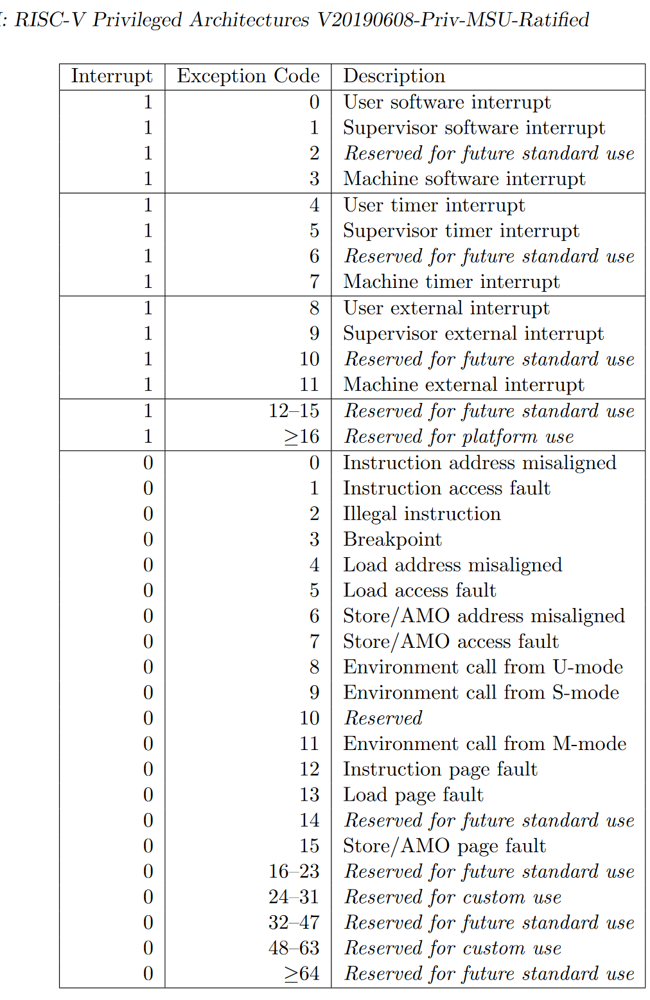

練習參考答案
=======================================

課後練習
-------------------------------

編程題
~~~~~~~~~~~~~~~~~~~~~~~~~~~~~~~

1. 擴展內核，能夠顯示操作系統切換任務的過程。
^^^^^^^^^^^^^^^^^^^^^^^^^^^^^^^^^^^^^^^^^^^^^

切換任務是在 ``task/mod.rs`` 中的 ``TASK_MANAGER`` 中完成的，主要靠
``mark_current_suspended()`` 和 ``mark_current_exited()``
標記任務運行結束，\ ``run_next_task``
標記任務開始運行，在其中插入輸出即可顯示切換任務的過程（下面代碼中的加入的三行
``println!`` ）

.. caution:: **03sleep.rs測例會導致頻繁切換任務，使得輸出過多。可以修改測例的等待時間來減少輸出。**

.. code:: rust

       /// Change the status of current `Running` task into `Ready`.
       fn mark_current_suspended(&self) {
           let mut inner = self.inner.exclusive_access();
           let current = inner.current_task;
           println!("task {} suspended", current);
           inner.tasks[current].task_status = TaskStatus::Ready;
       }

       /// Change the status of current `Running` task into `Exited`.
       fn mark_current_exited(&self) {
           let mut inner = self.inner.exclusive_access();
           let current = inner.current_task;
           println!("task {} exited", current);
           inner.tasks[current].task_status = TaskStatus::Exited;
       }

       /// Switch current `Running` task to the task we have found,
       /// or there is no `Ready` task and we can exit with all applications completed
       fn run_next_task(&self) {
           if let Some(next) = self.find_next_task() {
               let mut inner = self.inner.exclusive_access();
               let current = inner.current_task;
               println!("task {} start", current);
               inner.tasks[next].task_status = TaskStatus::Running;
               inner.current_task = next;
               let current_task_cx_ptr = &mut inner.tasks[current].task_cx as *mut TaskContext;
               let next_task_cx_ptr = &inner.tasks[next].task_cx as *const TaskContext;
               drop(inner);
               // before this, we should drop local variables that must be dropped manually
               unsafe {
                   __switch(current_task_cx_ptr, next_task_cx_ptr);
               }
               // go back to user mode
           } else {
               println!("All applications completed!");
               use crate::board::QEMUExit;
               crate::board::QEMU_EXIT_HANDLE.exit_success();
           }
       }

2. 擴展內核，能夠統計每個應用執行後的完成時間：用戶態完成時間和內核態完成時間。
^^^^^^^^^^^^^^^^^^^^^^^^^^^^^^^^^^^^^^^^^^^^^^^^^^^^^^^^^^^^^^^^^^^^^^^^^^^^^^^

.. note:: 如果先做了第一題，記得刪掉上面的輸出，並且最好復原 ``03sleep.rs``\ （如果有修改）。

2.1. 如何計算時間
'''''''''''''''''''
首先給每個 ``TaskControlBlock`` 加上用戶時間和內核時間兩個屬性：

.. code:: rust

   #[derive(Copy, Clone)]
   pub struct TaskControlBlock {
       pub task_status: TaskStatus,
       pub task_cx: TaskContext,
       pub user_time: usize,
       pub kernel_time: usize,
   }

然後在 ``TaskManager`` 中設置一個“停表”變量
``stop_watch``\ ，並通過以下方法來“掐表”：

.. code:: rust

   /// Inner of Task Manager
   pub struct TaskManagerInner {
       /// task list
       tasks: [TaskControlBlock; MAX_APP_NUM],
       /// id of current `Running` task
       current_task: usize,
       /// 停表
       stop_watch: usize,
   }

.. code:: rust

   impl TaskManagerInner {
       fn refresh_stop_watch(&mut self) -> usize {
           let start_time = self.stop_watch;
           self.stop_watch = get_time_ms();
           self.stop_watch - start_time
       }
   }

可以看到，這個方法每次會返回從當前到上一次“掐表”的時間間隔，然後刷新為當前時間。之後就可以利用它來統計應用執行時間了。

2.2. 統計內核態時間
'''''''''''''''''''

切換內核態任務時，需要記錄上一個任務的時間，並重新開始統計下一個任務的時間。

在 ``TaskManager`` 的三個方法中插入上面的
``refresh_stop_watch()``\ 即可（注意中文註釋的位置）

.. code:: rust

       fn run_first_task(&self) -> ! {
           let mut inner = self.inner.exclusive_access();
           let task0 = &mut inner.tasks[0];
           task0.task_status = TaskStatus::Running;
           let next_task_cx_ptr = &task0.task_cx as *const TaskContext;
           /// 開始記錄時間
           inner.refresh_stop_watch();
           drop(inner);
           let mut _unused = TaskContext::zero_init();
           // before this, we should drop local variables that must be dropped manually
           unsafe {
               __switch(&mut _unused as *mut TaskContext, next_task_cx_ptr);
           }
           panic!("unreachable in run_first_task!");
       }

       /// Change the status of current `Running` task into `Ready`.
       fn mark_current_suspended(&self) {
           let mut inner = self.inner.exclusive_access();
           let current = inner.current_task;
           // 統計內核時間
           inner.tasks[current].kernel_time += inner.refresh_stop_watch();
           inner.tasks[current].task_status = TaskStatus::Ready;
       }

       /// Change the status of current `Running` task into `Exited`.
       fn mark_current_exited(&self) {
           let mut inner = self.inner.exclusive_access();
           let current = inner.current_task;
           // 統計內核時間並輸出
           inner.tasks[current].kernel_time += inner.refresh_stop_watch();
           println!("[task {} exited. user_time: {} ms, kernle_time: {} ms.", current, inner.tasks[current].user_time, inner.tasks[current].kernel_time);
           inner.tasks[current].task_status = TaskStatus::Exited;
       }

2.3. 統計用戶態時間
'''''''''''''''''''

在 ``trap`` 進入退出用戶態的時候，可以統計用戶態的運行時間，在
``trap_handler`` 的開頭結尾添加上函數 ``user_time_end``
``user_time_start``\ ：

.. code:: rust

   /// handle an interrupt, exception, or system call from user space
   pub fn trap_handler(cx: &mut TrapContext) -> &mut TrapContext {
       crate::task::user_time_end();
       let scause = scause::read(); // get trap cause
       let stval = stval::read(); // get extra value
       match scause.cause() {
           Trap::Exception(Exception::UserEnvCall) => {
               cx.sepc += 4;
               cx.x[10] = syscall(cx.x[17], [cx.x[10], cx.x[11], cx.x[12]]) as usize;
           }
           Trap::Exception(Exception::StoreFault) | Trap::Exception(Exception::StorePageFault) => {
               println!("[kernel] PageFault in application, bad addr = {:#x}, bad instruction = {:#x}, kernel killed it.", stval, cx.sepc);
               exit_current_and_run_next();
           }
           Trap::Exception(Exception::IllegalInstruction) => {
               println!("[kernel] IllegalInstruction in application, kernel killed it.");
               exit_current_and_run_next();
           }
           Trap::Interrupt(Interrupt::SupervisorTimer) => {
               set_next_trigger();
               suspend_current_and_run_next();
           }
           _ => {
               panic!(
                   "Unsupported trap {:?}, stval = {:#x}!",
                   scause.cause(),
                   stval
               );
           }
       }
       crate::task::user_time_start();
       cx
   }

這兩個函數的實現也很簡單，在 ``TaskManager`` 的實現中加入：

.. code:: rust

       /// 統計內核時間，從現在開始算的是用戶時間
       fn user_time_start(&self) {
           let mut inner = self.inner.exclusive_access();
           let current = inner.current_task;
           inner.tasks[current].kernel_time += inner.refresh_stop_watch();
       }

       /// 統計用戶時間，從現在開始算的是內核時間
       fn user_time_end(&self) {
           let mut inner = self.inner.exclusive_access();
           let current = inner.current_task;
           inner.tasks[current].user_time += inner.refresh_stop_watch();
       }

再在同文件 ``task/mod.rs`` 中包裝成

.. code:: rust

   /// 統計內核時間，從現在開始算的是用戶時間
   pub fn user_time_start() {
       TASK_MANAGER.user_time_start()
   }

   /// 統計用戶時間，從現在開始算的是內核時間
   pub fn user_time_end() {
       TASK_MANAGER.user_time_end()
   }

就是全部的實現了。

2.4. 這個實現正確嗎？（重要）
'''''''''''''''''''''''''''''''''

上面的實現其實隱含了所有的切換情況。請考慮以下的場景：

i. 第一個任務開始運行時：

-  先在\ ``run_first_task`` 中刷新了停表(不統計)，隨後通過 ``__switch``
   跳轉到 ``__restore``\ 進入用戶態執行。

-  從用戶態回來後，遇到函數
   ``user_time_end()``\ ，此時刷新停表並統計用戶態時間。

ii. 正常 syscall

-  從用戶態回來後，遇到函數
   ``user_time_end()``\ ，此時刷新停表並統計用戶態時間。

-  在 ``trap`` 結尾處遇到函數
   ``user_time_start()``\ ，刷新停表，並統計內核態時間

iii. 通過時鐘中斷切換任務：

-  前一個任務從用戶態回來後，遇到函數
   ``user_time_end()``\ ，此時刷新停表並統計用戶態時間。

-  在 ``mark_current_suspended`` 中又刷新停表，並統計內核態時間。

-  切換到新任務後，在 ``trap`` 結尾處遇到函數
   ``user_time_start()``\ ，刷新停表，並統計新任務的內核態時間

iv. 任務結束

-  從用戶態回來後，遇到函數
   ``user_time_end()``\ ，此時刷新停表並統計用戶態時間。

-  在 ``mark_current_exited``\ 中又刷新停表，並統計內核態時間，然後輸出

3. 編寫浮點應用程序A，並擴展內核，支持面向浮點應用的正常切換與搶佔。
^^^^^^^^^^^^^^^^^^^^^^^^^^^^^^^^^^^^^^^^^^^^^^^^^^^^^^^^^^^^^^^^^^^^

需要在 ``trap.S`` 中加入浮點寄存器組的保存和恢復指令（見中文註釋處）：

::

   __alltraps:
       csrrw sp, sscratch, sp
       # now sp->kernel stack, sscratch->user stack
       # allocate a TrapContext on kernel stack
       addi sp, sp, -34*8
       # save general-purpose registers
       sd x1, 1*8(sp)
       # skip sp(x2), we will save it later
       sd x3, 3*8(sp)
       # skip tp(x4), application does not use it
       # save x5~x31
       .set n, 5
       .rept 27
           SAVE_GP %n
           .set n, n+1
       .endr
       # we can use t0/t1/t2 freely, because they were saved on kernel stack
       csrr t0, sstatus
       csrr t1, sepc
       sd t0, 32*8(sp)
       sd t1, 33*8(sp)
       # read user stack from sscratch and save it on the kernel stack
       csrr t2, sscratch
       # 浮點寄存器
       fsd fs0, 34*8(sp)
       fsd fs1, 35*8(sp)
       ......
       sd t2, 2*8(sp)
       # set input argument of trap_handler(cx: &mut TrapContext)
       mv a0, sp
       call trap_handler

   __restore:
       # now sp->kernel stack(after allocated), sscratch->user stack
       # restore sstatus/sepc
       ld t0, 32*8(sp)
       ld t1, 33*8(sp)
       ld t2, 2*8(sp)
       csrw sstatus, t0
       csrw sepc, t1
       csrw sscratch, t2
       # restore general-purpuse registers except sp/tp
       ld x1, 1*8(sp)
       ld x3, 3*8(sp)
       .set n, 5
       .rept 27
           LOAD_GP %n
           .set n, n+1
       .endr
       # 浮點寄存器
       fld fs0, 34*8(sp)
       fld fs1, 35*8(sp)
       ......
       # release TrapContext on kernel stack
       addi sp, sp, 34*8
       # now sp->kernel stack, sscratch->user stack
       csrrw sp, sscratch, sp
       sret

此外，支持浮點指令可能還需要(包括但不限於)以下條件：

-  機器本身支持浮點指令

-  Rust 編譯目標包含浮點指令

   -  在 ``os/Makefile`` 中的 ``TARGET := riscv64gc-unknown-none-elf``
      支持浮點指令，而對應的 ``riscv64imac`` 則不支持。

   -  如果機器本身支持但使用\ ``riscv64imac``\ 作為編譯目標，仍然可以通過強行插入指令的方式來支持浮點，如
      ``fld fs0, 280(sp)`` 在 RISCV 指令集中表示為機器碼 ``0x2472``
      ，就可以在上面的 ``trap.S`` 中插入

      ::

         .short 0x2472 # fld fs0, 280(sp)

      來支持浮點指令

-  需要通過控制浮點控制狀態寄存器（如 ``fcsr``\ ）來檢查FPU狀態。詳見
   https://five-embeddev.com/riscv-isa-manual/latest/machine.html#machine-trap-vector-base-address-register-mtvec

4. 編寫應用程序或擴展內核，能夠統計任務切換的大致開銷。
^^^^^^^^^^^^^^^^^^^^^^^^^^^^^^^^^^^^^^^^^^^^^^^^^^^^^^^

所有任務切換都通過
``__switch``\ ，可以包裝一下這個函數，統計它運行的開銷。首先刪除
``task/mod.rs`` 中的 ``use switch::__switch``\ ，然後加入以下函數來代替
``__switch``\ ：

.. code:: rust

   /// 切換的開始時間
   static mut SWITCH_TIME_START: usize = 0;
   /// 切換的總時間
   static mut SWITCH_TIME_COUNT: usize = 0;

   unsafe fn __switch(current_task_cx_ptr: *mut TaskContext, next_task_cx_ptr: *const TaskContext) {
       SWITCH_TIME_START = get_time_us();
       switch::__switch(current_task_cx_ptr, next_task_cx_ptr);
       SWITCH_TIME_COUNT += get_time_us() - SWITCH_TIME_START;
   }

   fn get_switch_time_count() -> usize {
       unsafe { SWITCH_TIME_COUNT }
   }

.. caution::
   這裡統計時間使用了一個
   ``get_time_us``\ ，即計算當前的微秒數。這是因為任務切換的時間比較短，不好用毫秒來計數。對應的實現在
   ``timer.rs`` 中：

.. code:: rust

   const USEC_PER_SEC: usize = 1000000;

   /// get current time in milliseconds
   pub fn get_time_us() -> usize {
       time::rad() / (CLOCK_FREQ / USEC_PER_SEC)
   }

最後，在 ``run_next_task`` 中所有程序退出後，增加一條輸出語句即可：

.. code:: rust

   ......
           } else {
               println!("All applications completed!");
               // 統計任務切換時間
               println!("task switch time: {} us", get_switch_time_count());
               use crate::board::QEMUExit;
               crate::board::QEMU_EXIT_HANDLE.exit_success();
           }

5.擴展內核，支持在內核態響應中斷。
^^^^^^^^^^^^^^^^^^^^^^^^^^^^^^^^^^

內核開關中斷的控制主要涉及\ ``sstatus``\ 寄存器的兩個位：

-  在 ``sie`` 位可開關中斷，如使用

   .. code:: rust

      use riscv::register::sstatus;
      unsafe { sstatus::set_sie() }; // 打開內核態中斷
      unsafe { sstatus::clear_sie() }; // 關閉內核態中斷

-  在 ``spp`` 位可以分辨中斷的來源。現在\ **將原本的
   ``trap/mod.rs:trap_handler()`` 改名為 ``user_trap_handler()``\ ，
   並增加一個新的 ``trap_handler()`` 函數**\ ：

   .. code:: rust

      #[no_mangle]
      pub fn trap_handler(cx: &mut TrapContext) -> &mut TrapContext {
          match sstatus::read().spp() {
              sstatus::SPP::Supervisor => kernel_trap_handler(cx),
              sstatus::SPP::User => user_trap_handler(cx),
          }
      }

從上面的函數可以看出，我們還需要額外在 ``trap/mod.rs`` 寫一個
``kernel_trap_handler`` 來處理內核中斷：

.. code:: rust

   /// 處理內核異常和中斷
   pub fn kernel_trap_handler(cx: &mut TrapContext) -> &mut TrapContext {
       let scause = scause::read();
       let stval = stval::read();
       match scause.cause() {
           Trap::Interrupt(Interrupt::SupervisorTimer) => {
               // 內核中斷來自一個時鐘中斷
               println!("kernel interrupt: from timer");
               // 標記一下觸發了中斷
               mark_kernel_interrupt();
               set_next_trigger();
           }
           Trap::Exception(Exception::StoreFault) | Trap::Exception(Exception::StorePageFault) => {
               panic!("[kernel] PageFault in kernel, bad addr = {:#x}, bad instruction = {:#x}, kernel killed it.", stval, cx.sepc);
           }
           _ => {
               // 其他的內核異常/中斷
               panic!("unknown kernel exception or interrupt");
           }
       }
       cx
   }

其中和用戶態的中斷實現大致相同，但異常和中斷沒有寫全，可以後續補充。值得注意的有以下幾點：

-  在函數中不使用 ``clear_sie / set_sie``
   來開關中斷，這是因為雖然我們在\ ``main.rs``\ 的測試中打開了中斷，但
   ``RISC-V`` 會自動在中斷觸發時關閉 ``sstatus.SIE``\ ，在
   ``sret``\ 返回時打開
   ``sstatus.SIE``\ 。\ **在內核中需要小心打開中斷的時機**\ 。例如觸發中斷時，內核正在拿著一些
   mutex 鎖，那麼它在 ``trap_handler``
   中處理時一旦嘗試拿鎖，就可能自己跟自己造成死鎖。

-  在收到時鐘中斷時，輸出了內容並調用了
   ``mark_kernel_interrupt``\ 。這和中斷機制無關，只是在\ ``trap/mod.rs``
   中增加了一個全局變量，用於檢查是否成功觸發了內核中斷

.. code:: rust

   static mut KERNEL_INTERRUPT_TRIGGERED: bool = false;

   /// 檢查內核中斷是否觸發
   pub fn check_kernel_interrupt() -> bool {
       unsafe { (&mut KERNEL_INTERRUPT_TRIGGERED as *mut bool).read_volatile() }
   }

   /// 標記內核中斷已觸發
   pub fn trigger_kernel_interrupt() {
       unsafe {
           (&mut KERNEL_INTERRUPT_TRIGGERED as *mut bool).write_volatile(true);
       }
   }

相對應的，在 ``main.rs`` 中，我們在 ``timer::set_next_trigger()``
之後，在開始用戶程序的 ``task::run_first_task();``
之前加了一段測試程序：

.. code:: rust

   pub fn rust_main() -> ! {
       clear_bss();
       println!("[kernel] Hello, world!");
       trap::init();
       loader::load_apps();
       trap::enable_timer_interrupt();
       timer::set_next_trigger();

       use riscv::register::sstatus;
       unsafe { sstatus::set_sie() }; // 打開內核態中斷
       loop {
           if trap::check_kernel_interrupt() {
               println!("kernel interrupt returned.");
               break;
           }
       }
       unsafe { sstatus::clear_sie() }; // 關閉內核態中斷
       task::run_first_task();
       panic!("Unreachable in rust_main!");
   }

但修改上面的代碼後還無法通過編譯，\ **因為真正的“中斷入口處理”是在
``trap.S`` 中的彙編代碼，如果它不做任何處理**\ ：

-  一個內核中斷進入原本的 ``trap.S`` 代碼時，它會首先遇到
   ``csrrw sp, sscratch, sp``

   -  按上面的測試，此時還沒有進入用戶程序，那麼交換後 sp 為 0。

      ``trap.S`` 下面的代碼是增長棧並嘗試保存寄存器：

      ::

         __alltraps:
             csrrw sp, sscratch, sp
             # now sp->kernel stack, sscratch->user stack
             # allocate a TrapContext on kernel stack
             addi sp, sp, -34*8
             # save general-purpose registers
             sd x1, 1*8(sp)

      在\ ``addi``\ 指令後， sp 會被寫成 ``0xfffffffffffffef8``\ ；在
      ``sd``
      指令時，因為寫入地址不合法（整個內核都在\ ``0x80200000``\ 附近）會觸發
      ``StorePageFault``

-  

   -  由於觸發\ ``StorePageFault``\ ，此時又會進入
      ``__alltraps``\ ，於是內核在這幾條語句上死循環了

如果進入用戶程序後，在用戶程序的內核態觸發內核中斷，那麼此時會把用戶態的棧交換到
``sp`` 寄存器，並在用戶態的棧裡寫內核信息。這也是不可接受的錯誤。

因此，我們需要\ **在 ``trap.S``
內陷入和返回時做出判斷，如果是內核中斷異常則不換棧，如果是用戶中斷異常則通過
``csrrw sp, sscratch, sp`` 換棧**

將 ``__alltrap`` 的開頭改為：

.. code:: asm

   __alltraps:
       csrr tp, sstatus
       andi tp, tp, 0x100
       beqz tp, __user_trap_start
       j __real_trap_entry

   __user_trap_start:
       csrrw sp, sscratch, sp

   __real_trap_entry:
       # now sp->kernel stack, sscratch->user stack
       # allocate a TrapContext on kernel stack
       addi sp, sp, -34*8
       ......

這段代碼等價於取出\ ``sstatus``\ 寄存器的
``spp``\ 位做判斷，如果為0則是用戶態中斷，否則是內核態中斷。類似地，在中斷返回時也要做一次判斷。將
``__restore`` 改為：

.. code:: 

   __restore:
       # now sp->kernel stack(after allocated), sscratch->user stack
       # restore sstatus/sepc
       ld t0, 32*8(sp)
       ld t1, 33*8(sp)
       ld t2, 2*8(sp)
       csrw sstatus, t0
       csrw sepc, t1
       csrw sscratch, t2
       # get SPP
       andi t0, t0, 0x100
       bnez t0, __kernel_trap_end

   __user_trap_end:
       # restore general-purpuse registers except sp/tp
       ld x1, 1*8(sp)
       ld x3, 3*8(sp)
       .set n, 5
       .rept 27
           LOAD_GP %n
           .set n, n+1
       .endr
       # release TrapContext on kernel stack
       addi sp, sp, 34*8
       # now sp->kernel stack, sscratch->user stack
       csrrw sp, sscratch, sp
       sret

   __kernel_trap_end:
       # restore general-purpuse registers except sp/tp
       ld x1, 1*8(sp)
       ld x3, 3*8(sp)
       .set n, 5
       .rept 27
           LOAD_GP %n
           .set n, n+1
       .endr
       # release TrapContext on kernel stack
       addi sp, sp, 34*8
       sret

.. caution:: 注意返回時需要先獲取中斷來源信息再恢復寄存器。

以上就是內核中斷的一個基本實現了，但還不具備實用價值，真正利用內核中斷還需要擴展
``kernel_trap_handler`` 函數，支持更有意義的中斷類型。

如何在不破壞寄存器的情況下檢查中斷來源
''''''''''''''''''''''''''''''''''''''

在上面的代碼實現中，在陷入 ``__alltrap`` 時利用了 ``tp`` 寄存器來檢查
``sstatus``\ 的\ ``SPP`` 信息，這樣原本\ ``tp``
寄存器的信息就丟失了。但後續也有很多方法可以避免這個問題：

-  在
   ``rCore-Tutorial``\ 本章節中，內核棧和用戶棧都直接寫在\ ``loader.rs``
   中。但在實際的內核中，用戶空間往往在低地址（\ ``0x00000......``\ ），而內核空間在高地址（\ ``0xfffff......``\ ）。

   可以利用這一點，把 ``sp``
   看作有符號整數，如果它是負數則是內核棧地址，代表內核態發的中斷；如果它是正數則是用戶棧地址，代表用戶態發的中斷。即：

   .. code:: asm

      __alltraps:
          bgtz sp, __user_trap_start
          j __real_trap_entry

      __user_trap_start:
          csrrw sp, sscratch, sp

      __real_trap_entry:
          # now sp->kernel stack, sscratch->user stack
          # allocate a TrapContext on kernel stack
          addi sp, sp, -34*8
          ......

這樣就可以規避目前代碼中丟失 ``tp`` 寄存器的問題。

-  另一種方法是擴展 ``sscratch`` 的定義。目前 ``sscratch``
   只用於用戶棧和內核棧的交換，可以使它表示一個專門的頁或者中間棧或者處理函數，在其中完成寄存器的保存，再安全地用寄存器檢查中斷來源。

注：上述擴展內核的編程基於 rcore/ucore tutorial v3: Branch ch3

問答題
~~~~~~~~~~~~~~~~~~~~~~~~~~~~~~~

1. `*` 協作式調度與搶佔式調度的區別是什麼？

   協作式調度中，進程主動放棄 (yield) 執行資源，暫停運行，將佔用的資源讓給其它進程；搶佔式調度中，進程會被強制打斷暫停，釋放資源讓給別的進程。

2. `*` 中斷、異常和系統調用有何異同之處？

   * 相同點

     * 都會從通常的控制流中跳出，進入 trap handler 進行處理。

   * 不同點

     * 中斷的來源是異步的外部事件，由外設、時鐘、別的 hart 等外部來源，與 CPU 正在做什麼沒關係。
     * 異常是 CPU 正在執行的指令遇到問題無法正常進行而產生的。
     * 系統調用是程序有意想讓操作系統幫忙執行一些操作，用專門的指令（如 ``ecall`` ）觸發的。

3. `*` RISC-V支持哪些中斷/異常？

見下圖

4. `*` 如何判斷進入操作系統內核的起因是由於中斷還是異常？

檢查 mcause 寄存器的最高位，1 表示中斷，0 表示異常。

當然在 Rust 中也可以直接利用 ``riscv`` 庫提供的接口判斷：

.. code:: rust

   let scause = scause::read();
       if scause.is_interrupt() {
           do_something
       }
       if scause.is_exception() {
           do_something
       }

又或者，可以按照 ``trap/mod.rs:trap_handler()`` 中的寫法，用
``match scause.cause()`` 來判斷。

5. `**` 在 RISC-V 中斷機制中，PLIC 和 CLINT 各起到了什麼作用？

   CLINT 處理時鐘中斷 (``MTI``) 和核間的軟件中斷 (``MSI``)；PLIC 處理外部來源的中斷 (``MEI``)。

   PLIC 的規範文檔： https://github.com/riscv/riscv-plic-spec

   .. TODO SiFive CLINT 的文檔在哪兒？

6. `**` 基於RISC-V 的操作系統支持中斷嵌套？請給出進一步的解釋說明。

RISC-V原生不支持中斷嵌套。(在S態的內核中)只有 ``sstatus`` 的 ``SIE``
位為 1 時，才會開啟中斷，再由 ``sie``
寄存器控制哪些中斷可以觸發。觸發中斷時，\ ``sstatus.SPIE`` 置為
``sstatus.SIE``\ ，而 ``sstatus.SIE`` 置為0；當執行 ``sret``
時，\ ``sstatus.SIE``\ 置為 ``sstatus.SPIE``\ ，而 ``sstatus.SPIE``
置為1。這意味著觸發中斷時，因為 ``sstatus.SIE``
為0，所以無法再次觸發中斷。

7. `**` 本章提出的任務的概念與前面提到的進程的概念之間有何區別與聯繫？

   * 聯繫：任務和進程都有自己獨立的棧、上下文信息，任務是進程的“原始版本”，在第五章會將目前的用戶程序從任務升級為進程。

   * 區別：任務之間沒有地址空間隔離，實際上是能相互訪問到的；進程之間有地址空間隔離，一個進程無法訪問到另一個進程的地址。

8. `*` 簡單描述一下任務的地址空間中有哪些類型的數據和代碼。

可參照 ``user/src/linker.ld``\ ：

-  ``.text``\ ：任務的代碼段，其中開頭的 ``.text.entry``
   段包含任務的入口地址

-  ``.rodata``\ ：只讀數據，包含字符串常量，如測例中的
   ``println!("Test power_3 OK!");`` 實際打印的字符串存在這裡

-  ``.data``\ ：需要初始化的全局變量

-  ``.bss``\ ：未初始化或初始為0的全局變量。

-  

   -  在之後第四章的
      ``user/src/bin/00power_3.rs``\ 中，會把第三章中在用戶棧上定義的數組移到全局變量中\ ``static mut S: [u64; LEN] = [0u64; LEN];``

   -  在第五章的 ``user/lib.rs``\ 中，會在 ``bss`` 段構造一個用戶堆
      ``static mut HEAP_SPACE: [u8; USER_HEAP_SIZE] = [0; USER_HEAP_SIZE];``

除此之外，在內核中為每個任務構造的用戶棧
``os/src/loader.rs:USER_STACK``\ 也屬於各自任務的地址。

9.  `*` 任務控制塊保存哪些內容？

在本章中，任務控制塊即 ``os/src/task/task.rs:TaskControlBlock``
保存任務目前的執行狀態 ``task_status`` 和任務上下文 ``task_cx``\ 。

10. `*` 任務上下文切換需要保存與恢復哪些內容？

    需要保存通用寄存器的值，PC；恢復的時候除了保存的內容以外還要恢復特權級到用戶態。

11. `*` 特權級上下文和任務上下文有何異同？

-  相同點：特權級上下文和任務上下文都保留了一組寄存器，都代表一個“執行流”

-  不同點：

-  

   -  特權級上下文切換可以發生在中斷異常時，所以它不符合函數調用約定，需要保存所有通用寄存器。同時它又涉及特權級切換，所以還額外保留了一些
      CSR，在切換時還會涉及更多的 CSR。

   -  任務上下文由內核手動觸發，它包裝在
      ``os/src/task/switch.rs:__switch()``
      裡，所以除了“返回函數與調用函數不同”之外，它符合函數調用約定，只需要保存通用寄存器中
      ``callee``
      類型的寄存器。為了滿足切換執行流時“返回函數與調用函數不同”的要求，它還額外保存
      ``ra``\ 。

12. `*` 上下文切換為什麼需要用匯編語言實現？

    上下文切換過程中，需要我們直接控制所有的寄存器。C 和 Rust 編譯器在編譯代碼的時候都會“自作主張”使用通用寄存器，以及我們不知道的情況下訪問棧，這是我們需要避免的。

    切換到內核的時候，保存好用戶態狀態之後，我們將棧指針指向內核棧，相當於構建好一個高級語言可以正常運行的環境，這時候就可以由高級語言接管了。

13. `*` 有哪些可能的時機導致任務切換？

    系統調用（包括進程結束執行）、時鐘中斷。

14. `**` 在設計任務控制塊時，為何採用分離的內核棧和用戶棧，而不用一個棧？

    用戶程序可以任意修改棧指針，將其指向任意位置，而內核在運行的時候總希望在某一個合法的棧上，所以需要用分開的兩個棧。

    此外，利用後面的章節的知識可以保護內核和用戶棧，讓用戶無法讀寫內核棧上的內容，保證安全。

15. `***` （以下答案以 Linux 5.17 為準）

    1. ``arch/riscv/kernel/entry.S`` 裡的 ``handle_exception`` ； ``arch/riscv/kernel/head.S`` 裡的 ``setup_trap_vector``
    2. ``arch/riscv/kernel/entry.S`` 裡的 ``__switch_to``
    3. ``TrapContext`` 對應 ``pt_regs`` ； ``TaskContext`` 對應 ``task_struct`` （在 ``task_struct`` 中也包含一些其它的和調度相關的信息）
    4. ``tp`` 指向當前被打斷的任務的 ``task_struct`` （參見 ``arch/riscv/include/asm/current.h`` 裡的宏 ``current`` ）； ``sscratch`` 是 ``0``
    5. ``sscratch`` 指向當前正在運行的任務的 ``task_struct`` ，這樣設計可以用來區分異常來自用戶態還是內核態。
    6. 所有通用寄存器， ``sstatus``, ``sepc``, ``scause``
    7. 內核棧底； ``arch/riscv/include/asm/processor.h`` 裡的 ``task_pt_regs`` 宏
    8. ``arch/riscv/kernel/syscall_table.c`` 裡的 ``sys_call_table`` 作為跳轉表，根據系統調用編號調用。
    9. 從保存的 ``pt_regs`` 中讀保存的 ``a0`` 到 ``a7`` 到機器寄存器裡，這樣系統調用實現的 C 函數就會作為參數接收到這些值，返回值是將返回的 ``a0`` 寫入保存的 ``pt_regs`` ，然後切換回用戶態的代碼負責將其“恢復”到 ``a0``
