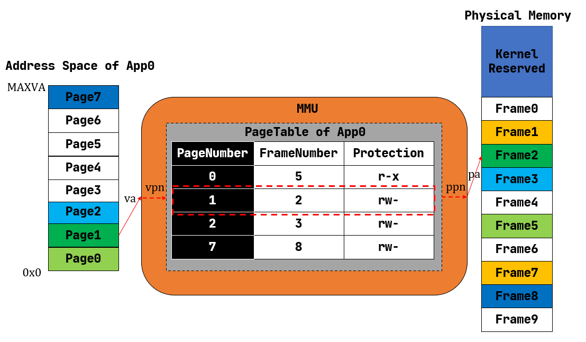

地址空間
=====================================

本節導讀
--------------------------

直到現在，我們的操作系統給應用看到的是一個非常原始的物理內存空間，可以簡單地理解為一個可以隨便訪問的大數組。為了限制應用訪問內存空間的範圍並給操作系統提供內存管理的靈活性，計算機硬件引入了各種內存保護/映射/地址轉換硬件機制，如 RISC-V 的基址-邊界翻譯和保護機制、x86 的分段機制、RISC-V/x86/ARM 都有的分頁機制。如果在地址轉換過程中，無法找到物理地址或訪問權限有誤，則處理器產生非法訪問內存的異常錯誤。

為了發揮上述硬件機制的能力，操作系統也需要升級自己的能力，更好地管理物理內存和虛擬內存，並給應用程序提供統一的虛擬內存訪問接口。計算機科學家觀察到這些不同硬件中的共同之處，即 CPU 訪問數據和指令的內存地址是虛地址，通過硬件機制（比如 MMU +頁表查詢）進行地址轉換，找到對應的物理地址。為此，計算機科學家提出了 **地址空間（Address Space）** 抽象，並在內核中建立虛實地址空間的映射機制，給應用程序提供一個基於地址空間的安全虛擬內存環境，讓應用程序簡單靈活地使用內存。

.. image:: address-general.png
   :align: center
   :scale: 45 %
   :name: Address General
   :alt: 地址空間示意圖

本節將結合操作系統的發展歷程回顧來介紹地址空間抽象的實現策略是如何變化的。

虛擬地址與地址空間
-------------------------------

地址虛擬化出現之前
^^^^^^^^^^^^^^^^^^^^^^^^^^^^^^^^^^

我們之前介紹過，在遠古計算機時代，整個硬件資源只用來執行單個裸機應用的時候，並不存在真正意義上的操作系統，而只能算是一種應用函數庫。那個時候，物理內存的一部分用來保存函數庫的代碼和數據，餘下的部分都交給應用來使用。從功能上可以將應用佔據的內存分成幾個段：代碼段、全局數據段、堆和棧等。當然，由於就只有這一個應用，它想如何調整佈局都是它自己的事情。從內存使用的角度來看，批處理系統和裸機應用很相似：批處理系統的每個應用也都是獨佔內核之外的全部內存空間，只不過當一個應用出錯或退出之後，它所佔據的內存區域會被清空，而應用序列中的下一個應用將自己的代碼和數據放置進來。這個時期，內核提供給應用的訪存視角是一致的，因為它們確實會在運行過程中始終獨佔一塊固定的內存區域，每個應用開發者都基於這一認知來規劃程序的內存佈局。

後來，為了降低等待 I/O 帶來的無意義的 CPU 資源損耗，多道程序出現了。而為了提升用戶的交互式體驗，提高生產力，分時多任務系統誕生了。它們的特點在於：應用開始多出了一種“暫停”狀態，這可能來源於它主動 yield 交出 CPU 資源，或是在執行了足夠長時間之後被內核強制性放棄處理器。當應用處於暫停狀態的時候，它駐留在內存中的代碼、數據該何去何從呢？曾經有一種省內存的做法是每個應用仍然和在批處理系統中一樣獨佔內核之外的整塊內存，當暫停的時候，內核負責將它的代碼、數據保存在外存（如硬盤）中，然後把即將換入的應用在外存上的代碼、數據恢復到內存，這些都做完之後才能開始執行新的應用。

不過，由於這種做法需要大量讀寫外部存儲設備，而它們的速度都比 CPU 慢上幾個數量級，這導致任務切換的開銷過大，甚至完全不能接受。既然如此，就只能像我們在第三章中的做法一樣，限制每個應用的最大可用內存空間小於物理內存的容量，這樣就可以同時把多個應用的數據駐留在內存中。在任務切換的時候只需完成任務上下文保存與恢復即可，這只是在內存的幫助下保存、恢復少量通用寄存器，甚至無需訪問外存，這從很大程度上降低了任務切換的開銷。

在本章的引言中介紹過第三章中操作系統的做法對應用程序開發帶了一定的困難。從應用開發的角度看，需要應用程序決定自己會被加載到哪個物理地址運行，需要直接訪問真實的物理內存。這就要求應用開發者對於硬件的特性和使用方法有更多瞭解，產生額外的學習成本，也會為應用的開發和調試帶來不便。從內核的角度來看，將直接訪問物理內存的權力下放到應用會使得它難以對應用程序的訪存行為進行有效管理，已有的特權級機制亦無法阻止很多來自應用程序的惡意行為。

加一層抽象加強內存管理
^^^^^^^^^^^^^^^^^^^^^^^^^^^^^^^^^^

為了解決這種困境，抽象仍然是最重要的指導思想。在這裡，抽象意味著內核要負責將物理內存管理起來，併為上面的應用提供一層抽象接口，從之前的失敗經驗學習，這層抽象需要達成下面的設計目標：

- *透明* ：應用開發者可以不必瞭解底層真實物理內存的硬件細節，且在非必要時也不必關心內核的實現策略，
  最小化他們的心智負擔；
- *高效* ：這層抽象至少在大多數情況下不應帶來過大的額外開銷；
- *安全* ：這層抽象應該有效檢測並阻止應用讀寫其他應用或內核的代碼、數據等一系列惡意行為。

.. _term-address-space:
.. _term-virtual-address:

最終，到目前為止仍被操作系統內核廣泛使用的抽象被稱為 **地址空間** (Address Space) 。某種程度上講，可以將它看成一塊巨大但並不一定真實存在的內存。在每個應用程序的視角里，操作系統分配給應用程序一個地址範圍受限（容量很大），獨佔的連續地址空間（其中有些地方被操作系統限制不能訪問，如內核本身佔用的虛地址空間等），因此應用程序可以在劃分給它的地址空間中隨意規劃內存佈局，它的各個段也就可以分別放置在地址空間中它希望的位置（當然是操作系統允許應用訪問的地址）。應用同樣可以使用一個地址作為索引來讀寫自己地址空間的數據，就像用物理地址作為索引來讀寫物理內存上的數據一樣。這種地址被稱為 **虛擬地址** (Virtual Address) 。當然，操作系統要達到地址空間抽象的設計目標，需要有計算機硬件的支持，這就是計算機組成原理課上講到的 ``MMU`` 和 ``TLB`` 等硬件機制。 

從此，應用能夠直接看到並訪問的內存就只有操作系統提供的地址空間，且它的任何一次訪存使用的地址都是虛擬地址，無論取指令來執行還是讀寫棧、堆或是全局數據段都是如此。事實上，特權級機制被拓展，使得應用不再具有直接訪問物理內存的能力。應用所處的執行環境在安全方面被進一步強化，形成了用戶態特權級和地址空間的二維安全措施。

由於每個應用獨佔一個地址空間，裡面只含有自己的各個段，於是它可以隨意規劃屬於它自己的各個段的分佈而無需考慮和其他應用衝突；同時鑑於應用只能通過虛擬地址讀寫它自己的地址空間，它完全無法竊取或者破壞其他應用的數據，畢竟那些段在其他應用的地址空間內，這是它沒有能力去訪問的。這是地址空間抽象和具體硬件機制對應用程序執行的安全性和穩定性的一種保障。

.. image:: address-translation.png

.. _term-mmu:
.. _term-address-translation:

我們知道應用的數據終歸還是存在物理內存中的，那麼虛擬地址如何形成地址空間，虛擬地址空間如何轉換為物理內存呢？操作系統可以設計巧妙的數據結構來表示地址空間。但如果完全由操作系統來完成轉換每次處理器地址訪問所需的虛實地址轉換，那開銷就太大了。這就需要擴展硬件功能來加速地址轉換過程（回憶 *計算機組成原理* 課上講的 ``MMU`` 和 ``TLB`` ）。

增加硬件加速虛實地址轉換
^^^^^^^^^^^^^^^^^^^^^^^^^^^^^^^^^^

我們回顧一下 **計算機組成原理** 課，如上圖所示，當 CPU 取指令或者執行一條訪存指令的時候，它都是基於虛擬地址訪問屬於當前正在運行的應用的地址空間。此時，CPU 中的 **內存管理單元** (MMU, Memory Management Unit) 自動將這個虛擬地址進行 **地址轉換** (Address Translation) 變為一個物理地址，即這個應用的數據/指令的物理內存位置。也就是說，在 MMU 的幫助下，應用對自己虛擬地址空間的讀寫才能被實際轉化為對於物理內存的訪問。

事實上，每個應用的地址空間都存在一個從虛擬地址到物理地址的映射關係。可以想象對於不同的應用來說，該映射可能是不同的，即 MMU 可能會將來自不同兩個應用地址空間的相同虛擬地址轉換成不同的物理地址。要做到這一點，就需要硬件提供一些寄存器，軟件可以對它進行設置來控制 MMU 按照哪個應用的地址映射關係進行地址轉換。於是，將應用的代碼/數據放到物理內存並進行管理，建立好應用的地址映射關係，在任務切換時控制 MMU 選用應用的地址映射關係，則是作為軟件部分的內核需要完成的重要工作。

回過頭來，在介紹內核對於 CPU 資源的抽象——時分複用的時候，我們曾經提到它為應用製造了一種每個應用獨佔整個 CPU 的幻象，而隱藏了多個應用分時共享 CPU 的實質。而地址空間也是如此，應用只需、也只能看到它獨佔整個地址空間的幻象，而藏在背後的實質仍然是多個應用共享物理內存，它們的數據分別存放在內存的不同位置。

地址空間只是一層抽象接口，它有很多種具體的實現策略。對於不同的實現策略來說，操作系統內核如何規劃應用數據放在物理內存的位置，而 MMU 又如何進行地址轉換也都是不同的。下面我們簡要介紹幾種曾經被使用的策略，並探討它們的優劣。

分段內存管理
-------------------------------------

.. image:: simple-base-bound.png

.. _term-slot:

曾經的一種做法如上圖所示：每個應用的地址空間大小限制為一個固定的常數 ``bound`` ，也即每個應用的可用虛擬地址區間均為 :math:`[0,\text{bound})` 。隨後，就可以以這個大小為單位，將物理內存除了內核預留空間之外的部分劃分為若干個大小相同的 **插槽** (Slot) ，每個應用的所有數據都被內核放置在其中一個插槽中，對應於物理內存上的一段連續物理地址區間，假設其起始物理地址為 :math:`\text{base}` ，則由於二者大小相同，這個區間實際為 :math:`[\text{base},\text{base}+\text{bound})` 。因此地址轉換很容易完成，只需檢查一下虛擬地址不超過地址空間的大小限制（此時需要藉助特權級機制通過異常來進行處理），然後做一個線性映射，將虛擬地址加上 :math:`\text{base}` 就得到了數據實際所在的物理地址。

.. _term-bitmap:

可以看出，這種實現極其簡單：MMU 只需要 :math:`\text{base,bound}` 兩個寄存器，在地址轉換進行比較或加法運算即可；而內核只需要在任務切換時完成切換 :math:`\text{base}` 寄存器。在對一個應用的內存管理方面，只需考慮一組插槽的佔用狀態，可以用一個 **位圖** (Bitmap) 來表示，隨著應用的新增和退出對應置位或清空。

.. _term-internal-fragment:

然而，它的問題在於：可能浪費的內存資源過多。注意到應用地址空間預留了一部分，它是用來讓棧得以向低地址增長，同時允許堆往高地址增長（支持應用運行時進行動態內存分配）。每個應用的情況都不同，內核只能按照在它能力範圍之內的消耗內存最多的應用的情況來統一指定地址空間的大小，而其他內存需求較低的應用根本無法充分利用內核給他們分配的這部分空間。但這部分空間又是一個完整的插槽的一部分，也不能再交給其他應用使用。這種在已分配/使用的地址空間內部無法被充分利用的空間就是 **內碎片** (Internal Fragment) ，它限制了系統同時共存的應用數目。如果應用的需求足夠多樣化，那麼內核無論如何設置應用地址空間的大小限制也不能得到滿意的結果。這就是固定參數的弊端：雖然實現簡單，但不夠靈活。

為了解決這個問題，一種分段管理的策略開始被使用，如下圖所示：

注意到內核開始以更細的粒度，也就是應用地址空間中的一個邏輯段作為單位來安排應用的數據在物理內存中的佈局。對於每個段來說，從它在某個應用地址空間中的虛擬地址到它被實際存放在內存中的物理地址中間都要經過一個不同的線性映射，於是 MMU 需要用一對不同的 :math:`\text{base/bound}` 進行區分。這裡由於每個段的大小都是不同的，我們也不再能僅僅使用一個 :math:`\text{bound}` 進行簡化。當任務切換的時候，這些對寄存器也需要被切換。

簡單起見，我們這裡忽略一些不必要的細節。比如應用在以虛擬地址為索引訪問地址空間的時候，它如何知道該地址屬於哪個段，從而硬件可以使用正確的一對 :math:`\text{base/bound}` 寄存器進行合法性檢查和完成實際的地址轉換。這裡只關注分段管理是否解決了內碎片帶來的內存浪費問題。注意到每個段都只會在內存中佔據一塊與它實際所用到的大小相等的空間。堆的情況可能比較特殊，它的大小可能會在運行時增長，但是那需要應用通過系統調用向內核請求。也就是說這是一種按需分配，而不再是內核在開始時就給每個應用分配一大塊很可能用不完的內存。由此，不再有內碎片了。

.. _term-external-fragment:

儘管內碎片被消除了，但內存浪費問題並沒有完全解決。這是因為每個段的大小都是不同的（它們可能來自不同的應用，功能也不同），內核就需要使用更加通用、也更加複雜的連續內存分配算法來進行內存管理，而不能像之前的插槽那樣以一個比特為單位。顧名思義，連續內存分配算法就是每次需要分配一塊連續內存來存放一個段的數據。隨著一段時間的分配和回收，物理內存還剩下一些相互不連續的較小的可用連續塊，其中有一些只是兩個已分配內存塊之間的很小的間隙，它們自己可能由於空間較小，已經無法被用於分配，這就是 **外碎片** (External Fragment) 。

如果這時再想分配一個比較大的塊，就需要將這些不連續的外碎片“拼起來”，形成一個大的連續塊。然而這是一件開銷很大的事情，涉及到極大的內存讀寫開銷。具體而言，這需要移動和調整一些已分配內存塊在物理內存上的位置，才能讓那些小的外碎片能夠合在一起，形成一個大的空閒塊。如果連續內存分配算法選取得當，可以儘可能減少這種操作。操作系統課上所講到的那些算法，包括 first-fit/worst-fit/best-fit 或是 buddy system，其具體表現取決於實際的應用需求，各有優劣。

那麼，分段內存管理帶來的外碎片和連續內存分配算法比較複雜的問題可否被解決呢？

分頁內存管理
--------------------------------------

仔細分析一下可以發現，段的大小不一是外碎片產生的根本原因。之前我們把應用的整個地址空間連續放置在物理內存中，在每個應用的地址空間大小均相同的情況下，只需利用類似位圖的數據結構維護一組插槽的佔用狀態，從邏輯上分配和回收都是以一個固定的比特為單位，自然也就不會存在外碎片了。但是這樣粒度過大，不夠靈活，又在地址空間內部產生了內碎片。

若要結合二者的優點的話，就需要內核始終以一個同樣大小的單位來在物理內存上放置應用地址空間中的數據，這樣內核就可以使用簡單的插槽式內存管理，使得內存分配算法比較簡單且不會產生外碎片；同時，這個單位的大小要足夠小，從而其內部沒有被用到的內碎片的大小也足夠小，儘可能提高內存利用率。這便是我們將要介紹的分頁內存管理。

.. _term-page:
.. _term-frame:

如上圖所示，內核以頁為單位進行物理內存管理。每個應用的地址空間可以被分成若干個（虛擬） **頁面** (Page) ，而可用的物理內存也同樣可以被分成若干個（物理） **頁幀** (Frame) ，虛擬頁面和物理頁幀的大小相同。每個虛擬頁面中的數據實際上都存儲在某個物理頁幀上。相比分段內存管理，分頁內存管理的粒度更小且大小固定，應用地址空間中的每個邏輯段都由多個虛擬頁面組成。而且每個虛擬頁面在地址轉換的過程中都使用與運行的應用綁定的不同的線性映射，而不像分段內存管理那樣每個邏輯段都使用一個相同的線性映射。

.. _term-virtual-page-number:
.. _term-physical-page-number:
.. _term-page-table:

為了方便實現虛擬頁面到物理頁幀的地址轉換，我們給每個虛擬頁面和物理頁幀一個編號，分別稱為 **虛擬頁號** (VPN, Virtual Page Number) 和 **物理頁號** (PPN, Physical Page Number) 。每個應用都有一個表示地址映射關係的 **頁表** (Page Table) ，裡面記錄了該應用地址空間中的每個虛擬頁面映射到物理內存中的哪個物理頁幀，即數據實際被內核放在哪裡。我們可以用頁號來代表二者，因此如果將頁表看成一個鍵值對，其鍵的類型為虛擬頁號，值的類型則為物理頁號。當 MMU 進行地址轉換的時候，虛擬地址會分為兩部分（虛擬頁號，頁內偏移），MMU首先找到虛擬地址所在虛擬頁面的頁號，然後查當前應用的頁表，根據虛擬頁號找到物理頁號；最後按照虛擬地址的頁內偏移，給物理頁號對應的物理頁幀的起始地址加上一個偏移量，這就得到了實際訪問的物理地址。

在頁表中，還針對虛擬頁號設置了一組保護位，它限制了應用對轉換得到的物理地址對應的內存的使用方式。最典型的如 ``rwx`` ， ``r`` 表示當前應用可以讀該內存； ``w`` 表示當前應用可以寫該內存； ``x`` 則表示當前應用可以從該內存取指令用來執行。一旦違反了這種限制則會觸發異常，並被內核捕獲到。通過適當的設置，可以檢查一些應用在運行時的明顯錯誤：比如應用修改只讀的代碼段，或者從數據段取指令來執行。

當一個應用的地址空間比較大的時候，頁表中的項數會很多（事實上每個虛擬頁面都應該對應頁表中的一項，上圖中我們已經省略掉了那些未被使用的虛擬頁面），導致它的容量極速膨脹，已經不再是像之前那樣數個寄存器便可存下來的了，CPU 內也沒有足夠的硬件資源能夠將它存下來。因此它只能作為一種被內核管理的數據結構放在內存中，但是 CPU 也會直接訪問它來查頁表，這也就需要內核和硬件之間關於頁表的內存佈局達成一致。

由於分頁內存管理既簡單又靈活，它逐漸成為了主流的內存管理機制，RISC-V 架構也使用了這種機制。後面我們會基於這種機制，自己動手從物理內存抽象出應用的地址空間來。

.. note::

    本節部分內容參考自 `Operating Systems: Three Easy Pieces <http://pages.cs.wisc.edu/~remzi/OSTEP/>`_ 
    教材的 13~16 小節。

