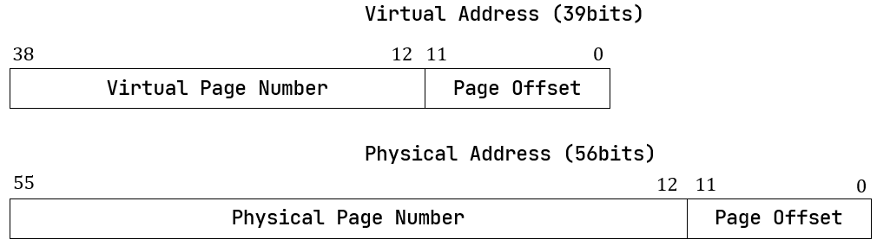
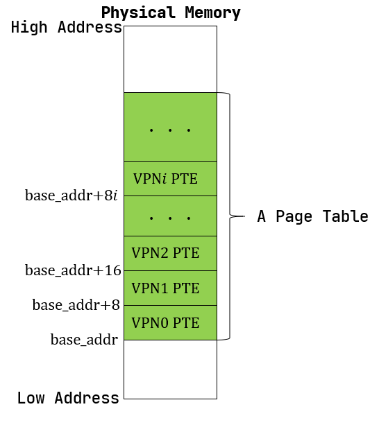
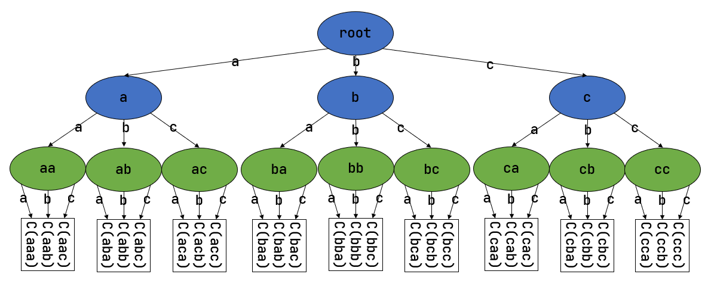
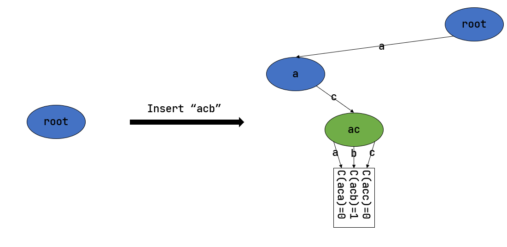

SV39 多級頁表的硬件機制
========================================================

本節導讀
--------------------------

在上一小節中我們已經簡單介紹了分頁的內存管理策略，現在我們嘗試在 RISC-V 64 架構提供的 SV39 分頁硬件機制的基礎上完成內核中的軟件對應實現。由於內容過多，我們將分成兩個小節進行講解。本節主要講解在 RISC-V 64 架構下的虛擬地址與物理地址的訪問屬性（可讀，可寫，可執行等），組成結構（頁號，幀號，偏移量等），訪問的空間範圍，硬件實現地址轉換的多級頁表訪問過程等；以及如何用Rust語言來設計有類型的頁表項。

虛擬地址和物理地址
------------------------------------------------------

內存控制相關的CSR寄存器
^^^^^^^^^^^^^^^^^^^^^^^^^^^^^^^^^^^^^^^^^^^^^^^^^^^^^^^

默認情況下 MMU 未被使能（啟用），此時無論 CPU 位於哪個特權級，訪存的地址都會作為一個物理地址交給對應的內存控制單元來直接訪問物理內存。我們可以通過修改 S 特權級的一個名為 ``satp`` 的 CSR 來啟用分頁模式，在這之後 S 和 U 特權級的訪存地址會被視為一個虛擬地址，它需要經過 MMU 的地址轉換變為一個物理地址，再通過它來訪問物理內存；而 M 特權級的訪存地址，我們可設定是內存的物理地址。

.. note::

    M 特權級的訪存地址被視為一個物理地址還是一個需要經歷和 S/U 特權級相同的地址轉換的虛擬地址取決於硬件配置，在這裡我們不會進一步探討。

.. chyyuu M模式下，應該訪問的是物理地址？？？

.. image:: satp.png
    :name: satp-layout

上圖是 RISC-V 64 架構下 ``satp`` 的字段分佈，含義如下：

- ``MODE`` 控制 CPU 使用哪種頁表實現；
- ``ASID`` 表示地址空間標識符，這裡還沒有涉及到進程的概念，我們不需要管這個地方；
- ``PPN`` 存的是根頁表所在的物理頁號。這樣，給定一個虛擬頁號，CPU 就可以從三級頁表的根頁表開始一步步的將其映射到一個物理頁號。

當 ``MODE`` 設置為 0 的時候，代表所有訪存都被視為物理地址；而設置為 8 的時候，SV39 分頁機制被啟用，所有 S/U 特權級的訪存被視為一個 39 位的虛擬地址，它們需要先經過 MMU 的地址轉換流程，如果順利的話，則會變成一個 56 位的物理地址來訪問物理內存；否則則會觸發異常，這體現了分頁機制的內存保護能力。

39 位的虛擬地址可以用來訪問理論上最大 :math:`512\text{GiB}` 的地址空間，而 56 位的物理地址在理論上甚至可以訪問一塊大小比這個地址空間的還高出幾個數量級的物理內存。但是實際上無論是虛擬地址還是物理地址，真正有意義、能夠通過 MMU 的地址轉換或是 CPU 內存控制單元的檢查的地址僅佔其中的很小一部分，因此它們的理論容量上限在目前都沒有實際意義。

地址格式與組成
^^^^^^^^^^^^^^^^^^^^^^^^^^

.. _term-page-offset:

我們採用分頁管理，單個頁面的大小設置為 :math:`4\text{KiB}` ，每個虛擬頁面和物理頁幀都對齊到這個頁面大小，也就是說虛擬/物理地址區間 :math:`[0,4\text{KiB})` 為第 :math:`0` 個虛擬頁面/物理頁幀，而 :math:`[4\text{KiB},8\text{KiB})` 為第 :math:`1` 個，以此類推。 :math:`4\text{KiB}` 需要用 12 位字節地址來表示，因此虛擬地址和物理地址都被分成兩部分：它們的低 12 位，即 :math:`[11:0]` 被稱為 **頁內偏移** (Page Offset) ，它描述一個地址指向的字節在它所在頁面中的相對位置。而虛擬地址的高 27 位，即 :math:`[38:12]` 為它的虛擬頁號 VPN，同理物理地址的高 44 位，即 :math:`[55:12]` 為它的物理頁號 PPN，頁號可以用來定位一個虛擬/物理地址屬於哪一個虛擬頁面/物理頁幀。

地址轉換是以頁為單位進行的，在地址轉換的前後地址的頁內偏移部分不變。可以認為 MMU 只是從虛擬地址中取出 27 位虛擬頁號，在頁表中查到其對應的物理頁號（如果存在的話），最後將得到的44位的物理頁號與虛擬地址的12位頁內偏移依序拼接到一起就變成了56位的物理地址。

.. _high-and-low-256gib:

.. note::

    **RISC-V 64 架構中虛擬地址為何只有 39 位？**

    在 64 位架構上虛擬地址長度確實應該和位寬一致為 64 位，但是在啟用 SV39 分頁模式下，只有低 39 位是真正有意義的。SV39 分頁模式規定 64 位虛擬地址的 :math:`[63:39]` 這 25 位必須和第 38 位相同，否則 MMU 會直接認定它是一個不合法的虛擬地址。通過這個檢查之後 MMU 再取出低 39 位嘗試將其轉化為一個 56 位的物理地址。
    
    也就是說，所有 :math:`2^{64}` 個虛擬地址中，只有最低的 :math:`256\text{GiB}` （當第 38 位為 0 時）以及最高的 :math:`256\text{GiB}` （當第 38 位為 1 時）是可能通過 MMU 檢查的。當我們寫軟件代碼的時候，一個地址的位寬毋庸置疑就是 64 位，我們要清楚可用的只有最高和最低這兩部分，儘管它們已經巨大的超乎想象了；而本節中我們專注於介紹 MMU 的機制，強調 MMU 看到的真正用來地址轉換的虛擬地址只有 39 位。

地址相關的數據結構抽象與類型定義
^^^^^^^^^^^^^^^^^^^^^^^^^^^^^^^^^^^^^^^^^^^^^^^^

正如本章第一小節所說，在分頁內存管理中，地址轉換的核心任務在於如何維護虛擬頁號到物理頁號的映射——也就是頁表。不過在具體實現它之前，我們先將地址和頁號的概念抽象為 Rust 中的類型，藉助 Rust 的類型安全特性來確保它們被正確實現。

首先是這些類型的定義：

.. code-block:: rust

    // os/src/mm/address.rs

    #[derive(Copy, Clone, Ord, PartialOrd, Eq, PartialEq)]
    pub struct PhysAddr(pub usize);

    #[derive(Copy, Clone, Ord, PartialOrd, Eq, PartialEq)]
    pub struct VirtAddr(pub usize);

    #[derive(Copy, Clone, Ord, PartialOrd, Eq, PartialEq)]
    pub struct PhysPageNum(pub usize);

    #[derive(Copy, Clone, Ord, PartialOrd, Eq, PartialEq)]
    pub struct VirtPageNum(pub usize);

.. _term-type-conversion:

上面分別給出了物理地址、虛擬地址、物理頁號、虛擬頁號的 Rust 類型聲明，它們都是 Rust 的元組式結構體，可以看成 usize 的一種簡單包裝。我們刻意將它們各自抽象出不同的類型而不是都使用與RISC-V 64硬件直接對應的 usize 基本類型，就是為了在 Rust 編譯器的幫助下，通過多種方便且安全的 **類型轉換** (Type Conversion) 來構建頁表。

首先，這些類型本身可以和 usize 之間互相轉換，以物理地址 ``PhysAddr`` 為例，我們需要：

.. code-block:: rust

    // os/src/mm/address.rs

    const PA_WIDTH_SV39: usize = 56;
    const PPN_WIDTH_SV39: usize = PA_WIDTH_SV39 - PAGE_SIZE_BITS;

    impl From<usize> for PhysAddr {
        fn from(v: usize) -> Self { Self(v & ( (1 << PA_WIDTH_SV39) - 1 )) }
    }
    impl From<usize> for PhysPageNum {
        fn from(v: usize) -> Self { Self(v & ( (1 << PPN_WIDTH_SV39) - 1 )) }
    }

    impl From<PhysAddr> for usize {
        fn from(v: PhysAddr) -> Self { v.0 }
    }
    impl From<PhysPageNum> for usize {
        fn from(v: PhysPageNum) -> Self { v.0 }
    }

前者允許我們從一個 ``usize`` 來生成 ``PhysAddr`` ，即 ``PhysAddr::from(_: usize)`` 將得到一個 ``PhysAddr`` 。注意 SV39 支持的物理地址位寬為 56 位，因此在生成 ``PhysAddr`` 的時候我們僅使用 ``usize`` 較低的 56 位。同理在生成虛擬地址 ``VirtAddr`` 的時候僅使用 ``usize`` 較低的 39 位。反過來，從 ``PhysAddr`` 等類型也很容易得到對應的 ``usize`` 。其實由於我們在聲明結構體的時候將字段公開了出來，從物理地址變量 ``pa`` 得到它的 usize 表示的更簡便方法是直接 ``pa.0`` 。

.. note::

    **Rust Tips：類型轉換之 From 和 Into**

    一般而言，當我們為類型 ``U`` 實現了 ``From<T>`` Trait 之後，可以使用 ``U::from(_: T)`` 來從一個 ``T`` 類型的實例來構造一個 ``U`` 類型的實例；而當我們為類型 ``U`` 實現了 ``Into<T>`` Trait 之後，對於一個 ``U`` 類型的實例 ``u`` ，可以使用 ``u.into()`` 來將其轉化為一個類型為 ``T`` 的實例。

    當我們為 ``U`` 實現了 ``From<T>`` 之後，Rust 會自動為 ``T`` 實現 ``Into<U>`` Trait，因為它們兩個本來就是在做相同的事情。因此我們只需相互實現 ``From`` 就可以相互 ``From/Into`` 了。

    需要注意的是，當我們使用 ``From`` Trait 的 ``from`` 方法來構造一個轉換後類型的實例的時候，``from`` 的參數已經指明瞭轉換前的類型，因而 Rust 編譯器知道該使用哪個實現；而使用 ``Into`` Trait 的 ``into`` 方法來將當前類型轉化為另一種類型的時候，它並沒有參數，因而函數簽名中並沒有指出要轉化為哪一個類型，則我們必須在其它地方 *顯式* 指出目標類型。比如，當我們要將 ``u.into()`` 綁定到一個新變量 ``t`` 的時候，必須通過 ``let t: T`` 顯式聲明 ``t`` 的類型；又或是將 ``u.into()`` 的結果作為參數傳給某一個函數，那麼由於這個函數的函數簽名中指出了傳入位置的參數的類型，所以 Rust 編譯器也就明確知道轉換的類型。

    請注意，解引用 ``Deref`` Trait 是 Rust 編譯器允許的一種隱式類型轉換，而對於大部分類型轉換，我們必須手動調用類型轉化方法或者是顯式給出轉換前後的類型。這體現了 Rust 的類型安全特性，在 C/C++ 中並不是如此，比如兩個不同的整數/浮點數類型進行二元運算的時候，編譯器經常要先進行隱式類型轉換使兩個操作數類型相同，而後再進行運算，導致了很多數值溢出或精度損失問題。Rust 不會進行這種隱式類型轉換，它會在編譯期直接報錯，提示兩個操作數類型不匹配。

其次，地址和頁號之間可以相互轉換。我們這裡仍以物理地址和物理頁號之間的轉換為例：

.. code-block:: rust
    :linenos:

    // os/src/mm/address.rs

    impl PhysAddr {
        pub fn page_offset(&self) -> usize { self.0 & (PAGE_SIZE - 1) }
    }

    impl From<PhysAddr> for PhysPageNum {
        fn from(v: PhysAddr) -> Self {
            assert_eq!(v.page_offset(), 0);
            v.floor()
        }
    }

    impl From<PhysPageNum> for PhysAddr {
        fn from(v: PhysPageNum) -> Self { Self(v.0 << PAGE_SIZE_BITS) }
    }

其中 ``PAGE_SIZE`` 為 :math:`4096` ， ``PAGE_SIZE_BITS`` 為 :math:`12` ，它們均定義在 ``config`` 子模塊中，分別表示每個頁面的大小和頁內偏移的位寬。從物理頁號到物理地址的轉換隻需左移 :math:`12` 位即可，但是物理地址需要保證它與頁面大小對齊才能通過右移轉換為物理頁號。

對於不對齊的情況，物理地址不能通過 ``From/Into`` 轉換為物理頁號，而是需要通過它自己的 ``floor`` 或 ``ceil`` 方法來進行下取整或上取整的轉換。

.. code-block:: rust

    // os/src/mm/address.rs

    impl PhysAddr {
        pub fn floor(&self) -> PhysPageNum { PhysPageNum(self.0 / PAGE_SIZE) }
        pub fn ceil(&self) -> PhysPageNum { PhysPageNum((self.0 + PAGE_SIZE - 1) / PAGE_SIZE) }
    }

我們暫時先介紹這兩種最簡單的類型轉換。

頁表項的數據結構抽象與類型定義
-----------------------------------------

第一小節中我們提到，在頁表中以虛擬頁號作為索引不僅能夠查到物理頁號，還能查到一組保護位，它控制了應用對地址空間每個虛擬頁面的訪問權限。但實際上還有更多的標誌位，物理頁號和全部的標誌位以某種固定的格式保存在一個結構體中，它被稱為 **頁表項** (PTE, Page Table Entry) ，是利用虛擬頁號在頁表中查到的結果。

.. image:: sv39-pte.png

.. chyyuu  頁表項的RSW的解釋，pec中提到RSW是留給S特權級軟件（也就是內核）自行決定如何使用的，比如可以用它實現一些頁面置換算法。； U的進一步解釋：在Risc-v的特權級文檔中U位還有其他的補充描述，當sstatus寄存器中的SUM位置1，S 特權級可以訪問U位為1的頁，但是S特權級的程序常運行在SUM位清空的條件下，如果S特權級直接訪問會出現page fault

上圖為 SV39 分頁模式下的頁表項，其中 :math:`[53:10]` 這 :math:`44` 位是物理頁號，最低的 :math:`8` 位 :math:`[7:0]` 則是標誌位，它們的含義如下（請注意，為方便說明，下文我們用 *頁表項的對應虛擬頁面* 來表示索引到一個頁表項的虛擬頁號對應的虛擬頁面）：

- V(Valid)：僅當位 V 為 1 時，頁表項才是合法的；
- R(Read)/W(Write)/X(eXecute)：分別控制索引到這個頁表項的對應虛擬頁面是否允許讀/寫/執行；
- U(User)：控制索引到這個頁表項的對應虛擬頁面是否在 CPU 處於 U 特權級的情況下是否被允許訪問；
- G：暫且不理會；
- A(Accessed)：處理器記錄自從頁表項上的這一位被清零之後，頁表項的對應虛擬頁面是否被訪問過；
- D(Dirty)：處理器記錄自從頁表項上的這一位被清零之後，頁表項的對應虛擬頁面是否被修改過。

除了 ``G`` 外的上述位可以被操作系統設置，只有 ``A`` 位和 ``D`` 位會被處理器動態地直接設置為 ``1`` ，表示對應的頁被訪問過或修過（ 注：``A`` 位和 ``D`` 位能否被處理器硬件直接修改，取決於處理器的具體實現）。讓我們先來實現頁表項中的標誌位 ``PTEFlags`` ：

.. code-block:: rust

    // os/src/main.rs

    #[macro_use]
    extern crate bitflags;

    // os/src/mm/page_table.rs

    use bitflags::*;

    bitflags! {
        pub struct PTEFlags: u8 {
            const V = 1 << 0;
            const R = 1 << 1;
            const W = 1 << 2;
            const X = 1 << 3;
            const U = 1 << 4;
            const G = 1 << 5;
            const A = 1 << 6;
            const D = 1 << 7;
        }
    }

`bitflags <https://docs.rs/bitflags/1.2.1/bitflags/>`_ 是一個 Rust 中常用來比特標誌位的 crate 。它提供了一個 ``bitflags!`` 宏，如上面的代碼段所展示的那樣，可以將一個 ``u8`` 封裝成一個標誌位的集合類型，支持一些常見的集合運算。它的一些使用細節這裡不展開，請同學自行參考它的官方文檔。注意，在使用之前我們需要引入該 crate 的依賴：

.. code-block:: toml

    # os/Cargo.toml

    [dependencies]
    bitflags = "1.2.1"

接下來我們實現頁表項 ``PageTableEntry`` ：

.. code-block:: rust
    :linenos:

    // os/src/mm/page_table.rs

    #[derive(Copy, Clone)]
    #[repr(C)]
    pub struct PageTableEntry {
        pub bits: usize,
    }

    impl PageTableEntry {
        pub fn new(ppn: PhysPageNum, flags: PTEFlags) -> Self {
            PageTableEntry {
                bits: ppn.0 << 10 | flags.bits as usize,
            }
        }
        pub fn empty() -> Self {
            PageTableEntry {
                bits: 0,
            }
        }
        pub fn ppn(&self) -> PhysPageNum {
            (self.bits >> 10 & ((1usize << 44) - 1)).into()
        }
        pub fn flags(&self) -> PTEFlags {
            PTEFlags::from_bits(self.bits as u8).unwrap()
        }
    }

- 第 3 行我們讓編譯器自動為 ``PageTableEntry`` 實現 ``Copy/Clone`` Trait，來讓這個類型以值語義賦值/傳參的時候不會發生所有權轉移，而是拷貝一份新的副本。從這一點來說 ``PageTableEntry`` 就和 usize 一樣，因為它也只是後者的一層簡單包裝，並解釋了 usize 各個比特段的含義。
- 第 10 行使得我們可以從一個物理頁號 ``PhysPageNum`` 和一個頁表項標誌位 ``PTEFlags`` 生成一個頁表項 ``PageTableEntry`` 實例；而第 20 行和第 23 行則實現了分別可以從一個頁表項將它們兩個取出的方法。
- 第 15 行中，我們也可以通過 ``empty`` 方法生成一個全零的頁表項，注意這隱含著該頁表項的 ``V`` 標誌位為 0 ，因此它是不合法的。

後面我們還為 ``PageTableEntry`` 實現了一些輔助函數(Helper Function)，可以快速判斷一個頁表項的 ``V/R/W/X`` 標誌位是否為 1 以 ``V`` 標誌位的判斷為例：

.. code-block:: rust

    // os/src/mm/page_table.rs

    impl PageTableEntry {
        pub fn is_valid(&self) -> bool {
            (self.flags() & PTEFlags::V) != PTEFlags::empty()
        }
    }

這裡相當於判斷兩個集合的交集是否為空集，部分說明了 ``bitflags`` crate 的使用方法。

多級頁表
-------------------------------

頁表的一種最簡單的實現是線性表，也就是按照地址從低到高、輸入的虛擬頁號從 :math:`0` 開始遞增的順序依次在內存中（我們之前提到過頁表的容量過大無法保存在 CPU 中）放置每個虛擬頁號對應的頁表項。由於每個頁表項的大小是 :math:`8` 字節，我們只要知道第一個頁表項（對應虛擬頁號 :math:`0` ）被放在的物理地址 :math:`\text{base_addr}` ，就能直接計算出每個輸入的虛擬頁號對應的頁表項所在的位置。如下圖所示：

事實上，對於虛擬頁號 :math:`i` ，如果頁表（每個應用都有一個頁表，這裡指其中某一個）的起始地址為 :math:`\text{base_addr}` ，則這個虛擬頁號對應的頁表項可以在物理地址 :math:`\text{base_addr}+8i` 處找到。這使得 MMU 的實現和內核的軟件控制都變得非常簡單。然而遺憾的是，這遠遠超出了我們的物理內存限制。由於虛擬頁號有 :math:`2^{27}` 種，每個虛擬頁號對應一個 :math:`8` 字節的頁表項，則每個頁表都需要消耗掉 :math:`1\text{GiB}` 內存！應用的數據還需要保存在內存的其他位置，這就使得每個應用要吃掉 :math:`1\text{GiB}` 以上的內存。作為對比，我們的 K210 開發板目前只有 :math:`8\text{MiB}` 的內存，因此從空間佔用角度來說，這種線性表實現是完全不可行的。

線性表的問題在於：它保存了所有虛擬頁號對應的頁表項，但是高達 :math:`512\text{GiB}` 的地址空間中真正會被應用使用到的只是其中極小的一個子集（本教程中的應用內存使用量約在數十~數百 :math:`\text{KiB}` 量級），也就導致有意義並能在頁表中查到實際的物理頁號的虛擬頁號在 :math:`2^{27}` 中也只是很小的一部分。由此線性表的絕大部分空間其實都是被浪費掉的。

那麼如何進行優化呢？核心思想就在於 **按需分配** ，也就是說：有多少合法的虛擬頁號，我們就維護一個多大的映射，併為此使用多大的內存用來保存映射。這是因為，每個應用的地址空間最開始都是空的，或者說所有的虛擬頁號均不合法，那麼這樣的頁表自然不需要佔用任何內存， MMU 在地址轉換的時候無需關心頁表的內容而是將所有的虛擬頁號均判為不合法即可。而在後面，內核已經決定好了一個應用的各邏輯段存放位置之後，它就需要負責從零開始以虛擬頁面為單位來讓該應用的地址空間的某些部分變得合法，反映在該應用的頁表上也就是一對對映射順次被插入進來，自然頁表所佔據的內存大小也就逐漸增加。

這種 **按需分配** 思想在計算機科學中得到了廣泛應用：為了方便接下來的說明，我們可以舉一道數據結構的題目作為例子。設想我們要維護一個字符串的多重集，集合中所有的字符串的字符集均為 :math:`\alpha=\{a,b,c\}` ，長度均為一個給定的常數 :math:`n` 。該字符串集合一開始為空集。我們要支持兩種操作，第一種是將一個字符串插入集合，第二種是查詢一個字符串在當前的集合中出現了多少次。

.. _term-trie:

簡單起見，假設 :math:`n=3` 。那麼我們可能會建立這樣一顆 **字典樹** (Trie) ：

字典樹由若干個節點（圖中用橢圓形來表示）組成，從邏輯上而言每個節點代表一個可能的字符串前綴。每個節點的存儲內容都只有三個指針，對於藍色的非葉節點來說，它的三個指針各自指向一個子節點；而對於綠色的葉子節點來說，它的三個指針不再指向任何節點，而是具體保存一種可能的長度為 :math:`n` 的字符串的計數。這樣，對於題目要求的兩種操作，我們只需根據輸入的字符串中的每個字符在字典樹上自上而下對應走出一步，最終就能夠找到字典樹中維護的它的計數。之後我們可以將其直接返回或者加一。

注意到如果某些字符串自始至終沒有被插入，那麼一些節點沒有存在的必要。反過來說一些節點是由於我們插入了一個以它對應的字符串為前綴的字符串才被分配出來的。如下圖所示：

一開始僅存在一個根節點。在我們插入字符串 ``acb`` 的過程中，我們只需要分配 ``a`` 和 ``ac`` 兩個節點。注意 ``ac`` 是一個葉節點，它的 ``b`` 指針不再指向另外一個節點而是保存字符串 ``acb`` 的計數。此時我們無法訪問到其他未分配的節點，如根節點的 ``b/c`` 或是 ``a`` 節點的 ``a/b`` 均為空指針。如果後續再插入一個字符串，那麼 **至多分配兩個新節點** ，因為如果走的路徑上有節點已經存在，就無需重複分配了。這可以說明，字典樹中節點的數目（或者說字典樹消耗的內存）是隨著插入字符串的數目逐漸線性增加的。

同學可能很好奇，為何在這裡要用相當一部分篇幅來介紹字典樹呢？事實上 SV39 分頁機制等價於一顆字典樹。 :math:`27` 位的虛擬頁號可以看成一個長度 :math:`n=3` 的字符串，字符集為 :math:`\alpha=\{0,1,2,...,511\}` ，因為每一位字符都由 :math:`9` 個比特組成。而我們也不再維護所謂字符串的計數，而是要找到字符串（虛擬頁號）對應的頁表項。因此，每個葉節點都需要保存 :math:`512` 個 :math:`8` 字節的頁表項，一共正好 :math:`4\text{KiB}` ，可以直接放在一個物理頁幀內。而對於非葉節點來說，從功能上它只需要保存 :math:`512` 個指向下級節點的指針即可，不過我們就像葉節點那樣也保存 :math:`512` 個頁表項，這樣每個節點都可以被放在一個物理頁幀內，節點的位置可以用它所在物理頁幀的物理頁號來代替。當想從一個非葉節點向下走時，只需找到當前字符對應的頁表項的物理頁號字段，它就指向了下一級節點的位置，這樣非葉節點中轉的功能也就實現了。每個節點的內部是一個線性表，也就是將這個節點起始物理地址加上字符對應的偏移量就找到了指向下一級節點的頁表項（對於非葉節點）或是能夠直接用來地址轉換的頁表項（對於葉節點）。

.. _term-multi-level-page-table:
.. _term-page-index:

這種頁表實現被稱為 **多級頁表** (Multi-Level Page-Table) 。由於 SV39 中虛擬頁號被分為三級 **頁索引** (Page Index) ，因此這是一種三級頁表。在這種三級頁表的樹結構中，自上而下分為三種不同的節點：一級/二級/三級頁表節點。樹的根節點被稱為一級頁表節點；一級頁表節點可以通過一級頁索引找到二級頁表節點；二級頁表節點可以通過二級頁索引找到三級頁表節點；三級頁表節點是樹的葉節點，通過三級頁索引可以找到一個頁表項。

.. note::

    注意本書將多級頁表的根節點稱為一級頁表，在其他地方則可能以相反的順序將根節點稱為三級頁表，這只是表述的習慣不同。

非葉節點（頁目錄表，非末級頁表）的表項標誌位含義和葉節點（頁表，末級頁表）相比有一些不同：

- 當 ``V`` 為 0 的時候，代表當前指針是一個空指針，無法走向下一級節點，即該頁表項對應的虛擬地址範圍是無效的；
- 只有當 ``V`` 為1 且 ``R/W/X`` 均為 0 時，表示是一個合法的頁目錄表項，其包含的指針會指向下一級的頁表；
- 注意: 當 ``V`` 為1 且 ``R/W/X`` 不全為 0 時，表示是一個合法的頁表項，其包含了虛地址對應的物理頁號。

在這裡我們給出 SV39 中的 ``R/W/X`` 組合的含義：

  .. image:: pte-rwx.png
        :align: center
        :height: 250

.. _term-huge-page:

.. note::

    **大頁** (Huge Page)

    所謂大頁就是某些頁的大小（如 :math:`2\text{MiB}` , :math:`1\text{GiB}`  ）大於常規缺省的頁大小（如 :math:`4\text{KiB}` ）。本教程中並沒有用到大頁的知識，這裡只是作為拓展，不感興趣的同學可以跳過。

    RISC-V 64處理器在地址轉換過程中，只要表項中的 ``V`` 為 1 且 ``R/W/X`` 不全為 0 就會直接從當前的頁表項中取出物理頁號，再接上頁內偏移，就完成最終的地址轉換。注意這個過程可以發生在多級頁表的任意一級。如果這一過程並沒有發生在多級頁表的最深層，那麼在地址轉換的時候，物理頁號對應的物理頁幀的起始物理地址的位數與頁內偏移的位數都和按缺省頁處理時的情況不同了。我們需要按 **大頁** 的地址轉換方式來處理。

    這裡需要進一步理解將物理頁號和頁內偏移“接起來”這一行為，它的本質是將物理頁號對應的物理頁幀的起始物理地址和頁內偏移進行求和，物理頁幀的起始物理地址是將物理頁號左移上頁內偏移的位數得到，因此看上去恰好就是將物理頁號和頁內偏移接在一起。如果在從多級頁表往下走的中途停止，未用到的頁索引會和虛擬地址的 :math:`12` 位缺省頁內偏移一起形成一個位數更多的 **大頁** 頁內偏移。即對應於一個大頁，在轉換物理地址的時候，其算法仍是上述二者求和，只是物理頁幀的起始物理地址和頁內偏移的位數不同了。

    在 SV39 中，如果使用了一級頁索引就停下來，則它可以涵蓋虛擬頁號的高 :math:`9` 位為某一固定值的所有虛擬地址，對應於一個 :math:`1\text{GiB}` 的大頁；如果使用了二級頁索引就停下來，則它可以涵蓋虛擬頁號的高 :math:`18` 位為某一固定值的所有虛擬地址，對應於一個 :math:`2\text{MiB}` 的大頁。以同樣的視角，如果使用了所有三級頁索引才停下來，它可以涵蓋虛擬頁號的高 :math:`27` 位為某一個固定值的所有虛擬地址，自然也就對應於一個大小為 :math:`4\text{KiB}` 的虛擬頁面。

    使用大頁的優點在於，當地址空間的大塊連續區域的訪問權限均相同的時候，可以直接映射一個大頁，從時間上避免了大量頁表項的讀寫開銷，從空間上降低了所需頁表節點的數目。更為重要的是，使用大頁可以顯著減輕 TLB 的壓力，提升 TLB 命中率，因為現在 TLB 中一個表項可以覆蓋更大的內存空間了。這可以從整體上提高訪存指令的執行速度，進而提升整體的 IPC 。但是，從內存分配算法的角度，這需要內核支持從物理內存上分配三種不同大小的連續區域（ :math:`4\text{KiB}` 或是另外兩種大頁），便不能使用更為簡單的插槽式管理。權衡利弊之後，本書全程只會以 :math:`4\text{KiB}` 為單位進行頁表映射而不會使用大頁特性。

那麼 SV39 多級頁表相比線性表到底能節省多少內存呢？這裡直接給出結論：設某個應用地址空間實際用到的區域總大小為 :math:`S` 字節，則地址空間對應的多級頁表消耗內存為 :math:`\frac{S}{512}` 左右。下面給出了詳細分析，對此不感興趣的同學可以直接跳過。

.. note::

    **分析 SV39 多級頁表的內存佔用**

    我們知道，多級頁表的總內存消耗取決於節點的數目，每個節點需要存放在一個大小為 :math:`4\text{KiB}` 物理頁幀中。考慮一個地址空間，除了根節點（即一級頁表）佔用的一個物理頁幀之外，在映射地址空間中的一個實際用到的大小為 :math:`T` 字節的 *連續* 區間的時候，最多需要額外分配 :math:`\lceil\frac{T}{1\text{GiB}}\rceil` 個二級頁表節點和 :math:`\lceil\frac{T}{2\text{MiB}}\rceil` 個三級頁表節點。這是因為，每個三級頁表節點管理地址空間中一塊大小為 :math:`4\text{KiB}\times 512=2\text{MiB}` 的區域，每個二級頁表節點管理地址空間中一塊大小為 :math:`4\text{KiB}\times 512^2=1\text{GiB}` 的區域。因此，每連續映射 :math:`1\text{GiB}` 需要在多級頁表中分配一個二級頁表節點；每連續映射 :math:`2\text{MiB}` 需要在多級頁表中分配一個三級頁表節點。無論二級/三級頁表都需要佔用一個 :math:`4\text{KiB}` 的物理頁幀，因此映射 :math:`T` 字節的連續區間需要的額外內存為 :math:`4\text{KiB}\times(\lceil\frac{T}{2\text{MiB}}\rceil+\lceil\frac{T}{1\text{GiB}}\rceil)` 。相比三級頁表，我們可以將二級頁表的內存消耗忽略，即省略掉括號中的第二項，最後得到的結果接近於 :math:`\frac{T}{512}` 。而一般情況下我們對於地址空間的使用方法都是在其中放置少數幾個連續的邏輯段，因此當一個地址空間實際使用的區域大小總和為 :math:`S` 字節的時候，我們可以認為多級頁表消耗的內存在 :math:`\frac{S}{512}` 左右。相比線性表固定消耗 :math:`1\text{GiB}` 的內存，這已經相當可以接受了。

    然而，從理論上來說，不妨設某個應用地址空間中的實際用到的總空間大小為 :math:`S` 字節，則對於這個應用的 SV39 多級頁表所需的內存量，有兩個更加嚴格的上限：

    - 假設目前多級頁表中已經分配了一個一級頁表節點。接下來，每映射一個 :math:`4\text{KiB}` 的虛擬頁面，至多沿著路徑額外分配一個二級頁表和一個三級頁表。之所以是“最多”，是因為路徑上經過的二級頁表和三級頁表可能已經被分配了從而無需重複分配。因此，當總共映射 :math:`S` 字節時，多級頁表的總節點數不超過 :math:`1+2\frac{S}{4\text{KiB}}` ，故總消耗內存不超過 :math:`4\text{KiB}\times(1+2\frac{S}{4\text{KiB}})=4\text{KiB}+2S` ；
    - 考慮已經映射了很多虛擬頁面，使得根節點（一級頁表節點）指向的 :math:`512` 個二級頁表節點都已經被分配的情況（事實上它們不一定都被分配），此時最壞的情況是每次映射都需要分配一個不同的三級頁表節點。與上面同理可得：此時消耗內存不超過 :math:`4\text{KiB}\times(1+512+\frac{S}{4\text{KiB}})=4\text{KiB}+2\text{MiB}+S` 。

    雖然這兩個上限值都可以通過刻意構造一種地址空間的使用來達到，但是它們看起來很不合理，因為它們均大於 :math:`S` ，也就是元數據比數據還大。其實，真實環境中一般不會有如此極端的使用方式，一般情況下我們知道多級頁表消耗內存為 :math:`\frac{S}{512}` 左右就行了。

SV39 地址轉換過程
-------------------------------

接下來，我們給出 SV39 地址轉換的全過程圖示（來源於 MIT 6.828 課程）來結束多級頁表原理的介紹：

.. image:: sv39-full.png
    :height: 600
    :align: center

在 SV39 模式中我們採用三級頁表，即將 27 位的虛擬頁號分為三個等長的部分，第 26-18 位為一級頁索引 :math:`\text{VPN}_0` ，第 17-9 位為二級頁索引  :math:`\text{VPN}_1` ，第 8-0 位為三級頁索引   :math:`\text{VPN}_2` 。

我們也將頁表分為一級頁表（多級頁表的根節點），二級頁表，三級頁表（多級頁表的葉節點）。每個頁表都用 9 位索引，因此有  :math:`2^{9}=512` 個頁表項，而每個頁表項都是 8 字節，因此每個頁表大小都為  :math:`512\times 8=4\text{KiB}` 。正好是一個物理頁的大小。我們可以把一個頁表放到一個物理頁中，並用一個物理頁號來描述它。事實上，一級頁表的每個頁表項中的物理頁號可描述一個二級頁表；二級頁表的每個頁表項中的物理頁號可描述一個三級頁表；三級頁表中的頁表項內容則和我們剛才提到的頁表項一樣，其內容包含物理頁號，即描述一個要映射到的物理頁。

具體來說，假設我們有虛擬地址  :math:`(\text{VPN}_0, \text{VPN}_1, \text{VPN}_2, \text{offset})` ：

- 我們首先會記錄裝載「當前所用的一級頁表的物理頁」的頁號到 `satp` 寄存器中；
- 把  :math:`\text{VPN}_0` 作為偏移在一級頁表的物理頁中找到二級頁表的物理頁號；
- 把  :math:`\text{VPN}_1` 作為偏移在二級頁表的物理頁中找到三級頁表的物理頁號；
- 把  :math:`\text{VPN}_2` 作為偏移在三級頁表的物理頁中找到要訪問位置的物理頁號；
- 物理頁號對應的物理頁基址（即物理頁號左移12位）加上  :math:`\text{offset}` 就是虛擬地址對應的物理地址。

這樣處理器通過這種多次轉換，終於從虛擬頁號找到了一級頁表項，從而得出了物理頁號和虛擬地址所對應的物理地址。剛才我們提到若頁表項滿足 `R,W,X` 都為 0，表明這個頁表項指向下一級頁表。在這裡一級和二級頁表項的 `R,W,X` 為 0 應該成立，因為它們指向了下一級頁表。

快表（TLB）
^^^^^^^^^^^^^^^^^^^^^^^^^^^^^^^^^^^^^^^^^^^^^^^^^^^^^^^

我們知道，物理內存的訪問速度要比 CPU 的運行速度慢很多。如果我們按照頁表機制循規蹈矩的一步步走，將一個虛擬地址轉化為物理地址需要訪問 3 次物理內存，得到物理地址後還需要再訪問一次物理內存，才能完成訪存。這無疑很大程度上降低了系統執行效率。

實踐表明絕大部分應用程序的虛擬地址訪問過程具有時間局部性和空間局部性的特點。因此，在 CPU 內部，我們使用MMU中的 **快表（TLB, Translation Lookaside Buffer）** 來作為虛擬頁號到物理頁號的映射的頁表緩存。這部分知識在計算機組成原理課程中有所體現，當我們要進行一個地址轉換時，會有很大可能對應的地址映射在近期已被完成過，所以我們可以先到 TLB 緩存裡面去查一下，如果有的話我們就可以直接完成映射，而不用訪問那麼多次內存了。

上面主要是對單個應用的多級頁表進行了介紹。在一個多任務系統中，可能同時存在多個任務處於運行/就緒狀態，它們各自的多級頁表在內存中共存，那麼 MMU 應該如何知道當前做地址轉換的時候要查哪一個頁表呢？回到 :ref:`satp CSR 的佈局 <satp-layout>` ，其中的 PPN 字段指的就是多級頁表根節點所在的物理頁號。因此，每個應用的地址空間就可以用包含了它多級頁表根節點所在物理頁號的 ``satp`` CSR 代表。在我們切換任務的時候， ``satp`` 也必須被同時切換。

但如果修改了 `satp` 寄存器，說明內核切換到了一個與先前映射方式完全不同的頁表。此時快表裡面存儲的映射已經失效了，這種情況下內核要在修改 `satp` 的指令後面馬上使用 `sfence.vma` 指令刷新清空整個 TLB。

同樣，我們手動修改一個頁表項之後，也修改了映射，但 TLB 並不會自動刷新清空，我們也需要使用 `sfence.vma` 指令刷新整個 TLB。注：可以在 `sfence.vma` 指令後面加上一個虛擬地址，這樣 `sfence.vma` 只會刷新TLB中關於這個虛擬地址的單個映射項。
