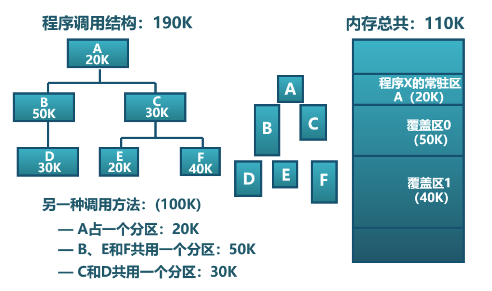
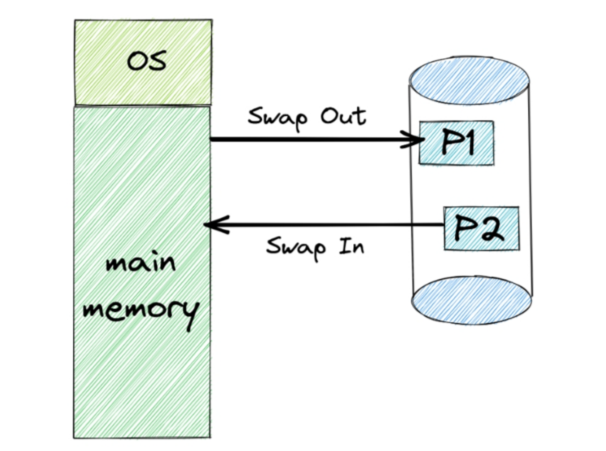
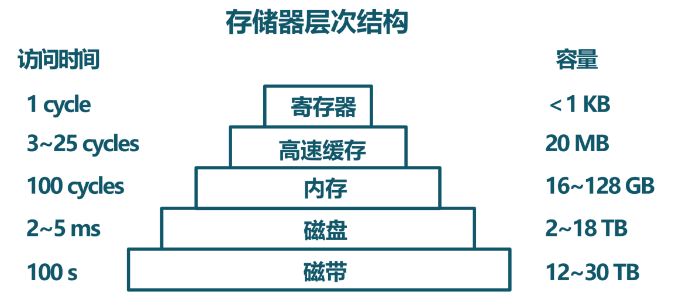
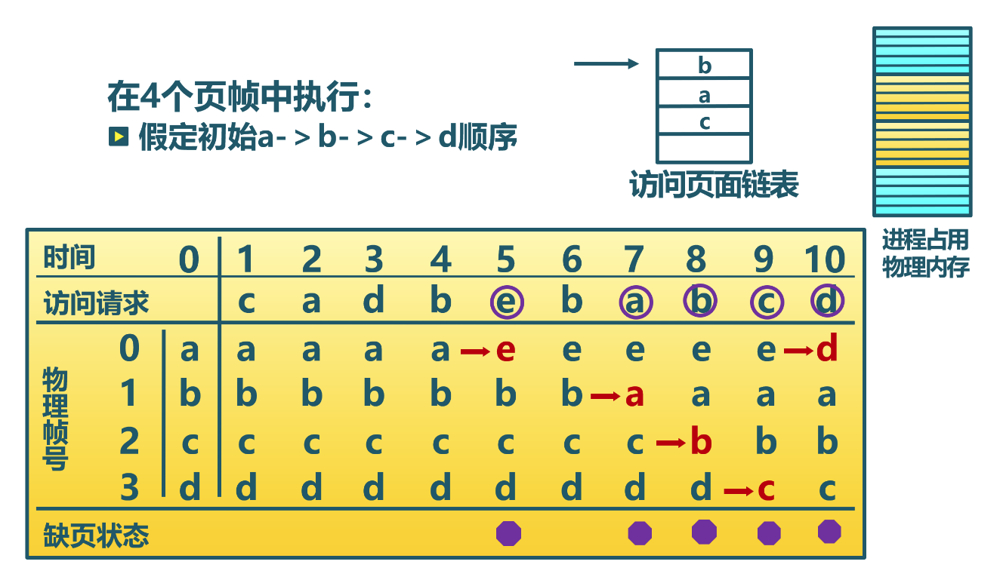
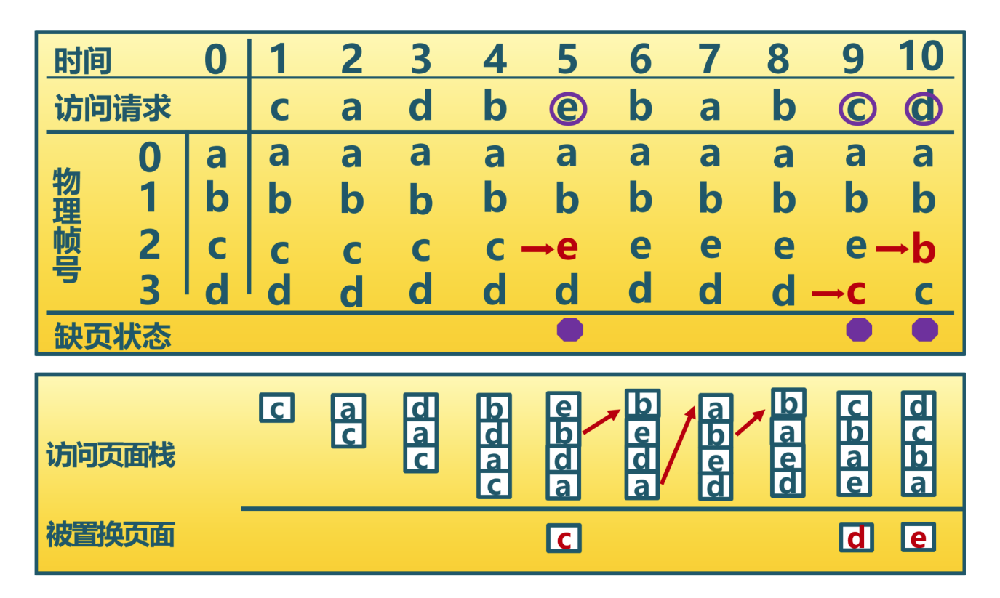
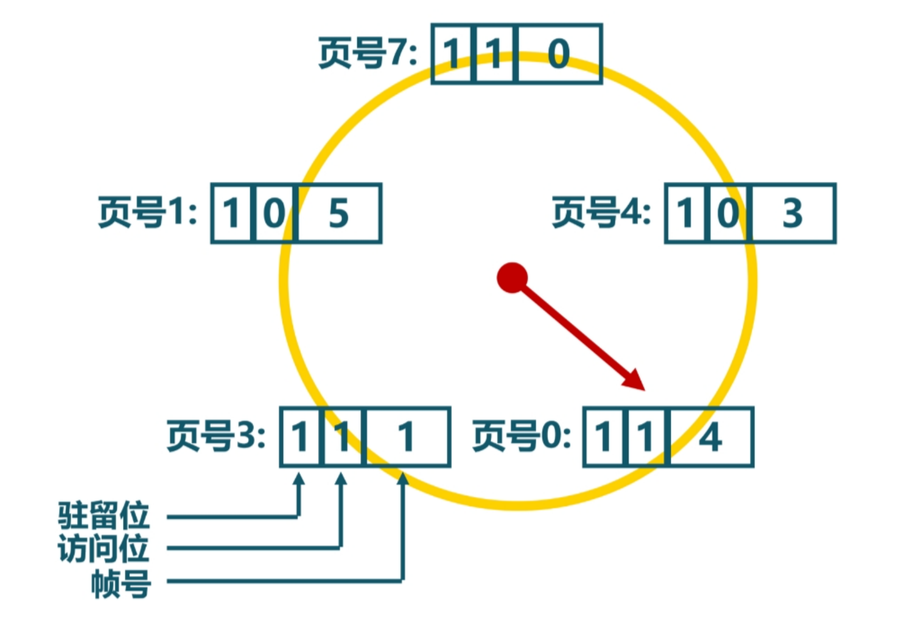
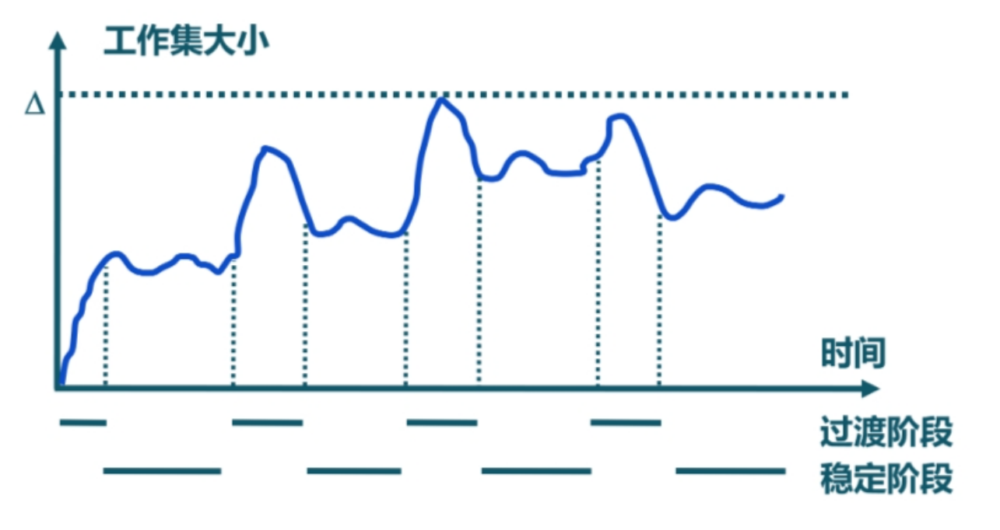
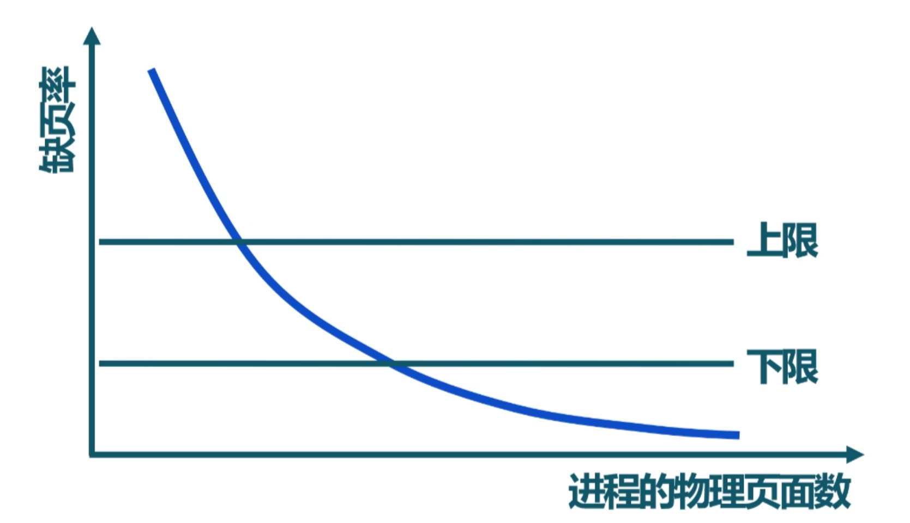

超越物理內存的地址空間
==============================================================

本節導讀
--------------------------

有限的物理內存
~~~~~~~~~~~~~~~~~~~~~~~~~~~~~~~~~~

到目前為止，在面向批處理系統的操作系統中，正在運行的任務只有一個，可以訪問計算機的整個物理內存空間。如果物理內存空間不夠，任務需要比較小心翼翼的地申請和釋放內存，來確保在當前時間段中內存夠用。在面向多道程序的協作式操作系統或面向分時多任務的搶佔式操作系統中，由於在內存中會有多個任務來共享整個物理內存，且任務之間的物理內存空間是隔離的，導致任務越多，每個任務可用的物理內存空間會越少。這樣，在提高CPU利用率和任務間的隔離安全性的同時，一個比較嚴重的問題出現了： **物理內存不夠用** 。

.. note::

	為什麼要為應用程序支持巨大的地址空間？

	在計算機發展的早期，計算機系統上的應用程序一般不需要巨大的地址空間，更需要的是強勁的CPU處理能力。但從二十世紀七十年代末開始的個人計算機一路發展至今，存在著某種動力使得人們如此頻繁地更新計算機設備，這就是：

	**安迪比爾定律：比爾要拿走安迪所給的（What Andy gives, Bill takes away）**

	Intel處理器的速度每十八個月翻一番，計算機內存和硬盤的容量以更快的速度在增長。過去的MS DOS操作系統和DOS應用程序在內存容量為640KB的計算機上順暢地運行。而現在的Windows 11和Windows應用程序在內存容量8GB的計算機上僅勉強夠用，而建議的內存配置是16GB（是640KB的25600倍）。雖然新的軟件功能比以前的版本強了一些，但其增加的功能和它的大小不成比例。

	那大內存帶來的好處是啥？ **方便！** 一般用戶可以在計算機上同時開啟多個應用：文字編輯、上網瀏覽、視頻會議等，享受方便的數字生活。應用程序開發者不必擔心要處理的數據是否有足夠空間存儲，只需編寫程序，根據數據所需空間分配內存即可，甚至都不需要考慮釋放內存的操作。

	注：安迪是Intel公司 CEO 安迪·格魯夫（Andy Grove），比爾是微軟公司創始人比爾·蓋茨（Bill Gates）。

超越物理內存的方法
~~~~~~~~~~~~~~~~~~~~~~~~~~~~~~~~~~

我們需要突破物理內存有限的限制，這需要通過應用程序的軟件編程技巧或操作系統與硬件結合的內存管理機制來解決。首先，我們可以看看基於應用程序本身的方法，即分時複用內存：即應用程序/運行時庫動態地申請和釋放內存，讓不同的代碼和數據在不同時間段內共享同一塊內存空間。

另外一種方法是基於操作系統的方法，即把遠大於且遠慢於物理內存的存儲設備（如硬盤、SSD等）利用起來作為內存的一部分。如果把正在運行的任務所沒用到的物理內存空間，比如處於等待狀態的任務所使用的物理內存空間，甚至是正在運行的任務會較晚訪問的數據所佔用的內存空間，移出並暫存在存儲設備中，那麼應用程序可以訪問的內存空間（虛擬的）就包括了存儲設備的巨大容量了。

當然還有其他一些針對特定使用場景下的不太常用的方法，比如內存壓縮方法。對於需要處理大數據的應用而言，內存中存放的主要是各種數據，而很多數據（如具有大量重複的值）是可以被壓縮的。所以採用一定的壓縮數據的結構和數據壓縮方法，可以有效地減少數據佔用的內存空間。

這些給應用程序帶來好處的方法，也會引入各種運行時的開銷，如果處理不當，會讓任務本身，甚至整個系統的執行效率大大下降。所以，我們希望通過設計有效的機制和策略，能在擴大虛擬的內存容量的同時，保證應用程序和系統能夠高效地運行。

分時複用內存
--------------------------------

考慮到應用程序在其運行中的不同時間段內，會使用不同的數據，所以可以讓這些數據在不同的時間段內共享同一內存空間。這就是分時複用內存的基本思路。當應用程序從操作系統中只能獲得一塊固定大小的有限內存空間（稱為：空閒空間）後，應用程序一般會採用動態分配內存的方式來合理使用有限的物理內存。在本章的 :ref:`Rust 中的動態內存分配 <term-dynamic-allocation>` 一節中，講述了動態內存分配的基本概念。如何動態地管理空閒內存以提高內存的使用效率，是一個需要進一步討論的問題。我們將講述兩種方法：

- 動態內存分配：由應用程序主動發出申請或釋放內存的動態請求，由運行時庫或應用程序本身通過一定的策略來管理空閒空間。
- 覆蓋技術：一個應用程序中存在若干個功能上相對獨立的程序段（函數集合），它們不會同時執行，所以它們可以共享同一塊內存空間。這需要應用程序開發者根據需要手動移入或移出內存中的代碼或數據。

動態內存分配
~~~~~~~~~~~~~~~~~~~~~~~~~~~~~~~~~~

動態分配內存的目標是處理快速和浪費的空閒空間碎片少。這裡我們會進一步分析動態分配內存的策略。對於不同的分配需求的前提情況，會有不同的分配策略。比如，每次分配的空間大小是固定的，那麼就可以把空閒空間按固定大小的單元組織為一個列表。當需要分配時，從列表中的第一個單元取出即可；但需要回收時，把回收單元放到列表的末尾即可。

但應用程序需要的內存空間一般是大小不一的，這就需要相對複雜一些的策略來管理不同大小的空閒單元了。

最先匹配（first fit）策略
^^^^^^^^^^^^^^^^^^^^^^^^^^^^^^^^^

首次匹配策略的思路很簡單：儘快找到滿足用戶需求的空閒塊。大致處理流程就是把空閒空間基於地址順序組織為大小不一的空閒塊列表。當需求方需要大小為n的空閒塊時，搜索空閒塊列表，找到第一個足夠大的空閒塊；如果此空閒塊大小剛好為n，則把此空閒塊返回給需求方；如果此空閒塊大小大於n，則把空閒塊分割為大小為n的前面部分和剩餘部分，大小為n的前面部分返回給需求方，而剩餘部分會迴歸給空閒塊列表管理，留給後續請求。

最先匹配策略不需要遍歷空閒列表查找所有空閒塊，所以有速度上的優勢，但釋放的時間有一定的隨機性，這可能會讓空閒列表開頭的部分有很多小塊。

最優匹配（best fit）策略
^^^^^^^^^^^^^^^^^^^^^^^^^^^^^^^^^

最優匹配（best fit）策略的思路也很簡單：選擇最接近需求方請求大小的塊，從而儘量避免空間浪費。也是把空閒空間基於地址順序組織為大小不一的空閒塊列表。當需求方需要大小為n的空閒塊時，遍歷整個空閒列表，找到足夠大且二者空間大小差距最小的空閒塊。其代價是時間，即需要遍歷一次空閒列表，找到最合適的空閒塊。而且還有可能造成空間的浪費，因為可能產生很多小的空閒碎片，雖然碎片容量的總和比較大，但無法滿足內存分配請求。

最差匹配（worst fit）策略
^^^^^^^^^^^^^^^^^^^^^^^^^^^^^^^^^

最差匹配（worst fit）策略的思路與最優匹配策略相反，它嘗試找最大的空閒塊，這也需要遍歷一次空閒列表。當對找到的空閒塊進行分割並滿足用戶需求後，剩餘的空閒部分相對於最優匹配或最先匹配策略剩餘的空閒部分相比，在大小上要大不少，可能被再次分配出去的概率要大。但最差匹配策略同樣需要遍歷整個空閒列表，帶來較大的性能開銷；且在應用頻繁申請和釋放的隨機情況下，也可能會產生大量的碎片。

減少碎片
^^^^^^^^^^^^^^^^^^^^^^^^^^^^^^^^

其實，採用上面的三種策略，都會由於對空閒塊進行分割而產生碎片。所以減少碎片是一個需要考慮的重要問題。減少碎片有兩種方法，第一種方法是合併操作，即在內存釋放操作中，把在地址連續的多個空閒塊合併為一個大的空閒塊，這樣可以滿足更多的內存分配請求。

第二種方法是比較激進的緊緻（compaction，也稱緊湊）操作，即把地址不連續的多個空閒塊移動在一個連續的地址空間中，形成一個大的空閒塊。在移動空閒塊的過程中，也需要移動已經分配的內存塊。這除了帶來性能上的影響外，還會帶來數據尋址問題，應即用程序中數據所在的內存地址會發生改變，應用程序要能夠感知這種變化，才能正確訪問更新後的數據地址。這需要應用程序具有在緊緻操作後的數據地址更新功能，這對應用程序開發者提出了很高的要求，不具有通用性。

覆蓋（Overlay）技術
~~~~~~~~~~~~~~~~~~~~~~~~~~~~~~~~~~

覆蓋技術是指一個應用程序在執行過程中，其若干程序段分時共享同一塊內存空間。覆蓋技術的大致思路是編寫一個應用程序，把它分為若干個功能上相對獨立的程序段（函數集合），按照其邏輯執行結構，這些程序段不會同時執行。未執行的程序段先保存在存儲設備上，當有關程序段的前一部分執行結束後，把後續程序段和數據調入內存，覆蓋前面的程序段和數據。

覆蓋技術需要程序員在編寫應用程序時，來手動控制和管理何時進行覆蓋，不同程序段的覆蓋順序，以及覆蓋的具體空間位置。這雖然減少了應用程序在執行過程中對內存空間的需求，當對應用程序開發者的編程水平提出了很高的要求，而且通用性比較差。

內存交換
--------------------------------

既然我們有了操作系統，就應該在給應用更大內存空間的同時，降低應用程序開發者的開發難度。這樣的代價就是增加操作系統內核的設計和實現複雜度。操作系統有兩種擴大內存的方法。第一種方法是交換（swapping）技術，基本思路相對簡單，即把一個應用程序從存儲設備完整調入內存執行，該應用運行一段時間後，再把它暫停，並把它所佔的內存空間（包括代碼和數據）存回存儲設備，從而釋放出內存空間。另一種方法是虛擬內存（virtual memory）技術，基本思路是使應用程序在只有一部分代碼和數據被調入內存的情況下運行。

交換技術
~~~~~~~~~~~~~~~~~~~~~~~~~~~~~~~~

我們目前的操作系統還沒實現這種技術，但不妨礙我們思考一下這種技術面臨的問題和大致解決方法。在我們之前設計實現的批處理操作系統中，每次執行新應用時，需要把剛執行完畢的老應用所佔內存空間給釋放了，再把新應用的代碼和數據換入到內存中。這是一種比較原始的應用之間交換地址空間（Swap Address Space）的方法。這種交換技術的方法也可進一步擴展用到多任務操作系統中，即把不常用或暫停的任務在內存中的代碼和數據換出（Swap Out）存儲設備上去。

首先是交換的時機，即何時需要發生交換？當一個任務在創建或執行過程中，如果內存不夠用了，操作系統就需要執行內存交換操作。

第二個需要考慮的是交換的對象，即交換哪個任務？如果是一個剛創建的任務，在創建過程中內存不夠用了，我們可以基於某種選擇策略（如選擇佔用內存最多的那個任務）選擇一個任務，把它所佔用的內存換出到存儲設備中，形成更多的空閒空間，直到被創建任務有足夠的空間開始執行。如果是一個正在執行的當前任務動態需要更多的內存空間，操作系統有兩種選擇，一個選擇與剛才的處理方式類似，找一個其他任務，並把其所佔空間換出到存儲設備中，從而滿足當前任務的需要。另一個選擇是把當前任務給暫停了（甚至有可能把它所佔空間換出到存儲設備上），然後讓其他任務繼續執行，並在執行完畢後，空出所佔用的內存，並切換到下一個新任務執行，如果新任務在存儲設備上，還需把新任務的代碼和數據換入到內存中來；如果空閒內存能夠滿足被暫停的任務的內存分配需求，則喚醒該任務繼續執行。

第三個需要考慮的是代碼/數據的尋址，即任務被換出並被再次換入後，任務能否正確地執行？由於再次換入後，整個地址空間一般不可能正好被放入到同樣的位置，這可以採用前述減少內存碎片的緊緻技術中的地址更新方法，但實現複雜且不具有通用性。如果操作系統更新任務的頁表內容，形成新的物理地址和虛擬地址映射關係。這樣雖然任務換入後所在的物理地址是不同的，但可以讓任務採用換出前同樣的虛擬地址來執行和訪問數據。

這裡需要注意的是，即使解決了上述三個問題，但由於每次換入換出的數據量大（當然是由於任務的代碼量和所訪問的數據佔用的內存空間大的原因），導致任務的執行會卡頓。這就需要以頁為單位的內存換入換出技術 -- 虛擬內存技術了。

虛擬內存技術
~~~~~~~~~~~~~~~~~~~~~~~~~~~~~~~~~~

由於有了基於硬件的分頁機制和MMU/TLB機制，操作系統可以通過頁表為正在運行的任務提供一個虛擬的地址空間，這就是虛擬內存技術的基礎之一。但僅有這個基礎還不足以讓應用程序訪問的地址空間超越物理內存空間。我們還需要解決的一個關鍵問題：操作系統如何利用更大且更慢的存儲設備，來 **透明** 地給應用程序提供遠超物理內存空間的一個虛擬的地址空間？

頁面置換機制
~~~~~~~~~~~~~~~~~~~~~~~~~~~~~~~~~~

為解決這個關鍵問題，虛擬內存技術其實還需要一系列的頁面置換機制來支持：

- 作為交換區的存儲設備：用於存放換出的部分物理內存中的代碼和數據。
- 頁表項存在位：當應用程序(也可稱為任務)訪問被換出到交換區的物理內存（對應頁表項的存在位 V 為“0”）時，處理器會產生訪存異常，讓操作系統完成內存換入操作。
- 內存訪問異常處理： 操作系統判斷任務的訪存異常的地址是否屬於任務地址空間，如果是屬於，則把交換區對應物理內存頁換入內存，使得任務可以繼續正常運行。

作為交換區的存儲設備
^^^^^^^^^^^^^^^^^^^^^^^^^^^^^^^^

為了能夠支持對物理內存的換入和換出操作，需要在存儲設備上分配一個特定的分區或者文件，作為存放物理內存的交換區（swap space）。一般情況下，存儲設備（如磁盤）的扇區大小為N，而一個頁大小為k*N，(k和N為正整數)。為了支持以頁為單位進行物理內存與交換區的換入換出操作，需要建立任務的頁虛擬地址與多個磁盤扇區地址映射關係。這個映射關係可以建立在任務所在頁表中對應虛地址的頁表項中，即頁表項中的內容是存儲設備的扇區地址。這樣操作系統在內存訪問異常處理中，根據產生異常的虛擬地址，可快速查找到對應的頁表項，並取出存儲設備的扇區地址，從而可以準確地把存儲在扇區中的物理內存換入到物理內存中。

另外，需要在存儲設備上建立足夠大小的交換區空間。這裡的足夠大小的值在一般情況下是一個經驗估計值，比如是物理內存大小的1.5~2倍。這個值決定了整個系統中的所有應用程序能夠使用的最大虛擬內存空間。

.. note::

    按需分頁（Demand Paging）

    還有一點需要注意，交換區並不是應用程序的頁面換入換出的唯一區域。由於應用程序的二進制代碼文件一般存放在存儲設備的文件系統中，當程序一開始執行時，該程序的代碼段可以都不在物理內存中，這樣當程序對應的任務創建後，一開始執行就會產生異常。操作系統在收到這樣的異常後，會把代碼段對應的內存一頁一頁地加載到內存中。這其實是一種內存訪問的性能優化技術，稱為“按需分頁”（Demand Paging）,即只有在任務確實需要的時候，才把所需數據/代碼以頁為單位逐步從存儲設備換入到內存中。

頁表項（Page Table Entry）
^^^^^^^^^^^^^^^^^^^^^^^^^^^^^^^^

頁表中的頁表項記錄了物理頁號和對應頁的各種屬性信息，處理器根據虛擬地址中的虛頁號（Virtial Page Number， VPN）為頁表索引，可最終查找到虛擬地址所在的物理頁位置。這是頁表項的基本功能。當我們需要提供可遠大於物理地址空間的虛擬地址空間時，頁表項中的內容能發揮新的作用。 

我們重新梳理一下某任務讓處理器訪問被換出到存儲設備上的數據所經歷的過程。在處理器訪問某數據之前，操作系統已把包含該數據的物理內存換出到了存儲設備上，並需要提供關鍵的關聯信息，便於操作系統後續的換入工作：

- 該數據的虛擬地址是屬於某任務的地址空間：可在任務控制塊中包含任務的合法空間範圍的記錄
- 該數據的頁虛擬地址所對應的存儲設備的扇區地址：可在頁虛擬地址對應的頁表項中包含存儲設備的扇區地址的記錄
- 該數據的虛擬頁沒有對應的物理頁：在頁虛擬地址對應的頁表項中的存在位（Present Bit）置“0”，表示物理頁不存在

在後續某時刻，該任務讓處理器訪問該數據時，首先處理器根據虛擬地址獲得虛頁號，然後檢查MMU中的TLB中是否由匹配的項目，如果TLB未命中，則會進一步根據頁表基址寄存器信息，查找內存中的頁表，並根據VPN找到虛擬頁對應的頁表項。硬件會進一步查找該頁表項的存在位，由於已經被操作系統設置為“0”，表示該頁不在物理內存中，處理器會產生“Page Fault”異常，並把控制權交給操作系統的“Page Fault”異常處理例程進行進一步處理。

內存訪問異常處理
^^^^^^^^^^^^^^^^^^^^^^^^^^^^^^^^

操作系統的“Page Fault”異常處理例程首先會判斷，該數據的虛擬地址是否是該任務的合法地址？根據之前操作系統的設置，答案是“Yes”；然後取出保存在對應頁表項中的扇區地址，把存儲設備上交換區上對應的虛擬頁內容讀入到某空閒的物理內存頁中；接著更新頁表項內容，即把對應的物理頁號寫入頁表項，把頁表項中的存在位（Present Bit）置“1”；最後是返回該任務，讓該任務重新執行訪問數據的指令。這次處理器再次執行這條指令時，TLB還是會沒有命中，但由於對應頁表項內容合法，所以TLB會緩存該頁表項，並完成虛擬地址到物理地址的轉換，完成訪問數據指令的執行。

相對於內存訪問，交換區的扇區訪問要慢很多。為了進一步提高系統的執行效率，當操作系統在讓存儲設備進行I/O訪問時，可將當前任務設置為阻塞狀態，並切換其他可以運行的任務繼續執行。通過這種任務調度方式，可以充分發揮多道程序和分時多任務的整體執行效率。

頁面置換策略
~~~~~~~~~~~~~~~~~~~~~~~~~~~~~~~~~~

當物理內存不夠用的時候，我們還需要考慮把哪些內存換出去的問題，這就是下面會深入討論的頁面置換策略。置換策略通常會根據程序的訪存行為、訪存效率的評價指標和一些通用原則來進行設計。

內存層次結構與局部性原理
^^^^^^^^^^^^^^^^^^^^^^^^^^^^^^^^^^^^^^

同學們在學習計算機組成原理和編程優化方法時，或多或少地都瞭解內存/存儲的層次結構和局部性原理。

上圖是一個典型的內存/存儲的層次結構，上層比下層速度快但容量小，每一層都可以放置程序用到的代碼和數據。這樣的存儲器層次結構設計是一種典型的工程思維，因為在成本等工程約束下，我們無法在構造出速度最快且容量最大的“理想”內存。我們希望基於這種層次結構，加上一定的軟硬件優化手段，能夠接近“理想”內存的目標。要達到這樣的目標，需要理解局部性原理。

程序的局部性原理是指程序在執行時呈現出時空局部性的規律，即在一段時間內（時間特性），程序執行僅限於代碼的某一部分，且執行所訪問的內存空間也侷限於某局部內存區域（空間特性）。

局部性可細分為時間局部性和空間局部性。時間局部性是指程序執行的某條指令在不久之後可能會再次被執行；程序訪問的某數據在不久之後可能再次被訪問。空間局部性是指當前程序訪問某個內存單元，在不久之後可能會繼續訪問鄰近的其他內存單元。

如果一個程序具有良好的局部性，那麼處理器中的Cache就可以緩存程序常用的局部數據和代碼，而相對不常用的數據和代碼可以放在內存中，從而加快程序的運行效率。同理，操作系統也可以在內存中以頁為單位來緩存程序常用的局部數據和代碼。但物理內存有限，把哪些數據和代碼換入到內存中或換出到存儲設備的交換區，是一個值得探索的頁面置換策略問題。

評價指標
^^^^^^^^^^^^^^^^^^^^^^^^^^^^^^^^

頁面置換策略可以由多種，這就需要對各種策略的優劣進行評價。我們希望程序訪問的數據 **快** ，最好是數據都在物理內存中。但這僅僅是理想，一旦數據不在物理內存，即訪存未命中，就會產生“Page Fault”異常，並讓操作系統從存儲設備的交換區把數據緩慢地讀入到內存中。

如何量化程序訪問的速度呢？如果能知道程序執行過程中的訪存命中次數和未命中次數，就可以計算出程序的平均內存訪問時間：

.. math::

	AvgTime = ( T_m * P_{hit}  +  T_s * P_{miss} ) / ( P_{hit} + P_{miss} )

這裡 :math:`T_m` 是訪問內存單元的時間，:math:`T_s` 是訪問存儲設備的時間， :math:`P_{hit}` 是訪存命中次數， :math:`P_{miss}` 是訪存未命中次數。 訪存命中率是：

.. math::

	HitRatio = P_{hit} /  ( P_{hit} + P_{miss} )

由於訪問內存比訪問存儲設備快2~3個數量級，所以性能瓶頸是對存儲設備讀寫次數，即訪存未命中次數。 只有減少訪存未命中次數，才能提高訪存命中率，並加快平均內存訪問速度。所以頁面置換策略的評價指標就是
訪存未命中次數 或 訪存命中率。

策略範疇
^^^^^^^^^^^^^^^^^^^^^^^^^^^^^^^^

對於頁面置換策略，還需考慮是否會動態調整任務擁有的物理頁數量，如果可以動態調整，這會對其他任務產生影響。如果操作系統給每個任務分配固定大小的物理頁，在任務的執行過程中，不會動態調整任務擁有的物理頁數量，那麼對任務進行頁面置換，不會影響到其他任務擁有的物理內存。這種情況下的策略屬於局部頁面置換策略範疇，因為它只需考慮單個任務的內存訪問情況。

如果操作系統通過某種頁面置換策略可動態調整某任務擁有的物理內存大小，由於總體的物理內存容量是固定的，那就會影響到其他任務擁有的物理內存大小。這樣的策略屬於全局頁面置換策略範疇。

全局頁面置換策略可以在任務間動態地調整物理內存大小，通常比局部頁面置換策略要效果好一些。而對於某些具體的頁面置換策略，可既適用於局部頁面置換策略範疇，也使用於全局頁面置換策略範疇。

最優置換策略
^^^^^^^^^^^^^^^^^^^^^^^^^^^^^^^^

操作系統如果能夠預先知道應用程序在執行過程中每次內存訪問的虛擬地址序列，那就可以設計出一個最優置換策略，即可以讓程序的未命中數量最小。其基本思路是選擇一個應用程序在隨後最長時間內不會被訪問的虛擬頁進行換出。當然，最長時間可以是無限長時間，表示隨後不會再訪問。

但操作系統怎麼知道一個虛擬頁隨後多長時間不會被訪問呢？在一般情況下當然不知道，所以最優置換策略是一種無法實際實現的策略。最優置換策略一般可作為標杆而存在，即我們可以把最優頁面置換策略於其他可實現的策略進行性能比較，從而對各種策略的效果有一個相對的認識。

FIFO置換策略
^^^^^^^^^^^^^^^^^^^^^^^^^^^^^^^^

早期操作系統系統為了避免嘗試達到最優的計算複雜性，採用了非常簡單的替換策略，如FIFO（先入先出）置換策略。其基本思路是：由操作系統維護一個所有當前在內存中的虛擬頁的鏈表，從交換區最新換入的虛擬頁放在表尾，最久換入的虛擬頁放在表頭。當發生缺頁中斷時，淘汰/換出表頭的虛擬頁並把從交換區新換入的虛擬頁加到表尾。

FIFO置換策略雖然在實現上簡單，但它對頁訪問的局部性感知不夠，及時某頁被多次訪問，也可能由於它較早進入內存而被置換出去。

LRU置換策略
^^^^^^^^^^^^^^^^^^^^^^^^^^^^^^^^

LRU（Least Recently Used，最近使用最少）置換策略是一種基於歷史來預測未來的置換策略，其基本思路是：操作系統替換的是最近最少使用的虛擬頁。“最近”是一個時間維度的量，表示過去的一段時間。精確地說，過去的這段時間是從程序開始執行到當前程序產生“Page Fault”異常的時間片段。虛擬頁被訪問的近期性（Recency）表示頁被訪問到目前產生異常這段時間的長短。這段時間越長，頁被訪問的近期性越弱，最弱即最近使用最少；反之，近期性就強。

訪存的近期性是一種歷史信息，也是程序局部性的一種體現，因為越近被訪問過的頁，也許在不久的將來再次被訪問的可能性也就越大。所以LRU置換策略是一種以歷史來預測未來的啟發式方法。在一般情況下，對於具有訪存局部性的應用程序，LRU置換策略的效果接近最優置換策略的效果。

為了實現LRU置換策略，操作系統需要記錄應用程序執行過程中的訪存歷史信息，這在實際實現上是一個挑戰。LRU置換策略需要記錄應用訪問的每頁的最後一次被訪問的時間。這樣，當一個頁必須被替換時，該策略就選擇最長時間沒有被使用的頁。
這裡的難點是如何準確記錄訪存的時間信息。我們可以想象一下，通過擴展硬件和軟件功能的軟硬結合的方式來記錄：

**硬件計數器方法**

處理器添加一個計數器，且操作系統為每個頁表條目添加一個使用時間字段。對於處理器的每次內存訪問，計數器都會遞增。每當對某虛擬頁進行訪問時，計數器的內容都會被處理器複製到該頁對應的頁表條目中的使用時間字段。這樣，我們總有最後一次使用每頁的“相對時間”。當嘗試“Page Fault”異常並需要替換虛擬頁時，操作系統搜索頁表，找到具有最小的使用時間的頁表項，並把該頁表項對應的虛擬頁替換出去。

這個方法對硬件資源要求很高，且執行開銷高昂。為保證記錄的使用時間有足夠的表示範圍，時計數器位數應該比較大，比如64位，如果太小，計數器容易溢出。這樣每個頁表項也會擴大一倍（假設原頁表項佔64 bit）。在性能上的影響更大，處理器需要不時地對位於內存中的頁表項進行寫操作，且在替換時，還需執行一個開銷很大的最小使用時間的頁表項查找過程。這將大大影響計算機的造價和實際的性能，所以，該方法也就停留在理論的可行性上了。

**stack方法**

stack方法是一種基於棧組織結構的算法。即把表示頁（有虛擬頁號即可）的項目按訪存先後組織位一個棧式單鏈表，表頭指向最近訪問的頁項目，表尾指向最久訪問的頁項目。每當應用訪問一個頁時，處理器就會從鏈表中找到該頁對應項目，移除並放在鏈表頭。這樣，最近使用的頁總是在棧式單鏈表的頂部，而最近最少使用的頁總是在鏈表的底部。因為必須從棧的中間移除項目，所以一般通過鏈表組織來實現。

這個方法消耗更多內存，且執行開銷很大。由於鏈表的容量，使得它只能放在內存中。如果由處理器硬件來處理，則對硬件資源要求很高，對於每次訪問頁，處理器都需要查找鏈表，並更新鏈表。如果由軟件來處理，那操作系統需要感知每次的訪問頁情況，則需要處理器通過某種異常機制來通知，並在隨後的異常處理過程中，完成對鏈表的查找和更新工作。這兩種方法的執行時間開銷都很大，所以stack方法也停留在理論的可行性上了。

問題：我們是否真的需要找到準確的最舊頁來替換？在大多數情況下，找到差不多最舊的頁是否也能夠獲得預期的效果?

Clock置換策略
^^^^^^^^^^^^^^^^^^^^^^^^^^^^^^^^

從計算機系統的工程設計（考慮成本）和操作系統設計（考慮執行開銷）的角度來看，近似LRU策略更為可行。近似LRU策略的關鍵問題是：如何以儘量小的硬件開銷和執行代價快速找到差不多最舊的頁？

根據之前的 `頁面置換機制`_ 中處理器訪問數據的過程，我們可以瞭解到在訪問數據前，想要查找位於TLB或內存中的頁表項，所以我們可以對頁表項中的某些位進行一定的擴展，用來表示應用訪問內存的情況。如果要表示應用訪問某頁的情況，可以用一位就夠了，“1”表示近期訪問了某頁，“0”表示近期沒有訪問某頁。在最小硬件成本的前提下，我們就可在頁表項中的一個bit（use bit 使用位, 也稱 reference bit 引用位）來表示頁表項對應的虛擬頁的訪問情況。

.. chyyuu ???  介紹一下 atlas one-level store OS “One-level Storage System”, T. Kilburn, and D.B.G. Edwards and M.J. Lanigan and F.H. Sumner IRE Trans. EC-11, 2 (1962), pp. 223-235

那麼如何訪問這個特別的bit呢？這裡處理器和操作系統之間達成了一個訪問約定：每當頁被引用（即讀或寫）時，處理器硬件將把對應該頁的頁表項的使用位設置為1。但是，硬件不會清除該位（即將其設置為0），而這是由操作系統來負責的。

有了關於使用位的硬件設置和訪問約定，我們就可以設計出近似LRU置換策略了。 想象一下，應用所在地址空間中的所有有效頁（頁表項的存在位為1）都放在一個環形循環列表中，一個指針像時鐘的指針一樣，會圍繞環形列表旋轉。該指針開始時指向某個特定的頁。當必須進行頁換出時，操作系統會查找指針當前指向的頁對應的頁表項，並檢查該頁表項的使用位是1還是0。如果是0，則意味著該頁最近沒被使用，適合被替換，指針遞增到鏈表的下一項。如果是1，則意味著該頁最近被使用，因此不適合被替換，然後把使用位設置為0，時鐘指針遞增到鏈表的下一頁，一直持續到找到一個使用位為0的頁。

這種近似LRU策略類似時鐘旋轉的過程，所以也稱為Clock（時鐘，也稱 Second-Chance 二次機會 ）置換策略。雖然Clock置換策略不如LRU置換策略的效果好，但它比不考慮歷史訪問的方法要好，且在一般情況下，與LRU策略的結果對比相差不大。

時鐘置換策略的一個小改進，是進一步額外關注內存中的頁的修改情況。這樣做的原因是：如果頁已被修改（modified，也稱 dirty），稱為髒頁，則在釋放它之前須將它的更新內容寫回交換區，這又增加了一次甚至多次緩慢的I/O寫回操作。但如果它沒有被修改（clean），就稱為乾淨頁，可以直接釋放它，沒有額外的I/O寫回操作。因此，操作系統更傾向於先處理乾淨頁，而不是髒頁。

為了支持這種改進，頁表項還應該擴展一個修改位（modified bit，又名髒位，dirty bit）。處理器在寫入頁時，會設置對應頁表項的此位為1，操作系統會在合適的時機清除該位（即將其設置為0）。因此可以將該修改位作為該頁近期是否被寫的信息源。這樣，改進的時鐘置換策略，制定出新的優先級，即優先查找並清除未使用且乾淨的頁（第一類）；如無法找到第一類頁，再查找並清除已使用且乾淨的頁或未使用且髒的頁（第二類）；如果無法找到第二類的頁，再查找並清除已使用且髒的頁（第三類）。

工作集置換策略
^^^^^^^^^^^^^^^^^^^^^^^^^^^^^^^^

上述置換策略沒有涉及動態調整某任務擁有的物理內存大小（也稱頁幀數，Frame Number）。如果置換策略能動態調整任務擁有的物理內存大小，則可以在系統層面對其他任務擁有的物理內存產生影響。下面介紹的置換策略就具有這樣的特徵。

.. chyyuu??? 工作集（working set）（Denning，1968；Denning，1980） 

計算機科學家Denning在二十世紀六十年代就發現，大多數程序都不是均勻地訪問它們的地址空間，而不同時間段的訪問往往是集中在不同的小部分頁面中。在程序執行的任一時刻，都存在一個動態變化的頁面集合，它包含所有最近內存訪問所訪問過的頁面。這個集合其實就是工作集（working set）。

理解工作集置換策略的前提是先理解工作集的定義。一個任務當前正在使用的頁面集合稱為它的工作集（working set，也稱駐留集合）。如果整個工作集都被裝入到了內存中，那麼任務在運行到下一運行階段之前，一般不會產生很多缺頁中斷。若內存太小而無法容納下整個工作集，那麼任務在後續運行過程中可能會產生大量的缺頁中斷，導致執行變慢。

注意，上述工作集的概念和對缺頁中斷的推斷，其實是建立在程序執行具有局部性這個基礎上的，也是一種根據歷史來推測未來的啟發式方法。為了基於工作集的特徵來設計置策略，我們需要量化工作集的概念。在t時刻，任務最近n次內存訪問均發生在m個頁面集合上，那麼這個頁面集合就是任務在t時刻最近k次內存訪問下的工作集，用 ``w(k,t)`` 來表示。工作集中頁面數量用 ``|w(k,t)|`` 表示。 隨著任務的執行，工作集中的頁面會發生變化，其數量也會發生變化。如果一個任務佔用的頁面數與其工作集大小相等或超過工作集，則該任務可在一段時間內不會發生缺頁異常。如果其在內存的頁面數小於工作集，則發生缺頁中斷的頻率將增加。

所以，工作集置換策略的目標就是動態調整工作集的內容和大小，一個任務佔用的頁面數接近其工作集大小，減少缺頁異常次數。

實現工作集置換策略的基本思路是，操作系統能及時跟蹤任務執行中位於工作集中頁面，然後在發生缺頁異常或過了一段時間間隔時，淘汰一個不在工作集中的頁面，如果缺頁異常就換入位於交換區中的頁。

實現工作集置換策略的調整是及時獲取工作集信息。有了工作集的定義並不意味著存在一種工程上可接受的有效方法，能夠在程序運行期間及時準確地計算出工作集。

如果暫時不計考慮硬件上的工程成本，我們可以在處理器上添加一個長度為k的移位寄存器，當前處理器每進行一次內存訪問就把寄存器左移一位，然後在最右端插入剛才所訪問過的頁面號。這樣把移位寄存器中的k個頁面號按訪問時間排序，並去除老的重複頁面，形成的集合就是工作集。然而，維護移位寄存器並在缺頁中斷時處理它所需的開銷很大，因此該技術僅僅停留在理論上。

其實，我們也可以參考近似LRU策略，提出近似工作集置換策略。一種可行的近似方法是，不向後找最近k次的內存訪問，而改為查找一段固定時間被訪問的頁面。比如，工作集即是一個任務在過去τ時間段中的內存訪問所用到的頁面集合。在一般情況下，對於過去τ時間段的具體值是基於經驗設置的，如10ms。這裡，我們可以根據頁面對應頁表項的訪問位來判斷該頁在過去τ時間段中是否被訪問，如果該位為 “1” ，表示該頁被訪問，屬於工作集，否則就不屬於工作集。當然這種近似方法對工作集的跟蹤比較粗略，我們可以建立每個訪問頁的時間戳鏈表，得到更準確的工作集信息，但這樣的執行開銷和空間成本就大了。

當缺頁中斷髮生後，需要掃描整個頁表才能確定被淘汰的頁面，因此基本的工作集置換策略是比較費時的。Carr和Hennessey在1981提出了一種基於時鐘信息的改進的工作集置換策略，稱為WSClock（工作集時鐘）置換策略。由於它實現簡單，性能較好，所以在實際工作中得到了廣泛應用。該策略首先要建立一個以頁框為元素的空的循環表。當操作系統加載第一個任務訪問的頁面後，把對應的頁面信息加到該表中。隨著更多頁面的加入，它們形成一個更大容量的循環表，其中每個表項包含來自基本工作集置換策略中記錄的上次使用時間和訪問位信息（由處理器硬件置一，表示訪問該頁）。

每次缺頁中斷時，WSClock置換策略首先檢查指針指向的頁面，如果指針指向的頁面的存在位為1，表示該頁面在當前時鐘滴答中就被使用過，那麼該頁面就不適合被淘汰。然後把該頁面的存在位置為0，並指針指向下一個頁面，重複掃描循環表。如果指針指向的頁面存在位為0，再進一步檢查該頁面的生存時間大於τ，那它就不在工作集中，是屬於被淘汰的頁。

缺頁率置換策略
^^^^^^^^^^^^^^^^^^^^^^^^^^^^^^^^

在上面的各種置換策略中，或多或少涉及到對頁面訪問時間的記錄和查找，排序等操作，開銷很大。而置換策略的目標是減少缺頁次數或缺頁率。缺頁率置換策略就是一種直接根據缺頁率的變化來動態調整任務的物理內存大小的方法。如果缺頁率高了，就增加任務佔用的物理內存，如果缺頁率低了，就減少任務佔用的物理內存。任務佔用的物理內存也稱常駐集，即當前時刻，任務實際駐留在內存中的頁面集合。

那如何計算缺頁率呢？ 缺頁率的定義如下：

	缺頁率（page fault rate）= 缺頁次數 / 訪存次數

要得到缺頁率的精確值比較困難，主要是訪存次數難以精確統計。我們可以採用一種近似的方法來表示缺頁率。從上次缺頁異常時間Tlast 到現在缺頁異常時間Tcurrent 的時間間隔作為缺頁率的當前指標。並用一個經驗值Ts表示適中的缺頁率。

這樣，缺頁率置換策略的基本思路就是：在任務訪存出現缺頁時，首先計算從上次缺頁異常時間Tlast 到現在缺頁異常時間Tcurrent 的時間間隔。然後判斷，如果 Tcurrent – Tlast > Ts, 則置換出在 [Tlast ,  Tcurrent ] 時間內沒有被引用的頁，並增加缺失頁到工作集中；如果 Tcurrent – Tlast ≤ Ts, 則只增加缺失頁到工作集中。

在上述思路描述中，

- Tcurrent – Tlast > Ts 表示缺頁率低了，通過置換出在 [Tlast ,  Tcurrent ] 時間內沒有被引用的頁，來減少任務的常駐集。
- Tcurrent – Tlast ≤ Ts 表示缺頁率高了，需要增加任務的常駐集。
- 頁是否被引用是根據任務訪問的內存頁對應的頁表項的存在位信息來判斷的。

Belady異常現象
~~~~~~~~~~~~~~~~~~~~~~~~~~~~~~~~~~

計算機科學家Belady及其同事在1969年左右在研究FIFO置換策略是，發現了一個有趣的現象，對於一個內存訪問序列：1，2，3，4，1，2，5，1，2，3，4，5，當物理頁幀數從3增加為4時，訪存命中率反而下降了。

我們通常理解，當一個任務的物理頁幀數量變大時，訪存的命中率是會提高的。但在上面的例子中，命中率反而下降了。這種異常現象被後人稱為Belady異常（Belady’s Anomaly）。

而其他一些策略，比如LRU置換，最優置換等，就不會遇到這個問題。其原因是，LRU等具有棧特性（stack property），即數量為 m+1 的物理頁幀一定包括數量為 m 的物理頁幀的數據內容。因此，當增加物理頁幀數量時，訪存命中率至少保證不變，且有可能提高。而FIFO策略、時鐘策略等沒有棧特性，因此可能出現異常行為。

小結
--------------------------------

本節的內容比較多，我們介紹了超越物理內存的地址空間，涉及動態內存分配、虛擬內存等概念、機制和策略。如果由應用程序自己來做，會給應用程序員很大的開發負擔。如果讓操作系統來做，細節對應用程序都是透明的，應用程序員會很開心。但負擔轉移到了處理器硬件和操作系統上。我們需要對硬件進行擴展，如在頁表項中增加1bit的存在位、訪問位和修改位等。操作系統頁錯誤處理例程（page-fault handler）會將需要的頁從存儲設備的交換區讀取到內存，並可能還需要先換出內存中的一些頁，為即將換入的頁騰出空間。

我們還介紹了一些頁置換策略，這些策略有些只存在理論中，並不實用，但其中的思路可以借鑑和發展，比如設計新的近似策略。在當前情況下，考慮到內存的成本在下降，購買更多的內存也是一種很實際的方法。
