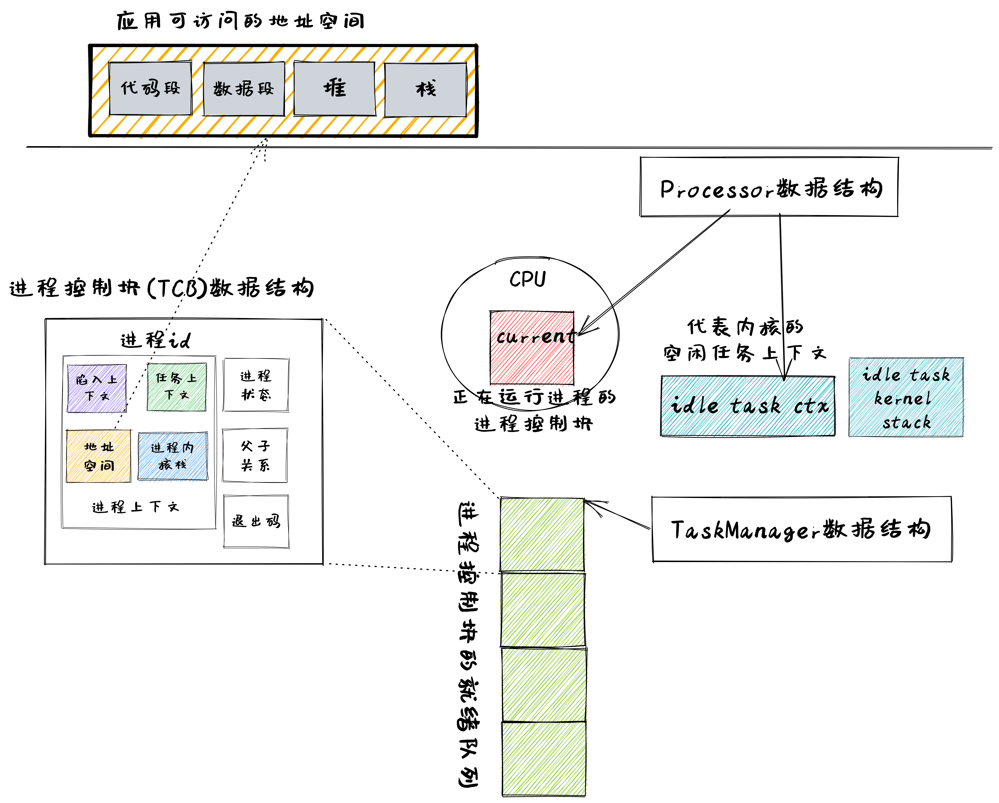

引言
===========================================

本章導讀
-------------------------------------------

在正式開始這一章的介紹之前，我們可以看到：在前面的章節中基本涵蓋了一個功能相對完善的操作系統內核所需的核心硬件機制：中斷與異常、特權級、頁表，而且一個一個逐步進化的遠古生物操作系統內核讓應用程序在開發和運行方面也越來越便捷和安全了。但開發者的需求是無窮的，開發者希望能夠在計算機上有更多的動態交互和控制能力，比如在操作系統啟動後，能靈活選擇執行某個程序。但我們目前實現的這些操作系統還無法做到，這說明操作系統還缺少對應用程序動態執行的靈活性和交互性的支持！

到目前為止，操作系統啟動後，能運行完它管理所有的應用程序。但在整個執行過程中，應用程序是被動地被操作系統加載運行，開發者與操作系統之間沒有交互，開發者與應用程序之間沒有交互，應用程序不能控制其它應用的執行。這使得開發者不能靈活地選擇執行某個程序。為了方便開發者靈活執行程序，本章要完成的操作系統的核心目標是： **讓開發者能夠控制程序的運行** 。

在前面的章節中，隨著應用的需求逐漸變得複雜，作為其執行環境的操作系統內核也需要在硬件提供的相關機制的支持之下努力為應用提供更多強大、易用且安全的抽象。讓我們先來簡單回顧一下：

- 第一章《RV64 裸機應用》中，由於我們從始至終只需運行一個應用，這時我們的內核看起來只是一個 **函數庫** ，它會對應用的執行環境進行初始化，使得應用能夠正確接入計算機的啟動流程，同時我們還設置好函數調用棧使得應用可以正常進行 Rust 函數調用。此外，它還將 SBI 接口函數進行了封裝使得應用更容易使用這些功能。
- 第二章《批處理系統》中，我們需要自動加載並執行一個固定序列內的多個應用，當一個應用出錯或者正常退出之後則切換到下一個。為了讓這個流程能夠穩定進行而不至於被某個應用的錯誤所破壞，內核需要藉助硬件提供的 **特權級機制** 將應用代碼放在 U 特權級執行，並對它的行為進行限制，從而實現了內核的安全核心機制 -- **控制隔離** 。一旦應用出現錯誤或者請求一些只有內核才能提供的服務時，控制權會移交給內核並對該 **Trap** 進行處理。
- 第三章《多道程序與分時多任務》中，出於對提高計算機系統總體性能的需求，操作系統在一個應用執行一段時間之後，會暫停這個應用並切換另外一個應用去執行，等到以後的某個時刻，操作系統再切換回之前的應用繼續執行。這樣就實現了內核的核心機制 -- **任務切換** 。對於每個應用來說，它會認為自己始終獨佔一個 CPU ，不過這只是內核對 CPU 資源的恰當抽象給它帶來的一種幻象。
- 第四章《地址空間》中，我們利用硬件的分頁機制，實現了內核的安全核心機制 -- **內存隔離** ，建立了一種經典的抽象 -- **地址空間** ，讓應用程序在操作系統管控的內存空間中執行，代替了先前應用程序對於物理內存的直接訪問方式。這樣做使得每個應用獨佔一個訪存空間並與其他應用隔離起來，這是由內核通過設定應用的頁表來保證不同應用的數據（應用間的共享數據除外）所在在物理內存區域互不相交。於是開發者在開發應用的時候無需顧及其他應用，整個系統的安全性也得到了一定保證。

目前為止，所有的應用都是在內核初始化階段被一併加載到內存中的，之後也無法對應用的執行進行動態增刪。從一般用戶的角度來看，第四章和第二章的批處理系統似乎並沒有什麼不同。事實上，由於我們還沒有充分發掘這些硬件機制和抽象概念的能力，應用的開發和使用仍然比較受限，且用戶在應用運行過程中的動態控制能力不夠強。其實用戶可以與操作系統之間可以建立一個交互界面，在應用程序的執行過程中，讓用戶可以通過這個界面主動給操作系統發出請求，來創建並執行新的應用程序，暫停或停止應用程序的執行等。

.. note::

   **UNIX shell 的起源**

   “shell” 的名字和概念是從 UNIX 的前身 MULTICS 發展和繼承過來的，應用程序可以通過 shell 程序來進行調用並被操作系統執行。Thompson shell 是歷史上第一個 UNIX shell，在 1971 年由肯·湯普遜（Ken Thompson）寫出了第一版並加入 UNIX 之中。Thompson shell 按照極簡主義設計，語法非常簡單，是一個簡單的命令行解釋器。它的許多特徵影響了以後的操作系統命令行界面的發展。至 Version 7 Unix 之後，被 Bourne shell 取代。

.. chyyuu 可以講multics和UNIX
   https://en.wikipedia.org/wiki/Process_(computing)
   https://en.wikipedia.org/wiki/Multiprocessing
   https://www.multicians.org/
   https://www.multicians.org/history.html
   https://www.multicians.org/fjcc1.html Introduction and Overview of the Multics System
   https://www.multicians.org/fjcc3.html Structure of the Multics Supervisor 提到 process
   http://larch-www.lcs.mit.edu:8001/~corbato/turing91/ corby的圖靈演講
   https://en.wikipedia.org/wiki/Unix_philosophy
   https://en.wikipedia.org/wiki/Unix
   https://en.wikipedia.org/wiki/Research_Unix Research Unix refers to early versions of the Unix operating system
   https://www.bell-labs.com/usr/dmr/www/cacm.pdf   Ritchie, D. M.; Thompson, K. (1974). "The UNIX Time-Sharing System"
   Raymond, Eric Steven (2003). "The Elements of Operating-System Style". The Art of Unix Programming. Retrieved August 16, 2020.
   Ritchie, Dennis M. "The Evolution of the Unix Time-sharing System" (PDF). Archived (PDF) from the original on 3 April 2017. Retrieved 9 January 2017.
   book UNIX: A History and a Memoir ，  Brian Kernighan， 2019
   
   https://en.wikipedia.org/wiki/OS/360_and_successors

   https://en.wikipedia.org/wiki/Task_(computing)#History
   https://en.wikipedia.org/wiki/Child_process
   https://en.wikipedia.org/wiki/Fork_(system_call)
   https://en.wikipedia.org/wiki/Wait_(system_call)
   https://percona.community/blog/2021/01/04/fork-exec-wait-and-exit/
   https://github.com/dspinellis/unix-history-repo Unix源碼

.. note::

   **描述未來的 MULTICS 操作系統**

   在取得了 CTSS 操作系統的成功後，MIT 與 ARPA 在 1963 年 MAC 項目，其目標之一是設計和實現 CTSS 的後繼操作系統。經過前期準備，在 1965 年，MIT 的 Fernando J. Corbató 教授聯合貝爾實驗室和通用電氣公司聯合啟動了雄心勃勃的 MULTICS 操作系統項目。MULTICS 的目標是：改變人們使用計算機和計算機編程的方式，讓人們能像使用電力或電話一樣來方便地使用計算機的計算能力。類比於電力基礎設施（Electric utility），MIT 的科學家想通過 MULTICS 構建未來的計算基礎設施（Computer utility）。

   為此開發小組對 GE645 計算機系統和 MULTICS 操作系統提出了一系列的非常先進的設計思路。同學們如果閱讀了 “Introduction and Overview of the Multics System” [#CORB65]_ 和 “Structure of the Multics Supervisor” [#VYSSOTSKY65]_ 這兩篇論文，可以發現 MULTICS 操作系統的設計思路即使放到二十一世紀的今天也不算過時。但相對較弱和進展緩慢的硬件，用於編寫操作系統的 PL/I 高級語言的編譯器嚴重滯後，操作系統各種功能帶來的大型軟件複雜性導致了 MULTICS 操作系統的開發困難重重。不過最終在 1969 年，MULTICS 操作系統開始提供服務，並一直持續到 2000 年，算得上是很長壽了。

   這裡我們只講述 MULTICS 操作系統中與進程（Process）相關的一些設計思路。MULTICS 操作系統中的進程是指一個程序/作業的執行過程，如編譯一個程序、產生一個文件等。每個進程在執行過程中所佔的內存空間範圍由 GE645 計算機中處理器指定的段（硬件機制）來描述和限制。操作系統通過處理器調度算法和調度分派機制來讓不同的進程分時使用處理器，這樣進程會有正在運行的運行態、準備運行的就緒態和等待條件滿足的阻塞態這樣不同的執行狀態。在進程管理方面，有動態創建進程、阻塞進程和終止進程等不同的操作。每個子進程都是從某個進程（父進程）通過系統調用產生出來的。子進程可以共享父進程擁有的內存空間。用戶進程通過系統調用獲得操作系統的服務，不能直接訪問操作系統的數據和代碼，確保了操作系統的安全。

   **成為未來基石的 UNIX 操作系統**
   
   Ken Thompson 和 Dennis Ritchie 這一對貝爾實驗室的黃金搭檔，在 1969 年退出 MULTICS 操作系統開發工作後，並沒有放棄操作系統的研發，而是決定重新開始。Ken Thompson 從小處著手，從一臺老舊的 DEC PDP-7 計算機開始，將 MULTICS 操作系統的設計想法進行簡化，並一個一個地實現，完成了第一版 UNIX 操作系統內核，並帶有彙編器、編輯器和 shell 應用程序。這時的操作系統只是一個簡單的單任務操作系統。它的 UNIX 取名是對 MULTICS 的一種玩笑回應。Dennis Ritchie具有 MULTICS 項目中的高級語言 PL/I 編譯器方面的經驗，他創建了小巧靈活的 C 語言和 C 編譯器，UNIX 後續版本用 C 語言進行了重寫。然後 C 語言和 UNIX 操作系統聯手，影響了後續幾乎所有的計算機和操作系統（Linux、MacOS、Windows...），成為了未來的基石。

   這裡我們關注 UNIX 操作系統中與進程（Process）相關的一些設計實現思路。簡單地說，UNIX 操作系統中的進程實現充分吸取了 MULTICS 中關於進程的設計思想，實現了 ``fork exec wait exit`` 四個精巧的系統調用來支持對進程的靈活管理。父進程進程通過 ``fork`` 系統調用創建自身的副本（子進程）；稱為“子進程”的副本可調用 ``exec`` 系統調用用另一個程序覆蓋其內存空間，這樣就可以執行新程序了；子進程執行完畢後，可通過調用 ``exit`` 系統調用來退出並通知父進程；父進程通過調用 ``wait`` 系統調用來等待子進程的退出。

   一句話小結：MULTICS 操作系統的思想造就了 UNIX 操作系統，而 UNIX 操作系統引導了操作系統的發展歷程，Linux 操作系統統治了當今世界。

.. _term-terminal:
.. _term-command-line:

於是，本章我們會開發一個用戶 **終端** (Terminal) 程序或稱 **命令行** 應用（Command Line Application, 俗稱 **shell** ），形成用戶與操作系統進行交互的命令行界面（Command Line Interface），它就和我們今天常用的 OS 中的命令行應用（如 Linux 中的 bash，Windows 中的 CMD 等）沒有什麼不同：只需在其中輸入命令即可啟動或殺死應用，或者監控系統的運行狀況。這自然是現代 OS 中不可缺少的一部分，並大大增加了系統的 **可交互性** ，使得用戶可以更加靈活地控制系統。

為了在用戶態就可以藉助操作系統的服務動態靈活地管理和控制應用的執行，我們需要在已有的 **任務** 抽象的基礎上進一步擴展，形成新的抽象： **進程** ，並實現若干基於 **進程** 的強大系統調用。

- **創建** （Create）：父進程創建新的子進程。用戶在 shell 中鍵入命令或用鼠標雙擊應用程序圖標(這需要 GUI 界面，目前我們還沒有實現)時，會調用操作系統服務來創建新進程，運行指定的程序。
- **銷燬** （Destroy）：進程退出。進程會在運行完成後可自行退出，但還需要其他進程（如創建這些進程的父進程）來回收這些進程最後的資源，並銷燬這些進程。
- **等待** （Wait）：父進程等待子進程退出。父進程等待子進程停止是很有用的，比如上面提到的收集子進程的退出信息，回收退出的子進程佔用的剩餘資源等。
- **信息** （Info）：獲取進程的狀態信息：操作系統也可提供有關進程的身份和狀態等進程信息，例如進程的ID，進程的運行狀態，進程的優先級等。
- **其他** （Other）：其他的進程控制服務。例如，讓一個進程能夠殺死另外一個進程，暫停進程（停止運行一段時間），恢復進程（繼續運行）等。

有了上述靈活強大的進程管理功能，就可以進化出本章的白堊紀“傷齒龍” [#troodon]_ 操作系統了。

.. note::

   **任務和進程的關係與區別**

   第三章提到的 **任務** 和這裡提到的 **進程** 有何關係和區別？ 這需要從二者對資源的佔用和執行的過程這兩個方面來進行分析。

   - 相同點：站在一般用戶和應用程序的角度看，任務和進程都表示運行的程序。站在操作系統的角度看，任務和進程都表示為一個程序的執行過程。二者都能夠被操作系統打斷並通過切換來分時佔用 CPU 資源；都需要 **地址空間** 來放置代碼和數據；都有從開始到結束運行這樣的生命週期。
   - 不同點：第三/四章提到的 **任務** 是這裡提到的 **進程** 的初級階段，任務還沒進化到擁有更強大的動態變化功能：進程可以在運行的過程中，創建 **子進程** 、 用新的 **程序** 內容覆蓋已有的 **程序** 內容。這種動態變化的功能可讓程序在運行過程中動態使用更多的物理或虛擬的 **資源** 。
 
實踐體驗
-------------------------------------------

獲取本章代碼：

.. code-block:: console

   $ git clone https://github.com/rcore-os/rCore-Tutorial-v3.git
   $ cd rCore-Tutorial-v3
   $ git checkout ch5

在 qemu 模擬器上運行本章代碼：

.. code-block:: console

   $ cd os
   $ make run

待內核初始化完畢之後，將在屏幕上打印可用的應用列表並進入shell程序（以 K210 平臺為例）：

.. code-block::

   [RustSBI output]
   [kernel] Hello, world!
   last 808 Physical Frames.
   .text [0x80020000, 0x8002e000)
   .rodata [0x8002e000, 0x80032000)
   .data [0x80032000, 0x800c7000)
   .bss [0x800c7000, 0x802d8000)
   mapping .text section
   mapping .rodata section
   mapping .data section
   mapping .bss section
   mapping physical memory
   remap_test passed!
   after initproc!
   /**** APPS ****
   exit
   fantastic_text
   forktest
   forktest2
   forktest_simple
   forktree
   hello_world
   initproc
   matrix
   sleep
   sleep_simple
   stack_overflow
   user_shell
   usertests
   yield
   **************/
   Rust user shell
   >>  

其中 ``usertests`` 打包了很多應用，只要執行它就能夠自動執行一系列應用。

只需輸入應用的名稱並回車即可在系統中執行該應用。如果輸入錯誤的話可以使用退格鍵 (Backspace) 。以應用 ``exit`` 為例：

.. code-block::

    >> exit
    I am the parent. Forking the child...
    I am the child.
    I am parent, fork a child pid 3
    I am the parent, waiting now..
    waitpid 3 ok.
    exit pass.
    Shell: Process 2 exited with code 0
    >> 

當應用執行完畢後，將繼續回到shell程序的命令輸入模式。

本章代碼樹
--------------------------------------

傷齒龍操作系統 -- ProcessOS的總體結構如下圖所示：

.. image:: ../../os-lectures/lec7/figs/process-os-detail.png
   :align: center
   :scale: 30 %
   :name: process-os-detail
   :alt: 傷齒龍操作系統 - Address Space OS總體結構

通過上圖，大致可以看出傷齒龍操作系統 -- ProcessOS在內部結構上沒有特別大的改動，但把任務抽象進化成了進程抽象，其主要改動集中在進程管理的功能上，即通過提供新的系統調用服務：sys_fork(創建子進程)、sys_waitpid(等待子進程結束並回收子進程資源)、sys_exec（用新的應用內容覆蓋當前進程，即達到執行新應用的目的）。為了讓用戶能夠輸入命令或執行程序的名字，ProcessOS還增加了一個 `read` 系統調用服務，這樣用戶通過操作系統的命令行接口 -- 新添加的 `shell` 應用程序發出命令，來動態地執行各種新的應用，提高了用戶與操作系統之間的交互能力。

而由於有了進程的新抽象，需要對已有任務控制塊進行重構，ProcessOS中與進程相關的核心數據結構如下圖所示：

從上圖可知，進程控制塊 ``TaskControlBlock`` 包含與進程運行/切換/調度/地址空間相關的各種資源和信息。以前的任務管理器 ``TaskManager`` 分離為處理器管理結構 ``Processor`` 和新的 ``TaskManager`` 。 ``Processor`` 負責管理 CPU 上正在執行的任務和一些相關信息；而新的任務管理器 ``TaskManager`` 僅負責管理沒在執行的所有任務，以及各種新的進程管理相關的系統調用服務。

位於 ``ch5`` 分支上的傷齒龍操作系統 - ProcessOS的源代碼如下所示：

.. code-block::
    :linenos:

    ./os/src
    Rust        28 Files    1848 Lines
    Assembly     3 Files      86 Lines

    ├── bootloader
    │   └── rustsbi-qemu.bin
    ├── LICENSE
    ├── os
    │   ├── build.rs(修改：基於應用名的應用構建器)
    │   ├── Cargo.toml
    │   ├── Makefile
    │   └── src
    │       ├── config.rs
    │       ├── console.rs
    │       ├── entry.asm
    │       ├── lang_items.rs
    │       ├── link_app.S
    │       ├── linker-qemu.ld
    │       ├── loader.rs(修改：基於應用名的應用加載器)
    │       ├── main.rs(修改)
    │       ├── mm(修改：為了支持本章的系統調用對此模塊做若干增強)
    │       │   ├── address.rs
    │       │   ├── frame_allocator.rs
    │       │   ├── heap_allocator.rs
    │       │   ├── memory_set.rs
    │       │   ├── mod.rs
    │       │   └── page_table.rs
    │       ├── sbi.rs
    │       ├── sync
    │       │   ├── mod.rs
    │       │   └── up.rs
    │       ├── syscall
    │       │   ├── fs.rs(修改：新增 sys_read)
    │       │   ├── mod.rs(修改：新的系統調用的分發處理)
    │       │   └── process.rs（修改：新增 sys_getpid/fork/exec/waitpid）
    │       ├── task
    │       │   ├── context.rs
    │       │   ├── manager.rs(新增：任務管理器，為上一章任務管理器功能的一部分)
    │       │   ├── mod.rs(修改：調整原來的接口實現以支持進程)
    │       │   ├── pid.rs(新增：進程標識符和內核棧的 Rust 抽象)
    │       │   ├── processor.rs(新增：處理器管理結構 ``Processor`` ，為上一章任務管理器功能的一部分)
    │       │   ├── switch.rs
    │       │   ├── switch.S
    │       │   └── task.rs(修改：支持進程管理機制的任務控制塊)
    │       ├── timer.rs
    │       └── trap
    │           ├── context.rs
    │           ├── mod.rs(修改：對於系統調用的實現進行修改以支持進程系統調用)
    │           └── trap.S
    ├── README.md
    ├── rust-toolchain
    └── user(對於用戶庫 user_lib 進行修改，替換了一套新的測例)
        ├── Cargo.toml
        ├── Makefile
        └── src
            ├── bin
            │   ├── exit.rs
            │   ├── fantastic_text.rs
            │   ├── forktest2.rs
            │   ├── forktest.rs
            │   ├── forktest_simple.rs
            │   ├── forktree.rs
            │   ├── hello_world.rs
            │   ├── initproc.rs
            │   ├── matrix.rs
            │   ├── sleep.rs
            │   ├── sleep_simple.rs
            │   ├── stack_overflow.rs
            │   ├── user_shell.rs
            │   ├── usertests.rs
            │   └── yield.rs
            ├── console.rs
            ├── lang_items.rs
            ├── lib.rs
            ├── linker.ld
            └── syscall.rs

本章代碼導讀
-----------------------------------------------------

本章的第一小節 :doc:`/chapter5/1process` 介紹了操作系統中經典的進程概念，並描述我們將要實現的參考自 UNIX 系內核並經過簡化的精簡版進程模型。在該模型下，若想對進程進行管理，實現創建、退出等操作，核心就在於 ``fork/exec/waitpid`` 三個系統調用。

首先我們修改運行在應用態的應用軟件，它們均放置在 ``user`` 目錄下。在新增系統調用的時候，需要在 ``user/src/lib.rs`` 中新增一個 ``sys_*`` 的函數，它的作用是將對應的系統調用按照與內核約定的 ABI 在 ``syscall`` 中轉化為一條用於觸發系統調用的 ``ecall`` 的指令；還需要在用戶庫 ``user_lib`` 將 ``sys_*`` 進一步封裝成一個應用可以直接調用的與系統調用同名的函數。通過這種方式我們新增三個進程模型中核心的系統調用 ``fork/exec/waitpid`` ，一個查看進程 PID 的系統調用 ``getpid`` ，還有一個允許應用程序獲取用戶鍵盤輸入的 ``read`` 系統調用。

基於進程模型，我們在 ``user/src/bin`` 目錄下重新實現了一組應用程序。其中有兩個特殊的應用程序：用戶初始程序 ``initproc.rs`` 和 shell 程序 ``user_shell.rs`` ，可以認為它們位於內核和其他應用程序之間的中間層提供一些基礎功能，但是它們仍處於用戶態的應用層。前者會被內核唯一自動加載、也是最早加載並執行，後者則負責從鍵盤接收用戶輸入的應用名並執行對應的應用。剩下的應用從不同層面測試了我們內核實現的正確性，同學可以自行參考。值得一提的是， ``usertests`` 可以按照順序執行絕大部分應用，會在測試操作系統功能和正確性上為我們提供很多方便。

接下來就需要在內核中實現簡化版的進程管理機制並支持新增的系統調用。在本章第二小節 :doc:`/chapter5/2core-data-structures` 中我們對一些進程管理機制相關的數據結構進行了重構或者修改：

- 為了支持基於應用名而不是應用 ID 來查找應用 ELF 可執行文件，從而實現靈活的應用加載，在 ``os/build.rs`` 以及 ``os/src/loader.rs`` 中更新了 ``link_app.S`` 的格式使得它包含每個應用的名字，另外提供 ``get_app_data_by_name`` 接口獲取應用的 ELF 數據。
- 在本章之前，任務管理器 ``TaskManager`` 不僅負責管理所有的任務狀態，還維護著 CPU 當前正在執行的任務。這種設計耦合度較高，我們將後一個功能分離到 ``os/src/task/processor.rs`` 中的處理器管理結構 ``Processor`` 中，它負責管理 CPU 上執行的任務和一些其他信息；而 ``os/src/task/manager.rs`` 中的任務管理器 ``TaskManager`` 僅負責管理所有任務。
- 針對新的進程模型，我們複用前面章節的任務控制塊 ``TaskControlBlock`` 作為進程控制塊來保存進程的一些信息，相比前面章節還要新增 PID 、內核棧、應用數據大小、父子進程、退出碼等信息。它聲明在 ``os/src/task/task.rs`` 中。
- 從本章開始，進程的 PID 將作為查找進程控制塊的索引，這樣就可以通過進程的 PID 來查找到進程的內核棧等各種進程相關信息。 同時我們還面向進程控制塊提供相應的資源自動回收機制。具體實現可以參考 ``os/src/task/pid.rs`` 。

有了這些數據結構的支撐，我們在本章第三小節 :doc:`/chapter5/3implement-process-mechanism` 實現進程管理機制。它可以分成如下幾個方面：

- 初始進程的創建：在內核初始化的時候需要調用 ``os/src/task/mod.rs`` 中的 ``add_initproc`` 函數，它會調用 ``TaskControlBlock::new`` 讀取並解析初始應用 ``initproc`` 的 ELF 文件數據並創建初始進程 ``INITPROC`` ，隨後會將它加入到全局任務管理器 ``TASK_MANAGER`` 中參與調度。
- 進程切換機制：當一個進程退出或者是主動/被動交出 CPU 使用權之後，需要由內核將 CPU 使用權交給其他進程。在本章中我們沿用 ``os/src/task/mod.rs`` 中的 ``suspend_current_and_run_next`` 和 ``exit_current_and_run_next`` 兩個接口來實現進程切換功能，但是需要適當調整它們的實現。我們需要調用 ``os/src/task/task.rs`` 中的 ``schedule`` 函數進行進程切換，它會首先切換到處理器的 idle 控制流（即 ``os/src/task/processor`` 的 ``Processor::run`` 方法），然後在裡面選取要切換到的進程並切換過去。
- 進程調度機制：在進程切換的時候我們需要選取一個進程切換過去。選取進程邏輯可以參考 ``os/src/task/manager.rs`` 中的 ``TaskManager::fetch_task`` 方法。
- 進程生成機制：這主要是指 ``fork/exec`` 兩個系統調用。它們的實現分別可以在 ``os/src/syscall/process.rs`` 中找到，分別基於 ``os/src/process/task.rs`` 中的 ``TaskControlBlock::fork/exec`` 。
- 進程資源回收機制：當一個進程主動退出或出錯退出的時候，在 ``exit_current_and_run_next`` 中會立即回收一部分資源並在進程控制塊中保存退出碼；而需要等到它的父進程通過 ``waitpid`` 系統調用（與 ``fork/exec`` 兩個系統調用放在相同位置）捕獲到它的退出碼之後，它的進程控制塊才會被回收，從而該進程的所有資源都被回收。
- 進程的 I/O 輸入機制：為了支持用戶終端 ``user_shell`` 讀取用戶鍵盤輸入的功能，還需要實現 ``read`` 系統調用，它可以在 ``os/src/syscall/fs.rs`` 中找到。

.. [#troodon] 傷齒龍是一種靈活的小型恐龍，生存於7500萬年前的晚白堊紀，傷齒龍的腦袋與身體的比例是恐龍中最大之一，因此傷齒龍被認為是最有智能的恐龍之一。
.. [#CORB65] Fernando J. Corbató. "Introductmn and overvmw of the MULTICS system " In Proc AFIPS I965 Fall Joznt Computer Conf, Part I, Spartan Books, New York, 185-196. 
.. [#VYSSOTSKY65] V. A. Vyssotsky. "Structure of the Multics supervisor" In AFIPS Conf Proc 27 1965, Spartan Books Washington D C 1965 pp 203--212
