進程調度
============================================

本節導讀
--------------------------------------------

計算機內存中可執行的程序個數大於處理器個數時，這些程序可通過共享處理器來完成各自的任務。而操作系統負責讓它們能夠高效合理地共享處理器資源，這就引入了調度（scheduling）這個概念。進程調度（也稱處理器調度）是進程管理的重要組成部分。

在計算機出現之前，調度這個概念就出現在人類的生活與工作環境中了，如在商店排隊購買商品、汽車裝配線調度、工廠作業車間調度等。調度的一般定義是：在一定的約束條件下，把有限的資源在時間上分配給若干個任務，以滿足或優化一個或多個性能指標。對於計算機系統而言，就是在一臺計算機中運行了多個進程，操作系統把有限的處理器在時間上分配給各個進程，以滿足或優化進程執行的性能指標。

所以本節要闡述的核心問題是： **操作系統如何通過進程調度來提高進程和系統的性能** 。我們可以把這個問題進一步細化為操作系統的一系列關鍵子問題：

- 運行進程的約束條件是啥？
- 有哪些調度策略和算法？
- 調度的性能指標是啥？
- 如何評價調度策略和算法？

回顧歷史
---------------------------------------------

本章之前的操作系統實例
~~~~~~~~~~~~~~~~~~~~~~~~~~~~~~~~~~~~~~~~~~

本章之前已經實現了多個操作系統實例，它們相對比較簡單，重點體現各種操作系統核心知識點的設計與實現。對於 **處理器調度** 這個核心知識點，從面向批處理的“鄧式魚” 操作系統開始，就有非常簡單的設計與實現。

最早的“三葉蟲”操作系統以庫的形式支持單個裸機應用程序，單個應用程序獨佔整個計算機系統，這時還沒有調度的必要性。在批處理系統中，需要支持多個程序運行，“鄧式魚” 操作系統把要執行的應用按名字排名的先後順序，按一次加載一個應用的方式把應用放入內存中。當一個應用執行完畢後，再加載並執行下一個應用。這就是一種簡單的“排名”調度策略。

面向多道程序的“鋸齒螈”操作系統可以把多個要執行的程序放到內存中，其調度策略與“鄧式魚” 操作系統一樣，也是“排名”調度策略。當進化到“始初龍”操作系統後，我們把運行的程序稱為任務，並且任務可以主動放棄處理器。操作系統會把各個任務放到一個調度隊列中，從隊列頭選擇一個任務執行。當任務主動放棄處理器或任務執行完畢後，操作系統從隊列頭選擇下一個任務執行，並把主動放棄處理器的任務安置在隊列尾。這是一種先來先服務的調度策略，實現起來非常簡單。

進一步進化的面向分時多任務的“腔骨龍”操作系統繼承了始初龍”操作系統的調度策略和組織方式，也會把各個任務放到一個調度隊列中，並從隊列頭選擇一個任務執行。但它還考慮了應用間的公平性和系統的執行效率。為此，它給每個任務分配了一個固定的時間片。當正在執行的任務消耗完分配給它的時間片後，操作系統就可以通過時鐘中斷搶佔正在執行的任務，把處理器分配給其他任務執行，而被搶佔的任務將放置到隊列尾。這是一種基於時間片的輪轉調度策略。後續的支持地址空間的“頭甲龍”操作系統和支持進程的“傷齒龍”操作系統都採用了這種輪轉調度策略。

計算機發展歷史中的調度
~~~~~~~~~~~~~~~~~~~~~~~~~~~~~~~~~~~~~~~~~~

早期應用主要面向計算密集型的科學計算，用戶對與計算機交互的需求還不強。在早期以紙帶、卡片或磁帶作為程序/數據輸入的批處理系統時代，操作系統的調度很簡單，只需依次加載並運行每一個作業（應用以作業的形式存在）即可。操作系統不需要考慮多用戶，分時複用等情況，能讓程序正常運行就很不錯了。

到了多道程序系統時代，內存中存在多個應用，而應用是屬於不同用戶的，處理器是用戶都想佔用的寶貴資源。操作系統需要儘量加快應用的執行，減少用戶等待應用執行結果的時間，從而提高用戶的滿意度。這時的調度策略主要考慮如何儘可能地讓處理器一直忙起來，減少完成應用的時間。

隨著用戶對與計算機交互的需求越來越強烈，導致批處理任務（計算密集型應用）和交互任務（I/O密集型應用）都需要在計算機系統上執行。計算機科學家不得不花費更大心思在操作系統的調度上，以應對不同性能指標的任務要求。這一階段的計算機系統還是以昂貴的大型機/小型機為主，服務的用戶主要來源於科學計算和商業處理等科研機構和公司，他們希望把計算機系統的性能榨乾，能及時與計算機進行交互，這樣才對得起他們付出的大量金錢。

當發展到了個人計算機時代，計算機的價格大幅下降，個人計算機上的多數應用相對簡單，對處理器的性能要求不高，但需要通過鍵盤/鼠標/圖形顯示等I/O設備來展示其豐富多彩的功能。這樣造成的結果是，早期操作系統面向多用戶的調度功能在相對簡單的單用戶個人計算機上作用並不顯著。

隨著網絡和計算機技術的發展，支持並行的多核處理器已經成為處理器的主流，以數據中心為代表的大規模網絡服務器集群系統改變了我們的生活。各種日常應用（搜索、網絡社交、網絡遊戲等）會消耗數據中心中大量的處理器資源和網絡/存儲資源，多個後端服務應用經常會競爭處理器，因此操作系統的調度功能再一次變得至關重要，且要應對更加複雜多樣的應用需求和硬件環境。

當移動互聯網成為基礎設施，移動終端越來越普及，大家幾乎人手一臺智能手機、智能平板或智能手錶等，人們關注的除了流暢地執行各種應用外，還希望這些移動終端能夠長時間使用。這使得除了增加電池容量外，操作系統還能在應用不必運行時，讓它們儘量休眠，並通過關閉可暫時不用的外設，來減少電量的消耗。可以看到，隨著計算機系統的發展和應用需求的變化，操作系統的調度功能也會有新的變化。

雖然各個實際操作系統的調度策略比較複雜，但其基本的設計思路是可以分析清楚的。接下來，我們將針對不同計算機系統特點，簡化其中的應用執行過程，形成在該系統下應用執行的約束條件；並進一步分析其對應的性能指標，提出有針對性的設計思路，闡述各種可行的調度策略。

.. chyyuu 目前我們實現的操作系統調度策略還太簡單，不一定適合更加實際的情況。我們會分析在不同的計算機系統下，操作系統中典型的調度基本思路和調度策略。

批處理系統的調度
----------------------------------

在設計具體的調度策略之前，需要了解計算機系統和應用的運行環境，對應用的特點和它期望的性能指標也要清楚。我們先看看批處理系統下的應用的特點和約束條件。在批處理系統下，應用以科學計算為主，I/O操作較少，且I/O操作主要集中在應用開始和結束的一小段時間，應用的執行時間主要消耗在佔用處理器進行計算上，且應用的大致執行時間一般可以預估到。

約束條件
~~~~~~~~~~~~~~~~~~~~~~~~~~~~~~~~~~

批處理系統中的進程有如下一些約束/前提條件：

1. 每個進程同時到達。
2. 每個進程的執行時間相同。
3. 進程的執行時間是已知的。
4. 進程在整個執行過程期間很少執行I/O操作。
5. 進程在執行過程中不會被搶佔。

對於條件4，可理解為在操作系統調度過程中，可以忽略進程執行I/O操作的開銷。我們這裡設定的各種條件是可以調整的，即可以進一步簡化或更加貼近實際情況，這樣可以簡化或加強對調度策略的設計。比如，我們可以把條件 2 改變一下：

2. 每個進程的執行時間不同。

性能指標
~~~~~~~~~~~~~~~~~~~~~~~~~~~~~~~~~~

我們還需給出性能指標，用於衡量，比較和評價不同的調度策略。對於批處理系統中的一般應用而言，可以只有一個性能指標：週轉時間（turn around），即進程完成時間（completion）與進程到達時間（arrival）的差值：

.. math::

    T_{\text{turn around}} = T_{\text{completion}} − T_{\text{arrival}}

由於前提條件1 明確指出所有進程在同一時間到達，那麼 :math:`T_{\text{arrival}} = 0` ，因此 :math:`T_{\text{turn around}} = T_{\text{completion}}` 。除了總的週轉時間，我們還需要關注平均週轉時間（average turnaround）這樣的統計值：

.. math::

    T_{\text{average turnaround}} =  T_{\text{turn around}} / \text{number of ready processes}

對於單個進程而言，平均週轉時間是一個更值得關注的性能指標。

先來先服務
~~~~~~~~~~~~~~~~~~~~~~~~~~~~~~~~~~

先來先服務（first-come first-severd，也稱First-in first-out，先進先出）調度策略的基本思路就是按進程請求處理器的先後順序來使用處理器。在具體實現上，操作系統首先會建立一個就緒調度隊列（簡稱就緒隊列）和一個等待隊列（也稱阻塞隊列）。大致的調度過程如下：

- 操作系統每次執行調度時，都是從就緒隊列的隊頭取出一個進程來執行；
- 當一個應用被加載到內存，並創建對應的進程，設置進程為就緒進程，按進程到達的先後順序，把進程放入就緒調度隊列的隊尾；

- 當正在運行的進程主動放棄處理器時，操作系統會把該進程放到就緒隊列末尾，並從就緒隊列頭取出一個進程執行；

- 當正在運行的進程執行完畢時，操作系統會回收該進程所在資源，並從就緒隊列頭取出一個進程執行；
  
- 當正在運行的進程需要等待某個事件或資源時，操作系統會把該進程從就緒隊列中移出，放到等待隊列中（此時這個進程從就緒進程變成等待進程），並從就緒隊列頭取出下一個進程執行；

- 當等待進程所等待的某個事件出現或等待的資源得到滿足時，操作系統會把該進程轉為就緒進程，並會把該進程從等待隊列中移出，並放到就緒隊列末尾。

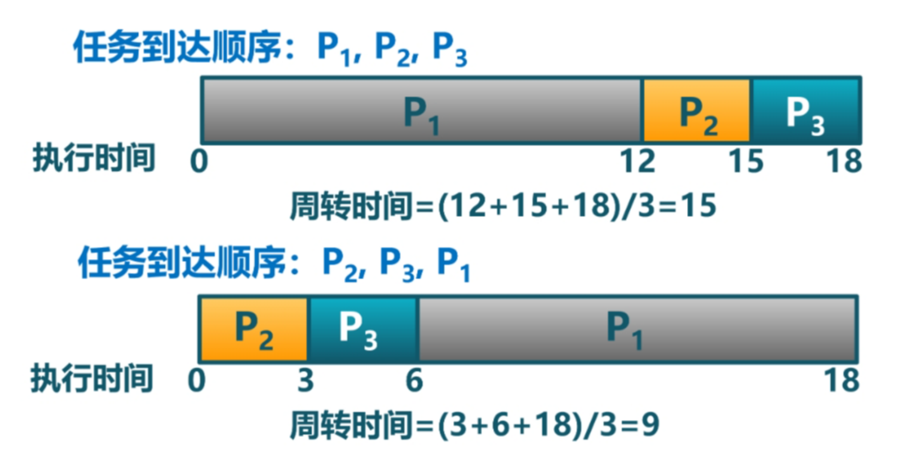

該調度策略的優點是簡單，容易實現。對於滿足1~5約束條件的執行環境，用這個調度策略的平均週轉時間性能指標也很好。如果在一個在較長的時間段內，每個進程都能結束，那麼公平性這個指標也是能得到保證的。

操作系統不會主動打斷進程的運行。

最短作業優先
~~~~~~~~~~~~~~~~~~~~~~~~~~~~~~~~~~

滿足1~5的約束條件的執行環境太簡化和理想化了，在實際系統中，每個應用的執行時間很可能不同，所以約束條件2“每個進程的執行時間相同”就不合適了。如果把約束條件2改為 "每個進程的執行時間不同"，那麼在採用先來先服務調度策略的系統中，可能就會出現短進程不得不等長進程結束後才能運行的現象，導致短進程的等待時間太長，且系統的平均週轉時間也變長了。

假設有兩個進程PA、PB，它們大致同時到達，但PA稍微快一點，進程PA執行時間為100，進程PB的執行時間為20。如果操作系統採用先來先服務的調度策略，進程的平均週轉時間為：

    (100+120)/2 = 110

但如果操作系統先調度進程PB，那麼進程的平均週轉時間為：

    (20+120)/2 = 70

可以看到，如果採用先來先服務調度策略，執行時間短的進程（簡稱短進程）可被排在執行時間長的進程（長進程）後面，導致進程的平均週轉時間變長。    

為應對短進程不得不等長進程結束後才能運行的問題，我們可以想到一個調度的方法：優先讓短進程執行。這就是最短作業優先（Shortest Job First，簡稱SJF）調度策略。其實上面讓PB先執行的調度方法，就是採用了最短作業優先策略。

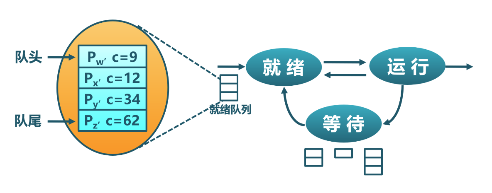

在更新約束條件2的前提下，如果我們把平均週轉時間作為唯一的性能指標，那麼SJF是一個最優調度算法。這可以用數學方法進行證明。如果有同學感興趣，可以試試。

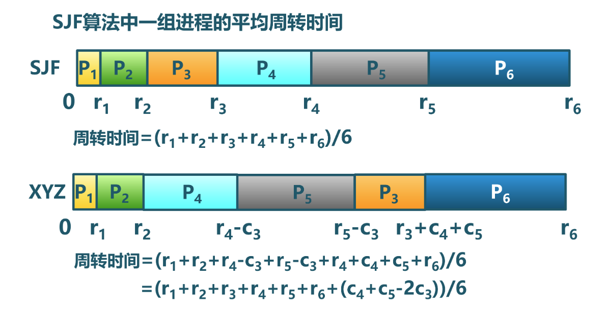

雖然SJF調度策略在理論上表現很不錯，但在具體實現中，需要對處於就緒隊列上的進程按執行時間進行排序，這會引入一定的調度執行開銷。而且如果進一步放寬約束，貼近實際情況，SJF就會顯現出它的不足。如果我們放寬約束條件1：

1. 每個進程可以在不同時間到達。

那麼可能會發生一種情況，當前正在運行的進程還需 k 執行時間才能完成，這時來了一個執行時間為 h 的進程，且 h < K ，但根據約束條件5，操作系統不能強制切換正在運行的進程。所以，在這種情況下，最短作業優先的含義就不是那麼確切了，而且在理論上，SJF也就不是最優調度算法了。

例如，操作系統採用SJF調度策略（不支持搶佔進程），有兩個進程，PA在時間0到達，執行時間為100， PB在時間20到達，執行時間為20，那麼週轉時間為 

  (100 -0) + (120-20) = 200

平均週轉時間為 100 。

交互式系統的調度
----------------------------------

交互式系統是指支持人機交互和各種I/O交互的計算機系統。可搶佔任務執行的分時多任務操作系統對人機交互性和I/O及時響應更加友好，對進程特徵的約束條件進一步放寬，進程的 **可搶佔特性** 需要我們重新思考如何調度。

約束條件
~~~~~~~~~~~~~~~~~~~~~~~~~~~~~~~~~~

交互式系統中的進程有如下一些約束/前提條件：

1. 每個進程可不同時間到達。
2. 每個進程的執行時間不同。
3. 進程的執行時間是已知的。
4. 進程在整個執行過程期間會執行I/O操作。
5. 進程在執行過程中會被搶佔。

相對於批處理操作系統，約束條件4發生了變化，這意味著在進程執行過程中，操作系統不能忽視其I/O操作。約束條件5也發生了改變，即進程可以被操作系統隨時打斷和搶佔。

性能指標
~~~~~~~~~~~~~~~~~~~~~~~~~~~~~~~~~~

操作系統支持任務/進程被搶佔的一個重要目標是提高用戶的交互性體驗和減少I/O響應時間。用戶希望計算機系統能及時響應他發出的I/O請求（如鍵盤、鼠標等），但平均週轉時間這個性能指標不足以反映人機交互或I/O響應的性能。所以，我們需要定義新的性能指標 -- 響應時間（response time）：

.. math::

    T_{\text{response time}} = T_{\text{first execution}} - T_{\text{arrival}}

而對應的平均響應時間（average response time）是：

.. math::

   T_{\text{average response time}} = T_{\text{response time}} / \text{number of ready processes}

例如，操作系統採用SJF調度策略（不支持搶佔進程），有兩個進程，PA在時間0到達，執行時間為100， PB在時間20到達，執行時間為20，那麼PA的響應時間為0，PB為80，平均響應時間為 40 。

最短完成時間優先（STCF）
~~~~~~~~~~~~~~~~~~~~~~~~~~~~~~~~~~

由於約束條件5表示了操作系統允許搶佔，那麼我們就可以實現一種支持進程搶佔的改進型SJF調度策略，即最短完成時間優先（Shortest Time to Complet First）調度策略。

基於前述的例子，操作系統採用STCF調度策略，有兩個進程，PA在時間0到達，執行時間為100， PB在時間20到達，執行時間為20，那麼週轉時間為 

  （120 - 0) + (40 - 20) = 140

平均週轉時間為 70 。可以看到，如果採用STCF調度策略，相比於SJF調度策略，在週轉時間這個性能指標上得到了改善。

但對於響應時間而言，可能就不這麼好了。考慮一個例子，有兩個用戶發出了執行兩個進程的請求，且兩個進程大約同時到達，PA和PB的執行時間都為20。我們發現，無論操作系統採用FIFO/SJF/STCF中的哪一種調度策略，某一個用戶不得不等待20個時間單位後，才能讓他的進程開始執行，這是一個非常不好的交互體驗。從性能指標上看，響應時間比較差。
這就引入了新的問題：操作系統如何支持看重響應時間這一指標的應用程序？

基於時間片的輪轉
~~~~~~~~~~~~~~~~~~~~~~~~~~~~~~~~~~

如果操作系統分給每個運行的進程的運行時間是一個足夠小的時間片（time slice，quantum），時間片一到，就搶佔當前進程並切換到另外一個進程執行。這樣進程以時間片為單位輪流佔用處理器執行。對於交互式進程而言，就有比較大的機會在較短的時間內執行，從而有助於減少響應時間。這種調度策略稱為輪轉（Round-Robin，簡稱RR）調度，即基本思路就是從就緒隊列頭取出一個進程，讓它運行一個時間片，然後把它放回到隊列尾，再從隊列頭取下一個進程執行，週而復始。

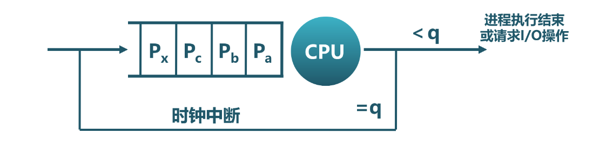

在具體實現上，需要考慮時間片的大小，一般時間片的大小會設置為時鐘中斷的時間間隔的整數倍。比如，時鐘中斷間隔為1ms，時間片可設置為10ms，兩個用戶發出了執行兩個進程的請求，且兩個進程大約同時到達，PA和PB的執行時間都為20s(即20,000ms)。如果採用輪轉調度，那麼進程的響應時間為:

    0+10 = 10ms

平均響應時間為：
    
    (0+10)/2 = 5ms

這兩個值都遠小於採用之前介紹的三種調度策略的結果。 這看起來不錯，而且，直觀上可以進一步發現，如果我們進一步減少時間片的大小，那麼採用輪轉調度策略會得到更好的響應時間。但其實這是有潛在問題的，因為每次進程切換是有切換代價的，參考之前介紹的進程切換的實現，可以看到，進程切換涉及多個寄存器的保存和回覆操作，頁表的切換操作等。如果進程切換的時間開銷是0.5ms，時間片設置為1ms，那麼會有大約50%的時間用於進程切換，這樣進程實際的整體執行時間就大大減少了。所以，我們需要通過在響應時間和進程切換開銷之間進行權衡。不能把時間片設置得太小，且讓響應時間在用戶可以接受的範圍內。

看來輪轉調度對於響應時間這個指標很友好。但如果用戶也要考慮週轉時間這個指標，那輪轉調度就變得不行了。還是上面的例子，我們可以看到，PA和PB兩個進程幾乎都在40s左右才結束，這意味著平均週轉時間為：

    (40+40)/2 = 40s

這大於基於SJF的平均週轉時間：

    ((20-0) + (40-0))/2 = 30s

如果活躍進程的數量增加，我們會發現輪轉調度的平均週轉時間會進一步加強。也許有同學會說，那我們可以通過調整時間片，把時間片拉長，這樣就會減少平均週轉時間了。但這樣又會把響應時間也給增大了。而且如果把時間片無限拉長，輪轉調度就變成了FCFS調度了。

到目前為止，我們看到以SJF為代表的調度策略對週轉時間這個性能指標很友好，而以輪轉調度為代表的調度策略對響應時間這個性能指標很友好。但魚和熊掌難以兼得。

通用計算機系統的調度
----------------------------------

個人計算機和互聯網的發展推動了計算機的廣泛使用，並出現了新的特點，內存越來越大，各種I/O設備成為計算機系統的基本配置，一般用戶經常和隨時使用交互式應用（如字處理、上網等），駐留在內存中的應用越來越多，應用的啟動時間和執行時間無法提前知道。而且很多情況下，處理器大部分時間處於空閒狀態，在等待用戶或其它各種外設的輸入輸出操作。

約束條件
~~~~~~~~~~~~~~~~~~~~~~~~~~~~~~~~~~

這樣，我們的約束條件也隨之發生了新的變化：

1. 每個進程可不同時間到達。
2. 每個進程的執行時間不同。
3. 進程的啟動時間和執行時間是未知的。
4. 進程在整個執行過程期間會執行I/O操作。
5. 進程在執行過程中會被搶佔。

可以看到，其中的第3點改變了，導致進程的特點也發生了變化。有些進程為I/O密集型的進程，大多數時間用於等待外設I/O操作的完成，需要進程能及時響應。有些進程是CPU密集型的，大部分時間佔用處理器進行各種計算，不需要及時響應。還有一類混合型特點的進程，它在不同的執行階段有I/O密集型或CPU密集型的特點。這使得我們的調度策略需要能夠根據進程的動態運行狀態進行調整，以應對各種複雜的情況。

性能指標
~~~~~~~~~~~~~~~~~~~~~~~~~~~~~~~~~~

如果把各個進程運行時間的公平性考慮也作為性能指標，那麼我們就需要定義何為公平。我們先給出一個公平的描述性定義：在一個時間段內，操作系統對每個個處於就緒狀態的進程均勻分配佔用處理器的時間。

這裡需要注意，為了提高一個性能指標，可能會以犧牲其他性能指標作為代價。所以，調度策略需要綜合考慮和權衡各個性能指標。在其中找到一個折衷或者平衡。

多級反饋隊列調度
~~~~~~~~~~~~~~~~~~~~~~~~~~~~~~~~~~

在無法提前知道進程執行時間的前提下，如何設計一個能同時減少響應時間和週轉時間的調度策略是一個挑戰。不過計算機科學家早就對此進行深入分析並提出了了解決方案。在1962年，MIT的計算機系教授Fernando Jose Corbato(1990年圖靈獎獲得者)首次提出多級反饋隊列（Multi-level Feedback Queue，簡稱MLFQ）調度策略，並用於當時的CTSS（兼容時分共享系統）操作系統中。

.. chyyuu Fernando Jose Corbato  https://baike.baidu.com/item/%E8%B4%B9%E5%B0%94%E5%8D%97%E5%A4%9A%C2%B7%E4%BD%95%E5%A1%9E%C2%B7%E7%A7%91%E5%B0%94%E5%B7%B4%E6%89%98/23620625

Corbato教授的思路很巧妙，用四個字來總結，就是 **以史為鑑** 。即根據進程過去一段的執行特徵來預測其未來一段時間的執行情況，並以此假設為依據來動態設置進程的優先級，調度子系統選擇優先級最高的進程執行。這裡可以看出，進程有了優先級的屬性，而且進程的優先級是可以根據過去行為的反饋來動態調整的，不同優先級的進程位於不同的就緒隊列中。

接下來，我們逐步深入分析多級反饋隊列調度的設計思想。

固定優先級的多級無反饋隊列
^^^^^^^^^^^^^^^^^^^^^^^^^^^^^^^^^^

MLFQ調度策略的關鍵在於如何設置優先級。一旦設置好進程的優先級，MLFQ總是優先執行位於高優先級就緒隊列中的進程。對於掛在同一優先級就緒隊列中的進程，採用輪轉調度策略。

先考慮簡單情況下，如果我們提前知道某些進程是I/O密集型的，某些進程是CPU密集型的，那麼我們可以給I/O密集型設置高優先級，而CPU密集型進程設置低優先級。這樣就緒隊列就變成了兩個，一個包含I/O密集型進程的高優先級隊列，一個是處理器密集型的低優先級隊列。

那我們如何調度呢？MLFQ調度策略是先查看高優先級隊列中是否有就緒進程，如果有，就執行它，然後基於時間片進行輪轉。由於位於此高優先級隊列中的進程都是I/O密集型進程，所以它們很快就會處於阻塞狀態，等待I/O設備的操作完成，這就會導致高優先級隊列中沒有就緒進程。

在高優先級隊列沒有就緒進程的情況下，MLFQ調度策略就會從低優先級隊列中選擇CPU密集型就緒進程，同樣按照時間片輪轉的方式進行調度。如果在CPU密集型進程執行過程中，某個I/O密集型進程所等待的I/O設備的操作完成了，那麼操作系統會打斷CPU密集型進程的執行，以及時響應該中斷，並讓此I/O密集型進程從阻塞狀態變成就緒態，重新接入到高優先級隊列的尾部。這時調度子系統會優先選擇高優先級隊列中的進程執行，從而搶佔了CPU密集型進程的執行。

這樣，我們就得到了MLFQ的基本設計規則：

1. 如果進程PA的優先級 > PB的優先級，搶佔並運行PA。
2. 如果進程PA的優先級 = PB的優先級，輪轉運行PA和PB。

但還是有些假設過於簡單化了，比如：

1. 通常情況下，操作系統並不能提前知道進程是I/O密集型還是CPU密集型的。
2. I/O密集型進程的密集程度不一定一樣，所以把它們放在一個高優先級隊列中體現不出差異。
3. 進程在不同的執行階段會有不同的特徵，可能前一階段是I/O密集型，後一階段又變成了CPU密集型。

而在進程執行過程中固定進程的優先級，將難以應對上述情況。

可降低優先級的多級反饋隊列
^^^^^^^^^^^^^^^^^^^^^^^^^^^^^^^^^^

改進的MLFQ調度策略需要感知進程的過去執行特徵，並根據這種特徵來預測進程的未來特徵。簡單地說，就是如果進程在過去一段時間是I/O密集型特徵，就調高進程的優先級；如果進程在過去一段時間是CPU密集型特徵，就降低進程的優先級。
由於會動態調整進程的優先級，所以，操作系統首先需要以優先級的數量來建立多個隊列。當然這個數量是一個經驗值，比如Linux操作系統設置了140個優先級。

那如何動態調整進程的優先級呢？首先，我們假設新創建的進程是I/O密集型的，可以把它設置為最高優先級。接下來根據它的執行表現來調整其優先級。如果在分配給它的時間配額內，它睡眠或等待I/O事件完成而主動放棄了處理器，操作系統預測它接下來的時間配額階段很大可能還是具有I/O密集型特徵，所以就保持其優先級不變。如果進程用完了分配給它的時間配額，操作系統預測它接下來有很大可能還是具有CPU密集型特徵，就會降低其優先級。
這裡的時間配額的具體值是一個經驗值，一般是時間片的整數倍。

這樣，如果一個進程的執行時間小於分配給它的一個或幾個時間配額，我們把這樣的進程稱為短進程。那麼這個短進程會以比較高的優先級迅速地結束。而如果一個進程有大量的I/O操作，那麼一般情況下，它會在時間配額結束前主動放棄處理器，進入等待狀態，一旦被喚醒，會以原有的高優先級繼續執行。如果一個進程的執行時間遠大於幾個時間配額，我們把這樣的進程稱為長進程。那麼這個長進程經過一段時間後，會處於優先級最底部的隊列，只有在沒有高優先級進程就緒的情況下，它才會繼續執行，從而不會影響交互式進程的響應時間。

這樣，我們進一步擴展了MLFQ的基本規則：

3. 創建進程並讓進程首次進入就緒隊列時，設置進程的優先級為最高優先級。
4. 進程用完其時間配額後，就會降低其優先級。

雖然這樣的調度看起來對短進程、I/O密集型進程或長進程的支持都還不錯。但這樣的調度只有降低優先級的操作，對於某些情況還是會應對不足。比如：

1. 一個進程先執行了一段比較長時間的CPU密集型任務，導致它到了底部優先級隊列，然後它在下一階段執行I/O密集型任務，但被其他高優先級任務阻擋了，難以減少響應時間。
2. 在計算機系統中有大量的交互型進程，雖然每個進程執行時間短，但它們還是會持續地佔用處理器，追導致位於低優先級的長進程一直無法執行，出現飢餓（starvation）現象。

這主要是調度策略還缺少提升優先級的靈活規則。

可提升/降低優先級的多級反饋隊列
^^^^^^^^^^^^^^^^^^^^^^^^^^^^^^^^^^

對於可降低優先級的多級反饋隊列調度策略難以解決的上述情況1和2，我們需要考慮如何提升某些進程的優先級。一個可以簡單實現的優化思路是，每過一段時間，週期性地把所有進程的優先級都設置為最高優先級。這樣長進程不會餓死；而被降到最低優先級的進程，如果當前處於I/O密集型任務，至少在一段時間後，會重新減少其響應時間。不過這個“一段時間”的具體值如何設置？看起來又是一個經驗值。這樣，我們又擴展了MLFQ的基本規則。

5. 經過一段時間，把所有就緒進程重新加入最高優先級隊列。

但這樣就徹底解決問題了嗎？其實還不夠，比如對於優先級低且處於I/O密集型任務的進程，必須等待一段時間後，才能重新加入到最高優先級，才能減少響應時間。難道這樣的進程不能不用等待一段時間嗎？

而對於長進程，如果有不少長進程位於最低優先級，一下子把它們都提升為最高優先級，就可能影響本來處於最高優先級的交互式進程的響應時間。看來，第5條規則還有進一步改進的空間，提升優先級的方法可以更靈活一些。

先看長進程，可以發現，所謂長進程“飢餓”，是指它有很長時間沒有得到執行了。如果我們能夠統計其在就緒態沒有被執行的等待時間長度，就可以基於這個動態變量來逐步提升其優先級。比如每過一段時間，查看就緒進程的等待時間（進程在就緒態的等待時間）長度，讓其等待時間長度與其優先級成反比，從而能夠逐步第動態提升長進程的優先級。

再看優先級低且處於I/O密集型任務的進程，可以發現，它也有很長時間沒有得到執行的特點，這可以通過上面的逐步提升優先級的方法獲得執行的機會，並在執行I/O操作並處於等待狀態，但此時的優先級還不夠高。但操作系統在I/O操作完成的中斷處理過程中，統計其I/O等待時間（進程在阻塞態下的等待時間），該進程的I/O等待時間越長，那麼其優先級的提升度就越高，這可以使其儘快到達最高優先級。

這樣根據就緒等待時間和阻塞等待時間來提升進程的優先級，可以比較好第應對上面的問題。我們可以改進第5條規則：

5. 定期統計進程在就緒態/阻塞態的等待時間，等待時間越長，其優先級的提升度就越高。

對於就緒態等待時間對應的優先級提升度一般時小於阻塞態等待時間對應的優先級提升度，從而讓調度策略優先調度當前具有I/O密集型任務的進程。

經過我們總結出來的MLFQ調度規則，使得操作系統不需要對進程的運行方式有先驗知識，而是通過觀測和統計進程的運行特徵來給出對應的優先級，使得操作系統能靈活支持各種運行特徵的應用在計算機系統中高效執行。

公平份額調度
~~~~~~~~~~~~~~~~~~~~~~~~~~~~~~~~~~

在大公司的數據中心中有著大量的計算機服務器，給互聯網上的人們提供各種各樣的服務。在這樣的服務器中，有著相對個人計算機而言更加巨大的內存和強大的計算處理能力，給不同用戶提供服務的各種進程的數量也越來越多。這個時候，面向用戶或進程相對的公平性就是不得不考慮的一個問題，甚至時要優先考慮的性能指標。比如，在提供雲主機的數據中心中，用戶可能會希望分配20%的處理器時間給Windows虛擬機，80%的處理器時間給Linux系統，如果採用公平份額調度的方式可以更簡單高效。

從某種程度上看，MLFQ調度策略總提到的優先級就是對公平性的一種劃分方式，有些進程優先級高，會更快地得到處理器執行，所分配到的處理器時間也多一些。但MLFQ並不是把公平性放在第一位。如果把公平性放在首位，我們就可以設計出另外一類調度策略 -- 公平份額（Fair Share，又稱為 比例份額，Proportional Share）調度。其基本思路是基於每個進程的重要性（即優先級）的比例關係，分配給該進程同比例的處理器執行時間。

.. chyyuu https://waldspurger.org/carl/research.html  
   Carl A. Waldspurger and William E. Weihl. Stride Scheduling: Deterministic Proportional-Share Resource Mangement, Technical Memorandum MIT/LCS/TM-528, MIT Laboratory for Computer Science, June 1995. PDF.
   Carl A. Waldspurger and William E. Weihl. Lottery Scheduling: Flexible Proportional-Share Resource Mangement, Proceedings of the First Symposium on Operating Systems Design and Implementation (OSDI '94), pages 1-11, Monterey, California, November 1994. Received award for best paper. PDF, Slides.

   https://www.researchgate.net/profile/William-Weihl

在1993~1994年，MIT的計算機系博士生Carl A. Waldspurger 和他的導師 William E. Weihl提出了與眾不同的調度策略：彩票調度（Lottery Scheduling）和步長調度（Stride Scheduling）。它們都屬於公平份額調度策略。彩票調度很有意思，它是從經濟學的的彩票行為中吸取營養，模擬了購買彩票和中獎的隨機性，給每個進程發彩票，進程優先級越高，所得到的彩票就越多；然後每隔一段時間（如，一個時間片），舉行一次彩票抽獎，抽出來的號屬於哪個進程，哪個進程就能運行。

例如，計算機系統中有兩個進程PA和PB，優先級分別為2和8，這樣它們分別擁有2張（編號為0-1）和8張彩票（編號為2-9），按照彩票調度策略，操作系統會分配PA大約20%的處理器時間，而PB會分配到大約80%的處理器時間。

其具體實現過程是，在每個時間片到時，操作系統就抽取彩票，由於操作系統已知總彩票數有10張，所以操作系統產生一個從0和9之間隨機數作為獲獎彩票號，擁有這個彩票號的進程中獎，並獲得下一次處理器執行機會。通過在一段較長的時間內不斷地抽彩票，基於統計學，可以保證兩個兩個進程可以獲得與優先級等比例的處理器執行時間。

這個彩票調度的優勢有兩點，第一點是可以解決飢餓問題，即使某個低優先級進程獲得的彩票比較少，但經過比較長的時間，按照概率，會有獲得處理器執行的時間片。第二點是調度策略的實現開銷小，因為它不像之前的調度策略，還需要記錄、統計、排序、查找歷史信息（如統計就緒態等待時間等），彩票調度幾乎不需要記錄任何歷史信息，只需生產一個隨機數，然後查找該隨機數應該屬於那個進程即可。

但彩票調度雖然想法新穎，但有一個問題：如何為進程分配彩票？如果創建進程的用戶清楚進程的優先級，並給進程分配對應比例的彩票，那麼看起來這個問題就解決了。但彩票調度是在運行時的某個時刻產生一個隨機值，並看這個隨機值屬於當前正在運行中的進程集合中的哪一個進程。而用戶無法預知，未來的這個時刻，他創建的進程與當時的那些進程之間的優先級相對關係，這會導致公平性不一定能得到保證。

另外一個問題是，基於概率的操作方法的隨機性會帶來不確定性，特別是在一個比較短的時間段裡面，進程間的優先級比例關係與它們獲得的處理器執行時間的比例關係之間有比較大的偏差，只有在執行時間很長的情況下，它們得到的處理器執行時間比例會比較接近優先級比例。

.. note::

   能否用彩票來表示各種計算機資源的份額？

   彩票調度中的彩票表示了進程所佔處理器時間的相對比例，那麼能否用彩票來表示進程佔用內存或其他資源的相對比例？

為了解決彩票調度策略中的偶然出現不準確的進程執行時間比例的問題。Waldspurger等進一步提出了步長調度（Stride Scheduling）。這是一個確定性的公平配額調度策略。其基本思路是：每個進程有一個步長（Stride）屬性值，這個值與進程優先級成反比，操作系統會定期記錄每個進程的總步長，即行程（pass），並選擇擁有最小行程值的進程運行。

例如，計算機系統中有兩個進程PA和PB幾乎同時到達，優先級分別為2和8，用一個預設的大整數（如1000）去除以優先級，就可獲得對應的步長，這樣它們的步長分別是500和125在具體執行時，先選擇PA執行，它在執行了一個時間片後，其行程為500；在接下來的4個時間片，將選擇執行行程少的PB執行，它在連續執行執行4個時間片後，其形成也達到了500；並這樣週而復始地執行下去，直到進程執行結束。，按照步長調度調度策略，操作系統會分配PA大約20%的處理器時間，而PB會分配到大約80%的處理器時間。

比較一下這兩種調度策略，可以看出彩票調度算法只能在一段比較長的時間後，基於概率上實現優先級等比的時間分配，而步長調度算法可以在每個調度週期後做到準確的優先級等比的時間分配。但彩票算法的優勢是幾乎不需要全局信息，這在合理處理新加入的進程時很精煉。比如一個新進程開始執行時，按照步長調度策略，其行程值為0，那麼該進程將在一段比較長的時間內一直佔用處理器執行，這就有點不公平了。如果要設置一個合理的進程值，就需要全局地統計每個進程的行程值，這就帶來了比較大的執行開銷。但彩票調度策略不需要統計每個進程的彩票數，只需用新進程的票數更新全局的總票數即可。

實時計算機系統的調度
----------------------------------

計算機系統的應用領域非常廣泛，如機器人、物聯網、軍事、工業控制等。在這些領域中，要求計算機系統能夠實時響應，如果採用上述調度方式，不能滿足這些需求，這對操作系統提出了新的挑戰。

這裡，我們首先需要理解實時的含義。實時計算機系統通常可以分為硬實時（Hard Real Time）和軟實時（Soft Real Time）兩類，硬實時是指任務完成時間必須在絕對的截止時間內，如果超過意味著錯誤和失敗，可能導致嚴重後果。軟實時是指任務完成時間儘量在絕對的截止時間內，偶爾超過可以接受。

實時的任務是由一組進程來實現，其中每個進程的行為是可預測和提前確定的。這些進程稱為實時進程，它們的執行時間一般較短。支持實時任務的操作系統稱為實時操作系統。

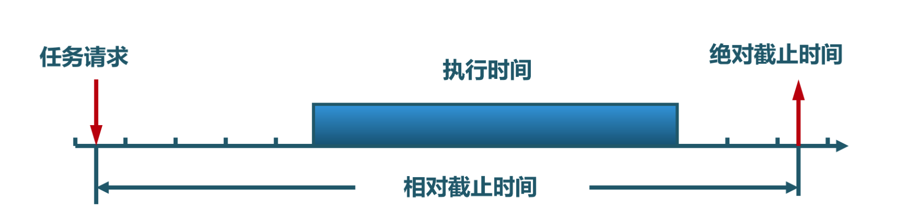

約束條件
~~~~~~~~~~~~~~~~~~~~~~~~~~~~~~~~~~

實時計算機系統是一種以確定的時間範圍起到主導作用的計算機系統，一旦外設發給計算機一個事件（如時鐘中斷、網絡包到達等），計算機必須在一個確定時間範圍內做出響應。

實時計算機系統中的事件可以按照響應方式進一步分類為週期性（以規則的時間間隔發生）事件或非週期性（發生時間不可預知）事件。一個系統可能要響應多個週期性事件流。根據每個事件需要處理時間的長短，系統甚至有可能無法處理完所有的事件。

這樣，實時計算機系統的約束條件也隨之發生了新的變化：

1. 每個進程可不同時間到達。
2. 每個進程的執行時間不同。
3. 進程的啟動時間和執行時間是未知的。
4. 進程在整個執行過程期間會執行I/O操作。
5. 進程在執行過程中會被搶佔。
6. 進程的行為是可預測和提前確定的，即進程在獨佔處理器的情況下，執行時間的上限是可以提前確定的。
7. 觸發進程運行的事件需要進程實時響應，即進程要在指定的絕對截止時間內完成對各種事件的處理。

這裡主要增加了第6和7點。第6點說明了實時進程的特點，第7點說明了操作系統調度的特點。

性能指標
~~~~~~~~~~~~~~~~~~~~~~~~~~~~~~~~~~

對於實時計算機系統而言，進程的週轉時間快和響應時間低這樣的性能指標並不是最主要的，進程要在指定的絕對的截止時間內完成是第一要務。這裡首先需要理解實時計算機系統的可調度性。如果有m個週期事件，事件i以週期時間Pi 發生，並需要Ci 時間處理一個事件，那麼計算機系統可以處理任務量（也稱負載）的條件是：

        SUM(Ci/Pi) <= 1

能滿足這個條件的實時計算機系統是可實時調度的。

滿足這個條件的實時系統稱為是可調度的。例如，一個具有兩個週期性事件的計算機系統，其事件週期分別是20ms、80ms。如果這些事件分別需要10ms、20ms來進行處理，那麼該計算機系統是可實時調度的，因為

  (10/20)+ (20/80) = 0.75 ＜ 1

如果再增加第三個週期事件，其週期是100ms，需要50ms的時間來處理，我們可以看到：

  (10/20)+ (20/80) + (50/100) = 1.25 > 1

這說明該計算機系統是不可實時調度的。

實時計算機系統的調度策略/算法可以是靜態或動態的。靜態調度在進程開始運行之前就作出調度決策；而動態調度要在運行過程中進行調度決策。只有在預知進程要所完成的工作時間上限以及必須滿足的截止時間等全部信息時，靜態調度才能工作；而動態調度則不需要這些前提條件。

速率單調調度
~~~~~~~~~~~~~~~~~~~~~~~~~~~~~~~~~~

.. chyyuu Liu C L , Layland J W . Scheduling Algorithms for Multiprogramming in a Hard-Real-Time Environment[J]. Journal of the ACM, 1973, 20(1):46-61.
   https://internethalloffame.org/about/advisory-board/cl-liu  C.L. Liu Professor, National Tsing Hua University | Taiwan  劉炯朗教授(Chung Laung Liu) 門生中還有圖靈獎唯一華人得主姚期智院士。
   http://en.wikipedia.org/wiki/Chung_Laung_Liu  其於1973年發表在Journal of the ACM的論文“Scheduling Algorithms for Multiprogramming in a Hard-Real-Time Environment”，至今已被引用超過12491次(至2020年為止)，影響極大。

速率單調調度（Rate Monotonic Scheduling，RMS）算法是由劉炯朗（Chung Laung Liu）教授和James W. Layland在1973年提出的。該算法的基本思想是根據進程響應事件的執行週期的長短來設定進程的優先級，即執行週期越短的進程優先級越高。操作系統在調度過程中，選擇優先級最高的就緒進程執行，高優先級的進程會搶佔低優先級的進程。

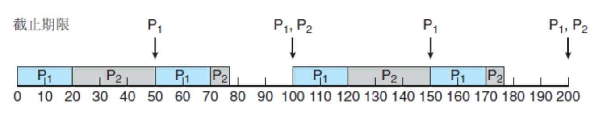

該調度算法有如下的前提假設：

1. 每個週期性進程必須在其執行週期內完成，以完成對週期性事件的響應。
2. 進程執行不依賴於任何其他進程。
3. 進程的優先級在執行前就被確定，執行期間不變。
4. 進程可被搶佔。

可以看出，RMS調度算法在每個進程執行前就分配給進程一個固定的優先級，優先級等比於進程所響應的事件發生的週期頻率，即進程優先級與進程執行的速率（單位時間內運行進程的次數）成線性關係，這正是為什麼將其稱為速率單調的原因。例如，必須每20ms運行一次（每秒要執行50次）的進程的優先級為50，必須每50ms運行一次（每秒20次）的進程的優先級為20。Liu和Layland證明了在靜態實時調度算法中，RMS是最優的。

.. chyyuu 最優的含義是？？？???

任務執行中間既不接收新的進程，也不進行優先級的調整或進行CPU搶佔。因此這種算法的優點是系統消耗小，缺點是不靈活。一旦該系統的任務決定了，就不能再接收新的任務。

採用搶佔的、靜態優先級的策略，調度週期性任務。

.. chyyuu 最好給個實際運行的例子

EDF調度
~~~~~~~~~~~~~~~~~~~~~~~~~~~~~~~~~~

另一個典型的實時調度算法是最早截止時間優先（Earliest Deadline First，EDF）算法，其基本思想是根據進程的截止時間來確定任務的優先級。截止時間越早，其優先級就越高。如果進程的截止期相同，則處理時間短的進程優先級高。操作系統在調度過程中，選擇優先級最高的就緒進程執行，高優先級的進程會搶佔低優先級的進程。

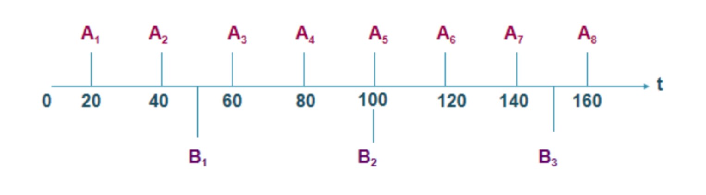

該調度算法有如下的前提假設：

1. 進程可以是週期性或非週期性的。
2. 進程執行不依賴於任何其他進程。
3. 進程的優先級在執行過程中會基於進程的截止期動態變化。
4. 進程可被搶佔。

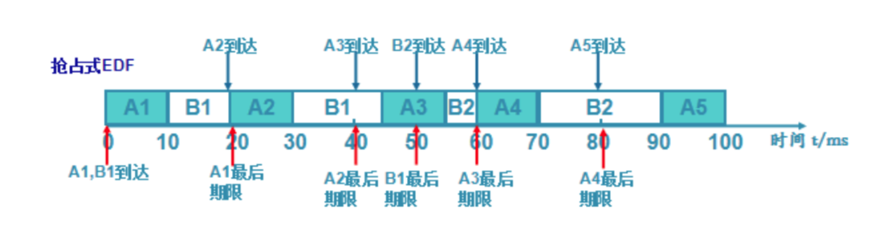

EDF調度算法按照進程的截止時間的早晚來分配優先級，截止時間越近的進程優先級越高。操作系統在進行進程調度時，會根據各個進程的截止時間重新計算進程優先級，並選擇優先級最高的進程執行，即操作系統總是優先運行最緊迫的進程。在不同時刻，兩個週期性進程的截止時間的早晚關係可能會變化，所以EDF調度算法是一種動態優先級調度算法。

實時調度實例
~~~~~~~~~~~~~~~~~~~~~~~~~~~~~~~~~~

系統中有三個週期性進程PA、PB和PC，它們在一開始就處於就緒狀態，它們的執行週期分別是20ms、50ms和100ms，它們響應事件的處理時間分別為5ms、20ms和25ms。操作系統需要考慮如何調度PA、PB和PC，以確保它們在週期性的截止時間（最終時限，即當前執行週期的絕對時間）到來前都能完成各自的任務。

我們先分析一下系統的可調度性：

   (5/20) + (20/50) + (25/100)= 0.25+0.4 + 0.25 = 0.9 < 1

可以看到處理器在理論上有10%的空閒時間，不會被超額執行，所以找到一個合理的調度應該是可能的。我們首先看看RMS調度算法，由於進程的優先級只與進程的執行週期成線性關係，所以三個進程的優先級分別為50、20和10。對於RMS調度算法而言，具有如下的調度執行過程：

.. chyyuu 畫個執行的圖???？？？

- t=0：在t=0時刻，優先級最高的PA先執行（PA的第一個週期開始），並在5ms時完成；
- t=5：在PA完成後，PB接著執行；
- t=20：在執行到20ms時（PA的第二個週期開始），PA搶佔PB並再次執行，直到25m時結束；
- t=25：然後被打斷的PB繼續執行，直到30ms時結束；
- t=30：接著PC開始執行（PC的第一個週期開始）；
- t=40：在執行到40ms時（PA的第三個週期開始），PA搶佔PC並再次執行，直到45ms結束；
- t=45：然後被打斷的PC繼續執行；
- t=50：然後在50ms時（PB的第二個週期），PB搶佔PC並再次執行；
- t=60：然後在60ms時（PA的第四個週期開始），PA搶佔PB並再次執行，直到65ms時結束；
- t=65：接著PB繼續執行，並在80ms時結束；
- t=80：接著PA繼續搶佔PC（PA的第五個週期開始），在85ms時結束；
- t=85：然後PC再次執行，在90ms時結束。

這樣，在100ms的時間內，PA執行了5個週期任務，PB執行了2個週期任務，PC執行了1個週期任務。在下一個100ms的時間內，上述過程再次重複。

對於EDF調度算法而言，具有如下的調度執行過程：

- t=0：首先選擇截止時間最短的PA，所以它先執行（PA的第一個週期開始），並在5ms時完成；
- t=5：在PA完成後，截止時間第二的PB接著執行；
- t=20：在執行到20ms時（PA的第二個週期開始），PA截止時間40ms小於PB截止時間50ms，所以搶佔PB並再次執行，直到25m時結束；
- t=25：然後被打斷的PB繼續執行，直到30ms時結束；
- t=30：接著PC開始執行（PC的第一個週期開始）；
- t=40：在執行到40ms時（PA的第三個週期開始），PA截止時間40ms小於PC截止時間100ms，PA搶佔PC並再次執行，直到45ms結束；
- t=45：然後被打斷的PC繼續執行；
- t=50：然後在50ms時（PB的第二個週期），PB截止時間100ms小於等於PC截止時間100ms，PB搶佔PC並再次執行；
- t=60：然後在60ms時（PA的第四個週期開始），PA截止時間80ms小於PB截止時間100ms，PA搶佔PB並再次執行，直到65ms時結束；
- t=65：接著PB繼續執行，並在80ms時結束；
- t=80：接著PA截止時間100ms小於等於PC截止時間100ms，PA繼續搶佔PC（PA的第五個週期開始），在85ms時結束；
- t=85：然後PC再次執行，在90ms時結束。

上述例子的一個有趣的現象是，雖然RMS調度算法與EDF的調度策略不同，但它們的調度過程是一樣的。注意，這不是普遍現象，也有一些例子會出現二者調度過程不同的情況，甚至RMS調度無法滿足進程的時限要求，而EDF能滿足進程的時限要求。同學們能舉出這樣的例子嗎？

多處理器計算機系統的調度
----------------------------------

在2000年前，多處理器計算機的典型代表是少見的高端服務器和超級計算機，但到了2000年後，單靠提高處理器的頻率越來越困難，而芯片的集成度還在進一步提升，所以在一個芯片上集成多個處理器核成為一種自然的選擇。到目前位置，在個人計算機、以手機為代表的移動終端上，多核處理器（Multi Core）已成為一種普遍的現象，多個處理器核能夠並行執行，且可以共享Cache和內存。

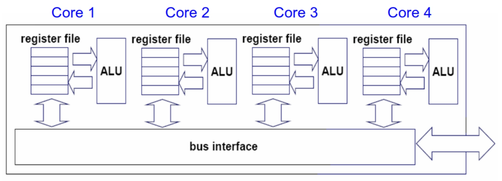

之前提到的調度策略/算法都是面向單處理器的，如果把這些策略和算法擴展到多處理器環境下，是否需要解決新問題？

.. note::

    並行處理需要了解更多的硬件並行架構問題和軟件的同步互斥等技術，而深入的硬件並行架構目前不在本書的範疇之內，同步互斥等技術在後續章節才介紹。按道理需要先學習這些內容才能真正和深入理解本小節的內容，但本小節的內容在邏輯上都屬於進程調度的範疇，所以就放在這裡了。建議可以先大致學習本小節內容，在掌握了進程間通信、同步互斥等技術後，再回頭重新學習一些本小節內容。

約束條件
~~~~~~~~~~~~~~~~~~~~~~~~~~~~~~~~~~

為了理解多處理器調度需要解決的新問題，我們需要理解單處理器計算機與多處理器計算機的基本區別。對於多處理器計算機而言，每個處理器核心會有共享的Cache，也會有它們私有的Cache，而各自的私有Cache中的數據有硬件來保證數據的Cache一致性（也稱緩存一致性）。

.. chyyuu 畫一個圖，說明多核處理器結構

簡單地說，位於不同私有Cache中的有效數據（是某一內存單元的值）要保證是相同的，這樣處理器才能取得正確的數據，保證計算的正確性，這就是Cache一致性的基本含義。保證一致性的控制邏輯是由硬件來完成的，對操作系統和應用程序而言，是透明的。

在共享Cache和內存層面，由於多個處理器可以並行訪問位於共享Cache和內存中的共享數據，所以需要有後面章節講解的同步互斥機制來保證程序執行的正確性。這裡，我們僅僅介紹一下簡單的思路。

以給創建的新子進程設置進程號為例。在單處理器情況下，操作系統用一個整型全局變量保存當前可用進程號，初始值為 0 。給新進程設置新進程號的過程很簡單：

1. 新進程號= 當前可用進程號；
2. 當前可用進程號 = 當前可用進程號 + 1；

在多處理器情況下，假設兩個位於不同處理器上的進程都發起了創建子進程的系統調用請求，操作系統可以並行地執行創建兩個子進程，而且需要給子進程設置一個新的進程號。如果沒有一些同步互斥的手段，那麼可能出現如下的情況：

t0: ID-PA = CurID      ID-PB= CurID
t1: CurID = CurID+1    CurID = CurID +1

這樣兩個新進程的進程號就是一樣的了，這就會在後續的執行中出現各種問題。為了正確處理共享變量，就需要用類似互斥鎖（Mutex）的方法，讓在不同處理器上執行的控制流互斥地訪問共享變量，這樣就能解決正確性問題。

所以，對於多處理器下運行的進程而言，新增加了如下的假設條件：

1. 運行在不同處理器上的多個進程可用並行執行，但對於共享資源/變量的處理，需要有同步互斥等機制的正確性保證。

性能指標
~~~~~~~~~~~~~~~~~~~~~~~~~~~~~~~~~~

這裡的性能指標與之前描述的基於單處理器的通用計算機系統一樣，主要是週轉時間、響應時間和公平性。

單隊列調度
~~~~~~~~~~~~~~~~~~~~~~~~~~~~~~~~~~

對於多處理器系統而言，兩個進程數量多於處理器個數，我們希望每個處理器都執行進程。這一點是之前單處理器調度不會碰到的情況。單處理器的調度只需不斷地解答：“接下來應該運行哪個進程？”，而在多處理機中，調度還需解答一個問題：“要運行的進程在哪一個CPU上運行？”。這就增加了調度的複雜性。

如果我們直接使用單處理器調度的數據結構，其中的重點就是放置就緒進程的就緒隊列或其他與調度相關的數據結構。那麼這些數據結構就是需要互斥訪問的共享數據。 為簡化分析過程，我們以輪轉調度採用的單就緒隊列為例，面向多處理器的單隊列調度的策略邏輯沒有改變，只是在讀寫/修改就緒隊列等共享數據時，需要用同步互斥的一些操作保護起來，確保對這些共享數據訪問的正確性。

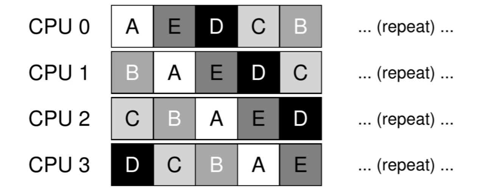

採用單隊列調度的一個好處是，它支持自動負載平衡，因為決不會出現一個CPU空閒而其他CPU過載的情況。

**處理器親和性**

另外，還需考慮的一個性能問題是調度中的處理器親和性（也稱緩存親和性、調度親和性）問題。其基本思想是，儘量使一個進程在它前一次運行過的同一個CPU上運行。其原因是，現代的處理器都有私有Cache，基於局部性的考慮，如果操作系統在下次調度時要給該進程選擇處理器，會優先選擇該進程上次執行所在的處理器，從而使得Cache中緩存的數據可重用，提高了進程執行的局部性。

多隊列調度
~~~~~~~~~~~~~~~~~~~~~~~~~~~~~~~~~~

如果處理器的個數較多，頻繁對共享數據執行同步互斥操作的開銷會很大。為此，能想到的一個方法是，還是保持單處理器調度策略的基本邏輯，但把就緒隊列或和他與調度相關的數據結構按處理器個數複製多份，這樣操作系統在絕大多數情況下，只需訪問本處理器綁定的調度相關數據結構，就可用完成調度操作。這樣在一個調度控制框架下就包含多個調度隊列。當要把一個新進程或被喚醒的進程放入就緒隊列時，操作系統可根據一些啟發式方法（如隨機選擇某個處理器上的就緒隊列或選擇就緒進程數量最少的就緒隊列）來放置進程到某個就緒隊列。操作系統通過訪問本處理器上的調度相關數據結構，就可以選擇出要執行的進程，這樣就避免了開銷大的同步互斥操作。

多隊列調度比單隊列調度具有更好的可擴展性，多隊列的數量會隨著處理器的增加而增加，也具有良好的緩存親和度。當多隊列調度也有它自己的問題：負載均衡（Load Balance）問題。

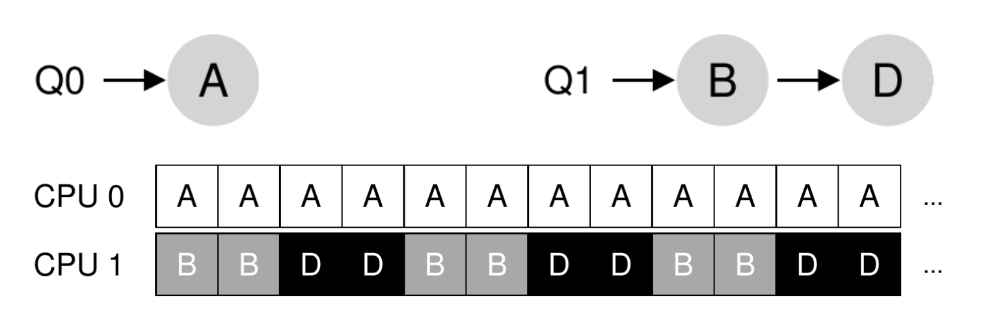

考慮如下的例子，在一個有4個進程，兩個處理器的計算機系統中，有兩個就緒隊列，PA和PB在就緒隊列Q1，PC和PD在就緒隊列Q2，如果採用基於輪轉調度的多隊列調度，那麼兩個處理器可以均勻地讓4給進程分時使用處理器。這是一種理想的情況。如果進程PB結束，而調度不進行進一步的干預，那麼就會出現PA獨佔處理器1，PC和PD分時共享處理器2。如果PA也結束了，而調度還不進行進一步的干預，那麼（Load Imbalance）就會出現處理器1空閒，而處理器2繁忙的情況，這就是典型的負載不均衡（Load Imbalance）的現象了。這就沒有達到輪轉調度的意圖。

所以多隊列調度需要解決負載不均衡的問題。一個簡單的思路就是允許進程根據處理器的負載情況從一個處理器遷移到另外一個處理器上。對於上面的例子，如果是處理器1空閒，處理器2繁忙的而情況，操作系統只需把處理器2上的進程分一半，遷移到處理器1即可。當如果是處理器1上運行了PA，處理器2上運行了PC和PD，這就需要統計每個進程的執行時間，根據進程的執行時間，讓進程在兩個處理器間不停的遷移，達到在一定時間段內，每個進程所佔用的處理器時間大致相同，這就達到了輪轉調度的意圖，並達到了負載均衡。具體處理有多種方式，比如如下方式調度：

    處理器1： A A C A A C ...
    處理器2： C D D C D D ...

或者是：

    處理器1： A C A A C A ...
    處理器2： C D D C D D ...

當然，這個例子是一種簡單的理想情況，實際的多處理器計算機系統中運行的進程行為會很複雜，除了並行執行，還有同步互斥執行、各種I/O操作等，這些都會對調度策略產生影響。

小結
----------------------------------

本節對多種類型的計算機系統和不同類型的應用特徵進行了分析，並給出了不同的性能指標，這些都是設計調度策略/算法的前提條件。我們給出了從簡單到複雜的多種調度策略和算法，這些策略和方法相對於實際的操作系統而言，還很簡單，不夠實用，但其中的基本思想是一致的。如果同學們需要了解實際的操作系統調度策略和算法，建議閱讀關於UNIX、Linux、Windows和各種RTOS等操作系統內核的書籍和文章，其中有關於這些操作系統的調度策略和算法的深入講解。
