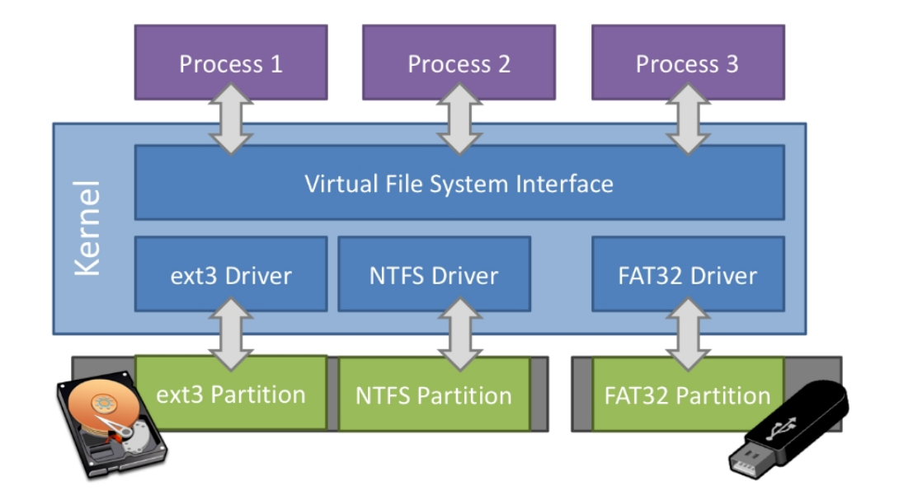

文件系統接口
=================================================

本節導讀
-------------------------------------------------

本節首先以Linux 上的常規文件和目錄為例，站在訪問文件的應用的角度，介紹文件中值得注意的地方及文件使用方法。由於 Linux 上的文件系統模型還是比較複雜，在內核實現中對它進行了很大程度的簡化，我們會對簡化的具體情形進行介紹。最後介紹內核上應用的開發者應該如何使用我們簡化後的文件系統和一些相關知識。

文件和目錄
-------------------------------------------------

常規文件
+++++++++++++++++++++++++++++++++++++++++++++++++

在操作系統的用戶看來，常規文件是保存在持久存儲設備上的一個字節序列，每個常規文件都有一個 **文件名** (Filename) ，用戶需要通過它來區分不同的常規文件。方便起見，在下面的描述中，“文件”有可能指的是常規文件、目錄，也可能是之前提到的若干種進程可以讀寫的 標準輸出、標準輸入、管道等I/O 資源，請同學自行根據上下文判斷取哪種含義。

在 Linux 系統上， ``stat`` 工具可以獲取文件的一些信息。下面以我們項目中的一個源代碼文件 ``os/src/main.rs`` 為例：

.. code-block:: console

    $ cd os/src/
    $ stat main.rs
    File: main.rs
    Size: 940       	Blocks: 8          IO Block: 4096   regular file
    Device: 801h/2049d	Inode: 4975        Links: 1
    Access: (0644/-rw-r--r--)  Uid: ( 1000/   oslab)   Gid: ( 1000/   oslab)
    Access: 2021-02-28 23:32:50.289925450 +0800
    Modify: 2021-02-28 23:32:50.133927136 +0800
    Change: 2021-02-28 23:32:50.133927136 +0800
    Birth: -

``stat`` 工具展示了 ``main.rs`` 的如下信息：

- File 表明它的文件名為 ``main.rs`` 。
- Size 表明它的字節大小為 940 字節。
- Blocks 表明它佔據 8 個 **塊** (Block) 來存儲。在文件系統中，文件的數據以塊為單位進行存儲。在 IO Block 可以看出，在 Linux操作系統中的Ext4文件系統的每個塊的大小為 4096 字節。
- regular file 表明這個文件是一個常規文件。事實上，其他類型的文件也可以通過文件名來進行訪問。
- 當文件是一個特殊文件（如塊設備文件或者字符設備文件）的時候，Device 將指出該特殊文件的 major/minor ID 。對於一個常規文件，我們無需關心它。
- Inode 表示文件的底層編號。在文件系統的底層實現中，並不是直接通過文件名來索引文件，而是首先需要將文件名轉化為文件的底層編號，再根據這個編號去索引文件。目前我們無需關心這一信息。
- Links 給出文件的硬鏈接數。同一個文件系統中如果兩個文件（目錄也是文件）具有相同的inode號碼，那麼就稱它們是“硬鏈接”關係。這樣links的值其實是一個文件的不同文件名的數量。（本章的練習需要你在文件系統中實現硬鏈接！）
- Uid 給出該文件的所屬的用戶 ID ， Gid 給出該文件所屬的用戶組 ID 。Access 的其中一種表示是一個長度為 10 的字符串（這裡是 ``-rw-r--r--`` ），其中第 1 位給出該文件的類型，這個文件是一個常規文件，因此這第 1 位為 ``-`` 。後面的 9 位可以分為三組，分別表示該文件的所有者/在該文件所屬的用戶組內的其他用戶以及剩下的所有用戶能夠讀取/寫入/將該文件作為一個可執行文件來執行。
- Access/Modify 分別給出該文件的最近一次訪問/最近一次修改時間。

如果我們使用 ``stat`` 工具查看一個能在我們內核上執行的 ELF 可執行文件：

.. code-block:: console

    $ cd user/target/riscv64gc-unknown-none-elf/release/
    $ stat user_shell
    File: user_shell
    Size: 85712     	Blocks: 168        IO Block: 4096   regular file
    Device: 801h/2049d	Inode: 1460936     Links: 2
    Access: (0755/-rwxr-xr-x)  Uid: ( 1000/   oslab)   Gid: ( 1000/   oslab)
    Access: 2021-03-01 11:21:34.785309066 +0800
    Modify: 2021-03-01 11:21:32.829332116 +0800
    Change: 2021-03-01 11:21:32.833332069 +0800
    Birth: -

從中可以看出我們構建的應用體積大概在數十 KiB 量級。它的 Access 指出所有用戶均可將其作為一個可執行文件在當前 OS 中加載並執行。然而這僅僅是能夠通過權限檢查而已，這個應用只有在我們自己的內核上才能真正被加載運行。

用戶常常通過文件的 **拓展名** (Filename extension) 來推斷該文件的用途，如 ``main.rs`` 的拓展名是 ``.rs`` ，我們由此知道它是一個 Rust 源代碼文件。但從內核的角度來看，它會將所有文件無差別的看成一個字節序列，文件內容的結構和含義則是交給對應的應用進行解析。

目錄
+++++++++++++++++++++++++++++++++++++++++++++++++

最早的文件系統僅僅通過文件名來區分文件，但是這會造成一些歸檔和管理上的困難。如今我們的使用習慣是將文件根據功能、屬性的不同分類歸檔到不同層級的目錄之下。這樣我們就很容易逐級找到想要的文件。結合用戶和用戶組的概念，目錄的存在也使得文件訪問權限控制更加容易，只需要對於目錄進行設置就可以間接設置用戶/用戶組對該目錄下所有文件的訪問權限，這使得操作系統能夠更加安全的支持多用戶情況下對不同文件的訪問。

同樣可以通過 ``stat`` 工具獲取目錄的一些信息：

.. code-block:: console

    $ stat os
    File: os
    Size: 4096      	Blocks: 8          IO Block: 4096   directory
    Device: 801h/2049d	Inode: 4982        Links: 5
    Access: (0755/drwxr-xr-x)  Uid: ( 1000/   oslab)   Gid: ( 1000/   oslab)
    Access: 2021-02-28 23:32:50.133927136 +0800
    Modify: 2021-02-28 23:32:50.129927180 +0800
    Change: 2021-02-28 23:32:50.129927180 +0800
    Birth: -

directory 表明 ``os`` 是一個目錄，從 Access 字符串的首位 ``d`` 也可以看出這一點。對於目錄而言， Access 的 ``rwx`` 含義有所不同：

- ``r`` 表示是否允許獲取該目錄下有哪些文件和子目錄；
- ``w`` 表示是否允許在該目錄下創建/刪除文件和子目錄；
- ``x`` 表示是否允許“通過”該目錄。

Blocks 給出 ``os`` 目錄也佔用 8 個塊進行存儲。實際上目錄也可以看作一種文件，它也有屬於自己的底層編號，它的內容中保存著若干 **目錄項** (Dirent, Directory Entry) ，可以看成一組映射，根據它下面的文件名或子目錄名能夠查到文件和子目錄在文件系統中的底層編號，即 Inode 編號。但是與常規文件不同的是，用戶無法 **直接** 修改目錄的內容，只能通過創建/刪除它下面的文件或子目錄才能間接做到這一點。

有了目錄之後，我們就可以將所有的文件和目錄組織為一種被稱為 **目錄樹** (Directory Tree) 的有根樹結構（不考慮軟鏈接）。樹中的每個節點都是一個文件或目錄，一個目錄下面的所有的文件和子目錄都是它的孩子。可以看出所有的文件都是目錄樹的葉子節點。目錄樹的根節點也是一個目錄，它被稱為 **根目錄** (Root Directory)。目錄樹中的每個目錄和文件都可以用它的 **絕對路徑** (Absolute Path) 來進行索引和定位。絕對路徑是目錄樹上的根節點到待索引的目錄和文件所在的節點之間自上而下的路徑。此路徑上的所有節點(文件或目錄)兩兩之間加上路徑分隔符拼接就可得到絕對路徑名。例如，在 Linux 上，根目錄的絕對路徑是 ``/`` ，路徑分隔符也是 ``/`` ，因此：

- ``main.rs`` 的絕對路徑是 ``/home/oslab/workspace/v3/rCore-Tutorial-v3/os/src/main.rs`` ；
- ``os`` 目錄的絕對路徑則是 ``/home/oslab/workspace/v3/rCore-Tutorial-v3/os/`` 。

上面的絕對路徑因具體環境而異。
一般情況下，絕對路徑都很長，用起來頗為不便。而且，在日常使用中，我們通常固定在一個工作目錄下而不會頻繁切換目錄。因此更為常用的是 **相對路徑** (Relative Path) 而非絕對路徑。每個進程都會記錄自己當前所在的工作目錄（Current Working Directory, CWD），當它在索引文件或目錄的時候，如果傳給它的路徑並未以 ``/`` 開頭，則會被內核認為是一個相對於進程當前工作目錄的相對路徑。這個路徑會被拼接在進程當前路徑的後面組成一個絕對路徑，實際索引的是這個絕對路徑對應的文件或目錄。其中， ``./`` 表示當前目錄，而 ``../`` 表示當前目錄的父目錄，這在通過相對路徑進行索引的時候非常實用。在使用終端的時候，執行 ``pwd`` 命令可以打印終端進程當前所在的目錄，而通過 ``cd`` 可以切換終端進程的工作目錄。

一旦引入目錄之後，我們就不再單純的通過文件名來索引文件，而是通過路徑（絕對或相對）進行索引。在文件系統的底層實現中，也是對應的先將路徑轉化為一個文件或目錄的底層編號，然後再通過這個編號具體索引文件或目錄。將路徑轉化為底層編號的過程是逐級進行的，對於絕對路徑的情況，需要從根目錄出發，每次根據當前目錄底層編號獲取到它的內容，根據下一級子目錄的目錄名查到該子目錄的底層編號，然後從該子目錄繼續向下遍歷，依此類推。在這個過程目錄的權限控制位將會起到保護作用，阻止無權限用戶進行訪問。

.. note::

    **目錄是否有必要存在**

    基於路徑的索引難以並行或分佈式化，因為我們總是需要查到一級目錄的底層編號才能查到下一級，這是一個天然串行的過程。在一些性能需求極高的環境中，可以考慮弱化目錄的權限控制職能，將目錄樹結構扁平化，將文件系統的磁盤佈局變為類鍵值對存儲。

文件系統
+++++++++++++++++++++++++++++++++++++++++++++++++

常規文件和目錄都是實際保存在持久存儲設備中的。持久存儲設備僅支持以扇區（或塊）為單位的隨機讀寫，這和上面介紹的通過路徑即可索引到文件並以字節流進行讀寫的用戶視角有很大的不同。負責中間轉換的便是 **文件系統** (File System) 。具體而言，文件系統負責將邏輯上的目錄樹結構（包括其中每個文件或目錄的數據和其他信息）映射到持久存儲設備上，決定設備上的每個扇區應存儲哪些內容。反過來，文件系統也可以從持久存儲設備還原出邏輯上的目錄樹結構。

文件系統有很多種不同的實現，每一種都能將同一個邏輯上目錄樹結構轉化為一個不同的持久存儲設備上的扇區佈局。最著名的文件系統有 Windows 上的 FAT/NTFS 和 Linux 上的 Ext3/Ext4/Btrfs 等。

在一個計算機系統中，可以同時包含多個持久存儲設備，它們上面的數據可能是以不同文件系統格式存儲的。為了能夠對它們進行統一管理，在內核中有一層 **虛擬文件系統** (VFS, Virtual File System) ，它規定了邏輯上目錄樹結構的通用格式及相關操作的抽象接口，只要不同的底層文件系統均實現虛擬文件系統要求的那些抽象接口，再加上 **掛載** (Mount) 等方式，這些持久存儲設備上的不同文件系統便可以用一個統一的邏輯目錄樹結構一併進行管理。

.. _fs-simplification:

簡化的文件與目錄抽象
-------------------------------------------------

我們的內核實現對於目錄樹結構進行了很大程度上的簡化，這樣做的目的是為了能夠完整地展示文件系統的工作原理，但代碼量又不至於太多。我們進行的簡化如下：

- 扁平化：僅存在根目錄 ``/`` 一個目錄，剩下所有的文件都放在根目錄內。在索引一個文件的時候，我們直接使用文件的文件名而不是它含有 ``/`` 的絕對路徑。
- 權限控制：我們不設置用戶和用戶組概念，全程只有單用戶。同時根目錄和其他文件也都沒有權限控制位，即完全不限制文件的訪問方式，不會區分文件是否可執行。
- 不記錄文件訪問/修改的任何時間戳。
- 不支持軟硬鏈接。
- 除了下面即將介紹的系統調用之外，其他的很多文件系統相關係統調用均未實現。

.. image:: simple-file-and-dir.png
   :align: center
   :scale: 70 %
   :name: Simple File and Directory
   :alt: 簡化的文件和目錄示意圖

打開、關閉與讀寫文件的系統調用
--------------------------------------------------

.. _sys-open:

文件打開
++++++++++++++++++++++++++++++++++++++++++++++++++

在讀寫一個常規文件之前，應用首先需要通過內核提供的 ``sys_open`` 系統調用讓該文件在進程的文件描述符表中佔一項，並得到操作系統的返回值--文件描述符，即文件關聯的表項在文件描述表中的索引值：

.. code-block:: rust

    /// 功能：打開一個常規文件，並返回可以訪問它的文件描述符。
    /// 參數：path 描述要打開的文件的文件名（簡單起見，文件系統不需要支持目錄，所有的文件都放在根目錄 / 下），
    /// flags 描述打開文件的標誌，具體含義下面給出。
    /// 返回值：如果出現了錯誤則返回 -1，否則返回打開常規文件的文件描述符。可能的錯誤原因是：文件不存在。
    /// syscall ID：56
    fn sys_open(path: &str, flags: u32) -> isize

目前我們的內核支持以下幾種標誌（多種不同標誌可能共存）：

- 如果 ``flags`` 為 0，則表示以只讀模式 *RDONLY* 打開；
- 如果 ``flags`` 第 0 位被設置（0x001），表示以只寫模式 *WRONLY* 打開；
- 如果 ``flags`` 第 1 位被設置（0x002），表示既可讀又可寫 *RDWR* ；
- 如果 ``flags`` 第 9 位被設置（0x200），表示允許創建文件 *CREATE* ，在找不到該文件的時候應創建文件；如果該文件已經存在則應該將該文件的大小歸零；
- 如果 ``flags`` 第 10 位被設置（0x400），則在打開文件的時候應該清空文件的內容並將該文件的大小歸零，也即 *TRUNC* 。

注意 ``flags`` 裡面的權限設置只能控制進程對本次打開的文件的訪問。一般情況下，在打開文件的時候首先需要經過文件系統的權限檢查，比如一個文件自身不允許寫入，那麼進程自然也就不能以 *WRONLY* 或 *RDWR* 標誌打開文件。但在我們簡化版的文件系統中文件不進行權限設置，這一步就可以繞過。

在用戶庫 ``user_lib`` 中，我們將該系統調用封裝為 ``open`` 接口：

.. code-block:: rust

    // user/src/lib.rs

    bitflags! {
        pub struct OpenFlags: u32 {
            const RDONLY = 0;
            const WRONLY = 1 << 0;
            const RDWR = 1 << 1;
            const CREATE = 1 << 9;
            const TRUNC = 1 << 10;
        }
    }

    pub fn open(path: &str, flags: OpenFlags) -> isize {
        sys_open(path, flags.bits)
    }

藉助 ``bitflags!`` 宏我們將一個 ``u32`` 的 flags 包裝為一個 ``OpenFlags`` 結構體更易使用，它的 ``bits`` 字段可以將自身轉回 ``u32`` ，它也會被傳給 ``sys_open``。

.. code-block:: rust

    // user/src/syscall.rs

    const SYSCALL_OPEN: usize = 56;

    pub fn sys_open(path: &str, flags: u32) -> isize {
        syscall(SYSCALL_OPEN, [path.as_ptr() as usize, flags as usize, 0])
    }

``sys_open`` 傳給內核的參數只有待打開文件的文件名字符串的起始地址（和之前一樣，我們需要保證該字符串以 ``\0`` 結尾）還有標誌位。由於每個通用寄存器為 64 位，我們需要先將 ``u32`` 的 ``flags`` 轉換為 ``usize`` 。

.. _sys-close:

文件關閉
++++++++++++++++++++++++++++++++++++++++++++++++++

在打開文件，對文件完成了讀寫操作後，還需要關閉文件，這樣才讓進程釋放被這個文件佔用的內核資源。 ``close`` 的調用參數是文件描述符，當文件被關閉後，該文件在內核中的資源會被釋放，文件描述符會被回收。這樣，進程就不能繼續使用該文件描述符進行文件讀寫了。

.. code-block:: rust

    /// 功能：當前進程關閉一個文件。
    /// 參數：fd 表示要關閉的文件的文件描述符。
    /// 返回值：如果成功關閉則返回 0 ，否則返回 -1 。可能的出錯原因：傳入的文件描述符並不對應一個打開的文件。

    // usr/src/lib.rs
    pub fn close(fd: usize) -> isize { sys_close(fd) }
    
    // user/src/syscall.rs
    const SYSCALL_CLOSE: usize = 57;

    pub fn sys_close(fd: usize) -> isize {
        syscall(SYSCALL_CLOSE, [fd, 0, 0])
    }

文件的順序讀寫
++++++++++++++++++++++++++++++++++++++++++++++++++

在打開一個文件之後，我們就可以用之前的 ``sys_read/sys_write`` 兩個系統調用來對它進行讀寫了。需要注意的是，常規文件的讀寫模式和之前介紹過的幾種文件有所不同。標準輸入輸出和匿名管道都屬於一種流式讀寫，而常規文件則是順序讀寫和隨機讀寫的結合。由於常規文件可以看成一段字節序列，我們應該能夠隨意讀寫它的任一段區間的數據，即隨機讀寫。然而用戶僅僅通過 ``sys_read/sys_write`` 兩個系統調用不能做到這一點。

事實上，進程為每個它打開的常規文件維護了一個偏移量，在剛打開時初始值一般為 0 字節。當 ``sys_read/sys_write`` 的時候，將會從文件字節序列偏移量的位置開始 **順序** 把數據讀到應用緩衝區/從應用緩衝區寫入數據。操作完成之後，偏移量向後移動讀取/寫入的實際字節數。這意味著，下次 ``sys_read/sys_write`` 將會從剛剛讀取/寫入之後的位置繼續。如果僅使用 ``sys_read/sys_write`` 的話，則只能從頭到尾順序對文件進行讀寫。當我們需要從頭開始重新寫入或讀取的話，只能通過 ``sys_close`` 關閉並重新打開文件來將偏移量重置為 0。為了解決這種問題，有另一個系統調用 ``sys_lseek`` 可以調整進程打開的一個常規文件的偏移量，這樣便能對文件進行隨機讀寫。在本教程中並未實現這個系統調用，因為對於目前實驗中的應用例子，順序文件讀寫功能就已經足夠滿足需求了。順帶一提，在文件系統的底層實現中都是對文件進行隨機讀寫的。
 
.. _filetest-simple:

下面我們從本章的測試用例 ``filetest_simple`` 來介紹文件系統接口的使用方法：

.. code-block:: rust
    :linenos:

    // user/src/bin/filetest_simple.rs

    #![no_std]
    #![no_main]

    #[macro_use]
    extern crate user_lib;

    use user_lib::{
        open,
        close,
        read,
        write,
        OpenFlags,
    };

    #[no_mangle]
    pub fn main() -> i32 {
        let test_str = "Hello, world!";
        let filea = "filea\0";
        let fd = open(filea, OpenFlags::CREATE | OpenFlags::WRONLY);
        assert!(fd > 0);
        let fd = fd as usize;
        write(fd, test_str.as_bytes());
        close(fd);

        let fd = open(filea, OpenFlags::RDONLY);
        assert!(fd > 0);
        let fd = fd as usize;
        let mut buffer = [0u8; 100];
        let read_len = read(fd, &mut buffer) as usize;
        close(fd);

        assert_eq!(
            test_str,
            core::str::from_utf8(&buffer[..read_len]).unwrap(),
        );
        println!("file_test passed!");
        0
    }

- 第 20~25 行，我們打開文件 ``filea`` ，向其中寫入字符串 ``Hello, world!`` 而後關閉文件。這裡需要注意的是我們需要為字符串字面量手動加上 ``\0`` 作為結尾。在打開文件時 *CREATE* 標誌使得如果 ``filea`` 原本不存在，文件系統會自動創建一個同名文件，如果已經存在的話則會清空它的內容。而 *WRONLY* 使得此次只能寫入該文件而不能讀取。
- 第 27~32 行，我們以只讀 *RDONLY* 的方式將文件 ``filea`` 的內容讀取到緩衝區 ``buffer`` 中。注意我們很清楚 ``filea`` 的總大小不超過緩衝區的大小，因此通過單次 ``read`` 即可將 ``filea`` 的內容全部讀取出來。而更常見的情況是需要進行多次 ``read`` 直到它的返回值為 0 才能確認文件的內容已被讀取完畢了。
- 最後的第 34~38 行我們確認從 ``filea`` 讀取到的內容和之前寫入的一致，則測試通過。

.. chyyuu 測試的具體操作？？