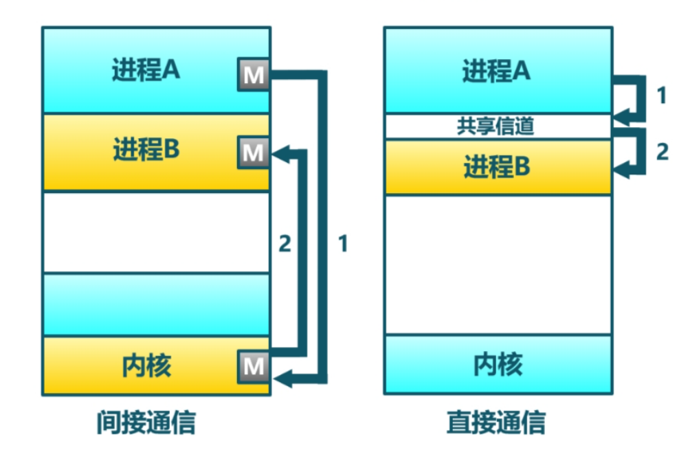

引言
=========================================

本章導讀
-----------------------------------------

在前面章節中，我們引入了非常重要的進程的概念，且實現的“傷齒龍”操作系統支持應用的動態創建進程和交互能力。這涉及到與進程管理相關的 ``fork`` 、 ``exec`` 等創建新進程相關的系統調用。同時，我們進一步引入了文件的抽象，使得進程能夠通過一個統一的接口來讀寫內核管理的持久存儲設備，這樣數據可以方便地被長久保存。

截止到目前為止，進程在輸入和輸出方面，還有不少限制，特別是進程能夠進行交互的 I/O 資源還非常有限，只能接受用戶在鍵盤上的輸入，並將字符輸出到屏幕上。我們一般將它們分別稱為 **標準** 輸入和 **標準** 輸出。更讓應用開發者覺得束手束腳的是：進程被操作系統徹底隔離了。進程間無法方便地“溝通”，導致進程不能一起協作幹“大事”。如果能讓不同進程實現數據共享與交互，就能把不同程序的功能組合在一起，實現更加強大和靈活的功能。為了讓簡單的應用程序能夠組合在一起形成各種強大和複雜的功能，本章要完成的操作系統的核心目標是： **讓不同應用通過進程間通信的方式組合在一起運行** 。

其實在 **UNIX** 的早期發展歷史中，也碰到了同樣的問題，每個程序專注在完成一件事情上，但缺少把多個程序聯合在一起完成複雜功能的機制。直到1975年UNIX v6中引入了讓人眼前一亮的創新機制-- **I/O重定向** 與 **管道（pipe）** 。基於這兩種機制，操作系統在不用改變應用程序的情況下，可以將一個程序的輸出重新定向到另外一個程序的輸入中，這樣程序之間就可以進行任意的連接，並組合出各種靈活的複雜功能。

.. chyyuu 可以介紹pipe ???
   https://en.wikipedia.org/wiki/Pipeline_(Unix)
   Brian Kernighan, UNIX: A History and a Memoir, 2020 

.. note::

   管道（pipe）可能是 UNIX 中最引人注目的發明

   管道的概念來自貝爾實驗室的Douglas McIlroy，他在1964年寫的一份內部文件中，提出了把多個程序“像花園水管一樣”串連並擰在一起的想法，這樣數據就可以在不同程序中流動。大約在1972年下半年，Ken Thompson在聽了Douglas McIlroy關於管道的嘮叨後，靈機一動，迅速把管道機制實現在UNIX中。管道是一種由操作系統提供的機制，它將一個程序的輸出連接到另一個程序的輸入。可以通過在shell程序中使用 "|" 符號來輕鬆訪問和操作管道。管道是 UNIX 最重要的貢獻之一，通過管道可以把功能單一的小程序靈活地組合起來實現各種複雜的功能，從而讓UNIX的簡單功能哲學（一次把一件事情做好）和複雜系統能力（通過基於管道的排列組合形成複雜能力）有機地融合在一起。

本章我們將引入新操作系統概念 -- **管道** ，並進行實現，以支持進程間的I/O重定向功能，即讓一個進程的輸出成為另外一個進程的輸入，從而讓進程間能夠有效地合作起來。除了鍵盤和屏幕這樣的 **標準** 輸入和 **標準** 輸出之外，管道其實也可以看成是一種特殊的輸入和輸出，而前面講解的 **文件系統** 中的對持久化存儲數據的抽象 **文件(file)** 也是一種存儲設備的輸入和輸出。所以，我們可以把這三種輸入輸出都統一在 **文件(file)**  這個抽象之中。這也體現了在 UNIX 操作系統中“ **一切皆文件** ” (Everything is a file) 的重要設計哲學。

.. note::

    **一切皆文件** 

    在UNIX經典論文《The UNIX TimeSharing System》中，裡奇和湯普森就提出了“一切皆文件”的樸素思想，這個思想或多或少地受到了Multics操作系統的影響。UNIX將普通文件、設備和虛擬的資源（比如管道等）通過目錄統一在了一個遞歸的樹形結構中。形成了一個統一的命名空間。UNIX文件系統是一個掛載在ROOT的樹形目錄結構，每一個目錄節點都可以掛載一棵子樹。“一切皆文件”意味著這棵樹上可以掛載一切。少其實意味著多，對文件進行read和write操作，事實上可以完成 “任意” 操作。

文件這一抽象概念透明化了文件、I/O設備之間的差異，因為在進程看來無論是標準輸出還是常規文件都是一種文件，可以通過同樣的接口來讀寫。這不但可以統一對設備的訪問方式，且讓應用與外設之間的交互進行了解耦，簡化了應用的開發，更進一步支持進程間通信，實現了應用功能的組合擴展。這就是文件的強大之處。

.. chyyuu 
   在本章中提前引入 **文件** 這個概念，但本章不會詳細講解，只是先以最簡單直白的方式對 **文件** 這個抽象進行簡化的設計與實現。站在本章的操作系統的角度來看， **文件** 成為了一種需要操作系統管理的I/O資源。 

為了讓應用能夠基於 **文件** 這個抽象接口對不同I/O設備或I/O資源進行操作，我們就需要對 **進程** 這個概念進行擴展，讓它能夠管理 **文件** 這種抽象資源和接口。為了實現 **一切皆文件(Everything is a file)**  的UNIX設計思想，之前的進程控制塊中有一個 **文件描述符表** ，在表中保存著多個 **文件** 記錄信息。每個文件描述符是一個非負的索引值，即對應文件記錄信息的條目在文件描述符表中的索引。這個階段的文件還僅僅是指磁盤上的數據存儲。我們要對文件範圍進行擴充，從數據存儲擴大到外設、管道這樣的物理和虛擬資源。

為了統一表示 **標準** 輸入、 **標準** 輸出、管道和數據存儲等，我們把支持 ``File trait`` 定義的接口的結構都稱為文件。這樣只要 **標準** 輸入、 **標準** 輸出、管道也基於統一的 ``File trait`` 接口實現自己的打開、關閉和讀寫等文件操作，就可以讓進程來對自己進行管理了。從用戶的角度來看，應用訪問文件將很簡單，它不太需要關注文件的具體細節，只需通過文件描述符，就可以對 **文件** 進行讀寫，從而完成接收鍵盤輸入，向屏幕輸出，兩個進程之間進行數據傳輸的操作，以及對存儲設備上的數據進行讀寫。

僅僅實現文件的統一抽象和支持進程間通信的管道機制，還不夠靈活。因為這需要兩個進程之間相互“知道”它們要通信，即它們不能獨立存在。我們可以進一步擴展進程動態管理的機制，來實現獨立應用之間的I/O重定向，從而可以讓獨立的應用之間能夠靈活組合完成複雜功能。具體而言，這需要擴展與應用程序執行相關的 ``exec`` 系統調用，加入對程序運行參數的支持，並進一步改進了對shell程序自身的實現，加入對重定向符號 ``>`` 、 ``<`` 的識別和處理。這樣我們也可以像UNIX中的shell程序一樣，基於文件機制和管道機制實現靈活的I/O重定位功能，更加靈活地把獨立的應用程序組合在一起實現複雜功能。

僅僅有支持數據傳遞的管道機制還不夠便捷，進程間也需要更快捷的通知機制。而且操作系統也不僅僅是被動地接受來自進程的系統調用，它也需要有主動讓進程響應它發出的通知的需求。這些都推動了一種 ``信號（Signal）`` 的事件通知機制的誕生。

.. chyyuu  https://venam.nixers.net/blog/unix/2016/10/21/unix-signals.html  介紹signal的歷史

.. note::

   信號(Signal)可能是 UNIX 中最早實現的內核通知進程的機制

   信號從 UNIX 的第一版本就已經存在了，由於其設計實現的細節和邊界條件較多，容易出錯，所以經歷了許多次設計開發的迭代。在早期設計中，UNIX通過不同的系統調用來設置對不同類型信號的捕獲；在UNIX第二版，出現了讓用戶給進程發信號的 ``kill`` 命令；在UNIX第四版，進一步簡化了系統調用設計，可通過一個系統調用來設置對所有信號的捕獲；發展到UNIX第七版，信號的設計模型還是不夠可靠，會出現信號可能丟失的情況。在後續的BSD UNIX 4.3版和UNIX SVR3中，增加了可靠信號機制，而且BSD UNIX還擴展了 SIGUSR1 和 SIGUSR2 信號，目的是將其用於進程間傳遞特定事件，但BSD和SVF3二者並不兼容。直到POSIX.1標準的提出，才對可靠信號相關的系統調用和語義進行了標準化。

簡而言之，本章我們首先建立基於文件的統一I/O抽象，將標準輸入/標準輸出的訪問改造為基於文件描述符，然後同樣基於文件描述符實現一種父子進程之間的通信機制——管道，從而實現靈活的進程間通信，並基於文件抽象和管道支持不同的獨立進程之間的動態組合，來實現複雜功能。而且通過實現信號機制，進程和操作系統可以主動發出信號來異步地通知相關事件給其它進程。這樣就構成了具有團隊協作能力的白堊紀“迅猛龍” [#velociraptor]_ 操作系統。

實踐體驗
-----------------------------------------

獲取本章代碼：

.. code-block:: console

   $ git clone https://github.com/rcore-os/rCore-Tutorial-v3.git
   $ cd rCore-Tutorial-v3
   $ git checkout ch7

在 qemu 模擬器上運行本章代碼：

.. code-block:: console

   $ cd os
   $ make run

進入shell程序後，可以運行管道機制的簡單測例 ``pipetest`` 和比較複雜的測例 ``pipe_large_test`` 。 ``pipetest`` 需要保證父進程通過管道傳輸給子進程的字符串不會發生變化；而 ``pipe_large_test`` 中，父進程將一個長隨機字符串傳給子進程，隨後父子進程同時計算該字符串的某種 Hash 值（逐字節求和），子進程會將計算後的 Hash 值傳回父進程，而父進程接受到之後，需要驗證兩個 Hash 值相同，才算通過測試。

運行兩個測例的輸出可能如下：

.. code-block::

    >> pipetest
    Read OK, child process exited!
    pipetest passed!
    Shell: Process 2 exited with code 0
    >> pipe_large_test
    sum = 369114(parent)
    sum = 369114(child)
    Child process exited!
    pipe_large_test passed!
    Shell: Process 2 exited with code 0
    >> 

此外，在本章我們為shell程序支持了輸入/輸出重定向功能，可以將一個應用的輸出保存到一個指定的文件。例如，下面的命令可以將 ``yield`` 應用的輸出保存在文件 ``fileb`` 當中，並在應用執行完畢之後確認它的輸出：

.. code-block::

   >> yield > fileb
   Shell: Process 2 exited with code 0
   >> cat fileb
   Hello, I am process 2.
   Back in process 2, iteration 0.
   Back in process 2, iteration 1.
   Back in process 2, iteration 2.
   Back in process 2, iteration 3.
   Back in process 2, iteration 4.
   yield pass.

   Shell: Process 2 exited with code 0
   >> 

本章代碼樹
-----------------------------------------

迅猛龍操作系統 -- IPCOS的總體結構如下圖所示：

.. image:: ../../os-lectures/lec10/figs/ipc-os-detail-2.png
   :align: center
   :scale: 25 %
   :name: ipc-os-detail
   :alt: 迅猛龍操作系統 - IPC OS總體結構

通過上圖，大致可以看出迅猛龍操作系統 -- IPCOS增加了兩種通信機制，一種是交換數據的管道（Pipe）機制，另外一種是發送異步通知事件的信號（signal）機制，應用程序通過新增的管道和信號相關的系統調用可以完成進程間通信。這兩種機制所對應的資源都被進程管理，如下圖所示。

.. image:: ../../os-lectures/lec10/figs/tcb-ipc-standard-file.png
   :align: center
   :scale: 10 %
   :name: tcb-ipc-standard-file
   :alt: 進程管理的管道與信號

這裡把管道看成是一種特殊的內存文件，並在進程的打開文件表 `fd_talbe` 中被管理，而且進程通過文件讀寫系統調用就可以很方便地基於管道實現進程間的數據交換。而信號是進程管理的一種資源，發送信號的進程可以通過系統調用給接收信號的目標進程控制塊中的 `signal` 結構更新所發信號信息，操作系統再通過擴展 `trap_handler` 中從內核態返回到用戶態的處理流程， 改變了接收信號的目標進程的執行上下文，從而讓接收信號的目標進程可以優先執行處理信號事件的預設函數 `signal_handler` ，在處理完信號後，再繼續執行之前暫停的工作。

位於 ``ch7`` 分支上的迅猛龍操作系統 - IPCOS的源代碼如下所示：

.. code-block::

    ./os/src
    Rust        28 Files    2061 Lines
    Assembly     3 Files      88 Lines

    ├── bootloader
    │   └── rustsbi-qemu.bin
    ├── LICENSE
    ├── os
    │   ├── build.rs
    │   ├── Cargo.lock
    │   ├── Cargo.toml
    │   ├── Makefile
    │   └── src
    │       ├── config.rs
    │       ├── console.rs
    │       ├── entry.asm
    │       ├── fs(新增：文件系統子模塊 fs)
    │       │   ├── mod.rs(包含已經打開且可以被進程讀寫的文件的抽象 File Trait)
    │       │   ├── pipe.rs(實現了 File Trait 的第一個分支——可用來進程間通信的管道)
    │       │   └── stdio.rs(實現了 File Trait 的第二個分支——標準輸入/輸出)
    │       ├── lang_items.rs
    │       ├── link_app.S
    │       ├── linker-qemu.ld
    │       ├── loader.rs
    │       ├── main.rs
    │       ├── mm
    │       │   ├── address.rs
    │       │   ├── frame_allocator.rs
    │       │   ├── heap_allocator.rs
    │       │   ├── memory_set.rs
    │       │   ├── mod.rs
    │       │   └── page_table.rs
    │       ├── sbi.rs
    │       ├── syscall
    │       │   ├── fs.rs(修改：調整 sys_read/write 的實現，新增 sys_dup/pipe)
    │       │   ├── mod.rs(修改：調整 syscall 分發)
    │       │   └── process.rs
    │       ├── task
    │       │   ├── context.rs
    │       │   ├── manager.rs
    │       │   ├── mod.rs
    │       │   ├── pid.rs
    │       │   ├── processor.rs
    │       │   ├── switch.rs
    │       │   ├── switch.S
    │       │   └── task.rs(修改：在任務控制塊中加入文件描述符表相關機制)
    │       ├── timer.rs
    │       └── trap
    │           ├── context.rs
    │           ├── mod.rs
    │           └── trap.S
    ├── README.md
    ├── rust-toolchain
    └── user
        ├── Cargo.lock
        ├── Cargo.toml
        ├── Makefile
        └── src
            ├── bin
            │   ├── exit.rs
            │   ├── fantastic_text.rs
            │   ├── forktest2.rs
            │   ├── forktest.rs
            │   ├── forktest_simple.rs
            │   ├── forktree.rs
            │   ├── hello_world.rs
            │   ├── initproc.rs
            │   ├── matrix.rs
            │   ├── pipe_large_test.rs(新增)
            │   ├── pipetest.rs(新增)
            │   ├── run_pipe_test.rs(新增)
            │   ├── sleep.rs
            │   ├── sleep_simple.rs
            │   ├── stack_overflow.rs
            │   ├── user_shell.rs
            │   ├── usertests.rs
            │   └── yield.rs
            ├── console.rs
            ├── lang_items.rs
            ├── lib.rs(新增兩個系統調用：sys_dup/sys_pipe)
            ├── linker.ld
            └── syscall.rs(新增兩個系統調用：sys_dup/sys_pipe)

本章代碼導讀
-----------------------------------------------------             

實現迅猛龍操作系統的過程就是對各種內核數據結構和相關操作的進一步擴展的過程。這裡主要涉及到：

- 支持標準輸入/輸出文件
- 支持管道文件
- 支持對應用程序的命令行參數的解析和傳遞
- 實現標準 I/O 重定向功能
- 支持信號

**支持標準輸入/輸出文件**

到本章為止我們將支持三種文件：標準輸入輸出、管道以及在存儲設備上的常規文件和目錄文件。不同於前面章節，我們將標準輸入輸出分別抽象成 ``Stdin`` 和 ``Stdout`` 兩個類型，併為他們實現 ``File`` Trait 。在 ``TaskControlBlock::new`` 創建初始進程的時候，就默認打開了標準輸入輸出，並分別綁定到文件描述符 0 和 1 上面。

**支持管道文件**

管道 ``Pipe`` 是另一種文件，它可以用於父子進程間的單向進程間通信。我們也需要為它實現 ``File`` Trait 。 ``os/src/syscall/fs.rs`` 中的系統調用 ``sys_pipe`` 可以用來打開一個管道並返回讀端/寫端兩個文件的文件描述符。管道的具體實現在 ``os/src/fs/pipe.rs`` 中，本章第二節 :doc:`2pipe` 中給出了詳細的講解。管道機制的測試用例可以參考 ``user/src/bin`` 目錄下的 ``pipetest.rs`` 和 ``pipe_large_test.rs`` 兩個文件。

**支持對應用程序的命令行參數的解析和傳遞**

為支持獨立進程間的I/O重定向，將在本章第三節 :doc:`3cmdargs-and-redirection` 中進一步支持對應用程序的命令行參數的解析和傳遞，這樣可以讓應用通過命令行參數來靈活地完成不同功能。這需要擴展對應的系統調用 ``sys_exec`` ,主要的改動就是在創建新進程時，把命令行參數壓入用戶棧中，這樣應用程序在執行時就可以從用戶棧中獲取到命令行的參數值了。

**實現標準 I/O 重定向功能**

上面的工作都是為了支持I/O 重定向，但還差一點。我們還需添加一條文件描述符相關的重要規則：即進程打開一個文件的時候，內核總是會將文件分配到該進程文件描述符表中編號最小的 空閒位置。還需實現符合這個規則的新系統調用 ``sys_dup`` ：複製文件描述符。這樣就可以巧妙地實現標準 I/O 重定向功能了。

具體思路是，在某應用進程執行之前，父進程（比如 user_shell進程）要對子進程的文件描述符表進行某種替換。以輸出為例，父進程在創建子進程前，提前打開一個常規文件 A，然後 ``fork`` 子進程，在子進程的最初執行中，通過 ``sys_close`` 關閉 Stdout 文件描述符，用 ``sys_dup`` 複製常規文件 A 的文件描述符，這樣 Stdout 文件描述符實際上指向的就是常規文件A了，這時再通過 ``sys_close`` 關閉常規文件 A 的文件描述符。至此，常規文件 A 替換掉了應用文件描述符表位置 1 處的標準輸出文件，這就完成了所謂的 **重定向** ，即完成了執行新應用前的準備工作。接下來，子進程調用 ``sys_exec`` 系統調用，創建並開始執行新應用。在重定向之後，新應用所在進程認為自己輸出到 fd=1 的標準輸出文件，但實際上是輸出到父進程（比如 user_shell進程）指定的文件A中，從而實現了兩個進程之間的信息傳遞。

**支持信號**

信號（Signals）是操作系統中實現進程間通信的一種異步通知機制，可以看成是一個應用發出某種信號，希望另外一個應用能及時響應。操作系統為支持這一目標，需要解決三個主要問題：如何向進程發送信號、進程如何接收信號、而信號如何被處理。

操作系統首先需要定義信號類型，表明不同含義的事件。接下來需要擴展進程控制塊的內容，把與信號作為一種資源管理起來。發送信號的進程要做的事情比較簡單，通過系統調用 `kill` 給接收信號的目標進程發信號，操作系統會在目標進程控制塊中的 `signal` 結構中記錄要接收信號。

這裡比較複雜的是接收信號的進程要處理的事務。在進程控制塊中，包含了接收到的信號集合 `signals` ，以及要接收的信號對應的信號處理函數的地址 `SignalAction.handler`。當操作系統從內核態返回到目標進程的用戶態繼續執行時，具體的處理過程由 `trap_handler` 負責， `trap_handler` 分析目標進程控制塊，如果該進程有帶接收的信號，且提供了該信號對應的信號處理例程，則備份目標進程的用戶態執行上下文，再修改目標進程的用戶態執行上下文，讓目標進程先執行信號處理函數。目標進程執行完畢信號處理函數後，需要執行一個系統調用 `sys_sigreturn` 回到內核態，這時內核再恢復剛才備份的目標進程的用戶態執行上下文，這樣目標進程就可以恢復之前的執行流程了。

 .. [#velociraptor] 迅猛龍是一種中型恐龍，生活於8300 至7000萬年前的晚白堊紀，它們是活躍的團隊合作型捕食動物，可以組隊捕食行動迅速的獵物。