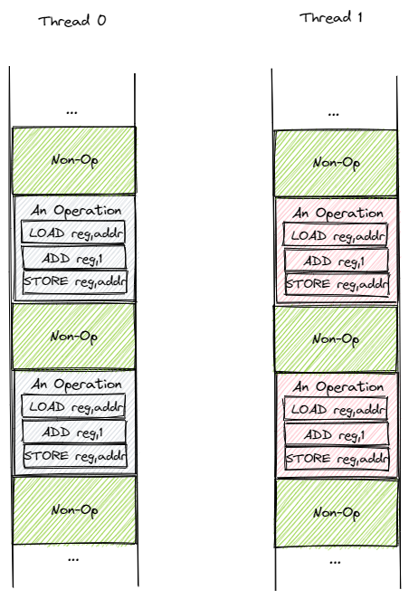
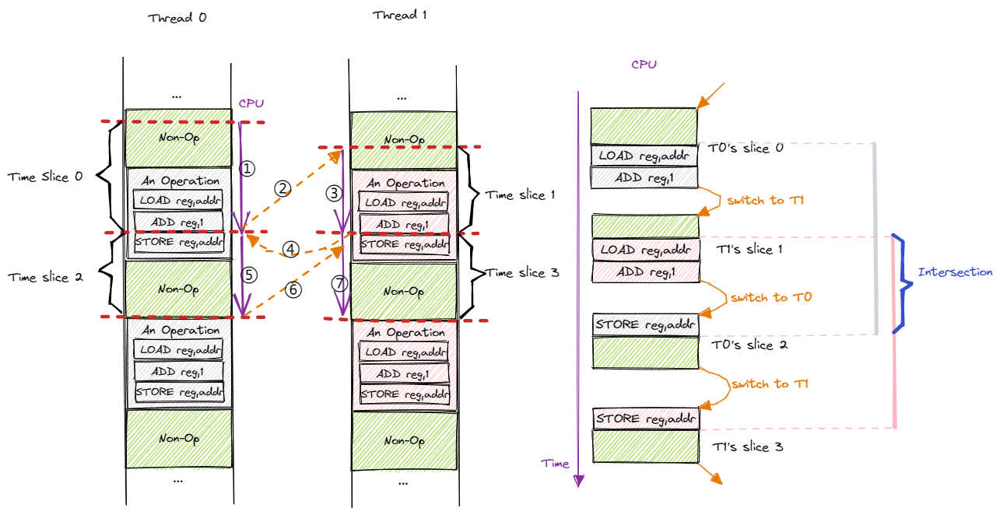
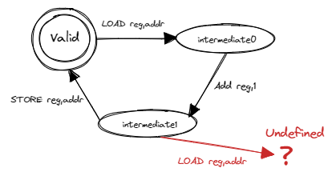

互斥鎖
===============================================

本節導讀
-----------------------------------------------

此前兩節中，我們分別介紹了用戶態和內核態的線程管理。相比進程模型，它們可以更加高效方便的進行協作。比如同進程下的線程共享進程的地址空間，它們可以直接通過讀寫內存中的共享變量來進行通信而不必進行繁瑣且低效的進程間通信。然而，在方便的同時，這種做法也會產生一些問題。本節就讓我們從一個簡單的多線程計數器的例子入手來看看我們會遇到什麼問題以及如何解決。

引子：多線程計數器
-----------------------------------------------

我們知道，同進程下的線程共享進程的地址空間，因此它們均可以讀寫程序內的全局/靜態數據。通過這種方式，線程可以非常方便的相互協作完成一項任務。下面是一個簡單的例子，同學可以在 Linux/Windows 等系統上運行這段代碼：

.. code-block:: rust
    :linenos:

    // adder.rs

    static mut A: usize = 0;
    const THREAD_COUNT: usize = 4;
    const PER_THREAD: usize = 10000;
    fn main() {
        let mut v = Vec::new();
        for _ in 0..THREAD_COUNT {
            v.push(std::thread::spawn(|| {
                unsafe {
                    for _ in 0..PER_THREAD {
                        A = A + 1;
                    }
                }
            }));
        }
        for handle in v {
            handle.join().unwrap();
        }
        println!("{}", unsafe { A });
    }

前一節中我們已經熟悉了多線程應用的編程方法。因此我們很容易看出這個程序開了 ``THREAD_COUNT`` 個線程，每個線程都將一個全局變量 ``A`` 加 1 ，次數為 ``PER_THREAD`` 次。從中可以看出多線程協作確實比較方便，因為我們只需將單線程上的代碼（即第 11~13 行的主循環）提交給多個線程就從單線程得到了多線程版本。然而，這樣確實能夠達到我們預期的效果嗎？

全局變量 ``A`` 的初始值為 ``0`` ，而 ``THREAD_COUNT`` 個線程每個將其加 1 重複 ``PER_THREAD`` 次，因此當所有的線程均完成任務之後，我們預期 ``A`` 的值應該是二者的乘積即 40000 。讓我們嘗試運行一下這個程序，可以看到類似下面的結果：

.. code-block:: console

    $ rustc adder.rs
    $ ./adder
    40000
    $ ./adder
    17444
    $ ./adder
    36364
    $ ./adder
    39552
    $ ./adder
    21397

可以看到只有其中一次的結果是正確的，其他的情況下結果都比較小且各不相同，這是為什麼呢？我們可以嘗試分析一下哪些因素會影響到代碼的執行結果，使得結果與我們的預期不同。

1. 編譯器在將源代碼編譯為彙編代碼或者機器碼的時候會進行一些優化。
2. 操作系統在執行程序的時候會進行調度。
3. CPU 在執行指令的時候會進行一些調度或優化。

那麼按照順序首先來檢查第一步，即編譯器生成的彙編代碼是否正確。可以用如下命令反彙編可執行文件 ``adder`` 生成彙編代碼 ``adder.asm`` ：

.. code-block:: console

    $ rustup component add llvm-tools-preview
    $ rust-objdump -D adder > adder.asm

在 ``adder.asm`` 中找到傳給每個線程的閉包函數（這部分是我們自己寫的，更容易出錯）的彙編代碼：

.. code-block::
    :linenos:

    # adder.asm
    000000000000bce0 <_ZN5adder4main28_$u7b$$u7b$closure$u7d$$u7d$17hfcc06370a766a1c4E>:
        bce0: subq    $56, %rsp
        bce4: movq    $0, 8(%rsp)
        bced: movq    $10000, 16(%rsp)        # imm = 0x2710
        bcf6: movq    8(%rsp), %rdi
        bcfb: movq    16(%rsp), %rsi
        bd00: callq   0xb570 <_ZN63_$LT$I$u20$as$u20$core..iter..traits..collect..IntoIterator$GT$9into_iter17h0e9595229a318c79E>
        bd05: movq    %rax, 24(%rsp)
        bd0a: movq    %rdx, 32(%rsp)
        bd0f: leaq    24(%rsp), %rdi
        bd14: callq   0xb560 <_ZN4core4iter5range101_$LT$impl$u20$core..iter..traits..iterator..Iterator$u20$for$u20$core..ops..range..Range$LT$A$GT$$GT$4next17h703752eeba5b7a01E>
        bd19: movq    %rdx, 48(%rsp)
        bd1e: movq    %rax, 40(%rsp)
        bd23: cmpq    $0, 40(%rsp)
        bd29: jne     0xbd30 <_ZN5adder4main28_$u7b$$u7b$closure$u7d$$u7d$17hfcc06370a766a1c4E+0x50>
        bd2b: addq    $56, %rsp
        bd2f: retq
        bd30: movq    328457(%rip), %rax      # 0x5c040 <_ZN5adder1A17hce2f3c024bd1f707E>
        bd37: addq    $1, %rax
        bd3b: movq    %rax, (%rsp)
        bd3f: setb    %al
        bd42: testb   $1, %al
        bd44: jne     0xbd53 <_ZN5adder4main28_$u7b$$u7b$closure$u7d$$u7d$17hfcc06370a766a1c4E+0x73>
        bd46: movq    (%rsp), %rax
        bd4a: movq    %rax, 328431(%rip)      # 0x5c040 <_ZN5adder1A17hce2f3c024bd1f707E>
        bd51: jmp     0xbd0f <_ZN5adder4main28_$u7b$$u7b$closure$u7d$$u7d$17hfcc06370a766a1c4E+0x2f>
        bd53: leaq    242854(%rip), %rdi      # 0x47200 <str.0>
        bd5a: leaq    315511(%rip), %rdx      # 0x58dd8 <writev@GLIBC_2.2.5+0x58dd8>
        bd61: leaq    -15080(%rip), %rax      # 0x8280 <_ZN4core9panicking5panic17h73f802489c27713bE>
        bd68: movl    $28, %esi
        bd6d: callq   *%rax
        bd6f: ud2
        bd71: nopw    %cs:(%rax,%rax)
        bd7b: nopl    (%rax,%rax)

雖然函數名經過了一些混淆，還是能看出這是程序 ``adder`` 的 ``main`` 函數中的一個閉包（Closure）。我們現在基於 x86_64 而不是 RISC-V 架構，因此會有一些不同：

- 指令的目標寄存器後置而不是像 RISC-V 一樣放在最前面；
- 使用 ``%rax,%rdx,%rsi,%rdi`` 作為 64 位通用寄存器，觀察代碼可以發現 ``%rsi`` 和 ``%rdi`` 用來傳參， ``%rax`` 和 ``%rdx`` 用來保存返回值；
- ``%rsp`` 是 64 位棧指針，功能與 RISC-V 中的 ``sp`` 相同；
- ``%rip`` 是 64 位指令指針，指向當前指令的下一條指令的地址，等同於我們之前介紹的 PC 寄存器。
- ``callq`` 為函數調用， ``retq`` 則為函數返回。

在瞭解了這些知識之後，我們可以嘗試讀一讀代碼：

- 第 3 行是在分配棧幀；
- 第 4~8 行準備參數，並調用標準庫實現的 ``IntoIterator`` trait 的 ``into_iter`` 方法將 Range 0..10000 轉化為一個迭代器；
- 第 9 行的 ``24(%rsp)`` 應該保存的是生成的迭代器的地址；
- 第 11 行開始進入主循環。第 11 行加載 ``24(%rsp)`` 到 ``%rdi`` 作為參數並在第 12 行調用 ``Iterator::next`` 函數，返回值在 ``%rdx`` 和 ``%rax`` 中並被保存在棧上。我們知道 ``Iterator::next`` 返回的是一個 ``Option<T>`` 。觀察第 15-16 行，當 ``%rax`` 裡面的值不為 0 的時候就跳轉到 0xbd30 ，否則就向下執行到第 17-18 行回收棧幀並退出。這意味著 ``%rax`` 如果為 0 的話說明返回的是 ``None`` ，這時迭代器已經用盡，就可以退出函數了。於是，主循環的次數為 10000 次就定下來了。
- 0xbd30 （第 19 行）開始才真正進入 ``A=A+1`` 的部分。第 19 行從虛擬地址 0x5c040（這就是全局變量 ``A`` 的地址）加載一個 usize 到寄存器 ``%rax`` 中；第 20 行將 ``%rax`` 加一；第 26 行將寄存器 ``%rax`` 的值寫回到虛擬地址 0x5c040 中。也就是說 ``A=A+1`` 是通過這三條指令達成。第 27 行無條件跳轉到 0xbd0f 也就是第 11 行，進入下一輪循環。

.. note::

    **Rust Tips: Rust 的無符號溢出是不可恢復錯誤**

    有興趣的同學可以讀一讀第 21~24 行代碼，它可以判斷在將 ``%rax`` 加一的時候是否出現溢出（注意其中複用了 ``%rax`` ，因此有一次額外的保存/恢復）。如果出現溢出的話則會跳轉到 0xbd53（第 28 行）直接 panic 。

    從中我們可以看出，相比 C/C++ 來說 Rust 的確會生成更多的代碼來針對算術溢出、數組越界的情況進行判斷，但是這並不意味著在現代 CPU 上就會有很大的性能損失。如果可以確保不會出現溢出的情況，可以考慮使用 unsafe 的 ``usize::unchecked_add`` 來避免生成相關的判斷代碼並提高性能。

我們可以得出結論：編譯器生成的彙編代碼是符合我們的預期的。那麼接下來進行第二步，操作系統的調度是否會影響結果的正確性呢？在具體分析之前，我們先對彙編代碼進行簡化，只保留直接與結果相關的部分。那麼，可以看成每個線程進行 ``PER_THREAD`` 次操作，每次操作按順序進行下面三個步驟：

1. 使用訪存指令，從全局變量 ``A`` 的地址 addr 加載 ``A`` 當前的值到寄存器 reg；
2. 使用算術指令將寄存器 reg 的值加一；
3. 使用訪存指令，將 reg 的值寫回到全局變量 ``A`` 的地址 addr，至此 ``A`` 的值成功加一。

這是一個可以認為與具體指令集架構無關的過程。因為對於傳統的計算機架構而言，在 ALU 上進行的算術指令需要以寄存器為載體，而不能直接在 RAM 上進行操作。在此基礎上，我們可以建立簡化版的線程執行模型，如下圖所示：

.. _term-interleave:

目前有兩個線程 T0 和 T1 ，二者都是從上到下順序執行。我們將 ``A=A+1`` 的操作打包成包含三條指令的一個塊，剩下的綠色區域則表示與操作無關的那些指令。每個線程都會有一種幻覺就是它能夠從頭到尾獨佔 CPU 執行，但實際上操作系統會通過搶佔式調度劃分時間片使它們 **交錯** (Interleave) 運行。注意時鐘中斷可能在執行任意一條指令之後觸發，因此時間片之間的邊界可能是任意一條指令。下圖是一種可能的時間片劃分方式：

我們暫時只考慮單 CPU 的簡單情況。按照時間順序，CPU 依次執行 T0 的時間片 0、T1 的時間片 1、T0 的時間片 2 和 T1 的時間片 3，在相鄰兩個時間片之間會進行一次線程切換。注意到在這種劃分方式中，兩個線程各有一個操作塊被劃分到多個時間片完成。圖片的右側展示了 CPU 視角的指令執行過程，我們僅關注操作塊中的指令，並嘗試模擬一下：

.. list-table:: 
    :widths: 40 30 50 50
    :header-rows: 1

    * - 動作
      - 所屬線程
      - 寄存器 reg 的值（動作後）
      - addr 處的值（動作後）
    * - 切換到 T0
      - T0
      - -
      - v
    * - LOAD reg, addr
      - T0
      - v
      - v
    * - ADD reg, 1
      - T0
      - v+1
      - v
    * - T0 切換到 T1
      - T1
      - -
      - v
    * - LOAD reg, addr
      - T1
      - v
      - v
    * - ADD reg, 1
      - T1
      - v+1
      - v
    * - T1 切換到 T0
      - T0
      - v+1
      - v
    * - STORE reg, addr
      - T0
      - v+1
      - v+1
    * - T0 切換到 T1
      - T1
      - v+1
      - v+1
    * - STORE reg, addr
      - T1
      - v+1
      - v+1
    * - T1 切換出去
      - -
      - -
      - v+1

假設開始之前全局變量 ``A`` 的值為 v ，而在這來自兩個線程的四個時間片中包含了完整的兩個 ``A=A+1`` 的操作塊，那麼結束之後 ``A`` 的值應該變成 v+2 。然而我們模擬下來的結果卻是 v+1 ，這是為什麼呢？首先需要說明的是，儘管兩個線程都使用寄存器 reg 中轉，但是它們之間並不會產生衝突，因為在線程切換的時候會對線程上下文進行保存與恢復，其中也包括寄存器 reg 。因此我們可以認為兩個線程均有一份自己獨佔的寄存器。言歸正傳，我們從結果入手進行分析， ``A`` 最終的值來源於我們在這段時間對它進行的最後一次寫入，這次寫入由 T1 進行，但是為什麼 T1 會寫入 v+1 而不是 v+2 呢？從 T1 的視角來看，首先要讀取 ``A`` 的值到 reg ，發現是 v ，這一點就很奇怪，好像此前 T0 什麼都沒做一樣。而後 T1 將 reg 的值加一變成 v+1 ，於是最後寫入的也是這個值。所以，問題的關鍵在於 T0 將自己的 reg 更新為 v+1 之後，還沒來得及寫回到 ``A`` ，就被操作系統切換到 T1 ，因此 T1 會看到 v 而不是 v+1 。等再切換回 T0 將 v+1 寫入到 ``A`` 的時候已經為時已晚，因為已經過了關鍵的 T1 讀取 ``A`` 的時間點了，於是這次寫入無法對 T1 產生任何影響，也無法影響到最終的結果了。因此，在這種情況下，由於操作系統的搶佔式調度，可以看到 T0 的 ``A=A+1`` 操作完全在做無用功，於是最終結果比期望少 1 。

.. _term-indeterminate:
.. _term-race-condition:

從上個例子可以看出，操作系統的調度有可能使得兩個線程上的操作塊 **交錯** 出現，也就是說兩個操作塊從開始到結束的時間區間存在交集。一旦出現這種情況，便會導致結果出現偏差。最終的結果取決於這種交錯的情況出現多少次，如果完全沒有出現則結果正確；否則出現次數越多，結果偏差越大。這就能夠解釋為什麼我們每次運行 ``adder.rs`` 會得到不同的結果。這種運行結果 **不確定** (Indeterminate)，且取決於像是操作系統的調度順序這種無法控制的外部事件的情況被稱為 **競態條件** (Race Condition) 。在 ``adder.rs`` 中，競態條件導致了我們預料之外的結果，因此它應當被認為是一個 bug 。

我們嘗試更加形象的說明為什麼操作塊交錯出現就會有問題。在寫程序的時候，我們需要做的是通過軟件控制一些資源，這些資源可能是軟件資源或者硬件資源。軟件資源可能包括保存在內存中的一些數據結構，硬件資源可能是內存的一部分或者某些 I/O 設備。在資源被初始化之後，資源處於一種合法（Valid）狀態，這裡的合法狀態是指資源符合一些特定的約束條件從而具有該種資源所應該具有的特徵。以我們耳熟能詳的鏈表數據結構為例，一個合法的鏈表應該滿足每個節點的 next 指針均為空指針或者指向合法的內存區域。同時，next 指針不能形成環。當然，實際上還有更多的約束條件，我們使用自然語言很難完全表述它們。總之，只有滿足所有的約束條件，我們才說這是一個合法的鏈表。

.. _term-intermediate-state:

每種資源可能都有多種不同的控制方式，每種控制方式稱為對這種資源的一種操作。比如說，如果將鏈表看成一種資源，那麼鏈表的插入和刪除就是兩種對鏈表的操作。每一種操作僅在資源處於合法狀態時才能進行，且在操作完成之後保證資源仍舊處於合法狀態。設想我們要實現鏈表的插入操作，這必須在待操作的數據結構是一個合法的鏈表這一前提下才能進行，不然我們的操作將完全沒有意義。我們還需要保證插入之後鏈表依然合法，才稱得上是正確的實現。但是資源並非任意時刻均處於合法狀態。因為一般來說操作都比較複雜，會分成多個階段多條指令完成。通常，處於合法狀態的資源在操作時會變成不合法的 **中間狀態** (Intermediate State)，待操作結束之後再重回合法狀態。以我們的多線程計數器 ``adder.rs`` 為例，狀態轉移過程如下：

.. 接下來這一段的主旨大概是說，其他線程不能從中間狀態開始操作。

這裡我們將全局變量 ``A`` 視為一種資源，操作 ``A=A+1`` 為一個三階段操作。我們可以用有限狀態自動機來描述資源 ``A`` 和操作 ``A=A+1`` ：狀態機中一共有 3 種狀態，一個合法狀態和兩個不合法的中間狀態 0 和 1。對於每次操作，第一條指令 ``A`` 從合法狀態轉移到中間狀態 0；第二條指令 ``A`` 從中間狀態 0 轉移到中間狀態 1；第三條指令 ``A`` 從中間狀態 1 轉移回合法狀態。將操作塊交錯的情況代入到狀態機中，最開始切換到 T0 之前 ``A`` 處於合法狀態，接下來切換到 T0 執行了第一、二條指令之後 ``A`` 轉移到中間狀態 1，而此時操作系統切換到 T1 ， T1 又開始執行第一條指令。問題來了：我們發現中間狀態 1 並沒有定義此時再執行第一條指令應該如何轉移。如果去執行的話，就會產生未定義行為並可能永遠無法使 ``A`` 回到合法狀態。不過，由於 ``adder.rs`` 中 ``A`` 只是一個整數，我們會發現 ``A`` 仍能回到合法狀態，只是結果不對。如果換成一種複雜的數據結構，就會產生極其微妙且難以調試的結果。

我們可以發現多線程對共享資源的訪問天然需求某種互斥性：當一個線程在對共享資源進行操作的時候，共享資源處在不合法的中間狀態，如果此時其他線程開始操作會產生未定義行為。只有當操作完成，共享資源重新回到合法狀態之後，之前操作的線程或者其他線程才能開始下一次操作。只有滿足這種互斥性，才能保證多線程對共享資源的訪問符合我們的預期。下面，我們換用操作系統中的術語進行表述：

.. _term-shared-resources:
.. _term-critical-section:
.. _term-mutual-exclusion:

**共享資源** (Shared Resources) 是指多個線程均能夠訪問的資源。線程對於共享資源進行操作的那部分代碼被稱為 **臨界區** (Critical Section)。在多線程併發訪問某種共享資源的時候，為了正確性，必須要滿足 **互斥** (Mutual Exclusion) 訪問要求，即同一時間最多隻能有一個線程在這種共享資源的臨界區之內。這樣才能保證當一個線程開始操作時，共享資源總是處於合法狀態，這保證了操作是有意義的。如果能夠做到互斥訪問的話，我們 ``adder.rs`` 出現 bug 的根源————即對於 ``A`` 的操作可能交錯出現的情況便能夠被避免。

.. _term-mutex:
.. _term-lock:

從 ``adder.rs`` 中可以看出，如果任由操作系統進行時間片切分和線程調度而不加任何特殊處理，是很難滿足互斥訪問要求的。那麼應該如何實現互斥訪問呢？接下來，我們將會嘗試構建一組稱之為 **互斥鎖** (Mutex，源於 **Mut** ual **Ex** clusion，簡稱為 **鎖** Lock) 的通用互斥原語來對臨界區進行保護，從而在一般意義上保證互斥訪問要求。這將是本節接下來的主要內容。

.. _term-atomic-instruction:

如果僅僅考慮 ``adder.rs`` 的話，其實不借助鎖機制也能夠解決問題。這是因為其中的共享資源為一個 64 位無符號整型，是一個十分簡單的類型。對於這種原生類型，現代指令集架構額外提供一組 **原子指令** (Atomic Instruction) ，在某些架構上只需一條原子指令就能完成包括訪存、算術運算在內的一系列功能。這就是說 ``adder.rs`` 中的 ``A=A+1`` 操作其實只需一條原子指令就能完成。如果這樣做的話，我們相當於 **將臨界區縮小為一條原子指令** ，這已經是處理器執行指令和時間片切分的最小單位，因此我們不使用任何保護手段也能滿足互斥要求。修改之後的代碼如下：

.. _ref-adder-fixed:

.. code-block:: rust
    :linenos:

    // adder_fixed.rs

    use std::sync::atomic::{AtomicUsize, Ordering};
    static A: AtomicUsize = AtomicUsize::new(0);
    const THREAD_COUNT: usize = 4;
    const PER_THREAD: usize = 10000;
    fn main() {
        let mut v = Vec::new();
        for _ in 0..THREAD_COUNT {
            v.push(std::thread::spawn(|| {
                for _ in 0..PER_THREAD {
                    A.fetch_add(1, Ordering::Relaxed);
                }
            }));
        }
        for handle in v {
            handle.join().unwrap();
        }
        println!("{}", A.load(Ordering::Relaxed));
    }

.. _term-atomicity:

Rust 核心庫在 ``core::sync::atomic`` 中提供了很多原子類型，比如我們這裡可以使用 ``usize`` 對應的原子類型 ``AtomicUsize`` ，它支持很多原子操作。比如，第 12 行 ``fetch_add`` 的功能是將 ``A`` 的值加一併返回 ``A`` 之前的值，這其中涉及到讀取內存、算術運算和寫回內存，但是卻只需要這一個操作就能同時完成。這種原子操作基於硬件提供的原子指令，硬件可以保證其 **原子性** (Atomicity)，含義是該操作的一系列功能要麼全部完成，要麼都不完成，而不會出現有些完成有些未完成的情況。原子性中的“原子”是為了強調操作中的各種功能作為一個整體不可分割的屬性。這種由硬件提供的 **原子指令是整個計算機系統中最根本的原子性和互斥性的來源** 。無論軟件執行了哪些指令，也無論 CPU 執行指令的時候出現了哪些中斷/異常，又或者多個 CPU 同時訪問內存中同一個位置這種情形，都不能破壞原子指令的原子性。

可惜的是，原子指令雖然強大，其應用範圍卻比較有限，通常它只能用來保護 **單內存位置** 上的簡單操作，比如 ``A=A+1`` 這種操作。當資源是比較複雜的數據結構的時候它就無能為力了。當然，我們也不會指望硬件提供一條“原子地完成紅黑樹插入/刪除”這種指令，畢竟這樣的數據結構有無數種，硬件總不可能對每種可能的數據結構和每種可能的操作都提供一條指令，這樣的硬件是不存在的。即使如此我們也沒有必要擔心，只要我們能夠靈活使用原子指令來根據實際需求限制多線程對共享資源的併發訪問，比如基於原子指令實現通用的鎖機制來保證互斥訪問，所有的併發訪問問題就一定能夠迎刃而解。

需要注意的是， ``adder.rs`` 的錯誤結果是多種因素共同導致的，這裡我們深入分析的操作系統調度帶來的影響只不過是其中之一，其實 CPU 的指令執行也會有影響。

.. note::

    **原子性**

    原子性的說法最常見於數據庫領域的原子 **事務** (Transaction) ，表示對於數據庫的一次修改要麼全部完成，要麼沒有任何影響，而不存在任何中間狀態。事務模型可以保證數據庫能夠在出錯時順利恢復以及高併發訪問的正確性。但其實原子性這個概念在很多不同領域均有應用且有不同內涵。

.. note::

    **Rust Tips: static mut 和 unsafe 的消失**

    TODO:

.. 好像缺一點只讀-修改操作的區別。回顧數據競爭的定義：有線程在寫，同時有其他線程讀或寫。

鎖的簡介
----------------------------------------------------

鎖機制的形態與功能
~~~~~~~~~~~~~~~~~~~~~~~~~~~~~~~~~~~~~~~~~~~~~~~~~~~~

我們提到為了保證多線程能夠正確併發訪問共享資源，可以使用一種叫做 **鎖** 的通用機制來對線程操作共享資源的 **臨界區** 進行保護。這裡的鎖和現實生活中的含義很接近。回想一下我們如何使用常見於理髮店或者游泳館更衣室的公共儲物櫃：首先需要找到一個沒有上鎖的櫃子並將物品存放進去。接著我們鎖上櫃子並拔出插在鎖孔上的鑰匙妥善保管。最後，當我們想取出物品時，我們使用鑰匙打開存放物品的櫃子並將鑰匙留在鎖孔上以便他人使用。至此，完整的使用流程結束。

那麼，如何使用類似的思路用鎖機制保護臨界區呢？鎖是附加在一種共享資源上的一種標記，最簡單的情況下它只需有兩種狀態：上鎖和空閒。上鎖狀態表示此時已經有某個線程在該種共享資源的臨界區中，故而為了正確性其他線程不能進入臨界區。相反的，空閒狀態則表示線程可以進入臨界區。顯然，線程成功進入臨界區之後鎖也需要從空閒轉為上鎖狀態。鎖的兩個基本操作是 **上鎖** 和 **解鎖** ，在線程進入臨界區之前和退出臨界區之後分別需要成功上鎖和解鎖。通過這種方式，我們就可以保證臨界區的互斥性。在引入鎖機制之後，線程訪問共享資源的流程如下：

- 第一步上鎖：線程進入臨界區之前檢查共享資源是否已經上鎖。如果已經上鎖的話，則需要 **等待** 持有鑰匙的線程歸還鑰匙並解鎖。接下來，線程嘗試“搶”到鑰匙，如果成功的話，線程將資源上鎖，此時我們說該線程 **獲取到了鎖** （或者說 **持有鎖或拿到了鎖** ）。最後線程拿走鑰匙並進入臨界區。此時資源進入上鎖狀態，其他線程不能進入臨界區。
- 第二步在臨界區內訪問共享資源。只有持有共享資源鎖的線程能夠進入臨界區，這就能夠保證臨界區的互斥性。
- 第三步解鎖：線程離開臨界區之後將資源解鎖並歸還鑰匙，我們說線程 **釋放了鎖** 。此時資源回到空閒狀態。

鎖的使用方法
~~~~~~~~~~~~~~~~~~~~~~~~~~~~~~~~~~~~~~~~~~~~~~~~~~~~

Rust 在標準庫中提供了互斥鎖 ``std::sync::Mutex<T>`` ，它可以包裹一個類型為 ``T`` 的共享資源為它提供互斥訪問。線程可以調用 ``Mutex<T>::lock`` 來獲取鎖，注意線程不一定立即就能拿到鎖，所以它會等待持有鎖的線程釋放鎖且自身搶到鎖之後才會返回。其返回值為 ``std::sync::MutexGuard<T>`` （篇幅所限省略掉外層的 ``Result`` ），可以理解為前面描述中的一把鑰匙，拿到它的線程也就拿到了鎖，於是有資格獨佔共享資源並進入臨界區。 ``MutexGuard<T>`` 提供內部可變性，可以看做可變引用 ``&mut T`` ，用來修改共享資源。它的另一種功能是用來開鎖，它也是 RAII 風格的，在它被 drop 之後會將鎖自動釋放。

讓我們看看如何使用 ``Mutex<T>`` 來更正 ``adder.rs`` ：

.. code-block:: rust
    :linenos:

    // adder_mutex0.rs

    use std::sync::Mutex;
    const THREAD_COUNT: usize = 4;
    const PER_THREAD: usize = 10000;
    static A: Mutex<usize> = Mutex::new(0);
    fn main() {
        let mut v = Vec::new();
        for _ in 0..THREAD_COUNT {
            v.push(std::thread::spawn(|| {
                for _ in 0..PER_THREAD {
                    let mut a_guard = A.lock().unwrap();
                    *a_guard = *a_guard + 1;
                }
            }));
        }
        for handle in v {
            handle.join().unwrap();
        }
        println!("{}", *A.lock().unwrap());
    }

第 6 行我們將共享資源用 ``A`` 使用 ``Mutex<T>`` 包裹。第 12~14 行構成一次完整的受鎖保護的臨界區訪問：第 12 行獲取鎖；第 13 行是臨界區；第 14 行循環的一次迭代結束，第 12 行的 ``MutexGuard<T>`` 退出作用域，於是它被 drop 之後自動解鎖。

在上面的做法中，鎖以及被鎖保護的共享資源被整合到一個數據結構中，這也是最為常見的做法。但在某些情況下，它們之間可以相互分離，參考下面的代碼：

.. code-block:: rust
    :linenos:

    // adder_mutex1.rs

    use std::sync::Mutex;
    static mut A: usize = 0;
    static LOCK: Mutex<bool> = Mutex::new(true);
    const THREAD_COUNT: usize = 4;
    const PER_THREAD: usize = 10000;
    fn main() {
        let mut v = Vec::new();
        for _ in 0..THREAD_COUNT {
            v.push(std::thread::spawn(|| {
                for _ in 0..PER_THREAD {
                    let _lock = LOCK.lock();
                    unsafe { A = A + 1; }
                }
            }));
        }
        for handle in v {
            handle.join().unwrap();
        }
        println!("{}", unsafe { A });
    }

其中鎖 ``LOCK`` 用來保護共享資源 ``A`` 。此處， ``LOCK`` 有用的僅有那個描述鎖狀態（可能是上鎖或空閒）的標記，它內部包裹的值反而無關緊要，其類型 ``T`` 可以隨意選擇。可以看到在這種實現中，鎖 ``LOCK`` 和共享資源 ``A`` 是分離開的，這樣實現更加靈活，但是更容易由於編碼錯誤而出現 bug 。

評價鎖實現的指標
~~~~~~~~~~~~~~~~~~~~~~~~~~~~~~~~~~~~~~~~~~~~~~~~~~~~~~~~~~~

鎖機制有多種不同的實現。對於一種實現而言，我們常常用以下的指標來從多個維度評估這種實現是否能夠正確、高效地達成鎖這種互斥原語應有的功能：

.. _term-progress:
.. _term-bounded-waiting:
.. _term-fairness:
.. _term-starvation:

- 忙則等待：意思是當一個線程持有了共享資源的鎖，此時資源處於繁忙狀態，這個時候其他線程必須等待拿著鎖的線程將鎖釋放後才有進入臨界區的機會。這其實就是互斥訪問的另一種說法。這種互斥性是鎖實現中最重要的也是必須做到的目標，不然共享資源訪問的正確性會受到影響。
- **空閒則入** (在《操作系統概念》一書中也被稱為 **前進** Progress)：若資源處於空閒狀態且有若干線程嘗試進入臨界區，那麼一定能夠在有限時間內從這些線程中選出一個進入臨界區。如果不滿足空閒則入的話，可能導致即使資源空閒也沒有線程能夠進入臨界區，對於鎖來說是不可接受的。
- **有界等待** (Bounded Waiting)：當線程獲取鎖失敗的時候首先需要等待鎖被釋放，但這並不意味著此後它能夠立即搶到被釋放的鎖，因為此時可能還有其他的線程也處於等待狀態。於是它可能需要等待一輪、二輪、多輪才能拿到鎖，甚至在極端情況下永遠拿不到鎖。 **有界等待** 要求每個線程在等待有限長時間後最終總能夠拿到鎖。相對的，線程可能永遠無法拿到鎖的情況被稱之為 **飢餓** (Starvation) 。這體現了鎖實現分配共享資源給線程的 **公平性** (Fairness) 。
- 讓權等待（可選）：線程如何進行等待實際上也大有學問。這裡所說的讓權等待是指需要等待的線程暫時主動或被動交出 CPU 使用權來讓 CPU 做一些有意義的事情，這通常需要操作系統的支持。這樣可以提升系統的總體效率。

總的來說，忙則等待、空閒則入和有界等待是一個合格的鎖實現必須滿足的要求，而讓權等待則關係到鎖機制的效率，是可選的。

這一小節我們介紹了鎖的形態：一種附加在共享資源上的標記，需要區分當前是否有線程在該種資源的臨界區中。它支持兩種基本操作：上鎖和解鎖。接著我們還介紹了 Rust 標準庫提供的互斥鎖 ``Mutex<T>`` 並通過例子演示了它的用法。最後我們介紹了評價鎖機制實現的一些指標，從中我們可以瞭解到怎樣才可以稱之為一個好的鎖實現。接下來，我們將正式開始親自動手根據上述需求嘗試實現鎖機制。

鎖的純用戶態軟件實現
------------------------------------------------------

在本節中，我們僅考慮在用戶態使用鎖機制保證多線程對共享資源的互斥訪問的情形。此時在實現鎖機制的時候，應用的執行環境的多個部分都有可能給我們帶來一些幫助，從上到下它們分別是：

1. 用戶態軟件的一些函數庫；
2. 操作系統內核的支持；
3. 相關硬件機制或特殊指令的支持。

為了簡單起見，我們暫不考慮操作系統內核支持和硬件機制，看看能否僅基於用戶態軟件實現鎖機制，如果無法實現或者實現得不好是由於哪些問題，應當如何改進。本節之前的例子 ``adder.rs`` 運行在我們的真實計算機上的 Linux/Windows 或其他操作系統上，不過當我們自己實現鎖的時候，我們選擇在一個比較簡單的平臺——即 Qemu 模擬出來的 **單核** 計算機上的我們自己實現支持多線程的“達科塔盜龍”操作系統上進行實現和測試。因為如果基於真實計算機和成熟的操作系統，多線程在 **多核** 上的執行模型比較複雜，為了正確實現需要了解很多相關知識。在 Qemu 上我們能最大限度簡化問題，也同樣能有機會討論鎖實現的一些核心問題。

基於 :doc:`/chapter8/1thread-kernel` ，我們可以在自己的“達科塔盜龍”操作系統上實現 ``adder.rs`` 。代碼如下：

.. code-block:: rust
    :linenos:

    // user/src/bin/adder.rs

    #![no_std]
    #![no_main]

    #[macro_use]
    extern crate user_lib;
    extern crate alloc;

    use alloc::vec::Vec;
    use core::ptr::addr_of_mut;
    use user_lib::{exit, get_time, thread_create, waittid};

    static mut A: usize = 0;
    const PER_THREAD_DEFAULT: usize = 10000;
    const THREAD_COUNT_DEFAULT: usize = 16;
    static mut PER_THREAD: usize = 0;

    unsafe fn critical_section(t: &mut usize) {
        let a = addr_of_mut!(A);
        let cur = a.read_volatile();
        for _ in 0..500 {
            *t = (*t) * (*t) % 10007;
        }
        a.write_volatile(cur + 1);
    }

    unsafe fn f() -> ! {
        let mut t = 2usize;
        for _ in 0..PER_THREAD {
            critical_section(&mut t);
        }
        exit(t as i32)
    }

    #[no_mangle]
    pub fn main(argc: usize, argv: &[&str]) -> i32 {
        let mut thread_count = THREAD_COUNT_DEFAULT;
        let mut per_thread = PER_THREAD_DEFAULT;
        if argc >= 2 {
            thread_count = argv[1].parse().unwrap();
            if argc >= 3 {
                per_thread = argv[2].parse().unwrap();
            }
        }
        unsafe { PER_THREAD = per_thread; }
        let start = get_time();
        let mut v = Vec::new();
        for _ in 0..thread_count {
            v.push(thread_create(f as usize, 0) as usize);
        }
        for tid in v.into_iter() {
            waittid(tid);
        }
        println!("time cost is {}ms", get_time() - start);
        assert_eq!(unsafe { A }, unsafe { PER_THREAD } * thread_count);
        0
    }

這裡共享資源仍然為全局變量 ``A`` ，具體操作為開 ``thread_count`` 個線程，每個線程執行 ``A=A+1`` 操作 ``PER_THREAD`` 次。線程數和每個線程上的操作次數默認值分別由 ``THREAD_COUNT_DEFAULT`` 和 ``PER_THREAD_DEFAULT`` 給出，也可以通過命令行參數設置。例如，命令 ``adder 4 1000`` 可以調整為 4 個線程，每個線程執行 1000 次操作，詳情參考第 37~45 行的命令行參數邏輯。

每個線程在創建之後都會不帶參數執行第 27 行的 ``f`` 函數，裡面是一個循環。循環的每次迭代都會嘗試進入臨界區（第 18 行的 ``critical_section`` 函數），共迭代 ``PER_THREAD`` 次。臨界區其實就是進行 ``A=A+1`` 的操作，但有兩點不同：第一點是我們使用 ``core::ptr::read/write_volatile`` 而不是直接 ``A=A+1`` ，這是為了生成的彙編代碼嚴格遵循 ``A=A+1`` 的三階段而不會被編譯器誤優化，其實有些類似於手寫彙編；第二點是我們插入了一些關於 ``t`` 的冗餘操作，這並不影響到共享資源的訪問，目的在於加大階段之間的間隔，使得一次 ``A=A+1`` 操作更容易橫跨兩個時間片從而出現一些有趣的現象。

.. note::

    **Rust Tips: 易失性讀寫 read/write_volatile**

    有些時候，編譯器會對一些訪存行為進行優化。舉例來說，如果我們寫入一個內存位置並立即讀取該位置，並且在同段時間內其他線程不會訪問該內存位置，這意味著我們寫入的值能夠在 RAM 上保持不變。那麼，編譯器可能會認為讀取到的值必定是此前寫入的值，於是在最終的彙編碼中讀取內存的操作可能被優化掉。然而，有些時候，特別是訪問 I/O 外設以 MMIO 方式映射的設備寄存器時，即使是相同的內存位置，對它進行讀取和寫入的含義可能完全不同，於是讀取到的值和我們之前寫入的值可能沒有任何關係。連續兩次讀取同個設備寄存器也可能得到不同的結果。這種情況下，編譯器對訪存行為的修改顯然是一種誤優化。

    於是，在訪問 I/O 設備寄存器或是與 RAM 特性不同的內存區域時，就要注意通過 ``read/write_volatile`` 來確保編譯器完全按照我們的源代碼生成彙編代碼而不會自作主張進行刪除或者重排訪存操作等優化。若想更加深入瞭解 volatile 的含義，可以參考 `Rust 官方文檔 <https://doc.rust-lang.org/stable/std/ptr/fn.read_volatile.html#notes>`_ 。

在 ``user/src/bin`` 目錄下我們還會看到很多 ``adder.rs`` 衍生出來的 ``adder_*.rs`` 測例，每個測例對應到一種鎖實現。它們與 ``adder.rs`` 的主要不同在於臨界區看起來是受保護的：在臨界區 ``critical_section`` 的前後分別會調用上鎖和解鎖函數 ``lock`` 和 ``unlock`` ，每個測例的 ``lock`` 和 ``unlock`` 的實現也是不同的。然而它們不全是正確的實現，效率也各不相同。

單標記的簡單嘗試
~~~~~~~~~~~~~~~~~~~~~~~~~~~~~~~~~~~~~~~~~~~~~~~~

我們知道鎖的本質上是一個標記，表明目前是否已經有線程進入共享資源的臨界區了。於是，最簡單的實現思路就是加入一個新的全局變量用作這個標記：

.. _link-adder-simple-spin:

.. code-block:: rust
    :linenos:

    // user/src/bin/adder_simple_spin.rs

    static mut OCCUPIED: bool = false;

    unsafe fn lock() {
        while vload!(OCCUPIED) {}
        OCCUPIED = true;
    }

    unsafe fn unlock() {
        OCCUPIED = false;
    }

我們使用一個新的全局變量 ``OCCUPIED`` 作為標記，表示當前是否有線程在臨界區內。在 ``lock`` 的時候，我們等待 ``OCCUPIED`` 變為 false （注意這裡的 ``vload!`` 來自用戶庫 ``user_lib`` ，基於臨界區中用到的 ``read_volatile`` 實現，含義相同），這意味著沒有線程在臨界區內了，於是將標記修改為 true 並自己進入臨界區。在退出臨界區 ``unlock`` 的時候則只需將標記改成 false 。

.. _term-busy-waiting:
.. _term-spinning:

第 6 行不斷 while 循環直到標記被改為 false ，在循環體內則不做任何事情，這是一種典型的 **忙等待** (Busy Waiting) 策略，它也被形象地稱為 **自旋** (Spinning) 。我們目前基於單核 CPU ，如果循環第一次迭代發現標記為 true 的話，在觸發時鐘中斷切換到其他線程之前，無論多少次查看標記都必定為 true ，因為當前線程不會修改標記。這就會造成 CPU 資源的嚴重浪費。針對這種場景， Rust 提供了 ``spin_loop_hint`` 函數，我們可以在循環體內調用該函數來通知 CPU 當前線程正處於忙等待狀態，於是 CPU 可能會進行一些優化（比如降頻減少功耗等），其在不同平臺上有不同表現。此外，如果我們有操作系統支持的話，便可以考慮鎖實現評價指標中的“讓權等待”，這個我們後面還會講到。

可以看到，總體上這種實現是非常簡單的，但是它能夠保證最關鍵的互斥訪問嗎？我們可以嘗試運行一下測例，很遺憾，最後的結果並不正確！那麼是哪裡出了問題呢？根據原先的思路我們還是先檢查 ``lock`` 的彙編代碼，我們將其簡化為偽代碼的形式（有興趣的同學可以自行嘗試），大致上分為三個階段，每個階段由一到多條指令組成：

1. 將標記的值加載到寄存器 reg
2. 條件跳轉，如果 reg 為 1 則跳轉回第一階段開始新一輪循環；否則向下進行
3. 將標記賦值為 1

仿照最早的 ``adder.rs`` 的例子，我們很容易構造出一種時間片分割的方式使得互斥訪問失效：假設某時刻標記 ``OCCUPIED`` 的值為 false ，線程 T0 和 T1 都準備進入臨界區。假設先切換到 T0 ，它經歷 1、2 階段，看到標記為 false ，認為自己能夠進入臨界區，但是在執行關鍵的 3 階段之前被操作系統切換到線程 T1 。T1 也經歷 1、2階段，由於 T0 並沒有修改標記，它也認為自己能夠進入臨界區。接下來顯然線程 T0 和 T1 能夠同時進入臨界區了，這就違背了互斥訪問要求。

問題的本質是：在這個實現中，標記 ``OCCUPIED`` 也成為了多線程均可訪問的 **共享資源** ，那麼 **它也需求互斥訪問** 。而我們並沒有吸取 ``adder.rs`` 的教訓，我們讓操作為多階段多指令的 ``OCCUPIED`` 無任何保護的暴露在操作系統調度面前，那麼自然也會發生和 ``adder.rs`` 類似的問題。那麼應該如何解決問題呢？參照 :ref:`adder_fixed.rs <ref-adder-fixed>` ，在硬件的支持下，將對標記的操作替換為原子操作顯然很靠譜。但我們不禁要問，如果不依賴硬件，是否有一種純軟件的解決方案呢？其實在某些限制條件下是可以的，下面就介紹一個例子。

多標記的組合
~~~~~~~~~~~~~~~~~~~~~~~~~~~~~~~~~~~~~~~~~~~~~~~~

既然僅使用一個標記不行，我們嘗試使用多標記的組合來表示鎖的狀態。比如下面的 `Peterson 算法 <https://en.wikipedia.org/wiki/Peterson%27s_algorithm>`_ 就適用於兩個線程間的互斥訪問：

.. _link-adder-peterson-spin:

.. code-block:: rust
    :linenos:

    // user/src/bin/adder_peterson_spin.rs

    /// FLAG[i]=true 表示線程 i 想要進入或已經進入臨界區
    static mut FLAG: [bool; 2] = [false; 2];
    /// TURN=i 表示輪到線程 i 進入臨界區
    static mut TURN: usize = 0;

    /// id 表示當前的線程 ID ，為 0 或 1
    unsafe fn lock(id: usize) {
        FLAG[id] = true;
        let j = 1 - id;
        TURN = j;
        // Tell the compiler not to reorder memory operations
        // across this fence.
        compiler_fence(Ordering::SeqCst);
        // Why do we need to use volatile_read here?
        // Otherwise the compiler will assume that they will never
        // be changed on this thread. Thus, they will be accessed
        // only once! 
        while vload!(FLAG[j]) && vload!(TURN) == j {}
        // while FLAG[j] && TURN == j {}
    }

    unsafe fn unlock(id: usize) {
        FLAG[id] = false;
    }

目前一共有三個標記：兩個線程 :math:`T_0` 和 :math:`T_1` 各自有一個標記 :math:`\text{flag}_i,i\in\{0,1\}` ，表示線程 :math:`T_i` 想要或已經進入臨界區。此外還有一個標記 :math:`\text{turn}` ，當 :math:`\text{turn}` 為 :math:`i` 的時候表示輪到線程 :math:`T_i` 進入臨界區。

我們來看看 ``lock`` 和 ``unlock`` 各自做了哪些事情（假設調用者為線程 :math:`T_i` ）。在 ``lock`` 中，首先我們將 :math:`\text{flag}_i` 設置為 true ，表明線程 :math:`T_i` 想要進入臨界區。接著得到另一個線程的編號 :math:`j=1-i` 。第 12 行非常有趣：線程 :math:`T_i` 將標記 :math:`\text{turn}` 設置為 :math:`j` ，由於 :math:`\text{turn}` 的含義是有資格進入臨界區的線程 ID ，這相當於 :math:`T_i` 將進入臨界區的資格拱手讓給 :math:`T_j` 。第 15 行我們可以先忽略。最後是第 20 行的忙等（為了防止編譯器優化我們使用了 ``vload!`` ，邏輯同第 21 行）：如果 :math:`T_j` 想要或已經進入臨界區而且輪到 :math:`T_j` 進入臨界區就一直等待下去。 ``unlock`` 則只是將 :math:`\text{flag}_i` 設置為 false 。

運行一下這個測例發現總是可以得到正確的結果，說明在操作系統調度的影響下這種算法仍能夠保證臨界區的互斥訪問，但這是如何做到的呢？這裡並無必要給出一個嚴格證明，我們分成兩種情況進行簡單說明：

- 第一種情況考慮兩個線程的 ``lock`` 操作不重疊的情況，這種情況比較簡單。假設 :math:`T_j` 已經成功 ``lock`` 並進入了臨界區且尚未離開，此時 :math:`T_i` 開始嘗試進入臨界區，它能成功嗎？根據 ``lock`` 的流程， :math:`T_i` 會將 :math:`\text{flag}_i` 設置為 true ，並將 :math:`\text{turn}` 設置為 :math:`j` 。接下來來看忙等的兩個條件。首先是 :math:`\text{turn}` ，它被 :math:`T_i` 設置為 :math:`j` ，而 :math:`T_j` 在退出臨界區之前不會對它進行修改，所以此時 :math:`\text{turn}` 的值一定為 :math:`j` ，條件成立；其次是 :math:`\text{flag}_j` ，注意到 :math:`T_j` 在進入臨界區之前的 ``lock`` 中將其修改為 true ，且在離開臨界區之前不會將其改為 false ，所以此時 :math:`\text{flag}_j` 一定為 true ，條件也成立。因此， :math:`T_i` 會陷入忙等而不會進入臨界區。
- 第二種情況考慮兩個線程的 ``lock`` 操作由於操作系統調度出現交錯現象，也即兩個線程在同段時間內嘗試進入臨界區，是否只有一個線程能成功進入呢？為了方便起見我們先排除 :math:`\text{flag}_{i,j}` 的影響。因為兩個線程在 ``lock`` 的第一步就是將自己的 :math:`\text{flag}` 設置為 true ，且在退出臨界區之後才會修改為 false 。從時間上，我們只考察從兩個線程開始 ``lock`` 直到某個線程成功進入臨界區且未離開的這段時間，我們可以認為在這段時間內始終有 :math:`\text{flag}_i=\text{flag}_j=\text{true}` 。
  
  於是兩個線程的忙等條件可以得到簡化：即線程 :math:`T_i` 只要 :math:`\text{turn}=j` 就一直忙等，而線程 :math:`T_j` 只要 :math:`\text{turn}=i` 就一直忙等。每個線程都不能單靠自己進入臨界區：以 :math:`T_i` 為例，它將 :math:`\text{turn}` 設置為 :math:`j` ，但它忙等的條件也是 :math:`\text{turn}=j` ，於是只有它自己的話就會進入忙等而不能進入臨界區。必須要兩個線程的協作：即當 :math:`T_j` 將 :math:`\text{turn}` 設置為 :math:`i` ， :math:`T_i` 才能進入臨界區。

  可以看出問題的關鍵在於 :math:`\text{turn}` 。無論操作系統如何進行調度，在單核 CPU 上，線程 :math:`T_i` 和線程 :math:`T_j` 對於 :math:`\text{turn}` 的 **修改總有一個在時間上靠後** 。不妨設 :math:`T_i` 在 :math:`T_j` 之後將 :math:`\text{turn}` 修改為 :math:`j` ，那麼這段時間中 :math:`\text{turn}` 就會一直是 :math:`j` 了，因為兩個線程都已經完成了僅有一次的對於 :math:`\text{turn}` 的修改。於是， :math:`T_i` 不可能在這一輪進入臨界區了。考慮 :math:`T_j` ，它已經完成了 :math:`\text{turn}\leftarrow i` 的修改，此時可能已陷入忙等或者還沒開始忙等。無論如何，只要接下來操作系統從 :math:`T_i` 切換到 :math:`T_j` ， :math:`T_j` 就能退出忙等併成功進入臨界區。結論是，哪個線程最後修改了 :math:`\text{turn}` ，則另一個線程最終一定能進入臨界區。

這樣我們就說明了 Peterson 算法是如何在操作系統調度下仍保證互斥訪問的。那麼它能夠滿足空閒則入和有界等待這另外兩個必須的要求嗎？在這裡需要說明的是，我們不必考慮操作系統調度導致的一些極端情況。比如說在考察是否能滿足有界等待的時候，假如某個線程在進入等待狀態之後，操作系統就再也不會調度到這個線程，看起來是出現了飢餓現象。但是這應當被歸結於操作系統調度算法而非我們的鎖實現。因此，我們需要合理地假設調度算法較為公平，各線程分到的 CPU 資源比較接近，這樣調度算法就不會在很大程度上影響到鎖的效果。現在回過頭來看兩個要求：

- 對於空閒則入，之前我們說明了當資源空閒的時候，如果只有單個線程要進入臨界區，那麼它一定能進去。如果兩個線程要同時進入的話，只需要等到兩個線程對於 :math:`\text{turn}` 的修改均完成就能夠確定哪個線程進入臨界區，這一定能夠在有限時間內做到。
- 對於有界等待，假設線程 :math:`T_i` 由於沒有競爭過 :math:`T_j` 而在 ``lock`` 中陷入忙等待，相反 :math:`T_j` 則成功進入臨界區。在 :math:`T_j` 離開臨界區之後，可以發現它不可能在 :math:`T_i` 進入臨界區之前再次進入臨界區了。可以使用反證法，假設 :math:`T_j` 能夠在 :math:`T_i` 不進入的情況下再次進入，考慮 :math:`T_j` 的忙等循環的兩個條件，由於 :math:`T_i` 一直處在忙等狀態，有 :math:`\text{flag}_i` 為 true ，而 :math:`\text{turn}=i` （由 :math:`T_j` 在進入忙等循環之前修改， :math:`T_i` 已經在忙等沒有機會修改為 :math:`j` ），可知 :math:`T_j` 會卡在忙等中不能進入臨界區，與假設矛盾。相反，從 :math:`T_i` 的視角看來，在 :math:`T_j` 離開臨界區之後，只要操作系統通過調度切換到 :math:`T_i` ， :math:`T_i` 立即就能進入臨界區（除非在 :math:`T_j` 完成 :math:`\text{flag}_j\leftarrow\text{true}` 之後立即切換，但這種情況也只是讓 :math:`T_i` 晚一些進入臨界區），有興趣的同學可自行驗證。總體看來， :math:`T_i` 和 :math:`T_j` 是在交替進入臨界區，因此不存在某一個線程的無限等待——即飢餓現象。

這說明， Peterson 算法確實能夠滿足忙則等待、空閒則入和有界等待三個要求，是一種合格的鎖實現。類似的算法還有適用於雙線程的 `Dekkers 算法 <https://en.wikipedia.org/wiki/Dekker%27s_algorithm>`_ 以及適用於多線程的 `Eisenberg & McGuire 算法 <https://en.wikipedia.org/wiki/Eisenberg_%26_McGuire_algorithm>`_ 。 這類算法僅依賴最基本的訪存操作以及用戶態權限，但思想上用到了多標記的組合以及精巧的構造，雖然代碼比較簡單，但是不容易理解，要證明其正確性更是十分複雜。更為重要的是，這類算法存在著時代侷限性，對 CPU 的內存訪問有著比較嚴格的要求，因此這類算法是不能不加修改的運行在現代多核處理器上的。如果要保證其正確性，則要付出極大的性能開銷，甚至得不償失。因此，目前在實踐中我們並不會用到這類算法實現鎖機制。關於這種侷限性更加深入的討論超出了本書的範圍，因此我們將其放在附錄中，有興趣的同學可以參考 :doc:`/appendix-f/index` 。

基於硬件機制及特殊指令的鎖實現
-------------------------------------------------

上面我們介紹了鎖的純軟件實現。可以看到，為了保證互斥訪問要求，需要用到類似於 Peterson 的十分精密複雜的算法，它們不易理解，而且與現代處理器（特別是多核架構的處理器）的適配性不好。於是，我們可以考慮將這種通用的鎖機制的需求下沉到硬件。如果硬件能提供相應的一些支持，那麼我們在軟件層面上就能比較簡單地實現鎖機制，且總體性能較高。下面依次介紹兩種實現鎖機制相關硬件支持：即關閉中斷和原子指令。

關閉中斷
~~~~~~~~~~~~~~~~~~~~~~~~~~~~~~~~~~~~~~~~~~~~~~~~~~

從前面的分析可以看出，站在用戶態軟件也就是應用的角度，併發問題的一個重要來源是操作系統隨時有可能通過搶佔式調度切換到其他線程，特別是當線程處於臨界區被切換出去的時候，將導致不同線程的臨界區交錯運行使得共享資源訪問出錯。那麼如何保證線程處於臨界區的時候不會被操作系統切換出去呢？經過第三章的學習，我們知道操作系統進行的這種搶佔式調度是由時鐘中斷觸發的。如果應用程序能夠控制中斷的打開（使能）與關閉（屏蔽），那就能提供互斥解決方案了。代碼如下：

.. code-block:: Rust
    :linenos:
  
    fn lock() {
        disable_interrupt(); //屏蔽中斷的機器指令
    }
    
    fn unlock() {
        enable_interrupt(); //使能中斷的機器指令
    }

在進入臨界區之前，線程調用 ``lock`` 函數屏蔽整個 CPU 包括時鐘中斷在內的所有中斷。這樣在臨界區中，線程就不用擔心會被操作系統切換出去了，可以放心操作共享資源了。實際上此時它獨佔了整個 CPU 。在離開臨界區之後，線程再調用 ``unlock`` 函數使能所有中斷，因為此時它再被切換出去也沒有問題了。

這種方法的優點是簡單，但是缺點則很多。首先，這種做法給了用戶態程序使能/屏蔽中斷這種特權，相當於相信應用並放權給它。這會面臨和我們引入搶佔式調度之前一樣的問題：線程可以選擇惡意永久關閉中斷而獨佔所有 CPU 資源，這將會影響到整個系統的正常運行。因此，事實上至少在 RISC-V 這樣含多個特權級的架構中，這甚至是完全做不到的。回顧第三章，可以看到中斷使能和屏蔽的相關標誌位分佈在 S 特權級的 CSR ``sstatus`` 和 ``sie`` ，甚至更高的 M 特權級的 CSR 中。用戶態試圖修改它們將會觸發非法指令異常，操作系統會直接殺死該線程。其次，即使我們能夠做到，它對於多處理器架構也是無效的。假設同一進程的多個線程運行在不同的 CPU 上，它們都嘗試訪問同種共享資源。一般來說，每個 CPU 都有自己的獨立的中斷相關的寄存器，它只能對自己的中斷處理進行設置。對於一個線程來說，它可以關閉它所在 CPU 的中斷，但是這無法影響到其他線程所在的 CPU ，其他線程仍然可以在此時進入臨界區，便不能滿足互斥訪問的要求了。所以，採用控制中斷的方式僅對一些非常簡單，且信任應用的單處理器場景有效，而對於更廣泛的其他場景是不夠的。

然而，需要注意的是，這種關閉中斷的方法作為用戶態鎖機制的實現很不靠譜，在實現內核態鎖機制的時候有些情況下卻是必不可少的。我們將在第九章介紹位於內核態的一種基於關中斷的鎖實現。

原子指令
~~~~~~~~~~~~~~~~~~~~~~~~~~~~~~~~~~~~~~~~~~~~~~~~~~

常用的 CAS 和 TAS 指令
^^^^^^^^^^^^^^^^^^^^^^^^^^^^^^^^^^^^^^^^^^^^^^^^^^^^^

在之前的 :ref:`adder_simple_spin.rs <link-adder-simple-spin>` 中，我們嘗試用一個全局變量作為鎖標記，但是最後卻失敗了。主要原因在於這個鎖標記作為全局變量也是一種共享資源，對它進行的操作也是多階段多條指令的，也會受到操作系統調度的影響，從而不能滿足互斥訪問要求，也就無法正確實現鎖機制了。應該如何解決這個問題呢？回憶在 :ref:`adder_fixed.rs <ref-adder-fixed>` 中我們使用 Rust 提供的原子操作將全局變量 ``A`` 的臨界區縮小為一條原子指令使其免受操作系統調度的影響，這裡我們也可以換用原子操作處理鎖標記達到同樣的效果，不過需要使用不同類型的原子操作：

.. code-block:: rust
    :linenos:

    // user/src/bin/adder_atomic.rs

    static OCCUPIED: AtomicBool = AtomicBool::new(false);

    fn lock() {
        while OCCUPIED
        .compare_exchange(false, true, Ordering::Relaxed, Ordering::Relaxed)
        .is_err()
        {
            yield_();
        }
    }

    fn unlock() {
        OCCUPIED.store(false, Ordering::Relaxed);
    }

這裡我們將全局鎖標記替換為原子 bool 類型 ``AtomicBool`` 。它支持 ``AtomicBool::compare_exchange`` 操作，接口定義如下：

.. code-block:: rust

    pub fn compare_exchange(
        &self,
        current: bool,
        new: bool,
        success: Ordering,
        failure: Ordering,
    ) -> Result<bool, bool>;

其功能為：如果原子變量當前的值與 ``current`` 相同，則將原子變量的值修改為 ``new`` ，否則不進行修改。無論是否進行修改，都會返回原子變量在操作之前的值。可以看到返回值是一個 ``Result`` ，如果修改成功的話這個值會用 ``Ok`` 包裹，否則則會用 ``Err`` 包裹。關於另外兩個內存順序參數 ``success`` 和 ``failure`` 不必深入瞭解，在單核環境下使用 ``Ordering::Relaxed`` 即可。注意 ``compare_exchange`` 作為一個基於硬件的原子操作， **它不會被操作系統的調度打斷** 。

那麼 ``lock`` 和 ``unlock`` 是如何實現的呢？在 ``lock`` 中，主體仍然是一個 while 循環。每次迭代我們使用 ``compare_exchange`` 進行如下操作：如果 ``OCCUPIED`` 當前是 false ，表明目前沒有線程在臨界區內，那麼就將 ``OCCUPIED`` 改成 true ，返回 ``Ok`` 退出 while 循環，隨後線程進入臨界區；否則， ``OCCUPIED`` 當前是 true ，表明已經有線程在臨界區之內了，那麼 ``compare_exchange`` 修改失敗並返回 ``Err`` ，循環還需要繼續下去。這種情況由於是在單核 CPU 上，進行下一輪迭代一定會繼續失敗，故而及時通過 ``yield`` 系統調用交出 CPU 資源。 ``unlock`` 的實現則比較簡單，離開臨界區的線程同樣通過原子存儲操作 ``store`` 將 ``OCCUPIED`` 修改為 false 表示已經沒有線程在臨界區中了，此後線程可以進入臨界區了。嘗試運行一下 ``adder_atomic.rs`` ，可以看到它能夠滿足互斥訪問需求。

.. _term-cas:

Rust 核心庫為我們提供了原子類型以及 ``compare_exchange`` 這種方便的操作，那麼它們是用硬件提供的哪些原子指令來實現的呢？硬件提供的原子指令一般是對於一個內存位置進行一系列操作，並保證整個過程的原子性。比如說最經典的 **比較並交換** （Compare-And-Swap, CAS）指令。它在不同平臺上的具體表現存在細微差異，我們這裡按照 RISC-V 的寫法描述它的核心功能：它有三個源寄存器和一個目標寄存器，於是應該寫成 ``CAS rd, rs1, rs2, rs3`` 。它的功能是將一個內存位置存放的值（其地址保存在一個源寄存器中，假設是 ``rs1`` ）與一個期待值 ``expected`` （保存在源寄存器 ``rs2`` 中）進行比較，如果相同的話就將內存位置存放的值改為 ``new`` （保存在源寄存器 ``rs3`` 中）。無論是否相同，都將執行 CAS 指令之前這個內存位置存放的值寫入到目標寄存器 ``rd`` 中。如果用 Rust 語言偽代碼的形式描述 CAS 指令的功能應該是這樣：

.. code-block:: rust
    :linenos:

    fn compare_and_swap(ptr: *mut i32, expected: i32, new: i32) -> i32 {
        let original = unsafe { *ptr };
        if original == expected {
            unsafe { *ptr = new; }
        }
        original
    }

所以“比較並交換”展開來說是如果比較結果相同，則將 ``new`` 交換到內存中，然後將內存中原來的值交換出來並返回。這段偽代碼僅能用來描述 CAS 指令的功能，但 CAS 指令並不等價於這段偽代碼，因為硬件能夠保證 CAS 指令中的一系列操作是原子的，而不是按順序執行若干訪存和算術指令。同時，這裡我們假定內存位置存放的值以及寄存器中有效的值是 32 位的。對於 CAS 指令，硬件通常會支持 16 位、32位、64位等通用寄存器常用的位寬，並在大多數情況下要求內存地址是對齊到對應位寬的。忽略這些細節，我們可以發現 CAS 指令和 Rust 中的 ``compare_exchange`` 本質上是一回事，後者可以直接用前者來實現。CAS 是實現包括鎖在內的同步機制最主要的方式，因此主流平臺上基本都提供了 CAS 指令的支持。比如，在 x86 平臺上我們有 CMPXCHG 指令，在 SPARC-V9 平臺上我們則有 CASA/SWAP 等指令。

除了 CAS 之外，曾經還有另一類常用來實現同步機制的原子指令，它被稱為 **測試並設置** (Test-And-Set, TAS) 。相比 CAS ， TAS 沒有比較的步驟，它直接將 ``new`` 寫入到內存並返回內存位置原先的值。用 Rust 語言偽代碼描述 TAS 的功能如下：

.. code-block:: rust
    :linenos:

    fn test_and_set(ptr: *mut i32, new: i32) -> i32 {
        let original = unsafe { *ptr };
        unsafe { *ptr = new };
        original
    }

在 TAS 中，內存中的值一定會被改成 ``new`` ，於是更關鍵的在於返回值，也就是 TAS 之前內存中的值。比如，可以這樣來用 TAS 指令實現鎖機制：

.. code-block:: rust
    :linenos:

    static mut OCCUPIED: i32 = 0;

    unsafe fn lock() {
        while (test_and_set(&mut OCCUPIED, 1) == 1) {}
    }

    unsafe fn unlock() {
        OCCUPIED = 0;
    }

這裡我們仍然使用 ``OCCUPIED`` 作為全局鎖標記表示是否已經有線程在臨界區中。當一個線程想要進入臨界區的時候，它會調用 ``lock`` 函數，其中使用 TAS 指令原子地將鎖標記設置為 1 並返回原先的值。假設有多個線程同時想要進入臨界區，由於硬件保證 TAS 指令的原子性不受中斷或多核同時訪問的影響，只有 TAS 指令被最早執行的線程能夠看到 TAS 的返回值為 0 ，意味著此時還沒有線程在臨界區中，那麼這個線程可以結束忙等進入臨界區。而後會執行其他線程上的 TAS 指令，它們的返回值就是 1 了，需要忙等待進入臨界區的線程退出臨界區。這樣就保證了互斥訪問。 ``unlock`` 則是將全局鎖標記改成 0 即可。

RISC-V 架構上的原子指令
^^^^^^^^^^^^^^^^^^^^^^^^^^^^^^^^^^^^^^^^^^^^^^^^^^^^^^^^

如果同學還有印象的話，我們曾經在 :ref:`第二章介紹 Trap 上下文保存與恢復 <trap-context-save-restore>` 的時候用到過一系列讀寫 RISC-V 控制狀態寄存器（CSR）的特殊指令，比如 ``csrr`` ， ``csrw`` ，特別是 ``csrrw`` 等。當時我們提到這些指令也都是原子指令。現在我們更加深入的理解了原子指令的含義，同學如有興趣可以想想這些指令為什麼必須保證其原子性。

除此之外， RISC-V 架構的原子拓展（Atomic，簡稱 A 拓展）提供了一些對於一個內存位置上的值進行原子操作的原子指令，分為兩大類。其中第一類被稱為原子內存操作（Atomic Memory Operation, AMO）。這類原子指令首先根據寄存器 ``rs1`` 保存的內存地址將值從內存載入到寄存器 ``rd`` 中，然後將這個載入的值與寄存器 ``rs2`` 中保存的值進行某種運算，並將結果寫回到 ``rs1`` 中的地址對應的內存區域中。整個過程可以被概括為一種 **read-modify-write** 的三階段操作，硬件能夠保證其原子性。AMO 支持多種不同的運算，包括交換、整數加法、按位與、按位或、按位異或以及有/無符號整數最大或最小值。容易看出，這類指令能夠方便地實現 :ref:`adder_fixed.rs <ref-adder-fixed>` 中 Rust 提供的 ``fetch_add`` 這類原子操作。

RISC-V 提供的另一類原子指令被稱為加載保留/條件存儲（Load Reserved / Store Conditional，簡稱LR/SC），它們通常被配對使用。首先， LR 指令可以讀取內存中的一個值（其地址保存在寄存器 ``rs1`` 中）到目標寄存器 ``rd`` 。然後，可以使用 SC 指令，它的功能是將內存中的這個值（其地址保存在寄存器 ``rs1`` 中且與 LR 指令中的相同）改成寄存器 ``rs2`` 保存的值，但前提是：執行 LR 和 SC 這兩條指令之間的這段時間內，內存中的這個值並未被修改。如果這個前提條件不滿足，那麼 SC 指令不會進行修改。SC 指令的目標寄存器 ``rd`` 指出 SC 指令是否進行了修改：如果進行了修改， ``rd`` 為 0；否則， ``rd`` 可能為一個非零的任意值。

那麼 SC 指令是如何判斷此前一段時間該內存中的值是否被修改呢？在 RISC-V 架構下，存在一個 **保留集** (Reservation Set) 的概念，這也是“加載保留”這種叫法的來源。保留集用來實現 LR/SC 的檢查機制：當 CPU 執行 LR 指令的時候，硬件會記錄下此時內存中的值是多少，此外還可能有一些附加信息，這些被記錄下來的信息就被稱為保留集。之後，當其他 CPU 或者外設對內存這個值進行修改的時候，硬件可以將這個值對應的保留集標記為非法或者刪除。等到之前執行 LR 指令的 CPU 執行 SC 指令的時候，CPU 就可以檢查保留集是否存在/合法或者保留集記錄的值是否與內存中現在的值一致，以這種方式來決定是否進行寫入以及目標寄存器 ``rd`` 的值。

RISC-V 並不原生支持 CAS/TAS 原子指令，但我們可以通過 LR/SC 指令對來實現它。比如下面是通過 LR/SC 指令對來模擬 CAS 指令。有興趣的同學可以對照註釋自行研究。

.. code-block:: riscv
    :linenos:

    # 參數 a0 存放內存中的值的所在地址
    # 參數 a1 存放 expected
    # 參數 a2 存放 new
    # 返回值 a0 略有不同：這裡若比較結果相同則返回 0 ，否則返回 1
    # 而不是返回 CAS 之前內存中的值
    cas:
        lr.w t0, (a0) # LR 將值加載到 t0
        bne t0, a1, fail # 如果值和 a1 中的 expected 不同，跳轉到 fail
        sc.w t0, a2, (a0) # SC 嘗試將值修改為 a2 中的 new
        bnez t0, cas # 如果 SC 的目標寄存器 t0 不為 0 ，說明 LR/SC 中間值被修改，重試
        li a0, 0 # 成功，返回值為 0
        ret # 返回
    fail:
        li a0, 1 # 失敗，返回值為 1
        ret # 返回

原子指令小結
~~~~~~~~~~~~~~~~~~~~~~~~~~~~~~~~~~~~~~~~~~~~~~~~~~~~~~~~

讓我們來對原子指令部分進行一個小結。為了提供軟件所需的包含互斥鎖在內的各種同步機制，硬件對於內存中的一個字、雙字、四字（位寬分別為16、32、64位，且通常要求是對齊的）這類通用的存儲單位提供了一系列原子指令，這些原子指令能夠對內存中的值進行加載、運算、修改等多種操作，且能夠保證整個過程是原子的。也就是說，在硬件層面上，其原子性有著更高的優先級而不會被中斷、多個 CPU 同時訪問內存中同個位置或者指令執行中的更多情況破壞。

作為例子我們介紹了經典的 CAS/TAS 指令以及 RISC-V 上提供的 LR/SC 指令對，基於它們我們能夠簡單且高效的實現鎖機制。重新回顧一下這些指令，可以發現它們從結果上都存在成功/失敗之分。如果多個 CPU 同時用這些指令訪問內存中同一個值，顯然只有一個 CPU 能夠成功。事實上，當多個 CPU 同時執行這些原子指令的時候，它們會將相關請求發送到 CPU 與 RAM 間總線上，總線會將這些請求進行排序。這就好像一群紛亂的遊客在通過一個狹窄的隘口的時候必須單列排隊通過，無論如何總會產生一種順序。於是我們會看到，請求排在最前面的 CPU 能夠成功，隨後它便相當於獨佔了這一塊被訪問的內存區域。接下來，排在後面的 CPU 的請求都會失敗了，這種狀況會持續到之前獨佔的 CPU 將對應內存區域重置（相當於 ``unlock`` ）。正因如此，我們才說：“ **原子指令是整個計算機系統中最根本的原子性和互斥性的來源** 。”這種最根本的互斥性來源於總線的仲裁，表現為原子指令，作用範圍為基礎存儲單位。在原子指令的基礎上，我們可以靈活地編寫軟件來延伸互斥性或其他同步需求的作用範圍，使得對於各種豐富多彩的資源（如複雜數據結構和多種外設）我們都能將其管理得有條不紊。

雖然原子指令已經能夠簡單高效的解決問題了，但是在很多情況下，我們可以在此基礎上再引入軟件對資源進行靈活的調度管理，從而避免資源浪費並得到更高的性能。

在操作系統支持下實現讓權等待
---------------------------------------------------------------------

在編程時，常常遇到必須滿足某些條件（或是遇到某些事件）才能進行接下來的流程的情況。如果一開始這些條件並不成立，那麼必須通過某種方式暫時在原地 **等待** 這些條件滿足之後才能繼續前進。我們可以用多種不同的方式進行等待，最為常見的幾種包括：忙等、通過 yield 暫時讓權以及後面重點介紹的阻塞。

忙等
~~~~~~~~~~~~~~~~~~~~~~~~~~~~~~~~~~~~~~~~~~~~~~~~~~~~~~~~~~~~~~~~~~~~~

應用 :ref:`adder_peterson_spin.rs <link-adder-peterson-spin>` 展示瞭如何使用 Peterson 算法實現鎖機制，在這裡我們關注它如何進行等待。在其中的 ``lock`` 函數中，需要滿足 :math:`\text{flag}_j` 為 false 和 :math:`\text{turn}\not=j` 兩個條件至少滿足其一才能繼續前進併成功進入臨界區。於是在第 20 行，我們通過一個 while 循環進行 **忙等待** 直到條件成立。

運行這個測例會發現一種現象：雖然其結果是正確的，但是每個線程嘗試進入臨界區的次數 ``PER_THREAD`` 比較大（比如大於 5000 ）的時候有時總運行時間會非常長，對於這種數據規模來說是完全不可接受的。如何解釋這種現象呢？對於一個線程來說，在 while 循環的第一次迭代中如果發現條件不成立，那麼就可以知道在這個分配給它的時間片中，接下來的所有迭代條件都不成立。因為我們是單核，此時 CPU 由這個線程使用，它只是不斷做判斷而不會做任何修改。另一個線程可以做修改，但是暫時沒有 CPU 使用權。所以，在這種忙等待的做法中，只要一開始條件不成立，那麼剩餘時間片都會被浪費在 while 循環中，這也就導致了某些情況下測例運行時間很長。要解決這個問題，需要線程一旦注意到條件不成立，就立即主動或者被動交出 CPU 使用權，反正它暫時無法做任何有意義的事情了。我們後面再介紹具體如何實現。

總體上說，若要以忙等方式進行等待，首先要保證忙等是有意義的，不然就只是單純的在浪費 CPU 資源。怎樣才算是有意義的忙等呢？那就是 **在忙等的時候被等待的條件有可能從不滿足變為滿足** 。比如說，一個線程佔據 CPU 資源進行忙等的同時，另一個線程可以在另一個 CPU 上執行，外設也在工作，它們都可以修改內存使得條件得到滿足。這種情況才有等待的價值。於是可以知道， **在單核環境下且等待條件不涉及外設的時候，一個線程的忙等是沒有意義的** ，因為被等待的條件的狀態不可能發生變化。

在忙等有意義的前提下，忙等的優勢是在條件成立的第一時間就能夠進行響應，對於事件的響應延遲更低，實時性更好，而且不涉及開銷很大的上下文切換。它的缺點則是不可避免的會浪費一部分 CPU 資源在忙等上。因此，如果我們能夠預測到條件將很快得到滿足，在這種情況下使用忙等是一個好主意。如果條件成立的時間無法預測或者所需時間比較長，那還是及時交出 CPU 資源更好。

通過 yield 暫時讓權
~~~~~~~~~~~~~~~~~~~~~~~~~~~~~~~~~~~~~~~~~~~~~~~~~~~~~~~~~~~~~~~~~~~~~

在應用 :ref:`adder_peterson_spin.rs <link-adder-peterson-spin>` 的基礎上，線程可以在發現條件暫時不成立的情況下通過 yield 系統調用主動交出 CPU 使用權：

.. code-block:: rust
    :linenos:
    :emphasize-lines: 11

    // user/src/bin/adder_peterson_yield.rs

    unsafe fn lock(id: usize) {
        FLAG[id] = true;
        let j = 1 - id;
        TURN = j;
        // Tell the compiler not to reorder memory operations
        // across this fence.
        compiler_fence(Ordering::SeqCst);
        while FLAG[j] && TURN == j {
            yield_();
        }
    }

事實上，這並不是我們第一次利用 yield 在等待條件不滿足的時候讓權了，此前我們就做過類似的事情。考慮 ``sys_waitpid`` 系統調用在 ``user_lib`` 中的封裝 ``waitpid`` ：

.. code-block:: rust
    :linenos:
    :emphasize-lines: 7

    // user/src/lib.rs

    pub fn waitpid(pid: usize, exit_code: &mut i32) -> isize {
        loop {
            match sys_waitpid(pid as isize, exit_code as *mut _) {
                -2 => {
                    yield_();
                }
                // -1 or a real pid
                exit_pid => return exit_pid,
            }
        }
    }

這裡是被等待的子進程尚未退出，於是我們先 yield ，等下一次獲得 CPU 使用權的時候再檢查該子進程是否退出。

另一個例子是在本章之前， ``sleep`` 由用戶庫 ``user_lib`` 提供而不是一個系統調用：

.. code-block:: rust
    :linenos:
    :emphasize-lines: 6

    // user/src/lib.rs

    pub fn sleep(period_ms: usize) {
        let start = sys_get_time();
        while sys_get_time() < start + period_ms as isize {
            sys_yield();
        }
    }

這裡是發現睡眠的時間還不夠，於是 yield 並在下一次獲得時間片的時候再檢查。

使用 yield 實現通常情況下不會出錯。但是它的實際表現卻很大程度上受到操作系統調度器的影響。  如果在條件滿足之前就多次調度到等待的線程，雖然看起來線程很快就會再次通過 yield 主動讓權從而沒什麼開銷，但是實際上卻增加了上下文切換的次數。上下文切換的開銷是很大的，除了要保存和恢復寄存器之外，更重要的一點是會破壞程序的時間和空間局部性使得我們無法高效利用 CPU 上的各類緩存。比如說，我們的實現中在 Trap 的時候需要切換地址空間，有可能需要清空 TLB ；由於用戶態和內核態使用不同的棧，在應用 Trap 到內核態的時候，緩存中原本保存著用戶棧的內容，在執行內核態代碼的時候可能由於緩存容量不足而需要逐步替換成內核棧的內容，而在返回用戶態之後又需要逐步替換回來。整個過程中的緩存命中率將會很低。所以說，即使線程只是短暫停留也有可能對整體性能產生影響。  相反，如果在條件滿足很久之後才調度到等待的線程，這則會造成事件的響應延遲不可接受。使用 yield 就有可能出現這些極端情況，而且我們完全無法控制或預測其效果究竟如何。因此，我們需要一種更加確定、可控的等待方案。

阻塞
~~~~~~~~~~~~~~~~~~~~~~~~~~~~~~~~~~~~~~~~~~~~~~~~~~~~~~~~~~~~~~~~~~~~~~

.. _term-blocking:

在操作系統的協助下，我們可以對於等待進行更加精細的控制。為了避免等待事件的線程在事件到來之前被調度到而產生大量上下文切換開銷，我們可以新增一種 **阻塞** (Blocking) 機制。當線程需要等待事件到來的時候，操作系統可以將該線程標記為阻塞狀態 (Blocked) 並將其從調度器的就緒隊列中移除。由於操作系統每次只會從就緒隊列中選擇一個線程分配 CPU 資源，被阻塞的線程就不再會獲得 CPU 使用權，也就避免了上下文切換。相對的，在線程要等待的事件到來之後，我們需要解除線程的阻塞狀態，將線程狀態改成就緒狀態，並將線程重新加入到就緒隊列，使其有資格得到 CPU 資源。這就是與阻塞機制配套的喚醒機制。在線程被喚醒之後，由於它所等待的事件已經出現，在操作系統調度到它之後它就可以繼續向下運行了。

阻塞與喚醒機制相配合就可以實現精確且高效的等待。阻塞機制保證在線程等待的事件到來之前，線程不會參與調度，因此不會浪費任何時間片或產生上下文切換。喚醒機制則在事件到來之後允許線程正常繼續執行。注意到，操作系統能夠感知到事件以及等待該事件的線程，因此根據事件的實時性要求以及線程上任務的重要程度，操作系統可以在對於調度策略進行調整。比如，當事件為鍵盤或鼠標輸入時，操作系統可以在喚醒之後將對應線程的優先級調高，讓其能夠被儘量早的調度到，這樣就能夠降低響應延遲並提升用戶體驗。也就是說，相比 yield ，這種做法的可控性更好。

阻塞機制的缺點在於會不可避免的產生兩次上下文切換。站在等待的線程的視角，它會被切換出去再切換回來然後再繼續執行。在事件產生頻率較低、事件到來速度比較慢的情況下這不是問題，但當事件產生頻率很高的時候直接忙等也許是更好的選擇。此外，阻塞機制相對比較複雜，需要操作系統的支持。

下面介紹我們的操作系統如何實現阻塞機制以及阻塞機制的若干應用。

實現阻塞與喚醒機制
^^^^^^^^^^^^^^^^^^^^^^^^^^^^^^^^^^^^^^^^^^^^^^^^^^^^^^^^^^^^^^^^^^^^

在任務管理方面，此前我們已經有 ``suspend/exit_current_and_run_next`` 兩種接口。現在我們新增第三種接口 ``block_current_and_run_next`` ：

.. code-block:: rust
    :linenos:
    :emphasize-lines: 18

    // os/src/task/mod.rs

    pub fn block_current_and_run_next() {
        let task = take_current_task().unwrap();
        let mut task_inner = task.inner_exclusive_access();
        let task_cx_ptr = &mut task_inner.task_cx as *mut TaskContext;
        task_inner.task_status = TaskStatus::Blocked;
        drop(task_inner);
        schedule(task_cx_ptr);
    }

    pub fn suspend_current_and_run_next() {
        let task = take_current_task().unwrap();
        let mut task_inner = task.inner_exclusive_access();
        let task_cx_ptr = &mut task_inner.task_cx as *mut TaskContext;
        task_inner.task_status = TaskStatus::Ready;
        drop(task_inner);
        add_task(task);
        schedule(task_cx_ptr);
    }

當一個線程陷入內核態之後，如果內核發現這個線程需要等待某個暫未到來的事件或暫未滿足的條件，就需要調用這個函數阻塞這個線程。從實現來看，第 4 行我們將線程從當前 CPU 的處理器管理結構中移除；第 5~8 行我們將線程狀態修改為阻塞狀態 Blocked ；最後在第 9 行我們保存當前的任務上下文到線程控制塊中並觸發調度切換到其他線程。

作為比較，上面還給出了我們非常熟悉的會在時鐘中斷時被調用的 ``suspend_current_and_run_next`` 函數。我們的 block 版本和它的區別僅僅在於我們會將線程狀態修改為 Blocked 以及我們此處 **不會將被阻塞的線程重新加回到就緒隊列中** 。這樣才能保證被阻塞的線程在事件到來之前不會被調度到。

上面就是阻塞機制的實現，那麼喚醒機制如何實現呢？當一個事件到來或是條件被滿足的時候，首先我們要找到有哪些線程在等待這個事件或條件，這樣才能夠喚醒它們。因此，在內核中我們會 **將被阻塞的線程的控制塊按照它們等待的具體事件或條件分類存儲** 。通常情況，對於每種事件，我們將所有等待該事件的線程而被阻塞的線程保存在這個事件的阻塞隊列（或稱等待隊列）中。這樣我們在事件到來的時候就知道要喚醒哪些線程了。

在事件到來的時候，我們要從事件的等待隊列中取出線程，並調用喚醒它們的函數 ``wakeup_task`` ：

.. code-block:: rust
    :linenos:

    // os/src/task/manager.rs

    pub fn wakeup_task(task: Arc<TaskControlBlock>) {
        let mut task_inner = task.inner_exclusive_access();
        task_inner.task_status = TaskStatus::Ready;
        drop(task_inner);
        add_task(task);
    }

這裡只是簡單的將線程狀態修改為就緒狀態 Ready 並將線程加回到就緒隊列。

在引入阻塞機制後，還需要注意它跟線程機制的結合。我們知道，當進程的主線程退出之後，進程的所有其他線程都會被強制退出。此時，這些線程不光有可能處於就緒隊列中，還有可能正被阻塞等待某些事件，因而在這些事件的阻塞隊列中。所以，在線程退出時，我們需要 **檢查線程所有可能出現的位置並將線程控制塊移除，不然就會造成內存洩漏** 。有興趣的同學可以參考 ``os/src/task/mod.rs`` 中的 ``remove_inactive_task`` 的實現。

這樣，我們就成功實現了阻塞-喚醒機制。

基於阻塞機制實現 sleep 系統調用
^^^^^^^^^^^^^^^^^^^^^^^^^^^^^^^^^^^^^^^^^^^^^^^^^^^^^^^^^^^^^^^^^^^^

現在我們嘗試基於阻塞機制將 sleep 功能作為一個系統調用而不是在用戶庫 ``user_lib`` 中通過 yield 來實現。首先來看該系統調用的接口定義：

.. code-block:: rust

    /// 功能：當前線程睡眠一段時間。
    /// 參數： sleep_ms 表示線程睡眠的時間，單位為毫秒。
    /// 返回值： 0
    /// syscall ID ： 101
    pub fn sys_sleep(sleep_ms: usize) -> isize;

當線程使用這個系統調用之後，它將在陷入內核態之後被阻塞。線程等待的事件則是 :ref:`時鐘計數器 <link-time-counter>` 的值超過當前時間再加上線程睡眠的時長的總和，也就是超時之後就可以喚醒線程了。因此，我們要等待的事件可以用一個超時時間表示。然後，我們用一個數據結構 ``TimerCondVar`` 將這個超時時間以及等待它的線程放到一起，這是喚醒機制的關鍵數據結構：

.. code-block:: rust
    :linenos:

    pub struct TimerCondVar {
        pub expire_ms: usize,
        pub task: Arc<TaskControlBlock>,
    }

那麼如何保證在超時的時候內核能夠接收到這個事件並做相應處理呢？我們這裡選擇一種比較簡單的做法：即在每次時鐘中斷的時候檢查在上個時間片中是否有一些線程的睡眠超時了，如果有的話我們就喚醒它們。這樣的做法可能使得線程實際睡眠的時間不太精確，但是其誤差也不會超過一個時間片，還算可以接受。同學有興趣的話可以想想看有沒有什麼更好的做法。

當時鍾中斷的時候我們可以掃描所有的 ``TimerCondVar`` ，將其中已經超時的移除並喚醒相應的線程。不過這裡我們可以用學過的數據結構知識做一點小優化：可以以超時時間為鍵值將所有的 ``TimerCondVar`` 組織成一個小根堆（另一種叫法是優先級隊列），這樣每次時鐘中斷的時候只需不斷彈出堆頂直到堆頂還沒有超時。

為了能將 ``TimerCondVar`` 放入堆中，需要為其定義偏序、全序比較方法和相等運算，也就是要實現 ``PartialEq, Eq, PartialOrd, Ord`` 這些 Trait ：

.. code-block:: rust
    :linenos:

    // os/src/timer.rs

    impl PartialEq for TimerCondVar {
        fn eq(&self, other: &Self) -> bool {
            self.expire_ms == other.expire_ms
        }
    }
    impl Eq for TimerCondVar {}
    impl PartialOrd for TimerCondVar {
        fn partial_cmp(&self, other: &Self) -> Option<Ordering> {
            let a = -(self.expire_ms as isize);
            let b = -(other.expire_ms as isize);
            Some(a.cmp(&b))
        }
    }
    impl Ord for TimerCondVar {
        fn cmp(&self, other: &Self) -> Ordering {
            self.partial_cmp(other).unwrap()
        }
    }

由於標準庫提供的二叉堆 ``BinaryHeap`` 是一個大根堆，因此在實現 ``PartialOrd`` Trait 的時候我們需要將超時時間取反。這樣的話，就可以把所有的 ``TimerCondVar`` 放到一個全局二叉堆 ``TIMERS`` 中：

.. code-block:: rust

    // os/src/timer.rs

    use alloc::collections::BinaryHeap;

    lazy_static! {
        static ref TIMERS: UPSafeCell<BinaryHeap<TimerCondVar>> =
            unsafe { UPSafeCell::new(BinaryHeap::<TimerCondVar>::new()) };
    }

設計好數據結構之後，首先來看 sleep 系統調用如何實現：

.. code-block:: rust

    // os/src/syscall/sync.rs

    pub fn sys_sleep(ms: usize) -> isize {
        let expire_ms = get_time_ms() + ms;
        let task = current_task().unwrap();
        add_timer(expire_ms, task);
        block_current_and_run_next();
        0
    }

    // os/src/timer.rs

    pub fn add_timer(expire_ms: usize, task: Arc<TaskControlBlock>) {
        let mut timers = TIMERS.exclusive_access();
        timers.push(TimerCondVar { expire_ms, task });
    }

在 ``sys_sleep`` 中，我們首先計算當前線程睡眠超時時間 ``expire_ms`` ，然後調用 ``adder_timer`` 生成一個 ``TimerCondVar`` 並將其加入到全局堆 ``TIMERS`` 中。注意這個過程中線程控制塊是如何流動的：它被複制了一份並移動到 ``TimerCondVar`` 中，此時在處理器管理結構 ``PROCESSOR`` 中還有一份。而在調用 ``block_current_and_run_next`` 阻塞當前線程之後， ``PROCESSOR`` 中的那一份就被移除了。此後直到線程被喚醒之前，線程控制塊都只存在於 ``TimerCondVar`` 中。

在時鐘中斷的時候則會調用 ``check_timer`` 嘗試喚醒睡眠超時的線程：

.. code-block:: rust
    :linenos:

    // os/src/timer.rs

    pub fn check_timer() {
        let current_ms = get_time_ms();
        let mut timers = TIMERS.exclusive_access();
        while let Some(timer) = timers.peek() {
            if timer.expire_ms <= current_ms {
                // 調用 wakeup_task 喚醒超時線程
                wakeup_task(Arc::clone(&timer.task));
                timers.pop();
            } else {
                break;
            }
        }
    }

當線程睡眠的時候退出， ``timer.rs`` 中的 ``remove_timer`` 可以移除掉線程所在的 ``TimerCondVar`` ，在此不再贅述。

基於阻塞機制實現鎖機制
^^^^^^^^^^^^^^^^^^^^^^^^^^^^^^^^^^^^^^^^^^^^^^^^^^^^^^^^^^^^^^^^^^^^

為了在操作系統的支持下實現鎖機制，我們可以將鎖看成進程內的一種資源（類似文件描述符表和地址空間），一個進程可以有多把鎖，這些鎖可以用它們的 ID 來區分，每把鎖可以用來保護不同的共享資源。進程內的所有線程均可以訪問鎖，但是隻能通過系統調用這種間接的方式進行訪問。因此，需要新增若干鎖機制相關的系統調用：

.. code-block:: rust
    :linenos:

    /// 功能：為當前進程新增一把互斥鎖。
    /// 參數： blocking 為 true 表示互斥鎖基於阻塞機制實現，
    /// 否則表示互斥鎖基於類似 yield 的方法實現。
    /// 返回值：假設該操作必定成功，返回創建的鎖的 ID 。
    /// syscall ID: 1010
    pub fn sys_mutex_create(blocking: bool) -> isize;

    /// 功能：當前線程嘗試獲取所屬進程的一把互斥鎖。
    /// 參數： mutex_id 表示要獲取的鎖的 ID 。
    /// 返回值： 0
    /// syscall ID: 1011
    pub fn sys_mutex_lock(mutex_id: usize) -> isize;

    /// 功能：當前線程釋放所屬進程的一把互斥鎖。
    /// 參數： mutex_id 表示要釋放的鎖的 ID 。
    /// 返回值： 0
    /// syscall ID: 1012
    pub fn sys_mutex_unlock(mutex_id: usize) -> isize;

下面來看我們如何基於這些系統調用實現多線程計數器：

.. code-block:: rust
    :linenos:

    // user/src/bin/adder_mutex_blocking.rs

    unsafe fn f() -> ! {
        let mut t = 2usize;
        for _ in 0..PER_THREAD {
            mutex_lock(0);
            critical_section(&mut t);
            mutex_unlock(0);
        }
        exit(t as i32)
    }

    #[no_mangle]
    pub fn main(argc: usize, argv: &[&str]) -> i32 {
        ...
        assert_eq!(mutex_blocking_create(), 0);
        let mut v = Vec::new();
        for _ in 0..thread_count {
            v.push(thread_create(f as usize, 0) as usize);
        }
        ...
    }

在第 16 行我們調用用戶庫提供的 ``mutex_blocking_create`` 在進程內創建一把基於阻塞實現的互斥鎖，由於這是進程內創建的第一把鎖，其 ID 一定為 0 。接下來，每個線程在執行的函數 ``f`` 中，在進入臨界區前後分別獲取（第 6 行調用 ``mutex_lock`` ）和釋放（第 8 行調用 ``mutex_unlock`` ）在主線程中創建的 ID 為 0 的鎖。這裡用到的三個函數都是由用戶庫直接封裝相關係統調用得到的。

那麼在內核態這些系統調用是如何實現的呢？在我們的設計中，允許同個進程內的多把鎖有著不同的底層實現，這樣更加靈活。因此，我們用 ``Mutex`` Trait 來規定描述一把互斥鎖應該有哪些功能：

.. code-block:: rust

    // os/src/sync/mutex.rs

    pub trait Mutex: Sync + Send {
        fn lock(&self);
        fn unlock(&self);
    }

其實只包含 ``lock`` 和 ``unlock`` 兩個方法。然後，我們可以在進程控制塊中新增互斥鎖這類資源：

.. code-block:: rust
    :linenos:
    :emphasize-lines: 6

    // os/src/task/process.rs

    pub struct ProcessControlBlockInner {
        ...
        pub fd_table: Vec<Option<Arc<dyn File + Send + Sync>>>,
        pub mutex_list: Vec<Option<Arc<dyn Mutex>>>,
        ...
    }

和文件描述符表 ``fd_table`` 一樣， ``mutex_list`` 使用 ``Vec<Option<T>>`` 構建一個含有多個可空槽位且槽位數可以拓展的互斥鎖表，表中的每個元素都實現了 ``Mutex`` Trait ，是一種互斥鎖實現。 ``sys_mutex_create`` 會找到第一個空閒的槽位（如果沒有則新增一個）並將指定類型的鎖的實例插入進來：

.. code-block:: rust
    :linenos:

    // os/src/syscall/sync.rs

    pub fn sys_mutex_create(blocking: bool) -> isize {
        let process = current_process();
        let mutex: Option<Arc<dyn Mutex>> = if !blocking {
            Some(Arc::new(MutexSpin::new()))
        } else {
            Some(Arc::new(MutexBlocking::new()))
        };
        let mut process_inner = process.inner_exclusive_access();
        if let Some(id) = process_inner
            .mutex_list
            .iter()
            .enumerate()
            .find(|(_, item)| item.is_none())
            .map(|(id, _)| id)
        {
            process_inner.mutex_list[id] = mutex;
            id as isize
        } else {
            process_inner.mutex_list.push(mutex);
            process_inner.mutex_list.len() as isize - 1
        }
    }

然後是 ``sys_mutex_lock`` 和 ``sys_mutex_unlock`` 的實現，它們都只是從進程控制塊中的互斥鎖表的指定槽位中複製一份 ``Mutex`` 實現，並調用其 ``lock`` 和 ``unlock`` 方法。以 ``sys_mutex_lock`` 為例：

.. code-block:: rust
    :linenos:

    // os/src/syscall/sync.rs

    pub fn sys_mutex_lock(mutex_id: usize) -> isize {
        let process = current_process();
        let process_inner = process.inner_exclusive_access();
        let mutex = Arc::clone(process_inner.mutex_list[mutex_id].as_ref().unwrap());
        drop(process_inner);
        drop(process);
        mutex.lock();
        0
    }

目前，我們僅提供了兩種互斥鎖實現：基於阻塞機制的 ``MutexBlocking`` 和基於類似 yield 機制的 ``MutexSpin`` ，篇幅原因我們只介紹前者。首先看 ``MutexBlocking`` 包含哪些內容：

.. code-block:: rust
    :linenos:

    // os/src/sync/mutex.rs

    pub struct MutexBlocking {
        inner: UPSafeCell<MutexBlockingInner>,
    }

    pub struct MutexBlockingInner {
        locked: bool,
        wait_queue: VecDeque<Arc<TaskControlBlock>>,
    }

可以看到，最外層是一個 ``UPSafeCell`` ，然後 inner 裡面有兩個成員：

- ``locked`` 作用和 :ref:`之前介紹的單標記軟件實現 <link-adder-simple-spin>` 相同，表示目前是否有線程進入臨界區。在線程通過 ``sys_mutex_lock`` 系統調用嘗試獲取鎖的時候，如果發現 ``locked`` 為 true ，那麼就需要等待 ``locked`` 變為 false ，在此之前都需要被阻塞。
- ``wait_queue`` 作為阻塞隊列記錄所有等待 ``locked`` 變為 false 而被阻塞的線程控制塊。

於是，獲取和釋放鎖的實現方式如下：

.. code-block:: rust
    :linenos:

    // os/src/sync/mutex.rs

    impl Mutex for MutexBlocking {
        fn lock(&self) {
            let mut mutex_inner = self.inner.exclusive_access();
            if mutex_inner.locked {
                mutex_inner.wait_queue.push_back(current_task().unwrap());
                drop(mutex_inner);
                block_current_and_run_next();
            } else {
                mutex_inner.locked = true;
            }
        }

        fn unlock(&self) {
            let mut mutex_inner = self.inner.exclusive_access();
            assert!(mutex_inner.locked);
            if let Some(waking_task) = mutex_inner.wait_queue.pop_front() {
                wakeup_task(waking_task);
            } else {
                mutex_inner.locked = false;
            }
        }
    }

- 對於 ``lock`` 來說，首先檢查是否已經有線程在臨界區中。如果 ``locked`` 為 true ，則將當前線程複製一份到阻塞隊列中，然後調用 ``block_current_and_run_next`` 阻塞當前線程；否則當前線程可以進入臨界區，將 ``locked`` 修改為 true 。
- 對於 ``unlock`` 來說，簡單起見我們假定當前線程一定持有鎖（也就是所有的線程一定將 ``lock`` 和 ``unlock`` 配對使用），因此斷言 ``locked`` 為 true 。接下來嘗試從阻塞隊列中取出一個線程，如果存在的話就將這個線程喚醒。被喚醒的線程將繼續執行 ``lock`` 並返回，進而回到用戶態進入臨界區。在此期間 ``locked`` 始終為 true ，相當於 **釋放鎖的線程將鎖直接移交給這次喚醒的線程** 。反之，如果阻塞隊列中沒有線程的話，我們則將 ``locked`` 改成 false ，讓後來的線程能夠進入臨界區。

觀察 ``lock`` 中調用 ``block_current_and_run_next`` 的位置，可以發現阻塞在 ``lock`` 中的線程一經喚醒便能夠立刻進入臨界區，因此在 ``unlock`` 的時候我們最多隻能喚醒一個線程，不然便無法滿足互斥訪問要求。我們這種實現能夠滿足一定的公平性，因為我們每次都是喚醒阻塞隊列隊頭的線程，於是每個線程在被阻塞有限時間之後一定能進入臨界區。但還有一些其他的互斥鎖實現，比如在 ``unlock`` 的時候將阻塞隊列中的所有線程同時喚醒，感興趣的同學可自行想想如何實現以及其優缺點。

.. note::

    **為什麼同樣使用單標記，這裡卻無需用到原子操作？**

    這裡我們僅用到單標記 ``locked`` ，為什麼無需使用原子指令來保證對於 ``locked`` 本身訪問的互斥性呢？這其實是因為，RISC-V 架構規定從用戶態陷入內核態之後所有（內核態）中斷默認被自動屏蔽，也就是說與應用的執行不同， **目前系統調用的執行是不會被中斷打斷的** 。同時，目前我們是在單核上，也 **不會有多個 CPU 同時執行系統調用的情況** 。在這種情況下，內核態的共享數據訪問就仍在 ``UPSafeCell`` 的框架之內，只要使用它就能保證互斥訪問。 

小結
----------------------------------------------------------------------

本節我們從一個多線程計數器的小例子入手，它的結果與我們的預期不同。於是我們以一種通用的方式：即從編譯結果，到操作系統調度，再到處理器執行這多個階段排查出錯的原因。我們著重分析由於操作系統調度所導致的不同線程對全局變量 ``A`` 的操作出現的 **交錯** 現象，進而引入了 **共享資源** 、 **臨界區** 以及 **互斥** 等重要概念。我們介紹了 **鎖** 這種通用的互斥原語的功能和使用方式，還提到了如何評價一種鎖的實現：有忙則等待、空閒則入和有界等待這些必須的功能性要求，還有讓權等待這種性能層面上的可選要求。

接下來，我們嘗試以多種方式實現鎖機制。首先我們嘗試鎖的純軟件實現。第一種方法是設置單變量作為鎖標記，但是由於它自身無法支持互斥訪問而失敗。第二種方式是使用多變量聯合表示鎖的狀態，我們以經典的 Peterson 算法為例說明了它的正確性，但它以及類似的其他算法尤其是在現代 CPU 上存在侷限性。

於是我們考慮在硬件的幫助下實現鎖機制。一種簡單的做法是屏蔽中斷保證臨界區的原子性，但這種做法需要過度放權給用戶態而且在多核環境下無效。另一種做法則是依賴原子指令，我們深入理解了其原子性內涵及其使用範圍（僅支持通用存儲單位）。我們介紹了經典的 CAS/TAS 型原子指令以及 RISC-V 架構提供的 AMO 和 LR/SC 原子指令，並最終用它們成功簡單且高效的實現了鎖機制。

隨後我們介紹如何基於操作系統支持實現讓權等待。一般地，我們列舉出了三種不同的等待方式： **忙等** 、 **yield 輪詢** 和 **阻塞** 並分析了它們的優劣勢和各自的適用場景。我們著重在我們內核中實現了關鍵的阻塞機制，並實現了 sleep 和互斥鎖系統調用作為其應用。在實際中實現鎖的時候，我們可以將軟件算法、硬件支持和操作系統支持融合起來，這樣才能得到更好的鎖實現。

最後，讓我們再從整體上回顧一下互斥這一關鍵概念。可以思考一下為何會存在互斥訪問需求？是因為不同線程（或其他執行流，比如說系統調用執行）在執行期間出現了 **時間與空間的交集** 。空間交集體現為訪問同種共享資源，而時間交集體現在對於共享資源的操作或訪問在時間上存在交錯。只要滿足了這兩個條件，那就必須考慮使用鎖之類的互斥原語對共享資源進行保護。另一種思路則是想辦法規避時間或空間交集，這樣也能夠避免併發問題。

參考文獻
----------------------------------------------------------------------

- `Database Transaction, Wikipedia <https://en.wikipedia.org/wiki/Database_transaction>`_
- `競態條件，來自維基百科 <https://en.wikipedia.org/wiki/Race_condition>`_
- `Peterson 算法，來自維基百科 <https://en.wikipedia.org/wiki/Peterson%27s_algorithm>`_
- `Dekkers 算法，來自維基百科 <https://en.wikipedia.org/wiki/Dekker%27s_algorithm>`_
- `Eisenberg & McGuire 算法，來自維基百科 <https://en.wikipedia.org/wiki/Eisenberg_%26_McGuire_algorithm>`_
- 《操作系統概念》第七版，第六章
- 《Operating Systems: Three Easy Pieces》 `Chapter 28 Locks <https://pages.cs.wisc.edu/~remzi/OSTEP/threads-locks.pdf>`_
- `《The SPARC Architecture Manual》 Version 9 <https://cr.yp.to/2005-590/sparcv9.pdf>`_ Page 153
- RISC-V A Standard Extension for Atomic Instructions, Version 2.1
- `LL/SC，來自維基百科 <https://en.wikipedia.org/wiki/Load-link/store-conditional>`_
