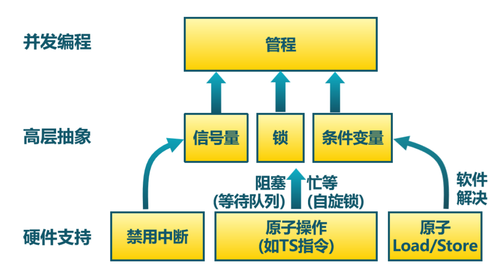
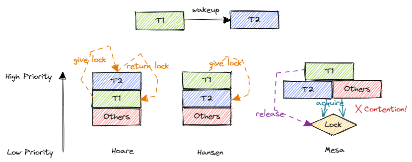

條件變量機制
=========================================

本節導讀
-----------------------------------------

到目前為止，我們已經瞭解了操作系統提供的互斥鎖和信號量兩種同步原語。它們可以用來實現各種同步互斥需求，但是它們比較複雜（特別是信號量），對於程序員的要求較高。如果使用不當，就有可能導致效率低下或者產生競態條件、死鎖或一些不可預測的情況。為了簡化編程，避免錯誤，計算機科學家針對某些情況設計了一種抽象層級較高、更易於使用的同步原語，這就是本節要介紹的條件變量機制。

.. 到目前為止，我們已經瞭解了操作系統提供的互斥鎖和信號量。但在某些情況下，應用程序在使用這兩者時需要非常小心，如果使用不當，就會產生效率低下、競態條件、死鎖或者一些不可預測的情況。為了簡化編程，避免錯誤，計算機科學家針對某些情況設計了一種高層的同步互斥原語。具體而言，在有些情況下，線程需要檢查某一條件（condition）滿足之後，才會繼續執行。

.. 我們來看一個例子，有兩個線程first和second在運行，線程first會把全局變量 A設置為1，而線程second在 ``! A == 0`` 的條件滿足後，才能繼續執行，如下面的偽代碼所示：

條件變量的背景
----------------------------------------------

.. _link-condsync-problem:

首先來看我們需要解決的一類一種同步互斥問題。在信號量一節中提到的 :ref:`條件同步問題 <link-cond-sync>` 的基礎上，有的時候我們還需要基於共享資源的狀態進行同步。如下面的例子所示：

.. code-block:: rust
    :linenos:

    static mut A: usize = 0;
    unsafe fn first() -> ! {
        A = 1;
        ...
    }

    unsafe fn second() -> ! {
        while A == 0 {
          // 忙等直到 A==1
        };
        //繼續執行相關事務
    }

其中，全局變量 ``A`` 初始值為 0。假設兩個線程併發運行，分別執行 ``first`` 和 ``second`` 函數，那麼這裡的同步需求是第二個線程必須等待第一個線程將 ``A`` 修改成 1 之後再繼續執行。 

.. 在上面的例子中，如果線程second先執行，會忙等在while循環中，在操作系統的調度下，線程first會執行並把A賦值為1後，然後線程second再次執行時，就會跳出while循環，進行接下來的工作。配合互斥鎖，可以正確完成上述帶條件的同步流程，如下面的偽代碼所示：

如何實現這種同步需求呢？首先需要注意到全局變量 ``A`` 是一種共享資源，需要用互斥鎖保護它的併發訪問：

.. code-block:: rust
    :linenos:

    unsafe fn first() -> ! {
        mutex_lock(MUTEX_ID);
        A = 1;
        mutex_unlock(MUTEX_ID);
        ...
    }

    unsafe fn second() -> ! {
        mutex_lock(MUTEX_ID);
        while A == 0 { }
        mutex_unlock(MUTEX_ID);
        //繼續執行相關事務
    }

然而，這種實現並不正確。假設執行 ``second`` 的線程先拿到鎖，那麼它需要等到執行 ``first`` 的線程將 ``A`` 改成 1 之後才能退出忙等並釋放鎖。然而，由於線程 ``second`` 一開始就拿著鎖也不會釋放，線程 ``first`` 無法拿到鎖並修改 ``A`` 。這樣，實際上構成了死鎖，線程 ``first`` 可能被阻塞，而線程 ``second`` 一直在忙等，兩個線程無法做任何有意義的事情。

為了解決這個問題，我們需要修改 ``second`` 中忙等時鎖的使用方式：

.. code-block:: rust

    unsafe fn second() -> ! {
        loop {
            mutex_lock(MUTEX_ID);
            if A == 0 {
                mutex_unlock(MUTEX_ID);
            } else {
                mutex_unlock(MUTEX_ID);
                break;
            }
        }
        //繼續執行相關事務
    }

在這種實現中，我們對忙等循環中的每一次對 ``A`` 的讀取獨立加鎖。這樣的話，當 ``second`` 線程發現 ``first`` 還沒有對 ``A`` 進行修改的時候，就可以先將鎖釋放讓 ``first`` 可以進行修改。這種實現是正確的，但是基於忙等會浪費大量 CPU 資源和產生不必要的上下文切換。於是，我們可以利用基於阻塞機制的信號量進一步進行改造：

.. _link-condsync-sem:

.. code-block:: rust
    :linenos:
    :emphasize-lines: 6,16

    // user/src/bin/condsync_sem.rs

    unsafe fn first() -> ! {
        mutex_lock(MUTEX_ID);
        A = 1;
        semaphore_up(SEM_ID);
        mutex_unlock(MUTEX_ID);
        ...
    }

    unsafe fn second() -> ! {
        loop {
            mutex_lock(MUTEX_ID);
            if A == 0 {
                mutex_unlock(MUTEX_ID);
                semaphore_down(SEM_ID);
            } else {
                mutex_unlock(MUTEX_ID);
                break;
            }
        }
        //繼續執行相關事務
    }

按照使用信號量解決條件同步問題的通用做法，我們創建一個 :math:`N=0` 的信號量，其 ID 為 ``SEM_ID`` 。在線程 ``first`` 成功修改 ``A`` 之後，進行 ``SEM_ID`` 的 up 操作喚醒線程 ``second`` ；而在線程 ``second`` 發現 ``A`` 為 0，也即線程 ``first`` 還沒有完成修改的時候，會進行 ``SEM_ID`` 的 down 操作進入阻塞狀態。這樣的話，在線程 ``first`` 喚醒它之前，操作系統都不會調度到它。

上面的實現中有一個非常重要的細節：請同學思考， ``second`` 函數中第 15 行解鎖和第 16 行信號量的 down 操作可以交換順序嗎？顯然是不能的。如果這樣做的話，假設 ``second`` 先拿到鎖，它發現 ``A`` 為 0 就會進行信號量的 down 操作在拿著鎖的情況下進入阻塞。這將會導致什麼問題？如果想要線程 ``second`` 被喚醒，就需要線程 ``first`` 修改 ``A`` 並進行信號量 up 操作，然而前提條件是線程 ``first`` 能拿到鎖。這是做不到的，因為線程 ``second`` 已經拿著鎖進入阻塞狀態了，在被喚醒之前都不會將鎖釋放。於是兩個線程都會進入阻塞狀態，再一次構成了死鎖。可見，這種 **帶著鎖進入阻塞的情形是我們需要特別小心的** 。

從上面的例子可以看出，互斥鎖和信號量能實現很多功能，但是它們對於程序員的要求較高，一旦使用不當就很容易出現難以調試的死鎖問題。對於這種比較複雜的同步互斥問題，就可以用本節介紹的條件變量來解決。

.. 然而，這種實現並不正確，假設執行 ``second`` 的線程先拿到鎖，那麼它會一直忙等在 while 循環中，也不會把鎖釋放。而執行 ``first`` 的線程始終拿不到鎖，也沒有辦法將 ``A`` 改成 1

.. 這種實現能執行，但效率低下，因為線程second會忙等檢查，浪費處理器時間。我們希望有某種方式讓線程second休眠，直到等待的條件滿足，再繼續執行。於是，我們可以寫出如下的代碼：

.. .. code-block:: rust
    :linenos:

    static mut A: usize = 0;
    unsafe fn first() -> ! {
        mutex.lock();
        A=1;
        wakeup(second);
        mutex.unlock();
        ...
    }

    unsafe fn second() -> ! {
        mutex.lock();
        while A==0 { 
           wait();
        };
        mutex.unlock();
        //繼續執行相關事務
    }

.. 粗略地看，這樣就可以實現睡眠等待了。但請同學仔細想想，當線程second在睡眠的時候，mutex是否已經上鎖了？ 確實，線程second是帶著上鎖的mutex進入等待睡眠狀態的。如果這兩個線程的調度順序是先執行線程second，再執行線程first，那麼線程second會先睡眠且擁有mutex的鎖；當線程first執行時，會由於沒有mutex的鎖而進入等待鎖的睡眠狀態。結果就是兩個線程都睡了，都執行不下去，這就出現了 **死鎖** 。

.. 這裡需要解決的兩個關鍵問題： **如何等待一個條件？** 和 **在條件為真時如何向等待線程發出信號** 。我們的計算機科學家給出了 **管程（Monitor）** 和 **條件變量（Condition Variables）** 這種巧妙的方法。接下來，我們就會深入講解條件變量的設計與實現。

管程與條件變量
-------------------------------------------

我們再回顧一下我們需要解決的一類同步互斥問題：首先，線程間共享一些資源，於是必須使用互斥鎖對這些資源進行保護，確保同一時間最多隻有一個線程在資源的臨界區內；其次，我們還希望能夠高效且靈活地支持線程間的條件同步。這應該基於阻塞機制實現：即線程在條件未滿足時將自身阻塞，之後另一個線程執行到了某階段之後，發現條件已經滿足，於是將之前阻塞的線程喚醒。 :ref:`剛剛 <link-condsync-sem>` ，我們用信號量與互斥鎖的組合解決了這一問題，但是這並不是一種通用的解決方案，而是有侷限性的：

- 信號量本質上是一個整數，它不足以描述所有類型的等待條件/事件；
- 在使用信號量的時候需要特別小心。比如，up 和 down 操作必須配對使用。而且在和互斥鎖組合使用的時候需要注意操作順序，不然容易導致死鎖。

.. _term-monitor:

針對這種情況，Brinch Hansen（1973）和 Hoare（1974）結合操作系統和 Concurrent Pascal 編程語言，提出了一種高級同步原語，稱為 **管程** (Monitor)。管程是一個由過程（Procedures，是 Pascal 語言中的術語，等同於我們今天所說的函數）、共享變量及數據結構等組成的一個集合，體現了面向對象思想。編程語言負責提供管程的底層機制，程序員則可以根據需求設計自己的管程，包括自定義管程中的過程和共享資源。在管程幫助下，線程可以更加方便、安全、高效地進行協作：線程只需調用管程中的過程即可，過程會對管程中線程間的共享資源進行操作。需要注意的是，管程中的共享資源不允許直接訪問，而是隻能通過管程中的過程間接訪問，這是在編程語言層面對共享資源的一種保護，與 C++/Java 等語言中類的私有成員類似。

下面這段代碼是 `使用 Concurrent Pascal 語言編寫的管程示例的一部分 <https://en.wikipedia.org/wiki/Concurrent_Pascal#Example>`_ ：

.. code-block:: pascal
    :linenos:

    type
        buffer = Monitor
            { 管程數據成員定義 }
            var
                { 共享資源 }
                saved: Integer;
                full : Boolean;
                { 條件變量 }
                fullq, emptyq: Queue;
                
            { 管程過程定義 }
            procedure entry put(item: Integer);
            begin
                if full then
                    { 條件不滿足，阻塞當前線程 }
                    delay(fullq);
                saved := item;
                full := true;
                { 條件已經滿足，喚醒其他線程 }
                continue(emptyq);
            end;

.. .. note::

    Brinch Hansen（1973）和Hoare（1974）結合操作系統和Concurrent Pascal編程語言，提出了一種高級同步原語，稱為管程（monitor）。一個管程是一個由過程（procedures，Pascal語言的術語，即函數）、共享變量及數據結構等組成的一個集合。線程可以調用管程中的過程，但線程不能在管程之外聲明的過程中直接訪問管程內的數據結構。

    .. code-block:: pascal
        :linenos:

        monitor m1
            integer i;   //共享變量
            condition c; //條件變量

            procedure f1();
              ...       //對共享變量的訪問，以及通過條件變量進行線程間的通知
            end;

            procedure f2();
              ...       //對共享變量的訪問，以及通過條件變量進行線程間的通知
            end;
        end monitor    

那麼，管程是如何滿足互斥訪問和條件同步這兩個要求的呢？

- **互斥訪問** ：區別於 Pascal 語言中的一般過程，管程中的過程使用 ``entry`` 關鍵字（見第 12 行）描述。編程語言保證同一時刻最多隻有一個活躍線程在執行管程中的過程，這保證了線程併發調用管程過程的時候能保證管程中共享資源的互斥訪問。管程是編程語言的組成部分，編譯器知道其特殊性，因此可以採用與其他過程調用不同的方法來處理對管程的調用，比如編譯器可以在管程中的每個過程的入口/出口處自動加上互斥鎖的獲取/釋放操作。這一過程對程序員是透明的，降低了程序員的心智負擔，也避免了程序員誤用互斥鎖而出錯。
- **條件同步** ：管程還支持線程間的條件同步機制，它也是基於阻塞等待的，因而也分成阻塞和喚醒兩部分。對於阻塞而言，第 14 行發現條件不滿足，當前線程需要等待，於是在第 16 行阻塞當前線程；對於喚醒而言，第 17~18 行的執行滿足了某些條件，隨後在第 20 行喚醒等待該條件的線程（如果存在）。

.. _term-condition-variable:

在上面的代碼片段中，阻塞和喚醒操作分別叫做 ``delay`` 和 ``continue`` （分別在第 16 和 20 行），它們都是在數據類型 ``Queue`` 上進行的。這裡的 ``Queue`` 本質上是一個阻塞隊列： ``delay`` 會將當前線程阻塞並加入到該阻塞隊列中；而 ``continue`` 會從該阻塞隊列中移除一個線程並將其喚醒。今天我們通常將這個 ``Queue`` 稱為 **條件變量** (Condition Variable) ，而將條件變量的阻塞和喚醒操作分別叫做 ``wait`` 和 ``signal`` 。

一個管程中可以有多個不同的條件變量，每個條件變量代表多線程併發執行中需要等待的一種特定的條件，並保存所有阻塞等待該條件的線程。注意條件變量與管程過程自帶的互斥鎖是如何交互的：當調用條件變量的 ``wait`` 操作阻塞當前線程的時候，注意到該操作是在管程過程中，因此此時當前線程是持有鎖的。經驗告訴我們 **不要在持有鎖的情況下陷入阻塞** ，因此在陷入阻塞狀態之前當前線程必須先釋放鎖；當被阻塞的線程被其他線程使用 ``signal`` 操作喚醒之後，需要重新獲取到鎖才能繼續執行，不然的話就無法保證管程過程的互斥訪問。因此，站在線程的視角，必須持有鎖才能調用條件變量的 ``wait`` 操作阻塞自身，且 ``wait`` 的功能按順序分成下述多個階段，由編程語言保證其原子性：

- 釋放鎖；
- 阻塞當前線程；
- 當前線程被喚醒之後，重新獲取到鎖。
- ``wait`` 返回，當前線程成功向下執行。

由於互斥鎖的存在， ``signal`` 操作也不只是簡單的喚醒操作。當線程 :math:`T_1` 在執行過程（位於管程過程中）中發現某條件滿足準備喚醒線程 :math:`T_2` 的時候，如果直接讓線程 :math:`T_2` 繼續執行（也位於管程過程中），就會違背管程過程的互斥訪問要求。因此，問題的關鍵是，在 :math:`T_1` 喚醒 :math:`T_2` 的時候， :math:`T_1` 如何處理它正持有的鎖。具體來說，根據相關線程的優先級順序，喚醒操作有這幾種語義：

- Hoare 語義：優先級 :math:`T_2>T_1>\text{other processes}` 。也就是說，當 :math:`T_1` 發現條件滿足之後，立即通過 ``signal`` 喚醒 :math:`T_2` 並 **將鎖轉交** 給 :math:`T_2` ，這樣 :math:`T_2` 就能立即繼續執行，而 :math:`T_1` 則暫停執行並進入一個 *緊急等待隊列* 。當 :math:`T_2` 退出管程過程後會將鎖交回給緊急等待隊列中的 :math:`T_1` ，從而 :math:`T_1` 可以繼續執行。
- Hansen 語義：優先級 :math:`T_1>T_2>\text{other processes}` 。即 :math:`T_1` 發現條件滿足之後，先繼續執行，直到退出管程之前再使用 ``signal`` 喚醒並 **將鎖轉交** 給 :math:`T_2` ，於是 :math:`T_2` 可以繼續執行。注意在 Hansen 語義下， ``signal`` 必須位於管程過程末尾。
- Mesa 語義：優先級 :math:`T_1>T_2=\text{other processes}` 。即 :math:`T_1` 發現條件滿足之後，就可以使用 ``signal`` 喚醒 :math:`T_2` ，但是並 **不會將鎖轉交** 給 :math:`T_2` 。這意味著在 :math:`T_1` 退出管程過程釋放鎖之後， :math:`T_2` 還需要和其他線程競爭，直到搶到鎖之後才能繼續執行。

這些優先級順序如下圖所示：

可以看出， Hoare 和 Hansen 語義的區別在於 :math:`T_1` 和 :math:`T_2` 的優先級順序不同。 Hoare 語義認為被喚醒的線程應當立即執行，而 Hensen 語義則認為應該優先繼續執行當前線程。二者的相同之處在於它們都將鎖直接轉交給喚醒的線程，也就保證了 :math:`T_2` 一定緊跟著 :math:`T_1` 回到管程過程中，於是在 :math:`T_2` **被喚醒之後其等待的條件一定是成立的** （因為 :math:`T_1` 和 :math:`T_2` 中間沒有其他線程），因此 **沒有必要重複檢查條件是否成立就可以向下執行** 。相對的， Mesa 語義中 :math:`T_1` 就不會將鎖轉交給 :math:`T_2` ，而是將鎖釋放讓 :math:`T_2` 和其他同優先級的線程競爭。這樣， :math:`T_1` 和 :math:`T_2` 之間可能存在其他線程，這些線程的執行會影響到共享資源，以至於 :math:`T_2` 搶到鎖繼續執行的時候，它所等待的條件又已經不成立了。所以，在 Mesa 語義下， **wait 操作返回之時不見得線程等待的條件一定成立，有必要重複檢查確認之後再繼續執行** 。

.. note::

    **條件等待應該使用 if/else 還是 while?**

    在使用 ``wait`` 操作進行條件等待的時候，通常有以下兩種方式：

    .. code-block:: c

        // 第一種方法，基於 if/else
        if (!condition) {
            wait();
        } else {
            ...
        }

        // 第二種方法，基於 while
        while (!condition) {
            wait();
        }

    如果基於 if/else 的話，其假定了 ``wait`` 返回之後條件一定已經成立，於是不再做檢查直接向下執行。而基於 while 循環的話，則是無法確定 ``wait`` 返回之後條件是否成立，於是將 ``wait`` 包裹在一個 while 循環中重複檢查直到條件成立。

    根據上面的分析可以，如果條件變量是 Mesa 語義，則必須將 ``wait`` 操作放在 while 循環中；如果是 Hoare/Hansen 語義，則使用 if/else 或者 while 均可。在不能確定條件變量為何種語義的情況下，應使用 while 循環，這樣保證不會出錯。

.. 管程有一個很重要的特性，即任一時刻只能有一個活躍線程調用管程中過程，這一特性使線程在調用執行管程中過程時能保證互斥，這樣線程就可以放心地訪問共享變量。管程是編程語言的組成部分，編譯器知道其特殊性，因此可以採用與其他過程調用不同的方法來處理對管程的調用，比如編譯器可以在管程中的每個過程的入口/出口處加上互斥鎖的加鎖/釋放鎖的操作。因為是由編譯器而非程序員來生成互斥鎖相關的代碼，所以出錯的可能性要小。

.. 管程雖然藉助編譯器提供了一種實現互斥的簡便途徑，但這還不夠，還需要一種線程間的溝通機制。首先是等待機制：由於線程在調用管程中某個過程時，發現某個條件不滿足，那就在無法繼續運行而被阻塞。這裡需要注意的是：在阻塞之前，操作系統需要把進入管程的過程入口處的互斥鎖給釋放掉，這樣才能讓其他線程有機會調用管程的過程。

.. 其次是喚醒機制：另外一個線程可以在調用管程的過程中，把某個條件設置為真，並且還需要有一種機制及時喚醒等待條件為真的阻塞線程。這裡需要注意的是：喚醒線程（本身執行位置在管程的過程中）如果把阻塞線程(其執行位置還在管程的過程中)喚醒了，那麼需要避免兩個活躍的線程都在管程中導致互斥被破壞的情況。為了避免管程中同時有兩個活躍線程，我們需要一定的規則來約定線程發出喚醒操作的行為。目前有三種典型的規則方案：

.. - Hoare語義：線程發出喚醒操作後，馬上阻塞自己，讓新被喚醒的線程運行。注：此時喚醒線程的執行位置還在管程中。
.. - Hansen語義：是執行喚醒操作的線程必須立即退出管程，即喚醒操作只可能作為一個管程過程的最後一條語句。注：此時喚醒線程的執行位置離開了管程。
.. - Mesa語義：喚醒線程在發出行喚醒操作後繼續運行，並且只有它退出管程之後，才允許等待的線程開始運行。注：此時喚醒線程的執行位置還在管程中。

一般情況下條件變量會使用 Hansen 語義，因為它在概念上更簡單，並且更容易實現。其實除了條件變量之外，這幾種語義也作用於其他基於阻塞-喚醒機制的同步原語。例如，前兩節的互斥鎖和信號量就是基於 Hansen 語義實現的，有興趣的同學可以回顧一下。在操作系統中 Mesa 語義也比較常用。

.. 一般開發者會採納Brinch Hansen的建議，因為它在概念上更簡單，並且更容易實現。這種溝通機制的具體實現就是  **條件變量** 和對應的操作：wait和signal。線程使用條件變量來等待一個條件變成真。條件變量其實是一個線程等待隊列，當條件不滿足時，線程通過執行條件變量的wait操作就可以把自己加入到等待隊列中，睡眠等待（waiting）該條件。另外某個線程，當它改變條件為真後，就可以通過條件變量的signal操作來喚醒一個或者多個等待的線程（通過在該條件上發信號），讓它們繼續執行。

早期提出的管程是基於 Concurrent Pascal 語言來設計的，其他語言，如 C 和 Rust 等，並沒有在語言上支持這種機制。對此，我們的做法是從管程中將比較通用的同步原語——條件變量抽取出來，然後再將其和互斥鎖組合使用（手動加入加鎖/解鎖操作代替編譯器），以這種方式模擬原始的管程機制。在目前的 C 語言應用開發中，實際上也是這樣做的。

.. 早期提出的管程是基於Concurrent Pascal來設計的，其他語言，如C和Rust等，並沒有在語言上支持這種機制。我們還是可以用手動加入互斥鎖的方式來代替編譯器，就可以在C和Rust的基礎上實現原始的管程機制了。在目前的C語言應用開發中，實際上也是這麼做的。這樣，我們就可以用互斥鎖和條件變量來重現實現上述的同步互斥例子：

條件變量系統調用
----------------------------------------------------------

於是，我們新增條件變量相關係統調用如下：

.. code-block:: rust

    /// 功能：為當前進程新增一個條件變量。
    /// 返回值：假定該操作必定成功，返回創建的條件變量的 ID 。
    /// syscall ID : 1030
    pub fn sys_condvar_create() -> isize;

    /// 功能：對當前進程的指定條件變量進行 signal 操作，即
    /// 喚醒一個在該條件變量上阻塞的線程（如果存在）。
    /// 參數：condvar_id 表示要操作的條件變量的 ID 。
    /// 返回值：假定該操作必定成功，返回 0 。
    /// syscall ID : 1031
    pub fn sys_condvar_signal(condvar_id: usize) -> isize;

    /// 功能：對當前進程的指定條件變量進行 wait 操作，分為多個階段：
    /// 1. 釋放當前線程持有的一把互斥鎖；
    /// 2. 阻塞當前線程並將其加入指定條件變量的阻塞隊列；
    /// 3. 直到當前線程被其他線程通過 signal 操作喚醒；
    /// 4. 重新獲取當前線程之前持有的鎖。
    /// 參數：mutex_id 表示當前線程持有的互斥鎖的 ID ，而
    /// condvar_id 表示要操作的條件變量的 ID 。
    /// 返回值：假定該操作必定成功，返回 0 。
    /// syscall ID : 1032
    pub fn sys_condvar_wait(condvar_id: usize, mutex_id: usize) -> isize;

這裡，條件變量也被視作進程內的一種資源，進程內的不同條件變量使用條件變量 ID 區分。注意 ``wait`` 操作不僅需要提供條件變量的 ID ，還需要提供線程目前持有的鎖的 ID 。需要注意的是， **我們內核中實現的條件變量是 Mesa 語義的** 。

條件變量的使用方法
-----------------------------------------------------------------

條件同步問題
~~~~~~~~~~~~~~~~~~~~~~~~~~~~~~~~~~~~~~~~~~~~~~~~~~~~~~~~~~~~~~~~~

下面展示瞭如何使用條件變量解決本節開頭提到的 :ref:`條件同步問題 <link-condsync-problem>` ：

.. code-block:: rust
    :linenos:
    :emphasize-lines: 11,21

    // user/src/bin/condsync_condvar.rs

    const CONDVAR_ID: usize = 0;
    const MUTEX_ID: usize = 0;

    unsafe fn first() -> ! {
        sleep(10);
        println!("First work, Change A --> 1 and wakeup Second");
        mutex_lock(MUTEX_ID);
        A = 1;
        condvar_signal(CONDVAR_ID);
        mutex_unlock(MUTEX_ID);
        exit(0)
    }

    unsafe fn second() -> ! {
        println!("Second want to continue,but need to wait A=1");
        mutex_lock(MUTEX_ID);
        while A == 0 {
            println!("Second: A is {}", A);
            condvar_wait(CONDVAR_ID, MUTEX_ID);
        }
        println!("A is {}, Second can work now", A);
        mutex_unlock(MUTEX_ID);
        exit(0)
    }

    #[no_mangle]
    pub fn main() -> i32 {
        // create condvar & mutex
        assert_eq!(condvar_create() as usize, CONDVAR_ID);
        assert_eq!(mutex_blocking_create() as usize, MUTEX_ID);
        ...
    }

第 31 和 32 行我們分別創建要用到的條件變量和互斥鎖。在 ``second`` 中，首先有一層互斥鎖保護，然後由於條件變量是 Mesa 語義的，所以我們需要使用 while 循環進行等待，不符合條件調用 ``condvar_wait`` 阻塞自身的時候還要給出當前持有的互斥鎖的 ID ；在 ``first`` 中，最外層同樣有互斥鎖保護。在修改完成之後只需調用 ``condvar_signal`` 即可喚醒執行 ``second`` 的線程。

**在使用條件變量的時候需要特別注意** :ref:`喚醒丟失 <term-lost-wakeup>` **問題** 。也就是說和信號量不同，如果調用 ``signal`` 的時候沒有任何線程在條件變量的阻塞隊列中，那麼這次 ``signal`` 不會有任何效果，這次喚醒也不會被記錄下來。對於這個例子來說，我們在 ``first`` 中還會修改 ``A`` ，因此如果 ``first`` 先執行，即使其中的 ``signal`` 沒有任何效果，之後執行 ``second`` 的時候也會發現條件已經滿足而不必進入阻塞。 

.. 有了上面的介紹，我們就可以實現條件變量的基本邏輯了。下面是條件變量的wait和signal操作的偽代碼：

.. .. code-block:: rust
    :linenos:

    fn wait(mutex) {
        mutex.unlock();
        <block and enqueue the thread>;
        mutex.lock();
    }

    fn signal() {
       <unblock a thread>; 
    }

.. 條件變量的wait操作包含三步，1. 釋放鎖；2. 把自己掛起；3. 被喚醒後，再獲取鎖。條件變量的signal操作只包含一步：找到掛在條件變量上睡眠的線程，把它喚醒。

.. 注意，條件變量不像信號量那樣有一個整型計數值的成員變量，所以條件變量也不能像信號量那樣有讀寫計數值的能力。如果一個線程向一個條件變量發送喚醒操作，但是在該條件變量上並沒有等待的線程，則喚醒操作實際上什麼也沒做。

同步屏障問題
~~~~~~~~~~~~~~~~~~~~~~~~~~~~~~~~~~~~~~~~~~~~~~~~~~~~~~~~

接下來我們看一個有趣的問題。假設有 3 個線程，每個線程都執行如下 ``thread_fn`` 函數：

.. code-block:: rust

    // user/src/bin/barrier_fail.rs

    fn thread_fn() {
        for _ in 0..300 { print!("a"); }
        for _ in 0..300 { print!("b"); }
        for _ in 0..300 { print!("c"); }
        exit(0)
    }

可以將 ``thread_fn`` 分成打印字符 a、打印字符 b 和打印字符 c 這三個階段。考慮這樣一種同步需求：即在階段間設置 **同步屏障** ，只有 *所有的* 線程都完成上一階段之後，這些線程才能夠進入下一階段。也就是說，如果有線程更早完成了一個階段，那麼它需要等待其他較慢的線程也完成這一階段才能進入下一階段。最後的執行結果應該是所有的 a 被打印出來，然後是所有的 b ，最後是所有的 c 。同學們在向下閱讀之前可以思考如何用我們學過的同步原語來實現這種同步需求。

這裡給出基於互斥鎖和條件變量的一種參考實現：

.. code-block:: rust
    :linenos:

    // user/src/bin/barrier_condvar.rs

    const THREAD_NUM: usize = 3;

    struct Barrier {
        mutex_id: usize,
        condvar_id: usize,
        count: UnsafeCell<usize>,
    }

    impl Barrier {
        pub fn new() -> Self {
            Self {
                mutex_id: mutex_create() as usize,
                condvar_id: condvar_create() as usize,
                count: UnsafeCell::new(0),
            }
        }
        pub fn block(&self) {
            mutex_lock(self.mutex_id);
            let count = self.count.get();
            // SAFETY: Here, the accesses of the count is in the
            // critical section protected by the mutex.
            unsafe { *count = *count + 1; } 
            if unsafe { *count } == THREAD_NUM {
                condvar_signal(self.condvar_id);
            } else {
                condvar_wait(self.condvar_id, self.mutex_id);
                condvar_signal(self.condvar_id);
            }
            mutex_unlock(self.mutex_id);
        }
    }

    unsafe impl Sync for Barrier {}

    lazy_static! {
        static ref BARRIER_AB: Barrier = Barrier::new();
        static ref BARRIER_BC: Barrier = Barrier::new();
    }

    fn thread_fn() {
        for _ in 0..300 { print!("a"); }
        BARRIER_AB.block();
        for _ in 0..300 { print!("b"); }
        BARRIER_BC.block();
        for _ in 0..300 { print!("c"); }
        exit(0)
    }

我們自定義一種 ``Barrier`` 類型，類似於前面講到的管程。這裡的關鍵在於 ``Barrier::block`` 方法。在拿到鎖之後，首先檢查 ``count`` 變量。 ``count`` 變量是一種共享資源，記錄目前有多少線程阻塞在同步屏障中。如果所有的線程都已經到了，那麼當前線程就可以喚醒其中一個；否則就需要先阻塞，在被喚醒之後再去喚醒一個其他的。最終來看會形成一條喚醒鏈。

有興趣的同學可以思考如何用其他同步原語來解決這個問題。

實現條件變量
----------------------------------------------

最後我們來看在我們的內核中條件變量是如何實現的。首先還是將條件變量作為一種資源加入到進程控制塊中：

.. code-block:: rust
    :linenos:
    :emphasize-lines: 7

    // os/src/task/process.rs

    pub struct ProcessControlBlockInner {
        ...
        pub mutex_list: Vec<Option<Arc<dyn Mutex>>>,
        pub semaphore_list: Vec<Option<Arc<Semaphore>>>,
        pub condvar_list: Vec<Option<Arc<Condvar>>>,
    }

條件變量 ``Condvar`` 在數據結構層面上比信號量還簡單，只有一個阻塞隊列 ``wait_queue`` （因此再次強調小心喚醒丟失問題）：

.. code-block:: rust
    :linenos:

    // os/src/sync/condvar.rs

    pub struct Condvar {
        pub inner: UPSafeCell<CondvarInner>,
    }

    pub struct CondvarInner {
        pub wait_queue: VecDeque<Arc<TaskControlBlock>>,
    }

條件變量相關的系統調用也是直接調用 ``Condvar`` 的同名方法實現的，因此這裡我們主要看 ``Condvar`` 的方法：

.. code-block:: rust
    :linenos:
    :emphasize-lines: 17,26

    // os/src/sync/condvar.rs

    impl Condvar {
        pub fn new() -> Self {
            Self {
                inner: unsafe {
                    UPSafeCell::new(CondvarInner {
                        wait_queue: VecDeque::new(),
                    })
                },
            }
        }

        pub fn signal(&self) {
            let mut inner = self.inner.exclusive_access();
            if let Some(task) = inner.wait_queue.pop_front() {
                wakeup_task(task);
            }
        }

        pub fn wait(&self, mutex: Arc<dyn Mutex>) {
            mutex.unlock();
            let mut inner = self.inner.exclusive_access();
            inner.wait_queue.push_back(current_task().unwrap());
            drop(inner);
            block_current_and_run_next();
            mutex.lock();
        }
    }

- 第 4 行的 ``new`` 創建一個空的阻塞隊列；
- 第 14 行的 ``signal`` 從阻塞隊列中移除一個線程並調用喚醒原語 ``wakeup_task`` 將其喚醒。注意如果此時阻塞隊列為空則此操作不會有任何影響；
- 第 21 行的 ``wait`` 接收一個當前線程持有的鎖作為參數。首先將鎖釋放，然後將當前線程掛在條件變量阻塞隊列中，之後調用阻塞原語 ``block_current_and_run_next`` 阻塞當前線程。在被喚醒之後還需要重新獲取鎖，這樣 ``wait`` 才能返回。

.. 我們通過例子來看看如何實際使用條件變量。下面是面向應用程序對條件變量系統調用的簡單使用，可以看到對它的使用與上一節介紹的信號量系統調用類似。 在這個例子中，主線程先創建了初值為1的互斥鎖和一個條件變量，然後再創建兩個線程 First和Second。線程First會先睡眠10ms，而當線程Second執行時，會由於條件不滿足執行條件變量的wait操作而等待睡眠；當線程First醒來後，通過設置A為1，讓線程second等待的條件滿足，然後會執行條件變量的signal操作， 從而能夠喚醒線程Second。這樣線程First和線程Second就形成了一種穩定的同步與互斥關係。

.. 操作系統如何實現條件變量系統調用呢？我們還是採用通常的分析做法：數據結構+方法，即首先考慮一下與此相關的核心數據結構，然後考慮與數據結構相關的相關函數/方法的實現。

.. 在線程的眼裡，條件變量 是一種每個線程能看到的共享資源，且在一個進程中，可以存在多個不同條件變量資源，所以我們可以把所有的條件變量資源放在一起讓進程來管理，如下面代碼第9行所示。這裡需要注意的是： condvar_list: Vec<Option<Arc<Condvar>>> 表示的是條件變量資源的列表。而 Condvar 是條件變量的內核數據結構，由等待隊列組成。操作系統需要顯式地施加某種控制，來確定當一個線程執行wait操作和signal操作時，如何讓線程睡眠或喚醒線程。在這裡，wait操作是由Condvar的wait方法實現，而signal操作是由Condvar的signal方法實現。

參考文獻
--------------------------------------------------------------

- Hansen, Per Brinch (1993). "Monitors and concurrent Pascal: a personal history". HOPL-II: The second ACM SIGPLAN conference on History of programming languages. History of Programming Languages. New York, NY, USA: ACM. pp. 1–35. doi:10.1145/155360.155361. ISBN 0-89791-570-4.
- `Monitor, Wikipedia <https://en.wikipedia.org/wiki/Monitor_(synchronization)>`_
- `Concurrent Pascal, Wikipedia <https://en.wikipedia.org/wiki/Concurrent_Pascal>`_