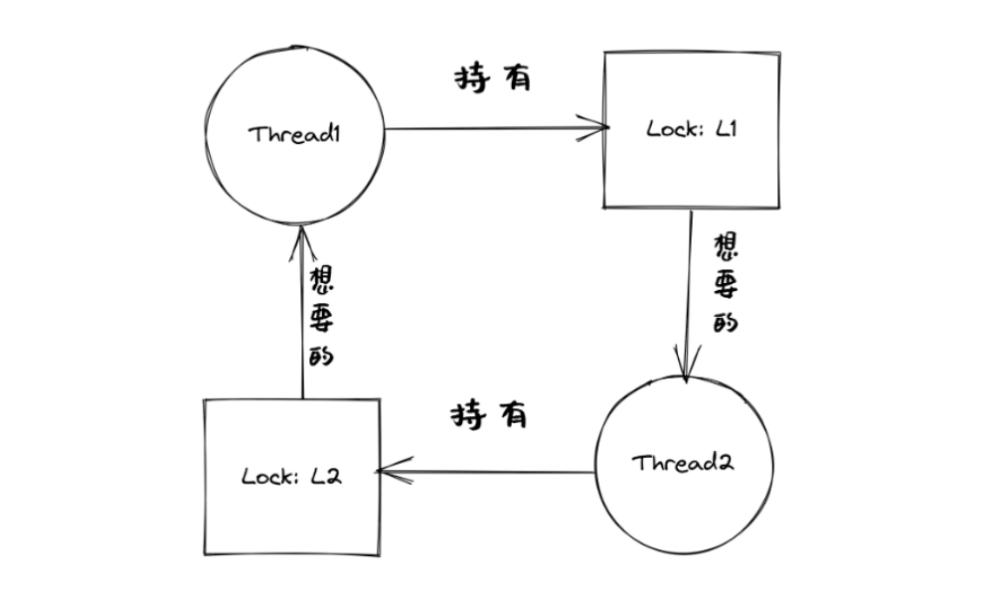

併發中的問題
=========================================

本節導讀
-----------------------------------------

應用程序員在開發併發應用的過程中，經常由於各種 `不小心` 編寫出各種併發缺陷。併發缺陷有很多種，典型的主要有三類：互斥缺陷、同步缺陷和死鎖缺陷。瞭解這些缺陷的模式是寫出健壯、正確併發程序的關鍵。

互斥缺陷
-----------------------------------------

互斥缺陷也稱為違反原子性缺陷，在併發應用程序中對共享變量沒進行合理的保護是導致出現這類缺陷的一個重要原因。下面是一個簡單的例子：

.. code-block:: Rust
    :linenos:
    :emphasize-lines: 4,10

    static mut A: usize = 0;
    //... other code
    unsafe fn thr1() -> ! {
        if (A == 0) {
          println!("thr1: A is Zero  --> {}", A);
        }  
        //... other code
    }
    unsafe fn thr2() -> ! {
        A = A+1;
        println!("thr2: A is One  --> {}", A);
    }

A是共享變量。粗略地看，可以估計執行流程為：第一個線程thr1檢查A的值，如果為0，則顯示“"thr1: A is Zero  --> 0”；第二個線程thr2將A的值由0設置為1（因為除了初始化之外沒有其他地方修改了A的值），並顯示"thr2: A is One  --> 1”。但如果線程thr1執行完第4行代碼，準備執行第5行代碼前發生了線程切換，開始執行線程th2；當線程thr2完成第10行後，操作系統又切換回線程thr1繼續執行，那麼線程thr1就會輸出“thr1: A is Zero  --> 1” 這樣的奇怪結果。

這裡出現問題的根源是線程在對共享變量進行訪問時，違反了臨界區的互斥性（原子性）原則。解決這樣的問題需要給共享變量的訪問加鎖，確保每個線程訪問共享變量時，都持有鎖，修改後的代碼如下：

.. code-block:: Rust
    :linenos:

    static mut A: usize = 0;
    //... other code
    unsafe fn thr1() -> ! {
        mutex.lock();
        if (A == 0) {
          println!("thr1: A is Zero  --> {}", A);
        }
        mutex.unlock();  
        //... other code
    }
    unsafe fn thr2() -> ! {
        mutex.lock();
        A = A+1;
        println!("thr2: A is One  --> {}", A);
        mutex.unlock();  
    }

這種問題如果能發現，那麼修復相對比較簡單，即在對共享變量進行訪問的代碼區域前後加上請求鎖和釋放鎖的操作。但主要的問題是發現缺陷比較難，特別是代碼量比較大，代碼的控制邏輯比較複雜的情況。

同步缺陷
-----------------------------------------

同步缺陷也稱為違反順序缺陷，在併發應用程序中對共享變量訪問的先後順序的可能性沒有充分分析是導致出現這類缺陷的一個重要原因。下面是一個簡單的例子：

.. code-block:: Rust
    :linenos:
    :emphasize-lines: 5,9

    static mut A: usize = 0;
    ...
    unsafe fn thr1() -> ! {
       ...    //在某種情況下會休眠
       A = 1;
       ...
    }
    unsafe fn thr2() -> ! {
       if A==1 {
          println!("Correct");
       }else{
          println!("Panic");
       }
    }
    pub fn main() -> i32 {
       let mut v = Vec::new();
       v.push(thread_create(thr1 as usize, 0));
       sleep(10);
       ...
       v.push(thread_create(thr2 as usize, 0));
       ...
    }

A是共享變量。粗略地看，可以估計執行流程為：線程thr1先被創建，等了10ms後，線程thr2再被創建。一般情況下，這就導致了thr1先於thr2執行，即第5行會先於第9行執行，得到預期的結果。但可能出現一種執行情況：線程thr1在執行第5句前，由於某種原因進入了休眠，導致線程thr2執行第9行在前，線程th1執行第5行在後，導致獲得非預期的錯誤結果。

這裡出現問題的根源是線程在對共享變量進行訪問時，違反了臨界區的預期順序原則。解決這樣的問題需要給線程的相關代碼位置加上同步操作（如通過信號量或條件變量等），確保線程間的執行順序符合預期，修改後的代碼如下：

.. code-block:: Rust
    :linenos:
    :emphasize-lines: 5,9

    static mut A: usize = 0;
    semaphore.value = 0; //信號量初值為0
    unsafe fn thr1() -> ! {
       ...    //在某種情況下會休眠        
       A = 1;
       semaphore.up();
       ...
    }
    unsafe fn thr2() -> ! {
       semaphore.down();  // 需要等待 semaphore.up()的喚醒
       if A==1 {
          println!("Correct");
       }else{
          println!("Panic");
       }
    }
    pub fn main() -> i32 {
       let mut v = Vec::new();
       v.push(thread_create(thr1 as usize, 0));
       sleep(10);
       ...
       v.push(thread_create(thr2 as usize, 0));
       ...
    }

這種問題如果能發現，那麼修復相對也比較簡單，即在線程的代碼區域設置合理的同步操作，讓線程間的執行順序符合預期。但主要的問題還是發現缺陷比較難，特別是代碼量比較大，代碼的控制邏輯比較複雜的情況。

也許有同學說，這樣的錯誤缺陷很容易發現呀，只要開發者在編寫時注意一下，就可以了。但其實不盡然，因為我們這裡給出的是一個刻意簡化的例子，在實際的併發應用程序中，由於代碼量遠大於這個例子，控制邏輯會有循環、跳轉、函數調用等，涉及到的共享變量的數量、訪問操作，以及與互斥/同步操作的關係等會錯綜複雜，難以一下子就能一目瞭然地分析清楚，導致很容易出現互斥和同步缺陷。

死鎖缺陷
-----------------------------------------

除了上面的兩類併發缺陷，還有一類導致程序無法正常執行的併發缺陷 -- 死鎖（Dead lock）。在併發應用中，經常需要線程排他性地訪問若干種資源。大部分死鎖都和不可搶佔的資源相關，這裡把線程需要申請獲取、排他性使用和釋放的對象稱為資源（resource）。需要互斥訪問的共享變量就是一種資源。操作系統通過互斥鎖、信號量或條件變量等同步互斥機制，能授權一個線程（臨時）具有排他地訪問某一種資源的能力。下面是一個死鎖的例子：

.. code-block:: Rust
    :linenos:

    unsafe fn thr1() -> ! {
       mutex1.lock();
       mutex2.lock();
       ...
    }        
    unsafe fn thr2() -> ! {
       mutex2.lock();
       mutex1.lock();
       ...
    }            

當線程thr1持有鎖mutex1，正在等待另外一個鎖mutex2，而線程thr2持有鎖mutex2，正在等待另外一個鎖mutex1時，死鎖就產生了。

對於這個代碼，可以很容易避免死鎖：

.. code-block:: Rust
    :linenos:

    unsafe fn thr1() -> ! {
       mutex1.lock();
       mutex2.lock();
       ...
    }        
    unsafe fn thr2() -> ! {
       mutex1.lock();
       mutex2.lock();
       ...
    }          

只要線程thr1和線程thr2都用相同的請求鎖順序，就不會發生死鎖了。但這與上面的分析一樣，對於實際的複雜程序，發現死鎖就是一個很費勁的事情。目前計算機科學家對死鎖的研究比較深入，指出了死鎖產生的四個必要條件：

- 互斥：線程互斥地訪問資源。
- 持有並等待：線程已持有了部分資源，同時又在等待其他資源。
- 非搶佔：線程已持有的資源不能被搶佔。
- 循環等待：線程之間存在一個資源持有/等待的環，環上每個線程都持有部分資源，而這部分資源又是下一個線程在等待申請的資源。

死鎖預防
~~~~~~~~~~~~~~~~~~~~~~~~~~~~~~~~~~~~~~

如果線程間產生了死鎖，那麼上面四個條件一定會發生。換個角度來看，如果這四個條件中的任意一個沒有滿足，死鎖就不會產生。

一個比較實用的預防死鎖的方法是打破循環等待，具體做法就是給鎖/訪問的資源進行排序，要求每個線程都按照排好的順序依次申請鎖和訪問資源。這種順序性避免了循環等待，也就不會產生死鎖。

死鎖避免
~~~~~~~~~~~~~~~~~~~~~~~~~~~~~~~~~~~~~~

計算機科學家Dijkstra在1965年為THE操作系統設計提出的一種死鎖避免（avoidance）的調度算法，稱為銀行家算法（banker's algorithm）算法的核心是判斷滿足線程的資源請求是否會導致整個系統進入不安全狀態。如果是，就拒絕線程的資源請求；如果滿足請求後系統狀態仍然是安全的，就分配資源給線程。

狀態是安全的，是指存在一個資源分配/線程執行序列使得所有的線程都能獲取其所需資源並完成線程的工作。如果找不到這樣的資源分配/線程執行序列，那麼狀態是不安全的。這裡把線程的執行過程簡化為：申請資源、釋放資源的一系列資源操作。這意味這線程執行完畢後，會釋放其佔用的所有資源。

我們需要知道，不安全狀態並不等於死鎖，而是指有死鎖的可能性。安全狀態和不安全狀態的區別是：從安全狀態出發，操作系統通過調度線程執行序列，能夠保證所有線程都能完成，一定不會出現死鎖；而從不安全狀態出發，就沒有這樣的保證，可能出現死鎖。

.. chyyuu 有一個安全，不安全，死鎖的圖???

銀行家算法的數據結構
^^^^^^^^^^^^^^^^^^^^^^^^^^^^^^^^^^^^^^^^

為了描述操作系統中可利用的資源、所有線程對資源的最大需求、系統中的資源分配，以及所有線程還需要多少資源的情況，需要定義對應的四個數據結構：

- 可利用資源向量 Available：含有 m 個元素的一維數組，每個元素代表可利用的某一類資源的數目，其初值是該類資源的全部可用數目，其值隨該類資源的分配和回收而動態地改變。Available[j] = k，表示第j類資源的可用數量為k。
- 最大需求矩陣Max：n * m矩陣，表示n個線程中，每個線程對m類資源的最大需求量。Max[i,j] = h，表示線程i需要第j類資源的最大數量為h。
- 分配矩陣 Allocation：n * m矩陣，表示每類資源已分配給每個線程的資源數。Allocation[i,j] = g，則表示線程i當前己分得第j類資源的數量為g。
- 需求矩陣Need：n * m的矩陣，表示每個線程還需要的各類資源數量。Need[i,j] = d，則表示線程i還需要第j類資源的數量為d。

上述三個矩陣間存在如下關係:　

Need[i,j] = Max[i,j] - allocation[i, j]

銀行家算法的步驟
^^^^^^^^^^^^^^^^^^^^^^^^^^^^^^^^^^^^^^^^

設 Request是線程的請求資源矩陣，如果 Requesti[i,j] = t，表示線程thr[i]需要t個第j類型的資源。當線程thr[i]發出資源請求後，操作系統的銀行家算法按下述步驟執行:

1. 如果 Request[i,j] ≤ Need[i,j]，則轉步驟2；否則出錯，因為線程所需的資源數已超過它所宣佈的最大值。
2. 如果 Request[i,j] ≤ Available[j]，則轉步驟3；否則，表示尚無足夠資源，線程thr[i]進入等待狀態。
3. 操作系統試著把資源分配給線程thr[i]，並修改下面數據結構中的值：

.. code-block:: Rust
    :linenos:

    Available[j] = Available[j] - Request[i,j];
    Allocation[i,j] = Allocation[i,j] + Request[i,j];
    Need[i,j] = Need[i,j] - Request[i,j];

4. 操作系統執行安全性檢查算法，檢查此次資源分配後系統是否處於安全狀態。若安全，則實際將資源分配給線程thr[i]；否則不進行資源分配，讓線程thr[i]等待。
　　
安全性檢查算法
^^^^^^^^^^^^^^^^^^^^^^^^^^^^^^^^^^^^^^^^

安全性檢查算法如下:

1. 設置兩個向量:工作向量Work，表示操作系統可提供給線程繼續運行所需的各類資源數目，它含有m個元素，初始時，Work = Available；結束向量Finish，表示系統是否有足夠的資源分配給線程，使之運行完成。初始時 Finish[0..n-1] = false，表示所有線程都沒結束；當有足夠資源分配給線程時，設置Finish[i] = true。
2. 從線程集合中找到一個能滿足下述條件的線程

.. code-block:: Rust
   :linenos:

   Finish[i] == false;
   Need[i,j] <= Work[j];

若找到，執行步驟3，否則，執行步驟4。

3. 當線程thr[i]獲得資源後，可順利執行，直至完成，並釋放出分配給它的資源，故應執行:

.. code-block:: Rust
   :linenos:

   Work[j] = Work[j] + Allocation[i,j];
   Finish[i] = true;

跳轉回步驟2

4. 如果Finish[0..=n-1] 都為true，則表示系統處於安全狀態；否則表示系統處於不安全狀態。

通過操作系統調度，如銀行家算法來避免死鎖不是廣泛使用的通用方案。因為從線程執行的一般情況上看，銀行家算法需要提前獲知線程總的資源申請量，以及未來的每一次請求，而這些請求對於一般線程而言在運行前是不可知或隨機的。另外，即使在某些特殊情況下，可以提前知道線程的資源申請量等信息，多重循環的銀行家算法開銷也是很大的，不適合於對性能要求很高的操作系統中。