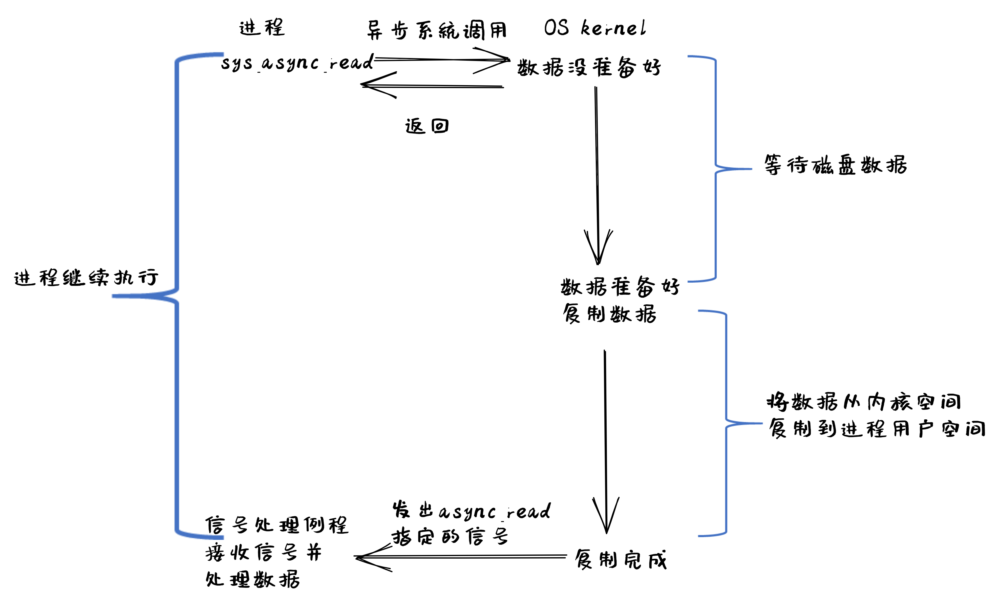

I/O設備
=========================================

本節導讀
-----------------------------------------

本節問首先簡單介紹了一下I/O設備的發展，可以看到設備越來越複雜，越來越多樣化；然後進一步介紹了主要的I/O傳輸方式，這在後續的驅動程序中都會用上；最後介紹了歷史上出現的幾種I/O設備抽象，從而可以理解設備驅動程序的編程基礎所在。

I/O設備概述
-----------------------------------------

I/O設備從早期相對比較簡單的串口、鍵盤和磁盤等，逐步發展壯大，已經形成種類繁多，不同領域的各種類型的設備大家庭。而各種設備之間功能不一，性能差異巨大，難以統一地進行管理，這使得對應I/O設備的設備驅動程序成為了操作系統中最繁雜的部分。

站在不同的角度會對I/O設備有不同的理解。在硬件工程師看來，I/O設備就是一堆芯片、電源和其他電路的組合；而軟件程序員則主要關注I/O設備為軟件提供的接口（interface），即硬件能夠接收的命令、能夠完成的功能以及能產生的各種響應或錯誤等。操作系統重點關注的是如何對I/O設備進行管理，而不是其內部的硬件工作原理。然而，對許多I/O設備進行編程還是不可避免地涉及到其內部的硬件細節。如果對I/O設備的發展過程進行深入分析，是可以找到I/O設備的共性特點，從而可以更好地通過操作系統來管理I/O設備。

I/O設備的發展
~~~~~~~~~~~~~~~~~~~~~~~~~~~

計算機的發展歷史可體現為計算機硬件中各個部件的複雜度和集成度的變化發展過程。而在I/O設備變化過程，除了外設硬件的多樣性越來越廣和集成度越來越高以外，與CPU進行交互的能力也越來越強。在計算機發展過程中，I/O設備先後出現了很多，也消亡了不少。

現在I/O設備的種類繁多，我們可以從數據傳輸的特點來給I/O設備進行分類。早期的UNIX把I/O設備分為兩類：塊設備（block device）和字符設備（character device）。塊設備（比如磁盤）把信息存儲在固定大小的塊中，每個塊有獨立的地址。塊的大小一般在0.5KB至32KB不等。塊設備的I/O傳輸以一個或多個完整的（連續的）塊為單位。另一類I/O設備是字符設備，字符設備（如串口，鍵盤等）以單個字符為單位發送或接收一個字符流。字符設備不需要尋址，只需訪問I/O設備提供的相關接口即可獲得/發出字符信息流。

後來隨著網絡的普及，又出現了一類設備：網絡設備。網絡面向報文而不是面向字符流或數據塊，還具有數據丟失等可靠性問題，因此將網絡設備映射為常見的文件比較困難。為此UNIX的早期繼承者BSD（Berkeley Software Distribution）提出了socket接口和對應操作，形成了事實上的TCP/IP網絡API標準。

再後來隨著個人電腦的普及，計算機已經進入尋常百姓家中，計算機的功能和控制範圍進一步放大，各種類型的I/O設備層出不窮。GPU、聲卡、顯卡等外設已經很難歸類到上述的三種分類中，所以它們也就形成了各自獨立的設備類型。各種設備出現時間有早晚，功能特點各異，這也使得現有的操作系統在設備驅動的設計和實現上面比較繁雜。當前典型的桌面計算機的I/O總體架構如下圖所示：

從CPU與外設的交互方式的發展過程來看，CPU可管理的設備數量越來越多，CPU與設備之間的數據傳遞性能（延遲和吞吐量）也越來越強。總體上看，CPU連接的外設有如下的發展過程：

**簡單設備** 
~~~~~~~~~~~~~~~~~~~~~~~~~~~

計算機發展早期，CPU連接的設備不多，設備性能較低，所以CPU可通過I/O接口（如嵌入式系統中的通用輸入輸出GPIO接口）直接控制I/O設備（如簡單的發光二極管等），這在簡單的單片機和微處理器控制設備中經常見到。其特點是CPU發出I/O命令或數據，可立刻驅動I/O設備併產生相應的效果。

.. note::

   **GPIO**

   GPIO（General-Purpose Input/Output）是一種輸入/輸出接口，可以在微控制器或嵌入式系統上使用。它由一組可編程的引腳組成，可以作為輸入或輸出使用。GPIO引腳可以控制或感測電平，並且可以用於連接各種類型的傳感器和輸出設備，如LED、按鈕、馬達和各種類型的傳感器。
   
   GPIO引腳可以配置為輸入或輸出，並且可以通過軟件控制其電平。在輸入模式下，GPIO引腳可以感測外部電平變化，如按鈕按下或傳感器發出的信號。在輸出模式下，GPIO引腳可以控制外部設備的狀態，如LED亮或滅或電機轉動。GPIO可用於實現軟件定義的功能，這意味著可以在設備驅動程序中來控制GPIO引腳的狀態。

**基於總線的多設備**
~~~~~~~~~~~~~~~~~~~~~~~~~~~

隨著計算機技術的發展，CPU連接的設備越來越多，需要在CPU與I/O設備之間增加了一層--I/O控制器（如串口控制器等）。CPU可通過對I/O控制器進行編程來控制各種設備。其特點是CPU給I/O控制器發出I/O命令或讀寫數據，由I/O控制器來直接控制I/O設備和傳達I/O設備的信息給CPU。CPU還需通過訪問I/O控制器相關寄存器獲取I/O設備的當前狀態。其特點是CPU需要輪詢檢查設備情況，對於低速設備（如串口等）而言，高速CPU和低速設備之間是一種串行執行的過程，導致CPU利用率低。 隨著設備的增多，I/O控制器也逐漸通用化（如各種總線接口等），把不同設備連接在一起，並能把設備間共性的部分進行集中管理。

同時，為了簡化CPU與各種設備的連接，出現了 **總線（bus）** 。總線定義了連接在一起的設備需要共同遵守連接方式和I/O時序等，不同總線（如SPI總線、I2C總線、USB總線、PCI總線等）的連接方式和I/O時序是不同的。

.. note::

   **總線**

   計算機中的總線是一種用於在計算機中連接不同設備的電氣傳輸路徑。它可以用於在計算機的主板和外部設備之間傳輸數據。SPI (Serial Peripheral Interface)、I2C (Inter-Integrated Circuit)、USB (Universal Serial Bus) 和 PCI (Peripheral Component Interconnect) 總線都是用於在電腦和外部設備之間傳輸數據技術，但它們之間有一些顯著的區別。在操作系統的眼裡，總線也是一種設備，需要設備驅動程序對其進行管理控制。
   
   連接方式：
   
   - SPI總線使用四根線來連接設備。它通常使用四條線路，一個用於傳輸數據（MOSI），一個用於接收數據（MISO），一個用於時鐘（SCK），另一個用於選擇設備（SS）。
   - I2C總線使用兩根線來連接設備。它通常使用兩個線路，一個用於傳輸數據（SDA），另一個用於時鐘（SCL）。
   - USB總線是一種通用外部總線，具有即插即用和熱插拔的功能，處理器通過USB控制器與連接在USB上的設備交互。
   - PCI總線使用一條板載總線來連接計算機中處理器（CPU）和周邊設備。這個總線通常是一條板載在主板上的總線，它使用一組插座和插頭來連接設備。

   在速度上，I2C總線的傳輸速度較慢，通常在幾KB/s~幾百KB/s。SPI總線的傳輸速度較快，通常在幾MB/s。USB總線設備的傳輸速度更快，通常在幾MB/s~幾十GB/s。PCI總線的傳輸速度最快，可達到幾GB/s~幾十GB/s。

   在應用領域方面，SPI總線和I2C總線通常用於嵌入式系統中，連接傳感器、顯示器和存儲設備等外設。USB總線和PCI總線通常用於桌面和服務器計算機中，連接打印機、鍵盤、鼠標、硬盤、網卡等外設。

**支持中斷的設備**
~~~~~~~~~~~~~~~~~~~~~~~~~~~

隨著處理器技術的高速發展，CPU與外設的性能差距在加大，為了不讓CPU把時間浪費在等待外設上，即為了解決CPU利用率低的問題，I/O控制器擴展了中斷機制（如Intel推出的8259可編程中斷控制器）。CPU發出I/O命令後，無需輪詢忙等，可以幹其他事情。但外設完成I/O操作後，會通過I/O控制器產生外部中斷，讓CPU來響應這個外部中斷。由於CPU無需一直等待外設執行I/O操作，這樣就能讓CPU和外設並行執行，提高整個系統的執行效率。

.. note::

    **中斷並非總是比PIO好**

    儘管中斷可以做到計算與I/O的重疊，但這僅在快速CPU和慢速設備之間的數據交換速率差異大的情況下上有意義。否則，如果設備的處理速度也很快（比如高速網卡的速率可以達到1000Gbps），那麼額外的中斷處理和中斷上下文切換、進程上下文切換等的代價反而會超過其提高CPU利用率的收益。如果一個或多個設備在短時間內產生大量的外設中斷，可能會使得系統過載，並且讓操作系統應付不過來，從而引發活鎖 [#mr96]_ 。在上述比較特殊的情況下，採用輪詢的方式反而更有效，可以在操作系統自身的調度上提供更多的控制，甚至繞過操作系統直接讓應用管理和控制外設。

**高吞吐量設備**
~~~~~~~~~~~~~~~~~~~~~~~~~~~

外設技術的發展也在加速，某些高性能外設（SSD，網卡等）的性能在逐步提高，如果每次中斷產生的I/O數據傳輸量少，那麼I/O設備（如硬盤/SSD等）要在短期內傳輸大量數據就會頻繁中斷CPU，導致中斷處理的總體開銷很大，系統效率會降低。通過DMA（Direct Memory Access，直接內存訪問）控制器（如Intel推出8237DMA控制器等），可以讓外設在CPU沒有訪問內存的時間段中，以數據塊的方式進行外設和內存之間的數據傳輸，且不需要CPU的干預。這樣I/O設備的傳輸效率就大大提高了。CPU只需在開始傳送前發出DMA指令，並在外設結束DMA操作後響應其發出的中斷信息即可。
   

I/O傳輸方式
--------------------------

在上述的I/O設備發展過程可以看到， CPU主要有三種方式可以與外設進行數據傳輸：Programmed I/O (簡稱PIO)、Interrupt、Direct Memory Access (簡稱DMA)，如下圖所示：

Programmed I/O
~~~~~~~~~~~~~~~~~~~~~~~~

PIO指CPU通過發出I/O指令的方式來進行數據傳輸。PIO方式可以進一步細分為基於Memory-mapped的PIO（簡稱MMIO）和Port-mapped的PIO（簡稱PMIO），MMIO是將I/O設備物理地址映射到內存地址空間，這樣CPU就可以通過普通訪存指令將數據送到I/O設備在主存上的位置，從而完成數據傳輸。

對於採用PMIO方式的I/O設備，它們具有自己獨立的地址空間，與內存地址空間分離。CPU若要訪問I/O設備，則需要使用特殊的I/O指令，如x86處理器中的 ``IN`` 、``OUT`` 指令，這樣CPU直接使用I/O指令，就可以通過PMIO方式訪問設備。

Interrupt based I/O
~~~~~~~~~~~~~~~~~~~~~~~~~~

如果採用PIO方式讓CPU來獲取外設的執行結果，那麼這樣的I/O軟件中有一個CPU讀外設相關寄存器的循環，直到CPU收到可繼續執行I/O操作的外設信息後，CPU才能進一步做其它事情。當外設(如串口)的處理速度遠低於CPU的時候，將使CPU處於忙等的低效狀態中。

中斷機制的出現，極大地緩解了CPU的負擔。CPU可通過PIO方式來通知外設，只要I/O設備有了CPU需要的數據，便會發出中斷請求信號。CPU發完通知後，就可以繼續執行與I/O設備無關的其它事情。中斷控制器會檢查I/O設備是否準備好進行傳輸數據，併發出中斷請求信號給CPU。當CPU檢測到中斷信號，CPU會打斷當前執行，並處理I/O傳輸。下圖顯示了設備中斷的I/O處理流程：

.. _term-dma-tech:

Direct Memory Access
~~~~~~~~~~~~~~~~~~~~~~~~~~

如果外設每傳一個字節都要產生一次中斷，那系統執行效率還是很低。DMA（Direct Memory Access）是一種用於在計算機系統中進行快速數據傳輸的技術。它允許設備直接將數據傳輸到內存中，而不必通過CPU來直接處理。這樣使得CPU從I/O任務中解脫出來，從而提高了系統的整體性能。DMA操作通常由DMA控制器來完成。當CPU需要從內存中讀取或寫入設備數據時，它會提前向DMA控制器發出準備請求，然後DMA控制器會在後續階段直接將數據傳輸到目標位置。下圖顯示了磁盤數據的DMA傳輸的圖示例子：

在後面的小節中，我們會進一步介紹基於I/O控制器的輪詢，中斷等方式的設備驅動的設計與實現。

 .. note::

    **DMA技術工作流程**

    當CPU想與外設交換一塊數據時，它會向DMA控制器發出一條命令。命令的基本內容包括：讀或寫I/O設備的操作標記，I/O設備的地址，DMA內存的起始地址和傳輸長度。然後CPU繼續其它工作。DMA控制器收到命令後，會直接從內存中或向內存傳送整塊數據，這個傳輸過程不再需要通過CPU進行操作。傳送結束後，DMA控制器會通過I/O控制器給CPU發送一個表示DMA操作結束的中斷。CPU在收到中斷後，知道這次I/O操作完成，可進行後續相關事務的處理。

    在後續講解的virtio-blk, virtio-gpu等模擬設備中，就是通過DMA來傳輸數據的。

.. I/O設備的分類
.. ~~~~~~~~~~~~~~~~~~~~~~~~~~~

.. CPU與I/O設備之間的交互
.. ------------------------------------------

.. CPU控制與管理I/O設備的手段是通過對I/O控制器發命令或讀寫特定地址空間來完成的。其處理方式一般有兩種，一種是通過特定的I/O指令，如x86中的 ``in`` 和 ``out ``指令，來訪問I/O控制器；另外一種是通過內存讀寫方式，即MMIO(Memory mapping I/O)，把I/O控制器和各種外設的相關寄存器映射到一段特定的內存空間，通過讀寫這段特定的內存空間來訪問I/O控制器。

.. 第一種通過I/O指令訪問的地址空間是I/O地址空間，這個訪問內存用到的物理地址空間是兩個不同的概念，例如，對於32位的Intel 80386處理器而言，其I/O地址空間為64K，而他的內存所在物理地址空間是4G。這兩個空間是相互正交的。

.. I/O設備想主動通知CPU則主要是通過中斷機制來完成的。比如通過設置時鐘外設的相關時長寄存器，可以讓時鐘在規定的時間間隔到達時，產生一箇中斷，並通過I/O控制器與CPU之間的連接通知到CPU。這樣CPU在執行完一條指令後，就能夠發現中斷的產生，並對外設進行相應的處理。當然，也I/O設備也可被動地“通知”CPU，即CPU主動輪詢I/O設備中與狀態相關的寄存器，從而可以瞭解到I/O設備的工作狀態。

I/O設備抽象
-----------------------------------------

I/O接口的交互協議
~~~~~~~~~~~~~~~~~~~~~~~~~~

對於一個外設而言，它包含了兩部分重要組成部分。第一部分是對外向系統其他部分展現的設備I/O接口（hardware I/O interface），這樣操作系統才能通過接口來管理控制外設。所有設備都有自己的特定接口以及典型交互的協議。第二部分是對內的內部結構，包含了設備相關物理實現。由於外在接口的多樣性，使得操作系統難以統一管理外設。

如果我們不考慮具體的設備，而是站在一個高度抽象的角度來讓軟件管理設備，那麼我們就不用太關注設備的內部結構，而重點考慮設備的接口如何進行簡化。其實一個簡化的抽象設備接口需要包括三部分：狀態、命令、數據。軟件可以讀取並查看設備的當前狀態，從而根據設備當前狀態決定下一步的I/O訪問請求；而軟件是通過一系列的命令來要求設備完成某個具體的I/O訪問請求；在完成一個I/O訪問請求中，會涉及到將數據傳給設備或從設備接收數據。CPU與設備間的I/O接口的交互協議如下所示：

.. code-block:: rust
    :linenos:

    while STATUS == BUSY {};   // 等待設備執行完畢
    DATA =  data;              // 把數據傳給設備
    COMMAND = command;         // 發命令給設備
    while STATUS == BUSY {};   // 等待設備執行完畢

引入中斷機制後，這個簡化的抽象設備接口需要包括四部分：狀態、命令、數據、中斷。CPU與設備間的I/O接口的交互協議如下所示：

.. code-block:: rust
    :linenos:

    DATA =  data;          // 把數據傳給設備
    COMMAND = command;     // 發命令給設備
    do_otherwork();        // 做其它事情
    ...                    // I/O設備完成I/O操作，併產生中斷
    ...                    // CPU執行被打斷以響應中斷
    trap_handler();        // 執行中斷處理例程中的相關I/O中斷處理
    restore_do_otherwork();// 恢復CPU之前被打斷的執行
    ...                    // 可繼續進行I/O操作
    
中斷機制允許CPU的高速計算與外設的慢速I/O操作可以重疊（overlap），CPU不用花費時間等待外設執行的完成，這樣就形成CPU與外設的並行執行，這是提高CPU利用率和系統效率的關鍵。

站在軟件的角度來看，為提高一大塊數據傳輸效率引入的DMA機制並沒有改變抽象設備接口的四個部分。僅僅是上面協議偽碼中的 ``data`` 變成了  ``data block`` 。這樣傳輸單個數據產生的中斷頻度會大大降低，從而進一步提高CPU利用率和系統效率。

.. 本章設計的串口設備是一種真實存在的I/O設備，有著各種各樣的硬件細節需要了解。我們也知道各種I/O設備的種類繁多，差異性很大，使得操作系統難以建立I/O設備抽象，寫出了的設備驅動程序也是千差萬別，能難象操作系統的其他組成部分那樣，把各種I/O設備進行抽象，形成一套統一的接口和功能語義。

這裡描述了站在軟件角度上的抽象設備接口的交互協議。如果站在操作系統的角度，還需把這種設備抽象稍微再具體一點，從而能夠在操作系統中實現對設備的管理。

基於文件的I/O設備抽象
~~~~~~~~~~~~~~~~~~~~~~~~~~~~~

在二十世紀七十到八十年代，計算機專家為此進行了諸多的探索，希望能給I/O設備提供一個統一的抽象。首先是把本來專門針對存儲類I/O設備的文件進行擴展，認為所有的I/O設備都是文件，這就是傳統UNIX中常見的設備文件。所有的I/O設備按照文件的方式進行處理。你可以在Linux下執行如下命令，看到各種各樣的設備文件：

.. code-block:: Shell

   $ ls /dev
   i2c-0 gpiochip0 nvme0 tty0 rtc0 ...

這些設備按照文件的訪問接口（即 ``open/close/read/write`` ）來進行處理。但由於各種設備的功能繁多，僅僅靠 ``read/write`` 這樣的方式很難有效地與設備交互。於是UNIX的後續設計者提出了一個非常特別的系統調用 ``ioctl`` ，即 ``input/output control`` 的含義。它是一個專用於設備輸入輸出操作的系統調用,該調用傳入一個跟設備有關的請求碼，系統調用的功能完全取決於設備驅動程序對請求碼的解讀和處理。比如，CD-ROM驅動程序可以彈出光驅，於是操作系統就可以設定一個ioctl的請求碼來對應這種操作。當應用程序發出帶有CD-ROM設備文件描述符和 **彈出光驅** 請求碼這兩個參數的 ``ioctl`` 系統調用請求後，操作系統中的CD-ROM驅動程序會識別出這個請求碼，並進行彈出光驅的I/O操作。

``ioctl`` 這名字第一次出現在Unix第七版中，他在很多類unix系統（比如Linux、Mac OSX等）都有提供，不過不同系統的請求碼對應的設備有所不同。Microsoft Windows在Win32 API裡提供了相似的函數，叫做DeviceIoControl。

表面上看，基於設備文件的設備管理得到了大部分通用操作系統的支持，且這種 ``ioctl`` 系統調用很靈活，但它的問題是太靈活了，請求碼的定義無規律可循，文件的接口太面向用戶應用，並沒有挖掘出操作系統在進行I/O設備處理過程中的共性特徵。所以文件這個抽象還不足覆蓋到操作系統對設備進行管理的整個執行過程中。

基於流的I/O設備抽象
~~~~~~~~~~~~~~~~~~~~~~~~~~~~~

在二十世紀八十到九十年代的UNIX操作系統的發展過程中，出現了網絡等更加複雜的設備，也隨之出現了 ``流 stream`` 這樣的面向I/O設備管理的抽象。Dennis M. Ritchie在1984年寫了一個技術報告“A Stream Input-Output System”，詳細介紹了基於流的I/O設備的抽象設計。現在看起來，是希望把UNIX中的管道（pipe）機制拓展到內核的設備驅動中。

流是用戶進程和設備或偽設備之間的全雙工連接。它由幾個線性連接的處理模塊（module）組成，類似於一個shell程序中的管道（pipe），用於數據雙向流動。流中的模塊通過向鄰居模塊傳遞消息來進行通信。除了一些用於流量控制的常規變量，模塊不需要訪問其鄰居模塊的其他數據。此外，一個模塊只為每個鄰居提供一個入口點，即一個接受消息的例程。

.. image:: stream.png
   :align: center
   :name: stream

在最接近進程的流的末端是一組例程，它們為操作系統的其餘部分提供接口。用戶進程的寫操作請求和輸入/輸出控制請求被轉換成發送到流的消息，而讀請求將從流中獲取數據並將其傳遞給用戶進程。流的另一端是設備驅動程序模塊。對字符或網絡傳輸而言，從用戶進程以流的方式傳遞數據將被髮送到設備；設備檢測到的字符、網絡包和狀態轉換被合成為消息，並被髮送到流向用戶進程的流中。整個過程會經過多箇中間模塊，這些模塊會以各種方式處理或過濾消息。

在具體實現上，當設備打開時，流中的兩個末端管理的內核模塊自動連接；中間模塊是根據用戶程序的請求動態附加的。為了能夠方便動態地插入不同的流處理模塊，這些中間模塊的讀寫接口遵從相同的語義約束並互相兼容。

每個流處理模塊由一對隊列（queue）組成，每個方向一個隊列。隊列不僅包括數據隊列本身，還包括兩個例程和一些狀態信息。一個是put例程，它由鄰居模塊調用以將消息放入數據隊列中。另一個是服務（service）例程，被安排在有工作要做的時候執行。狀態信息包括指向下游下一個隊列的指針、各種標誌以及指向隊列實例化所需的附加狀態信息的指針。

.. image:: stream-queue.png
   :align: center
   :name: stream-queue

雖然基於流的I/O設備抽象看起來很不錯，但並沒有在其它操作系統中推廣開來。其中的一個原因是UNIX在當時還是一個曲高和寡的高端軟件系統，運行在高端的工作站和服務器上，支持的外設有限。而Windows這樣的操作系統與Intel的x86形成了wintel聯盟，在個人計算機市場被廣泛使用，並帶動了而多媒體，GUI等相關外設的廣泛發展，Windows操作系統並沒有採用流的I/O設備抽象，而是針對每類設備定義了一套Device Driver API接口，提交給外設廠商，讓外設廠商寫好相關的驅動程序，並加入到Windows操作系統中。這種相對實用的做法再加上微軟的號召力讓各種外設得到了Windows操作系統的支持，但也埋下了標準不統一，容易包含bug的隱患。

基於virtio的I/O設備抽象
~~~~~~~~~~~~~~~~~~~~~~~~~~~~~~~~~~~~~~~~

到了二十一世紀，對於操作系統如何有效管理I/O設備的相關探索還在繼續，但環境已經有所變化。隨著互聯網和雲計算的興起，在數據中心的物理服務器上通過虛擬機技術（Virtual Machine Monitor， Hypervisor等），運行多個虛擬機（Virtual Machine），並在虛擬機中運行guest操作系統的模式成為一種主流。但當時存在多種虛擬機技術，如Xen、VMware、KVM等，要支持虛擬化x86、Power等不同的處理器和各種具體的外設，並都要求讓以Linux為代表的guest OS能在其上高效的運行。這對於虛擬機和操作系統來說，實在是太繁瑣和困難了。

IBM資深工程師 Rusty Russell 在開發Lguest（Linux 內核中的的一個hypervisor（一種高效的虛擬計算機的系統軟件）)時，深感寫模擬計算機中的高效虛擬I/O設備的困難，且編寫I/O設備的驅動程序繁雜且很難形成一種統一的表示。於是他經過仔細琢磨，提出了一組通用I/O設備的抽象 -- virtio規範。虛擬機（VMM或Hypervisor）提供virtio設備的實現，virtio設備有著統一的virtio接口，guest操作系統只要能夠實現這些通用的接口，就可以管理和控制各種virtio設備。而虛擬機與guest操作系統的virtio設備驅動程序間的通道是基於共享內存的異步訪問方式來實現的，效率很高。虛擬機會進一步把相關的virtio設備的I/O操作轉換成物理機上的物理外設的I/O操作。這就完成了整個I/O處理過程。

由於virtio設備的設計，使得虛擬機不用模擬真實的外設，從而可以設計一種統一和高效的I/O操作規範來讓guest操作系統處理各種I/O操作。這種I/O操作規範其實就形成了基於virtio的I/O設備抽象，並逐漸形成了事實上的虛擬I/O設備的標準。

外部設備為CPU提供存儲、網絡等多種服務，是計算機系統中除運算功能之外最為重要的功能載體。CPU與外設之間通過某種協議傳遞命令和執行結果；virtio協議最初是為虛擬機外設而設計的IO協議，但是隨著應用範圍逐步擴展到物理機外設，virtio協議正朝著更適合物理機使用的方向而演進。

.. image:: virtio-simple-arch.png
   :align: center
   :name: virtio-simple-arch

由於virtio具有相對的通用性和代表性，本章將進一步分析virtio規範，以及針對多種virtio設備的設備驅動程序，從而對設備驅動程序和操作系統其他部分的關係有一個更全面的瞭解。

.. note::

   Rusty Russell工程師在2008年在“ACM SIGOPS Operating Systems Review”期刊上發表了一篇論文“virtio: towards a de-facto standard for virtual I/O devices”，提出了給虛擬環境（Virtual Machine）中的操作系統提供一套統一的設備抽象，這樣操作系統針對每類設備只需寫一種驅動程序就可以了，這極大降低了系統虛擬機（Virtual Machine Monitor）和Hypervisor，以及運行在它們提供的虛擬環境中的操作系統的開發成本，且可以顯著提高I/O的執行效率。目前virtio已經有相應的規範，最新的virtio spec版本是v1.1。

I/O執行模型
--------------------

從用戶進程的角度看，用戶進程是通過I/O相關的系統調用（簡稱I/O系統調用）來進行I/O操作的。在UNIX環境中，I/O系統調用有多種不同類型的執行模型。根據Richard Stevens的經典書籍“UNIX Network Programming Volume 1: The Sockets Networking ”的6.2節“I/O Models ”的介紹，大致可以分為五種I/O執行模型(I/O Execution Model，簡稱IO Model, IO模型)：

- blocking IO
- nonblocking IO
- IO multiplexing
- signal driven IO
- asynchronous IO

當一個用戶進程發出一個 ``read`` I/O系統調用時，主要經歷兩個階段：

1. 等待數據準備好 (Waiting for the data to be ready)
2. 把數據從內核拷貝到用戶進程中(Copying the data from the kernel to the process)

上述五種IO模型在這兩個階段有不同的處理方式。需要注意，阻塞與非阻塞關注的是進程的執行狀態：

- 阻塞：進程執行系統調用後會被阻塞
- 非阻塞：進程執行系統調用後不會被阻塞

同步和異步關注的是消息通信機制：

- 同步：用戶進程與操作系統（設備驅動）之間的操作是經過雙方協調的，步調一致的
- 異步：用戶進程與操作系統（設備驅動）之間並不需要協調，都可以隨意進行各自的操作

..

阻塞IO（blocking IO）
~~~~~~~~~~~~~~~~~~~~~~~~~~~~~~~~~~~~

基於阻塞IO模型的文件讀系統調用 -- ``read`` 的執行過程如下圖所示：

.. image:: ../../os-lectures/lec13/figs/io-block.png
   :align: center
   :name: io-block

從上圖可以看出執行過程包含如下步驟：

1. 用戶進程發出 ``read`` 系統調用；
2. 內核發現所需數據沒在I/O緩衝區中，需要向磁盤驅動程序發出I/O操作，並讓用戶進程處於阻塞狀態；
3. 磁盤驅動程序把數據從磁盤傳到I/O緩衝區後，通知內核（一般通過中斷機制），內核會把數據從I/O緩衝區拷貝到用戶進程的buffer中，並喚醒用戶進程（即用戶進程處於就緒態）；
4. 內核從內核態返回到用戶態的進程，此時 ``read`` 系統調用完成。

所以阻塞IO（blocking IO）的特點就是用戶進程在I/O執行的兩個階段（等待數據和拷貝數據兩個階段）都是阻塞的。

當然，如果正好用戶進程所需數據位於內存中，那麼內核會把數據從I/O緩衝區拷貝到用戶進程的buffer中，並從內核態返回到用戶態的進程， ``read`` 系統調用完成。這個由於I/O緩衝帶了的優化結果不會讓用戶進程處於阻塞狀態。

非阻塞IO（non-blocking IO）
~~~~~~~~~~~~~~~~~~~~~~~~~~~~~~~~~~~~~~~

基於非阻塞IO模型的文件讀系統調用 -- ``read`` 的執行過程如下圖所示：

.. image:: ../../os-lectures/lec13/figs/io-nonblock.png
   :align: center
   :name: io-nonblock

從上圖可以看出執行過程包含如下步驟：

1. 用戶進程發出 ``read`` 系統調用；
2. 內核發現所需數據沒在I/O緩衝區中，需要向磁盤驅動程序發出I/O操作，並不會讓用戶進程處於阻塞狀態，而是立刻返回一個error；
3. 用戶進程判斷結果是一個error時，它就知道數據還沒有準備好，於是它可以再次發送read操作（這一步操作可以重複多次）；
4. 磁盤驅動程序把數據從磁盤傳到I/O緩衝區後，通知內核（一般通過中斷機制），內核在收到通知且再次收到了用戶進程的system call後，會馬上把數據從I/O緩衝區拷貝到用戶進程的buffer中；
5. 內核從內核態返回到用戶態的進程，此時 ``read`` 系統調用完成。

所以，在非阻塞式IO的特點是用戶進程不會被內核阻塞，而是需要用戶進程不斷的主動詢問內核所需數據準備好了沒有。非阻塞系統調用相比於阻塞系統調用的的差異在於在被調用之後會立即返回。

使用系統調用 ``fcntl( fd, F_SETFL, O_NONBLOCK )`` 可以將對某文件句柄 ``fd`` 進行的讀寫訪問設為非阻塞IO模型的讀寫訪問。

多路複用IO（IO multiplexing）
~~~~~~~~~~~~~~~~~~~~~~~~~~~~~~~~~~~~~~~~~~~~

IO multiplexing對應的I/O系統調用是 ``select`` 和 ``epoll`` 等，也稱這種IO方式為事件驅動IO(event driven IO)。 ``select`` 和 ``epoll`` 的優勢在於，採用單進程方式就可以同時處理多個文件或網絡連接的I/O操作。其基本工作機制就是通過 ``select`` 或 ``epoll`` 系統調用來不斷的輪詢用戶進程關注的所有文件句柄或socket，當某個文件句柄或socket有數據到達了，``select`` 或 ``epoll`` 系統調用就會返回到用戶進程，用戶進程再調用 ``read`` 系統調用，讓內核將數據從內核的I/O緩衝區拷貝到用戶進程的buffer中。

在多路複用IO模型中，對於用戶進程關注的每一個文件句柄或socket，一般都設置成為non-blocking，只是用戶進程是被 ``select`` 或 ``epoll`` 系統調用阻塞住了。``select/epoll`` 的優勢並不會導致單個文件或socket的I/O訪問性能更好，而是在有很多個文件或socket的I/O訪問情況下，其總體效率會高。

基於多路複用IO模型的文件讀的執行過程如下圖所示：

.. image:: ../../os-lectures/lec13/figs/io-multiplex.png
   :align: center
   :name: io-multiplex

信號驅動IO（signal driven I/O）
~~~~~~~~~~~~~~~~~~~~~~~~~~~~~~~~~~~~~~~~~~

當進程發出一個 ``read`` 系統調用時，會向內核註冊一個信號處理函數，然後系統調用返回。進程不會被阻塞，而是繼續執行。當內核中的IO數據就緒時，會發送一個信號給進程，進程便在信號處理函數中調用IO讀取數據。此模型的特點是，採用了回調機制，這樣開發和調試應用的難度加大。

基於信號驅動IO模型的文件讀的執行過程如下圖所示：

.. image:: ../../os-lectures/lec13/figs/io-signal.png
   :align: center
   :name: io-signal

異步IO（Asynchronous I/O）
~~~~~~~~~~~~~~~~~~~~~~~~~~~~~~~~~~~~~~~~~~~~~~~~

用戶進程發起 ``async_read`` 異步系統調用之後，立刻就可以開始去做其它的事。而另一方面，從內核的角度看，當它收到一個 ``async_read`` 異步系統調用之後，首先它會立刻返回，所以不會對用戶進程產生任何阻塞情況。然後，kernel會等待數據準備完成，然後將數據拷貝到用戶內存，當這一切都完成之後，kernel會通知用戶進程，告訴它read操作完成了。

基於異步IO模型的文件讀的執行過程如下圖所示：

.. note::

   **Linux異步IO的歷史** 

   2003年，Suparna Bhattacharya提出了Async I/O在Linux kernel的設計方案，裡面談到了用Full async state machine模型來避免阻塞，把一系列的阻塞點用狀態機來驅動，把用戶態的buffer映射到內核來驅動，這個模型被應用到Linux kernel 2.4中。在出現io_uring 之前，雖然還出現了一系列的異步IO的探索（syslet、LCA、FSAIO、AIO-epoll等），但性能一般，實現和使用複雜，應該說Linux沒有提供完善的異步IO(網絡IO、磁盤IO)機制。io_uring 是由 Jens Axboe提供的異步 I/O 接口，io_uring圍繞高效進行設計，採用一對共享內存ringbuffer用於應用和內核間通信，避免內存拷貝和系統調用。io_uring的實現於 2019 年 5 月合併到了 Linux kernel 5.1 中，現在已經在多個項目中被使用。

五種IO執行模型對比
~~~~~~~~~~~~~~~~~~~~~~~~~~~~~~~

這裡總結一下阻塞IO、非阻塞IO、同步IO、異步IO的特點：

- 阻塞IO：在用戶進程發出IO系統調用後，進程會等待該IO操作完成，而使得進程的其他操作無法執行。
- 非阻塞IO：在用戶進程發出IO系統調用後，如果數據沒準備好，該IO操作會立即返回，之後進程可以進行其他操作；如果數據準備好了，用戶進程會通過系統調用完成數據拷貝並接著進行數據處理。
- 同步IO：導致請求進程阻塞/等待，直到I/O操作完成。
- 異步IO：不會導致請求進程阻塞。

從上述分析可以得知，阻塞和非阻塞的區別在於內核數據還沒準備好時，用戶進程是否會阻塞（第一階段是否阻塞）；同步與異步的區別在於當數據從內核copy到用戶空間時，用戶進程是否會阻塞/參與（第二階段是否阻塞）。

所以前述的阻塞IO（blocking IO），非阻塞IO（non-blocking IO），多路複用IO（IO multiplexing），信號驅動IO都屬於同步IO（synchronous IO）。這四種模型都有一個共同點：在第二階段阻塞/參與，也就是在真正IO操作 ``read`` 的時候需要用戶進程參與，因此以上四種模型均稱為同步IO模型。

有人可能會說，執行非阻塞IO系統調用的用戶進程並沒有被阻塞。其實這裡定義中所指的 **IO操作** 是指實際的 **IO操作** 。比如，非阻塞IO在執行 ``read`` 系統調用的時候，如果內核中的IO數據沒有準備好，這時候不會block進程。但是當內核中的IO數據準備好且收到用戶進程發出的 ``read`` 系統調用時（處於第二階段）， 內核中的 ``read`` 系統調用的實現會將數據從kernel拷貝到用戶內存中，這個時候進程是可以被阻塞的。

而異步IO則不一樣，當用戶進程發起IO操作之後，就直接返回做其它事情去了，直到內核發送一個通知，告訴用戶進程說IO完成。在這整個過程中，用戶進程完全沒有被阻塞。

.. [#mr96] Jeffrey Mogul and K. K. Ramakrishnan, Eliminating Receive Livelock in an Interrupt-driven Kernel, USENIX ATC 1996, San Diego, CA, January 1996