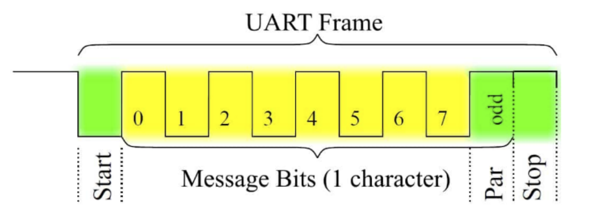

串口驅動程序
=========================================

本節導讀
-----------------------------------------

現在我們對如何瞭解計算機系統中給的外設信息，以及如何初始化或與外設進行交互有了基本的瞭解。接下來，我們需要看看如何在完整的操作系統中通過添加設備驅動程序來擴展應用訪問外設的I/O能力。本節將通過介紹一個具體的物理設備串口的驅動程序的設計與實現，來分析如何在操作系統中添加設備驅動程序。

串口驅動程序
------------------------------------

我們要管理是串口(UART)物理設備。我們在第一章其實就接觸了串口，但當時是通過RustSBI來幫OS完成對串口的訪問，即OS只需發出兩種SBI調用請求就可以輸出和獲取字符了。但這種便捷性是有代價的。比如OS在調用獲取字符的SBI調用請求後，RustSBI如果沒收到串口字符，會返回 ``-1`` ，這樣OS只能採用類似輪詢的方式來繼續查詢。到第七章為止的串口驅動不支持中斷是導致在多進程情況下，系統效率低下的主要原因之一。大家也不要遺憾，我們的第一階段的目標是 **Just do it** ，先把OS做出來。在本節，我們需要逐步改進優化對串口的操作了。

串口（Universal Asynchronous Receiver-Transmitter，簡稱UART）是一種在嵌入式系統中常用的用於傳輸、接收系列數據的外部設備。串行數據傳輸是逐位（bit）順序發送數據的過程。瞭解QEMU模擬的兼容NS16550A硬件規範 [#UART1]_ [#UART2]_  是寫驅動程序的準備工作，建議同學們先閱讀一下。每個UART使用8個I/O字節來訪問其寄存器。下表 [#UART1]_ 顯示了UART中每個寄存器的地址和基本含義。表中使用的 `base` 是串口設備的起始地址。在QEMU模擬的virt計算機中串口設備寄存器的MMIO起始地址為 ``0x10000000`` 。

+-----------+-----------------------------------+------------------------------+-----------------------------------+----------------------------+
| I/O port  | Read (DLAB=0)                     | Write (DLAB=0)               | Read (DLAB=1)                     | Write (DLAB=1)             |
+===========+===================================+==============================+===================================+============================+
| base      | **RBR** receiver buffer           | **THR** transmitter holding  | **DLL** divisor latch LSB         | **DLL** divisor latch LSB  |
+-----------+-----------------------------------+------------------------------+-----------------------------------+----------------------------+
| base+1    | **IER** interrupt enable          | **IER** interrupt enable     | **DLM** divisor latch MSB         | **DLM** divisor latch MSB  |
+-----------+-----------------------------------+------------------------------+-----------------------------------+----------------------------+
| base+2    | **IIR** interrupt identification  | **FCR** FIFO control         | **IIR** interrupt identification  | **FCR** FIFO control       |
+-----------+-----------------------------------+------------------------------+-----------------------------------+----------------------------+
| base+3    | **LCR** line control              | **LCR** line control         | **LCR** line control              | **LCR** line control       |
+-----------+-----------------------------------+------------------------------+-----------------------------------+----------------------------+
| base+4    | **MCR** modem control             | **MCR** modem control        | **MCR** modem control             | **MCR** modem control      |
+-----------+-----------------------------------+------------------------------+-----------------------------------+----------------------------+
| base+5    | **LSR** line status               | *factory test*               | **LSR** line status               | *factory test*             |
+-----------+-----------------------------------+------------------------------+-----------------------------------+----------------------------+
| base+6    | **MSR** modem status              | *not used*                   | **MSR** modem status              | *not used*                 |
+-----------+-----------------------------------+------------------------------+-----------------------------------+----------------------------+
| base+7    | **SCR** scratch                   | **SCR** scratch              | **SCR** scratch                   | **SCR** scratch            |
+-----------+-----------------------------------+------------------------------+-----------------------------------+----------------------------+

注：LCR 寄存器中的 DLAB 位設置為 0 或 1 ，會導致CPU訪問的是不同的寄存器。比如，DLAB位為0時，讀位於 `base` 處的串口寄存器是 `RBR`， DLAB位為1時，讀位於 `base` 處的串口寄存器是 `DLL`。

大致猜測完上述寄存器的含義後，我們就算是完成前期準備工作，在接下來的驅動程序設計中，會用到上述的部分寄存器。
我們先嚐試脫離RustSBI的幫助，在操作系統中完成支持中斷機制的串口驅動。

通過查找 ``dtc`` （Device Tree Compiler）工具生成的 ``riscv64-virt.dts`` 文件，我們可以看到串口設備相關的MMIO模式的寄存器信息和中斷相關信息。

.. code-block:: shell
   
   ...
   chosen {
     bootargs = [00];
     stdout-path = "/uart@10000000";
   };

   uart@10000000 {
     interrupts = <0x0a>;
     interrupt-parent = <0x02>;
     clock-frequency = <0x384000>;
     reg = <0x00 0x10000000 0x00 0x100>;
     compatible = "ns16550a";
   };

``chosen`` 節點的內容表明字符輸出會通過串口設備打印出來。``uart@10000000`` 節點表明串口設備中寄存器的MMIO起始地址為 ``0x10000000`` ，範圍在 ``0x00~0x100`` 區間內，中斷號為 ``0x0a`` 。 ``clock-frequency`` 表示時鐘頻率，其值為0x38400 ，即3.6864 MHz。 ``compatible = "ns16550a"`` 表示串口的硬件規範兼容NS16550A。

在如下情況下，串口會產生中斷：

- 有新的輸入數據進入串口的接收緩存
- 串口完成了緩存中數據的發送
- 串口發送出現錯誤

這裡我們僅關注有輸入數據時串口產生的中斷。

在 UART 中，可訪問的 I/O寄存器一共有8個。訪問I/O寄存器的方法把串口寄存器的MMIO起始地址加上偏移量，就是各個寄存器的MMIO地址了。

串口設備初始化
~~~~~~~~~~~~~~~~~~~~~~~~~~~~~~~~~~~~~~~~~

對串口進行初始化設置的相關代碼如下所示：

.. code-block:: Rust
   :linenos:

   // os/src/drivers/chardev/mod.rs
   ...
   lazy_static! {
      pub static ref UART: Arc<CharDeviceImpl> = Arc::new(CharDeviceImpl::new());
   }
   // os/src/boards/qemu.rs
   pub type CharDeviceImpl = crate::drivers::chardev::NS16550a<VIRT_UART>;
   // os/src/drivers/chardev/ns16550a.rs
   impl<const BASE_ADDR: usize> NS16550a<BASE_ADDR> {
      pub fn new() -> Self {
         let mut inner = NS16550aInner {
               ns16550a: NS16550aRaw::new(BASE_ADDR),
               read_buffer: VecDeque::new(),
         };
         inner.ns16550a.init();
         Self {
               inner: unsafe { UPIntrFreeCell::new(inner) },
               condvar: Condvar::new(),
         }
      }
   }
   ...
   impl NS16550aRaw {
      pub fn init(&mut self) {
         let read_end = self.read_end();
         let mut mcr = MCR::empty();
         mcr |= MCR::DATA_TERMINAL_READY;
         mcr |= MCR::REQUEST_TO_SEND;
         mcr |= MCR::AUX_OUTPUT2;
         read_end.mcr.write(mcr);
         let ier = IER::RX_AVAILABLE;
         read_end.ier.write(ier);
      }
   }

上述代碼完成的主要工作包括：

.. chyyuu 需要更新！！！
   1. 設置每次傳輸的位數為 8 位，即一個 ASCII 碼的大小
   2. 激活先進先出隊列
   3. 使能中斷，這意味著我們的輸入可以通過中斷進行通知
   4. 設置輸入產生的中斷頻率

串口設備輸入輸出操作
~~~~~~~~~~~~~~~~~~~~~~~~~~~~~~~~~~~~~~~~~

先看串口輸出，由於不設置和處理輸出後產生中斷的情況，使得整個輸出操作比較簡單。即向偏移量為 ``0`` 的串口控制寄存器的MMIO地址寫8位字符即可。

.. code-block:: Rust
   :linenos:

   // os/src/drivers/chardev/ns16550a.rs

   impl<const BASE_ADDR: usize> CharDevice for NS16550a<BASE_ADDR> {
      fn write(&self, ch: u8) {
         let mut inner = self.inner.exclusive_access();
         inner.ns16550a.write(ch);
      }
   impl NS16550aRaw {
      pub fn write(&mut self, ch: u8) {
         let write_end = self.write_end();
         loop {
               if write_end.lsr.read().contains(LSR::THR_EMPTY) {
                  write_end.thr.write(ch);
                  break;
               }
         }
      }
   

.. chyyuu 在我們的具體實現中，與上述的一般中斷處理過程不太一樣。首先操作系統通過自定義的 ``SBI_DEVICE_HANDLER`` SBI調用，告知RustSBI在收到外部中斷後，要跳轉到的操作系統中處理外部中斷的函數 ``device_trap_handler`` 。這樣，在外部中斷產生後，先由RustSBI在M Mode下接收的，並轉到S Mode，交由 ``device_trap_handler`` 內核函數進一步處理。

在以往的操作系統實現中，當一個進程通過 ``sys_read`` 系統調用來獲取串口字符時，並沒有用上中斷機制。但一個進程讀不到字符的時候，將會被操作系統調度到就緒隊列的尾部，等待下一次執行的時刻。這其實就是一種變相的輪詢方式來獲取串口的輸入字符。這裡其實是可以對進程管理做的一個改進，來避免進程通過輪詢的方式檢查串口字符輸入。既然我們已經在上一章設計實現了讓用戶態線程掛起的同步互斥機制，我們就可以把這種機制也用在內核中，在外設不能及時提供資源的情況下，讓想獲取資源的線程或進程掛起，直到外設提供了資源，再喚醒線程或進程繼續執行。

目前，支持中斷的驅動可有效地支持等待的進程喚醒的操作。以串口為例，如果一個進程通過系統調用想獲取串口輸入，但此時串口還沒有輸入的字符，那麼操作系統就設置一個進程等待串口輸入的條件變量（條件變量包含一個等待隊列），然後把當前進程設置等待狀態，並掛在這個等待隊列上，再把CPU讓給其它就緒進程執行。對於串口輸入的處理，由於要考慮中斷，相對就要複雜一些。讀字符串的代碼如下所示：

.. code-block:: Rust
   :linenos:

   //os/src/fs/stdio.rs
   impl File for Stdin {
      ...
      fn read(&self, mut user_buf: UserBuffer) -> usize {
         assert_eq!(user_buf.len(), 1);
         //println!("before UART.read() in Stdin::read()");
         let ch = UART.read();
         unsafe {
               user_buf.buffers[0].as_mut_ptr().write_volatile(ch);
         }
         1
      }
   // os/src/drivers/chardev/ns16550a.rs
   impl<const BASE_ADDR: usize> CharDevice for NS16550a<BASE_ADDR> {
      fn read(&self) -> u8 {
         loop {
               let mut inner = self.inner.exclusive_access();
               if let Some(ch) = inner.read_buffer.pop_front() {
                  return ch;
               } else {
                  let task_cx_ptr = self.condvar.wait_no_sched();
                  drop(inner);
                  schedule(task_cx_ptr);
               }
         }
      }

響應串口輸入中斷的代碼如下所示：

.. code-block:: Rust
   :linenos:

   // os/src/boards/qemu.rs
   pub fn irq_handler() {
      let mut plic = unsafe { PLIC::new(VIRT_PLIC) };
      let intr_src_id = plic.claim(0, IntrTargetPriority::Supervisor);
      match intr_src_id {
         ...
         10 => UART.handle_irq(),
      }
      plic.complete(0, IntrTargetPriority::Supervisor, intr_src_id);
   }
   // os/src/drivers/chardev/ns16550a.rs
   impl<const BASE_ADDR: usize> CharDevice for NS16550a<BASE_ADDR> {
      fn handle_irq(&self) {
         let mut count = 0;
         self.inner.exclusive_session(|inner| {
               while let Some(ch) = inner.ns16550a.read() {
                  count += 1;
                  inner.read_buffer.push_back(ch);
               }
         });
         if count > 0 {
               self.condvar.signal();
         }
      }

對於操作系統的一般處理過程是，首先是能接收中斷，即在 ``trap_handler`` 中通過訪問 ``scause`` 寄存器，能夠識別出有外部中斷產生。然後再進一步通過讀PLIC的 ``Claim`` 寄存器來了解是否是收到了串口發來的輸入中斷。如果PLIC識別出是串口，就會調用串口的中斷處理例程。
當產生串口有輸入併產生中斷後，操作系統通過對偏移量為 ``0`` 的串口寄存器的進行讀操作，從而獲得通過串口輸入的字符，並存入 ``NS16550aInner::read_buffer`` 中。然後操作系統將查找等待串口輸入的等待隊列上的進程，把它喚醒並加入到就緒隊列中。這樣但這個進程再次執行時，就可以獲取到串口數據了。

.. [#UART1] Serial UART information， https://www.lammertbies.nl/comm/info/serial-uart
.. [#UART2] TECHNICAL DATA ON 16550， http://www.byterunner.com/16550.html
