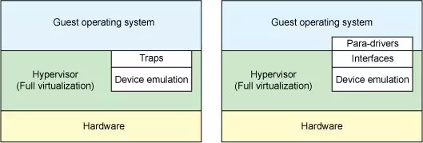
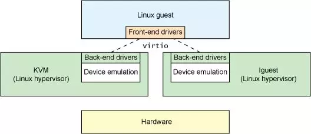
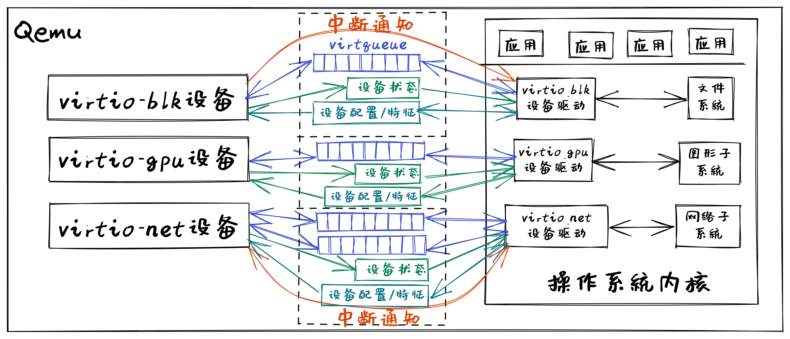
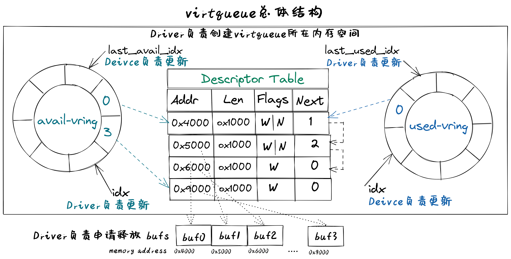
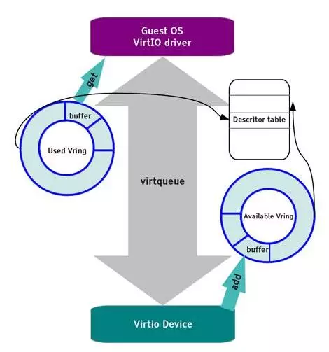

virtio設備驅動程序
=========================================

本節導讀
-----------------------------------------

本節主要介紹了QEMU模擬的RISC-V計算機中的virtio設備的架構和重要組成部分，以及面向virtio設備的驅動程序主要功能；並對virtio-blk設備及其驅動程序，virtio-gpu設備及其驅動程序進行了比較深入的分析。這裡選擇virtio設備來進行介紹，主要考慮基於兩點考慮，首先這些設備就是QEMU模擬的高性能物理外設，操作系統可以面向這些設備編寫出合理的驅動程序（如Linux等操作系統中都有virtio設備的驅動程序，並被廣泛應用於雲計算虛擬化場景中。）；其次，各種類型的virtio設備，如塊設備（virtio-blk）、網絡設備（virtio-net）、鍵盤鼠標類設備（virtio-input）、顯示設備（virtio-gpu）具有對應外設類型的共性特徵、專有特徵和與具體處理器無關的設備抽象性。通過對這些設備的分析和比較，能夠比較快速地掌握各類設備的核心特點，並掌握編寫裸機或操作系統驅動程序的關鍵技術。

virtio設備
-----------------------------------------

virtio概述
~~~~~~~~~~~~~~~~~~~~~~~~~~~~~~~~~~~~

.. chyyuu https://blogs.oracle.com/linux/post/introduction-to-virtio
   https://docs.oasis-open.org/virtio/virtio/v1.1/csprd01/virtio-v1.1-csprd01.html
   https://ozlabs.org/~rusty/virtio-spec/virtio-paper.pdf
   
Rusty Russell 在2008年左右設計了virtio協議，並開發了相應的虛擬化解決方案 lguest，形成了VirtIO規範（Virtual I/O Device Specification）。其主要目的是為了簡化和統一虛擬機（Hypervisor）的設備模擬，並提高虛擬機環境下的I/O性能。virtio 協議是對hypervisor 中的一組通用模擬設備的抽象，即virtio協議定義了虛擬設備的輸入/輸出接口。而基於virtio協議的I/O設備稱為virtio設備。下圖列出了兩種在虛擬機中模擬外設的總體框架。

.. chyyuu https://cloud.tencent.com/developer/article/1065771 virtio 簡介

在上圖左側的虛擬機模擬外設的傳統方案中，如果guest VM 要使用底層 host主機的資源，需要 Hypervisor 截獲所有的I/O請求指令，然後模擬出這些I/O指令的行為，這會帶來較大的性能開銷。

.. note::

   **虛擬機（Virtual Machine，VM）**
   
   虛擬機是物理計算機的虛擬表示形式或仿真環境。 虛擬機通常被稱為訪客機（Guest Machine，簡稱Guest）或訪客虛擬機（Guest VM），而它們運行所在的物理計算機被稱為主機（Host Machine，簡稱Host）。

   **虛擬機監視器 Hypervisor**

   虛擬機監視器（Hypervisor或Virtual Machine Monitor，簡稱VMM）是創造並且運行虛擬機的軟件、固件、或者硬件。這樣主機硬件上能同時運行一個至多個虛擬機，這些虛擬機能高效地分享主機硬件資源。

在上圖右側的虛擬機模擬外設的virtio方案中，模擬的外設實現了功能最小化，即虛擬外設的數據面接口主要是與guest VM 共享的內存、控制面接口主要基於內存映射的寄存器和中斷機制。這樣guest VM 通過訪問虛擬外設來使用底層 host主機的資源時，Hypervisor只需對少數寄存器訪問和中斷機制進行處理，實現了高效的I/O虛擬化過程。

.. note::

   **數據面（Data Plane）**

   設備與處理器之間的I/O數據傳輸相關的數據設定（地址、佈局等）與傳輸方式（基於內存或寄存器等）

   **控制平面（Control Plane）**

   處理器發現設備、配置設備、管理設備等相關的操作，以及處理器和設備之間的相互通知機制。

另外，各種類型的virtio設備，如塊設備（virtio-blk）、網絡設備（virtio-net）、鍵盤鼠標類設備（virtio-input）、顯示設備（virtio-gpu）具有共性特徵和獨有特徵。對於共性特徵，virtio設計了各種類型設備的統一抽象接口，而對於獨有特徵，virtio儘量最小化各種類型設備的獨有抽象接口。這樣，virtio就形成了一套通用框架和標準接口（協議）來屏蔽各種hypervisor的差異性，實現了guest VM和不同hypervisor之間的交互過程。

上圖意味著什麼呢？它意味著在guest VM 上看到的虛擬設備具有簡潔通用的優勢，這對運行在guest VM上的操作系統而言，可以設計出輕量高效的設備驅動程序（即上圖的 Front-end drivers）。

從本質上講，virtio是一個接口，允許運行在虛擬機上的操作系統和應用軟件通過訪問 virtio 設備使用其主機的設備。這些 virtio 設備具備功能最小化的特徵，Guest VM中的設備驅動程序（Front-end drivers只需實現基本的發送和接收I/O數據即可，而位於Hypervisor中的Back-end drivers和設備模擬部分讓主機處理其實際物理硬件設備上的大部分設置、維護和處理。這種設計方案極大減輕了virtio驅動程序的複雜性。

virtio設備是虛擬外設，存在於QEMU模擬的RISC-V 64 virt 計算機中。而我們要在操作系統中實現virtio驅動程序，來管理和控制這些virtio虛擬設備。每一類virtio設備都有自己的virtio接口，virtio接口包括了數據結構和相關API的定義。這些定義中，有共性內容，也有屬於設備特定類型的非共性內容。

virtio架構
~~~~~~~~~~~~~~~~~~~~~~~~~~~~~~~~~~~~

總體上看，virtio 架構可以分為上中下三層，上層包括運行在QEMU模擬器上的前端操作系統中各種驅動程序（Front-end drivers）；下層是在QEMU中模擬的各種虛擬設備 Device；中間層是傳輸（transport）層，就是驅動程序與虛擬設備之間的交互接口，包含兩部分：上半部是virtio接口定義，即I/O數據傳輸機制的定義：virtio 虛擬隊列（virtqueue）；下半部是virtio接口實現，即I/O數據傳輸機制的具體實現：virtio-ring，主要由環形緩衝區和相關操作組成，用於保存驅動程序和虛擬設備之間進行命令和數據交互的信息。

.. image:: virtio-arch.png
   :align: center
   :name: virtio-arch

操作系統中virtio 驅動程序的主要功能包括：

- 接受來自用戶進程或操作系統其它組件發出的 I/O 請求
- 將這些 I/O 請求通過virqueue發送到相應的 virtio 設備
- 通過中斷或輪詢等方式查找並處理相應設備完成的I/O請求

Qemu或Hypervisor中virtio 設備的主要功能包括：

- 通過virqueue接受來自相應 virtio 驅動程序的 I/O 請求
- 通過設備仿真模擬或將 I/O 操作卸載到主機的物理硬件來處理I/O請求，使處理後的I/O數據可供 virtio 驅動程序使用
- 通過寄存器、內存映射或中斷等方式通知virtio 驅動程序處理已完成的I/O請求

運行在Qemu中的操作系統中的virtio 驅動程序和Qemu模擬的virtio設備驅動的關係如下圖所示：

I/O設備基本組成結構
~~~~~~~~~~~~~~~~~~~~~~~~~~~~~~~~~~~~

virtio設備代表了一類I/O通用設備，為了讓設備驅動能夠管理和使用設備。在程序員的眼裡，I/O設備基本組成結構包括如下恩利：

- 呈現模式：設備一般通過寄存器、內存或特定I/O指令等方式讓設備驅動能看到和訪問到設備；
- 特徵描述：讓設備驅動能夠了解設備的靜態特性（可通過軟件修改），從而決定是否或如何使用該設備；
- 狀態表示：讓設備驅動能夠了解設備的當前動態狀態，從而確定如何進行設備管理或I/O數據傳輸；
- 交互機制：交互包括事件通知和數據傳輸；對於事件通知，讓設備驅動及時獲知設備的狀態變化的機制（可基於中斷等機制），以及讓設備及時獲得設備驅動發出的I/O請求（可基於寄存器讀寫等機制）；對於數據傳輸，讓設備驅動能處理設備給出的數據，以及讓設備能處理設備驅動給出的數據，如（可基於DMA或virtqueue等機制）。

virtio設備具體定義了設備驅動和設備之間的接口，包括設備呈現模式、設備狀態域、特徵位、通知、設備配置空間、虛擬隊列等，覆蓋了上述的基本接口描述。

virtio設備基本組成要素
~~~~~~~~~~~~~~~~~~~~~~~~~~~~~~~~~~~~~~~~~~~~~~~~~~~~~~~~

virtio設備的基本組成要素如下：

- 設備狀態域（Device status field）
- 特徵位（Feature bits）
- 通知（Notifications）
- 設備配置空間（Device Configuration space）
- 一個或多個虛擬隊列（virtqueue）

其中的設備特徵位和設備配置空間屬於virtio設備的特徵描述；設備狀態域屬於virtio設備初始化時的狀態表示；通知和虛擬隊列屬於virtio設備的交互機制，也包含virtio設備運行時的狀態表示。

virtio設備呈現模式
~~~~~~~~~~~~~~~~~~~~~~~~~~~~~~~~~~~~

virtio設備支持三種設備呈現模式：

- Virtio Over MMIO，虛擬設備直接掛載到系統總線上，我們實驗中的虛擬計算機就是這種呈現模式；
- Virtio Over PCI BUS，遵循PCI規範，掛在到PCI總線上，作為virtio-pci設備呈現，在QEMU虛擬的x86計算機上採用的是這種模式；
- Virtio Over Channel I/O：主要用在虛擬IBM s390計算機上，virtio-ccw使用這種基於channel I/O的機制。

在Qemu模擬的RISC-V計算機 -- virt 上，採用的是Virtio Over MMIO的呈現模式。這樣在實現設備驅動時，我們只需要找到相應virtio設備的I/O寄存器等以內存形式呈現的地址空間，就可以對I/O設備進行初始化和管理了。

virtio設備特徵描述
~~~~~~~~~~~~~~~~~~~~~~~~~~~~~~~~~~~~~~~~~~~~~~~~~~~~~~~~

virtio設備特徵描述包括設備特徵位和設備配置空間。

**特徵位** 

特徵位用於表示VirtIO設備具有的各種特性和功能。其中bit0 -- 23是特定設備可以使用的feature bits， bit24 -- 37預給隊列和feature協商機制，bit38以上保留給未來其他用途。驅動程序與設備對設備特性進行協商，形成一致的共識，這樣才能正確的管理設備。

**設備配置空間**

設備配置空間通常用於配置不常變動的設備參數（屬性），或者初始化階段需要設置的設備參數。設備的特徵位中包含表示配置空間是否存在的bit位，並可通過在特徵位的末尾添加新的bit位來擴展配置空間。

設備驅動程序在初始化virtio設備時，需要根據virtio設備的特徵位和配置空間來了解設備的特徵，並對設備進行初始化。

virtio設備狀態表示
~~~~~~~~~~~~~~~~~~~~~~~~~~~~~~~~~~~~~~~~~~~~~~~~~~~~~~~~

virtio設備狀態表示包括在設備初始化過程中用到的設備狀態域，以及在設備進行I/O傳輸過程中用到的I/O數據訪問狀態信息和I/O完成情況等。

**設備狀態域**

設備狀態域包含對設備初始化過程中virtio設備的6種狀態：

- ACKNOWLEDGE（1）：驅動程序發現了這個設備，並且認為這是一個有效的virtio設備；
- DRIVER (2) : 驅動程序知道該如何驅動這個設備；
- FAILED (128) : 由於某種錯誤原因，驅動程序無法正常驅動這個設備；
- FEATURES_OK (8) : 驅動程序認識設備的特徵，並且與設備就設備特徵協商達成一致；
- DRIVER_OK (4) : 驅動程序加載完成，設備可以正常工作了；
- DEVICE_NEEDS_RESET (64) ：設備觸發了錯誤，需要重置才能繼續工作。

在設備驅動程序對virtio設備初始化的過程中，需要經歷一系列的初始化階段，這些階段對應著設備狀態域的不同狀態。

**I/O傳輸狀態**

設備驅動程序控制virtio設備進行I/O傳輸過程中，會經歷一系列過程和執行狀態，包括 `I/O請求` 狀態、 `I/O處理` 狀態、 `I/O完成` 狀態、  `I/O錯誤` 狀態、 `I/O後續處理` 狀態等。設備驅動程序在執行過程中，需要對上述狀態進行不同的處理。

virtio設備進行I/O傳輸過程中，設備驅動會指出 `I/O請求` 隊列的當前位置狀態信息，這樣設備能查到I/O請求的信息，並根據 `I/O請求` 進行I/O傳輸；而設備會指出 `I/O完成` 隊列的當前位置狀態信息，這樣設備驅動通過讀取 `I/O完成` 數據結構中的狀態信息，就知道設備是否完成I/O請求的相應操作，並進行後續事務處理。

比如，virtio_blk設備驅動發出一個讀設備塊的I/O請求，並在某確定位置給出這個I/O請求的地址，然後給設備發出'kick'通知(讀或寫相關I/O寄存器映射的內存地址)，此時處於I/O請求狀態；設備在得到通知後，此時處於 `I/O處理` 狀態，它解析這個I/O請求，完成這個I/O請求的處理，即把磁盤塊內容讀入到內存中，並給出讀出的塊數據的內存地址，再通過中斷通知設備驅動，此時處於 `I/O完成` 狀態；如果磁盤塊讀取發生錯誤，此時處於 `I/O錯誤` 狀態；設備驅動通過中斷處理例程，此時處於 `I/O後續處理` 狀態，設備驅動知道設備已經完成讀磁盤塊操作，會根據磁盤塊數據所在內存地址，把數據傳遞給文件系統進行進一步處理；如果設備驅動發現磁盤塊讀錯誤，則會進行錯誤恢復相關的後續處理。

virtio設備交互機制
~~~~~~~~~~~~~~~~~~~~~~~~~~~~~~~~~~~~~~~~~~~~~~~~~~~~~~~~

virtio設備交互機制包括基於Notifications的事件通知和基於virtqueue虛擬隊列的數據傳輸。事件通知是指設備和驅動程序必須通知對方，它們有數據需要對方處理。數據傳輸是指設備和驅動程序之間進行I/O數據（如磁盤塊數據、網絡包）傳輸。

**Notification通知**

驅動程序和設備在交互過程中需要相互通知對方：驅動程序組織好相關命令/信息要通知設備去處理I/O事務，設備處理完I/O事務後，要通知驅動程序進行後續事務，如回收內存，向用戶進程反饋I/O事務的處理結果等。

驅動程序通知設備可用``門鈴 doorbell``機制，即採用PIO或MMIO方式訪問設備特定寄存器，QEMU進行攔截再通知其模擬的設備。設備通知驅動程序一般用中斷機制，即在QEMU中進行中斷注入，讓CPU響應並執行中斷處理例程，來完成對I/O執行結果的處理。

**virtqueue虛擬隊列**

在virtio設備上進行批量數據傳輸的機制被稱為虛擬隊列（virtqueue），virtio設備的虛擬隊列（virtqueue）可以由各種數據結構（如數組、環形隊列等）來具體實現。每個virtio設備可以擁有零個或多個virtqueue，每個virtqueue佔用多個物理頁，可用於設備驅動程序給設備發I/O請求命令和相關數據（如磁盤塊讀寫請求和讀寫緩衝區），也可用於設備給設備驅動程序發I/O數據（如接收的網絡包）。 

.. _term-virtqueue:

**virtqueue虛擬隊列**
~~~~~~~~~~~~~~~~~~~~~~~~~

virtio協議中一個關鍵部分是virtqueue，在virtio規範中，virtqueue是virtio設備上進行批量數據傳輸的機制和抽象表示。在設備驅動實現和Qemu中virtio設備的模擬實現中，virtqueue是一種數據結構，用於設備和驅動程序中執行各種數據傳輸操作。

操作系統在Qemu上運行時，virtqueue是 virtio 驅動程序和 virtio 設備訪問的同一塊內存區域。

當涉及到 virtqueue 的描述時，有很多不一致的地方。有將其與vring（virtio-rings或VRings）等同表示，也有將二者分別單獨描述為不同的對象。我們將在這裡單獨描述它們，因為vring是virtqueues的主要組成部分，是達成virtio設備和驅動程序之間數據傳輸的數據結構， vring本質是virtio設備和驅動程序之間的共享內存，但 virtqueue 不僅僅只有vring。

virtqueue由三部分組成（如下圖所示）： 

- 描述符表 Descriptor Table：描述符表是描述符為組成元素的數組，每個描述符描述了一個內存buffer 的address/length。而內存buffer中包含I/O請求的命令/數據（由virtio設備驅動填寫），也可包含I/O完成的返回結果（由virtio設備填寫）等。
- 可用環 Available Ring：一種vring，記錄了virtio設備驅動程序發出的I/O請求索引，即被virtio設備驅動程序更新的描述符索引的集合，需要virtio設備進行讀取並完成相關I/O操作；
- 已用環 Used Ring：另一種vring，記錄了virtio設備發出的I/O完成索引，即被virtio設備更新的描述符索引的集合，需要vrtio設備驅動程序進行讀取並對I/O操作結果進行進一步處理。

**描述符表 Descriptor Table**

描述符表用來指向virtio設備I/O傳輸請求的緩衝區（buffer）信息，由 ``Queue Size`` 個Descriptor（描述符）組成。描述符中包括buffer的物理地址 -- addr字段，buffer的長度 -- len字段，可以鏈接到 ``next Descriptor`` 的next指針（用於把多個描述符鏈接成描述符鏈）。buffer所在物理地址空間需要設備驅動程序在初始化時分配好，並在後續由設備驅動程序在其中填寫IO傳輸相關的命令/數據，或者是設備返回I/O操作的結果。多個描述符（I/O操作命令，I/O操作數據塊，I/O操作的返回結果）形成的描述符鏈可以表示一個完整的I/O操作請求。

**可用環 Available Ring** 

可用環在結構上是一個環形隊列，其中的條目（item）僅由驅動程序寫入，並由設備讀出。可用環中的條目包含了一個描述符鏈的頭部描述符的索引值。可用環用頭指針（idx）和尾指針（last_avail_idx）表示其可用條目範圍。virtio設備通過讀取可用環中的條目可獲取驅動程序發出的I/O操作請求對應的描述符鏈，然後virtio設備就可以進行進一步的I/O處理了。描述符指向的緩衝區具有可讀寫屬性，可讀的緩衝區用於Driver發送數據，可寫的緩衝區用於接收數據。

比如，對於virtio-blk設備驅動發出的一個讀I/O操作請求包含了三部分內容，由三個buffer承載，需要用到三個描述符 ：（1） “讀磁盤塊”，（2）I/O操作數據塊 -- “數據緩衝區”，（3）I/O操作的返回結果 --“結果緩衝區”）。這三個描述符形成的一個完成的I/O請求鏈，virtio-blk從設備可通過讀取第一個描述符指向的緩衝區瞭解到是“讀磁盤塊”操作，這樣就可把磁盤塊數據通過DMA操作放到第二個描述符指向的“數據緩衝區”中，然後把“OK”寫入到第三個描述符指向的“結果緩衝區”中。

**已用環 Used Ring**

已用環在結構上是一個環形隊列，其中的的條目僅由virtio設備寫入，並由驅動程序讀出。已用環中的條目也一個是描述符鏈的頭部描述符的索引值。已用環也有頭指針（idx）和尾指針（last_avail_idx）表示其已用條目的範圍。

比如，對於virtio-blk設備驅動發出的一個讀I/O操作請求（由三個描述符形成的請求鏈）後，virtio設備完成相應I/O處理，即把磁盤塊數據寫入第二個描述符指向的“數據緩衝區”中，可用環中對應的I/O請求條目“I/O操作的返回結果”的描述符索引值移入到已用環中，把“OK”寫入到第三個描述符指向的“結果緩衝區”中，再在已用環中添加一個已用條目，即I/O操作完成信息；然後virtio設備通過中斷機制來通知virtio驅動程序，並讓virtio驅動程序讀取已用環中的描述符，獲得I/O操作完成信息，即磁盤塊內容。

上面主要說明了virqueue中的各個部分的作用。對如何基於virtqueue進行I/O操作的過程還缺乏一個比較完整的描述。我們把上述基於virtqueue進行I/O操作的過程小結一下，大致需要如下步驟：

**1. 初始化過程：（驅動程序執行）**

1.1 virtio設備驅動在對設備進行初始化時，會申請virtqueue（包括描述符表、可用環、已用環）的內存空間；

1.2 並把virtqueue中的描述符、可用環、已用環三部分的物理地址分別寫入到virtio設備中對應的控制寄存器（即設備綁定的特定內存地址）中。至此，設備驅動和設備就共享了整個virtqueue的內存空間。

**2. I/O請求過程：（驅動程序執行）**

2.1 設備驅動在發出I/O請求時，首先把I/O請求的命令/數據等放到一個或多個buffer中；

2.2 然後在描述符表中分配新的描述符（或描述符鏈）來指向這些buffer；

2.3 再把描述符（或描述符鏈的首描述符）的索引值寫入到可用環中，更新可用環的idx指針；

2.4 驅動程序通過 `kick` 機制（即寫virtio設備中特定的通知控制寄存器）來通知設備有新請求；

**3. I/O完成過程：（設備執行）**

3.1 virtio設備通過 `kick` 機制（知道有新的I/O請求，通過訪問可用環的idx指針，解析出I/O請求；

3.2 根據I/O請求內容完成I/O請求，並把I/O操作的結果放到I/O請求中相應的buffer中；

3.3 再把描述符（或描述符鏈的首描述符）的索引值寫入到已用環中，更新已用環的idx指針；

3.4  設備通過再通過中斷機制來通知設備驅動程序有I/O操作完成；

**4. I/O後處理過程：（驅動程序執行）**

4.1 設備驅動程序讀取已用環的idx信息，讀取已用環中的描述符索引，獲得I/O操作完成信息。

基於MMIO方式的virtio設備
~~~~~~~~~~~~~~~~~~~~~~~~~~~~~~~~~~~~~~~~~~~

基於MMIO方式的virtio設備沒有基於總線的設備探測機制。 所以操作系統採用Device Tree的方式來探測各種基於MMIO方式的virtio設備，從而操作系統能知道與設備相關的寄存器和所用的中斷。基於MMIO方式的virtio設備提供了一組內存映射的控制寄存器，後跟一個設備特定的配置空間，在形式上是位於一個特定地址上的內存區域。一旦操作系統找到了這個內存區域，就可以獲得與這個設備相關的各種寄存器信息。比如，我們在 `virtio-drivers` crate 中就定義了基於MMIO方式的virtio設備的寄存器區域：

.. _term-virtio-mmio-regs:

.. code-block:: Rust
   :linenos:

   //virtio-drivers/src/header.rs
   pub struct VirtIOHeader {
      magic: ReadOnly<u32>,  //魔數 Magic value
      ...
      //設備初始化相關的特徵/狀態/配置空間對應的寄存器
      device_features: ReadOnly<u32>, //設備支持的功能
      device_features_sel: WriteOnly<u32>,//設備選擇的功能
      driver_features: WriteOnly<u32>, //驅動程序理解的設備功能
      driver_features_sel: WriteOnly<u32>, //驅動程序選擇的設備功能
      config_generation: ReadOnly<u32>, //配置空間
      status: Volatile<DeviceStatus>, //設備狀態
      
      //virtqueue虛擬隊列對應的寄存器
      queue_sel: WriteOnly<u32>, //虛擬隊列索引號
      queue_num_max: ReadOnly<u32>,//虛擬隊列最大容量值
      queue_num: WriteOnly<u32>, //虛擬隊列當前容量值
      queue_notify: WriteOnly<u32>, //虛擬隊列通知
      queue_desc_low: WriteOnly<u32>, //設備描述符表的低32位地址
      queue_desc_high: WriteOnly<u32>,//設備描述符表的高32位地址
      queue_avail_low: WriteOnly<u32>,//可用環的低32位地址
      queue_avail_high: WriteOnly<u32>,//可用環的高32位地址
      queue_used_low: WriteOnly<u32>,//已用環的低32位地址
      queue_used_high: WriteOnly<u32>,//已用環的高32位地址            

      //中斷相關的寄存器
      interrupt_status: ReadOnly<u32>, //中斷狀態
      interrupt_ack: WriteOnly<u32>, //中斷確認
   }

這裡列出了部分關鍵寄存器和它的基本功能描述。在後續的設備初始化以及設備I/O操作中，會訪問這裡列出的寄存器。

在有了上述virtio設備的理解後，接下來，我們將進一步分析virtio驅動程序如何管理virtio設備來完成初始化和I/O操作。

virtio驅動程序
-----------------------------------

這部分內容是各種virtio驅動程序的共性部分，主要包括初始化設備，驅動程序與設備的交互步驟，以及驅動程序執行過程中的一些實現細節。

設備的初始化
~~~~~~~~~~~~~~~~~~~~~~~~~~~~~~~~~~~

操作系統通過某種方式（設備發現，基於設備樹的查找等）找到virtio設備後，驅動程序進行設備初始化的常規步驟如下所示：

1. 重啟設備狀態，設置設備狀態域為0
2. 設置設備狀態域為 ``ACKNOWLEDGE`` ，表明當前已經識別到了設備
3. 設置設備狀態域為 ``DRIVER`` ，表明驅動程序知道如何驅動當前設備
4. 進行設備特定的安裝和配置，包括協商特徵位，建立virtqueue，訪問設備配置空間等, 設置設備狀態域為 ``FEATURES_OK``
5. 設置設備狀態域為 ``DRIVER_OK`` 或者 ``FAILED`` （如果中途出現錯誤）

注意，上述的步驟不是必須都要做到的，但最終需要設置設備狀態域為 ``DRIVER_OK`` ，這樣驅動程序才能正常訪問設備。

在 `virtio_driver` 模塊中，我們實現了通用的virtio驅動程序框架，各種virtio設備驅動程序的共同的初始化過程為：

1. 確定協商特徵位，調用 `VirtIOHeader` 的 `begin_init` 方法進行virtio設備初始化的第1-4步驟；
2. 讀取配置空間，確定設備的配置情況；
3. 建立虛擬隊列1~n個virtqueue；
4. 調用 `VirtIOHeader`  `finish_init` 方法進行virtio設備初始化的第5步驟。  

.. _term-virtio-blk-init:

比如，對於virtio_blk設備初始化的過程如下所示：

.. code-block:: Rust
   :linenos:

   // virtio_drivers/src/blk.rs   
   //virtio_blk驅動初始化：調用header.begin_init方法
   impl<H: Hal> VirtIOBlk<'_, H> {
      /// Create a new VirtIO-Blk driver.
      pub fn new(header: &'static mut VirtIOHeader) -> Result<Self> {
         header.begin_init(|features| {
               ...
               (features & supported_features).bits()
         });
         //讀取virtio_blk設備的配置空間
         let config = unsafe { &mut *(header.config_space() ...) };
         //建立1個虛擬隊列
         let queue = VirtQueue::new(header, 0, 16)?;
         //結束設備初始化
         header.finish_init();
         ...
      }
   // virtio_drivers/src/header.rs 
   // virtio設備初始化的第1~4步驟
   impl VirtIOHeader {
      pub fn begin_init(&mut self, negotiate_features: impl FnOnce(u64) -> u64) {
         self.status.write(DeviceStatus::ACKNOWLEDGE);
         self.status.write(DeviceStatus::DRIVER);
         let features = self.read_device_features();
         self.write_driver_features(negotiate_features(features));
         self.status.write(DeviceStatus::FEATURES_OK);
         self.guest_page_size.write(PAGE_SIZE as u32);
      }

      // virtio設備初始化的第5步驟 
      pub fn finish_init(&mut self) {
         self.status.write(DeviceStatus::DRIVER_OK);
      }

驅動程序與設備之間的交互
~~~~~~~~~~~~~~~~~~~~~~~~~~~~~~~~~~~

.. https://rootw.github.io/2019/09/firecracker-virtio/

.. 對於驅動程序和外設之間採用virtio機制（也可稱為協議）進行交互的原理如下圖所示。

.. .. image:: virtio-cpu-device-io2.png
..    :align: center
..    :name: virtio-cpu-device-io2

驅動程序與外設可以共同訪問約定的virtqueue，virtqueue將保存設備驅動的I/O請求信息和設備的I/O響應信息。virtqueue由描述符表（Descriptor Table）、可用環（Available Ring）和已用環（Used Ring）組成。在上述的設備驅動初始化過程描述中已經看到了虛擬隊列的創建過程。

當驅動程序向設備發送I/O請求（由命令/數據組成）時，它會在buffer（設備驅動申請的內存空間）中填充命令/數據，各個buffer所在的起始地址和大小信息放在描述符表的描述符中，再把這些描述符鏈接在一起，形成描述符鏈。

而描述符鏈的起始描述符的索引信息會放入一個稱為環形隊列的數據結構中。該隊列有兩類，一類是包含由設備驅動發出的I/O請求所對應的描述符索引信息，即可用環。另一類由包含由設備發出的I/O響應所對應的描述符索引信息，即已用環。

一個用戶進程發起的I/O操作的處理過程大致可以分成如下四步：

1. 用戶進程發出I/O請求，經過層層下傳給到驅動程序，驅動程序將I/O請求信息放入虛擬隊列virtqueue的可用環中，並通過某種通知機制（如寫某個設備寄存器）通知設備；
2. 設備收到通知後，解析可用環和描述符表，取出I/O請求並在內部進行實際I/O處理；
3. 設備完成I/O處理或出錯後，將結果作為I/O響應放入已用環中，並以某種通知機制（如外部中斷）通知CPU；
4. 驅動程序解析已用環，獲得I/O響應的結果，在進一步處理後，最終返回給用戶進程。

**發出I/O請求的過程**
~~~~~~~~~~~~~~~~~~~~~~~~~~~~

虛擬隊列的相關操作包括兩個部分：向設備提供新的I/O請求信息（可用環-->描述符-->緩衝區），以及處理設備使用的I/O響應（已用環-->描述符-->緩衝區）。 比如，virtio-blk塊設備具有一個虛擬隊列來支持I/O請求和I/O響應。在驅動程序進行I/O請求和I/O響應的具體操作過程中，需要注意如下一些細節。

驅動程序給設備發出I/O請求信息的具體步驟如下所示：

1. 將包含一個I/O請求內容的緩衝區的地址和長度信息放入描述符表中的空閒描述符中，並根據需要把多個描述符進行鏈接，形成一個描述符鏈（表示一個I/O操作請求）；
2. 驅動程序將描述符鏈頭的索引放入可用環的下一個環條目中；
3. 如果可以進行批處理（batching），則可以重複執行步驟1和2，這樣通過（可用環-->描述符-->緩衝區）來添加多個I/O請求；
4. 根據添加到可用環中的描述符鏈頭的數量，更新可用環；
5. 將"有可用的緩衝區"的通知發送給設備。

注：在第3和第4步中，都需要指向適當的內存屏障操作（Memory Barrier），以確保設備能看到更新的描述符表和可用環。

.. note::

   內存屏障 (Memory Barrier)

   大多數現代計算機為了提高性能而採取亂序執行，這使得內存屏障在某些情況下成為必須要執行的操作。內存屏障是一類同步屏障指令，它使得 CPU 或編譯器在對內存進行操作的時候, 嚴格按照一定的順序來執行, 也就是說在內存屏障之前的指令和內存屏障之後的指令不會由於系統優化等原因而導致亂序。內存屏障分為寫屏障（Store Barrier）、讀屏障（Load Barrier）和全屏障（Full Barrier），其作用是：

   - 防止指令之間的重排序
   - 保證數據的可見性

**將緩衝區信息放入描述符表的操作**

緩衝區用於表示一個I/O請求的具體內容，由零個或多個設備可讀/可寫的物理地址連續的內存塊組成（一般前面是可讀的內存塊，後續跟著可寫的內存塊）。我們把構成緩衝區的內存塊稱為緩衝區元素，把緩衝區映射到描述符表中以形成描述符鏈的具體步驟：

對於每個緩衝區元素 ``b`` 執行如下操作：

1. 獲取下一個空閒描述符表條目 ``d`` ；
2. 將 ``d.addr`` 設置為 ``b`` 的的起始物理地址；
3. 將 ``d.len`` 設置為 ``b`` 的長度；
4. 如果 ``b`` 是設備可寫的，則將 ``d.flags`` 設置為 ``VIRTQ_DESC_F_WRITE`` ，否則設置為0；
5. 如果 ``b`` 之後還有一個緩衝元素 ``c`` ：
   
   5.1 將 ``d.next`` 設置為下一個空閒描述符元素的索引；

   5.2 將 ``d.flags`` 中的 ``VIRTQ_DESC_F_NEXT`` 位置1；

**更新可用環的操作**

描述符鏈頭是上述步驟中的第一個條目 ``d`` ，即描述符表條目的索引，指向緩衝區的第一部分。一個驅動程序實現可以執行以下的偽碼操作（假定在與小端字節序之間進行適當的轉換）來更新可用環：

.. code-block:: Rust

   avail.ring[avail.idx % qsz] = head;  //qsz表示可用環的大小

但是，通常驅動程序可以在更新idx之前添加許多描述符鏈 （這時它們對於設備是可見的），因此通常要對驅動程序已添加的數目 ``added`` 進行計數：

.. code-block:: Rust

   avail.ring[(avail.idx + added++) % qsz] = head;

``idx`` 總是遞增。由於上一行的取模操作，我們不必擔心 ``idx > qsz`` 時會產生溢出。

.. code-block:: Rust

   avail.idx += added;

一旦驅動程序更新了可用環的 ``idx`` 指針，這表示描述符及其它指向的緩衝區能夠被設備看到。這樣設備就可以訪問驅動程序創建的描述符鏈和它們指向的內存。驅動程序必須在idx更新之前執行合適的內存屏障操作，以確保設備看到最新描述符和buffer內容。

**通知設備的操作**

在包含virtio設備的Qemu virt虛擬計算機中，驅動程序一般通過對代表通知"門鈴"的特定寄存器進行寫操作來發出通知。

.. code-block:: Rust
   :linenos:

   // virtio_drivers/src/header.rs 
   pub struct VirtIOHeader {
   // Queue notifier 用戶虛擬隊列通知的寄存器
   queue_notify: WriteOnly<u32>,
   ...
   impl VirtIOHeader {
      // Notify device.
      pub fn notify(&mut self, queue: u32) {
         self.queue_notify.write(queue);
      }

**接收設備I/O響應的操作**
~~~~~~~~~~~~~~~~~~~~~~~~~~~~~~~~~~~~~~

一旦設備完成了I/O請求，形成I/O響應，就會更新描述符所指向的緩衝區，並向驅動程序發送已用緩衝區通知（used buffer notification）。一般會採用中斷這種更加高效的通知機制。設備驅動程序在收到中斷後，就會對I/O響應信息進行後續處理。相關的偽代碼如下所示：

.. code-block:: Rust
   :linenos:

   // virtio_drivers/src/blk.rs
   impl<H: Hal> VirtIOBlk<'_, H> {
      pub fn ack_interrupt(&mut self) -> bool {
         self.header.ack_interrupt()
      }

   // virtio_drivers/src/header.rs 
   pub struct VirtIOHeader {
      // 中斷狀態寄存器 Interrupt status
      interrupt_status: ReadOnly<u32>,
      // 中斷響應寄存器 Interrupt acknowledge
      interrupt_ack: WriteOnly<u32>,
   impl VirtIOHeader {   
      pub fn ack_interrupt(&mut self) -> bool {
         let interrupt = self.interrupt_status.read();
         if interrupt != 0 {
               self.interrupt_ack.write(interrupt);
               true
         } 
         ...

這裡給出了virtio設備驅動通過中斷來接收設備I/O響應的共性操作過程。如果結合具體的操作系統，還需與操作系統的總體中斷處理、同步互斥、進程/線程調度進行結合。
