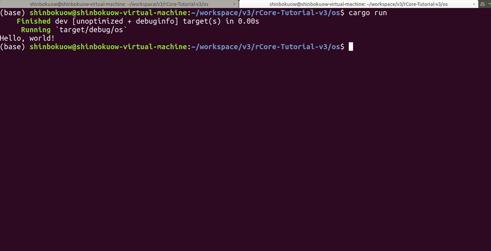

reStructuredText 基本語法
=====================================================

.. toctree::
   :hidden:
   :maxdepth: 4
   
.. note::
   下面是一個註記。

   `這裡 <https://www.sphinx-doc.org/en/master/usage/restructuredtext/basics.html#hyperlinks>`_ 給出了在 Sphinx 中外部鏈接的引入方法。注意，鏈接的名字和用一對尖括號包裹起來的鏈接地址之間必須有一個空格。鏈接最後的下劃線和片段的後續內容之間也需要有一個空格。

   接下來是一個文檔內部引用的例子。比如，戳 :doc:`chapter0/5setup-devel-env` 可以進入快速上手環節。

   文檔間互引用：比如在關於進程的退出部分：

   .. code-block::

      可以使用 .. _process-exit: 記錄文檔的一個位置。
      然後在文檔中使用 :ref:`鏈接名 <process-exit>` 創建指向上述位置的一個鏈接。

.. warning::

   下面是一個警告。

   .. code-block:: rust
      :linenos:
      :caption: 一段示例 Rust 代碼

      // 我們甚至可以插入一段 Rust 代碼！
      fn add(a: i32, b: i32) -> i32 { a + b }

   下面繼續我們的警告。

.. attention:: Here is an attention.

.. caution:: please be cautious!

.. error::

   下面是一個錯誤。

.. danger:: it is dangerous!

.. tip:: here is a tip

.. important:: this is important!

.. hint:: this is a hint.

這裡是一行數學公式 :math:`\sin(\alpha+\beta)=\sin\alpha\cos\beta+\cos\alpha\sin\beta`。

基本的文本樣式：這是 *斜體* ，這是 **加粗** ，接下來的則是行間公式 ``a0`` 。它們的前後都需要有一個空格隔開其他內容，這個讓人挺不爽的...

`這是 <https://docs.readthedocs.io/en/stable/guides/cross-referencing-with-sphinx.html#the-doc-role>`_ 一個全面展示章節分佈的例子，來自於 ReadTheDocs 的官方文檔。事實上，現在我們也採用 ReadTheDocs 主題了，它非常美觀大方。

下面是一個測試的截圖。

接下來是一個表格的例子。

.. list-table:: RISC-V 函數調用跳轉指令
   :widths: 20 30
   :header-rows: 1
   :align: center

   * - 指令
     - 指令功能
   * - :math:`\text{jal}\ \text{rd},\ \text{imm}[20:1]`
     - :math:`\text{rd}\leftarrow\text{pc}+4`

       :math:`\text{pc}\leftarrow\text{pc}+\text{imm}`
   * - :math:`\text{jalr}\ \text{rd},\ (\text{imm}[11:0])\text{rs}`
     - :math:`\text{rd}\leftarrow\text{pc}+4`
       
       :math:`\text{pc}\leftarrow\text{rs}+\text{imm}`