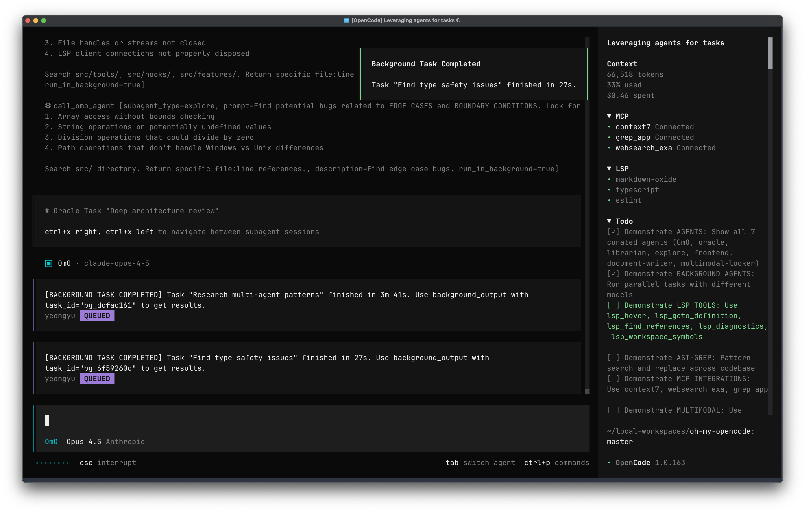
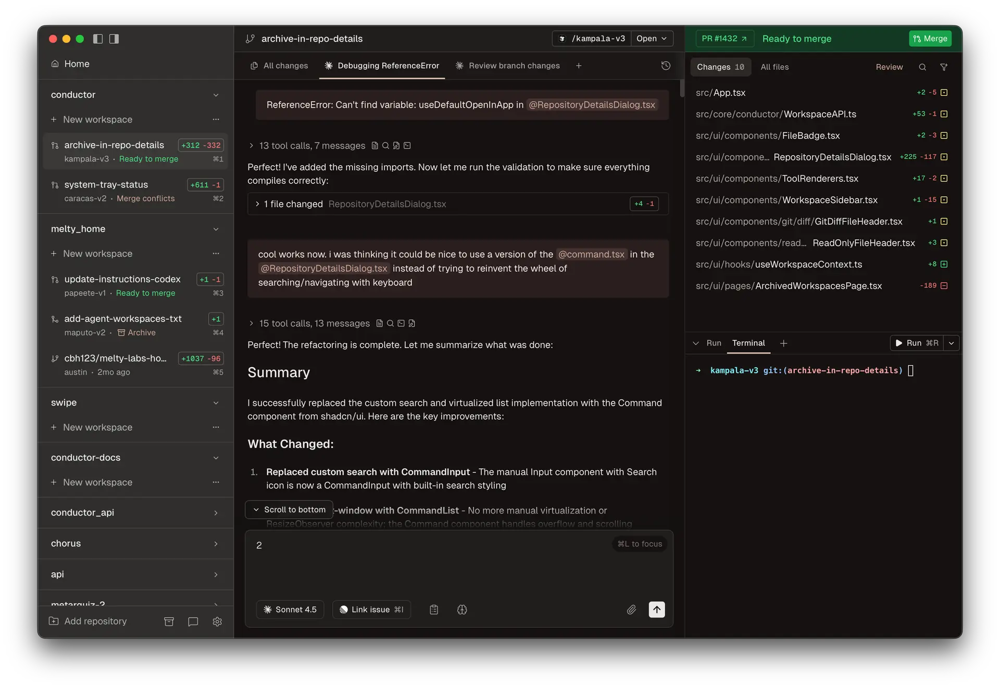
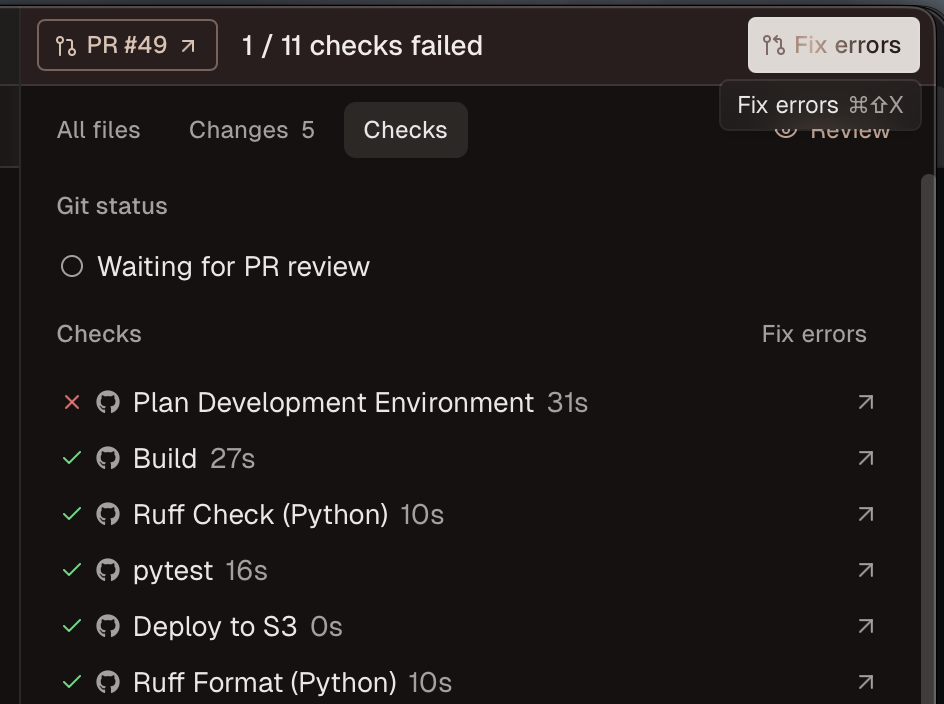
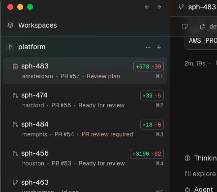

# 在 2026 年進行代理式開發的最佳做法

簡而言之；我嘗試了 Claude Code，然後切換到 OpenCode + Oh-My-Code，最後切換到 Conductor + Claude Code + 大量插件和技能。


## 克勞德·科德很不錯

[Claude Code](https://code.claude.com/docs/en/overview) 本身就是一個非常棒的工具，我的同事們都經常使用它。我之前一直有點猶豫，大多數情況下更喜歡 Cursor，因為我希望在 AI 代理執行程式碼的同時，也能自由地編輯一些程式碼，同時還能密切關注代理的執行情況，確保它生成的程式碼執行良好並符合我的標準（通常情況下都符合，如果它通過了我嚴格的持續集成測試，那應該就沒問題了）。

我一直覺得 Claude Code 的問題不在於它缺乏編輯功能：有一段時間（現在也經常如此），我會在編輯其他文件的同時，在 VSCode/Cursor 終端中執行 Claude Code。問題在於它的性能與價格不成正比。

### _還行吧_。

雖然它似乎總是_有效_，但從來沒有總是_有效_，而且似乎也從來沒有一次就成功過。

從 Sonnet 3.x 升級到 Sonnet 4 系列時，部分問題得到了解決，升級到 4.5 系列型號，尤其是 Opus 4.5 時，問題解決得更多。然而，它從未達到完美。

## OpenCode + Oh-My-OpenCode


今年年初，一位朋友向我介紹了 [Oh-My-OpenCode](https://github.com/code-yeongyu/oh-my-opencode)（我之前也聽說過 OpenCode，但一直更喜歡 Claude Code），**它真是太棒了！**

感覺就像有個真正的開發者住在你的電腦裡一樣。它本質上是一個插件，透過子代理程式顯著提升 OpenCode 的效能，還有一個「超高效」模式，允許將更有效率的後台任務和子任務委派給其他代理程式。



此外，與 Claude Code 不同，OpenCode 支援許多 AI 提供者（他們提到的主要兩個提供者是 Codex 和 Claude Code）。

一切看起來都很棒，但缺點是什麼呢？**代價。**

### 人類有點瘋了。

當我最初使用 Oh-My-OpenCode 時，它的一個賣點是允許你使用 [Claude Code Pro 或 Max](https://claude.com/pricing) 訂閱來使用 OpenCode，這_大大_降低了成本。但後來 [Anthropic 封鎖了這項功能](https://github.com/code-yeongyu/oh-my-opencode?tab=readme-ov-file#claude-oauth-access-notice)，他們聲稱這違反了他們的服務條款。

我知道這可能會成為一個問題，而且我有很多 Anthropic 資助積分已經過期，正等著我花掉呢，所以我從一開始就決定使用 API 金鑰。

那我的問題到底是什麼呢？雖然 OpenCode + Oh-My-OpenCode 的效能確實令人印象深刻，但其中存在大量空閒時間，什麼也沒發生。我只是坐在那裡看著它編碼。當然，我可以像往常一樣完成一些與工作相關的非編碼任務，或者乾脆在後台做一些無關的事情來拖延時間，但我是一個效率控。我希望在盡可能短的時間內完成盡可能多的工作。

## 指揮家－火車還是音樂？



[Conductor](https://www.conductor.build/) 是一款獨特的工具。它目前僅支援 macOS（Windows 和 Linux 版本即將推出），是一款開發者工具，使用 Claude Code（或 OpenAI Codex）來協調程式碼庫中的多個 Git 工作樹，從而同時完成多項任務。它與 Linear 和 GitHub_緊密_整合（Linear 尤其合適，因為他們是使用該平台的大型公司之一），允許您將 Linear（和 GitHub）的問題作為上下文導入，在應用開發過程中提供反饋，在單個或多個工作樹中執行多個 Claude Code 實例，將計劃移交給其他代理，進行程式碼審查，以及直接在應用程式內建立 GitHub PR。除非需要請求對我的 PR 進行審查（我應該向他們提出這個功能…），否則我不會離開應用程式。

它處理 GitHub PR 也非常出色。你的 CI 檢查失敗了？沒問題，點擊右上角的「修復」按鈕即可自動修復。合併衝突？沒問題，一鍵也能解決！



單憑這一點還不足以讓我從 Oh-My-OpenCode 轉過來，因為 Claude Code 的程式碼更糟糕，但這個智慧謎題還有另一部分讓我覺得這次切換是值得的。

## 超能力（和朋友）

[Superpowers](https://github.com/obra/superpowers) 是 Claude Code 的插件，它似乎能讓 Claude Code 變得更智能，尤其是在規劃模式下運作（強烈建議您使用規劃模式）。它會在執行過程中提出更聰明的問題，逐步完善實作細節，從而優化實際程式碼。它會產生子代理程式（就像 Oh-My-OpenCode 一樣），從您的程式碼庫或其他 MCP 伺服器上的所有檔案中收集上下文資訊。它甚至可以使用您的測試套件來確保新程式碼能夠通過程式碼檢查、格式化和其他 CI/CD 測試。Superpowers 透過提供一系列技能（本質上就是注入到系統提示符中的一些高級提示，其中包含針對特定任務的超具體指令）來實現這一點，使其性能幾乎可以媲美 Oh-My-OpenCode，同時還能繼續使用您現有的 Claude Code Max 訂閱。

《超級大國》的計畫部分絕對是它表現如此出色的原因。

### 其他插件

我不僅使用了超級功能插件，我還使用了其他一些我認為對使 Claude Code 發揮最佳性能至關重要的插件。

例如，[Context7](https://context7.com/) 插件就是一個例子。Context7 是一款文件提供程序，專門用於協助 AI 代理程式尋找和閱讀文件。這使得 Claude Code 能夠一次搜尋到最新文件並正確使用 API，從而最大限度地減少迭代次數。

我使用的另一個插件是 [Tavily](https://docs.tavily.com/documentation/claude-code#npx-recommended)，它沒有在 Anthropic 插件商店列出。我用它來增強 Claude Code 的網路搜尋功能，並將研究功能整合到程式碼庫中。這在查找 Context7 中尚未包含的文件訊息，或者在實現某個複雜功能之前進行研究時特別有用，例如了解其他專案中通常是如何實現該功能的。

## 我該如何設定？

### Claude Code + 插件

第一步是[安裝 Claude Code](https://code.claude.com/docs/en/quickstart)。如果您使用的是 macOS 或 Linux 系統，可以使用官方腳本完成安裝。

```bash
curl -fsSL https://claude.ai/install.sh | bash
```

完成上述步驟後，您應該透過在終端機中執行 `claude`，然後執行 `/login` 來登入 Claude。

克勞德可以暫時先不管了。現在我們需要安裝所有好用的插件。我通常喜歡用命令列安裝，這樣就能在所有專案中通用，而且安裝過程也很簡單。我們先從簡單的開始吧。

您不需要安裝所有這些插件，但我會列出我已安裝的所有插件。

```bash
claude plugin marketplace add obra/superpowers-marketplace
claude plugin install superpowers@superpowers-marketplace
claude plugin install context7@claude-plugins-official
claude plugin install playwright@claude-plugins-official
claude plugin install frontend-design@claude-plugins-official
claude plugin install feature-dev@claude-plugins-official
claude plugin install commit-commands@claude-plugins-official
```

### Tavily MCP 伺服器

與許多 MCP 伺服器不同，你不需要在本地執行這個伺服器。首先，你需要在 [Tavily](https://www.tavily.com/) 上建立一個帳號，然後按照他們的官方技能指南進行操作。如果你不想閱讀他們的文件，這裡有一個簡要說明。

使用您喜歡的文字編輯器開啟 Claude 設置，該檔案位於 `~/.claude/settings.json`。

完成上述步驟後，新增一個名為 `env` 的新部分。您需要新增您的 Tavily API 金鑰（您需要一個帳戶才能使用）。內容應該類似這樣：

```json
{"env":{"TAVILY_API_KEY":"tvly-YOUR_API_KEY"}}
```

將 `tvly-YOUR_API_KEY` 替換為您的實際 API 金鑰。完成後，打開終端機並執行以下命令，並按照說明安裝該技能：

```bash
npx skills add https://github.com/tavily-ai/skills
```

完成之後，你可以從任何地方呼叫你加入的這些命令，或者你可以告訴 Claude 使用 Tavily 執行搜尋來研究你想要的任何內容！

### 導體

現在我們已經設定好了 Claude Code 以實現最大生產力，接下來我們需要一個將所有內容整合在一起的程式：[Conductor](https://www.conductor.build/)。

安裝完成後，建立您的帳戶，然後（理想情況下）將您的 GitHub 和 Linear 帳戶關聯到您的 Conductor 帳戶。這樣您就可以透過注入問題快速加入上下文。

一切就緒後，你就可以開始使用 Conductor 了！充分利用它的強大功能，研究主題，關聯 Linear 和 GitHub 問題，**始終**使用規劃模式，並儘可能多地提供上下文訊息，讓你的問題發揮最大效用！我強烈建議使用 `/research` 命令，或在提示時告知它新獲得的技能，這樣它在執行任務時會更加聰明！

使用 Conductor 的真正強大之處在於，它不僅擁有漂亮的介面，更是一個效率倍增器。現在，您可以同時開啟多個專案和程式碼庫，並使用 Git 工作樹（並行工作區）快速處理多個問題。我會在多個專案中執行並行代理，盡可能多地導入上下文資訊。自從加入[新公司](https://www.saphira.ai/)以來，我需要快速從現有文件中收集大量上下文資訊。由於公司廣泛使用 Google Drive，最快的方法是使用 [NotebookLM](https://notebooklm.google/) 來收集專案上下文、客戶資訊以及他們（包括我的同事和客戶）的需求。此外，由於我們還切換到了 Linear 進行問題和專案管理，我可以將更多上下文資訊匯入 Conductor，從而實現極快的平行建置。



我遇到的唯一問題是，在使用 Conductor 執行命令（例如 `/commit` 或任何帶有斜杠的命令）時，它往往會忽略附加的 issue。解決方法是先附加 issue，並告訴它要使用 Linear/GitHub Issue 來完成任務。如果找不到 issue，它會提示你再次附加。然後我再次將 issue 附加到新訊息中，它就能找到並使用它了。

有任何疑問嗎？請在下方留言！

---

原文出處：[https://dev.to/chand1012/the-best-way-to-do-agentic-development-in-2026-14mn](https://dev.to/chand1012/the-best-way-to-do-agentic-development-in-2026-14mn)
