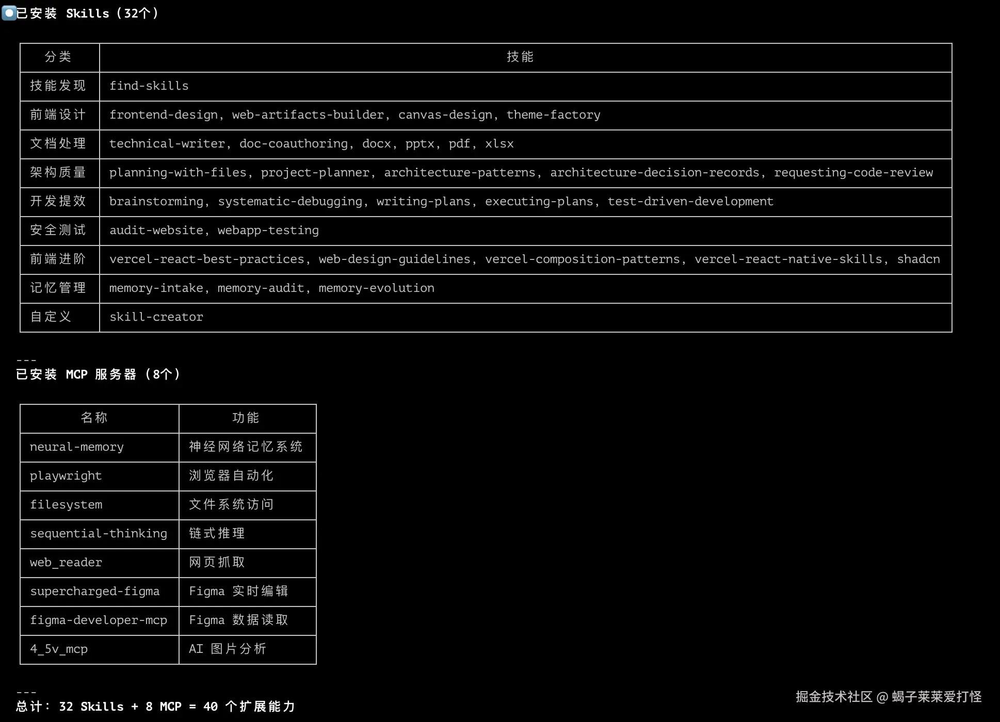

# 別再裸用 Claude Code 了！32 個親測 Skills + 7 個 MCP，開發效率直接拉滿！

先曬一下我裝完的效果（見下圖），所有技能均為實測可用。

> **實測版本說明（2026/04 更新）**：本文所有安裝指令均在 Linux 環境實測通過。原網路流傳版本的許多短名稱安裝指令（如 `npx skills add docx`）已失效，MCP 配置路徑也有誤，本文已全部修正。

------------------------------------------------------------------------

你是不是也有這樣的困擾：

- 用 Claude Code 寫程式，總覺得它不夠懂需求，生成的內容還要反覆修改
- 想讓它做個 Dashboard / 落地頁，結果生成的介面醜到沒法直接用
- 想讓它讀寫本地檔案、操作瀏覽器、聯動設計工具，卻完全不知道怎麼設定
- 會話一清空，之前的調試經驗、專案細節全忘了，每次都要重新鋪陳上下文

這篇文章，我把自己踩了無數坑、親測穩定可用的 32 個精選技能 + 7 個 MCP 伺服器全部分享給你。一鍵安裝、自動觸發，讓你的 Claude Code 從「只會補程式碼的助手」，變成「能幫你搞定全流程的開發搭檔」。

所有安裝指令直接複製就能用，全程無坑，新手也能跟著一步步操作落地。

------------------------------------------------------------------------

### 一、先搞懂核心：Skills vs MCP 到底有啥差別？

很多新手剛上手會搞混這兩個擴充能力，先一句話講透：

- **Skills**：是封裝好的提示詞 / 標準化工作流程，讓 Claude 變成特定領域的「專業人士」，本質是讓 AI「更懂怎麼做」
- **MCP 伺服器**：是真正的工具能力，能讓 Claude 存取本地檔案系統、瀏覽器、外部 API、第三方工具，本質是讓 AI「真的能去做」

最香的點：絕大多數能力會自動觸發，你不需要手動呼叫，當你說「幫我寫個 README」「審查一下這段程式碼」的時候，Claude Code 會自動啟動對應的能力。

#### 核心差異對照表

| 對比維度     | Skills（技能）                           | MCP 伺服器                       |
|--------------|------------------------------------------|----------------------------------|
| 核心本質     | 提示詞 / 標準化工作流封裝                | 本地執行的工具 / API 服務        |
| 安裝方式     | `npx skills add owner/repo@skill` 安裝   | 修改 `~/.claude.json` 配置檔     |
| 運行位置     | Claude 大模型內部                        | 本地獨立進程                     |
| 存取外部資源 | 不支援                                   | 支援本地系統、瀏覽器、第三方服務 |
| 額外依賴     | 只需 Node 環境，無需 API Key（多數情況） | 部分對接外部服務需要 API Key     |

一句話總結：**Skills 讓 Claude 更聰明，MCP 讓 Claude 更能幹**，兩者搭配使用，才能把 Claude Code 的能力拉滿。

------------------------------------------------------------------------

### 二、第一部分：Skills 技能全指南（32 個精選）

技能是 Claude Code 最輕量的擴充方式，透過 Skills CLI 即可一鍵安裝，類似前端常用的 npm 套件管理器，開箱即用。

#### 2.1 前置必看：技能安裝與管理全指令

##### 2.1.1 核心安裝指令

    # 1. 搜尋社群技能（關鍵字匹配）
    npx skills find <關鍵字>

    # 2. 安裝技能（必須使用完整 owner/repo@skill 格式！）
    npx skills add <owner/repo@skill> -y -g

    # 3. 查看已安裝的全部技能
    npx skills list -g

    # 4. 檢查技能更新
    npx skills check

    # 5. 更新所有已安裝技能
    npx skills update

**重要提醒（實測踩坑）**：

1. 安裝指令**必須使用完整格式** `owner/repo@skill`，例如 `npx skills add anthropics/skills@docx -y -g`。舊版短名稱（`npx skills add docx`）已完全失效，會報 `版本庫不存在` 錯誤。
2. 必須加 `-g` 全域安裝參數，否則 Claude Code 無法辨識。
3. 安裝完成後**必須重新啟動 Claude Code** 才能生效。

##### 2.1.2 技能市集與查詢方式

所有社群開源技能均可在官方市集查看，有完整的安裝量排行榜，幫你快速篩選熱門優質技能：

- 官方技能市集：<https://skills.sh/>
- 資料說明：本文精選的技能均來自該榜單，覆蓋開發全場景，累積安裝量均破萬，穩定性有保障。

##### 2.1.3 已安裝技能查看方式

1. 命令列查看：

<!-- -->

    # 技能實際儲存位置（~/.agents/skills/）
    ls ~/.agents/skills/

    # Claude Code 的 symlink 位置
    ls ~/.claude/skills/

    # Windows 路徑
    dir C:\Users\你的使用者名稱\.agents\skills\

2. Claude Code 內直接查看：輸入 `/` 即可喚起完整技能列表，點擊即可手動觸發。

**注意**：技能實際儲存在 `~/.agents/skills/`，再以 symlink 形式連結到 `~/.claude/skills/`，兩個路徑都可以查看。

#### 2.2 32 個精選技能分類清單

所有技能按開發場景分類，統一標註痛點、安裝指令、核心能力、觸發場景和實測感受，新手也能按需選擇。

##### 🔧 必裝入口類（1 個）

###### find-skills 技能發現神器

解決痛點：不知道有哪些可用技能，想找特定功能的技能無從下手

安裝指令：

    npx skills add vercel-labs/skills@find-skills -y -g

核心能力：技能市集的內建搜尋引擎，支援關鍵字匹配、熱門推薦、技能詳細查詢

觸發場景：當你說「有沒有處理 PDF 的技能」「推薦幾個前端開發的技能」時自動啟動

實測感受：所有新手第一個必裝的技能，相當於給 Claude 裝了個「應用商店」，後續找技能再也不用去網頁翻了。（安裝量 787.5K）

##### 🎨 前端開發全端類（9 個）

###### frontend-design 前端介面設計神器

解決痛點：自己寫 Dashboard / 落地頁醜到沒法用，折騰一整天不如 AI 五分鐘生成的效果

安裝指令：

    npx skills add anthropics/skills@frontend-design -y -g

核心能力：網頁、Dashboard、產品落地頁設計；React/Vue 元件生成；暗黑、毛玻璃等現代設計風格適配

觸發場景：當你說「幫我做個後台介面」「設計一個產品落地頁」時自動啟動

實測感受：前端開發最高頻使用的技能，生成的介面可直接落地，無需大幅修改。（安裝量 222.2K）

###### web-artifacts-builder 複雜前端應用構建

解決痛點：簡單介面能生成，帶路由、狀態管理、元件庫的複雜 SPA 搞不定

安裝指令：

    npx skills add anthropics/skills@web-artifacts-builder -y -g

核心能力：支援帶路由的單頁應用開發；完美適配 Tailwind、shadcn/ui 等主流元件庫；複雜狀態管理邏輯生成

觸發場景：當你說「幫我做個帶登入的管理系統」「用 React+Tailwind 寫個完整專案」時自動啟動

實測感受：frontend-design 的進階補充，複雜前端專案必備，生成的程式碼結構清晰、可直接執行。（安裝量 21.9K）

###### canvas-design 可視化繪圖工具

解決痛點：寫技術文件、做分享時，畫架構圖、流程圖太耗時間

安裝指令：

    npx skills add anthropics/skills@canvas-design -y -g

核心能力：架構圖、流程圖、技術示意圖生成；海報、文章封面圖設計；支援匯出 PNG/PDF 格式

觸發場景：當你說「幫我畫個微服務架構圖」「做個技術分享的封面圖」時自動啟動

實測感受：不用再開 Figma/ProcessOn 了，一句話就能生成規範的技術圖表，效率大幅提升。（安裝量 28.4K）

###### theme-factory 主題美化工具

解決痛點：生成的文件、PPT、介面風格不統一，視覺效果雜亂

安裝指令：

    npx skills add anthropics/skills@theme-factory -y -g

核心能力：10+ 預設主題（科技藍、商務灰、暗黑風等）；一鍵統一文件、PPT、HTML 的視覺風格；支援自定義主題設定

觸發場景：當你說「給這個文件加個商務風格」「統一一下 PPT 的視覺主題」時自動啟動

實測感受：細節控必備，生成的內容質感直接提升一個檔次，不用再手動調格式了。（安裝量 21.3K）

###### vercel-react-best-practices React 最佳實踐

解決痛點：寫 React 程式碼不規範、效能差、不符合業界最佳實踐

安裝指令：

    npx skills add vercel-labs/agent-skills@vercel-react-best-practices -y -g

核心能力：React 程式碼規範檢查；效能優化建議；元件設計模式指導；Hooks 最佳實踐

觸發場景：當你寫 React 程式碼時自動啟動，程式碼審查、重構時優先觸發

實測感受：Vercel 官方出品，權威性高，新手寫 React 必備，能幫你養成規範的編碼習慣。

###### web-design-guidelines 網頁設計規範

解決痛點：做出來的網頁排版亂、配色醜、響應式適配差

安裝指令：

    npx skills add vercel-labs/agent-skills@web-design-guidelines -y -g

核心能力：設計系統規範指導；響應式版面適配；視覺一致性檢查；互動體驗優化建議

觸發場景：當你做網頁設計、UI 優化時自動啟動

實測感受：Vercel 官方出品，哪怕你是設計小白，用它生成的介面也不會醜。

###### vercel-composition-patterns 元件組合模式

解決痛點：複雜元件拆分不合理、重用性差、狀態管理混亂

安裝指令：

    npx skills add vercel-labs/agent-skills@vercel-composition-patterns -y -g

核心能力：元件重用策略設計；組合優於繼承的實踐指導；複雜元件狀態管理方案

觸發場景：當你做元件封裝、複雜前端專案重構時自動啟動

實測感受：中高階前端必備，能幫你寫出更優雅、重用性更強的元件程式碼。

###### shadcn shadcn/ui 元件庫專屬技能

解決痛點：使用 shadcn/ui 時，不知道怎麼組合元件、自訂樣式，反覆查文件

安裝指令：

    npx skills add shadcn/ui@shadcn -y -g

核心能力：shadcn/ui 元件使用指導；樣式主題客製化；元件組合最佳實踐；一鍵生成完整業務元件

觸發場景：當你的專案裡有 shadcn/ui 依賴，或提到 shadcn 相關需求時自動啟動

實測感受：shadcn 重度使用者必備，不用再反覆翻官方文件了，一句話就能生成符合規範的元件程式碼。

###### vercel-react-native-skills React Native 開發指導

解決痛點：React Native 跨平台適配坑多，原生模組整合複雜

安裝指令：

    npx skills add vercel-labs/agent-skills@vercel-react-native-skills -y -g

核心能力：RN 開發最佳實踐；跨平台適配指導；原生模組整合方案；效能優化建議

觸發場景：當你做 React Native 相關開發時自動啟動

實測感受：Vercel 官方出品，RN 開發必備，能幫你避開 90% 的跨平台適配坑。（安裝量 76.1K）

##### 📄 文件與辦公處理類（6 個）

###### technical-writer 技術文件專家

解決痛點：寫完程式碼不想寫文件，README、API 文件寫得雜亂不規範

安裝指令：

    npx skills add shubhamsaboo/awesome-llm-apps@technical-writer -y -g

核心能力：標準化 README 生成；API 介面文件撰寫；技術教學、使用者指南創作；中英文件翻譯

觸發場景：當你說「幫我寫個專案 README」「給這個 API 生成文件」時自動啟動

實測感受：開發者必備，生成的文件結構規範、邏輯清楚，直接就能用。

###### doc-coauthoring 長文件協作助手

解決痛點：寫技術提案、設計規範、RFC 文件時，邏輯不嚴謹、內容不完整

安裝指令：

    npx skills add anthropics/skills@doc-coauthoring -y -g

核心能力：技術提案（RFC）撰寫；系統設計文件創作；團隊規範文件打磨；支援多輪迭代優化

觸發場景：當你說「幫我寫個技術方案」「起草一份架構設計文件」時自動啟動

實測感受：寫正式技術文件必備，比通用的 AI 寫作更懂技術文件的規範與邏輯。（安裝量 21.5K）

###### docx Word 文件處理工具

解決痛點：需要頻繁處理 Word 文件，格式轉換、批次修改太耗時

安裝指令：

    npx skills add anthropics/skills@docx -y -g

核心能力：建立 / 讀取 / 編輯 Word 文件；Markdown 轉 Word 格式；批次搜尋替換內容；自動生成目錄、頁首頁尾

觸發場景：當你說「把這個 Markdown 轉成 Word」「幫我修改這份 Word 文件」時自動啟動

實測感受：辦公場景必備，不用再開 Word 軟體了，一句話就能完成批次修改。（安裝量 44.6K）

###### pptx PPT 演示文稿生成工具

解決痛點：做 PPT 太耗時間，從文件轉 PPT 要反覆複製貼上調格式

安裝指令：

    npx skills add anthropics/skills@pptx -y -g

核心能力：從技術文件 / Markdown 一鍵生成 PPT；編輯既有簡報；合併 / 拆分投影片；提取 PPT 內容

觸發場景：當你說「幫我做個技術分享的 PPT」「把這份文件轉成簡報」時自動啟動

實測感受：技術分享、報告必備，10 分鐘就能搞定以前要做一整天的 PPT。（安裝量 52K）

###### pdf PDF 萬能工具

解決痛點：PDF 合併拆分、格式轉換、OCR 辨識要開會員、操作麻煩

安裝指令：

    npx skills add anthropics/skills@pdf -y -g

核心能力：PDF 合併 / 拆分；OCR 辨識掃描件內容；新增浮水印 / 頁碼；PDF 表單填寫；格式轉換

觸發場景：當你說「把這幾個 PDF 合併」「識別這個掃描件裡的文字」時自動啟動

實測感受：完全免費的 PDF 工具，日常辦公的高頻需求皆可覆蓋，不用再找付費工具了。（安裝量 56.6K）

###### xlsx Excel/CSV 處理工具

解決痛點：Excel 資料清理、公式計算、圖表生成太繁瑣，重複操作耗時

安裝指令：

    npx skills add anthropics/skills@xlsx -y -g

核心能力：Excel/CSV 資料清理；公式計算與資料統計；可視化圖表生成；格式轉換與批次處理

觸發場景：當你說「幫我處理這份 Excel 資料」「給這個表格生成統計圖表」時自動啟動

實測感受：資料處理必備，比手動寫 Excel 公式快太多，複雜資料處理一句話就能搞定。（安裝量 40.5K）

##### 🏗️ 架構設計與程式碼品質類（5 個）

###### planning-with-files 任務規劃工具

解決痛點：做複雜專案時，任務拆解不清楚，會話中斷後進度全丟

安裝指令：

    npx skills add othmanadi/planning-with-files@planning-with-files -y -g

核心能力：自動拆解複雜開發任務；生成 task_plan.md、progress.md 等進度追蹤檔案；支援會話中斷後恢復執行

觸發場景：當你說「幫我拆解這個專案的開發任務」「做一個專案開發計畫」時自動啟動

實測感受：複雜專案必備，哪怕你 `/clear` 清空會話，也能根據生成的進度檔接著做，完全不丟進度。（安裝量 12K）

###### project-planner 專案規劃專家

解決痛點：一上來就寫程式，需求沒想清楚，後期反覆返工

安裝指令：

    npx skills add shubhamsaboo/awesome-llm-apps@project-planner -y -g

核心能力：生成標準化需求文件；輸出系統架構設計方案；制定分階段實現計畫；評估技術風險

觸發場景：當你說「幫我做個專案的整體規劃」「梳理一下這個需求的實作方案」時自動啟動

實測感受：能幫你養成「先想清楚再動手」的好習慣，大幅減少後期返工，新手做專案必備。

###### architecture-patterns 架構模式推薦

解決痛點：做系統設計時，不知道該選什麼架構模式，踩到架構設計的坑

安裝指令：

    npx skills add wshobson/agents@architecture-patterns -y -g

核心能力：根據業務場景推薦合適的架構模式；說明各類架構的優缺點與適用場景；給出架構設計的最佳實踐

觸發場景：當你說「這個場景用什麼架構合適」「幫我設計微服務架構」時自動啟動

實測感受：後端開發、系統架構師必備，覆蓋主流的架構模式，能幫你避開很多常見坑。

###### architecture-decision-records 架構決策記錄

解決痛點：專案裡的架構決策沒記錄，後期沒人知道為何這樣選，出問題無從追溯

安裝指令：

    npx skills add wshobson/agents@architecture-decision-records -y -g

核心能力：生成標準化的 ADR 架構決策記錄；記錄決策背景、選型原因與備選方案；方便團隊回溯與維護

觸發場景：當你說「幫我記錄這個架構決策」「生成一份 ADR 文件」時自動啟動

實測感受：團隊開發、長期維護的專案必備，是良好研發流程裡不可或缺的一環。

###### requesting-code-review 程式碼審查

解決痛點：想要更專業、更貼近團隊真實場景的 code review

安裝指令：

    npx skills add obra/superpowers@requesting-code-review -y -g

核心能力：全維度程式碼品質審查；發現潛在的 bug 與安全風險；給出可落地的優化建議；符合理想的業界 code review 規範

觸發場景：當你說「幫我做個專業的程式碼審查」「review 一下這個模組的程式碼」時自動啟動

實測感受：完全模擬資深開發的 code review 觀點，能幫你發現很多自己看不到的問題。

##### 🧠 記憶與上下文管理類（3 個）

###### memory-intake 記憶錄入

解決痛點：會話一清空，之前的調試經驗、專案細節、踩坑記錄全忘了

安裝指令：

    npx skills add nhadaututtheky/neural-memory@memory-intake -y -g

核心能力：把調試經驗、架構決策、踩坑記錄、專案規範存入 Claude 記憶庫；支援分類標籤管理；跨會話呼叫

觸發場景：當你說「把這個經驗存到記憶裡」「記住這個專案的規範」時自動啟動

實測感受：徹底解決會話上下文丟失問題，專案越用越順手，不用每次都重新鋪陳背景。

###### memory-audit 記憶健康檢查

解決痛點：記憶庫裡存了太多過時、無效的內容，影響 Claude 的回應準確性

安裝指令：

    npx skills add nhadaututtheky/neural-memory@memory-audit -y -g

核心能力：檢查記憶庫內容是否過時；發現無效、衝突的記憶；生成記憶庫品質報告；給出清理優化建議

觸發場景：當你說「幫我檢查一下記憶庫」「清理一下無效的記憶」時自動啟動

實測感受：記憶庫用久了必備，能幫你保持記憶庫的乾淨與準確，避免 Claude 調用過時內容。

###### memory-evolution 記憶優化

解決痛點：記憶庫內容雜亂、冗餘資訊多，呼叫效率低

安裝指令：

    npx skills add nhadaututtheky/neural-memory@memory-evolution -y -g

核心能力：分析記憶使用模式；建議記憶整合策略；精簡冗餘記憶；優化記憶的關聯結構

觸發場景：當你說「幫我優化一下記憶庫」「整理一下我的記憶內容」時自動啟動

實測感受：深度使用記憶功能必備，能讓 Claude 更精準地呼叫你的歷史經驗，回應更貼合需求。

##### 🧪 測試與自動化類（2 個）

###### webapp-testing E2E 測試

解決痛點：寫 E2E 測試太耗時，手動測試覆蓋不全

安裝指令：

    npx skills add anthropics/skills@webapp-testing -y -g

核心能力：基於 Playwright 生成 E2E 測試用例；頁面導航、表單填寫、點擊操作自動化；截圖與日誌記錄；測試報告生成

觸發場景：當你說「幫我給這個網頁寫 E2E 測試」「做個自動化測試用例」時自動啟動

實測感受：前端測試必備，能快速生成可直接執行的測試用例，大幅提升測試效率。（安裝量 36.5K）

###### test-driven-development TDD 測試驅動

解決痛點：想實踐 TDD 開發模式，卻不知道怎麼落地，常常先寫程式再補測試

安裝指令：

    npx skills add obra/superpowers@test-driven-development -y -g

核心能力：引導你遵循「紅→綠→重構」循環；先寫測試用例再寫實作程式碼；保證測試覆蓋率；輸出符合 TDD 規範的程式碼

觸發場景：當你說「用 TDD 模式開發這個功能」「幫我實踐測試驅動開發」時自動啟動

實測感受：想養成 TDD 開發習慣的必備技能，能幫你規範開發流程，寫出更健壯、bug 更少的程式碼。

##### ⚡ 開發提效類（4 個）

###### brainstorming 腦力激盪

解決痛點：遇到技術難題，想不出解法，陷入思維瓶頸

安裝指令：

    npx skills add obra/superpowers@brainstorming -y -g

核心能力：多角度分析技術問題；快速生成多套解決方案；拓展技術思路；幫助突破思維瓶頸

觸發場景：當你說「幫我頭腦風暴一下這個問題」「想想這個需求的實作方案」時自動啟動

實測感受：遇到卡關時用它，能快速打開思路，常常會提出你沒想到的方案。

###### systematic-debugging 系統化偵錯

解決痛點：遇到詭異的 bug，排查毫無頭緒，東一槌西一棒子

安裝指令：

    npx skills add obra/superpowers@systematic-debugging -y -g

核心能力：結構化的 bug 排查流程；逐步定位問題根因；覆蓋所有可能的故障點；生成調試記錄文件

觸發場景：當你說「幫我排查這個 bug」「這個問題不知道怎麼回事，幫我分析一下」時自動啟動

實測感受：偵錯神器，跟著它的流程走一遍，90% 的問題都能找到根因，再也不用瞎猜了。

###### writing-plans 寫計畫

解決痛點：拆解任務不清晰，開發沒有節奏，不知道先做什麼後做什麼

安裝指令：

    npx skills add obra/superpowers@writing-plans -y -g

核心能力：拆解複雜開發任務；生成分步驟實作計畫；明確任務依賴關係；評估每步驟的工作量

觸發場景：當你說「幫我拆解這個功能的開發步驟」「寫一個詳細的開發計畫」時自動啟動

實測感受：能幫你把模糊的需求變成清晰的執行步驟，開發節奏更可控，不會做到一半發現漏掉東西。

###### executing-plans 執行計畫

解決痛點：計畫寫得很好，但執行時容易跑偏，進度跟不上

安裝指令：

    npx skills add obra/superpowers@executing-plans -y -g

核心能力：按計畫分步執行開發任務；即時追蹤開發進度；處理執行中的異常情況；生成執行記錄

觸發場景：當你說「按這個計畫執行開發」「幫我跟進這個專案的開發進度」時自動啟動

實測感受：和 writing-plans 搭配使用，從計畫到執行全流程覆蓋，複雜專案開發再也不會跑偏。

##### 🔒 安全稽核類（1 個）

###### audit-website 網站安全稽核

解決痛點：網站上線前不知道有沒有安全漏洞，被攻擊後才發現問題

安裝指令：

    npx skills add squirrelscan/skills@audit-website -y -g

核心能力：網站常見安全漏洞掃描；安全配置檢查；生成完整的安全稽核報告；給出漏洞修復建議

觸發場景：當你說「幫我稽核這個網站的安全性」「掃描這個網站的漏洞」時自動啟動

實測感受：網站上線前必跑一遍，能發現很多常見的安全隱患，提前修復避免線上出問題。（安裝量 40K）

##### 🛠️ 自訂技能開發類（1 個）

###### skill-creator 建立自訂技能

解決痛點：通用技能滿足不了個性化需求，想自己封裝專屬的工作流程技能

安裝指令：

    npx skills add anthropics/skills@skill-creator -y -g

核心能力：引導你建立自訂技能；封裝重複的工作流程；生成標準化的技能包；支援發佈到社群

觸發場景：當你說「幫我建立一個自訂技能」「封裝一個專屬的工作流程」時自動啟動

實測感受：進階玩家必備，能把你日常重複的工作流程封裝成技能，一勞永逸，大幅提升效率。（安裝量 117.8K）

------------------------------------------------------------------------

#### 2.3 拿來即用：分場景一鍵安裝腳本

為了方便使用，我整理了 3 個不同場景的一鍵安裝腳本，複製到終端直接執行即可。

##### 版本 1：新手入門包（10 個必裝輕量技能，零冗餘）

    #!/bin/bash
    set -e

    # 必裝入口
    npx skills add vercel-labs/skills@find-skills -y -g

    # 前端開發必備
    npx skills add anthropics/skills@frontend-design -y -g

    # 文件處理必備
    npx skills add shubhamsaboo/awesome-llm-apps@technical-writer -y -g
    npx skills add anthropics/skills@docx -y -g
    npx skills add anthropics/skills@pptx -y -g
    npx skills add anthropics/skills@pdf -y -g

    # 程式碼品質必備
    npx skills add obra/superpowers@requesting-code-review -y -g

    # 開發提效必備
    npx skills add obra/superpowers@brainstorming -y -g
    npx skills add obra/superpowers@systematic-debugging -y -g

    echo "✅ 新手入門包安裝完成！重啟 Claude Code 即可生效，輸入 / 查看技能列表"

##### 版本 2：前端開發者專屬包

    #!/bin/bash
    set -e

    # 必裝入口
    npx skills add vercel-labs/skills@find-skills -y -g

    # 前端開發全量技能
    npx skills add anthropics/skills@frontend-design -y -g
    npx skills add anthropics/skills@web-artifacts-builder -y -g
    npx skills add anthropics/skills@canvas-design -y -g
    npx skills add anthropics/skills@theme-factory -y -g
    npx skills add vercel-labs/agent-skills@vercel-react-best-practices -y -g
    npx skills add vercel-labs/agent-skills@web-design-guidelines -y -g
    npx skills add vercel-labs/agent-skills@vercel-composition-patterns -y -g
    npx skills add shadcn/ui@shadcn -y -g

    # 測試與提效
    npx skills add anthropics/skills@webapp-testing -y -g
    npx skills add obra/superpowers@requesting-code-review -y -g
    npx skills add obra/superpowers@systematic-debugging -y -g

    # 文件處理
    npx skills add shubhamsaboo/awesome-llm-apps@technical-writer -y -g

    echo "✅ 前端開發者專屬包安裝完成！重啟 Claude Code 即可生效，輸入 / 查看技能列表"

##### 版本 3：全端開發全能包（本文全部 32 個技能）

    #!/bin/bash
    set -e

    # 🔧 必裝入口類
    npx skills add vercel-labs/skills@find-skills -y -g

    # 🎨 前端開發全端類
    npx skills add anthropics/skills@frontend-design -y -g
    npx skills add anthropics/skills@web-artifacts-builder -y -g
    npx skills add anthropics/skills@canvas-design -y -g
    npx skills add anthropics/skills@theme-factory -y -g
    npx skills add vercel-labs/agent-skills@vercel-react-best-practices -y -g
    npx skills add vercel-labs/agent-skills@web-design-guidelines -y -g
    npx skills add vercel-labs/agent-skills@vercel-composition-patterns -y -g
    npx skills add shadcn/ui@shadcn -y -g
    npx skills add vercel-labs/agent-skills@vercel-react-native-skills -y -g

    # 📄 文件與辦公處理類
    npx skills add shubhamsaboo/awesome-llm-apps@technical-writer -y -g
    npx skills add anthropics/skills@doc-coauthoring -y -g
    npx skills add anthropics/skills@docx -y -g
    npx skills add anthropics/skills@pptx -y -g
    npx skills add anthropics/skills@pdf -y -g
    npx skills add anthropics/skills@xlsx -y -g

    # 🏗️ 架構設計與程式碼品質類
    npx skills add othmanadi/planning-with-files@planning-with-files -y -g
    npx skills add shubhamsaboo/awesome-llm-apps@project-planner -y -g
    npx skills add wshobson/agents@architecture-patterns -y -g
    npx skills add wshobson/agents@architecture-decision-records -y -g
    npx skills add obra/superpowers@requesting-code-review -y -g

    # 🧠 記憶與上下文管理類
    npx skills add nhadaututtheky/neural-memory@memory-intake -y -g
    npx skills add nhadaututtheky/neural-memory@memory-audit -y -g
    npx skills add nhadaututtheky/neural-memory@memory-evolution -y -g

    # 🧪 測試與自動化類
    npx skills add anthropics/skills@webapp-testing -y -g
    npx skills add obra/superpowers@test-driven-development -y -g

    # ⚡ 開發提效類
    npx skills add obra/superpowers@brainstorming -y -g
    npx skills add obra/superpowers@systematic-debugging -y -g
    npx skills add obra/superpowers@writing-plans -y -g
    npx skills add obra/superpowers@executing-plans -y -g

    # 🔒 安全稽核類
    npx skills add squirrelscan/skills@audit-website -y -g

    # 🛠️ 自訂技能開發類
    npx skills add anthropics/skills@skill-creator -y -g

    echo "✅ 全端開發全能包安裝完成！重啟 Claude Code 即可生效，輸入 / 查看技能列表"

------------------------------------------------------------------------

#### 2.4 技能速查表

為了方便快速查閱，我整理了所有 32 個技能的核心資訊對照表，按需選擇即可：

| 分類       | 技能名稱                      | 完整安裝套件                                              | 核心用途                         | 安裝量（2026/04）|
|------------|-------------------------------|-----------------------------------------------------------|----------------------------------|-----------------|
| 必裝入口   | find-skills                   | `vercel-labs/skills@find-skills`                          | 社群技能搜尋與發現               | 787.5K          |
| 前端開發   | frontend-design               | `anthropics/skills@frontend-design`                       | 網頁、Dashboard、落地頁設計      | 222.2K          |
| 前端開發   | web-artifacts-builder         | `anthropics/skills@web-artifacts-builder`                 | 複雜 SPA、帶元件庫的前端專案構建 | 21.9K           |
| 前端開發   | canvas-design                 | `anthropics/skills@canvas-design`                         | 架構圖、流程圖、可視化繪圖       | 28.4K           |
| 前端開發   | theme-factory                 | `anthropics/skills@theme-factory`                         | 主題美化、視覺風格統一           | 21.3K           |
| 前端開發   | vercel-react-best-practices   | `vercel-labs/agent-skills@vercel-react-best-practices`    | React 開發最佳實踐               | -               |
| 前端開發   | web-design-guidelines         | `vercel-labs/agent-skills@web-design-guidelines`          | 網頁設計規範與 UI 優化           | -               |
| 前端開發   | vercel-composition-patterns   | `vercel-labs/agent-skills@vercel-composition-patterns`    | 元件組合模式與重用策略           | -               |
| 前端開發   | shadcn                        | `shadcn/ui@shadcn`                                        | shadcn/ui 元件庫專屬支援         | -               |
| 前端開發   | vercel-react-native-skills    | `vercel-labs/agent-skills@vercel-react-native-skills`     | React Native 開發指導            | 76.1K           |
| 文件辦公   | technical-writer              | `shubhamsaboo/awesome-llm-apps@technical-writer`          | 技術文件、README、API 文件生成   | -               |
| 文件辦公   | doc-coauthoring               | `anthropics/skills@doc-coauthoring`                       | 長文件、技術方案、RFC 撰寫       | 21.5K           |
| 文件辦公   | docx                          | `anthropics/skills@docx`                                  | Word 文件建立、編輯、格式轉換    | 44.6K           |
| 文件辦公   | pptx                          | `anthropics/skills@pptx`                                  | PPT 演示文稿生成與編輯           | 52K             |
| 文件辦公   | pdf                           | `anthropics/skills@pdf`                                   | PDF 合併、拆分、OCR、浮水印處理  | 56.6K           |
| 文件辦公   | xlsx                          | `anthropics/skills@xlsx`                                  | Excel 資料處理、公式、圖表生成   | 40.5K           |
| 架構品質   | planning-with-files           | `othmanadi/planning-with-files@planning-with-files`       | 複雜任務拆解、進度追蹤、會話恢復 | 12K             |
| 架構品質   | project-planner               | `shubhamsaboo/awesome-llm-apps@project-planner`           | 專案需求梳理、架構設計、開發計畫 | -               |
| 架構品質   | architecture-patterns         | `wshobson/agents@architecture-patterns`                   | 架構模式推薦、架構設計指導       | -               |
| 架構品質   | architecture-decision-records | `wshobson/agents@architecture-decision-records`           | ADR 架構決策記錄生成             | -               |
| 架構品質   | requesting-code-review        | `obra/superpowers@requesting-code-review`                 | 專業程式碼審查、品質優化         | -               |
| 記憶管理   | memory-intake                 | `nhadaututtheky/neural-memory@memory-intake`              | 經驗、踩坑記錄、專案規範記憶錄入 | -               |
| 記憶管理   | memory-audit                  | `nhadaututtheky/neural-memory@memory-audit`               | 記憶庫健康檢查、無效內容清理     | -               |
| 記憶管理   | memory-evolution              | `nhadaututtheky/neural-memory@memory-evolution`           | 記憶庫優化、關聯結構整理         | -               |
| 測試自動化 | webapp-testing                | `anthropics/skills@webapp-testing`                        | E2E 自動化測試用例生成           | 36.5K           |
| 測試自動化 | test-driven-development       | `obra/superpowers@test-driven-development`                | TDD 模式引導                     | -               |
| 開發提效   | brainstorming                 | `obra/superpowers@brainstorming`                          | 技術問題頭腦風暴、方案生成       | -               |
| 開發提效   | systematic-debugging          | `obra/superpowers@systematic-debugging`                   | 結構化 bug 排查、根因定位        | -               |
| 開發提效   | writing-plans                 | `obra/superpowers@writing-plans`                          | 開發任務拆解、實作計畫生成       | -               |
| 開發提效   | executing-plans               | `obra/superpowers@executing-plans`                        | 開發計畫執行、進度追蹤           | -               |
| 安全稽核   | audit-website                 | `squirrelscan/skills@audit-website`                       | 網站安全漏洞掃描、稽核報告生成   | 40K             |
| 自訂開發   | skill-creator                 | `anthropics/skills@skill-creator`                         | 自訂技能建立、工作流程封裝       | 117.8K          |

資料來源：官方技能市集 <https://skills.sh/>，統計時間截至 2026 年 4 月。

------------------------------------------------------------------------

### 三、第二部分：MCP 伺服器全指南（7 個親測可用）

MCP（Model Context Protocol）是 Claude Code 更底層的擴充機制，能讓 Claude 突破大模型的限制，真正存取本地檔案系統、瀏覽器、資料庫、第三方工具，實現真正的自動化操作。

#### 3.1 前置必看：MCP 配置全流程

##### 3.1.1 配置檔路徑（實測修正）

MCP 伺服器配置在 `~/.claude.json` 的 `mcpServers` 欄位中管理，**不是** `~/.claude/mcp.json`：

    # 正確路徑：MCP 配置寫在 ~/.claude.json 的 mcpServers 欄位
    ~/.claude.json

也支援專案級配置（僅當前專案生效）：

    # 專案根目錄
    .mcp.json

##### 3.1.2 標準配置格式範例

編輯 `~/.claude.json`，在頂層加入 `mcpServers` 欄位：

    {
      "mcpServers": {
        "伺服器名稱": {
          "type": "stdio",
          "command": "執行命令",
          "args": ["命令參數"],
          "env": {
            "環境變數名": "環境變數值"
          }
        }
      }
    }

##### 3.1.3 配置生效與驗證

1. 修改完配置檔後，**必須重新啟動 Claude Code** 才能生效；

2. 生效後，在 Claude Code 輸入框下方會顯示「工具」圖示，點選即可查看已連線的 MCP 伺服器；

3. 配置前請先檢查 JSON 格式是否正確，避免逗號、括號不閉合導致配置失效。

#### 3.2 7 個精選 MCP 伺服器清單

所有 MCP 均為親測可用，覆蓋開發全場景，按核心用途分類整理，每個都包含完整配置方式、核心能力與注意事項。

##### 🧠 必裝核心：跨會話記憶系統

###### neural-memory 神經網路記憶系統

解決痛點：技能裡的記憶功能是輕量版，想要更強大的跨會話、長週期、結構化記憶能力

前置依賴安裝：

    # 安裝 Python 套件
    pip install neural-memory

    # 初始化（自動配置 ~/.claude.json 的 MCP 設定）
    nmem init

`nmem init` 會自動完成所有配置。若需手動配置，在 `~/.claude.json` 的 `mcpServers` 中加入：

    "neural-memory": {
      "type": "stdio",
      "command": "nmem-mcp",
      "args": []
    }

核心能力：

1. 跨會話、跨專案的長期記憶儲存，徹底告別上下文丟失
2. 模擬人腦結構的記憶模型，支援神經元、突觸、纖維等結構化記憶
3. 自動關聯相似記憶，智慧匹配當前需求
4. 記憶整合與優化，類似人腦睡眠整理記憶機制
5. 知識圖譜視覺化：`nmem graph` 查看記憶關聯
6. 注意事項：純本地運行，資料存在本地 SQLite 資料庫，無需任何 API Key，完全隱私安全。

##### 🌐 瀏覽器與網頁能力（1 個）

###### playwright 瀏覽器自動化

解決痛點：需要做專業的 E2E 測試、頁面自動化操作，需要更強的瀏覽器控制能力

前置依賴：已安裝 Node 環境

完整配置（加入 `~/.claude.json` 的 `mcpServers`）：

    "playwright": {
      "type": "stdio",
      "command": "npx",
      "args": ["-y", "@playwright/mcp@latest"]
    }

核心能力：

1. 全瀏覽器支援（Chrome、Firefox、Safari）
2. 專業的 E2E 測試用例生成與執行
3. 頁面導航、表單提交、元素操作全自動化
4. 視頻錄製、網路請求攔截、效能監控
5. 支援複雜的使用者場景模擬
6. 注意事項：純本地運行，無需 API Key，首次運行會自動下載瀏覽器核心，需等待片刻。

##### 📁 本地系統能力（1 個）

###### filesystem 檔案系統存取

解決痛點：Claude 只能讀取當前打開的檔案，想要存取整個工作區的檔案、批次修改、目錄管理

前置依賴：已安裝 Node 環境

完整配置（示範 Linux/Mac 路徑，加入 `~/.claude.json` 的 `mcpServers`）：

    "filesystem": {
      "type": "stdio",
      "command": "npx",
      "args": ["-y", "@modelcontextprotocol/server-filesystem", "/home/你的使用者名稱/開發工作區路徑"]
    }

核心能力：

1. 讀寫指定目錄下的所有檔案，支援批次操作
2. 建立、刪除、重新命名目錄與檔案
3. 按檔名、內容搜尋工作區檔案
4. 檢視檔案元資訊、修改記錄
5. 支援多目錄同時授權
6. 注意事項：嚴禁開放系統根目錄權限，只授權你的開發工作區目錄以避免誤刪系統檔案；純本地運行，無需 API Key，所有操作均在本地完成。

##### 🤔 推理能力增強（1 個）

###### sequential-thinking 鏈式推理

解決痛點：Claude 處理複雜問題時容易跳步、邏輯不嚴謹、漏掉關鍵步驟

前置依賴：已安裝 Node 環境

完整配置（加入 `~/.claude.json` 的 `mcpServers`）：

    "sequentialthinking": {
      "type": "stdio",
      "command": "npx",
      "args": ["-y", "@modelcontextprotocol/server-sequential-thinking"]
    }

核心能力：

1. 把複雜問題拆成多步結構化推理，避免跳步出錯
2. 每一步推理都有明確的思考、驗證、調整過程
3. 推理鏈可視化，清楚查看整個思考流程
4. 支援多方案比較、可行性驗證
5. 自動識別推理中的邏輯漏洞並修正
6. 注意事項：純本地運行，無需 API Key，處理複雜演算法、架構設計時效果顯著。

##### 🎨 設計工具聯動（2 個）

###### figma-developer-mcp Figma 資料讀取

解決痛點：開發還原設計稿時，需要反覆切換 Figma 和編輯器，手動複製尺寸、顏色、樣式

前置依賴：已安裝 Node 環境，需要 Figma 帳號

完整配置（加入 `~/.claude.json` 的 `mcpServers`）：

    "figma-developer-mcp": {
      "type": "stdio",
      "command": "npx",
      "args": ["-y", "figma-developer-mcp", "--stdio"],
      "env": {
        "FIGMA_API_KEY": "你的 Figma Personal Access Token"
      }
    }

核心能力：

1. 讀取 Figma 檔案的完整結構，取得元件、圖層、樣式資訊
2. 自動提取設計稿中的顏色、字體、尺寸、間距等設計規範
3. 匯出設計稿中的圖片、圖示資源
4. 根據設計稿自動生成對應的 HTML/CSS 程式碼
5. 比對設計稿與實作程式碼的差異，給出還原優化建議
6. Token 取得方式：Figma → Settings → Personal Access Tokens → Generate new token
7. 注意事項：需要 Figma API Key，僅能存取你帳號有權限的 Figma 檔案。

###### supercharged-figma Figma 即時編輯

解決痛點：只能讀取 Figma 設計稿，想讓 Claude 直接修改、編輯 Figma 畫布內容

前置依賴：已安裝 Node 環境，Figma 客戶端

完整配置（加入 `~/.claude.json` 的 `mcpServers`）：

    "supercharged-figma": {
      "type": "stdio",
      "command": "npx",
      "args": ["-y", "supercharged-figma-mcp", "--local", "--relay-host", "127.0.0.1", "--relay-port", "8888"]
    }

核心能力：

1. 即時編輯 Figma 畫布，建立、刪除、修改圖層節點
2. 批次操作圖層，自動生成元件、樣式、自動版面配置
3. 原型連線、互動效果自動生成
4. 根據需求一鍵生成完整設計稿頁面
5. 設計稿批次規範化、統一設計規範
6. 使用方式：
    - 在 Figma 裡安裝 supercharged-figma 插件並啟動
    - 插件會產生 Channel Code，在 Claude 內輸入即可完成連線
7. 注意事項：無需 API Key，純本地連接 Figma 客戶端，支援即時編輯畫布，比只讀的 Figma MCP 功能更強大。

#### 3.3 完整 MCP 配置範例（~/.claude.json）

以下是一份完整的 `~/.claude.json` MCP 配置範例，複製後修改路徑即可：

    {
      "mcpServers": {
        "neural-memory": {
          "type": "stdio",
          "command": "nmem-mcp",
          "args": []
        },
        "playwright": {
          "type": "stdio",
          "command": "npx",
          "args": ["-y", "@playwright/mcp@latest"]
        },
        "filesystem": {
          "type": "stdio",
          "command": "npx",
          "args": ["-y", "@modelcontextprotocol/server-filesystem", "/home/你的使用者名稱"]
        },
        "sequentialthinking": {
          "type": "stdio",
          "command": "npx",
          "args": ["-y", "@modelcontextprotocol/server-sequential-thinking"]
        }
      }
    }

#### 3.4 API Key 彙總表

| MCP 伺服器名稱      | 是否需要 API Key | 所需 Key 類型               | 取得方式                                  |
|---------------------|------------------|-----------------------------|-------------------------------------------|
| neural-memory       | ❌ 不需要        | --                          | `nmem init` 自動配置                      |
| playwright          | ❌ 不需要        | --                          | --                                        |
| filesystem          | ❌ 不需要        | --                          | --                                        |
| sequential-thinking | ❌ 不需要        | --                          | --                                        |
| figma-developer-mcp | ✅ 需要          | Figma Personal Access Token | Figma → Settings → Personal Access Tokens |
| supercharged-figma  | ❌ 不需要        | --                          | Figma 外掛配合使用                        |

註：本文推薦的 7 個 MCP 伺服器中，僅 1 個需要 API Key，其餘 6 個均為純本地運行，無需任何外部服務，隱私安全有保障。

------------------------------------------------------------------------

#### 3.5 MCP 伺服器速查表

| MCP 伺服器名稱      | 核心功能                               | 運行方式    | 額外依賴             |
|---------------------|----------------------------------------|-------------|----------------------|
| neural-memory       | 神經網路跨會話記憶系統                 | 本地運行    | Python (`pip install neural-memory`) |
| playwright          | 瀏覽器自動化測試、控制                 | 本地運行    | Node                 |
| filesystem          | 本地檔案系統存取、批次檔案操作         | 本地運行    | Node                 |
| sequential-thinking | 鏈式思考、複雜問題推理增強             | 本地運行    | Node                 |
| figma-developer-mcp | Figma 設計稿讀取、樣式提取、程式碼生成 | 需連網 API  | Node、Figma Token    |
| supercharged-figma  | Figma 畫布即時編輯、批次設計操作       | 本地連接    | Node、Figma 插件     |

------------------------------------------------------------------------

### 四、親測踩坑避坑指南（新手必看）

這部分是我踩了無數坑總結出來的經驗，能幫你避開 90% 的問題，新手一定要先看完再操作。

#### 4.1 Skills 安裝與使用高頻坑

1. **短名稱安裝失敗**：`npx skills add docx -y -g` 這類短名稱格式已完全失效！必須用完整格式：`npx skills add anthropics/skills@docx -y -g`，否則會報「版本庫不存在」錯誤；

2. **安裝了不顯示**：必須加 `-g` 參數全域安裝，區域安裝 Claude Code 無法辨識；安裝完成後必須重啟 Claude Code；

3. **技能不自動觸發**：檢查提問的關鍵字是否匹配技能的觸發場景，也可以手動輸入 `/技能名` 喚起使用；

4. **Claude 回應變慢**：不要一次性安裝超過 20 個冗餘技能，會增加大模型的上下文負擔，導致回應變慢、準確率下降，按需安裝即可；

5. **技能更新失敗**：更新前先關閉 Claude Code，否則會出現檔案佔用導致更新失敗的情況。

#### 4.2 MCP 配置與生效高頻坑

1. **配置路徑錯誤**：MCP 配置應寫在 `~/.claude.json` 的 `mcpServers` 欄位，**不是** `~/.claude/mcp.json`（該路徑無效）；

2. **neural-memory 啟動失敗**：`neural-memory --mcp` 指令已不存在！正確做法是先執行 `nmem init` 自動配置，MCP 啟動指令是 `nmem-mcp`；

3. **配置完不生效**：先檢查 JSON 格式是否正確，逗號、括號是否閉合；修改完必須重啟 Claude Code；

4. **檔案系統存取失敗**：不要開放系統根目錄，只指定你的開發工作區目錄；檢查目錄的讀寫權限，確保當前使用者有存取權限；

5. **Figma MCP 連不上**：確認 Token 開啟了檔案讀寫權限，網路能夠正常連到 Figma；確保檔案是你帳號有權限存取的；

6. **Windows 系統配置失敗**：Windows 的路徑分隔符要用 `\`，不要用 `/`，否則會出現路徑解析錯誤。

#### 4.3 安全紅線提醒

1. 檔案系統 MCP 嚴禁開放系統根目錄，避免誤操作刪除系統檔案；只開放開發工作區即可；

2. 第三方技能 / MCP 優先選擇官方、社群熱門的開源專案，不要安裝小眾、未知來源的工具，以免惡意程式碼；

3. 涉及 API Key 的配置，不要洩露到公開場景，僅在本地配置檔中填寫，千萬不要提交到 Git 倉庫；

4. 不要給 Claude 過高的系統權限，避免執行危險的系統命令，導致資料遺失。

### 五、新手高頻 QA

#### Q1：npx 指令提示不存在怎麼辦？

A：需要先安裝 Node.js 環境，去 Node.js 官網下載 LTS 版本安裝即可，安裝完成後重啟終端，就能使用 npx 指令了。

#### Q2：安裝完技能，輸入 / 不顯示怎麼辦？

A：按以下步驟排查：

1. 確認安裝指令使用了完整格式（`owner/repo@skill`）並加了 `-g` 全域安裝參數；
2. 重新啟動 Claude Code，必須完全退出再重新開啟；
3. 用 `npx skills list -g` 指令檢查是否安裝成功（技能在 `~/.agents/skills/`）；
4. 確認安裝過程沒有出現超時、報錯，網路環境正常。

#### Q3：MCP 配置完，工具裡不顯示怎麼辦？

A：按以下步驟排查：

1. 確認配置寫在 `~/.claude.json` 的 `mcpServers` 欄位（不是 `~/.claude/mcp.json`）；
2. 檢查 JSON 格式是否正確，沒有語法錯誤；
3. 完全重啟 Claude Code；
4. 檢查命令是否正確，依賴是否事先安裝完成（例如 neural-memory 需先 `pip install neural-memory` 再 `nmem init`）。

#### Q4：技能安裝太多，會不會影響 Claude 的回應速度？

A：會的。安裝過多技能會增加大模型的上下文負擔，導致回應變慢、準確率下降，建議按需安裝，只裝常用的技能，不要一次性全部安裝。

#### Q5：Windows 系統可以用嗎？

A：完全可以。本文的所有指令和配置都適配 Windows 系統，只需要注意配置檔路徑與路徑分隔符的差異，文中已有標註對應的注意事項。

------------------------------------------------------------------------

### 六、進階玩法：自訂專屬技能與 MCP

如果你覺得社群的技能滿足不了個性化需求，可以自己開發專屬的技能和 MCP 伺服器：

1. **自訂技能開發**：用本文推薦的 `skill-creator` 技能，它會引導你一步步建立自己的技能，把日常重複的工作流程封裝成技能，一勞永逸；

2. **自訂 MCP 伺服器開發**：MCP 協議是完全開源的，官方提供多種語言的 SDK，你可以基於 SDK 開發自己的 MCP 伺服器，對接任何想要的工具與服務；

3. **社群分享**：開發完成的技能與 MCP，可以發佈到社群，和其他開發者交流，提升自己的影響力。

### 七、總結與新手推薦安裝順序

Skills 和 MCP 是兩套互補的擴充機制，搭配使用才能把 Claude Code 的能力發揮到極致：

- **Skills**：輕量化擴充，讓 Claude 更懂你的需求、更聰明，零門檻上手；
- **MCP**：深度能力擴充，讓 Claude 突破大模型限制，真正能去執行操作、更能幹。

新手推薦安裝順序：

1. 先裝 `vercel-labs/skills@find-skills`，相當於裝了應用商店，方便後續發現更多技能；

2. 安裝新手入門包的 10 個必裝技能，先上手體驗，感受能力提升；

3. 配置 `neural-memory` MCP（`pip install neural-memory` + `nmem init`），解決跨會話記憶丟失的核心痛點；

4. 根據自己的開發場景，按需安裝對應的技能與 MCP 伺服器；

5. 慢慢探索進階玩法，開發自己的專屬技能與 MCP。

最後，以上就是我整理的 Claude Code 技能與 MCP 全指南，所有內容均為親測可用，安裝指令直接複製就能用。

如果你在安裝或使用過程中遇到任何問題，都可以在留言區提出，我會一一回覆。

------------------------------------------------------------------------

原文出處：<https://juejin.cn/post/7620060655607857178>

> 本文為 2026/04 實測修正版，主要更正：
> 1. Skills 安裝指令全部改為正確的 `owner/repo@skill` 完整格式
> 2. Skills 儲存路徑更正為 `~/.agents/skills/`（symlink 到 `~/.claude/skills/`）
> 3. MCP 配置路徑更正為 `~/.claude.json` 的 `mcpServers` 欄位
> 4. `neural-memory` MCP 啟動方式更正為 `nmem init` + `nmem-mcp`
> 5. 移除 npm 上不存在的 `web-reader-mcp` 和 `4_5v_mcp` 兩個 MCP
> 6. 更新所有技能安裝量數據
