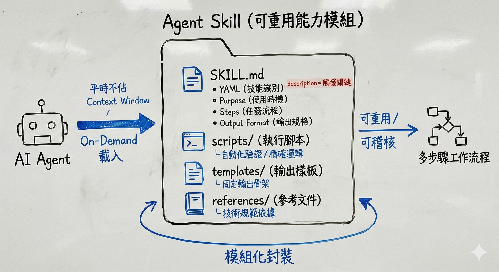

# Agent Skill 的目錄組成結構說明與範本

關於 Agent Skill 的目錄組成元素說明與範本檔案，可參考我的 Gist：<https://reurl.cc/1kyZAQ>

---

Agent Skill 是一種「可攜、可版本控管的能力封裝」，通常以一個目錄形式存在，內含：

- 指令（instructions）
- 腳本（scripts）
- 資源（resources）

Agent 可發現並在需要（On-Demand）時載入/使用這些技能，平常不佔用 Context Window，只有在使用者觸發特定任務時，Agent 才會使用該技能。如此能以更準確、更有效率且更經濟實惠地（不耗費過量的 tokens）地完成任務。

## Skill 目錄結構說明

根據 [agentskills.io](https://agentskills.io) 的開源規格，一個 Skill 並非單一檔案，而是一個具備結構的目錄。這種設計是為了確保技能可以被獨立封裝、版本控管，並能在不同的開發環境（如 VS Code 或 Claude Code）中維持一致的行為。

以下是 Skill 目錄組成結構的簡要說明：

### SKILL.md：核心合約與邏輯

**用途**：這是 Skill 的定義文件，也是 Agent 讀取的主要內容。

- **YAML Frontmatter**：定義技能名稱與用途，供 Agent 進行技能發現（discovery）。
- **Purpose**：說明「何時應使用這個 Skill」。
- **Steps**：固定任務流程，避免模型即興生成。
- **Output Format**：明確規範輸出結構，降低不一致風險。
- **Examples（建議）**：提供輸入與輸出範例，提高準確度。

一個符合上述格式的 SKILL.md 範本示例：

```markdown
---
name: web-ui-testing
description: 進行網站操作驗證並回傳結果
---

## Purpose

當需要驗證 Web 操作流程時使用此技能。

## Steps

1. 開啟指定網址
2. 執行操作步驟
3. 擷取結果

## Output Format

請以 JSON 格式回傳測試狀態與說明。
```

> **關於 `description` 的觸發邏輯**
>
> Agent 在技能發現（discovery）階段，通常會依據 `name` 與 `description` 判斷是否應觸發此 Skill。它直接定義了觸發時機：只有當使用者的 Prompt 需求與此描述高度匹配時，Agent 才會精準地「喚醒」並載入該 Skill 的完整內容。因此，描述中必須清楚包含動作導向的關鍵字（如：生成、重構、檢查），這直接決定了 Agent 判斷是否自動載入的準確度。

### scripts/（執行腳本）

**用途**：存放輔助任務的腳本範本，用於處理 Agent 難以透過語言推論完成的精確邏輯，如複雜的格式轉換或自動化校驗。

例如，我們可以寫一個腳本 `verify-test-audit.js`，讓 Agent 在執行 Web UI 測試任務時呼叫。強制檢查產出的測試腳本是否包含「截圖驗證」步驟，確保自動化流程具備「視覺證據」供日後稽核。

```javascript
// 使用 Node.js 強制檢查測試腳本是否具備稽核能力
const fs = require('fs');
const testFile = process.argv[2];
const content = fs.readFileSync(testFile, 'utf8');

// 規範：Web UI 測試必須包含 page.screenshot 以留存證據
if (!content.includes('page.screenshot')) {
  console.error("驗證失敗：測試腳本缺少『截圖』步驟，不符合專案稽核規範。");
  process.exit(1); // 終止並要求 Agent 修正測試邏輯
}
console.log("驗證通過：測試腳本具備自動化稽核能力。");
```

### templates/（輸出樣板）

**用途**：負責定義輸出的「骨架」，確保 Agent 產出的內容結構永遠符合預期，不隨意跑版。

例如，我們可以為 Web UI 測試建立一個測試案例文件結構，以確保輸出格式的統一樣式。

**UI_TEST_CASE_TEMPLATE.md**

```markdown
# UI 測試案例：{{test_title}}

## 1. 測試目標

- {{objective}}

## 2. 操作步驟

1. 導航至：{{url}}
2. 預期行為：{{expected_behavior}}

## 3. 稽核證據

- [ ] 必須包含截圖：{{screenshot_name}}.png
```

### references/（參考文件）

**用途**：存放相關技術文件或規範說明，供技能在需要時引用。

例如，讓 Agent 在撰寫測試腳本時有明確的規範可循（如定位器選取優先順序），從而大幅降低無效程式碼的產生。

**playwright-locator-rules.md**

```markdown
# Playwright 定位器優先規範

為了提升測試穩定性，請依序使用以下定位器：

1. **data-testid**: `page.getByTestId()` (首選)
2. **Role**: `page.getByRole()` (語意化標籤)
3. **Text**: `page.getByText()`
4. **禁止使用**: 易碎的 CSS Selector (如 `.btn-01`) 或絕對路徑 XPath。
```

## 如何有效驗證 Skill 的完整性？

建立 Skill 不只是撰寫 `SKILL.md`，更重要的是確保其**結構正確、欄位完整、觸發描述清晰**。

在實務上，驗證 Skill 完整性可從三個面向檢查：

- 是否具備必要的 YAML Frontmatter（特別是 `name` 與 `description`）
- 是否清楚定義 Purpose、Steps 與 Output Format
- 是否存在與說明一致的 scripts / templates / references 結構

為了避免人工疏漏，可使用官方提供的範例 Skill —— **skill-creator**。它除了作為建立 Skill 的範本外，也提供一種標準化結構參考，可用來比對與驗證自訂 Skill 是否符合規格。

- 參考連結：[anthropics/skills - skill-creator](https://github.com/anthropics/skills/tree/main/skills/skill-creator)


