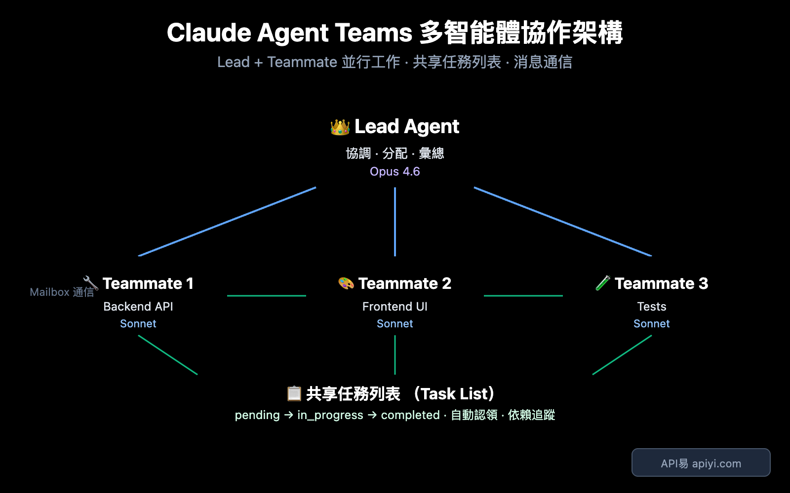
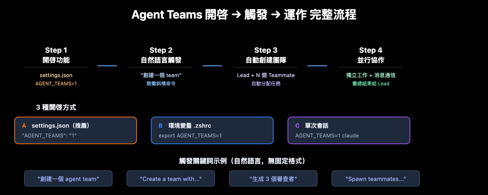
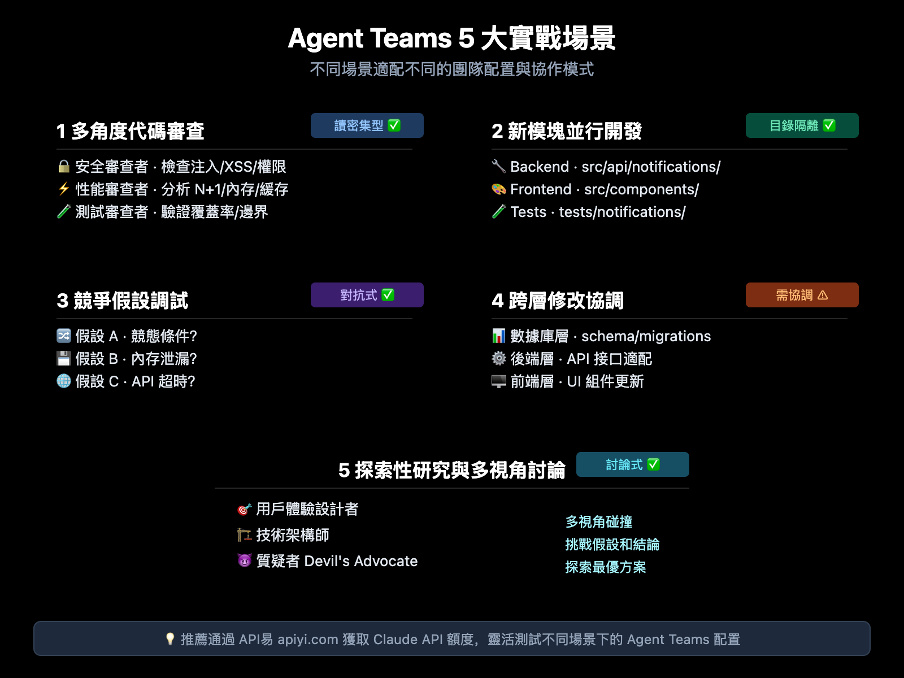

# Claude 4.6 Agent Teams 完整教學：開啟方法、觸發技巧與 5 大實戰場景

Claude Opus 4.6 發布時同步帶來了 `Agent Teams` 功能，讓多個 Claude Code 實例可以像開發團隊一樣並行協作。這篇文章整理了 Agent Teams 的核心概念、開啟方式、操作技巧，以及適合使用的實戰場景。

讀完後，你可以快速掌握：

- Agent Teams 和 Subagent 的差異
- 如何在 Claude Code 中開啟 Agent Teams
- 如何用自然語言建立團隊並分配工作
- 哪些任務最適合用 Agent Teams



---

## 什麼是 Agent Teams？

Agent Teams 是 Claude Code 的實驗性功能，允許你在同一個專案中同時執行多個彼此獨立的 Claude Code 實例，並透過共享任務列表與訊息系統協作。

一句話理解：

> Agent Teams = 一個 Lead + 多個 Teammate，各自獨立工作、彼此溝通、共同完成複雜任務。

### Agent Teams 與 Subagent 的差異

| 對比面向 | Subagent | Agent Teams |
| --- | --- | --- |
| 通訊方式 | 只向主 Agent 回報結果 | 隊友之間可直接通訊 |
| 協調方式 | 主 Agent 統一管理 | 共享任務列表 + 自主認領 |
| 上下文 | 獨立上下文，結果回傳呼叫者 | 獨立上下文，具備更高自治性 |
| 適合任務 | 聚焦、單點、只要結果的任務 | 需要討論、協作、並行推進的任務 |
| Token 消耗 | 較低 | 較高 |

### 核心架構

Agent Teams 主要由四個元件組成：

| 元件 | 職責 | 說明 |
| --- | --- | --- |
| Lead Agent | 團隊負責人 | 主 Claude Code 會話，負責建立團隊、分配任務、整合結果 |
| Teammate | 隊友 | 獨立的 Claude Code 實例，各自處理分配到的工作 |
| Task List | 共享任務列表 | 所有成員都可看到的任務看板，支援狀態追蹤與依賴 |
| Mailbox | 訊息系統 | 支援私訊與廣播，讓隊友可以直接協調 |

> 重點：Subagent 比較像「下屬回報」，Agent Teams 比較像「團隊協作」。

---

## 如何開啟 Agent Teams

Agent Teams 預設是關閉的，需要先啟用實驗功能。



### 方法一：修改 `settings.json`

```json
{
  "env": {
    "CLAUDE_CODE_EXPERIMENTAL_AGENT_TEAMS": "1"
  }
}
```

### 方法二：設定環境變數

```bash
export CLAUDE_CODE_EXPERIMENTAL_AGENT_TEAMS=1
```

如果要長期生效，可以把這行加入 `.bashrc` 或 `.zshrc`。

### 方法三：只在單次會話啟用

```bash
CLAUDE_CODE_EXPERIMENTAL_AGENT_TEAMS=1 claude
```

### 觸發方式

Agent Teams 沒有固定的 `/agent-teams` 指令。啟用功能後，直接用自然語言描述你要的團隊即可。

```text
建立一個 agent team 來審查 PR #142。
生成三個審查者：
- 一個專注安全問題
- 一個檢查效能影響
- 一個驗證測試覆蓋率
讓他們各自審查後回報發現。
```

也可以直接要求平行開發：

```text
Create a team with 4 teammates to refactor these modules in parallel.
Use Sonnet for each teammate.
```

### 顯示模式

| 模式 | 說明 | 適用情境 |
| --- | --- | --- |
| `in-process` | 所有隊友都在主終端內運行 | 一般終端、VS Code 內建終端 |
| `tmux` | 每個隊友在獨立面板中運行 | 已使用 tmux 或支援分屏的終端 |
| `auto` | 自動判斷使用方式 | 想交給系統決定時 |

可以用命令列指定：

```bash
claude --teammate-mode tmux
```

也可以寫進 `settings.json`：

```json
{
  "teammateMode": "tmux"
}
```

---

## 操作指南

### 鍵盤快速鍵

| 快速鍵 | 功能 |
| --- | --- |
| `Shift+Up/Down` | 切換或選擇不同隊友 |
| `Enter` | 查看選中隊友的會話內容 |
| `Escape` | 中斷隊友目前操作 |
| `Ctrl+T` | 切換任務列表檢視 |
| `Shift+Tab` | 切換委派模式 |

### 任務狀態與依賴

任務通常會依序經過以下狀態：

```text
pending -> in_progress -> completed
```

若任務之間存在依賴，可以透過 `blockedBy` 管理。當上游任務完成後，下游任務會自動解鎖。

常見的任務分配方式有三種：

1. Lead 明確指定任務給某位隊友。
2. 隊友完成手上工作後，自主認領下一個可執行任務。
3. 系統透過檔案鎖避免多人同時搶同一個任務。

### 隊友之間如何通訊

| 類型 | 說明 | 適用情境 |
| --- | --- | --- |
| `write` | 私訊指定隊友 | 討論特定模組或接口細節 |
| `broadcast` | 廣播給所有隊友 | 宣告重要決策或全域調整 |

廣播很方便，但團隊越大成本越高，應謹慎使用。

### Git 協作注意事項

Agent Teams 中最重要的規則之一是：

> 兩個隊友同時編輯同一個檔案，很容易互相覆蓋。

建議從一開始就拆清楚檔案責任，例如：

```text
後端隊友   -> src/api/、src/migrations/
前端隊友   -> src/components/
測試隊友   -> tests/
文件隊友   -> docs/
```

---

## 5 大實戰場景



### 1. 多角度程式碼審查

```text
建立一個 agent team 審查這個 PR：
- 安全審查者：檢查注入、XSS、權限問題
- 效能審查者：分析 N+1 查詢、記憶體洩漏、快取策略
- 測試審查者：確認測試覆蓋率與邊界情況
讓他們各自審查後回報發現。
```

適合原因：三個維度幾乎互不干擾，天然適合並行。

### 2. 新功能模組並行開發

```text
Create a team to build the user notification system:
- Teammate 1: Build the backend API (src/api/notifications/)
- Teammate 2: Build the frontend components (src/components/notifications/)
- Teammate 3: Write integration tests (tests/notifications/)
```

適合原因：責任邊界清楚，檔案衝突低。

### 3. 競爭假設偵錯

```text
有一個間歇性 Bug，建立 team 用不同假設偵錯：
- 隊友 A：調查是否為競態條件
- 隊友 B：調查是否為記憶體洩漏
- 隊友 C：調查是否為第三方 API 逾時
各自驗證假設並回報。
```

適合原因：可以同時沿多條線索排查，縮短定位根因的時間。

### 4. 跨層修改協調

當需求同時涉及前端、後端與資料庫時，可以讓不同隊友各自負責一層，再透過訊息系統同步接口與資料結構。

### 5. 探索性研究

```text
我在設計一個 CLI 工具來追蹤程式碼中的 TODO 註解。
建立一個團隊從不同角度探索：
- 一個隊友負責使用者體驗
- 一個隊友負責技術架構
- 一個隊友扮演質疑者（devil's advocate）
```

適合原因：多視角碰撞能更快發現盲點與風險。

---

## 什麼時候該選 Agent Teams？

| 判斷面向 | 選 Subagent | 選 Agent Teams |
| --- | --- | --- |
| 隊友需要互相溝通嗎？ | 不需要 | 需要 |
| 任務可以高度並行嗎？ | 部分可行 | 非常適合 |
| 是否會同時改很多檔案？ | 同檔作業較安全 | 需先分工避免衝突 |
| 任務複雜度 | 單點、聚焦 | 多模組、多角度 |
| 是否需要互相質疑與交叉驗證？ | 通常不需要 | 很適合 |

簡單說：

- 只需要一個人快速查資料、做一件事、回報結果，用 Subagent。
- 需要多人平行分析、彼此討論、共同推進，用 Agent Teams。

---

## 進階技巧

### 混合模型降低成本

```text
建立一個團隊，Lead 使用 Opus，4 個隊友使用 Sonnet。
```

這樣可以讓 Lead 保持較強的規劃能力，同時用較低成本的模型執行具體工作。

### 先提方案，再批准執行

```text
生成一個架構師隊友來重構認證模組。
要求在修改前先提交方案等待審批。
```

適合用在高風險重構或需要明確決策節點的工作流。

### 開啟委派模式

使用 `Shift+Tab` 可以讓 Lead 偏向協調與分配工作，而不是自己直接下場編碼。

---

## 已知限制與最佳實踐

### 已知限制

1. `/resume` 與 `/rewind` 不會恢復已關閉的隊友。
2. 一個 Lead 同時只能管理一個團隊。
3. 隊友不能再建立自己的巢狀團隊。
4. 隊友預設會繼承 Lead 的權限模式。
5. `tmux` 分屏模式並非所有終端都支援。

### 最佳實踐

- 團隊規模先從 2 到 5 人開始。
- 任務拆分通常比人數更重要。
- 讀多寫少的任務最適合 Agent Teams。
- 若是大量並行寫檔，先設計清楚檔案邊界。

---

## 總結

Claude 4.6 Agent Teams 讓 AI 開發從單一助手模式，走向更接近真實團隊的協作模式。

如果你要處理的是：

- 多角度程式碼審查
- 多模組並行開發
- 多假設除錯
- 跨層修改協調
- 探索性研究

那麼 Agent Teams 很值得嘗試。

如果任務只是單點查詢、一次性修正、或只需要快速拿到答案，Subagent 通常會更省成本。

---

## 參考資料

- [Claude Code 文件：Agent Teams](https://code.claude.com/docs/en/agent-teams)
- [Anthropic Engineering：Building a C compiler with a team of parallel Claudes](https://www.anthropic.com/engineering/building-c-compiler)
- [Anthropic：Introducing Claude Opus 4.6](https://www.anthropic.com/news/claude-opus-4-6)
