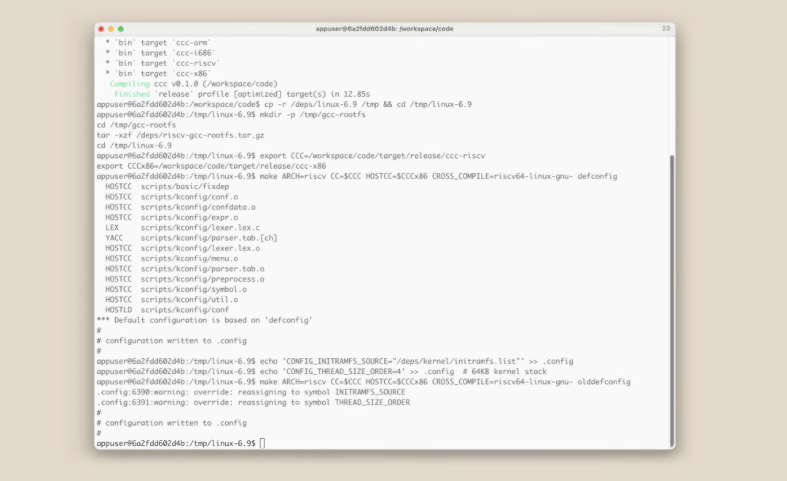
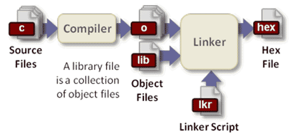
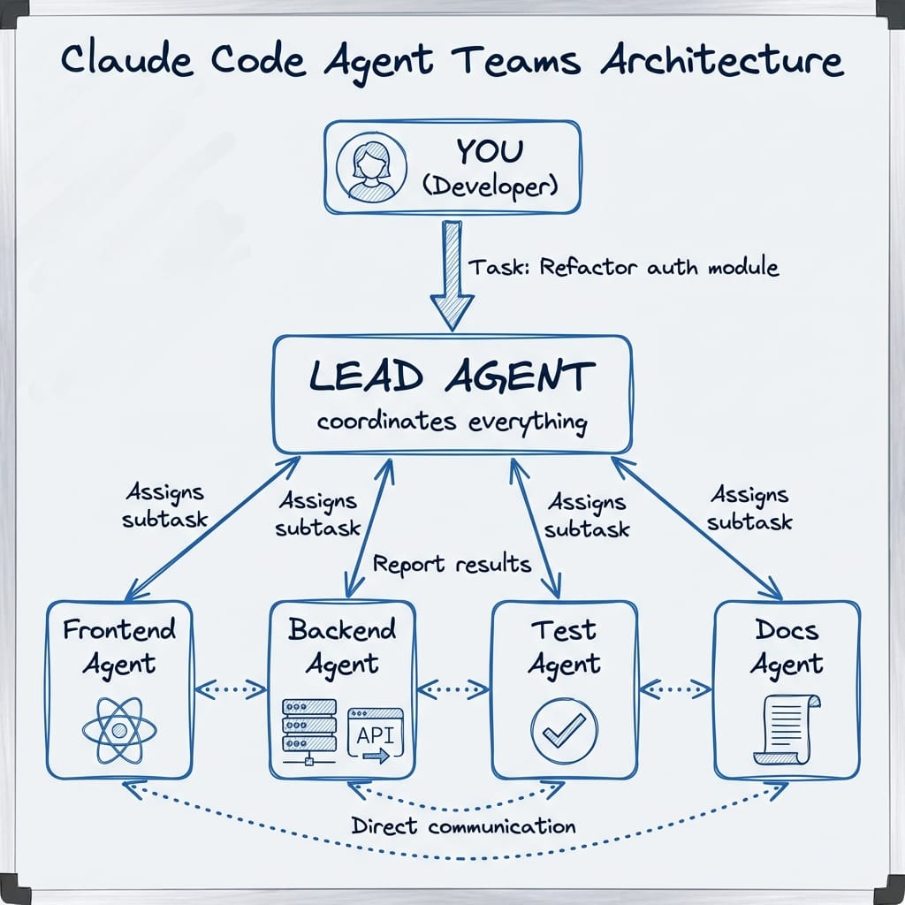

# 16 個 AI Agent 協作從零寫出 C 編譯器，還能編譯 Linux 核心

Anthropic 在 2026 年初做了一個很誇張的實驗：讓 16 個 Claude Opus 4.6 agent 平行協作，花兩週時間，從零開始用 Rust 寫出一個能編譯 Linux 6.9 的 C 編譯器。

這件事的重點，不只是「AI 會寫程式」，而是它已經能在長時間、多角色、共享版本庫的情境下，完成接近真實大型工程的工作。

## 到底發生了什麼

Anthropic 研究員 Nicholas Carlini 設計了一個實驗環境：

- 16 個 Claude Opus 4.6 instance 同時工作
- 每個 agent 都在自己的 Docker 容器內執行
- 共享同一個 Git repository
- 以 Rust 從零實作 C compiler
- 透過測試框架與持續回饋推進開發

Carlini 並沒有逐行帶著模型寫。他主要負責的是把執行環境、版本控制流程與驗證機制搭起來，然後讓 agent 自己持續往前推。

兩週後，這組 agent 交出了下列結果：

- 約 10 萬行 Rust 程式碼
- GCC torture test 通過率約 99%
- 可編譯 Linux 6.9 核心
- 支援 x86、ARM、RISC-V
- 可編譯 Doom、PostgreSQL、Redis、FFmpeg、SQLite、QEMU
- 總成本約 20,000 美元
- 近 2,000 個 Claude Code session

## 它們怎麼協作

這個實驗最值得注意的地方，是幾乎沒有傳統意義上的「主管 agent」。

16 個 agent 共用同一份程式碼庫，但各自獨立運作。每個 agent 的典型流程是：

1. 從主倉庫拉最新程式碼。
2. 自己判斷下一個最值得處理的問題。
3. 透過 lock 檔先占住任務。
4. 寫程式、跑測試、檢查輸出。
5. 合併最新變更後再推回主幹。
6. 遇到 merge conflict 時自行處理。

這表示協作不是靠人工排工，而是靠共享倉庫、任務鎖與測試訊號來維持秩序。

## 多 Agent 的角色分工

這些 agent 並不是每個都做同一件事。Anthropic 觀察到它們會逐漸形成角色分化，例如：

- 有的 agent 專門清理重複程式碼
- 有的 agent 專注於改善 compiler 效能
- 有的 agent 像 Rust reviewer，負責檢討設計
- 有的 agent 主要維護文件與說明

這也是整件事真正的突破點之一。過去大家看到的是單一 AI 幫你補函式、修 bug；這次看到的是一整組 agent 以團隊方式處理大型系統。

## 為什麼測試框架比模型本身更重要

這個實驗不是單純證明模型很強，而是證明「驗證環境設計得夠好時，模型能推進得很遠」。

關鍵原因包括：

- C 編譯器的語言規格相對明確
- 有現成測試集可以持續驗證
- 有 GCC、Clang 等成熟實作可作為對照
- 問題可以透過測試結果快速收斂

換句話說，真正讓這件事成立的，不只是模型能力，而是完整的 feedback loop。

## 這件事的限制

這個編譯器雖然很驚人，但距離成熟產品還有明顯差距。

### 1. 輸出效能仍不理想

即使打開最佳化，產生的機器碼效率仍落後 GCC。它能用，但還不是高品質 compiler。

### 2. 16-bit x86 仍有缺口

Linux 開機早期需要 16-bit real mode code，這部分 Claude 沒有完整解掉，最後仍借助 GCC 處理。

### 3. 工具鏈仍不完整

自有 assembler 與 linker 並未完全成熟，部分流程仍依賴 GNU toolchain。

### 4. 程式碼品質是「可用」不是「精煉」

Carlini 的說法很直接：最終成果已經接近 Opus 能力邊界。也就是說，這套系統可以完成任務，但還沒有達到資深工程師會期待的整體品質。

## 為什麼這件事很重要

這件事重要，不是因為「AI 終於能寫 C compiler」，而是因為它證明了另一件更大的事：

**多個 AI agent 已經能夠像工程團隊一樣，處理需要模組切分、回歸驗證、版本協作與衝突解決的大型軟體專案。**

這代表未來的開發模式，很可能從：

- 一個人搭配一個 coding assistant

走向：

- 一個人定義目標與驗收方式
- 多個 agent 分工推進實作
- 人類負責 review、風險控管與最終驗證

## 對不同角色的意義

### 對工程師

真正重要的能力，會越來越偏向：

- 定義明確需求
- 設計有效測試
- 建立可追蹤的回饋迴路
- 管理 agent 協作品質

### 對創業者

花 20,000 美元就能推進一個編譯器級別的實驗，表示複雜軟體開發的門檻正在快速下降。成本若持續往下掉，小團隊能做的事情會比以前大很多。

### 對技術管理者

這已經不是簡報上的概念驗證，而是可編譯 Linux 核心的真實案例。下一步要思考的是：哪些工作適合交給 agent team，哪些工作仍需要高度人工判斷。

## 我的觀察

這類實驗最值得警惕的地方，不是模型會不會寫，而是人類會不會因為看到大量產出與綠燈測試，就過度相信結果。

面對 10 萬行幾乎沒有人逐段細看的程式碼，合理的態度不是盲目樂觀，也不是直接否定，而是承認：

- 工具已經比多數人想像的更強
- 驗證仍然是人類不能外包的責任
- 真正的瓶頸正從「寫程式」轉移到「定義問題與驗證問題」

## 相關連結

- [Anthropic Engineering 原文：Building a C compiler with a team of parallel Claudes](https://www.anthropic.com/engineering/building-c-compiler)
- [編譯器 GitHub 原始碼：anthropics/claudes-c-compiler](https://github.com/anthropics/claudes-c-compiler)
- [Hacker News 討論串](https://news.ycombinator.com/item?id=46903616)

## 資訊來源

- 原始文章主題來自 Anthropic 官方工程部落格。
- 初稿內容整理自 `test.md` 的文章草稿，已重新排版、轉為繁體中文並修正為正式 Markdown 結構。
