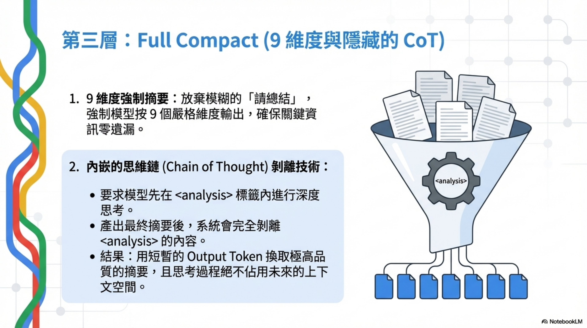
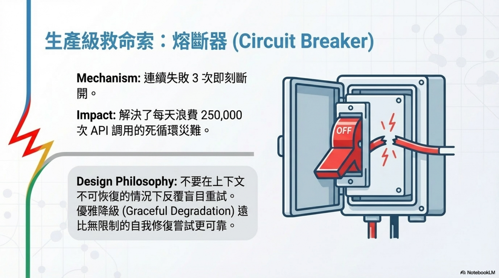

# Claude Code 上下文工程：四層壓縮機制的源碼級拆解


**作者：** Wisely Chen **日期：** 2026年4月 **系列：** Claude Code 開源設計細節（EP3）

> 本文是「Claude Code 開源設計細節」系列的第三篇。本系列從 Claude Code 的 TypeScript 原始碼出發，拆解 Anthropic 怎麼設計一個生產級 AI Coding Agent。
> 
> -   **EP1：** [System Prompt 架構](https://ai-coding.wiselychen.com/claude-code-system-prompt-source-code-analysis/)
> -   **EP2：** [資安架構：14 條 Best Practice 原始碼驗證](https://ai-coding.wiselychen.com/claude-code-security-best-practices-source-code-verified/)
> -   **EP3（本篇）：** 上下文工程：四層壓縮機制

> 我把 Claude Code 洩漏的源碼翻了一遍，發現它的上下文管理不是一個功能，是一個完整的子系統。四層壓縮、熔斷器、Cache Editing API — 每一個設計決策背後都有真實的生產事故。這篇文章附上所有源碼位置，你可以自己去驗證。

先說數字：
```plaintext
src/services/compact/
```
 目錄下有 **11 個 TypeScript 文件，共 3,960 行代碼**。光是壓縮這件事，就寫了快 4,000 行。

更震撼的是源碼註釋裡的一條生產數據：

> BQ 2026-03-10: 1,279 sessions had 50+ consecutive failures (up to 3,272) in a single session, wasting ~250K API calls/day globally.

**每天浪費 25 萬次 API 調用**，因為壓縮失敗後一直重試。修復方案？三行代碼，連續失敗超過三次就停止。

這個細節告訴我一件事：上下文管理不是設計好就完事的系統，它是一個在生產環境中持續踩坑、持續修補的戰場。


## 四層壓縮架構總覽


Claude Code 的上下文壓縮分成四層，從輕到重：

層級 | 名稱 | 成本 | 核心邏輯 |
| --- | --- | --- | --- |
| 第一層 | Micro Compact | 零成本 | 規則驅動，刪除舊的工具結果 |
| 第二層 | Session Memory Compact | 低成本 | 結構化事實提取，不調用模型 |
| 第三層 | Full Compact | 高成本 | 調用模型做 9 維度摘要 |
| 第四層 | Auto Compact | 自動觸發 | 熔斷保護，決定何時壓縮 |

每一層都假設上一層可能不夠用。每一層都有自己的成本和適用場景。


## 第一層：Micro Compact — 零成本的規則清理


微壓縮是成本最低的一層。不調用模型，純規則驅動。

核心邏輯：按工具類型白名單，保留最近 N 個工具結果，把更早的結果清掉。

### 白名單定義

```


<table class="rouge-table"><tbody><tr><td class="rouge-gutter gl"><pre class="lineno">1
2
3
4
5
6
7
8
9
10
11
</pre></td><td class="rouge-code"><pre><span class="c1">// src/services/compact/microCompact.ts:41-50</span>
<span class="kd">const</span> <span class="nx">COMPACTABLE_TOOLS</span> <span class="o">=</span> <span class="k">new</span> <span class="nb">Set</span><span class="o">&lt;</span><span class="kr">string</span><span class="o">&gt;</span><span class="p">([</span>
  <span class="nx">FILE_READ_TOOL_NAME</span><span class="p">,</span>
  <span class="p">...</span><span class="nx">SHELL_TOOL_NAMES</span><span class="p">,</span>
  <span class="nx">GREP_TOOL_NAME</span><span class="p">,</span>
  <span class="nx">GLOB_TOOL_NAME</span><span class="p">,</span>
  <span class="nx">WEB_SEARCH_TOOL_NAME</span><span class="p">,</span>
  <span class="nx">WEB_FETCH_TOOL_NAME</span><span class="p">,</span>
  <span class="nx">FILE_EDIT_TOOL_NAME</span><span class="p">,</span>
  <span class="nx">FILE_WRITE_TOOL_NAME</span><span class="p">,</span>
<span class="p">])</span>
</pre></td></tr></tbody></table>


```

📎 源碼位置：src/services/compact/microCompact.ts:41-50

為什麼是這 8 個工具？因為它們的輸出通常很大，但時效性短。你十分鐘前讀的文件內容，大概率已經不需要了。

### Cached Micro Compact：Cache 感知的精細清理

但刪除不是隨便刪的。Anthropic 的 API 有 Prompt Cache 機制 — 你發過去的 Prompt 前綴會被緩存在服務端，下次請求如果前綴一樣，就不用重新處理，省錢省時間。

所以微壓縮在清理的時候要考慮：這一刀下去，會不會把服務端的緩存搞失效？

源碼裡有一條專門的路徑叫 Cached Micro Compact，通過 Cache Editing API 告訴服務端「把這幾個工具結果刪了，但不動 Prompt 前綴」，緩存繼續有效。

```


<table class="rouge-table"><tbody><tr><td class="rouge-gutter gl"><pre class="lineno">1
2
3
4
5
6
7
8
9
10
11
12
13
14
15
16
17
18
19
20
21
22
23
24
25
</pre></td><td class="rouge-code"><pre><span class="c1">// src/services/compact/microCompact.ts:305-399</span>
<span class="k">async</span> <span class="kd">function</span> <span class="nx">cachedMicrocompactPath</span><span class="p">(</span>
  <span class="nx">messages</span><span class="p">:</span> <span class="nx">Message</span><span class="p">[],</span>
  <span class="nx">querySource</span><span class="p">:</span> <span class="nx">QuerySource</span> <span class="o">|</span> <span class="kc">undefined</span><span class="p">,</span>
<span class="p">):</span> <span class="nb">Promise</span><span class="o">&lt;</span><span class="nx">MicrocompactResult</span><span class="o">&gt;</span> <span class="p">{</span>
  <span class="kd">const</span> <span class="nx">mod</span> <span class="o">=</span> <span class="k">await</span> <span class="nx">getCachedMCModule</span><span class="p">()</span>
  <span class="kd">const</span> <span class="nx">state</span> <span class="o">=</span> <span class="nx">ensureCachedMCState</span><span class="p">()</span>
  <span class="c1">// ...</span>
  <span class="kd">const</span> <span class="nx">toolsToDelete</span> <span class="o">=</span> <span class="nx">mod</span><span class="p">.</span><span class="nx">getToolResultsToDelete</span><span class="p">(</span><span class="nx">state</span><span class="p">)</span>

  <span class="k">if</span> <span class="p">(</span><span class="nx">toolsToDelete</span><span class="p">.</span><span class="nx">length</span> <span class="o">&gt;</span> <span class="mi">0</span><span class="p">)</span> <span class="p">{</span>
    <span class="kd">const</span> <span class="nx">cacheEdits</span> <span class="o">=</span> <span class="nx">mod</span><span class="p">.</span><span class="nx">createCacheEditsBlock</span><span class="p">(</span><span class="nx">state</span><span class="p">,</span> <span class="nx">toolsToDelete</span><span class="p">)</span>
    <span class="k">if</span> <span class="p">(</span><span class="nx">cacheEdits</span><span class="p">)</span> <span class="p">{</span>
      <span class="nx">pendingCacheEdits</span> <span class="o">=</span> <span class="nx">cacheEdits</span>
    <span class="p">}</span>
    <span class="c1">// Return messages unchanged - cache edits are added at API layer</span>
    <span class="k">return</span> <span class="p">{</span>
      <span class="nx">messages</span><span class="p">,</span>
      <span class="na">compactionInfo</span><span class="p">:</span> <span class="p">{</span>
        <span class="na">pendingCacheEdits</span><span class="p">:</span> <span class="p">{</span> <span class="cm">/* ... */</span> <span class="p">},</span>
      <span class="p">},</span>
    <span class="p">}</span>
  <span class="p">}</span>
  <span class="k">return</span> <span class="p">{</span> <span class="nx">messages</span> <span class="p">}</span>
<span class="p">}</span>
</pre></td></tr></tbody></table>


```

📎 源碼位置：src/services/compact/microCompact.ts:305-399

注意看：
```plaintext
Return messages unchanged
```
 — 本地消息完全不動，靠 API 層的 cache editing 來處理。這個設計很聰明，避免了本地狀態和服務端緩存不同步的問題。

### 主線程隔離

還有一個細節：子 agent（像 session\_memory、prompt\_suggestion）如果也觸發微壓縮，可能會污染主線程的全局狀態。所以源碼用 
```plaintext
isMainThreadSource()
```
 做了隔離：

```


<table class="rouge-table"><tbody><tr><td class="rouge-gutter gl"><pre class="lineno">1
2
3
4
</pre></td><td class="rouge-code"><pre><span class="c1">// src/services/compact/microCompact.ts:249-251</span>
<span class="kd">function</span> <span class="nx">isMainThreadSource</span><span class="p">(</span><span class="nx">querySource</span><span class="p">:</span> <span class="nx">QuerySource</span> <span class="o">|</span> <span class="kc">undefined</span><span class="p">):</span> <span class="nx">boolean</span> <span class="p">{</span>
  <span class="k">return</span> <span class="o">!</span><span class="nx">querySource</span> <span class="o">||</span> <span class="nx">querySource</span><span class="p">.</span><span class="nx">startsWith</span><span class="p">(</span><span class="dl">'</span><span class="s1">repl_main_thread</span><span class="dl">'</span><span class="p">)</span>
<span class="p">}</span>
</pre></td></tr></tbody></table>


```

📎 源碼位置：src/services/compact/microCompact.ts:249-251

只有主線程才走 cache editing 路徑。子 agent 的壓縮走普通路徑，不碰全局狀態。

## 第二層：Session Memory Compact — 提煉而非摘要


這一層和微壓縮有本質區別：微壓縮是**刪東西**，會話記憶壓縮是**提煉東西**。

核心思路：不要把對話做摘要，而是從對話中提取結構化的事實 — 項目結構、用戶偏好、任務進度。然後讀取 
```plaintext
memory.md
```
 的內容，用這些結構化的記憶來替代傳統的對話摘要。

### 三個配置參數

```


<table class="rouge-table"><tbody><tr><td class="rouge-gutter gl"><pre class="lineno">1
2
3
4
5
6
</pre></td><td class="rouge-code"><pre><span class="c1">// src/services/compact/sessionMemoryCompact.ts:57-61</span>
<span class="k">export</span> <span class="kd">const</span> <span class="nx">DEFAULT_SM_COMPACT_CONFIG</span><span class="p">:</span> <span class="nx">SessionMemoryCompactConfig</span> <span class="o">=</span> <span class="p">{</span>
  <span class="na">minTokens</span><span class="p">:</span> <span class="mi">10</span><span class="nx">_000</span><span class="p">,</span>
  <span class="na">minTextBlockMessages</span><span class="p">:</span> <span class="mi">5</span><span class="p">,</span>
  <span class="na">maxTokens</span><span class="p">:</span> <span class="mi">40</span><span class="nx">_000</span><span class="p">,</span>
<span class="p">}</span>
</pre></td></tr></tbody></table>


```

📎 源碼位置：src/services/compact/sessionMemoryCompact.ts:57-61

系統從最後一條未被總結的消息開始往前擴展，直到同時滿足最小 token 數（10,000）和最小消息數（5 條），或者觸及最大 token 上限（40,000）。

### tool\_use / tool\_result 不能拆開

這裡有一個非常精細的邊界處理。擴展的時候，如果你保留了一條包含 
```plaintext
tool_result
```
 的用戶消息，就必須同時保留包含對應 
```plaintext
tool_use
```
 的助手消息，否則 API 會報錯。

```


<table class="rouge-table"><tbody><tr><td class="rouge-gutter gl"><pre class="lineno">1
2
3
4
5
6
7
8
9
10
11
12
13
14
15
16
17
18
19
20
21
22
23
24
25
26
27
28
29
30
31
32
</pre></td><td class="rouge-code"><pre><span class="c1">// src/services/compact/sessionMemoryCompact.ts:232-314</span>
<span class="k">export</span> <span class="kd">function</span> <span class="nx">adjustIndexToPreserveAPIInvariants</span><span class="p">(</span>
  <span class="nx">messages</span><span class="p">:</span> <span class="nx">Message</span><span class="p">[],</span>
  <span class="nx">startIndex</span><span class="p">:</span> <span class="kr">number</span><span class="p">,</span>
<span class="p">):</span> <span class="kr">number</span> <span class="p">{</span>
  <span class="c1">// Step 1: Handle tool_use/tool_result pairs</span>
  <span class="kd">const</span> <span class="nx">allToolResultIds</span><span class="p">:</span> <span class="kr">string</span><span class="p">[]</span> <span class="o">=</span> <span class="p">[]</span>
  <span class="k">for</span> <span class="p">(</span><span class="kd">let</span> <span class="nx">i</span> <span class="o">=</span> <span class="nx">startIndex</span><span class="p">;</span> <span class="nx">i</span> <span class="o">&lt;</span> <span class="nx">messages</span><span class="p">.</span><span class="nx">length</span><span class="p">;</span> <span class="nx">i</span><span class="o">++</span><span class="p">)</span> <span class="p">{</span>
    <span class="nx">allToolResultIds</span><span class="p">.</span><span class="nx">push</span><span class="p">(...</span><span class="nx">getToolResultIds</span><span class="p">(</span><span class="nx">messages</span><span class="p">[</span><span class="nx">i</span><span class="p">]</span><span class="o">!</span><span class="p">))</span>
  <span class="p">}</span>

  <span class="k">if</span> <span class="p">(</span><span class="nx">allToolResultIds</span><span class="p">.</span><span class="nx">length</span> <span class="o">&gt;</span> <span class="mi">0</span><span class="p">)</span> <span class="p">{</span>
    <span class="kd">const</span> <span class="nx">toolUseIdsInKeptRange</span> <span class="o">=</span> <span class="k">new</span> <span class="nb">Set</span><span class="o">&lt;</span><span class="kr">string</span><span class="o">&gt;</span><span class="p">()</span>
    <span class="k">for</span> <span class="p">(</span><span class="kd">let</span> <span class="nx">i</span> <span class="o">=</span> <span class="nx">adjustedIndex</span><span class="p">;</span> <span class="nx">i</span> <span class="o">&lt;</span> <span class="nx">messages</span><span class="p">.</span><span class="nx">length</span><span class="p">;</span> <span class="nx">i</span><span class="o">++</span><span class="p">)</span> <span class="p">{</span>
      <span class="c1">// collect tool_use IDs already in kept range</span>
    <span class="p">}</span>
    <span class="c1">// Find assistant messages with matching tool_use blocks</span>
    <span class="kd">const</span> <span class="nx">neededToolUseIds</span> <span class="o">=</span> <span class="k">new</span> <span class="nb">Set</span><span class="p">(</span>
      <span class="nx">allToolResultIds</span><span class="p">.</span><span class="nx">filter</span><span class="p">(</span><span class="nx">id</span> <span class="o">=&gt;</span> <span class="o">!</span><span class="nx">toolUseIdsInKeptRange</span><span class="p">.</span><span class="nx">has</span><span class="p">(</span><span class="nx">id</span><span class="p">)),</span>
    <span class="p">)</span>
    <span class="k">for</span> <span class="p">(</span><span class="kd">let</span> <span class="nx">i</span> <span class="o">=</span> <span class="nx">adjustedIndex</span> <span class="o">-</span> <span class="mi">1</span><span class="p">;</span> <span class="nx">i</span> <span class="o">&gt;=</span> <span class="mi">0</span> <span class="o">&amp;&amp;</span> <span class="nx">neededToolUseIds</span><span class="p">.</span><span class="nx">size</span> <span class="o">&gt;</span> <span class="mi">0</span><span class="p">;</span> <span class="nx">i</span><span class="o">--</span><span class="p">)</span> <span class="p">{</span>
      <span class="k">if</span> <span class="p">(</span><span class="nx">hasToolUseWithIds</span><span class="p">(</span><span class="nx">messages</span><span class="p">[</span><span class="nx">i</span><span class="p">]</span><span class="o">!</span><span class="p">,</span> <span class="nx">neededToolUseIds</span><span class="p">))</span> <span class="p">{</span>
        <span class="nx">adjustedIndex</span> <span class="o">=</span> <span class="nx">i</span>
      <span class="p">}</span>
    <span class="p">}</span>
  <span class="p">}</span>

  <span class="c1">// Step 2: Handle thinking blocks that share message.id</span>
  <span class="c1">// with kept assistant messages</span>
  <span class="c1">// ...</span>
  <span class="k">return</span> <span class="nx">adjustedIndex</span>
<span class="p">}</span>
</pre></td></tr></tbody></table>


```

📎 源碼位置：src/services/compact/sessionMemoryCompact.ts:232-314

它還要處理 thinking block 的情況 — 流式傳輸時，同一個 
```plaintext
message.id
```
 可能被拆成多條消息（thinking 在一條，tool\_use 在另一條），不能只保留後者。

這一層的優勢：**不需要調用模型來做摘要**，直接用已經提取好的結構化記憶，成本比完整壓縮低得多，而且保留了最近的原始消息。

## 第三層：Full Compact — 模型調用的 9 維度摘要



當會話記憶壓縮不可用或不夠用的時候，系統回退到完整壓縮。這一層需要調用模型。

### 9 個維度

源碼裡的 prompt 設計要求模型按 9 個維度來總結對話：

```


<table class="rouge-table"><tbody><tr><td class="rouge-gutter gl"><pre class="lineno">1
2
3
4
5
6
7
8
9
10
11
</pre></td><td class="rouge-code"><pre>// src/services/compact/prompt.ts:61-143

1. Primary Request and Intent — 用戶的所有明確請求
2. Key Technical Concepts — 技術概念、框架
3. Files and Code Sections — 檢視/修改/創建的文件
4. Errors and fixes — 所有錯誤和修復方式
5. Problem Solving — 問題解決過程
6. All user messages — 所有非工具結果的用戶消息
7. Pending Tasks — 明確被要求的待辦任務
8. Current Work — 摘要請求前正在做的工作
9. Optional Next Step — 下一步計畫
</pre></td></tr></tbody></table>


```

📎 源碼位置：src/services/compact/prompt.ts:61-143

這個結構化的摘要格式比「請總結一下對話」有效得多，因為它強制模型提取**所有關鍵維度**的信息，不會遺漏。

### analysis 標籤：內嵌的 Chain of Thought

這是我覺得最精妙的設計。Prompt 要求模型先在 
```plaintext
<analysis>
```
 標籤裡思考，再在 
```plaintext
<summary>
```
 標籤裡輸出最終摘要：

```


<table class="rouge-table"><tbody><tr><td class="rouge-gutter gl"><pre class="lineno">1
2
3
4
5
6
7
8
9
10
11
12
13
14
15
16
17
18
19
20
21
22
</pre></td><td class="rouge-code"><pre><span class="c1">// src/services/compact/prompt.ts:311-335</span>
<span class="k">export</span> <span class="kd">function</span> <span class="nx">formatCompactSummary</span><span class="p">(</span><span class="nx">summary</span><span class="p">:</span> <span class="kr">string</span><span class="p">):</span> <span class="kr">string</span> <span class="p">{</span>
  <span class="kd">let</span> <span class="nx">formattedSummary</span> <span class="o">=</span> <span class="nx">summary</span>

  <span class="c1">// Strip analysis section — it's a drafting scratchpad that improves summary</span>
  <span class="c1">// quality but has no informational value once the summary is written.</span>
  <span class="nx">formattedSummary</span> <span class="o">=</span> <span class="nx">formattedSummary</span><span class="p">.</span><span class="nx">replace</span><span class="p">(</span>
    <span class="sr">/&lt;analysis&gt;</span><span class="se">[\s\S]</span><span class="sr">*</span><span class="se">?</span><span class="sr">&lt;</span><span class="se">\/</span><span class="sr">analysis&gt;/</span><span class="p">,</span>
    <span class="dl">''</span><span class="p">,</span>
  <span class="p">)</span>

  <span class="c1">// Extract and format summary section</span>
  <span class="kd">const</span> <span class="nx">summaryMatch</span> <span class="o">=</span> <span class="nx">formattedSummary</span><span class="p">.</span><span class="nx">match</span><span class="p">(</span><span class="sr">/&lt;summary&gt;</span><span class="se">([\s\S]</span><span class="sr">*</span><span class="se">?)</span><span class="sr">&lt;</span><span class="se">\/</span><span class="sr">summary&gt;/</span><span class="p">)</span>
  <span class="k">if</span> <span class="p">(</span><span class="nx">summaryMatch</span><span class="p">)</span> <span class="p">{</span>
    <span class="kd">const</span> <span class="nx">content</span> <span class="o">=</span> <span class="nx">summaryMatch</span><span class="p">[</span><span class="mi">1</span><span class="p">]</span> <span class="o">||</span> <span class="dl">''</span>
    <span class="nx">formattedSummary</span> <span class="o">=</span> <span class="nx">formattedSummary</span><span class="p">.</span><span class="nx">replace</span><span class="p">(</span>
      <span class="sr">/&lt;summary&gt;</span><span class="se">[\s\S]</span><span class="sr">*</span><span class="se">?</span><span class="sr">&lt;</span><span class="se">\/</span><span class="sr">summary&gt;/</span><span class="p">,</span>
      <span class="s2">`Summary:\n</span><span class="p">${</span><span class="nx">content</span><span class="p">.</span><span class="nx">trim</span><span class="p">()}</span><span class="s2">`</span><span class="p">,</span>
    <span class="p">)</span>
  <span class="p">}</span>
  <span class="k">return</span> <span class="nx">formattedSummary</span><span class="p">.</span><span class="nx">trim</span><span class="p">()</span>
<span class="p">}</span>
</pre></td></tr></tbody></table>


```

📎 源碼位置：src/services/compact/prompt.ts:311-335

```plaintext
<analysis>
```
 部分在格式化的時候**會被完全剝離**，不會進入壓縮後的上下文。它的作用純粹是讓模型在輸出摘要之前先想清楚，提高摘要質量。

本質上就是一個內嵌的 Chain of Thought — 花費一些 output token 來換取更好的摘要品質，然後把思考過程丟掉，只保留結果。

### 壓縮本身也可能太長

還有一個很實際的問題：**壓縮請求本身可能觸發 prompt too long 錯誤**。對，你沒看錯，用來縮短上下文的壓縮操作，本身的輸入可能就超長了。

```


<table class="rouge-table"><tbody><tr><td class="rouge-gutter gl"><pre class="lineno">1
2
3
</pre></td><td class="rouge-code"><pre><span class="c1">// src/services/compact/compact.ts:227-228</span>
<span class="kd">const</span> <span class="nx">MAX_PTL_RETRIES</span> <span class="o">=</span> <span class="mi">3</span>
<span class="kd">const</span> <span class="nx">PTL_RETRY_MARKER</span> <span class="o">=</span> <span class="dl">'</span><span class="s1">[earlier conversation truncated for compaction retry]</span><span class="dl">'</span>
</pre></td></tr></tbody></table>


```

📎 源碼位置：src/services/compact/compact.ts:227-228

解法是按 API 輪次分組，從最早的組開始丟棄，最多重試三次。如果精確的 token 差距無法確定，就丟掉最老的 20%。


### 壓縮後的善後工作

壓縮完成後，系統要做一系列善後：

```


<table class="rouge-table"><tbody><tr><td class="rouge-gutter gl"><pre class="lineno">1
2
3
4
</pre></td><td class="rouge-code"><pre><span class="c1">// src/services/compact/compact.ts:122-124</span>
<span class="k">export</span> <span class="kd">const</span> <span class="nx">POST_COMPACT_MAX_FILES_TO_RESTORE</span> <span class="o">=</span> <span class="mi">5</span>
<span class="k">export</span> <span class="kd">const</span> <span class="nx">POST_COMPACT_TOKEN_BUDGET</span> <span class="o">=</span> <span class="mi">50</span><span class="nx">_000</span>
<span class="k">export</span> <span class="kd">const</span> <span class="nx">POST_COMPACT_MAX_TOKENS_PER_FILE</span> <span class="o">=</span> <span class="mi">5</span><span class="nx">_000</span>
</pre></td></tr></tbody></table>


```

📎 源碼位置：src/services/compact/compact.ts:122-124

重新注入最近訪問的文件內容（最多 5 個文件，每個上限 5,000 token，總預算 50,000 token）。還有 plan 文件、skill 內容、MCP 工具說明、agent 列表 — 這些都是壓縮過程中被丟掉的上下文，需要恢復。

## 第四層：Auto Compact — 熔斷保護


前面三層都是「怎麼壓」，這一層解決「什麼時候壓」。

### 觸發閾值

```


<table class="rouge-table"><tbody><tr><td class="rouge-gutter gl"><pre class="lineno">1
2
3
4
5
</pre></td><td class="rouge-code"><pre><span class="c1">// src/services/compact/autoCompact.ts:62-65</span>
<span class="k">export</span> <span class="kd">const</span> <span class="nx">AUTOCOMPACT_BUFFER_TOKENS</span> <span class="o">=</span> <span class="mi">13</span><span class="nx">_000</span>
<span class="k">export</span> <span class="kd">const</span> <span class="nx">WARNING_THRESHOLD_BUFFER_TOKENS</span> <span class="o">=</span> <span class="mi">20</span><span class="nx">_000</span>
<span class="k">export</span> <span class="kd">const</span> <span class="nx">ERROR_THRESHOLD_BUFFER_TOKENS</span> <span class="o">=</span> <span class="mi">20</span><span class="nx">_000</span>
<span class="k">export</span> <span class="kd">const</span> <span class="nx">MANUAL_COMPACT_BUFFER_TOKENS</span> <span class="o">=</span> <span class="mi">3</span><span class="nx">_000</span>
</pre></td></tr></tbody></table>


```

📎 源碼位置：src/services/compact/autoCompact.ts:62-65

每次模型調用之後，檢查當前 token 用量。如果超過 
```plaintext
effective_window - 13,000
```
，就自動觸發壓縮。13,000 的緩衝確保在窗口真正爆掉之前就開始處理。

觸發順序：先嘗試會話記憶壓縮 → 如果不可用或壓縮後仍然超標 → 回退到完整壓縮。

### 熔斷器

```


<table class="rouge-table"><tbody><tr><td class="rouge-gutter gl"><pre class="lineno">1
2
3
4
5
</pre></td><td class="rouge-code"><pre><span class="c1">// src/services/compact/autoCompact.ts:67-70</span>
<span class="c1">// Stop trying autocompact after this many consecutive failures.</span>
<span class="c1">// BQ 2026-03-10: 1,279 sessions had 50+ consecutive failures (up to 3,272)</span>
<span class="c1">// in a single session, wasting ~250K API calls/day globally.</span>
<span class="kd">const</span> <span class="nx">MAX_CONSECUTIVE_AUTOCOMPACT_FAILURES</span> <span class="o">=</span> <span class="mi">3</span>
</pre></td></tr></tbody></table>


```

📎 源碼位置：src/services/compact/autoCompact.ts:67-70

就是開頭提到的那個修復。連續失敗超過 3 次，停止重試。避免在上下文不可恢復的情況下反覆浪費 API 調用。



### 排除邏輯：防止死鎖

```


<table class="rouge-table"><tbody><tr><td class="rouge-gutter gl"><pre class="lineno">1
2
3
4
5
6
</pre></td><td class="rouge-code"><pre><span class="c1">// src/services/compact/autoCompact.ts:169-173</span>
<span class="c1">// Recursion guards. session_memory and compact are forked agents that</span>
<span class="c1">// would deadlock.</span>
<span class="k">if</span> <span class="p">(</span><span class="nx">querySource</span> <span class="o">===</span> <span class="dl">'</span><span class="s1">session_memory</span><span class="dl">'</span> <span class="o">||</span> <span class="nx">querySource</span> <span class="o">===</span> <span class="dl">'</span><span class="s1">compact</span><span class="dl">'</span><span class="p">)</span> <span class="p">{</span>
  <span class="k">return</span> <span class="kc">false</span>
<span class="p">}</span>
</pre></td></tr></tbody></table>


```

📎 源碼位置：src/services/compact/autoCompact.ts:169-173

```plaintext
session_memory
```
 和 
```plaintext
compact
```
 本身就是 fork 出來的子 agent，如果它們也觸發壓縮，就會死鎖。源碼裡直接硬編碼排除。

還有一個更微妙的排除 — 當 Context Collapse 功能啟用時，自動壓縮也會被禁用，因為兩者會 race condition：

> Autocompact firing at effective-13k (~93% of effective) sits right between collapse’s commit-start (90%) and blocking (95%), so it would race collapse and usually win, nuking granular context that collapse was about to save.

這段註釋寫得非常清楚 — 93% 的自動壓縮閾值剛好卡在 Context Collapse 的 90% 提交和 95% 阻塞之間，會搶先觸發，毀掉 Collapse 正要保存的精細上下文。

## 坦白說

### 這套系統教了我什麼

1.  **上下文是稀缺資源，不是被動容器。** 每一個留在窗口裡的 token 都應該值得留。從微壓縮區分「緩存是否有效」來決定清理策略，到完整壓縮用 analysis 標籤提高摘要質量，每一個決策都在問同一個問題：這個 token 值不值得留？
    
2.  **分層降級比單一方案靠譜。** 零成本的規則清理 → 低成本的結構化提取 → 高成本的模型摘要 → 熔斷保護。每一層都有明確的適用場景和退化策略。
    
3.  **生產環境會教你設計。** 那個 25 萬次 API 調用的浪費，催生了三行代碼的熔斷器。prompt too long 的壓縮，催生了遞迴重試機制。這些都不是事前設計出來的，是踩坑踩出來的。

### 對我們做 AI Agent 開發的啟示

如果你在做 AI Agent，上下文管理可能是你最容易忽略、但影響最大的子系統。Claude Code 用了 3,960 行代碼來處理這件事，而大多數 Agent 框架連基本的壓縮都沒有。

不需要一開始就搞這麼複雜。但至少應該有：

-   一個基本的工具結果清理機制（對應第一層）
-   一個「什麼時候該壓縮」的觸發邏輯（對應第四層）
-   一個「壓縮失敗怎麼辦」的降級方案（對應熔斷器）

這三個加起來，大概 200 行代碼，就能解決 80% 的上下文爆炸問題。

## 源碼參考索引

所有源碼基於 2026 年 3 月 31 日通過 npm source map 洩漏的 Claude Code 快照版本。

 文件 | 行數 | 核心功能 |
| --- | --- | --- |
 microCompact.ts | 530 | 微壓縮、Cache Editing、主線程隔離 |
 sessionMemoryCompact.ts | 630 | 結構化記憶提取、API 不變量保護 |
 compact.ts | 1,705 | 完整壓縮、PTL 重試、壓縮後恢復 |
 prompt.ts | 374 | 9 維度摘要 prompt、analysis 剝離 |
 autoCompact.ts | 351 | 自動觸發、熔斷器、排除邏輯 |
 apiMicrocompact.ts | 153 | API 層的 cache editing 策略 |
 postCompactCleanup.ts | 77 | 壓縮後的文件和 skill 恢復 |
 timeBasedMCConfig.ts | \- | 基於時間的微壓縮過期配置 |
 compactWarningState.ts | \- | 壓縮警告狀態管理 |

## 常見問題 Q&A

**Q: 這些源碼連結是官方公開的嗎？**

不是。這份源碼來自 2026 年 3 月 31 日 npm 發行包中 source map 的意外洩漏。GitHub 上有多個鏡像倉庫用於安全研究。本文引用純粹用於教育目的和技術分析。

**Q: 我自己的 Agent 需要做到這麼複雜嗎？**

大概率不需要。Claude Code 面對的是全球規模的生產流量，很多設計（Cache Editing API、熔斷器）是為了處理極端情況。對大多數 Agent 來說，基本的工具結果清理 + 定時壓縮 + 失敗停止重試，就已經夠用了。

**Q: 為什麼不直接用更大的上下文窗口？**

因為窗口大小不是唯一瓶頸。更大的窗口意味著更高的成本和更慢的推理速度。Claude Code 的設計哲學是：**關鍵不是裝不裝得下，而是該不該裝進去**。把無關信息塞進窗口，反而會降低模型的輸出質量。

**Q: analysis 標籤的 Chain of Thought 設計真的有效嗎？**

從工程角度看，Anthropic 願意花 output token 讓模型「先想再答」，然後把思考過程丟掉，說明他們在內部測試中驗證過這個方法確實能提升摘要品質。這跟 extended thinking 的設計理念是一致的。

---


## 總結：上下文管理是 Agent 工程最被低估的子系統

拆完這 3,960 行，我最大的感受是：**大家都在聊 prompt engineering 和 tool use，但真正決定一個 Agent 能不能跑長 session 的，是上下文管理。**

Claude Code 的設計告訴我們幾件事：

**1\. 壓縮不是一個動作，是一個分層策略。**

從零成本的規則驅動（Micro Compact），到低成本的結構化提取（Session Memory），到高成本的模型摘要（Full Compact），再到自動觸發的熔斷保護（Auto Compact）——四層從輕到重，能不用模型就不用模型，能不花 token 就不花 token。

**2\. 生產環境的上下文問題，不是「窗口不夠大」，而是「不該裝的東西裝太多」。**

源碼裡反覆出現的設計哲學是：**關鍵不是裝不裝得下，而是該不該裝進去**。十分鐘前讀的檔案內容、已經過時的工具輸出、思考過程的中間產物——這些都是噪音，留著只會降低模型品質。

**3\. 最有價值的工程不是最複雜的，而是最務實的。**

每天浪費 25 萬次 API 調用的問題，修復方案是三行代碼的熔斷器。Cache Editing API 省下 40-60% 的重新處理成本。Session Memory 用結構化 JSON 提取事實，完全不呼叫模型。最好的工程是**用最低成本解決最高頻的問題**。

如果你在做自己的 Agent，不需要照搬這 4,000 行。但這三個原則——**分層壓縮、主動丟棄、失敗停止重試**——大概 200 行代碼就能實作，卻能解決 80% 的上下文問題。
