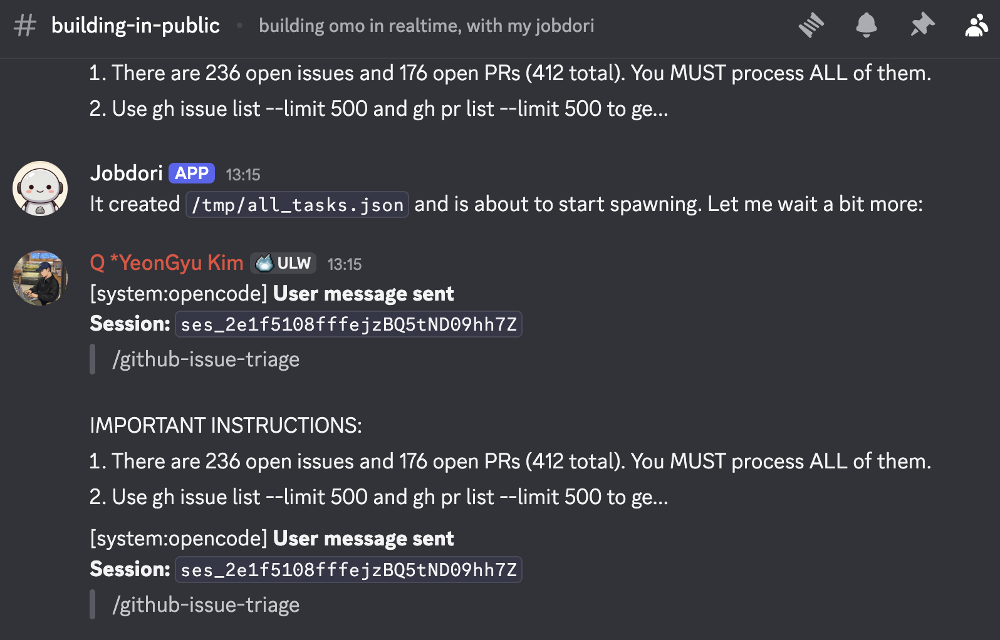
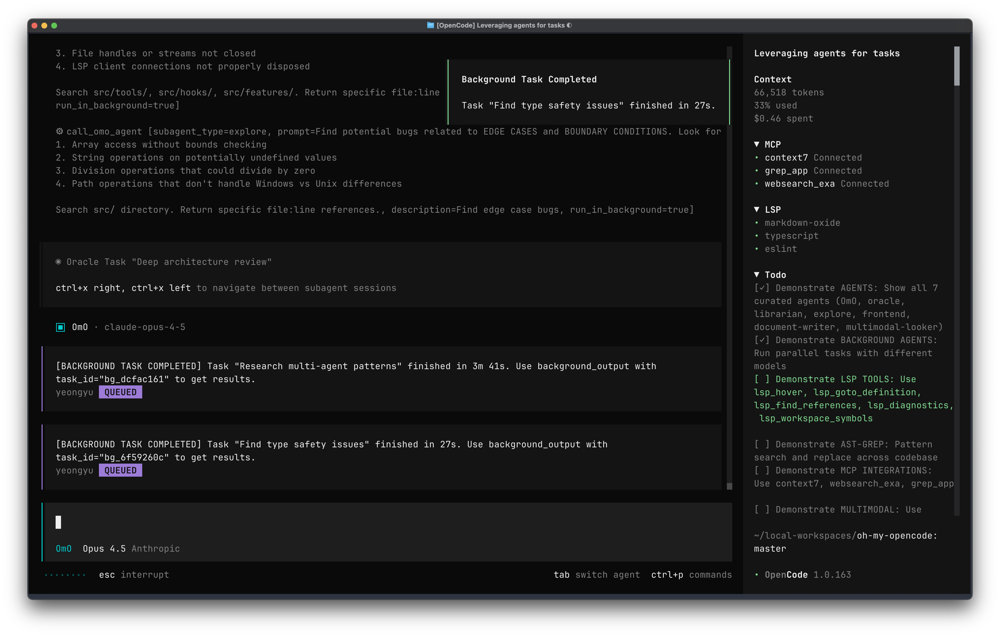

> [!WARNING]
> **一時的なお知らせ（今週）: メンテナー対応遅延のお知らせ**
>
> コアメンテナーのQが負傷したため、今週は Issue/PR への返信とリリースが遅れる可能性があります。
> ご理解とご支援に感謝します。

> [!TIP]
> **Building in Public**
>
> メンテナーが Jobdori を使い、oh-my-opencode をリアルタイムで開発・メンテナンスしています。Jobdori は OpenClaw をベースに大幅カスタマイズされた AI アシスタントです。
> すべての機能開発、修正、Issue トリアージを Discord でライブでご覧いただけます。
>
> [](https://discord.gg/PUwSMR9XNk)
>
> [**→ #building-in-public で確認する**](https://discord.gg/PUwSMR9XNk)


> [!NOTE]
>
> [](https://sisyphuslabs.ai)
> > **私たちは、フロンティアエージェントの未来を定義するために、Sisyphusの完全なプロダクト版を構築しています。 <br />[こちら](https://sisyphuslabs.ai)からウェイトリストにご登録ください。**

> [!TIP]
> 私たちと一緒に！
>
> | [](https://discord.gg/PUwSMR9XNk) | [Discordコミュニティ](https://discord.gg/PUwSMR9XNk)に参加して、コントリビューターや他の `oh-my-opencode` ユーザーと交流しましょう。 |
> | :-----| :----- |
> | [](https://x.com/justsisyphus) | `oh-my-opencode` のニュースやアップデートは私のXアカウントで投稿されていましたが、 <br /> 誤って凍結されてしまったため、現在は [@justsisyphus](https://x.com/justsisyphus) が代わりにアップデートを投稿しています。 |
> | [](https://github.com/code-yeongyu) | さらに多くのプロジェクトを見たい場合は、GitHubで [@code-yeongyu](https://github.com/code-yeongyu) をフォローしてください。 |

<!-- <CENTERED SECTION FOR GITHUB DISPLAY> -->

<div align="center">

[](https://github.com/code-yeongyu/oh-my-openagent#oh-my-opencode)

[](https://github.com/code-yeongyu/oh-my-openagent#oh-my-opencode)

</div>

> これはステロイドを打ったコーディングです。一つのモデルのステロイドじゃない——薬局丸ごとです。
>
> Claudeでオーケストレーションし、GPTで推論し、Kimiでスピードを出し、Geminiでビジョンを処理する。モデルはどんどん安くなり、どんどん賢くなる。特定のプロバイダーが独占することはない。私たちはその開かれた市場のために構築している。Anthropicの牢獄は素敵だ。だが、私たちはそこに住まない。

<div align="center">

[](https://github.com/code-yeongyu/oh-my-openagent/releases)
[](https://www.npmjs.com/package/oh-my-opencode)
[](https://github.com/code-yeongyu/oh-my-openagent/graphs/contributors)
[](https://github.com/code-yeongyu/oh-my-openagent/network/members)
[](https://github.com/code-yeongyu/oh-my-openagent/stargazers)
[](https://github.com/code-yeongyu/oh-my-openagent/issues)
[](https://github.com/code-yeongyu/oh-my-openagent/blob/dev/LICENSE.md)
[](https://deepwiki.com/code-yeongyu/oh-my-openagent)

[English](README.md) | [한국어](README.ko.md) | [日本語](README.ja.md) | [简体中文](README.zh-cn.md)

</div>

<!-- </CENTERED SECTION FOR GITHUB DISPLAY> -->

## レビュー

> 「これのおかげで Cursor のサブスクリプションを解約しました。オープンソースコミュニティで信じられないことが起きています。」 - [Arthur Guiot](https://x.com/arthur_guiot/status/2008736347092382053?s=20)

> 「Claude Codeが人間なら3ヶ月かかることを7日でやるとしたら、Sisyphusはそれを1時間でやってのけます。タスクが終わるまでひたすら働き続けます。まさに規律あるエージェントです。」 <br/>- B, Quant Researcher

> 「Oh My Opencodeを使って、たった1日で8000個の eslint 警告を叩き潰しました。」 <br/>- [Jacob Ferrari](https://x.com/jacobferrari_/status/2003258761952289061)

> 「Ohmyopencodeとralph loopを使って、45k行のtauriアプリを一晩でSaaSウェブアプリに変換しました。インタビューモードから始めて、私のプロンプトに対して質問や推奨事項を尋ねました。勝手に作業していくのを見るのは楽しかったし、今朝起きたらウェブサイトがほぼ動いているのを見て驚愕しました！」 - [James Hargis](https://x.com/hargabyte/status/2007299688261882202)

> 「oh-my-opencodeを使ってください。もう二度と元には戻れません。」 <br/>- [d0t3ch](https://x.com/d0t3ch/status/2001685618200580503)

> 「何がどうすごいのかまだ上手く言語化できないんですが、開発体験が完全に異次元に到達してしまいました。」 - [苔硯:こけすずり](https://x.com/kokesuzuri/status/2008532913961529372?s=20)

> 「週末にマインクラフト/ソウルライクな化け物を作ろうと、open code、oh my opencode、supermemoryで実験中です。昼食後の散歩に行っている間に、しゃがむアニメーションを追加するように指示しておきました。[動画]」 - [MagiMetal](https://x.com/MagiMetal/status/2005374704178373023)

> 「これをコアに取り込んで彼を採用すべきだ。マジで。これ、本当に、本当に、本当に良い。」 <br/>- Henning Kilset

> 「彼を説得できるなら @yeon_gyu_kim を雇ってください。彼がopencodeに革命を起こしました。」 <br/>- [mysticaltech](https://x.com/mysticaltech/status/2001858758608376079)

> 「Oh My OpenCodeはマジでヤバい」 - [YouTube - Darren Builds AI](https://www.youtube.com/watch?v=G_Snfh2M41M)

---

# Oh My OpenCode

最初はこれを「Claude Codeにステロイドを打ったもの」と呼んでいました。それは過小評価でした。

一つのモデルに薬を盛るのではありません。カルテルを動かすんです。Claude、GPT、Kimi、Gemini——それぞれが得意なことを、並列で、止まらずに。モデルは毎月安くなっており、どのプロバイダーも独占できません。私たちはすでにその世界に生きています。

その泥臭い作業をすべてやっておきました。すべてをテストし、実際に機能するものだけを残しました。

OmOをインストールして、`ultrawork`とタイプしてください。狂ったようにコーディングしてください。


## インストール

### 人間向け

以下のプロンプトをコピーして、あなたのLLMエージェント（Claude Code、AmpCode、Cursorなど）に貼り付けてください：

```
Install and configure oh-my-opencode by following the instructions here:
https://raw.githubusercontent.com/code-yeongyu/oh-my-openagent/refs/heads/dev/docs/guide/installation.md
```

もしくは[インストールガイド](docs/guide/installation.md)を直接読んでもいいですが、マジでエージェントにやらせてください。人間は設定で必ずタイポします。

### LLMエージェント向け

インストールガイドを取得して、それに従ってください：

```bash
curl -s https://raw.githubusercontent.com/code-yeongyu/oh-my-openagent/refs/heads/dev/docs/guide/installation.md
```

---

## このREADMEをスキップする

ドキュメントを読む時代は終わりました。このテキストをエージェントに貼り付けるだけです：

```
Read this and tell me why it's not just another boilerplate: https://raw.githubusercontent.com/code-yeongyu/oh-my-openagent/refs/heads/dev/README.md
```

## ハイライト

### 🪄 `ultrawork`

本当にこれを全部読んでるんですか？信じられない。

インストールして、`ultrawork`（または `ulw`）とタイプする。完了です。

以下の内容、すべての機能、すべての最適化、何も知る必要はありません。ただ勝手に動きます。

以下のサブスクリプションだけでも、ultraworkは十分に機能します（このプロジェクトとは無関係であり、個人的な推奨にすぎません）：
- [ChatGPT サブスクリプション ($20)](https://chatgpt.com/)
- [Kimi Code サブスクリプション ($0.99) (*今月限定)](https://www.kimi.com/membership/pricing?track_id=5cdeca93-66f0-4d35-aabb-b6df8fcea328)
- [GLM Coding プラン ($10)](https://z.ai/subscribe)
- 従量課金（pay-per-token）の対象であれば、kimiやgeminiモデルを使っても費用はほとんどかかりません。

|       | 機能                                                     | 何をするのか                                                                                                                                                                                                                   |
| :---: | :------------------------------------------------------- | :----------------------------------------------------------------------------------------------------------------------------------------------------------------------------------------------------------------------------- |
|   🤖   | **規律あるエージェント (Discipline Agents)**             | Sisyphusが Hephaestus、Oracle、Librarian、Exploreをオーケストレーションします。完全なAI開発チームが並列で動きます。                                                                                                            |
|   ⚡   | **`ultrawork` / `ulw`**                                  | 一言でOK。すべてのエージェントがアクティブになり、終わるまで止まりません。                                                                                                                                                     |
|   🚪   | **[IntentGate](https://factory.ai/news/terminal-bench)** | ユーザーの真の意図を分析してから分類・行動します。もう文字通りに誤解して的外れなことをすることはありません。                                                                                                                   |
|   🔗   | **ハッシュベースの編集ツール**                           | `LINE#ID` のコンテンツハッシュですべての変更を検証します。stale-lineエラー0%。[oh-my-pi](https://github.com/can1357/oh-my-pi)にインスパイアされています。[ハーネス問題 →](https://blog.can.ac/2026/02/12/the-harness-problem/) |
|   🛠️   | **LSP + AST-Grep**                                       | ワークスペース単位のリネーム、ビルド前の診断、ASTを考慮した書き換え。エージェントにIDEレベルの精度を提供します。                                                                                                               |
|   🧠   | **バックグラウンドエージェント**                         | 5人以上の専門家を並列で投入します。コンテキストは軽く保ち、結果は準備ができ次第受け取ります。                                                                                                                                  |
|   📚   | **組み込みMCP**                                          | Exa（Web検索）、Context7（公式ドキュメント）、Grep.app（GitHub検索）。常にオンです。                                                                                                                                           |
|   🔁   | **Ralph Loop / `/ulw-loop`**                             | 自己参照ループ。100%完了するまで絶対に止まりません。                                                                                                                                                                           |
|   ✅   | **Todoの強制執行**                                       | エージェントがサボる？システムが首根っこを掴んで戻します。あなたのタスクは必ず終わります。                                                                                                                                     |
|   💬   | **コメントチェッカー**                                   | コメントからAI臭い無駄話を排除します。シニアエンジニアが書いたようなコードになります。                                                                                                                                         |
|   🖥️   | **Tmux統合**                                             | 完全なインタラクティブターミナル。REPL、デバッガー、TUIアプリがすべてリアルタイムで動きます。                                                                                                                                  |
|   🔌   | **Claude Code互換性**                                    | 既存のフック、コマンド、スキル、MCP、プラグイン？すべてここでそのまま動きます。                                                                                                                                                |
|   🎯   | **スキル内蔵MCP**                                        | スキルが独自のMCPサーバーを持ち歩きます。コンテキストが肥大化しません。                                                                                                                                                        |
|   📋   | **Prometheusプランナー**                                 | インタビューモードで、コードを1行触る前に戦略的な計画から立てます。                                                                                                                                                            |
|   🔍   | **`/init-deep`**                                         | プロジェクト全体にわたって階層的な `AGENTS.md` ファイルを自動生成します。トークン効率とエージェントのパフォーマンスの両方を向上させます。                                                                                      |

### 規律あるエージェント (Discipline Agents)

<table><tr>
<td align="center"></td>
<td align="center"></td>
</tr></table>

**Sisyphus** (`claude-opus-4-6` / **`kimi-k2.5`** / **`glm-5`**) はあなたのメインのオーケストレーターです。計画を立て、専門家に委任し、攻撃的な並列実行でタスクを完了まで推進します。途中で投げ出すことはありません。

**Hephaestus** (`gpt-5.4`) はあなたの自律的なディープワーカーです。レシピではなく、目標を与えてください。手取り足取り教えなくても、コードベースを探索し、パターンを研究し、端から端まで実行します。*正当なる職人 (The Legitimate Craftsman).*

**Prometheus** (`claude-opus-4-6` / **`kimi-k2.5`** / **`glm-5`**) はあなたの戦略プランナーです。インタビューモードで動作し、コードに触れる前に質問をしてスコープを特定し、詳細な計画を構築します。

すべてのエージェントは、それぞれのモデルの強みに合わせてチューニングされています。手動でモデルを切り替える必要はありません。[詳しくはこちら →](docs/guide/overview.md)

> Anthropicが[私たちのせいでOpenCodeをブロックしました。](https://x.com/thdxr/status/2010149530486911014) だからこそHephaestusは「正当なる職人 (The Legitimate Craftsman)」と呼ばれているのです。皮肉を込めています。
>
> Opusで最もよく動きますが、Kimi K2.5 + GPT-5.4の組み合わせだけでも、バニラのClaude Codeを軽く凌駕します。設定は一切不要です。

### エージェントの��ーケストレーション

Sisyphusがサブエージェントにタスクを委任する際、モデルを直接選ぶことはありません。**カテゴリー**を選びます。カテゴリーは自動的に適切なモデルにマッピングされます：

| カテゴリー           | 用途                                 |
| :------------------- | :----------------------------------- |
| `visual-engineering` | フロントエンド、UI/UX、デザイン      |
| `deep`               | 自律的なリサーチと実行               |
| `quick`              | 単一ファイルの変更、タイポの修正     |
| `ultrabrain`         | ハードロジック、アーキテクチャの決定 |

エージェントがどのような種類の作業かを伝え、ハーネスが適切なモデルを選択します。あなたは何も触る必要はありません。

### Claude Code互換性

Claude Codeの設定を頑張りましたね。素晴らしい。

すべてのフック、コマンド、スキル、MCP、プラグインが、変更なしでここで動きます。プラグインも含めて完全互換です。

### エージェントのためのワールドクラスのツール

LSP、AST-Grep、Tmux、MCPが、ただテープで貼り付けただけでなく、本当に「統合」されています。

- **LSP**: `lsp_rename`、`lsp_goto_definition`、`lsp_find_references`、`lsp_diagnostics`。エージェントにIDEレベルの精度を提供。
- **AST-Grep**: 25言語に対応したパターン認識コード検索と書き換え。
- **Tmux**: 完全なインタラクティブターミナル。REPL、デバッガー、TUIアプリ。エージェントがセッション内で動きます。
- **MCP**: Web検索、公式ドキュメント、GitHubコード検索がすべて組み込まれています。

### スキル内蔵MCP

MCPサーバーがあなたのコンテキスト予算を食いつぶしています。私たちがそれを修正しました。

スキルが独自のMCPサーバーを持ち歩きます。必要なときだけ起動し、終われば消えます。コンテキストウィンドウがきれいに保たれます。

### ハッシュベースの編集 (Codes Better. Hash-Anchored Edits)

ハーネスの問題は深刻です。エージェントが失敗する原因の大半はモデルではなく、編集ツールにあります。

> *「どのツールも、モデルに変更したい行に対する安定して検証可能な識別子を提供していません... すべてのツールが、モデルがすでに見た内容を正確に再現することに依存しています。それができないとき——そして大抵はできないのですが——ユーザーはモデルのせいにします。」*
>
> <br/>- [Can Bölük, ハーネス問題 (The Harness Problem)](https://blog.can.ac/2026/02/12/the-harness-problem/)

[oh-my-pi](https://github.com/can1357/oh-my-pi) に触発され、**Hashline**を実装しました。エージェントが読むすべての行にコンテンツハッシュがタグ付けされて返されます：

```
11#VK| function hello() {
22#XJ|   return "world";
33#MB| }
```

エージェントはこのタグを参照して編集します。最後に読んだ後でファイルが変更されていた場合、ハッシュが一致せず、コードが壊れる前に編集が拒否されます。空白を正確に再現する必要もなく、間違った行を編集するエラー (stale-line) もありません。

Grok Code Fast 1 で、成功率が **6.7% → 68.3%** に上昇しました。編集ツールを1つ変えただけで、です。

### 深い初期化。`/init-deep`

`/init-deep` を実行してください。階層的な `AGENTS.md` ファイルを生成します：

```
project/
├── AGENTS.md              ← プロジェクト全体のコンテキスト
├── src/
│   ├── AGENTS.md          ← src 専用のコンテキスト
│   └── components/
│       └── AGENTS.md      ← コンポーネント専用のコンテキスト
```

エージェントが関連するコンテキストだけを自動で読み込みます。手動での管理はゼロです。

### プランニング。Prometheus

複雑なタスクですか？プロンプトを投げて祈るのはやめましょう。

`/start-work` で Prometheus が呼び出されます。**本物のエンジニアのようにあなたにインタビューし**、スコープと曖昧さを特定し、コードに触れる前に検証済みの計画を構築します。エージェントは作業を始める前に、自分が何を作るべきか正確に理解します。

### スキル (Skills)

スキルは単なるプロンプトではありません。それぞれ以下をもたらします：

- ドメインに最適化されたシステム命令
- 必要なときに起動する組み込みMCPサーバー
- スコープ制限された権限（エージェントが境界を越えないようにする）

組み込み：`playwright`（ブラウザ自動化）、`git-master`（アトミックなコミット、リベース手術）、`frontend-ui-ux`（デザイン重視のUI）。

独自に追加するには：`.opencode/skills/*/SKILL.md` または `~/.config/opencode/skills/*/SKILL.md`。

**全機能を知りたいですか？** エージェント、フック、ツール、MCPなどの詳細は **[機能ドキュメント (Features)](docs/reference/features.md)** をご覧ください。

---

> **背景のストーリーを知りたいですか？** なぜSisyphusは岩を転がすのか、なぜHephaestusは「正当なる職人」なのか、そして[オーケストレーションガイド](docs/guide/orchestration.md)をお読みください。
>
> oh-my-opencodeは初めてですか？どのモデルを使うべきかについては、**[インストールガイド](docs/guide/installation.md#step-5-understand-your-model-setup)** で推奨モデルを確認してください。

## アンインストール (Uninstallation)

oh-my-opencodeを削除するには：

1. **OpenCodeの設定からプラグインを削除する**

   `~/.config/opencode/opencode.json`（または `opencode.jsonc`）を編集し、`plugin` 配列から `"oh-my-opencode"` を削除します：

   ```bash
   # jq を使用する場合
   jq '.plugin = [.plugin[] | select(. != "oh-my-opencode")]' \
       ~/.config/opencode/opencode.json > /tmp/oc.json && \
       mv /tmp/oc.json ~/.config/opencode/opencode.json
   ```

2. **設定ファイルを削除する（オプション）**

   ```bash
   # ユーザー設定を削除
   rm -f ~/.config/opencode/oh-my-opencode.json ~/.config/opencode/oh-my-opencode.jsonc

   # プロジェクト設定を削除（存在する場合）
   rm -f .opencode/oh-my-opencode.json .opencode/oh-my-opencode.jsonc
   ```

3. **削除の確認**

   ```bash
   opencode --version
   # プラグインがロードされなくなっているはずです
   ```

## 著者の言葉

**私たちの哲学が知りたいですか？** [Ultrawork 宣言](docs/manifesto.md)をお読みください。

---

私は個人プロジェクトでLLMトークン代として2万4千ドル（約360万円）を使い果たしました。あらゆるツールを試し、設定をいじり倒しました。結果、OpenCodeの勝利でした。

私がぶつかったすべての問題とその解決策が、このプラグインに焼き込まれています。インストールして、ただ使ってください。

OpenCodeが Debian/Arch だとすれば、OmO は Ubuntu/[Omarchy](https://omarchy.org/) です。

[AmpCode](https://ampcode.com) と [Claude Code](https://code.claude.com/docs/overview) ��ら多大な影響を受けています。機能を移植し、多くは改善しました。今もまだ構築中です。これは **Open**Code ですから。

他のハーネスもマルチモデルのオーケストレーションを約束しています。しかし、私たちはそれを「実際に」出荷しています。安定性も備えて。言葉だけでなく、実際に機能するものとして。

私がこのプロジェクトの最も強迫的なヘビーユーザーです：
- どのモデルのロジックが最も鋭いか？
- デバッグの神は誰か？
- 最も優れた文章を書くのは誰か？
- フロントエンドのエコシステムを支配しているのは誰か？
- バックエンドの覇者は誰か？
- 日常使いで最も速いのはどれか？
- 競合他社は今何を出荷しているか？

このプラグインは、それらの問いに対する蒸留物（Distillation）です。最高のものをそのまま使ってください。改善点が見つかりましたか？PRはいつでも歓迎します。

**どのハーネスを使うかで悩むのはもうやめましょう。**
**私が自らリサーチし、最高のものを盗んできて、ここに詰め込みます。**

傲慢に聞こえますか？もっと良い方法があるならコントリビュートしてください。大歓迎です。

言及されたどのプロジェクト/モデルとも関係はありません。単なる純粋な個人的実験の結果です。

このプロジェクトの99%はOpenCodeで構築されました。私は実はTypeScriptをよく知りません。**しかし、このドキュメントは私が自らレビューし、書き直しました。**

## 導入実績

- [Indent](https://indentcorp.com)
  - インフルエンサーマーケティングソリューション Spray、クロスボーダーコマースプラットフォーム vovushop、AIコマースレビューマーケティングソリューション vreview 制作
- [Google](https://google.com)
- [Microsoft](https://microsoft.com)
- [ELESTYLE](https://elestyle.jp)
  - マルチモバイル決済ゲートウェイ elepay、キャッシュレスソリューション向けモバイルアプリケーションSaaS OneQR 制作

*素晴らしいヒーロー画像を提供してくれた [@junhoyeo](https://github.com/junhoyeo) 氏に特別な感謝を。*
