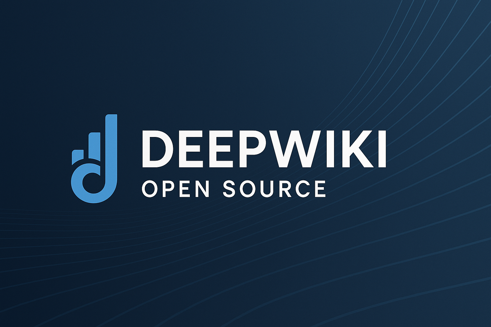
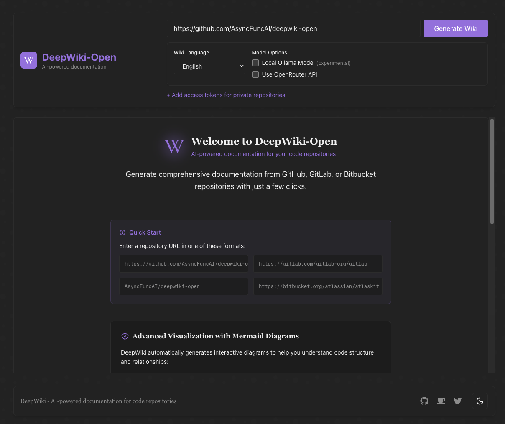

# DeepWiki-Open + Ollama：本機儲存庫分析安裝踩坑與穩定設定指南



最近常看到一些開源專案直接用 [DeepWiki](https://deepwiki.org/) 產生互動式文件，輸入儲存庫之後就能自動整理架構、補說明、再加上對話式查詢介面，對讀程式碼非常方便。

但 `deepwiki.org` 會把程式碼送到外部服務。對私有儲存庫或公司內部專案來說，這通常不是可接受的做法。

因此我改用 MIT 授權的 [DeepWiki-Open](https://github.com/AsyncFuncAI/deepwiki-open)，直接在本機自架。不過實際裝起來後，才發現從本機儲存庫掛載、Ollama 連線、Embedding、到模型設定一路都有坑。這篇就是把整套踩坑流程整理成可直接重現的版本。

## 環境概述

- **主機環境**：macOS，本機儲存庫放在 `/Users/yourname/Projects/...`
- **DeepWiki-Open**：跑在 Docker 容器內
- **Ollama**：跑在主機上，供容器透過 `http://host.docker.internal:11434` 存取
- **LLM**：`minimax-m2:cloud`
- **Embedding 模型**：`nomic-embed-text`

選 `minimax-m2:cloud` 的原因，是它在 [Artificial Analysis 的開源模型排行榜](https://artificialanalysis.ai/models/minimax-m2) 表現不錯，推論速度和程式碼任務表現都夠用。Embedding 則選 `nomic-embed-text`，主要是免費、輕量，而且 CPU 也能跑。

## 前置準備

先確認你已經安裝好以下元件：

- [OrbStack](https://orbstack.dev/) 或 [Docker Desktop](https://www.docker.com/products/docker-desktop/)
- [Ollama](https://ollama.com/download)

Ollama 啟動後，先把模型抓下來：

```bash
# LLM
ollama pull minimax-m2:cloud

# Embedding
ollama pull nomic-embed-text
```

## 安裝 DeepWiki-Open

先把專案抓下來：

```bash
git clone https://github.com/AsyncFuncAI/deepwiki-open.git
cd deepwiki-open
```

接著修改 `docker-compose.yaml`。這份設定的重點只有兩個：

1. 把本機儲存庫掛載進容器
2. 讓容器能連到主機上的 Ollama

```yaml
services:
  deepwiki:
    build:
      context: .
      dockerfile: Dockerfile
    ports:
      - "8001:8001" # API
      - "3000:3000" # UI
    environment:
      - DEEPWIKI_AUTH_MODE=false
      - OLLAMA_HOST=http://host.docker.internal:11434
      - DEEPWIKI_EMBEDDER_TYPE=ollama
      - DEEPWIKI_GENERATOR_TYPE=ollama
      - EMBEDDING_MODEL=nomic-embed-text
      - LLM_MODEL=minimax-m2:cloud
      - OPENAI_API_KEY=sk-fake-dummy
      - OPENAI_BASE_URL=http://host.docker.internal:11434/v1
    volumes:
      - ~/.adalflow:/root/.adalflow
      - /Users/yourname/Projects:/mnt/local-repos:rw
      - ./api/config:/app/api/config:ro
```

啟動：

```bash
docker compose up -d
```



## 踩坑 1：本機儲存庫 404 / Directory not found

### 症狀

UI 輸入本機路徑後，直接報錯：

```text
Local repository API error (404): {"error":"Directory not found: /Users/yourname/Projects/"}
```

### 原因

DeepWiki 後端跑在容器裡，容器看不到主機上的 `/Users/...`。如果沒有事先掛載，直接輸入主機路徑一定會 404。這也是 [GitHub issue #323](https://github.com/AsyncFuncAI/deepwiki-open/issues/323) 常見的問題。

### 解法

先把主機路徑掛載到容器，例如：

- 主機路徑：`/Users/yourname/Projects`
- 容器路徑：`/mnt/local-repos`

之後在 UI 裡要輸入的是容器內路徑：

```text
/mnt/local-repos/my-project
```

## 踩坑 2：`docker-compose` 驗證錯誤

### 症狀

```text
services.deepwiki additional properties 'services' not allowed
```

### 原因

YAML 結構寫錯，把 `services:` 又巢狀放進 `services.deepwiki:` 裡面。這是 Docker Compose 常見的結構驗證錯誤。

### 解法

把 `services:` 放回最外層，並用下面指令先驗證：

```bash
docker compose config
```

## 踩坑 3：`Failed to validate the authorization code`

### 症狀

```text
Failed to validate the authorization code
```

### 原因

服務開了驗證模式，UI 需要 auth code 才能產生文件。

### 解法

如果是自己本機使用，直接關掉：

```yaml
- DEEPWIKI_AUTH_MODE=false
```

## 踩坑 4：明明選 Ollama，卻還是要求 `OPENAI_API_KEY`

這是整個流程裡最容易卡住的一段。

### 症狀 A

```text
OPENAI_API_KEY environment variable is not set...
```

### 症狀 B

```text
ValueError preparing retriever: Environment variable OPENAI_API_KEY must be set
```

### 原因

某些版本的 DeepWiki-Open，或它底層相依套件使用的 OpenAI 相容層，會在建立 Embedding 或 Retriever 時先硬檢查 `OPENAI_API_KEY`，即使你實際上要走的是 Ollama。這也是 [GitHub issue #175](https://github.com/AsyncFuncAI/deepwiki-open/issues/175) 很多人碰到的問題。

### 解法

最穩的做法是直接走 OpenAI 相容端點，讓 DeepWiki 以為自己在呼叫 OpenAI，但實際上全都打到 Ollama：

```yaml
- OPENAI_API_KEY=sk-fake-dummy
- OPENAI_BASE_URL=http://host.docker.internal:11434/v1
```

如果只設環境變數還是失敗，補一份 `api/config/embedder.json`，強制指定 Embedding 用的客戶端：

```json
{
  "embedder": {
    "client_class": "OllamaClient",
    "model_kwargs": {
      "model": "nomic-embed-text"
    }
  }
}
```

這樣可以直接覆蓋底層客戶端的選擇邏輯，避免流程又繞回 OpenAI。

## 踩坑 5：模型不存在，連帶出現 `No valid XML found in response`

### 症狀

```text
POST http://host.docker.internal:11434/api/chat "HTTP/1.1 404 Not Found"
Error: model 'qwen3:1.7b' not found (status code: 404)
No valid XML found in response
```

### 原因

DeepWiki 的模型名稱可能同時來自三個地方：

- `api/config/generator.json`
- `docker-compose.yaml` 的 `LLM_MODEL`
- UI 前端的模型選擇器

只要其中一處指定的模型名稱和 Ollama 實際拉下來的名稱不一致，Ollama 就會回 `404`。前端接不到預期回應格式時，就可能顯示 `No valid XML found in response`，這個訊息非常容易誤導。

### 解法

先確認模型真的存在，而且名稱完全一致：

```bash
# 如果你要用 qwen3:1.7b
ollama pull qwen3:1.7b

# 如果你要用本文的設定
ollama pull minimax-m2:cloud
```

再固定在 `docker-compose.yaml`：

```yaml
- LLM_MODEL=minimax-m2:cloud
```

如果你已經在環境變數指定模型，建議不要再用 UI 選擇器切來切去，避免設定來源混在一起。

## 踩坑 6：Embedding 遇到超大檔，出現 `context length exceeded`

### 症狀

日誌可能會看到大量訊息：

```text
Failed to get embedding for document '...babel-polyfill.min.js', skipping
Failed to get embedding for document '...vuetify.min.js', skipping
Failed to get embedding for document '...firebase-app.js', skipping
```

或者 Ollama 直接回：

```text
the input length exceeds the context length (status code: 500)
```

### 原因

這類壓縮後的前端資產或第三方套件檔案 token 數量太大，超過 Embedding 模型的 context window。DeepWiki 通常會直接跳過，或做退避重試。

### 解法

大多數情況下，這不會影響主要結果，因為 DeepWiki 還是會替其他正常原始碼建立索引。若你想把雜訊降到最低，可以在 `api/config/repo.json` 主動排除大型目錄或壓縮後資產：

```json
{
  "excluded_dirs": ["node_modules/", "vendor/", "dist/", "build/"],
  "excluded_files": ["*.min.js", "*.min.css", "*.bundle.js"]
}
```

第一次跑之前先整理排除規則，通常能讓索引過程更乾淨也更快。

## 踩坑 7：檔案編碼不是 UTF-8，出現 `UnicodeDecodeError`

### 症狀

```text
'utf-8' codec can't decode byte 0xa5 ... invalid start byte
```

### 原因

舊專案裡有些 `.js`、`.txt` 或設定檔可能不是 UTF-8，常見像是 Big5、CP950 或 Windows-1252。DeepWiki 在匯入階段用 UTF-8 讀取時，就會直接失敗。

### 解法

通常只有兩種實際做法：

1. 先把檔案轉成 UTF-8
2. 直接把這些歷史檔案排除在索引之外

如果那些檔案本來就不是你想分析的核心內容，第二種通常比較省時間。

## 全流程檢查清單

正式跑之前，建議依序確認：

1. `ollama list` 裡已經看得到 `nomic-embed-text` 和你要用的 LLM
2. `docker-compose.yaml` 裡有 `OPENAI_API_KEY=sk-fake-dummy`
3. UI 輸入的是容器內路徑，例如 `/mnt/local-repos/my-project`
4. 啟動後，日誌有出現 `Embedding documents (X/Y)` 之類的進度訊息

如果 Embedding 階段還是報錯，再補上 `api/config/embedder.json`，強制指定 `OllamaClient`。

## 怎麼判斷「已完成」而不是「只是 UI 卡住」

DeepWiki 的 UI 有時候會讓人誤以為流程還沒結束，但真正可信的是後端日誌。

### 代表索引完成的關鍵日誌

```text
Loaded XXX documents from existing database
Embedding validation complete: XXX/XXX
Index built with XXX chunks
FAISS retriever created successfully
Retriever prepared for /mnt/local-repos/...
```

### UI 卡在「驗證 Wiki 結構」怎麼辦

先確認三件事：

1. 日誌裡是否已出現 `Retriever prepared`
2. LLM 模型是否真的存在，而且 Ollama 可正常呼叫
3. 是否已開啟 OpenAI 相容模式，也就是 fake key 加上 `OPENAI_BASE_URL`

很多時候不是生成真的失敗，而是前端狀態沒有同步更新。

## 最終穩定設定

| 項目 | 設定 |
| --- | --- |
| Embedding 模型 | `nomic-embed-text` |
| LLM | `minimax-m2:cloud` |
| 相容設定 | `OPENAI_API_KEY=sk-fake-dummy` + `OPENAI_BASE_URL=http://host.docker.internal:11434/v1` |
| 儲存庫路徑 | 一律使用容器內路徑 `/mnt/local-repos/...` |

## 參考資料

- [DeepWiki-Open GitHub](https://github.com/AsyncFuncAI/deepwiki-open)
- [Can’t find local directory · Issue #323](https://github.com/AsyncFuncAI/deepwiki-open/issues/323)
- [Local Ollama not working after last update · Issue #175](https://github.com/AsyncFuncAI/deepwiki-open/issues/175)
- [The specified Ollama embedding model was not found · Issue #248](https://github.com/AsyncFuncAI/deepwiki-open/issues/248)
