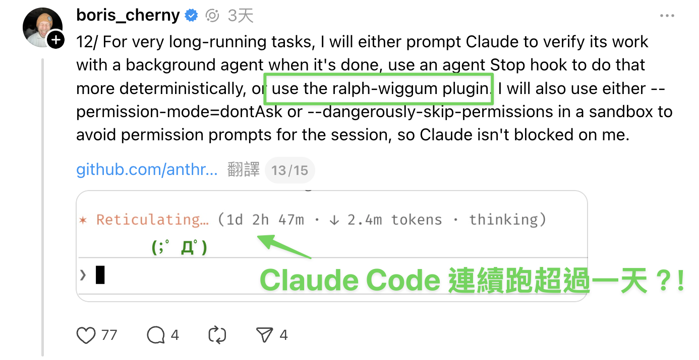
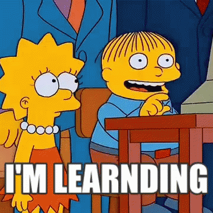
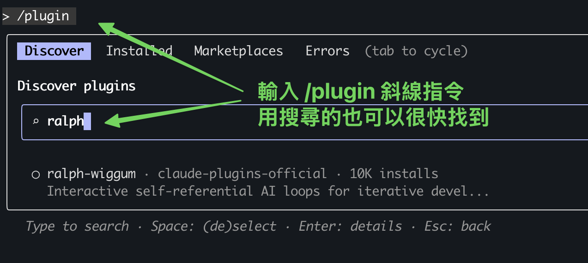

# Ralph Wiggum Loop：讓 AI 24 小時自動寫程式

真正的軟體工程專家，絕對會反覆強調**人工審查** AI 生成的程式碼有多重要，但一定有些檢查項目（像是單元測試）很繁瑣又花時間，讓你很想全部丟給 AI。夢幻情境會是：你上床睡覺以前給 AI 下了一個任務，隔天早上醒來後，6 個全新的程式庫已經完成、並通過所有測試！

這個夢幻情境已經成真了！Claude Code 創造者 Boris Cherny 親自分享了他的 AI 實際用法，透過 **Ralph Wiggum Loop**，就能達成這樣的體驗。

本文會介紹 Claude Code 裡的 **Ralph Wiggum** Plugin 外掛是什麼、以及怎麼使用。


（本文會混用 Plugin、外掛、Loop、方法、技術等關鍵詞來稱呼 Ralph Wiggum，講的都是[同一個 Claude Code Plugin](https://github.com/anthropics/claude-plugins-official/tree/main/plugins/ralph-loop)）

---

## Claude Code 元老就是這麼做

Boris Cherny 是 Claude Code 創辦者之一，他在 [X.com 的分享](https://x.com/bcherny/status/2004887829252317325) 中，提到他本人的使用數據：

> 「在過去 30 天內，我完成了 259 個 Pull Requests、新增 40,000 行程式碼
> **每一行都是由 Claude Code + Opus 4.5 撰寫的。」
> 
> 「Claude 能夠持續運作數分鐘、數小時，甚至數天（使用 Stop hooks）。
> 軟體工程正在改變，我們正進入程式設計歷史的嶄新時代。」

過去這陣子真的經歷了很大的轉變，在 2024 年底，Claude 還在為產生 bash 指令時的跳脫字元問題掙扎，只能運作幾秒或幾分鐘。而到了今天的 2026 年開頭，它已經能夠**連續工作數天**，完成整個專案的開發。

也正是「Claude **連續運作**數天」這一句，引起我的興趣。

Boris 在 [Threads 上](https://www.threads.com/@boris_cherny/post/DTBVlMIkpcm) 分享的 Claude Code 使用技巧，明確提到他使用的是 [Ralph Wiggum 外掛](https://github.com/anthropics/claude-plugins-official/tree/main/plugins/ralph-loop) 來執行要跑超久的任務。



（截圖：Boris 的 [Threads 貼文](https://www.threads.com/@boris_cherny/post/DTBVlMIkpcm)）

他更分享了實戰案例：在 [Y Combinator 黑客松](https://github.com/repomirrorhq/repomirror/blob/main/repomirror.md)，Ralph Wiggum 外掛一夜之間產出了 6 個順利可用的程式庫；另個案例是一位聰明的工程師在學會 Ralph Wiggum 技術後，用來外包接案，以 297 美元的 API 成本完成了一個價值 50,000 美元的合約。

**Ralph Wiggum Loop 的創始者是誰？不是 Claude Code！**

Ralph Wiggum Loop 方法的創始者是 [**Geoffrey Huntley**](https://ghuntley.com/ralph/)。他創立此方法是為了克服 AI Agent 常見的「偷懶」問題。即 AI 在處理複雜任務（如建構後端或除錯）時，往往寫了幾行程式碼或忽略了錯誤，就自信地宣稱任務已完成並過早退出對話。

Huntley 的工作哲學核心在於「**迭代進步比完美更重要**」(Iteration > Perfection)。他認為在 AI 開發中，失敗經驗都是訓練數據（Failures are data），那些決定論式的錯誤（Deterministically bad，換言之，_非_隨機的錯誤）其實是極具價值的資訊，能引導開發者**像在幫樂器調音一樣**不斷微調提示詞。他強調開發者必須具備強大的信念，相信「最終一致性」(Eventual Consistency)，即透過 AI 頑固且不間斷的自我修正循環，最終一定能達成正確的目標狀態。

Huntley 在建立 CURSED 語言的過程中提到：

「建造軟體需要極大的信念和對最終一致性的相信。Ralph 會考驗你。每次 Ralph 在建立 CURSED 時走錯方向，我都沒有責怪工具；相反地，我審視自己。每次 Ralph 做了壞事，我就調整 Ralph，就像幫吉他調音一樣。」

所以，Ralph Wiggum 究竟是什麼厲害的方法？我們從「為什麼」需要它的緣由開始談。

---

### 問題：AI 代理會「偷懶」？

大多數的 AI 輔助開發，會像是雇用了一個會**偷懶**的實習生，你必須不斷地追蹤進度、指出錯誤，這反而是增加了管理成本。惱人的情況包括：

1. **提早結束**：例如 AI 在建立後端系統時，可能只寫了幾個檔案、忽略了資料庫架構，就自信地宣稱任務完成
2. **成功的幻覺**：為了節省 Token、或單純認為自己做完了，AI 會產生「已經成功」的_幻覺_，導致你必須花時間手動檢查、並提醒它修復遺漏的細節
3. **缺乏自我修正**：一旦對話結束，AI 就不會再主動檢查之前的錯誤，除非你再次介入

### 解決方案：逼 AI 堅持下去

[Ralph Wiggum Loop](https://github.com/anthropics/claude-plugins-official/tree/main/plugins/ralph-loop) 的核心概念是：**不讓 AI 輕易退出，直到任務真正完成。**

它透過 Claude Code 的 [**Stop Hook**](https://code.claude.com/docs/zh-TW/hooks#stop) 機制來實現：

1. 當 Claude 完成工作、並嘗試結束對話時，Stop Hook 會攔截這個退出動作
2. 檢查輸出內容是否包含你事先定義的「完成承諾」（例如 `DONE` 或 `FIXED`）
3. 如果沒找到，就把**相同的提示詞**重新餵回給 Claude
4. Claude 會讀取之前的執行記錄、發現錯誤（例如測試失敗），然後在_新的迴圈_中嘗試改進程式碼
5. 持續這個過程，直到真正完成工作（或者達到事先設定的最大迭代次數）

### 趣味命名：為什麼叫 Ralph Wiggum？

**Ralph Wiggum** 這個名稱來自《辛普森家庭》中的角色，他是一個天真、經常做傻事、卻又**異常執著**的小男孩。



《辛普森家庭》的角色 Ralph Wiggum

Ralph 在劇中的有趣台詞之一是：

[Me fail English? That's unpossible!](https://www.youtube.com/watch?v=JXFGy10b7Js)  
（我英文不及格？那不可能啦！）

這種「即使失敗也堅持下去」的精神，完美體現了這個 Ralph Wiggum 這個方法的核心理念。

就像 Ralph 這個角色雖然常出錯、甚至是糟糕到很明顯，卻能透過不斷的迭代與改進，最終達成目標。這正是 AI 開發需要的模式：**在一個不確定的世界中，透過_可預測的失敗模式_來達成最終的成功**。

---

## Ralph Wiggum Loop 到底是什麼？如何運作？

### 核心定義

**[Ralph Wiggum Loop](https://github.com/anthropics/claude-plugins-official/tree/main/plugins/ralph-loop)**（也稱為 Ralph Loop）是一種強制 AI 堅持下去（Force Persistence）的迭代開發方法論。Ralph 最原始的形式，單純是一個 **Bash 迴圈**：

```bash
while :; do
  cat PROMPT.md | npx --yes @sourcegraph/amp 
done
```

而在 Claude Code 中，它優雅地被實作為一個[外掛](https://github.com/anthropics/claude-plugins-official/tree/main/plugins/ralph-loop)（Plugin），利用 [**Stop Hook**](https://code.claude.com/docs/zh-TW/hooks#stop) 機制在單一 session 內部建立自我參照的回饋迴圈。

用一個簡單的比喻來說，Ralph Loop 是**不讓 AI 員工下班**的血汗工廠，Ralph Loop 給 AI 員工一間「除非事情做完、否則門會鎖死」的辦公室。它可能要嘗試 10 次、20 次才會做對，但最後**一定**會拿著正確的成果（`DONE`）出來見你。這個機制確保 AI 不會偷懶提早下班，而是會持續工作直到任務真正完成。

沒做完不能走，真的血汗

### 運作原理

讓我們來認識 Ralph Loop 的完整運作流程，如同上方文章所述，它是一個不斷使用相同提示詞的 Bash 迴圈（Loop）：

#### 1. 初始化

```bash
/ralph-loop "建立 REST API 並通過所有測試" --completion-promise "DONE" --max-iterations 20
```

你只需執行一次指令，然後 Claude Code 會：

- 接收任務描述
- 開始第一次嘗試
- 啟動 [Stop Hook](https://code.claude.com/docs/zh-TW/hooks#stop) 監控

#### 2. 迭代迴圈

#### 3. 自我修正

這是 Ralph Loop 最神奇的地方：**雖然提示詞不變，但環境狀態會改變。**

- 第 1 次迭代：Claude 寫了程式碼，但測試失敗
- 第 2 次迭代：Claude 看到測試失敗的輸出，修改程式碼
- 第 3 次迭代：Claude 看到新的錯誤訊息，繼續調整
- …
- 第 N 次迭代：所有測試通過，輸出 `DONE`，迴圈結束

每次迭代中，Claude 都能看到：

- 已修改的檔案內容
- Git 歷史記錄
- 測試執行結果
- 錯誤訊息

這讓它能夠基於實際的執行結果來改進程式碼，而不是憑空猜測。

你想嘛，要是每次環境跟 context 都**不變**、只是執行相同提示詞  
不就只是燒錢浪費 token 在做同一件事嗎？

### 表格整理：Ralph Wiggum Loop 的特徵

| 典型 AI 輔助開發 | Ralph Wiggum Loop |
| --- | --- |
| 一次性嘗試，成功與否都結束 | 持續嘗試直到成功 |
| 需要人工追蹤進度 | 自動追蹤並修正 |
| 錯誤需要人工餵回 | 自動讀取錯誤並改進 |
| 適合簡單任務 | 適合複雜長期任務 |
| 無法離線工作 | 可以掛機執行 |

---

## Ralph Wiggum Loop 快速開始指南

### 安裝與設定

**步驟 1：安裝 Plugin**

```bash
/plugin install ralph-loop@anthropics
```

（[官方外掛連結](https://github.com/anthropics/claude-plugins-official/tree/main/plugins/ralph-loop)）



也可以在 Claude Code 內直接用 `/plugin` 指令搜尋到這個外掛

**步驟 2：啟動你的第一個 Ralph Loop**

```bash
/ralph-loop "請寫一個 Python 計算機模組，包含加減乘除功能和完整測試" \
  --completion-promise "COMPLETE" \
  --max-iterations 15
```

### 關鍵參數說明

- `--completion-promise`：定義一個代表「完工」的關鍵字（如 `DONE`、`COMPLETE`、`FIXED`），當 Claude 輸出此字串時，迴圈才會停止
- `--max-iterations`：最大迭代次數限制，設個上限作為安全網，防止 AI 陷入無限迴圈並消耗過多 Token 成本。也就是在防止你的帳單大爆炸，因此**強烈建議設定！**

### 撰寫有效的 Prompt

#### ✅ 好的 Prompt 範例

```
建立一個 REST API 用於待辦事項管理
需求：
- CRUD 端點（GET、POST、PUT、DELETE）
- 輸入驗證
- SQLite 資料庫
- pytest 測試（覆蓋率 > 80%）
- README 文件
完成標準：
- 所有測試通過
- Linter 無錯誤
- API 文件完整
- 輸出：<promise>COMPLETE</promise>
```

把**完成標準**寫清楚是運用 Ralph Loop 最重要的關鍵，下方文章會再講更多。

#### ❌ 不好的 Prompt 範例

```
建立一個待辦事項 API，讓它好用一點
```

---

---

## 何時該使用 Ralph Wiggum Loop？

### 最適合的使用場景

#### 1. 測試驅動開發（TDD）

TDD 適合 Ralph Loop 執行，因為測試結果是明確的二元狀態（通過 vs. 失敗），AI 可以自動且清楚地判斷、並改進。TDD 是 Ralph Loop 最強大的使用場景。

```bash
/ralph-loop "實作使用者認證模組：
1. 撰寫測試以建立失敗標準
2. 實作功能讓測試通過
3. 重構程式碼
4. 重複，直到所有測試通過且覆蓋率 > 90%
完成時輸出 DONE" --max-iterations 30
```

#### 2. 複雜 Bug 修復

適合當 Bug 的**成因明確**但修復路徑複雜時。

```bash
/ralph-loop "修復付款處理模組中的稅金計算錯誤：
- 重現 Bug
- 分析根本原因
- 實作修復
- 確保回歸測試全部通過
- 新增防止此類錯誤的測試
完成時輸出 FIXED" --max-iterations 20
```

#### 3. 大規模重構

適合處理需要數小時才能完成的系統遷移。

```bash
/ralph-loop "將資料庫從 MySQL 遷移到 PostgreSQL：
- 更新所有 ORM 模型
- 修改查詢語法
- 更新測試
- 確保所有現有功能正常運作
完成時輸出 MIGRATED" --max-iterations 50
```

#### 4. 自動化開發

當你需要「放手」讓 AI 在深夜或週末自動處理全新專案（[Greenfield Project](https://zh.wikipedia.org/zh-tw/%E7%BB%BF%E5%9C%B0%E5%B7%A5%E7%A8%8B)）時：

```bash
# 睡前執行
/ralph-loop "建立電子商務後端 API：
Phase 1: 使用者認證（JWT、測試）
Phase 2: 產品目錄（列表/搜尋、測試）
Phase 3: 購物車（新增/移除、測試）
所有階段完成後輸出 ECOMMERCE-COMPLETE" --max-iterations 100
```

### 如何判斷是否該使用？

使用以下檢查清單來決定：

☑ **成功標準是否可由機器判定？**

- 可以：編譯成功、Linter 無錯誤、測試 100% 通過
- 不可以：「讓頁面變漂亮」、「最佳化使用者體驗」

☑ **任務是否能接受迭代花費的成本？**

- 如果你追求最終結果產出穩定、符合客觀標準，而非一次到位
- 願意支付多輪 API 呼叫的費用以換取自動化結果

小心會燒錢啊

☑ **你能否能精確定義 `DONE` 的狀態？**

- 可以：「所有測試通過且 coverage > 80%」
- 不可以：「大致完成就好」

### 重要警告與限制

#### ⚠️ 必須設定 `--max-iterations`

這是最重要的安全網。若不設定，AI 可能陷入無限迴圈，導致高昂的 API 費用。

簡單任務可以設定 10~20 次，大型專案可以大膽點設定 50~100 次。

#### ⚠️ Prompt 中應說明「卡住了」該怎麼辦

Claude Code 也不是所有問題開了無限迴圈就一定能解決，為了防止 AI 在無法解決問題時陷入（無效的）無限循環，我們要設定 Stuck Handling Prompt，在提示詞中預先加入「逃生計畫」（Escape Hatch），確保在失敗時仍能提供有價值的回饋。

```
若嘗試 15 次後仍未完成：
- 記錄阻礙進度的問題
- 建議替代方案
- 輸出 BLOCKED 並說明原因
```

#### ⚠️ `--completion-promise` 要精確

此參數會是**精確字串比對**，因此：

- ✅ 確保 Prompt 指示 AI 輸出**完全一致的關鍵字**
- ❌ 無法用於多種完成條件（如 `SUCCESS` vs. `BLOCKED`）
- ✅ 務必搭配 `--max-iterations` 作為主要安全機制

### 最不適合使用的場景

#### ❌ 需要人類判斷、或者（主觀）審美標準

廣義地說，任何無法透過程式自動檢測驗證的任務都不適合 Ralph Loop。例如「漂亮」無法由程式自動驗證，AI 會隨意猜測並立即宣稱完成。

```bash
# 不良示範
/ralph-loop "讓首頁變漂亮" --completion-promise "DONE"
```

#### ❌ 追求即時結果的單次操作

如果你需要馬上看到結果並進行互動，傳統的聊天模式更有效率。

#### ❌ 生產環境（Production）不該用！

在生產環境中應使用目標明確的 debug 除錯，千萬不要放任 AI 在迴圈中隨意修改 PROD 裡的關鍵基礎設施。

#### ❌ 需要外部審批或人工干預

如果流程中途需要你點頭同意，Ralph 的自動迴圈優勢就會消失。

---

## 結語

Ralph Wiggum Loop 體現了幾個關鍵原則：

- **確定性失敗**：在不確定的世界中可預測地失敗
- **持續勝於完美**：不追求一次到位，而是透過迭代達到最終一致性
- **人機協作**：允許人工介入調整，但不依賴持續監督

這個技術的成功關鍵在於給 AI 明確的成功標準、自動化的驗證機制（如測試），以及足夠的迭代空間。我覺得 Ralph Loop 跟 Machine Learning 的工作流很像，成功關鍵都是要定義好測試標準（Evaluation Metric）、然後讓程式在每次迭代中學習。

現在，相信你已經了解 Ralph Wiggum Loop 的完整概念。親自試試看吧：

1. 安裝插件：`/plugin install ralph-loop@anthropics`
2. 設定一個明確的任務與完成標準
3. 設定合理的 `--max-iterations` 限制
4. 啟動迴圈，然後放心地去喝杯咖啡

然後想想 Ralph 掛在嘴上的：**「[I'm learnding!](https://www.youtube.com/shorts/PKg2ZzPKl2M)」**，期待你的 AI 代理也能在持續的迭代中，真正**學會**如何完成任務。

參考資料：

- [Claude Code 官方 Ralph Wiggum 外掛](https://github.com/anthropics/claude-code/tree/main/plugins/ralph-loop)
- [Geoffrey Huntley：Ralph is a Bash Loop](https://ghuntley.com/ralph/)
- [Ralph Orchestrator：由社群開發的進階工具，可協調多個 Ralph Loops](https://github.com/mikeyobrien/ralph-orchestrator)
- [來自 Y Combinator 的成功案例：記錄了開發者如何利用 Ralph 循環在一個晚上自動交付 6 個專案倉庫的傳奇經歷](https://github.com/repomirrorhq/repomirror/blob/main/repomirror.md)

---

如果這篇文章有幫助到你，歡迎追蹤好豪的 [**Facebook 粉絲專頁**](https://haosquare.com/social/facebook/)、[**Instagram**](https://haosquare.com/social/instagram/) 與 [**Threads 帳號**](https://haosquare.com/social/threads/)，我會持續分享我學習 Claude Code 與 AI 的心得；也可以點選下方按鈕，分享給同樣在追蹤 AI 趨勢的朋友們。
