# 我錯了，還是要讀程式碼: Dex Horthy 重新檢討 AI 寫程式流程

幾個月前小編整理過 Dex Horthy 的一場演講。他是 HumanLayer 的創辦人，也是去年提出 [12-Factor Agents](https://github.com/humanlayer/12-factor-agents) 的人。那場他大力推廣一套寫程式的 AI 工作流，叫做「研究 → 計畫 → 實作」(Research → Plan → Implement，簡稱 RPI)。那篇整理在這裡: [別再憑感覺了: 在複雜 Codebase 中解決困難問題](https://blog.aihao.tw/2026/02/27/no-vibes-allowed/)。

這次他又站上台，題目卻是 [Everything We Got Wrong About Research-Plan-Implement](https://www.youtube.com/watch?v=YwZR6tc7qYg)，意思是「我們把 RPI 全搞錯了」。同一個人，半年內回來自己打臉，蠻難得的。他講得很坦白: 「我夠謙虛，做錯的時候願意承認。」這場就是在講他們跟上千位工程師實戰之後，發現 RPI 哪些地方根本行不通，以及怎麼修。

小編覺得這場比上一場更有料。它不是在推銷方法論，而是在拆解一套方法論為什麼會失敗。如果你正照著上一篇的 RPI 在用，這篇基本上就是它的更新說明。

先用一張表把兩場的差異講清楚:

| 比較項目 | 上一場〈No Vibes Allowed〉(去年十一月) | 這一場〈我們把 RPI 全搞錯了〉 |
| --- | --- | --- |
| 整場在講什麼 | 推銷一套新流程: 研究 → 計畫 → 實作 (RPI) 三階段 | 回頭承認 RPI 哪些環節行不通，並端出修正版 |
| 該不該讀 AI 寫的程式碼 | (八月時) 說不必，計畫夠好就放手讓 AI 跑 | 改口: 一定要讀。不讀的做法試了半年，最後得整段砍掉重寫 |
| 該不該讀計畫文件 | 要，而且要逐字認真檢查 | 不要。千行計畫約等於千行程式碼，讀它跟讀程式碼一樣累、不划算 |
| 完整流程幾步 | 三步: 研究 (Research)、計畫 (Plan)、實作 (Implement) | 八個階段: 提問 (Questions)、研究 (Research)、設計 (Design)、結構大綱 (Structure Outline)、計畫 (Plan)、開分支 (Worktree)、實作 (Implement)、發 PR (Pull Request)，整套流程取名叫 CRISPY |
| 研究階段怎麼做 | 派子代理對程式碼做深度探索，壓縮出客觀事實 | 一樣，但多一招: 故意不讓做研究的 AI 看到需求，免得它夾帶主觀意見 |
| 人該把力氣花在哪 | 仔細讀計畫和研究文件 | 改讀真正的程式碼，加上更短的「設計」(約 200 行) 和「大綱」(約兩頁) |
| Prompt 怎麼設計 | 一個大 prompt 把所有步驟包進去 | 拆成多個小 prompt，每個指令數壓在 40 條以內 (因為模型記不住太多條) |
| 「笨蛋區」的門檻 | 強調盡量把上下文用量壓在 40% 以下 | 看人: 老手可衝到 60%，只有新手才需要嚴守 40% |

以下是重點整理:

## 1. 先講做錯的三件事

Dex 一開場就把這次要認錯的清單攤開。最有爭議、那天在 Twitter 上吵翻天的一條是: **「可以不讀程式碼」是錯的。** 另外兩條是: 不該去讀那種落落長的計畫文件; 還有，如果你寫的是會被使用者用、半夜三點壞掉會被叫起來修的正式程式碼，2026 年了，不准再生產 slop (粗製濫造的低品質程式碼)。

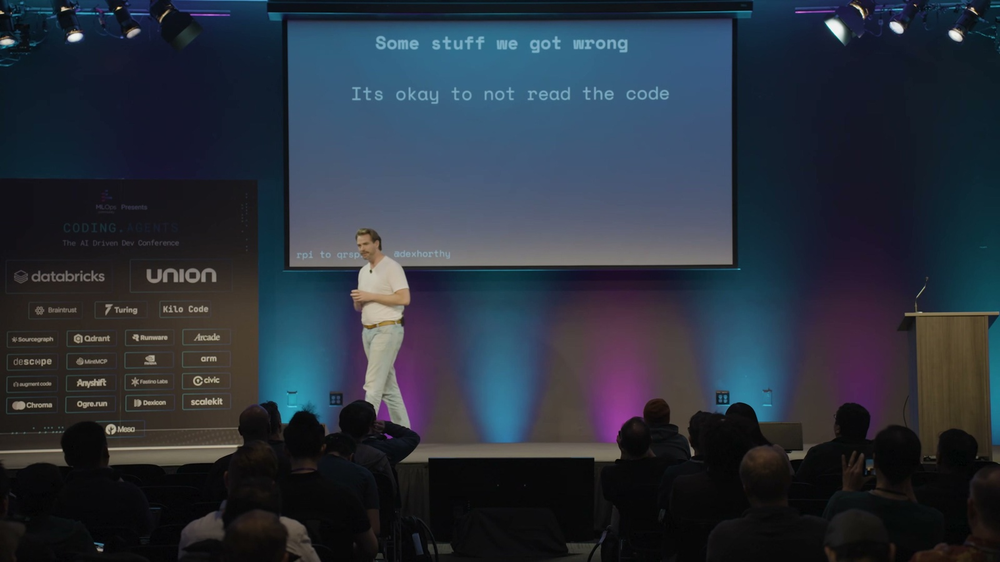

不過他也說，當初做對的幾件事仍然成立: 沒有萬靈丹般的「魔法 prompt」; 不要把思考外包出去 (工程師你本人是這套流程裡很重要的一環); 以及要不斷尋找「槓桿」，也就是想辦法在不必讀完每一行的前提下，確保產出是對的。這三點是整場演講的定錨。

## 2. RPI 一開始很好用，後來為什麼不行了

從去年十月起，HumanLayer 跟上千位工程師合作，從小新創一路到世界五百大企業都有。他們一再看到同一個現象: 把工具交給一個高手，他能跟 AI 黏在一起每週工作 70 小時、瘋狂出貨; 但同一套工具交給他的團隊，成果就普普通通。

問題出在哪? Dex 引用了一份去年的調查數據 (他特別提醒，這還沒算進後來更強的 Opus 4.5，現在實際表現應該更好): 用 AI 寫程式雖然產出量變多，但其中很大一塊是「返工」(rework)，也就是回頭修上週 AI 吐出來的爛東西。算下來你出貨量多了 50%，但有一半只是在清自己製造的爛攤子。

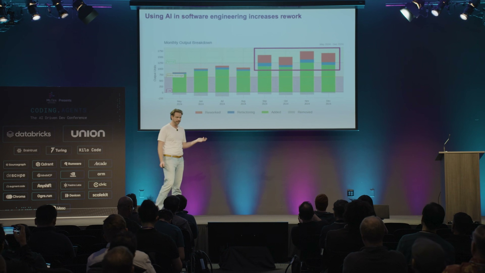

用 AI 之後的「產出」其實有一半在做白工

真正有效的新產出

返工 · 清上週 AI 的爛攤子

出貨量看似 +50%，但其中很大一塊只是回頭修 AI 上次吐出來的爛東西

✏️ 小編製圖，非 Dex 原始投影片

結論是: AI 對「全新、單純的專案」很好用，但對「歷史包袱重、又複雜的既有專案」就不行了。

## 3. 研究階段的修正: 故意把需求藏起來

第一個失敗點，是大家做不出好的研究。理想的做法是這樣: 你圈定程式碼庫裡的一塊區域，派出子代理 (sub-agent) 去做深入的探索，把「這段程式現在到底怎麼運作」壓縮成一份客觀的事實清單。關鍵字是**客觀**，不要摻進任何「應該怎麼改」的意見。

但實際上多數人是這樣下指令的: 「去研究一下程式碼庫，我要做的功能是 OOO」。問題就出在這裡: 好的研究應該全是事實，可是一旦你告訴模型你想做什麼，它就會忍不住開始給**意見**。

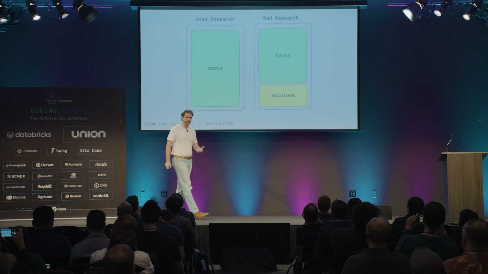

他們的修法很工程: 用程式 (而不是靠 prompt 拜託模型) **把需求從「做研究」的那段對話裡藏起來**。一段對話只負責生出該問的問題，另一段全新、完全不知道你要蓋什麼的對話，才去產出研究文件。Dex 說這跟資料庫的「查詢規劃」(query planning) 概念很像，只是這裡的對象換成「讓 AI 去讀懂程式碼」。

## 4. 「魔法咒語」問題

第二個失敗點更尷尬。原本的規劃流程設計成: 先給你幾個設計選項、跟你來回討論、確認大綱，最後才動手寫計畫。但對超過一半的人來說，如果你沒念出那句咒語 (「跟我一來一回，先從你的疑問和大綱開始，不要急著寫計畫」)，AI 就會跳過討論，自顧自把計畫一口氣寫死，所有決定全幫你做完了。

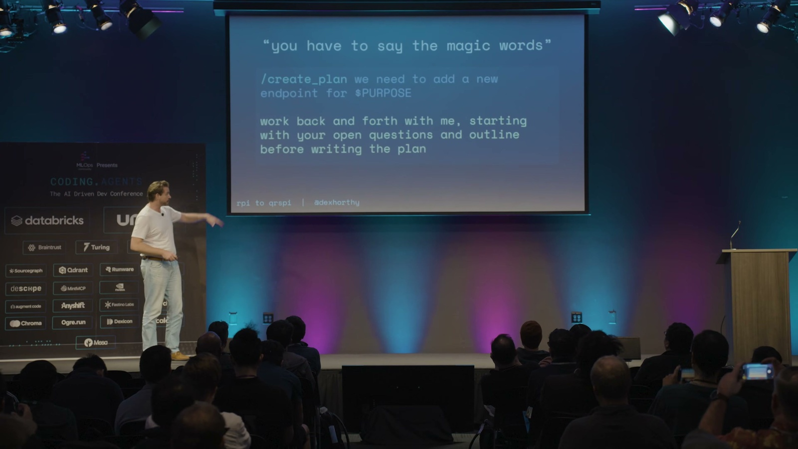

Dex 說，他得站在一整屋子的企業工程師面前叮嚀大家「別忘了念咒語」，老實講蠻丟臉的。他的結論很重要: **這不是使用者的錯。如果你做出來的工具，要花大量訓練和反覆練習才能用出好結果，那該被修的是工具，而不是該被怪的是人。**

## 5. 指令是有預算的

那 AI 為什麼會擅自跳過「先提問、先討論、先確認大綱」這幾個該做的步驟? 因為**你有一個「指令預算」**。他的共同創辦人 Kyle 寫過一篇文章，引用了一篇論文 (數字一樣是去年的，現在應該更高些): 目前最前沿的模型，大概只能穩定遵守 150 到 200 條指令; 超過這個量，它就開始三心二意、半聽不聽，全看運氣。

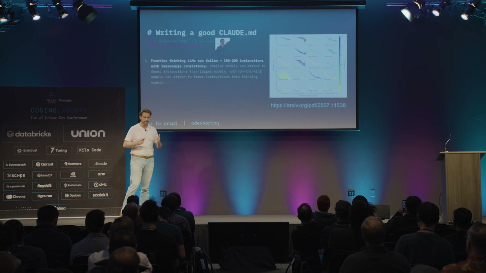

指令預算 · 前沿模型大約只能穩定遵守 150~200 條指令

大 prompt  
85 條

CLAUDE.md

系統 prompt

工具說明

一堆 MCP  
爆預算

← 預算內: 乖乖照完整流程跑 超出上限 → 默默跳過該做的步驟

✏️ 小編製圖，非 Dex 原始投影片

所以，如果你的 prompt 裡塞了 85 條指令，再加上 CLAUDE.md、系統 prompt、各種工具說明、一堆 MCP……要它乖乖照完整流程跑，機率其實不高。小編覺得這個框架蠻實用的: 很多人不停往 AI 裡加 MCP 工具和規則，效果卻越來越差，根本原因常常就是指令預算早就爆了。

## 6. 別讀計畫，去讀程式碼

這是這場最大的一次改口。上一場 (十一月) Dex 還站在台上叫大家一定要讀計畫，有些人甚至把計畫跟程式碼擺在一起送審。問題是: **一份一千行的計畫，最後產出的程式碼也差不多是一千行 (誤差 10% 以內)。** 而且計畫常常會「跑掉」: 你花一小時把計畫讀完，實作出來卻長得不一樣，於是你又得回頭再讀一次程式碼，看哪裡變了。這根本不叫省力。所謂的「槓桿」，是做更少、卻產出更多。

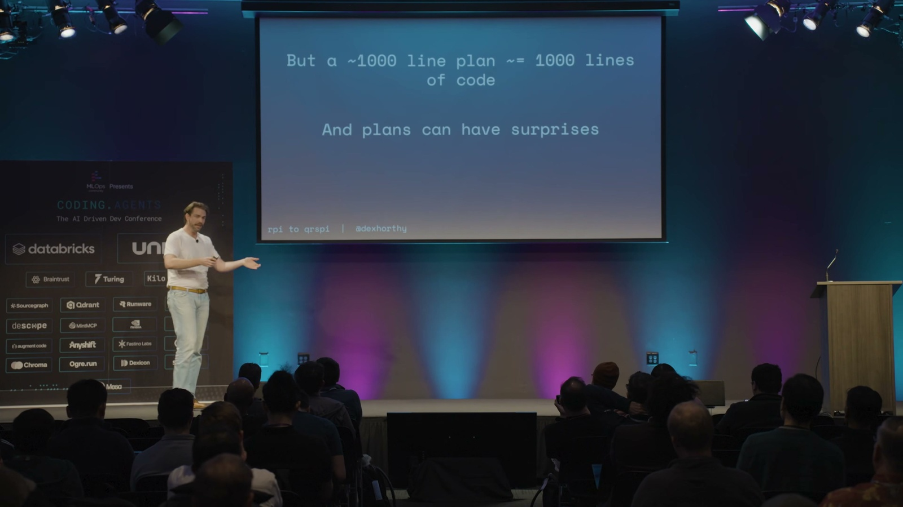

所以新的建議是: **別讀計畫了，請去讀程式碼。** 至於八月時他說「計畫就夠了、不用讀程式碼、放手讓 AI 跑」，他直接認錯: 「我們不讀程式碼這樣搞了大概半年，下場不太好，最後不得不把那套系統一大塊砍掉重寫。」

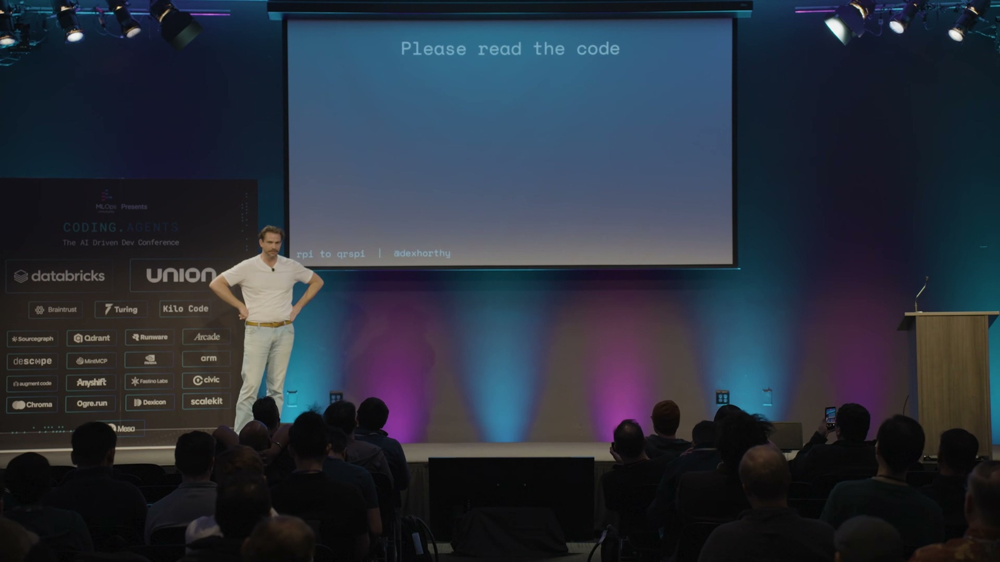

## 7. 但開源專案是例外

有人會反駁: 別人就不讀程式碼啊。像 Beads (三十萬行) 和 OpenClaw 這些開源專案，據說都沒人逐行讀過每一個 PR。Dex 的回應很到位: 這些都是很酷的開源專案，他打從心底佩服維護者; 但它們**不收錢、半夜壞了不會有人被叫起來、做錯了也不會被罰幾百萬美元。**

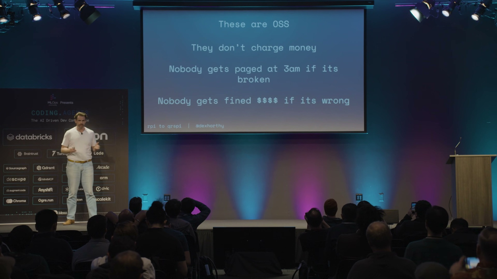

「但如果有人是靠你的程式碼吃飯的，拜託、我求你，去讀它。我們有個專業得扛 (We have a profession to uphold)。」這句話小編覺得是整場的良心所在。他不是在反對 AI，而是在分清楚情境: 在受嚴格監管的產業出貨正式產品，跟玩開源副業，本來就是兩套標準。

## 8. 瞄準 2 到 3 倍，而不是 10 倍

2026 被講成「告別 slop 之年」，到處都在談「粗製濫造」和「精雕細琢」的差別。Dex 也坦白，他對「一大群 AI 代理同時開工」這類玩法持保留態度，因為瓶頸從來不是速度，而是你**確保品質**的能力。**跑快 10 倍，但成果六個月後整包丟掉，根本沒意義。**

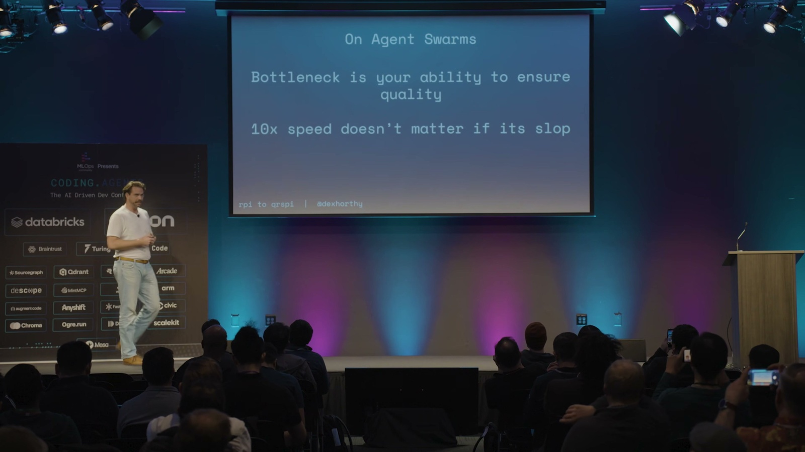

所以目標應該設在 2 到 3 倍，同時維持接近人類水準的品質。在問答時他補了一句很現實的話: 你乖乖讀程式碼、拿到 2 到 3 倍，這對生意的實際結果，遠勝過衝到 10 倍、堆出一堆爛東西，然後祈禱「反正 GPT-7 之後會幫我修好」。

那有沒有人主張完全相反、乾脆兩邊都別讀? 有觀眾問到 StrongDM 那種「軟體工廠」的路線 (人完全不碰程式碼，全靠自動化測試 eval 把關)。Dex 說，這條路會把你推向「形式化驗證」(formal verification)、TLA+ 那個方向 (用數學去嚴格證明系統行為正確)，他甚至遇過有人想做「TLA++」想證明一切都對。但他講得很直白: 他以前會引用 Sean Grove 的說法「把程式碼當成組合語言、你只要寫好那份描述期望行為的規格文件、之後永遠別再讀程式碼」，但現在他對這套主張的態度只有一句冷冷的評語: **「這個，我不挺。」** 也許某天可行，但眼下還有一大票人得趕著把程式碼推上線。

> 編按: TLA+ 是圖靈獎得主 Leslie Lamport 發明的形式化規格語言。你不直接寫程式，而是用數學把系統「應該有的行為」寫成精確規格，再讓工具自動把所有可能的狀態窮舉跑一遍，檢查有沒有死鎖或違反規則的狀況。AWS 就在一篇知名論文〈How Amazon Web Services Uses Formal Methods〉裡分享過，他們用 TLA+ 在設計 DynamoDB、S3 等系統時，揪出人腦和一般測試難以發現的設計 bug; 微軟的 Azure Cosmos DB 也有公開的 TLA+ 規格。

## 9. 能用程式判斷的，就別丟給 prompt 判斷

那塞了 85 條指令的大 prompt 該怎麼救? 答案是: **能用程式邏輯來控制流程的地方，就別用 prompt 去控制。** 這其實正是 12-Factor Agents 一直在講的事。Dex 自嘲他們當初到處勸人「別寫巨無霸 prompt、要把流程拆成小步驟」，結果八月自己回頭就寫了一個巨無霸 prompt，這次總算是「自己喝下自己賣的藥」了。

具體做法是: 與其用一個 prompt 內含一堆條件判斷 (是客訴就走這條、是帳務問題就走那條)，不如先讓模型做一次分類，再把結果丟給一連串更小、更聚焦、指令更少的 prompt 去處理。程式裡的 if 判斷很可靠，而模型很擅長做分類，而這個原則不只適用於寫程式的 AI，任何用到大型語言模型的系統都成立。於是原本那個 85 條指令的 prompt，被拆成好幾個各自不到 40 條指令的階段。

## 10. 設計文件: 趁早對 AI 「動腦部手術」

拆開之後，不只指令更容易被遵守，能再次修正方向的機會也變多了。第一個新階段是 **設計 (Design，我們要往哪走)**: 大概只有 200 行，寫清楚現狀、想要達到的終點、要遵循的既有寫法、已經拍板的設計決定，還有尚待釐清的問題。

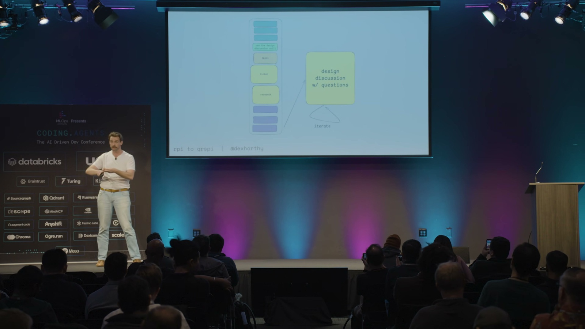

Dex 用了一個很傳神的說法: 這是你對 AI **「動腦部手術」**的最佳時機。你逼它把找到的東西、想做的事、它以為你要的、它沒把握的問題，全部一股腦倒進一份你能隨手修改的文件裡。趁它還沒寫下兩千行程式碼之前，給它每一個機會，把「它可能搞錯的地方」先攤在你面前。這正呼應了那句核心: 不要外包思考。(Matt Pocock 把這份文件叫做「設計概念」: 它是人和 AI 之間，對於「要蓋什麼、怎麼蓋」的共識。)

## 11. 結構大綱: 計畫是「實作」，大綱是「目錄」

第二個新階段是 **結構大綱 (Structure Outline，我們怎麼走過去)**。如果說「設計」像架構評審會議，那「大綱」就是衝刺規劃會議: 把高層次的階段拆出來、決定改動順序、以及沿路要怎麼測。Dex 給了寫過 C 語言的人一秒就懂的比喻:

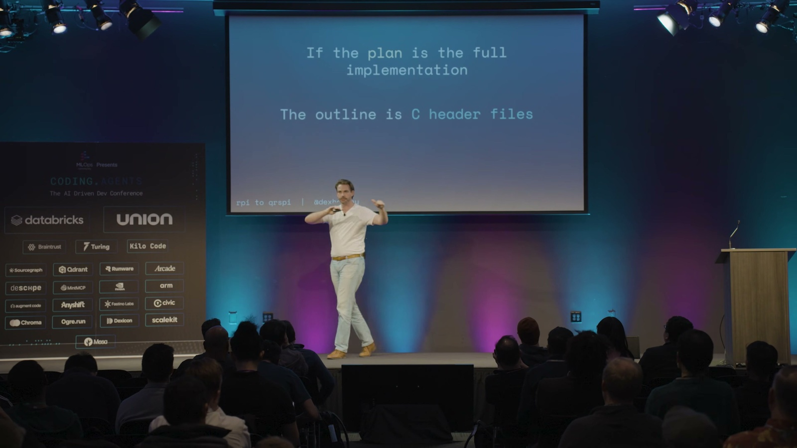

**如果完整計畫像是把功能整個實作出來的程式檔，那大綱就像是 C 語言的標頭檔 (.h)**: 只列出函式的樣貌和會動到的型別，份量足夠你看懂 AI 在想什麼、能即時糾正它，但又不必讀完整版。一份計畫可能有八頁，對應的大綱大概只有兩頁，檢查起來輕鬆太多了。

## 12. 要「垂直」切，不要「水平」切

為什麼非得多這個大綱階段不可? 因為不管怎麼調 prompt、怎麼測試，**模型就是改不掉「水平切」的壞習慣**: 先把所有資料庫做完、再把所有服務層做完、再把所有 API 做完、最後才碰前端。等你回過神，已經是 1,200 行程式碼、而且整個跑不起來，還得回頭猜是哪一塊壞了，因為中間根本沒有任何能拿來測的半成品。

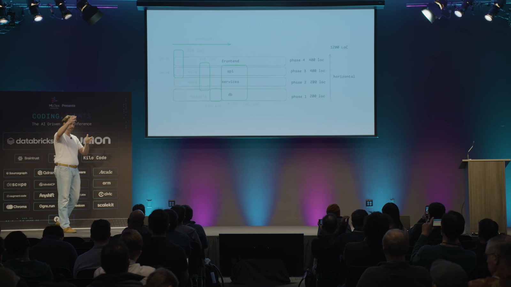

❌ 水平切

一層做完才換下一層，中途沒有半成品可測

全部資料庫

全部服務層

全部 API

全部前端

💥 1,200 行全寫完才第一次能跑，壞了還得回頭猜哪裡錯

✅ 垂直切

每一刀都貫穿前後端，做完就能驗

四個能各自驗證的小增量

✓

前端

API

DB

✓

前端

API

DB

✓

前端

API

DB

✓

前端

API

DB

✓ 每個小階段都有檢查點，錯了當場停下來修

✏️ 小編製圖，非 Dex 原始投影片

Dex 推的是 **「垂直」切**: 先假造一個 API 端點、讓它在前端能動、把前後接起來、再假造服務層、接著做資料庫遷移、最後整合。就算程式碼總量一模一樣，這樣切你沿路會有一個個檢查點可以驗證，不對就當場停下來修，而不是等全部寫完才一次爆炸。而那份「大綱」，就是逼模型乖乖照垂直方式切的最好工具。

## 13. 槓桿不只對自己，也對團隊

這些比較短的文件 (設計、大綱) 還有一個大用途: **幫團隊對齊方向**。Dex 本人不是 HumanLayer 多數程式碼的負責人，他的共同創辦人才是。所以他會刻意先把自己的設計討論丟給對方看。他們沒有把這設成強制步驟，但他想確保等到正式審查程式碼那一刻，對方只會說「對，這就是我要的」。

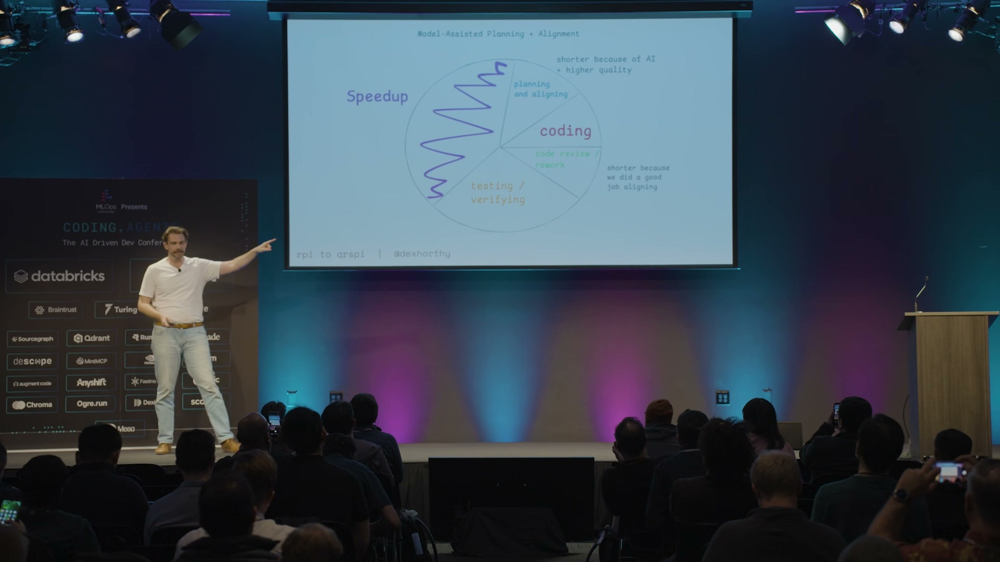

換句話說，**他那些不夠好的決定，會在那份 200 行的文件上就被攔下來**，而不是等他把程式碼寫完、跑起來、產生感情之後才被退貨。換個角度看就是省時間: 用 AI 幫你寫，純寫程式的時間從好幾小時縮到 20 分鐘，但這仍然是個兩天的功能，因為跟團隊對齊、等人審查、跨團隊協調、測試驗證，這些都沒省到。可是當你連「規劃」和「對齊」都用 AI 加速、而且對得更準，後面的審查和返工自然也跟著縮短。

## 14. RPI 進化成 CRISPY

把研究與規劃的各個階段攤開，完整流程是: 提問 (Questions) → 研究 (Research) → 設計 (Design) → 結構大綱 (Structure Outline) → 計畫 (Plan) → 開分支 (Worktree) → 實作 (Implement) → 發 PR (Pull Request)。

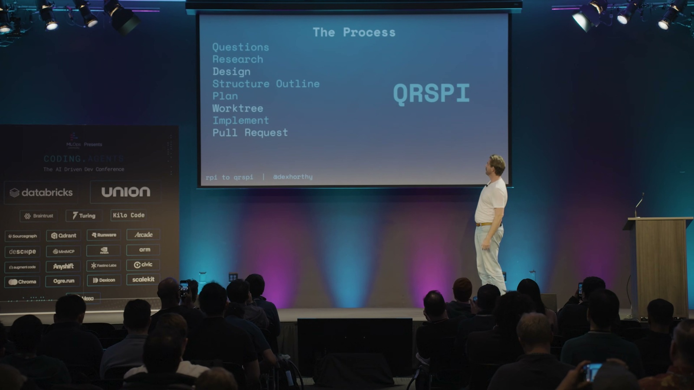

研究與規劃 · 前五階段

① 提問

Questions

② 研究

Research

③ 設計

Design

④ 結構大綱

Structure Outline

⑤ 計畫

Plan

動手實作 · 後三階段

⑥ 開分支

Worktree

⑦ 實作

Implement

⑧ 發 PR

Pull Request

八階段字首排成 QRSPI 不好念 → 挑順口字母改寫成好記的 **CRISPY**

✏️ 小編製圖，非 Dex 原始投影片

這串階段的字首排出來其實是不怎麼順口的「QRSPI」，拼不成什麼像樣的縮寫，所以他們乾脆挑了喜歡的字母、改寫成好記的 **CRISPY** (酥脆的)。所以這不是嚴格的首字母縮寫，就是個順口的暱稱，RPI 就這樣進化成了 CRISPY。Dex 自己也吐槽: 本來想讓團隊更好上手，結果步驟不減反增 (他口頭說是「從三步變成七步」，但投影片上其實列了八個階段)。至於「平台團隊要怎麼把這套 prompt 持續改好、又不會把某個團隊原本順手的流程搞壞」，他坦言這還是個沒有答案的難題。

## 15. 「笨蛋區」現在還準嗎?

最後有人問: 你研究很久的「笨蛋區」(上下文一旦用超過 40%，模型就開始變笨)，在現在這麼多自動壓縮機制的情況下還準嗎? Dex 的回答蠻務實的:

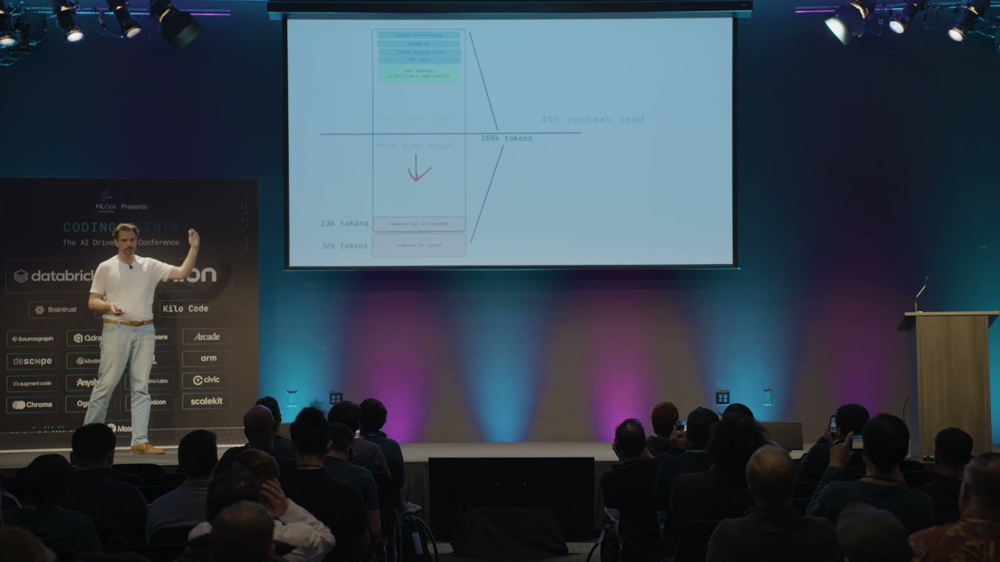

上下文用量 (Context %) 與「笨蛋區」

0–40%　安全區

40–60%　老手衝刺

60%+　模型開始變笨

新手: 守在 40% 以下，到 60% 就收尾 老手: 常態衝到 60%，看任務調整

✏️ 小編製圖，非 Dex 原始投影片

「如果你已經重度用這類工具半年到九個月、每週 60 小時，那『笨蛋區』對你來說已經不是個有用的概念了。」他自己會常態衝到 60%，也會在某些任務上刻意壓在 30% 以下，全看任務複雜度、以及「指令」和「資訊」的比例。但對新手，他還是會教: 守在 40% 以下，到 60% 就想辦法收尾。

而且他們**不用內建的自動壓縮**，因為所有重要的東西，都已經寫進那些靜態文件 (設計、大綱、計畫) 裡了，你隨時可以從中斷的地方接著做，完全不必擔心自動或手動壓縮會不會搞砸品質。這其實才是這套流程最底層的好處: 把重要的脈絡放在你看得到、改得動的檔案裡，而不是放在那段隨時可能被壓掉的對話裡。

---

把兩場連起來看，會發現 Dex 的核心信念其實沒變: 模型本身是沒有記憶的，上下文的品質決定一切，所以千萬不要外包思考。變的是**「人的注意力該擺在哪」**: 從「讀計畫」挪到「讀程式碼，加上讀那幾份更短的對齊文件」。

小編覺得最值得帶走的，是他那句認錯: 「如果你的工具得念咒語才用得好，那該修的是工具。」這放在任何 AI 產品上都成立。我們太容易把「AI 用不好」歸咎於使用者「prompt 下得不夠好」，但真正成熟的系統，應該讓一般人不用學什麼魔法，也能拿到好結果。RPI 一路演化成 CRISPY，本質上就是在做一件事: 把「資深工程師腦袋裡那些說不清的隱性技巧」，一步步變成「流程裡寫得明明白白的步驟」。

## 小編補充: 用一個例子看懂這四個階段差在哪

研究 (Research)、設計 (Design)、結構大綱 (Structure Outline)、計畫 (Plan) 這四個名字有點接近，很容易搞混。小編用一個具體情境幫大家分清楚 (這是小編自己舉的例子，不是 Dex 原話):

> 假設你要**幫一個現有的 SaaS 帳號系統，加上雙因素驗證 (2FA)**。

**1. 研究 (Research) — 現在長什麼樣?**

摸清現況的客觀事實，不帶任何意見。

派子代理去查: 登入流程現在怎麼走 (哪個檔案、第幾行)、密碼怎麼驗證和儲存、session 怎麼建立、有沒有現成的簡訊或 email 寄送機制、使用者資料表長什麼樣。純粹記錄「現在是這樣」，完全不碰「2FA 該怎麼做」。

**2. 設計 (Design) — 要變成什麼樣? 為什麼?**

拍板大方向和關鍵取捨，這是跟 AI 對齊「要蓋什麼」的地方，大約 200 行。

要支援哪幾種雙因素驗證: 是用驗證器 app 的 TOTP (Time-based One-Time Password，時間型一次性密碼)，還是簡訊? 備援碼怎麼處理、強制開啟還是讓使用者選用、開啟後現有的登入狀態要不要失效。會列出已經拍板的決定 (例如「第一版只做 TOTP」)，以及還要你回答的開放問題 (例如「簡訊費用誰吸收?」)。

**3. 結構大綱 (Structure Outline) — 分幾步、照什麼順序走?**

把工作「垂直」切成幾個有先後順序、能各自驗證的階段。就像前面說的 C 標頭檔: 只勾出有哪幾個階段、什麼順序、各自怎麼測，讓你看懂整體要怎麼走，但完全不碰「每一步改哪一行」那種細節 (那是下一階段「計畫」才做的事)，大約兩頁:

1. 在使用者資料表加欄位、寫好 migration
2. 後端產生與驗證 TOTP 的元件，連同它對外的函式長相
3. 啟用與驗證的 API 介面
4. 前端的設定畫面和登入時的輸入框

每個階段各自要怎麼測，也一併寫清楚。

**4. 計畫 (Plan) — 每一步到底改哪一行?**

給 AI 照著做的施工圖，大約八頁，具體到「就算是全世界最笨的模型也很難搞砸」: 「在 `user.rb` 的第幾行加上 `totp_secret` 欄位」「新增 `totp_verifier.rb`，內容大概是這樣…」，每一步都標明檔名、行號、甚至程式碼片段。

最後用一張圖串起來，順序就是從「現況」一路收斂到「每一行」:

廣 · 現況的全部事實

**研究 Research**  
現在長怎樣

**設計 Design**  
要變成怎樣、為什麼

**結構大綱 Structure Outline**  
分幾步、依序、怎麼驗

**計畫 Plan**  
每一步改哪一行

窄 · 收斂到每一行程式碼

✏️ 小編製圖，非 Dex 原始投影片

越前面的階段越需要人用力把關，越後面就越接近機械執行。

這也對應到 Dex 的具體建議: 真正值得你花力氣讀的，是前面那兩份比較短的**設計**和**結構大綱** (在這裡跟 AI 對齊、糾正方向)，還有最後 AI 寫出來的**程式碼** (一定要讀)。中間那份又長又容易跑掉的**計畫**反而不必逐行細讀，快速掃過 (spot check) 確認沒問題就好。把人類的注意力留在「最高槓桿的對齊」和「真正會上線的程式碼」這兩端，正是這整套流程的用意。

一句話: 該把注意力花在哪?

🟢 設計 + 結構大綱  
仔細讀，在這對齊方向

🟡 計畫  
快速掃過 (spot check)

🟢 程式碼  
一定要讀

✏️ 小編製圖，非 Dex 原始投影片
