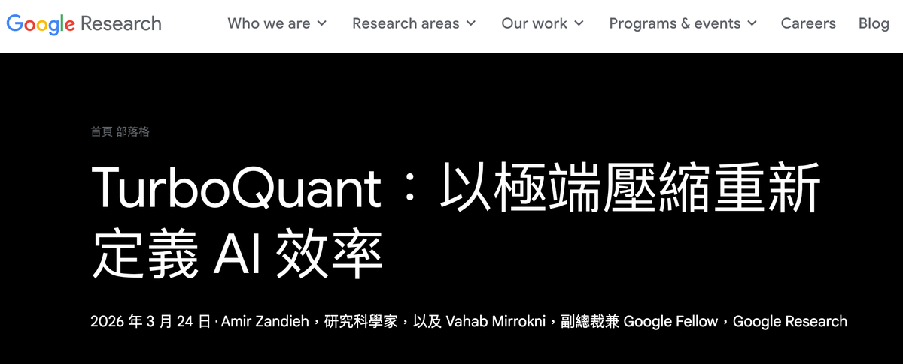

# Google TurboQuant 讓 AI 推理成本大幅下降：記憶體省 6 倍、速度快 8 倍

## 文章資訊

- 作者：[Fox Hsiao](https://www.anduril.tw/author/fox/)
- 日期：2026 年 3 月 25 日
- 閱讀時間：5 分鐘

你跟 ChatGPT 或 Gemini 對話時，AI 每回一句話都要做一件很耗資源的事：記住你前面說過的所有內容。

這個「記住」的機制叫做 KV cache（key-value 快取），它是大型語言模型在推理時最大的記憶體瓶頸之一。Google Research 發表了一系列壓縮演算法，統稱為 TurboQuant，把這個瓶頸的記憶體占用縮小到 6 倍以上，注意力運算速度最高提升 8 倍，而且在基準測試中達到幾乎沒有準確率損失。

其中，TurboQuant 預計於 ICLR 2026 發表，核心元件 PolarQuant 發表於 AISTATS 2026，另一個元件 QJL 則已發表於 AAAI。以下用白話方式解釋它們在做什麼。

## 先搞懂 KV cache 是什麼

想像你正在跟一群人開會，會議進行到第 30 分鐘時，有人突然問你一個問題。你必須回想前面 30 分鐘所有人說過的話與做過的決定，才能給出合理回答。

AI 模型也一樣。當你跟它對話到第 50 句時，模型需要「回想」前面 49 句的內容，才能理解第 50 句的語境。KV cache 就是那份「會議紀錄」，它會把每一句話處理過的中間結果（key 和 value 向量）存起來，讓模型不用每次都重新讀一遍所有對話。

問題在於，這份會議紀錄非常占空間。每一句話都要存成高維度向量，你可以把它想成一串包含數千個數字的清單。對話越長，KV cache 就越大；一次長對話下來，KV cache 甚至可能占掉大部分 GPU 記憶體。

這也是為什麼你跟 AI 聊太久時，它有時會「忘記」前面講過的內容，或者回覆速度變慢，因為記憶體不夠用了。

## TurboQuant 怎麼壓縮這份會議紀錄

TurboQuant 的做法可以分成兩步：一個負責壓縮，一個負責修正誤差。

**第一步（PolarQuant）：換一種方式記錄。**

原本 KV cache 裡的每個向量都用「直角座標」儲存，你可以把它想成 X、Y、Z 三個軸上的距離。這種存法需要很多位元才能足夠精確。PolarQuant 先對向量做隨機旋轉（preconditioning），再把它轉成「極座標」，也就是用距離加角度的方式表示。

為什麼這樣比較容易壓縮？因為旋轉後，角度分布會變得高度集中且可預測，可以直接映射到固定的「圓形網格」上壓縮，不需要傳統方法中額外的正規化（normalization）步驟，也不需要依賴資料本身來建立編碼簿。

**第二步（QJL）：用 1 個位元修正誤差。**

壓縮一定會產生誤差，PolarQuant 壓完之後仍會有一些微小偏差。QJL（Quantized Johnson-Lindenstrauss，名稱來自一個數學定理）用一種很巧妙的方式做修正：它只用 1 個位元（正或負，也就是 +1 或 -1）記錄殘差，幾乎不占額外空間，但能把誤差降低到幾乎可以忽略。

兩步結合後，TurboQuant 可以把 KV cache 從 32 位元壓到只剩 3 位元，實際記憶體節省超過 6 倍。位元壓縮比與實際記憶體節省不完全等價，因為還有額外開銷，但 Google 原文一致使用 6 倍這個數字。而且它不需要重新訓練模型，直接套用即可。

## 數字有多誇張

Google 在 Llama-3.1-8B-Instruct、Gemma、Mistral 三個開源模型上測試，使用了 LongBench、Needle In A Haystack、ZeroSCROLLS 等多個基準。結果如下：

- KV cache 記憶體縮小 **6 倍以上**
- 在 NVIDIA H100 GPU 上，4 位元 TurboQuant 的注意力運算比 32 位元快 **8 倍**
- 在測試的所有下游任務中，準確率幾乎 **零損失**
- 在 Needle In A Haystack 測試中，特定模型與配置下達到 **完美分數**
- 不需要訓練，也不需要微調
- 執行時額外的計算開銷 **可忽略不計**

「零損失」是最關鍵的一點。過去很多壓縮方法都必須在壓縮率與準確率之間做取捨，壓得越小，答案往往越不準。TurboQuant 在基準測試中壓到 3 位元時，仍維持近乎無損；如果這件事能在更大規模的部署環境中持續成立，對整個 AI 推理產業的影響會非常大。

## 這對你有什麼影響

以下是幾個直接後果，而且每一項都很實際。

**對話可以更長。** 目前很多 AI 產品的對話長度都受限於 KV cache 的記憶體大小。記憶體縮小 6 倍，代表同樣的硬體可以支援更長對話與更大的上下文視窗。

**推理成本下降。** AI 公司的主要成本之一就是 GPU 記憶體。同樣一張 GPU 可以同時服務更多使用者，因為每個使用者占用的 KV cache 更小，單位成本自然下降。

**邊緣裝置跑 AI 更可行。** 手機與筆電上的 AI，最大限制通常就是記憶體不足。KV cache 縮小 6 倍，代表更大的模型有機會部署到更小的裝置上。

**搜尋引擎會更快。** Google 在論文中特別提到，TurboQuant 對搜尋與 AI 應用可能有深遠影響。KV cache 壓縮不只適用於聊天機器人，凡是需要處理長序列的 AI 任務都能受益，包括搜尋排序與摘要生成。

## 一句話總結

Google 找到一種方法，讓 AI 的「短期記憶」占用空間縮小超過 6 倍、注意力運算加速最高 8 倍，而且在測試中幾乎不犧牲準確率。這可能是把 AI 從大型資料中心推向更多終端裝置的重要一步。

---

## 相關資料

- [Google Research Blog: TurboQuant](https://research.google/blog/turboquant-redefining-ai-efficiency-with-extreme-compression/?ref=anduril.tw)
- [Google Research 推文](https://x.com/GoogleResearch/status/2036533564158910740?ref=anduril.tw)
