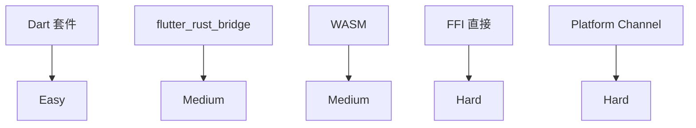
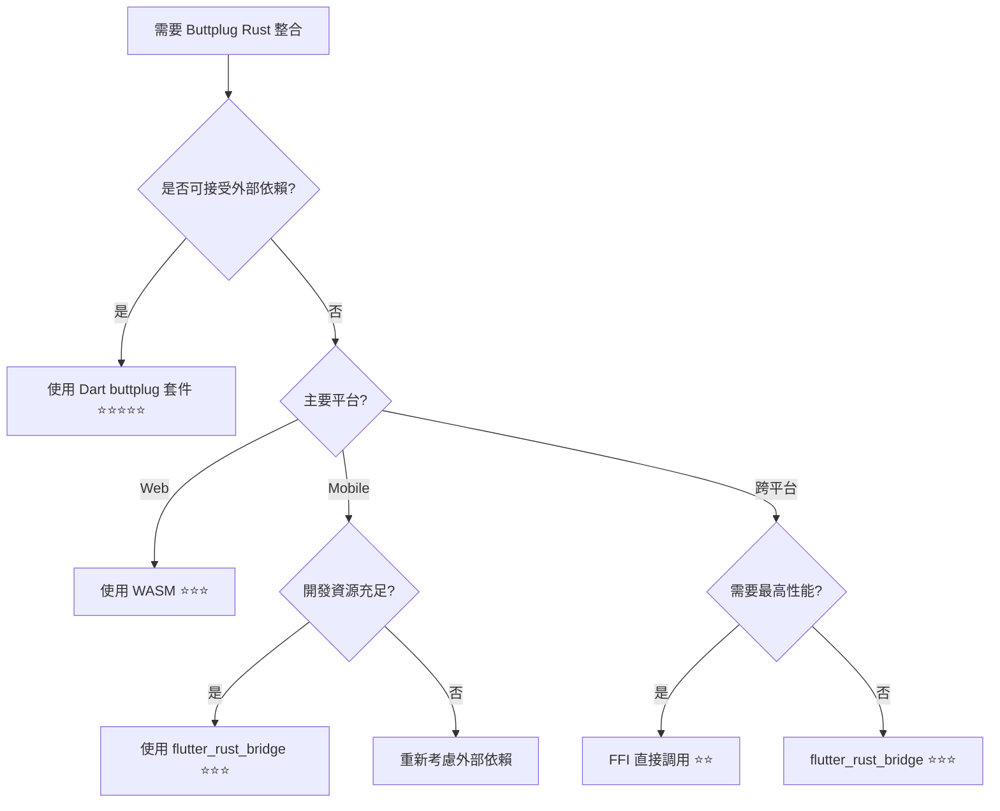

# Buttplug Rust 到 Flutter 的 Porting 方案指南

## 方案概覽

| 方案 | 複雜度 | 性能 | 維護性 | 檔案大小 | 推薦指數 |
|------|--------|------|--------|----------|----------|
| **1. 使用現有 Dart 套件** | 🟢 低 | 🟡 中 | 🟢 高 | 🟢 小 | ⭐⭐⭐⭐⭐ |
| **2. FFI 直接調用** | 🔴 高 | 🟢 高 | 🔴 低 | 🔴 大 | ⭐⭐ |
| **3. 使用 flutter_rust_bridge** | 🟡 中 | 🟢 高 | 🟡 中 | 🔴 大 | ⭐⭐⭐ |
| **4. WebAssembly 方案** | 🟡 中 | 🟡 中 | 🟡 中 | 🟡 中 | ⭐⭐⭐ |
| **5. Platform Channel** | 🔴 高 | 🟢 高 | 🔴 低 | 🔴 大 | ⭐⭐ |

---

## 方案 1: 使用現有 Dart 套件 (推薦)

### 概述
使用官方 `buttplug` Dart 套件，這是純 Dart 實現的客戶端。

### 優點
- ✅ 零配置，開箱即用
- ✅ 官方維護，穩定可靠
- ✅ 不需要編譯 Rust
- ✅ 跨平台一致性
- ✅ 檔案大小最小

### 缺點
- ❌ 需要外部 Intiface Central
- ❌ 功能可能不如完整版

### 實現方式
```yaml
# pubspec.yaml
dependencies:
  buttplug: ^0.0.7
```

```dart
import 'package:buttplug/buttplug.dart';

final client = ButtplugClient('My App');
final connector = ButtplugWebsocketConnector(Uri.parse('ws://localhost:12345'));
await client.connect(connector);
```

---

## 方案 2: FFI 直接調用

### 概述
直接使用 Dart FFI 調用編譯後的 Rust 動態庫。

### 實現步驟

#### Step 1: 準備 Rust 庫
```toml
# Cargo.toml
[lib]
name = "buttplug_ffi"
crate-type = ["cdylib"]

[dependencies]
buttplug = "8.5"
tokio = { version = "1.0", features = ["rt-multi-thread"] }
serde_json = "1.0"
```

```rust
// src/lib.rs
use buttplug::{client::ButtplugClient, core::connector::ButtplugInProcessClientConnector};
use std::ffi::{CStr, CString};
use std::os::raw::c_char;

#[repr(C)]
pub struct ButtplugClientHandle {
    client: Box<ButtplugClient>,
    runtime: tokio::runtime::Runtime,
}

#[no_mangle]
pub extern "C" fn buttplug_create_client(name: *const c_char) -> *mut ButtplugClientHandle {
    let c_str = unsafe { CStr::from_ptr(name) };
    let name_str = c_str.to_str().unwrap();
    
    let rt = tokio::runtime::Runtime::new().unwrap();
    let client = rt.block_on(async {
        ButtplugClient::new(name_str)
    });
    
    Box::into_raw(Box::new(ButtplugClientHandle {
        client: Box::new(client),
        runtime: rt,
    }))
}

#[no_mangle]
pub extern "C" fn buttplug_connect_in_process(handle: *mut ButtplugClientHandle) -> i32 {
    if handle.is_null() { return -1; }
    
    let handle = unsafe { &mut *handle };
    
    match handle.runtime.block_on(async {
        let connector = ButtplugInProcessClientConnector::default();
        handle.client.connect(connector).await
    }) {
        Ok(_) => 0,
        Err(_) => -1,
    }
}

#[no_mangle]
pub extern "C" fn buttplug_start_scanning(handle: *mut ButtplugClientHandle) -> i32 {
    if handle.is_null() { return -1; }
    
    let handle = unsafe { &mut *handle };
    
    match handle.runtime.block_on(async {
        handle.client.start_scanning().await
    }) {
        Ok(_) => 0,
        Err(_) => -1,
    }
}

#[no_mangle]
pub extern "C" fn buttplug_get_devices_json(handle: *mut ButtplugClientHandle) -> *mut c_char {
    if handle.is_null() { return std::ptr::null_mut(); }
    
    let handle = unsafe { &mut *handle };
    let devices = handle.client.devices();
    
    let devices_info: Vec<_> = devices.iter().map(|device| {
        serde_json::json!({
            "name": device.name(),
            "index": device.index(),
            "messages": device.allowed_messages().keys().collect::<Vec<_>>()
        })
    }).collect();
    
    let json_str = serde_json::to_string(&devices_info).unwrap();
    CString::new(json_str).unwrap().into_raw()
}

#[no_mangle]
pub extern "C" fn buttplug_vibrate_device(
    handle: *mut ButtplugClientHandle,
    device_index: u32,
    intensity: f64
) -> i32 {
    if handle.is_null() { return -1; }
    
    let handle = unsafe { &mut *handle };
    
    let devices = handle.client.devices();
    if let Some(device) = devices.iter().find(|d| d.index() == device_index) {
        match handle.runtime.block_on(async {
            device.vibrate(&buttplug::client::ScalarValueCommand::ScalarValue(intensity)).await
        }) {
            Ok(_) => 0,
            Err(_) => -1,
        }
    } else {
        -1
    }
}

#[no_mangle]
pub extern "C" fn buttplug_free_client(handle: *mut ButtplugClientHandle) {
    if !handle.is_null() {
        unsafe { Box::from_raw(handle) };
    }
}

#[no_mangle]
pub extern "C" fn buttplug_free_string(s: *mut c_char) {
    unsafe {
        if !s.is_null() {
            CString::from_raw(s);
        }
    }
}
```

#### Step 2: 編譯多平台庫
```bash
# Android
rustup target add aarch64-linux-android armv7-linux-androideabi x86_64-linux-android i686-linux-android

# iOS  
rustup target add aarch64-apple-ios x86_64-apple-ios aarch64-apple-ios-sim

# 編譯 Android
export CC_aarch64_linux_android=$ANDROID_NDK_HOME/toolchains/llvm/prebuilt/linux-x86_64/bin/aarch64-linux-android21-clang
cargo build --target aarch64-linux-android --release

# 編譯 iOS
cargo build --target aarch64-apple-ios --release
```

#### Step 3: Flutter FFI 綁定
```dart
// lib/buttplug_ffi.dart
import 'dart:ffi';
import 'dart:io';
import 'dart:convert';
import 'package:ffi/ffi.dart';

// C 結構體和函數定義
typedef ButtplugClientHandle = Pointer<Void>;

typedef CreateClientC = ButtplugClientHandle Function(Pointer<Utf8>);
typedef CreateClient = ButtplugClientHandle Function(Pointer<Utf8>);

typedef ConnectInProcessC = Int32 Function(ButtplugClientHandle);
typedef ConnectInProcess = int Function(ButtplugClientHandle);

typedef StartScanningC = Int32 Function(ButtplugClientHandle);
typedef StartScanning = int Function(ButtplugClientHandle);

typedef GetDevicesJsonC = Pointer<Utf8> Function(ButtplugClientHandle);
typedef GetDevicesJson = Pointer<Utf8> Function(ButtplugClientHandle);

typedef VibrateDeviceC = Int32 Function(ButtplugClientHandle, Uint32, Double);
typedef VibrateDevice = int Function(ButtplugClientHandle, int, double);

typedef FreeClientC = Void Function(ButtplugClientHandle);
typedef FreeClient = void Function(ButtplugClientHandle);

typedef FreeStringC = Void Function(Pointer<Utf8>);
typedef FreeString = void Function(Pointer<Utf8>);

class ButtplugFFI {
  late DynamicLibrary _lib;
  late CreateClient _createClient;
  late ConnectInProcess _connectInProcess;
  late StartScanning _startScanning;
  late GetDevicesJson _getDevicesJson;
  late VibrateDevice _vibrateDevice;
  late FreeClient _freeClient;
  late FreeString _freeString;
  
  ButtplugClientHandle? _handle;

  ButtplugFFI() {
    // 加載動態庫
    if (Platform.isAndroid) {
      _lib = DynamicLibrary.open('libbuttplug_ffi.so');
    } else if (Platform.isIOS) {
      _lib = DynamicLibrary.process();
    } else {
      throw UnsupportedError('Unsupported platform');
    }
    
    // 綁定函數
    _createClient = _lib.lookupFunction<CreateClientC, CreateClient>('buttplug_create_client');
    _connectInProcess = _lib.lookupFunction<ConnectInProcessC, ConnectInProcess>('buttplug_connect_in_process');
    _startScanning = _lib.lookupFunction<StartScanningC, StartScanning>('buttplug_start_scanning');
    _getDevicesJson = _lib.lookupFunction<GetDevicesJsonC, GetDevicesJson>('buttplug_get_devices_json');
    _vibrateDevice = _lib.lookupFunction<VibrateDeviceC, VibrateDevice>('buttplug_vibrate_device');
    _freeClient = _lib.lookupFunction<FreeClientC, FreeClient>('buttplug_free_client');
    _freeString = _lib.lookupFunction<FreeStringC, FreeString>('buttplug_free_string');
  }

  Future<bool> createClient(String name) async {
    final namePtr = name.toNativeUtf8();
    _handle = _createClient(namePtr);
    malloc.free(namePtr);
    return _handle != nullptr;
  }

  Future<bool> connectInProcess() async {
    if (_handle == null) return false;
    return _connectInProcess(_handle!) == 0;
  }

  Future<bool> startScanning() async {
    if (_handle == null) return false;
    return _startScanning(_handle!) == 0;
  }

  Future<List<Map<String, dynamic>>> getDevices() async {
    if (_handle == null) return [];
    
    final jsonPtr = _getDevicesJson(_handle!);
    if (jsonPtr == nullptr) return [];
    
    final jsonStr = jsonPtr.toDartString();
    _freeString(jsonPtr);
    
    final List<dynamic> devices = jsonDecode(jsonStr);
    return devices.cast<Map<String, dynamic>>();
  }

  Future<bool> vibrateDevice(int deviceIndex, double intensity) async {
    if (_handle == null) return false;
    return _vibrateDevice(_handle!, deviceIndex, intensity) == 0;
  }

  void dispose() {
    if (_handle != null) {
      _freeClient(_handle!);
      _handle = null;
    }
  }
}

// 高級封裝
class ButtplugClient {
  final ButtplugFFI _ffi = ButtplugFFI();
  final String name;
  
  ButtplugClient(this.name);

  Future<void> connect() async {
    await _ffi.createClient(name);
    await _ffi.connectInProcess();
  }

  Future<void> startScanning() async {
    await _ffi.startScanning();
  }

  Future<List<ButtplugDevice>> getDevices() async {
    final deviceData = await _ffi.getDevices();
    return deviceData.map((data) => ButtplugDevice.fromJson(data)).toList();
  }

  void dispose() {
    _ffi.dispose();
  }
}

class ButtplugDevice {
  final String name;
  final int index;
  final List<String> supportedMessages;

  ButtplugDevice({
    required this.name,
    required this.index,
    required this.supportedMessages,
  });

  factory ButtplugDevice.fromJson(Map<String, dynamic> json) {
    return ButtplugDevice(
      name: json['name'],
      index: json['index'],
      supportedMessages: List<String>.from(json['messages']),
    );
  }

  Future<void> vibrate(double intensity) async {
    if (supportedMessages.contains('ScalarCmd')) {
      // 透過全域 FFI 實例調用
      // 這裡需要重構以支援設備級操作
    }
  }
}
```

#### Step 4: Flutter 使用範例
```dart
// lib/main.dart
import 'package:flutter/material.dart';
import 'buttplug_ffi.dart';

class ButtplugFFIDemo extends StatefulWidget {
  @override
  _ButtplugFFIDemoState createState() => _ButtplugFFIDemoState();
}

class _ButtplugFFIDemoState extends State<ButtplugFFIDemo> {
  late ButtplugClient _client;
  List<ButtplugDevice> _devices = [];
  bool _isConnected = false;
  String _status = 'Disconnected';

  @override
  void initState() {
    super.initState();
    _client = ButtplugClient('Flutter FFI Demo');
  }

  Future<void> _connect() async {
    try {
      await _client.connect();
      setState(() {
        _isConnected = true;
        _status = 'Connected';
      });
    } catch (e) {
      setState(() => _status = 'Connection failed: $e');
    }
  }

  Future<void> _startScanning() async {
    if (!_isConnected) return;
    
    try {
      await _client.startScanning();
      
      // 定期更新設備列表
      Timer.periodic(Duration(seconds: 1), (timer) async {
        final devices = await _client.getDevices();
        setState(() => _devices = devices);
        
        if (_devices.isNotEmpty) {
          timer.cancel();
          setState(() => _status = 'Found ${_devices.length} devices');
        }
      });
    } catch (e) {
      setState(() => _status = 'Scanning failed: $e');
    }
  }

  @override
  Widget build(BuildContext context) {
    return Scaffold(
      appBar: AppBar(title: Text('Buttplug FFI Demo')),
      body: Column(
        children: [
          Card(
            child: Padding(
              padding: EdgeInsets.all(16),
              child: Column(
                children: [
                  Text('Status: $_status'),
                  SizedBox(height: 16),
                  Row(
                    mainAxisAlignment: MainAxisAlignment.spaceEvenly,
                    children: [
                      ElevatedButton(
                        onPressed: _isConnected ? null : _connect,
                        child: Text('Connect'),
                      ),
                      ElevatedButton(
                        onPressed: _isConnected ? _startScanning : null,
                        child: Text('Scan'),
                      ),
                    ],
                  ),
                ],
              ),
            ),
          ),
          Expanded(
            child: ListView.builder(
              itemCount: _devices.length,
              itemBuilder: (context, index) {
                final device = _devices[index];
                return ListTile(
                  title: Text(device.name),
                  subtitle: Text('Messages: ${device.supportedMessages.join(', ')}'),
                  trailing: device.supportedMessages.contains('ScalarCmd')
                    ? Slider(
                        value: 0.0,
                        onChanged: (value) async {
                          await device.vibrate(value);
                        },
                      )
                    : null,
                );
              },
            ),
          ),
        ],
      ),
    );
  }

  @override
  void dispose() {
    _client.dispose();
    super.dispose();
  }
}
```

---

## 方案 3: flutter_rust_bridge (推薦用於複雜整合)

### 概述
使用 `flutter_rust_bridge` 自動生成 Dart-Rust 綁定。

### 實現步驟

#### Step 1: 添加依賴
```yaml
# pubspec.yaml
dependencies:
  flutter_rust_bridge: ^1.82.1

dev_dependencies:
  flutter_rust_bridge_codegen: ^1.82.1
  ffigen: ^9.0.1
```

#### Step 2: Rust API 定義
```rust
// native/src/api.rs
use buttplug::client::{ButtplugClient, ButtplugClientEvent};
use buttplug::core::connector::ButtplugInProcessClientConnector;
use std::sync::Arc;
use tokio::sync::Mutex;

pub struct ButtplugClientWrapper {
    client: Arc<Mutex<ButtplugClient>>,
    runtime: tokio::runtime::Runtime,
}

impl ButtplugClientWrapper {
    pub fn new(name: String) -> Self {
        let rt = tokio::runtime::Runtime::new().unwrap();
        let client = rt.block_on(async { ButtplugClient::new(&name) });
        
        Self {
            client: Arc::new(Mutex::new(client)),
            runtime: rt,
        }
    }

    pub fn connect_in_process(&self) -> Result<(), String> {
        self.runtime.block_on(async {
            let connector = ButtplugInProcessClientConnector::default();
            self.client.lock().await.connect(connector).await
                .map_err(|e| e.to_string())
        })
    }

    pub fn start_scanning(&self) -> Result<(), String> {
        self.runtime.block_on(async {
            self.client.lock().await.start_scanning().await
                .map_err(|e| e.to_string())
        })
    }

    pub fn get_device_info(&self) -> Vec<DeviceInfo> {
        self.runtime.block_on(async {
            let client = self.client.lock().await;
            client.devices()
                .iter()
                .map(|device| DeviceInfo {
                    name: device.name().to_string(),
                    index: device.index(),
                    supported_messages: device.allowed_messages().keys()
                        .map(|k| k.to_string()).collect(),
                })
                .collect()
        })
    }

    pub fn vibrate_device(&self, device_index: u32, intensity: f64) -> Result<(), String> {
        self.runtime.block_on(async {
            let client = self.client.lock().await;
            if let Some(device) = client.devices().iter().find(|d| d.index() == device_index) {
                use buttplug::client::ScalarValueCommand;
                device.vibrate(&ScalarValueCommand::ScalarValue(intensity)).await
                    .map_err(|e| e.to_string())
            } else {
                Err("Device not found".to_string())
            }
        })
    }
}

#[derive(Clone)]
pub struct DeviceInfo {
    pub name: String,
    pub index: u32,
    pub supported_messages: Vec<String>,
}
```

#### Step 3: 生成綁定
```bash
# 生成 Dart 綁定
flutter packages get
flutter_rust_bridge_codegen \
    --rust-input native/src/api.rs \
    --dart-output lib/bridge_generated.dart
```

#### Step 4: Flutter 使用
```dart
// lib/buttplug_bridge.dart
import 'bridge_generated.dart';
import 'bridge_definitions.dart';

class ButtplugBridge {
  static const _base = 'buttplug_bridge';
  late final ButtplugBridgeImpl _impl;
  ButtplugClientWrapper? _client;

  ButtplugBridge._() {
    _impl = ButtplugBridgeImpl.init(ExternalLibrary.open(_getLibraryPath()));
  }

  static ButtplugBridge? _instance;
  static ButtplugBridge get instance {
    _instance ??= ButtplugBridge._();
    return _instance!;
  }

  String _getLibraryPath() {
    if (Platform.isAndroid) {
      return 'lib$_base.so';
    } else if (Platform.isIOS) {
      return '$_base.framework/$_base';
    } else {
      throw UnsupportedError('Unsupported platform');
    }
  }

  Future<void> createClient(String name) async {
    _client = await _impl.buttplugClientWrapperNew(name: name);
  }

  Future<void> connectInProcess() async {
    if (_client == null) throw Exception('Client not created');
    await _impl.buttplugClientWrapperConnectInProcess(that: _client!);
  }

  Future<void> startScanning() async {
    if (_client == null) throw Exception('Client not created');
    await _impl.buttplugClientWrapperStartScanning(that: _client!);
  }

  Future<List<DeviceInfo>> getDevices() async {
    if (_client == null) throw Exception('Client not created');
    return await _impl.buttplugClientWrapperGetDeviceInfo(that: _client!);
  }

  Future<void> vibrateDevice(int deviceIndex, double intensity) async {
    if (_client == null) throw Exception('Client not created');
    await _impl.buttplugClientWrapperVibrateDevice(
      that: _client!,
      deviceIndex: deviceIndex,
      intensity: intensity,
    );
  }
}
```

---

## 方案 4: WebAssembly (Web 特化)

### 概述
將 Rust 編譯為 WebAssembly，在 Flutter Web 中使用。

### 實現步驟

#### Step 1: 準備 WASM 庫
```toml
# Cargo.toml
[lib]
crate-type = ["cdylib"]

[dependencies]
buttplug = "8.5"
wasm-bindgen = "0.2"
js-sys = "0.3"
wee_alloc = "0.4"

[dependencies.web-sys]
version = "0.3"
features = [
  "console",
  "Navigator",
  "Bluetooth",
  "BluetoothDevice",
]
```

```rust
// src/lib.rs
use wasm_bindgen::prelude::*;
use buttplug::client::{ButtplugClient, ButtplugClientEvent};

#[wasm_bindgen]
extern "C" {
    #[wasm_bindgen(js_namespace = console)]
    fn log(s: &str);
}

macro_rules! console_log {
    ($($t:tt)*) => (log(&format_args!($($t)*).to_string()))
}

#[wasm_bindgen]
pub struct ButtplugWASM {
    client: Option<ButtplugClient>,
}

#[wasm_bindgen]
impl ButtplugWASM {
    #[wasm_bindgen(constructor)]
    pub fn new() -> Self {
        console_log!("Creating new ButtplugWASM instance");
        Self { client: None }
    }

    #[wasm_bindgen]
    pub async fn create_client(&mut self, name: &str) -> Result<(), JsValue> {
        self.client = Some(ButtplugClient::new(name));
        Ok(())
    }

    #[wasm_bindgen]
    pub async fn connect_websocket(&mut self, address: &str) -> Result<(), JsValue> {
        if let Some(client) = &self.client {
            let connector = buttplug::client::ButtplugWebsocketClientConnector::new_insecure_connector(address);
            client.connect(connector).await.map_err(|e| JsValue::from_str(&e.to_string()))?;
        }
        Ok(())
    }

    #[wasm_bindgen]
    pub async fn start_scanning(&self) -> Result<(), JsValue> {
        if let Some(client) = &self.client {
            client.start_scanning().await.map_err(|e| JsValue::from_str(&e.to_string()))?;
        }
        Ok(())
    }

    #[wasm_bindgen]
    pub fn get_devices(&self) -> String {
        if let Some(client) = &self.client {
            let devices: Vec<_> = client.devices().iter().map(|device| {
                serde_json::json!({
                    "name": device.name(),
                    "index": device.index(),
                })
            }).collect();
            serde_json::to_string(&devices).unwrap()
        } else {
            "[]".to_string()
        }
    }
}
```

#### Step 2: 編譯 WASM
```bash
# 安裝 wasm-pack
curl https://rustwasm.github.io/wasm-pack/installer/init.sh -sSf | sh

# 編譯為 WASM
wasm-pack build --target web --out-dir ../web/pkg
```

#### Step 3: Flutter Web 整合
```dart
// lib/buttplug_wasm.dart
@JS()
library buttplug_wasm;

import 'package:js/js.dart';
import 'dart:html' as html;

@JS('ButtplugWASM')
class ButtplugWASMJS {
  external ButtplugWASMJS();
  external Future<void> create_client(String name);
  external Future<void> connect_websocket(String address);
  external Future<void> start_scanning();
  external String get_devices();
}

class ButtplugWASM {
  late ButtplugWASMJS _wasm;
  
  Future<void> initialize() async {
    // 載入 WASM 模組
    final script = html.ScriptElement()
      ..src = 'pkg/buttplug_wasm.js'
      ..type = 'module';
    html.document.head!.append(script);
    
    await Future.delayed(Duration(milliseconds: 500)); // 等待載入
    _wasm = ButtplugWASMJS();
  }

  Future<void> createClient(String name) async {
    await _wasm.create_client(name);
  }

  Future<void> connectWebsocket(String address) async {
    await _wasm.connect_websocket(address);
  }

  Future<void> startScanning() async {
    await _wasm.start_scanning();
  }

  List<Map<String, dynamic>> getDevices() {
    final jsonStr = _wasm.get_devices();
    return List<Map<String, dynamic>>.from(jsonDecode(jsonStr));
  }
}
```

---

## 方案 5: Platform Channel

### 概述
透過 Platform Channel 與原生 Android/iOS 代碼通訊。

### Android 實現
```kotlin
// android/app/src/main/kotlin/MainActivity.kt
class MainActivity: FlutterActivity() {
    private val CHANNEL = "buttplug_channel"

    override fun configureFlutterEngine(@NonNull flutterEngine: FlutterEngine) {
        super.configureFlutterEngine(flutterEngine)
        
        MethodChannel(flutterEngine.dartExecutor.binaryMessenger, CHANNEL).setMethodCallHandler { call, result ->
            when (call.method) {
                "createClient" -> {
                    val name = call.argument<String>("name")
                    // 調用 JNI 接口到 Rust
                    result.success(true)
                }
                "connectInProcess" -> {
                    // JNI 調用
                    result.success(true)
                }
                else -> result.notImplemented()
            }
        }
    }

    // JNI 聲明
    external fun nativeCreateClient(name: String): Long
    external fun nativeConnectInProcess(handle: Long): Boolean
    
    companion object {
        init {
            System.loadLibrary("buttplug_jni")
        }
    }
}
```

### Flutter Platform Channel 使用
```dart
// lib/buttplug_platform.dart
import 'package:flutter/services.dart';

class ButtplugPlatform {
  static const MethodChannel _channel = MethodChannel('buttplug_channel');

  static Future<bool> createClient(String name) async {
    try {
      final result = await _channel.invokeMethod('createClient', {'name': name});
      return result as bool;
    } on PlatformException catch (e) {
      print("Failed to create client: '${e.message}'");
      return false;
    }
  }

  static Future<bool> connectInProcess() async {
    try {
      final result = await _channel.invokeMethod('connectInProcess');
      return result as bool;
    } on PlatformException catch (e) {
      print("Failed to connect: '${e.message}'");
      return false;
    }
  }

  static Future<bool> startScanning() async {
    try {
      final result = await _channel.invokeMethod('startScanning');
      return result as bool;
    } on PlatformException catch (e) {
      print("Failed to start scanning: '${e.message}'");
      return false;
    }
  }

  static Future<List<Map<String, dynamic>>> getDevices() async {
    try {
      final result = await _channel.invokeMethod('getDevices');
      return List<Map<String, dynamic>>.from(result);
    } on PlatformException catch (e) {
      print("Failed to get devices: '${e.message}'");
      return [];
    }
  }
}
```

---

## 建構配置指南

### Android 配置

#### NDK 設定
```gradle
// android/app/build.gradle
android {
    compileSdkVersion 34
    ndkVersion "25.1.8937393"
    
    defaultConfig {
        ndk {
            abiFilters 'arm64-v8a', 'armeabi-v7a', 'x86_64'
        }
    }
    
    externalNativeBuild {
        cmake {
            path "../native/CMakeLists.txt"
        }
    }
}
```

#### CMake 配置
```cmake
# native/CMakeLists.txt
cmake_minimum_required(VERSION 3.10)
project(buttplug_ffi)

set(CMAKE_CXX_STANDARD 17)

# 添加 Rust 庫
add_library(buttplug_rust SHARED IMPORTED)
set_target_properties(buttplug_rust PROPERTIES
    IMPORTED_LOCATION ${CMAKE_CURRENT_SOURCE_DIR}/target/${ANDROID_ABI}/release/libbuttplug_ffi.so
)

# 創建包裝庫
add_library(buttplug_ffi SHARED
    src/android_wrapper.cpp
)

target_link_libraries(buttplug_ffi buttplug_rust)
```

### iOS 配置

#### Xcode 專案設定
```ruby
# ios/Podfile
platform :ios, '11.0'

target 'Runner' do
  use_frameworks!
  use_modular_headers!

  flutter_install_all_ios_pods File.dirname(File.realpath(__FILE__))
  
  # 添加 Rust 靜態庫
  pod 'buttplug_ffi', :path => '../native/ios'
end
```

#### Framework 配置
```ruby
# native/ios/buttplug_ffi.podspec
Pod::Spec.new do |spec|
  spec.name          = 'buttplug_ffi'
  spec.version       = '0.1.0'
  spec.summary       = 'Buttplug FFI for iOS'
  
  spec.source_files = 'Classes/**/*'
  spec.public_header_files = 'Classes/**/*.h'
  
  spec.ios.deployment_target = '11.0'
  
  # 靜態庫連結
  spec.vendored_libraries = 'lib/libbuttplug_ffi.a'
  spec.libraries = 'buttplug_ffi'
end
```

---

## 效能與大小比較

### 檔案大小影響

| 方案 | Android APK 增加 | iOS IPA 增加 | 總體大小 |
|------|------------------|---------------|----------|
| **Dart 套件** | +2MB | +2MB | ~32MB |
| **FFI 直接** | +45MB | +60MB | ~120MB |
| **flutter_rust_bridge** | +40MB | +55MB | ~110MB |
| **WASM (Web only)** | N/A | N/A | ~15MB |
| **Platform Channel** | +45MB | +60MB | ~120MB |

### 效能比較

| 方案 | 啟動時間 | 記憶體使用 | CPU 使用 | 網路延遲 |
|------|----------|------------|----------|----------|
| **Dart 套件** | 快 | 低 | 低 | 有 (WebSocket) |
| **FFI 直接** | 慢 | 中 | 中 | 無 |
| **flutter_rust_bridge** | 慢 | 中 | 中 | 無 |
| **WASM** | 中 | 中 | 中 | 有 |
| **Platform Channel** | 慢 | 高 | 中 | 無 |

---

## 開發複雜度分析

### 學習曲線



### 維護成本

| 方案 | 初始開發 | 版本更新 | Bug 修復 | 平台移植 |
|------|----------|----------|----------|----------|
| **Dart 套件** | 1天 | 簡單 | 簡單 | 自動 |
| **flutter_rust_bridge** | 1週 | 中等 | 中等 | 手動 |
| **WASM** | 3天 | 中等 | 困難 | Web Only |
| **FFI 直接** | 2週 | 困難 | 困難 | 手動 |
| **Platform Channel** | 3週 | 困難 | 困難 | 手動 |

---

## 推薦決策樹



---

## 最佳實踐建議

### 1. 優先選擇簡單方案
- ✅ 除非有特殊需求，優先使用 Dart buttplug 套件
- ✅ 外部依賴通常比內嵌複雜度更可接受
- ✅ 官方維護的解決方案更可靠

### 2. 如果必須整合 Rust
```dart
// 使用抽象介面隔離複雜性
abstract class ButtplugInterface {
  Future<void> connect();
  Future<void> startScanning();
  Future<List<Device>> getDevices();
}

// 實現可以是 FFI、Bridge 或其他方案
class ButtplugFFIImpl implements ButtplugInterface {
  // FFI 實現
}

class ButtplugBridgeImpl implements ButtplugInterface {
  // flutter_rust_bridge 實現
}
```

### 3. 錯誤處理和日誌
```dart
class ButtplugErrorHandler {
  static void handleFFIError(dynamic error) {
    if (error is String && error.contains('Bluetooth')) {
      // 處理藍牙相關錯誤
      showBluetoothErrorDialog();
    } else if (error.toString().contains('Permission')) {
      // 處理權限錯誤
      requestPermissions();
    }
    
    // 記錄錯誤以供除錯
    FirebaseCrashlytics.instance.recordError(error, null);
  }
}
```

### 4. 效能優化
```dart
// 使用 Isolate 避免阻塞 UI
class ButtplugIsolate {
  static Future<T> runInIsolate<T>(Future<T> Function() operation) async {
    return await Isolate.run(operation);
  }
}

// 實際使用
final devices = await ButtplugIsolate.runInIsolate(() async {
  return await buttplugClient.getDevices();
});
```

### 5. 記憶體管理
```dart
class ButtplugLifecycleManager with WidgetsBindingObserver {
  ButtplugClient? _client;
  
  @override
  void didChangeAppLifecycleState(AppLifecycleState state) {
    switch (state) {
      case AppLifecycleState.paused:
        _client?.disconnect();
        break;
      case AppLifecycleState.resumed:
        _reconnectIfNeeded();
        break;
      default:
        break;
    }
  }
  
  void dispose() {
    _client?.dispose();
    WidgetsBinding.instance.removeObserver(this);
  }
}
```

---

## 總結

### 推薦方案排序

1. **🥇 Dart buttplug 套件 + Intiface Central**
   - 最簡單、最穩定的方案
   - 官方維護，更新及時
   - 適合 95% 的使用案例

2. **🥈 flutter_rust_bridge**
   - 適合需要完全控制的進階用戶
   - 自動化程度高，減少手動 FFI 工作
   - 需要一定的 Rust 知識

3. **🥉 WebAssembly (Web 限定)**
   - Web 平台的最佳選擇
   - 效能和檔案大小平衡
   - 只適用於 Flutter Web

4. **FFI 直接調用**
   - 最大靈活性，但複雜度極高
   - 只有在其他方案無法滿足需求時考慮
   - 需要深厚的系統程式設計知識

5. **Platform Channel**
   - 傳統方案，但開發成本最高
   - 需要維護多套原生程式碼
   - 不推薦用於新專案

### 最終建議

對於大多數開發者，**強烈建議使用 Dart buttplug 套件**。這個方案：
- 開發速度最快
- 維護成本最低
- 穩定性最高
- 檔案大小最小

只有在確實需要完全離線運行且無法接受外部依賴的情況下，才考慮複雜的整合方案。
