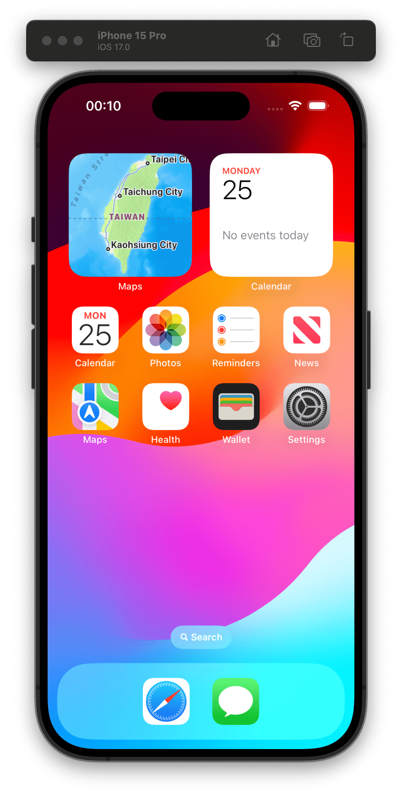
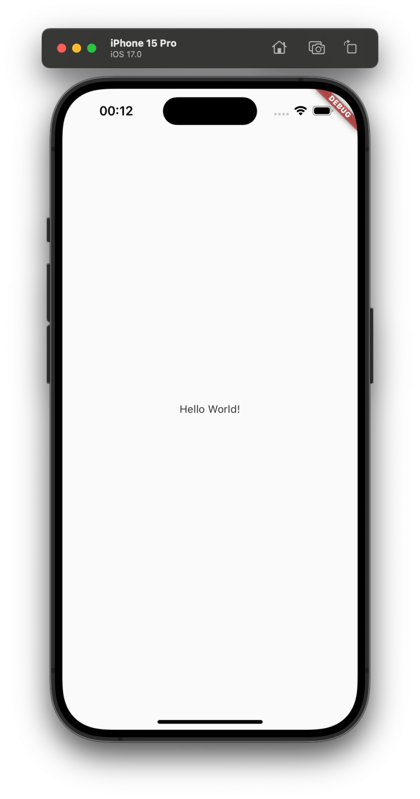

# Flutter

## JDK（Java Development Kit）

```sh
wget https://download.oracle.com/java/17/latest/jdk-17_linux-x64_bin.tar.gz

tar -xvf jdk-17_linux-x64_bin.tar.gz
sudo mv jdk-17.0.7 /usr/lib/jvm/
```

設置Java環境變量 為了讓系統能夠找到 JDK，需要設置 `JAVA_HOME` 環境變量，並將其添加到 `PATH` 變量中。可以通過`vi ~/.bashrc`來編輯 `~/.bashrc` 或 `~/.profile` 文件來實現。打開文件並在文件末尾添加以下內容： 

```sh
export JAVA_HOME=/usr/lib/jvm/jdk-17.0.7
export PATH=$JAVA_HOME/bin:$PATH
```

```sh
dioxidecn@dioxidecn-virtual-machine:~$ java -version
java version "17.0.7" 2023-04-18 LTS
Java(TM) SE Runtime Environment (build 17.0.7+8-LTS-224)
Java HotSpot(TM) 64-Bit Server VM (build 17.0.7+8-LTS-224, mixed mode, sharing)
```


在Ubuntu上進行Flutter開發，您需要安裝Android SDK。Flutter使用Android SDK來構建和運行Android應用程序。以下是安裝Android SDK的簡單步驟：

**下載 Android SDK：** 您可以從[Android 開發者網站](https://developer.android.com/studio#command-tools)下載 Android SDK Command Line Tools。選擇壓縮檔案（ZIP）版本。

**解壓縮檔案：** 解壓縮下載的檔案到您選擇的目錄。例如，您可以將其解壓縮到`/usr/local/android-sdk`目錄下。

```sh
sudo mkdir /usr/local/android-sdk
sudo tar -xvzf commandlinetools-linux-xxxxxx_latest.zip -C /usr/local/android-sdk
```

**設定環境變量：** 在您的`~/.bashrc`或`~/.zshrc`文件中添加以下環境變量：

```sh
export ANDROID_HOME="/media/shihyu/ssd/android-sdk"
export ANDROID_SDK_ROOT="/usr/local/android-sdk"
export PATH="$PATH:$ANDROID_SDK_ROOT/cmdline-tools/latest/bin:$ANDROID_SDK_ROOT/platform-tools:$ANDROID_SDK_ROOT/tools/bin"
```

然後在終端機中運行`source ~/.bashrc`或`source ~/.zshrc`以應用變更。

**安裝SDK組件：** 運行以下命令來安裝所需的SDK組件：

```sh
sdkmanager --sdk_root=/media/shihyu/ssd/android-sdk --install "platforms;android-30" "build-tools;30.0.3" "platform-tools"

sdkmanager --sdk_root=/media/shihyu/ssd/android-sdk  --install "cmdline-tools;latest"
```

這將安裝Android 30平臺、30.0.3版本的構建工具以及平臺工具。

現在，您已經成功安裝了Android SDK，可以開始使用Flutter來開發Android應用程序。請注意，這些步驟可能需要根據您的系統配置和Android SDK版本進行微調。

---

## 在Ubuntu上安裝Flutter的最簡單步驟如下：

1. 在終端機中運行以下命令，下載Flutter SDK：

```sh
git clone https://github.com/flutter/flutter.git
```

1. 將Flutter的`bin`目錄添加到您的`PATH`環境變量中。您可以在`~/.bashrc`或`~/.zshrc`文件中添加類似以下的行：

```sh
export PATH="$PATH:`pwd`/flutter/bin"
```

1. 運行以下命令來檢查Flutter的依賴項：

```sh
flutter doctor --android-licenses
flutter doctor
```

1. 根據`flutter doctor`的輸出，安裝所需的依賴項，例如Android Studio、Xcode（僅限Mac）、Dart等。
2. 安裝完成後，重新啟動終端機，然後您應該能夠運行Flutter命令，例如：

```sh
flutter --version
```

現在，您已經在Ubuntu上成功安裝了Flutter，可以開始開發您的Flutter應用程序了。

## Ubuntu 怎麼寫個 flutter 的 hello world apk

要在Ubuntu上創建一個Flutter的Hello World APK，請按照以下步驟進行：

1. **安裝Flutter：** 如果您尚未安裝Flutter，請參照前面的步驟進行安裝。

2. **創建Flutter項目：** 在終端機中運行以下命令來創建一個新的Flutter項目：

   ```shell
   flutter create hello_world
   ```

   這會在當前目錄中創建一個名為`hello_world`的Flutter項目。

3. **進入項目目錄：** 進入創建的項目目錄：

   ```shell
   cd hello_world
   ```

4. **運行應用：** 運行以下命令來確保一切正常：

   ```shell
   flutter run
   ```

   這將啟動您的應用程序。您可以在模擬器或連接的設備上看到Hello World應用程序運行。

5. **生成APK：** 當您確保應用程序運行正常後，您可以生成APK文件。在項目目錄中運行：

   ```shell
   flutter build apk
   ```

   這將在`build/app/outputs/flutter-apk/`目錄中生成一個APK文件，例如`app-release.apk`。

現在，您已經成功生成了一個Flutter Hello World APK。您可以將這個APK安裝到Android設備上，或者在模擬器中運行。


---

## Flutter 第一個介面


## 專案建立

```bash
# 使用 flutter cli 來建立
$flutter create --platforms ios,android -e trade_app
Signing iOS app for device deployment using developer identity: "Apple Development: Mao-Chin Hsu (XXXXXXXXXX)"
Creating project trade_app...
Resolving dependencies in trade_app...
Got dependencies in trade_app.
Wrote 73 files.

All done!
You can find general documentation for Flutter at: https://docs.flutter.dev/
Detailed API documentation is available at: https://api.flutter.dev/
If you prefer video documentation, consider: https://www.youtube.com/c/flutterdev

In order to run your empty application, type:

  $ cd trade_app
  $ flutter run

Your empty application code is in trade_app/lib/main.dart.
```

這邊我先將專案命名為 `trade_app`
也要注意 `Flutter` 的專案名稱是遵循 `Dart`

use `lowercase_with_underscores` for package names.

Package names should be all lowercase, with underscores to separate words, `just_like_this`. Use only basic Latin letters and Arabic digits: [a-z0-9_]. Also, make sure the name is a valid Dart identifier – that it doesn’t start with digits and isn’t a reserved word.

Dart package 命名規則

因為我已經有訂閱 [Apple Developer](https://developer.apple.com/)
所以會看到 Flutter 已經自動把專案內 iOS 的部分帶入我的開發者信息

### 專案結構

```bash
.
├── README.md
├── analysis_options.yaml
├── android
│   ├── app
│   ├── build.gradle
│   ├── gradle
│   ├── gradle.properties
│   ├── gradlew
│   ├── gradlew.bat
│   ├── local.properties
│   ├── settings.gradle
│   └── trade_app_android.iml
├── ios
│   ├── Flutter
│   ├── Runner
│   ├── Runner.xcodeproj
│   ├── Runner.xcworkspace
│   └── RunnerTests
├── lib
│   └── main.dart
├── pubspec.lock
├── pubspec.yaml
└── trade_app.iml
```

這邊說明一下剛剛下的創建命令
如果沒有下 `--platforms ios,android`
這樣專案內就不會出現 `windows, linux, macOS` 的資料夾
各位也可以視需求要不要加
我自己還是習慣 `Flutter` 是在行動裝置上的

至於 `-e` 就是不會出現範例 `code`，以及一大堆的註解說明
一樣，這看個人，我是覺得每次都要刪一大堆東西很煩

## 啟動模擬器

我這邊會先以 iOS 為主
畢竟 `Flutter` 就是以能夠同一份 `Code` 做跨平臺編譯出名

```bash
open -a Simulator
```



然後就可以在專案資料夾試著先跑起來
應該要是最基本的 `Hello World!`




# Ubuntu 24.04 安裝 Flutter ＆ 建立 Web/Android/iOS 編譯範例

## 1. 安裝必要套件

```bash
sudo apt update
sudo apt upgrade
sudo apt install curl git unzip xz-utils zip libglu1-mesa
```


## 2. 下載並安裝 Flutter

到 [Flutter 官網](https://flutter.dev/docs/get-started/install/linux) 查看最新版，或用下方命令：

```bash
cd ~
curl -O https://storage.googleapis.com/flutter_infra_release/releases/stable/linux/flutter_linux_<version>-stable.tar.xz
tar xf flutter_linux_<version>-stable.tar.xz
```

請將 `<version>` 替換為實際版本號，例如 `3.22.0`。

## 3. 設定環境變數

```bash
echo 'export PATH="$PATH:$HOME/flutter/bin"' >> ~/.bashrc
source ~/.bashrc
```


## 4. 驗證安裝

```bash
flutter doctor
```

根據提示安裝缺漏的依賴（如 Android Studio、Android SDK、等）。

## 5. 安裝 Android 開發環境

- 下載 Android Studio: [官方下載頁](https://developer.android.com/studio)
- 安裝時請確保有安裝 Android SDK、SDK platform tools \& build tools。

執行：

```bash
flutter doctor --android-licenses
```

全部選擇 `y` 同意授權。

## 6. iOS 編譯（僅可於 macOS 測試編譯。Linux 可編輯/寫 code，打正式包需 Mac）

- Linux 僅能寫/預備 iOS 專案，最終打包與 Emulator 上運行需在 macOS 完成。


## 7. 建立 Flutter 專案（同時支援 Web、Android、iOS）

```bash
flutter create my_demo_app
cd my_demo_app
```


## 8. 啟用 Web 支援（預設自 Flutter 2.0 以上已內建）

檢查已支援 Web：

```bash
flutter devices
```

應該會出現 `chrome` 等 web 選項。

## 9. 執行/編譯簡單範例

**Web:**

```bash
flutter run -d chrome
```

**Android:**
手機插上 USB 開啟偵錯功能，或用 emulator

```bash
flutter run -d [android-device-id]
```

**iOS:**
僅限 Mac 執行，如有 Mac:

```bash
flutter run -d ios
```


## 10. Release Build

- Web:

```bash
flutter build web
```

- Android:

```bash
flutter build apk
```

- iOS (限 Mac):

```bash
flutter build ios
```


## 範例 code（`lib/main.dart`）

```dart
import 'package:flutter/material.dart';

void main() {
  runApp(const MyApp());
}

class MyApp extends StatelessWidget {
  const MyApp({super.key});

  @override
  Widget build(BuildContext context) {
    return MaterialApp(
      title: 'Flutter 多平台 Demo',
      theme: ThemeData(
        primarySwatch: Colors.blue,
      ),
      home: const HomePage(),
    );
  }
}

class HomePage extends StatelessWidget {
  const HomePage({super.key});

  @override
  Widget build(BuildContext context) {
    return Scaffold(
      appBar: AppBar(title: const Text('Hello Flutter Web/Android/iOS')),
      body: const Center(child: Text('你好，Flutter 多平台！')),
    );
  }
}
```


## 常見問題處理

- 執行 `flutter doctor` 查看缺少依賴
- Android 設備不偵測請確認 USB 偵錯與驅動
- Web 若失敗，請使用支援的瀏覽器如 Chrome
