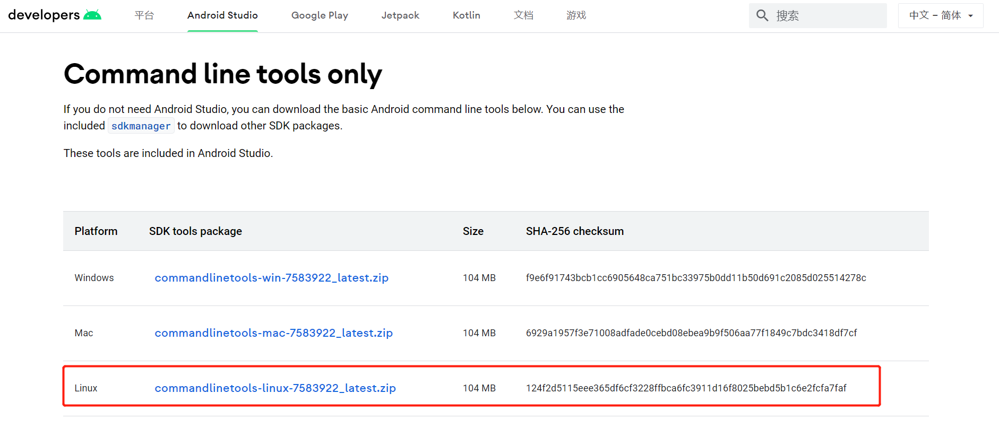

# 安裝Android Sdk

### sdk安裝方式

常規思路，下載sdk，安裝之後修改環境。但是發現，網路上已經沒有了sdk的下載資源，有的也只是很老的版本。查看[Android開發文件——sdkmanager的使用指南](https://developer.android.google.cn/studio/command-line/sdkmanager)，發現可以使用`sdkmanager`這個[命令列工具](https://cloud.tencent.com/product/cli?from=10680)進行下載。

### 下載sdkmanager工具包

[官網下載頁最底部-命令列工具下載](https://developer.android.google.cn/studio)，找到Linux平臺的工具包 



使用`wget`下載到[伺服器](https://cloud.tencent.com/product/cvm?from=10680)

```javascript
wget -P /home/android-sdk/ https://dl.google.com/android/repository/commandlinetools-linux-7583922_latest.zip
```


### 解壓工具包

```javascript
unzip commandlinetools-linux-7583922_latest.zip
```


`sdkmanager`在`/home/android-sdk/cmdline-tools/bin`下。

### 選擇下載最新的sdk版本

使用命令查看最新的stable版本

```javascript
[root@192 bin]# ./sdkmanager --list --channel=0
Error: Could not determine SDK root.
Error: Either specify it explicitly with --sdk_root= or move this package into its expected location: <sdk>/cmdline-tools/latest/
```


報錯了，無法找到sdk根目錄，提示說有兩種解決辦法：一是用–sdk_root指定路徑，二是把資料夾移動到指定路徑。

因為懶，選擇試一下第二個一勞永逸的方法。

```javascript
[root@192 cmdline-tools]# mkdir latest
[root@192 cmdline-tools]# mv bin/ lib/ NOTICE.txt source.properties -t latest/
```


再次執行查詢命令，就會查出一長條的版本。

```javascript
[root@192 cmdline-tools]# cd latest/bin/
[root@192 bin]# ./sdkmanager --list --channel=0
```


### 安裝sdk

因為App項目使用了Android-30的版本，故安裝對應的platforms;android-30

```javascript
./sdkmanager "build-tools;30.0.3" "platforms;android-30"
./sdkmanager "platform-tools" "build-tools;31.0.0" "build-tools;32.0.0" "platforms;android-31" "platforms;android-32"
```


在彈出協議許可時選擇`y`，就開始安裝了。

下載完成後，就可以在`cmdline-tools`的同級目錄，找到下載的sdk了。這也是為什麼上面要指定`sdk-root`的原因了。

```javascript
[root@192 android-sdk]# ls
build-tools  cmdline-tools  commandlinetools-linux-7583922_latest.zip  emulator  licenses  patcher  platforms  platform-tools  tools
```


### 組態ANDROID_HOME環境變數

```javascript
[root@192 android-sdk]# export ANDROID_HOME=/home/android-sdk
[root@192 android-sdk]# export PATH=$ANDROID_HOME/platform-tools:$ANDROID_HOME/tools:$ANDROID_HOME/tools/bin:$PATH
[root@192 android-sdk]# source /etc/profile
```

至此，Linux安裝Android Sdk完成！
