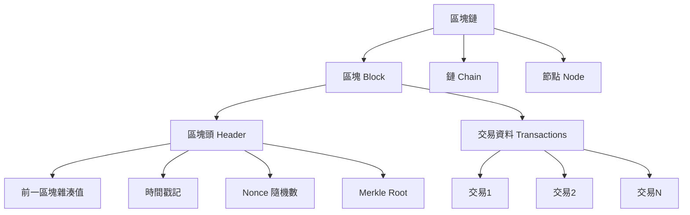
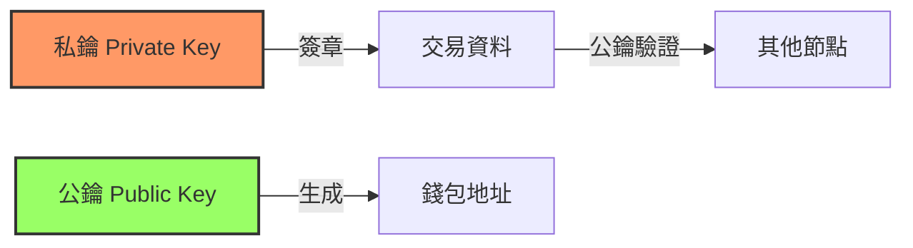
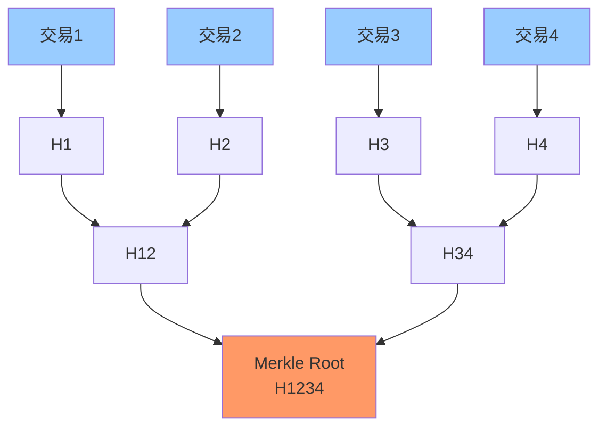
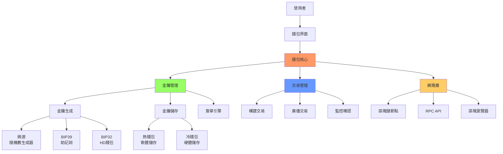
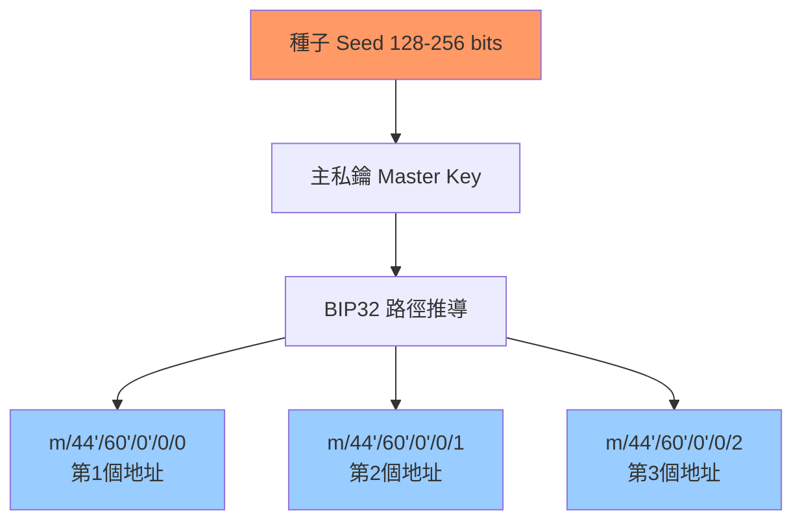
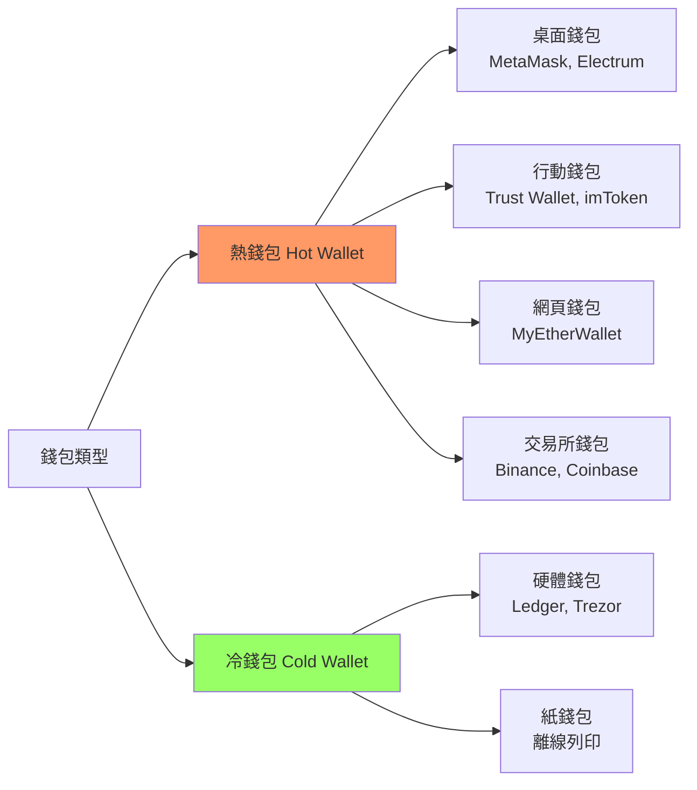
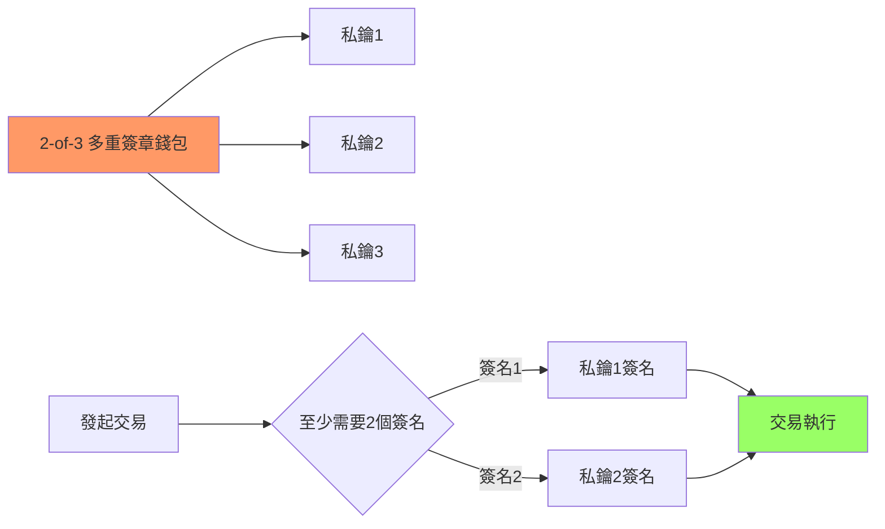
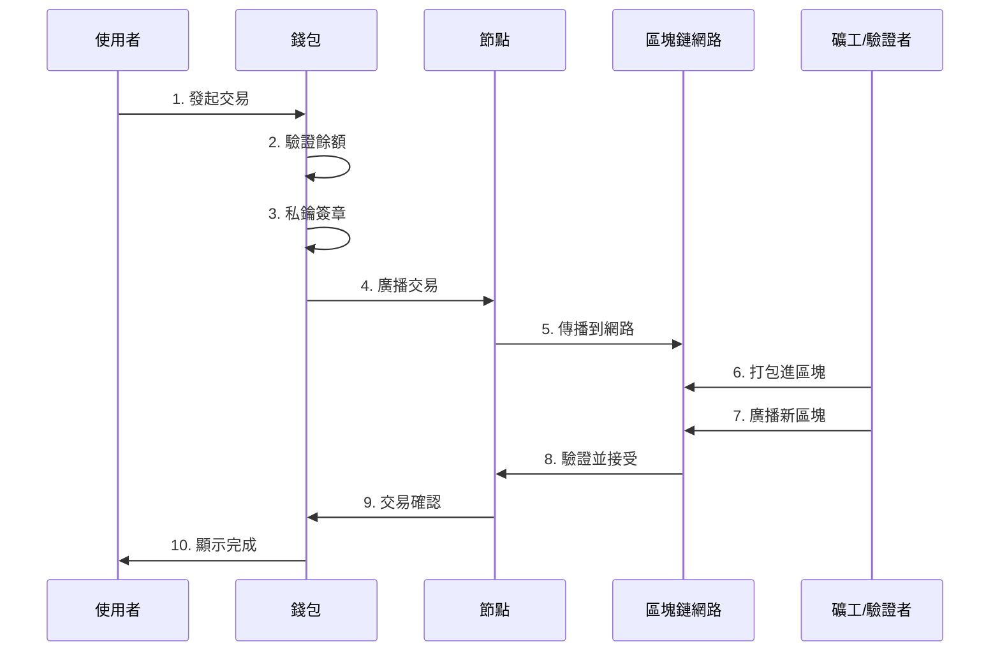
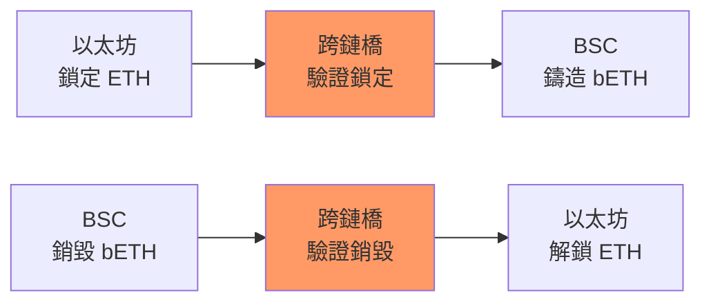

# 區塊鏈技術與錢包架構完整指南

## 目錄
- [區塊鏈基礎概念](#區塊鏈基礎概念)
- [核心技術原理](#核心技術原理)
- [區塊鏈錢包架構](#區塊鏈錢包架構)
- [錢包類型比較](#錢包類型比較)
- [安全機制](#安全機制)
- [實際應用場景](#實際應用場景)

---

## 區塊鏈基礎概念

### 什麼是區塊鏈？

區塊鏈是一種**去中心化的分散式帳本技術**，具有以下特性：

1. **去中心化**：沒有單一控制者，由網路中的所有節點共同維護
2. **不可篡改**：一旦資料寫入，幾乎無法修改
3. **透明性**：所有交易記錄公開可查（地址匿名）
4. **安全性**：採用密碼學技術保證資料安全

### 區塊鏈的組成



---

## 核心技術原理

### 1. 密碼學基礎

#### 雜湊函數（Hash Function）

```
輸入：任意長度資料
輸出：固定長度雜湊值（例如 SHA-256 → 256 bits）

特性：
- 單向性：無法從雜湊值反推原始資料
- 確定性：相同輸入永遠產生相同輸出
- 雪崩效應：輸入微小改變，輸出完全不同
```

**範例：**
```python
import hashlib

# SHA-256 雜湊
data = "Hello Blockchain"
hash_value = hashlib.sha256(data.encode()).hexdigest()
print(hash_value)
# 輸出：2cf24dba5fb0a30e26e83b2ac5b9e29e1b161e5c1fa7425e73043362938b9824
```

#### 非對稱加密（公私鑰）



- **私鑰**：256 bits 隨機數，必須保密
- **公鑰**：從私鑰推導而來，可公開
- **地址**：公鑰雜湊後的結果

**關鍵原則：**
```
私鑰 → 公鑰 → 地址（單向推導）
地址 ✗ 公鑰 ✗ 私鑰（無法反推）
```

### 2. 共識機制

| 機制 | 代表幣種 | 優點 | 缺點 |
|------|---------|------|------|
| **PoW** 工作量證明 | Bitcoin, Ethereum (舊) | 安全、去中心化 | 耗能、速度慢 |
| **PoS** 權益證明 | Ethereum 2.0, Cardano | 節能、速度快 | 可能導致集中化 |
| **DPoS** 委託權益證明 | EOS, TRON | 高吞吐量 | 更集中化 |
| **PBFT** 實用拜占庭容錯 | Hyperledger Fabric | 確定性終結 | 節點數受限 |

### 3. Merkle Tree（默克爾樹）



**用途：**
- 快速驗證交易存在性
- 只需提供部分雜湊值即可證明
- SPV（Simple Payment Verification）輕節點驗證

---

## 區塊鏈錢包架構

### 錢包架構圖



### HD 錢包（分層確定性錢包）



**BIP44 標準路徑：**
```
m / purpose' / coin_type' / account' / change / address_index

範例：
- Bitcoin:  m/44'/0'/0'/0/0
- Ethereum: m/44'/60'/0'/0/0
- Solana:   m/44'/501'/0'/0/0
```

### 助記詞系統（BIP39）

```
熵 Entropy → 助記詞 Mnemonic → 種子 Seed → 金鑰

範例助記詞（12個詞）：
witch collapse practice feed shame open despair creek road again ice least
```

**安全等級：**
- 12 詞：128 bits 熵 = 2^128 組合 (足夠安全)
- 24 詞：256 bits 熵 = 2^256 組合 (極高安全)

---

## 錢包類型比較



### 詳細比較

| 類型 | 安全性 | 便利性 | 適用場景 | 成本 |
|------|--------|--------|---------|------|
| **硬體錢包** | ★★★★★ | ★★★ | 大額長期持有 | 高（$50-200） |
| **桌面錢包** | ★★★★ | ★★★★ | 日常交易 | 免費 |
| **行動錢包** | ★★★ | ★★★★★ | 小額支付 | 免費 |
| **交易所錢包** | ★★ | ★★★★★ | 頻繁交易 | 免費（但有手續費） |
| **紙錢包** | ★★★★★ | ★ | 冷儲存 | 極低 |

---

## 安全機制

### 多重簽章（MultiSig）



**應用場景：**
- 公司資金管理（需多位主管批准）
- 個人資產保護（分散私鑰風險）
- DAO 治理（去中心化自治組織）

### 智能合約錢包

```solidity
// 簡單的多重簽章合約範例
contract MultiSigWallet {
    address[] public owners;
    uint public required;

    mapping(uint => Transaction) public transactions;
    mapping(uint => mapping(address => bool)) public confirmations;

    struct Transaction {
        address to;
        uint value;
        bool executed;
    }

    // 提交交易
    function submitTransaction(address _to, uint _value) public {
        // ...
    }

    // 確認交易
    function confirmTransaction(uint _txId) public {
        require(isOwner(msg.sender));
        confirmations[_txId][msg.sender] = true;

        if (isConfirmed(_txId)) {
            executeTransaction(_txId);
        }
    }
}
```

---

## 實際應用場景

### 1. 交易流程



### 2. Gas Fee 機制（以 Ethereum 為例）

```
交易成本 = Gas Used × Gas Price

範例：
- 簡單轉帳：21,000 Gas
- 智能合約調用：50,000 - 500,000 Gas
- Gas Price：依網路擁擠度動態調整（單位：Gwei）

實際成本（高峰期）：
21,000 Gas × 100 Gwei = 0.0021 ETH ≈ $4-10 USD
```

### 3. 跨鏈橋接



---

## 最佳實踐建議

### 安全原則

1. **私鑰管理**
   - ✅ 永遠不要在網路上傳輸私鑰
   - ✅ 使用硬體錢包儲存大額資產
   - ✅ 定期備份助記詞（紙本、金屬板）
   - ❌ 不要截圖或拍照私鑰
   - ❌ 不要在雲端儲存明文私鑰

2. **交易安全**
   - ✅ 確認接收地址（多次檢查）
   - ✅ 使用白名單地址功能
   - ✅ 小額測試後再大額轉帳
   - ✅ 檢查智能合約權限（approve）

3. **錢包分離策略**
   ```
   熱錢包（少量）   → 日常支付、DeFi 互動
   溫錢包（中量）   → 週期性操作
   冷錢包（大量）   → 長期持有
   ```

### 開發資源

**主流錢包開發庫：**
- **JavaScript**: ethers.js, web3.js
- **Python**: web3.py, bit
- **Rust**: ethers-rs, solana-sdk
- **Go**: go-ethereum, solana-go

**硬體錢包 SDK：**
- Ledger: @ledgerhq/hw-app-eth
- Trezor: trezor-connect

---

## 參考資源

### 技術標準
- [BIP32: HD Wallets](https://github.com/bitcoin/bips/blob/master/bip-0032.mediawiki)
- [BIP39: Mnemonic Seed](https://github.com/bitcoin/bips/blob/master/bip-0039.mediawiki)
- [BIP44: Multi-Account Hierarchy](https://github.com/bitcoin/bips/blob/master/bip-0044.mediawiki)
- [EIP-2612: Permit Extension](https://eips.ethereum.org/EIPS/eip-2612)

### 學習資源
- [Mastering Bitcoin](https://github.com/bitcoinbook/bitcoinbook) by Andreas Antonopoulos
- [Mastering Ethereum](https://github.com/ethereumbook/ethereumbook)
- [Solana Cookbook](https://solanacookbook.com/)

### 開發工具
- [Remix IDE](https://remix.ethereum.org/) - 智能合約開發
- [Hardhat](https://hardhat.org/) - 開發框架
- [Etherscan](https://etherscan.io/) - 區塊瀏覽器

---

## 總結

區塊鏈技術透過密碼學、共識機制和分散式網路，實現了去中心化的信任系統。錢包作為使用者與區塊鏈互動的入口，必須在**安全性**和**便利性**之間取得平衡。

**關鍵要點：**
1. 私鑰是一切的核心 → 保護私鑰 = 保護資產
2. 理解交易流程 → 避免操作錯誤
3. 選擇適合的錢包類型 → 依使用場景決定
4. 持續學習 → 區塊鏈技術快速演進

**安全口訣：**
```
Not your keys, not your coins
（私鑰不在你手上，幣就不是你的）
```
