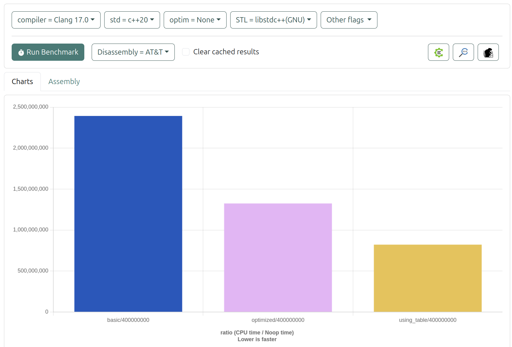
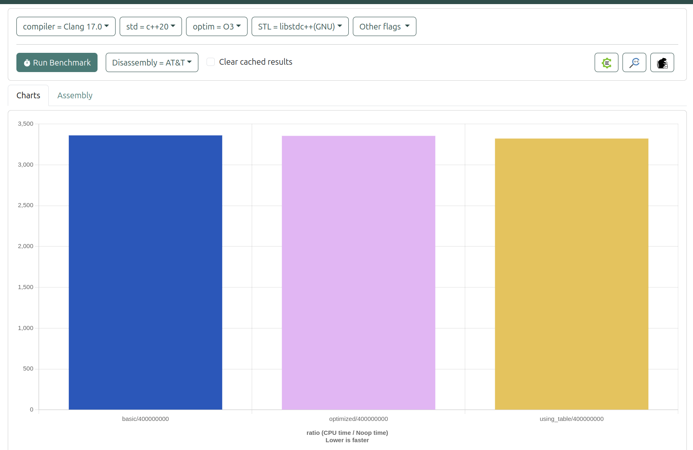

# 時間轉換程式分析報告

## 一、程式目的

本程式主要用於解決以下問題：
- 輸入兩個 HHMMSS 格式的時間（例如 091832 表示 09:18:32）
- 將這些時間轉換為秒數
- 計算兩個時間之間的差異（以秒為單位）


## 二、整數乘法與除法效能測試

```cpp
#include <iostream>
#include <chrono>

// 整數 (int64_t) 乘除法函數
int64_t mulInt(int64_t a) {
    return static_cast<int64_t>(a * 0.01);  // 整數乘法，結果為整數
}

int64_t divInt(int64_t a) {
    return a / 100;  // 整數除法，結果為整數
}

// 無符號整數 (uint64_t) 乘除法函數
uint64_t mulUInt(uint64_t a) {
    return static_cast<uint64_t>(a * 0.01);  // 無符號整數乘法，結果為無符號整數
}

uint64_t divUInt(uint64_t a) {
    return a / 100;  // 無符號整數除法，結果為無符號整數
}

// 位移測試函數
int64_t shiftInt(int64_t a) {
    return a << 1;  // 左位移
}

int64_t shiftUInt(uint64_t a) {
    return a << 1;  // 左位移
}

// 性能測試函數
int64_t testMathCalc() {
    const auto total_iterations = 10000 * 10000;

    // 計算整數乘法運行時間
    auto start_sys_time = std::chrono::system_clock::now();
    int64_t value = 0;
    for (auto i = 0; i < total_iterations; ++i) {
        value = mulInt(i + 5 + value);
    }
    auto elapsedSysTime = std::chrono::system_clock::now() - start_sys_time;
    auto lossTime = std::chrono::duration_cast<std::chrono::microseconds>(elapsedSysTime).count();
    std::cout << "mulInt (int64) lossTime: " << lossTime << " us." << std::endl;

    // 計算整數除法運行時間
    start_sys_time = std::chrono::system_clock::now();
    for (auto i = 0; i < total_iterations; ++i) {
        value = divInt(i + 5 + value);
    }
    elapsedSysTime = std::chrono::system_clock::now() - start_sys_time;
    lossTime = std::chrono::duration_cast<std::chrono::microseconds>(elapsedSysTime).count();
    std::cout << "divInt (int64) lossTime: " << lossTime << " us." << std::endl;

    // 計算無符號整數乘法運行時間
    uint64_t uValue = 0;
    start_sys_time = std::chrono::system_clock::now();
    for (auto i = 0; i < total_iterations; ++i) {
        uValue = mulUInt(i + 5 + uValue);
    }
    elapsedSysTime = std::chrono::system_clock::now() - start_sys_time;
    lossTime = std::chrono::duration_cast<std::chrono::microseconds>(elapsedSysTime).count();
    std::cout << "mulUInt (uint64) lossTime: " << lossTime << " us." << std::endl;

    // 計算無符號整數除法運行時間
    start_sys_time = std::chrono::system_clock::now();
    for (auto i = 0; i < total_iterations; ++i) {
        uValue = divUInt(i + 5 + uValue);
    }
    elapsedSysTime = std::chrono::system_clock::now() - start_sys_time;
    lossTime = std::chrono::duration_cast<std::chrono::microseconds>(elapsedSysTime).count();
    std::cout << "divUInt (uint64) lossTime: " << lossTime << " us." << std::endl;

    // 計算整數左位移運行時間
    start_sys_time = std::chrono::system_clock::now();
    for (auto i = 0; i < total_iterations; ++i) {
        value = shiftInt(i + 5 + value);
    }
    elapsedSysTime = std::chrono::system_clock::now() - start_sys_time;
    lossTime = std::chrono::duration_cast<std::chrono::microseconds>(elapsedSysTime).count();
    std::cout << "shiftInt (int64) lossTime: " << lossTime << " us." << std::endl;

    // 計算無符號整數左位移運行時間
    start_sys_time = std::chrono::system_clock::now();
    for (auto i = 0; i < total_iterations; ++i) {
        uValue = shiftUInt(i + 5 + uValue);
    }
    elapsedSysTime = std::chrono::system_clock::now() - start_sys_time;
    lossTime = std::chrono::duration_cast<std::chrono::microseconds>(elapsedSysTime).count();
    std::cout << "shiftUInt (uint64) lossTime: " << lossTime << " us." << std::endl;

    return value + uValue;
}

int main(int argc, char* argv[]) {
    testMathCalc();
    return 0;
}
```


這裡整理了一個表格來比較使用 `g++ -O0` 和 `g++ -O3` 的未優化和優化版本下的運算性能。這樣的對比能清楚顯示各種運算的時間損耗及其變化。

### 性能測試結果

| 運算類型                       | -O0 時間損耗 (us) | -O3 時間損耗 (us) |
| ------------------------------ | ----------------- | ----------------- |
| 整數乘法 (`mulInt`)            | 394511            | 315831            |
| 整數除法 (`divInt`)            | 145692            | 145684            |
| 無符號整數乘法 (`mulUInt`)     | 309761            | 313527            |
| 無符號整數除法 (`divUInt`)     | 127548            | 127633            |
| 整數左位移 (`shiftInt`)        | 73694             | 36464             |
| 無符號整數左位移 (`shiftUInt`) | 72389             | 36521             |

### 註解
- **-O0**: 未進行任何優化的編譯版本。
- **-O3**: 進行高級別優化的編譯版本。
- **左位移運算**: 在兩種編譯版本中，位移操作的性能均為最佳。
- **乘法和除法性能**: 在乘法和除法運算中，無符號整數的性能略低於有符號整數，但整體來說，有符號整數的表現相對較好。

這個表格清晰地展示了不同編譯優化選項下的性能變化，特別是左位移操作在兩種模式下的優勢。


## 二、實作方法

程式提供了三種不同的實作方法來解決此問題：

### 1. 基本版本 (Basic Conversion)

```c
unsigned int convert_time_to_seconds_basic(unsigned int time_in_hhmmss)
{
    unsigned int hours = time_in_hhmmss / TIME_HOUR_DIVISOR;
    unsigned int minutes = (time_in_hhmmss / TIME_MINUTE_DIVISOR) % 100;
    unsigned int seconds = time_in_hhmmss % 100;
    return (hours * SECONDS_PER_HOUR) + (minutes * SECONDS_PER_MINUTE) + seconds;
}
```

- 使用基本的數學運算
- 透過除法和取餘數來分離時、分、秒
- 計算方式直觀易懂
- 需要多次除法運算，效能較差

### 2. 優化版本 (Optimized Conversion)

```c
unsigned int convert_time_to_seconds_optimized(unsigned int time_in_hhmmss)
{
    unsigned int hour = ((uint64_t)time_in_hhmmss * HOUR_RECIPROCAL) >> 32;
    unsigned int remaining_time = time_in_hhmmss - hour * TIME_HOUR_DIVISOR;
    unsigned int minute = ((uint64_t)remaining_time * MINUTE_RECIPROCAL) >> 32;
    return time_in_hhmmss - (6400 * hour) - (40 * minute);
}
```

特點：
- 使用位移運算代替除法
- 採用預先計算的倒數來優化運算
- 透過減法而非乘法來計算最終結果
- HOUR_RECIPROCAL (429496U) 和 MINUTE_RECIPROCAL (42949672U) 是經過特殊計算的常數

### 3. 查表法版本 (Lookup Table)

```c
unsigned int convert_time_to_seconds_using_table(unsigned int time_in_hhmmss)
{
    return time_seconds[time_in_hhmmss];
}
```

特點：
- 使用預先計算好的查找表
- 直接透過索引取得結果
- 犧牲記憶體空間換取執行速度
- 表格中使用 -1 標記無效的時間值

## 三、效能比較

程式使用了以下參數進行測試：
- 測試次數：400,000,000 次
- 測試數值：91832 (09:18:32) 和 154957 (15:49:57)

效能比較（執行時間由慢到快）：
1. 基本版本：需要多次除法運算，效能最差
2. 優化版本：使用位移運算和特殊常數，效能提升明顯
3. 查表法：直接查表獲得結果，效能最佳

- 使用Clang -O0 比較三者效能排序為：**查表法  >  優化版本 > 基本版本**



- 使用Clang -O3 比較三者效能排序為： **查表法  >  優化版本 > 基本版本**  但沒有未優化明顯



- GCC -O3 編譯器優化下，各版本在 400,000,000 次迭代中的執行時間，查表法 > 優化版本 > 基本版本

| 版本     | 執行時間 (秒) | 編譯器優化等級 | 測試迭代次數 |
| -------- | ------------- | -------------- | ------------ |
| 基本版本 | 1.030993      | `gcc -O3`      | 400,000,000  |
| 優化版本 | 0.587336      | `gcc -O3`      | 400,000,000  |
| 查表法   | 0.216822      | `gcc -O3`      | 400,000,000  |

### 數據分析
- 所有轉換函數均在 `gcc -O3` 優化級別下執行。
- 測試的迭代次數均為 400,000,000，保證了性能比較的公平性。

這樣的整理應該可以讓您更清晰地展示執行時間的差異。如果您需要進一步的圖形化或其他資訊，隨時告訴我！

## 四、記憶體使用分析

各版本的記憶體使用特性：
1. 基本版本：只需要少量的變數空間
2. 優化版本：需要額外儲存預先計算的常數
3. 查表法：需要大量記憶體存放查找表

## 五、使用建議

1. 如果記憶體空間充足，建議使用查表法，可獲得最佳效能
2. 如果記憶體受限但仍需要較好的效能，可使用優化版本
3. 基本版本適合用於教學或需要程式碼易讀性的場合

## 六、**測試工具**：

- **GCC**：使用 GCC 編譯器進行編譯與優化測試。
- **objdump**：可用於檢查編譯後的二進位檔，幫助進行性能分析和優化。
- **Quick-Bench**：在線性能測試平臺，便於快速比較不同程式片段的效能。
  - https://quick-bench.com/
- **Godbolt Compiler Explorer**：提供多種編譯器的即時代碼檢查和性能測試，便於分析和學習不同編譯器的行為。
  - https://gcc.godbolt.org


