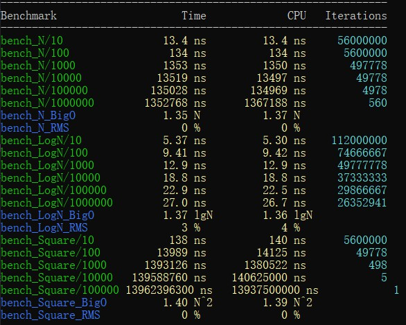

## c++性能測試工具：google benchmark入門

出處：https://www.cnblogs.com/apocelipes/p/11067594.html

```sh
sudo apt install g++ cmake
```

```sh
git clone https://github.com/google/benchmark.git
git clone https://github.com/google/googletest.git benchmark/googletest
mkdir build && cd build
cmake -DCMAKE_BUILD_TYPE=RELEASE ../benchmark
make -j4
sudo make install
```

- benchmark_example.cpp

```cpp
#include <benchmark/benchmark.h>
#include <array>

constexpr int len = 6;

// constexpr function具有inline屬性，你應該把它放在標頭檔中
constexpr auto my_pow(const int i)
{
    return i * i;
}

// 使用operator[]讀取元素，依次存入1-6的平方
static void bench_array_operator(benchmark::State& state)
{
    std::array<int, len> arr;
    constexpr int i = 1;

    for (auto _ : state) {
        arr[0] = my_pow(i);
        arr[1] = my_pow(i + 1);
        arr[2] = my_pow(i + 2);
        arr[3] = my_pow(i + 3);
        arr[4] = my_pow(i + 4);
        arr[5] = my_pow(i + 5);
    }
}
BENCHMARK(bench_array_operator);

// 使用at()讀取元素，依次存入1-6的平方
static void bench_array_at(benchmark::State& state)
{
    std::array<int, len> arr;
    constexpr int i = 1;

    for (auto _ : state) {
        arr.at(0) = my_pow(i);
        arr.at(1) = my_pow(i + 1);
        arr.at(2) = my_pow(i + 2);
        arr.at(3) = my_pow(i + 3);
        arr.at(4) = my_pow(i + 4);
        arr.at(5) = my_pow(i + 5);
    }
}
BENCHMARK(bench_array_at);

// std::get<>(array)是一個constexpr function，它會返回容器內元素的引用，並在編譯期檢查陣列的索引是否正確
static void bench_array_get(benchmark::State& state)
{
    std::array<int, len> arr;
    constexpr int i = 1;

    for (auto _ : state) {
        std::get<0>(arr) = my_pow(i);
        std::get<1>(arr) = my_pow(i + 1);
        std::get<2>(arr) = my_pow(i + 2);
        std::get<3>(arr) = my_pow(i + 3);
        std::get<4>(arr) = my_pow(i + 4);
        std::get<5>(arr) = my_pow(i + 5);
    }
}
BENCHMARK(bench_array_get);

BENCHMARK_MAIN();
```

我們可以看到每一個benchmark測試用例都是一個類型為`std::function<void(benchmark::State&)>`的函數，其中`benchmark::State&`負責測試的運行及額外參數的傳遞。

隨後我們使用`for (auto _: state) {}`來運行需要測試的內容，state會選擇合適的次數來運行循環，時間的計算從循環內的語句開始，所以我們可以選擇像例子中一樣在for循環之外初始化測試環境，然後在循環體內編寫需要測試的程式碼。

測試用例編寫完成後我們需要使用`BENCHMARK(<function_name>);`將我們的測試用例註冊進benchmark，這樣程式執行時才會執行我們的測試。

最後是用`BENCHMARK_MAIN();`替代直接編寫的main函數，它會處理命令列參數並運行所有註冊過的測試用例生成測試結果。

示例中大量使用了constexpt，這是為了能在編譯期計算出需要的數值避免對測試產生太多噪音。

```sh
g++ -Wall -std=c++14 benchmark_example.cpp -pthread -lbenchmark
```

benchmark需要連結`libbenchmark.so`，所以需要指定`-lbenchmark`，此外還需要thread的支援，因為libstdc++不提供thread的底層實現，我們需要pthread。另外不建議使用`-lpthread`，官方表示會出現相容問題，在我這測試也會出現連結錯誤。注意檔案名稱一定要在-lbenchmark前面，否則編譯會失敗

測試結果與預期基本相符，`std::get`最快，`at()`最慢。

## 向測試用例傳遞參數

之前我們的測試用例都只接受一個`benchmark::State&`類型的參數，如果我們需要給測試用例傳遞額外的參數呢？

舉個例子，假如我們需要實現一個佇列，現在有ring buffer和linked list兩種實現可選，現在我們要測試兩種方案在不同情況下的性能表現：

```cpp
// 必要的資料結構
#include "ring.h"
#include "linked_ring.h"
 
// ring buffer的測試
static void bench_array_ring_insert_int_10(benchmark::State& state)
{
    auto ring = ArrayRing<int>(10);
    for (auto _: state) {
        for (int i = 1; i <= 10; ++i) {
            ring.insert(i);
        }
        state.PauseTiming(); // 暫停計時
        ring.clear();
        state.ResumeTiming(); // 恢復計時
    }
}
BENCHMARK(bench_array_ring_insert_int_10);
 
// linked list的測試
static void bench_linked_queue_insert_int_10(benchmark::State &state)
{
    auto ring = LinkedRing<int>{};
    for (auto _:state) {
        for (int i = 0; i < 10; ++i) {
            ring.insert(i);
        }
        state.PauseTiming();
        ring.clear();
        state.ResumeTiming();
    }
}
BENCHMARK(bench_linked_queue_insert_int_10);
 
// 還有針對刪除的測試，以及針對string的測試，都是高度重複的程式碼，這裡不再羅列
```

很顯然，上面的測試除了被測試類型和插入的資料量之外沒有任何區別，如果可以通過傳入參數進行控制的話就可以少寫大量重複的程式碼。

編寫重複的程式碼是浪費時間，而且往往意味著你在做一件蠢事，google的工程師們當然早就注意到了這一點。雖然測試用例只能接受一個`benchmark::State&`類型的參數，但我們可以將參數傳遞給state對象，然後在測試用例中獲取：

```cpp
static void bench_array_ring_insert_int(benchmark::State& state)
{
    auto length = state.range(0);
    auto ring = ArrayRing<int>(length);
    for (auto _: state) {
        for (int i = 1; i <= length; ++i) {
            ring.insert(i);
        }
        state.PauseTiming();
        ring.clear();
        state.ResumeTiming();
    }
}
BENCHMARK(bench_array_ring_insert_int)->Arg(10);
```

上面的例子展示瞭如何傳遞和獲取參數：

1. 傳遞參數使用`BENCHMARK`宏生成的對象的`Arg`方法
2. 傳遞進來的參數會被放入state對象內部儲存，通過`range`方法獲取，呼叫時的參數0是傳入參數的需要，對應第一個參數

`Arg`方法一次只能傳遞一個參數，那如果一次想要傳遞多個參數呢？也很簡單：

```cpp
static void bench_array_ring_insert_int(benchmark::State& state)
{
    auto ring = ArrayRing<int>(state.range(0));
    for (auto _: state) {
        for (int i = 1; i <= state.range(1); ++i) {
            ring.insert(i);
        }
        state.PauseTiming();
        ring.clear();
        state.ResumeTiming();
    }
}
BENCHMARK(bench_array_ring_insert_int)->Args({10, 10});
```

上面的例子沒什麼實際意義，只是為了展示如何傳遞多個參數，`Args`方法接受一個vector對象，所以我們可以使用c++11提供的大括號初始化器簡化程式碼，獲取參數依然通過`state.range`方法，1對應傳遞進來的第二個參數。

有一點值得注意，參數傳遞只能接受整數，如果你希望使用其他類型的附加參數，就需要另外想些辦法了。

## 簡化多個類似測試用例的生成

測試用例傳遞參數的最終目的是為了在不編寫重複程式碼的情況下生成多個測試用例，在知道了如何傳遞參數後你可能會這麼寫：

```cpp
static void bench_array_ring_insert_int(benchmark::State& state)
{
    auto length = state.range(0);
    auto ring = ArrayRing<int>(length);
    for (auto _: state) {
        for (int i = 1; i <= length; ++i) {
            ring.insert(i);
        }
        state.PauseTiming();
        ring.clear();
        state.ResumeTiming();
    }
}
// 下面我們生成測試插入10，100，1000次的測試用例
BENCHMARK(bench_array_ring_insert_int)->Arg(10);
BENCHMARK(bench_array_ring_insert_int)->Arg(100);
BENCHMARK(bench_array_ring_insert_int)->Arg(1000);
```

這裡我們生成了三個實例，會產生下面的結果：

看起來工作良好，是嗎？

沒錯，結果是正確的，但是記得我們前面說過的嗎——*不要編寫重複的程式碼*！是的，上面我們手動編寫了用例的生成，出現了可以避免的重複。

幸好`Arg`和`Args`會將我們的測試用例使用的參數進行註冊以便產生`用例名/參數`的新測試用例，並且返回一個指向`BENCHMARK`宏生成對象的指針，換句話說，如果我們想要生成僅僅是參數不同的多個測試的話，只需要鏈式呼叫`Arg`和`Args`即可：

```c++
BENCHMARK(bench_array_ring_insert_int)->Arg(10)->Arg(100)->Arg(1000);
```

結果和上面一樣。

但這還不是最優解，我們仍然重複呼叫了Arg方法，如果我們需要更多用例時就不得不又要做重複勞動了。

對此google benchmark也有解決辦法：我們可以使用`Range`方法來自動生成一定範圍內的參數。

先看看Range的原型：

```c++
BENCHMAEK(func)->Range(int64_t start, int64_t limit);
```

start表示參數範圍起始的值，limit表示範圍結束的值，Range所作用於的是一個_閉區間_。

但是如果我們這樣改寫程式碼，是會得到一個錯誤的測試結果：

```c++
BENCHMARK(bench_array_ring_insert_int)->Range(10, 1000);
```


為什麼會這樣呢？那是因為Range默認除了start和limit，中間的其餘參數都會是某一個基底（base）的冪，基地默認為8，所以我們會看到64和512，它們分別是8的平方和立方。

想要改變這一行為也很簡單，只要重新設定基底即可，通過使用`RangeMultiplier`方法：

```c++
BENCHMARK(bench_array_ring_insert_int)->RangeMultiplier(10)->Range(10, 1000);
```

現在結果恢復如初了。

使用Ranges可以處理多個參數的情況：

```c++
BENCHMARK(func)->RangeMultiplier(10)->Ranges({{10, 1000}, {128， 256}});
```

第一個範圍指定了測試用例的第一個傳入參數的範圍，而第二個範圍指定了第二個傳入參數可能的值（注意這裡不是範圍了）。

與下面的程式碼等價：

```c++
BENCHMARK(func)->Args({10, 128})
               ->Args({100, 128})
               ->Args({1000, 128})
               ->Args({10, 256})
               ->Args({100, 256})
               ->Args({1000, 256})
```

實際上就是用生成的第一個參數的範圍於後面指定內容的參數做了一個笛卡爾積。

## 使用參數生成器

如果我想定製沒有規律的更複雜的參數呢？這時就需要實現自訂的參數生成器了。

一個參數生成器的簽名如下：

```c++
void CustomArguments(benchmark::internal::Benchmark* b);
```

我們在生成器中計算處參數，然後呼叫`benchmark::internal::Benchmark`對象的Arg或Args方法像上兩節那樣傳入參數即可。

隨後我們使用`Apply`方法把生成器應用到測試用例上：

```c++
BENCHMARK(func)->Apply(CustomArguments);
```

其實這一過程的原理並不複雜，我做個簡單的解釋：

1. `BENCHMARK`宏產生的就是一個`benchmark::internal::Benchmark`對象然後返回了它的指針
2. 向`benchmark::internal::Benchmark`對象傳遞參數需要使用Arg和Args等方法
3. `Apply`方法會將參數中的函數應用在自身
4. 我們在生成器裡使用`benchmark::internal::Benchmark`對象的指針b的Args等方法傳遞參數，這時的b其實指向我們的測試用例

到此為止生成器是如何工作的已經一目瞭然了，當然從上面得出的結論，我們還可以讓Apply做更多的事情。

下面看下Apply的具體使用：

```c++
// 這次我們生成100，200，...，1000的測試用例，用range是無法生成這些參數的
static void custom_args(benchmark::internal::Benchmark* b)
{
    for (int i = 100; i <= 1000; i += 100) {
        b->Arg(i);
    }
}
 
BENCHMARK(bench_array_ring_insert_int)->RangeMultiplier(10)->Apply(custom_args);
```

自訂參數的測試結果：


至此向測試用例傳遞參數的方法就全部介紹完了。

## 測量時間複雜度

google benchmark已經為我們提供了類似的功能，而且使用相當簡單。

具體的解釋在後面，我們先來看幾個例子，我們人為製造幾個時間複雜度分別為`O(n)`, `O(logn)`, `O(n^n)`的測試用例：

```cpp
#include <benchmark/benchmark.h>

// 這裡都是為了演示而寫成的程式碼，沒有什麼實際意義
static void bench_N(benchmark::State& state)
{
    int n = 0;

    for ([[maybe_unused]] auto _ : state) {
        for (int i = 0; i < state.range(0); ++i) {
            benchmark::DoNotOptimize(n +=
                                         2); // 這個函數防止編譯器將表示式最佳化，會略微降低一些性能
        }
    }

    state.SetComplexityN(state.range(0));
}
BENCHMARK(bench_N)->RangeMultiplier(10)->Range(10, 1000000)->Complexity();

static void bench_LogN(benchmark::State& state)
{
    int n = 0;

    for ([[maybe_unused]] auto _ : state) {
        for (int i = 1; i < state.range(0); i *= 2) {
            benchmark::DoNotOptimize(n += 2);
        }
    }

    state.SetComplexityN(state.range(0));
}
BENCHMARK(bench_LogN)->RangeMultiplier(10)->Range(10, 1000000)->Complexity();

static void bench_Square(benchmark::State& state)
{
    int n = 0;
    auto len = state.range(0);

    for ([[maybe_unused]] auto _ : state) {
        for (int64_t i = 1; i < len * len; ++i) {
            benchmark::DoNotOptimize(n += 2);
        }
    }

    state.SetComplexityN(len);
}
BENCHMARK(bench_Square)->RangeMultiplier(10)->Range(10, 100000)->Complexity();

BENCHMARK_MAIN();
```

如何傳遞參數和生成批次測試我們在上一篇已經介紹過了，這裡不再重複。

需要關注的是新出現的`state.SetComplexityN`和`Complexity`。

首先是`state.SetComplexityN`，參數是一個64位整數，用來表示演算法總體需要處理的資料總量。benchmark會根據這個數值，再加上運行耗時以及`state`的迭代次數計算出一個用於後面預估平均時間複雜度的值。

`Complexity`會根據同一組的多個測試用例計算出一個較接近的平均時間複雜度和一個均方根值，需要和`state.SetComplexityN`配合使用。

`Complexity`還有一個參數，可以接受一個函數或是`benchmark::BigO`列舉，它的作用是提示benchmark該測試用例的時間複雜度，預設值為`benchmark::oAuto`，測試中會自動幫我們計算出時間複雜度。對於較為複雜的演算法，而我們又有預期的時間按複雜度，這時我們就可以將其傳給這個方法，比如對於第二個測試用例，我們還可以這樣寫：

```cpp
static void bench_LogN(benchmark::State& state)
{
    // 中間部分與前面一樣，略過
}
BENCHMARK(bench_LogN)->RangeMultiplier(10)->Range(10, 1000000)->Complexity(benchmark::oLogN);
```

在選擇正確的提示後對測試結果幾乎沒有影響，除了偏差值可以降得更低，使結果更準確。

`Complexity`在計算時間複雜度時會保留複雜度的係數，因此，如果我們發現給出的提示的時間複雜度前的係數過大的話，就意味著我們的預估發生了較大的偏差，同時它還會計算出RMS值，同樣反應了時間複雜度的偏差情況。

運行我們的測試：



可以看到，自動的時間複雜度計算基本是精準的，可以在我們對演算法進行測試時提供一個有效的參考。
