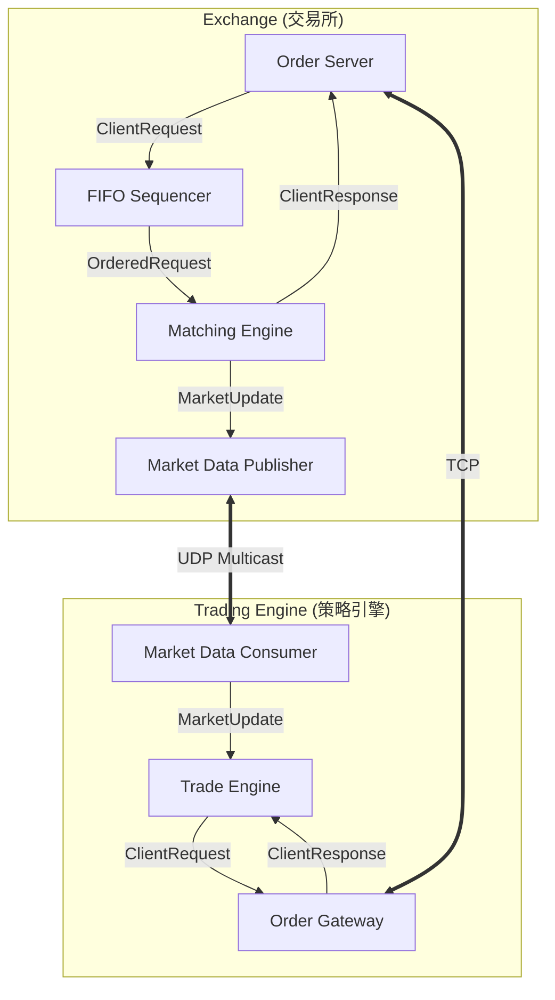

# 《Building Low Latency Applications with C++》專案總覽

本專案是一個完整的低延遲交易系統（High-Frequency Trading System）實作，涵蓋了從底層硬體優化、無鎖資料結構、網路協定到交易策略與風控系統的全方位技術。

---

## 1. 全書架構圖 (System Architecture)

系統由多個獨立執行的組件組成，透過 **Lock-Free Queues (無鎖佇列)** 進行低延遲通訊。



---

## 2. 核心組件說明

| 組件名稱 | 職責 | 關鍵技術 |
| :--- | :--- | :--- |
| **Matching Engine** | 核心撮合邏輯 | 價格-時間優先 (FIFO)、O(1) 訂單簿操作 |
| **Market Data Publisher** | 行情發布 | UDP Multicast、增量更新 (Incremental Updates) |
| **Order Server** | 訂單接收與回應 | TCP 非阻塞 I/O、序列號驗證 (Sequence Check) |
| **FIFO Sequencer** | 確保公平性 | 依接收時間戳排序請求，保證先到先處理 |
| **Trade Engine** | 策略執行主控 | 事件驅動架構、Lambda 回調、特徵工程 |
| **Risk Manager** | 事前風控 | 單筆數量、總倉位、最大虧損檢查 (P70-P80) |

---

## 3. 低延遲 C++ 核心原則 (Checklist)

本專案實踐了以下關鍵優化原則，開發者可作為 Check-list 參考：

### 記憶體管理
- [x] **預先配置 (Pre-allocation)**：系統啟動時配置所有記憶體，避免執行時 `malloc`。
- [x] **記憶體池 (Memory Pool)**：針對固定大小物件（如 Order, MarketUpdate）使用池化管理。
- [x] **快取對齊 (Cache Line Alignment)**：避免偽共享（False Sharing），確保熱點資料位於同一快取行。

### 並發與同步
- [x] **無鎖設計 (Lock-Free)**：使用 SPSC 無鎖佇列取代 Mutex。
- [x] **單執行緒核心 (Single-threaded Core)**：撮合引擎與策略邏輯採用單執行緒，消除鎖競爭。
- [x] **CPU 親和性 (CPU Affinity)**：將關鍵執行緒綁定到特定實體核心。

### 編譯器優化
- [x] **分支預測 (Branch Prediction)**：廣泛使用 `LIKELY` / `UNLIKELY`。
- [x] **內聯 (Inlining)**：減少函式呼叫開銷。
- [x] **CRTP / 模板**：使用靜態多型取代虛擬函式（vtable）。

### 網路與 I/O
- [x] **非阻塞 I/O (Non-blocking I/O)**：使用 Epoll 進行非同步收發。
- [x] **禁用 Nagle 演算法**：設定 `TCP_NODELAY` 以降低小封包延遲。
- [x] **UDP 組播 (Multicast)**：用於行情發布，減少伺服器負擔與複製延遲。

---

## 4. 學習路徑建議

1.  **基礎篇 (Chapter 3-4)**：理解編譯器如何優化代碼，並掌握 `LFQueue` 與 `MemPool` 的實作。
2.  **核心篇 (Chapter 6-8)**：學習如何實作高效的訂單簿（OrderBook）與連線閘道（Gateway）。
3.  **策略篇 (Chapter 9-10)**：理解風控與策略引擎的結合，以及如何計算市場特徵。
4.  **進階優化篇 (Chapter 11-12)**：掌握 RDTSC 量測與基準測試，驗證優化成果。

---

## 5. 技術選型決策樹 (Decision Tree)

*   **資料結構選型**：
    *   需要按價格排序？ → **雙向連結串列 + 陣列索引** (OrderBook)
    *   需要快速查找？ → **固定大小陣列** (ClientId/TickerId 映射)
    *   需要執行緒通訊？ → **SPSC Lock-Free Queue**
*   **通訊協定選型**：
    *   訂單 (可靠性高) → **TCP**
    *   行情 (延遲敏感、一對多) → **UDP Multicast**
*   **計時器選型**：
    *   一般紀錄 → **getCurrentNanos()** (std::chrono)
    *   精密效能量測 → **rdtsc()** (CPU Cycles)

---

## 6. 專案編譯與執行指南

每個章節均包含 `scripts/build.sh` 與 `CMakeLists.txt`。

```bash
# 進入特定章節
cd Chapter10/scripts

# 執行建置
./build.sh

# 執行交易所與客戶端 (需在兩個終端機執行)
./run_exchange_and_clients.sh
```

---

## 結語

本專案旨在展示 **「極致效能」** 的工程實踐。低延遲系統不僅僅是寫出快速的代碼，更是一場關於資源管理、硬體理解與精確量測的藝術。

希望這份解析文件能幫助你掌握低延遲 C++ 開發的核心技能！
