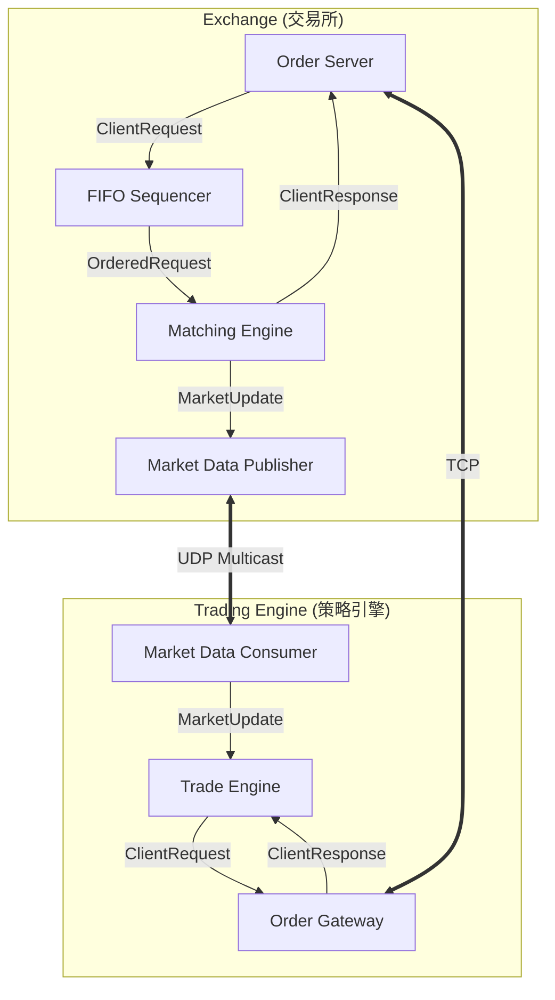
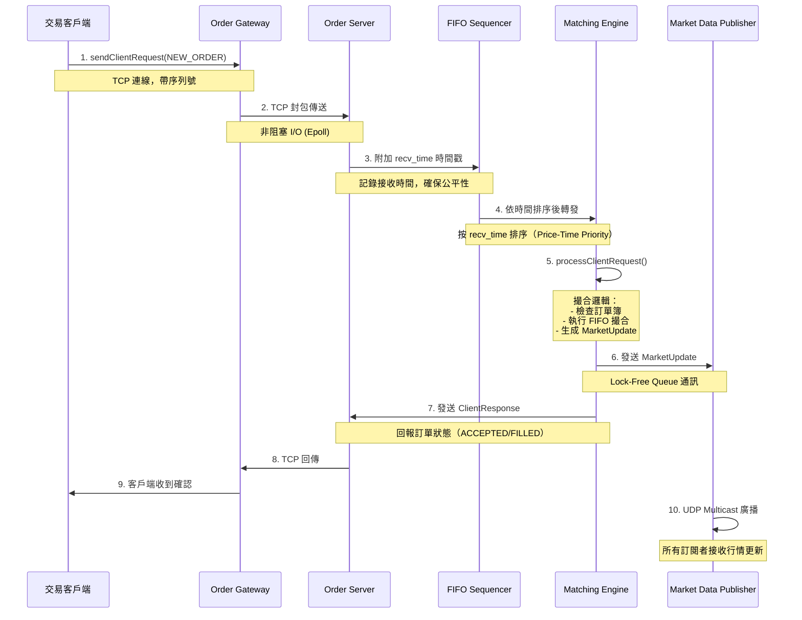
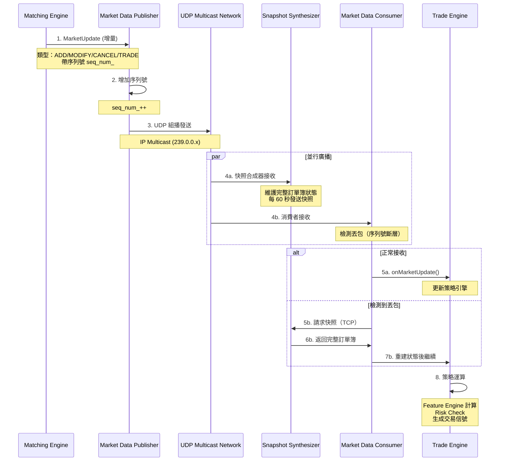

# 《Building Low Latency Applications with C++》專案總覽

本專案是一個完整的低延遲交易系統（High-Frequency Trading System）實作，涵蓋了從底層硬體優化、無鎖資料結構、網路協定到交易策略與風控系統的全方位技術。

---

## 1. 全書架構圖 (System Architecture)

系統由多個獨立執行的組件組成，透過 **Lock-Free Queues (無鎖佇列)** 進行低延遲通訊。



---

## 2. 核心組件說明

| 組件名稱 | 職責 | 關鍵技術 |
| :--- | :--- | :--- |
| **Matching Engine** | 核心撮合邏輯 | 價格-時間優先 (FIFO)、O(1) 訂單簿操作 |
| **Market Data Publisher** | 行情發布 | UDP Multicast、增量更新 (Incremental Updates) |
| **Order Server** | 訂單接收與回應 | TCP 非阻塞 I/O、序列號驗證 (Sequence Check) |
| **FIFO Sequencer** | 確保公平性 | 依接收時間戳排序請求，保證先到先處理 |
| **Trade Engine** | 策略執行主控 | 事件驅動架構、Lambda 回調、特徵工程 |
| **Risk Manager** | 事前風控 | 單筆數量、總倉位、最大虧損檢查 (P70-P80) |

---

## 3. 詳細資料流向圖

### 3.1 Order Flow（訂單流）

從客戶端發送訂單到撮合完成的完整流程：



**關鍵時間點**：
1. **T1 (Order Gateway → Order Server)**：TCP 單向延遲 ~50-100μs（同機房）
2. **T2 (FIFO Sequencer 排序)**：O(N log N)，N 為待處理請求數量，通常 <10μs
3. **T3 (Matching Engine 撮合)**：O(1) 訂單簿操作，<5μs
4. **T4 (Market Data 發布)**：UDP Multicast，單向延遲 ~30-80μs

**總延遲**：端到端約 **100-200μs**（理想情況，同機房）

---

### 3.2 Market Data Flow（行情流）

從撮合引擎生成行情更新到客戶端接收的流程：



**行情類型說明**：

| 更新類型 | 說明 | 觸發時機 |
|:---|:---|:---|
| **ADD** | 新增訂單至訂單簿 | 訂單未立即成交時 |
| **MODIFY** | 修改訂單價格/數量 | 客戶端修改訂單（較少使用） |
| **CANCEL** | 取消訂單 | 客戶端主動取消或風控拒絕 |
| **TRADE** | 成交事件 | 買賣訂單撮合成功 |
| **SNAPSHOT** | 完整訂單簿快照 | 定時發送（60 秒）或應對丟包 |

**丟包恢復機制**：
1. **檢測**：消費者發現 `seq_num` 不連續（如收到 105 但上一個是 102）
2. **快照請求**：透過 TCP 向 Snapshot Synthesizer 請求完整狀態
3. **重建**：使用快照重建訂單簿，丟棄中間丟失的增量更新
4. **繼續**：從快照後的序列號繼續接收增量更新

---

## 4. 各章節學習重點

### Chapter 3: 編譯器優化（Compiler Optimizations）

**學習目標**：理解編譯器如何優化程式碼，以及如何「協助」編譯器產生更快的機器碼。

**核心技術**：
- **Branch Prediction（分支預測）**：`LIKELY`/`UNLIKELY` 宏的使用
- **Loop Unrolling（迴圈展開）**：減少迴圈控制開銷
- **RVO/NRVO（返回值優化）**：避免不必要的複製
- **CRTP（奇異遞迴模板模式）**：靜態多型取代虛擬函式
- **Strict Aliasing（嚴格別名）**：編譯器假設不同型別指標不會指向同一記憶體

**關鍵檔案**：
- `branch.cpp` - 分支預測範例
- `loop_unroll.cpp` - 迴圈展開
- `crtp.cpp` - CRTP 模式

**學習重點**：
- 閱讀組合語言輸出（`g++ -S`）來驗證優化效果
- 理解 CPU 流水線（Pipeline）與分支預測失敗的代價
- 學會使用 `__builtin_expect` 提示編譯器

---

### Chapter 4: 低延遲基礎元件（Low-Latency Building Blocks）

**學習目標**：實作高效能的基礎資料結構與工具類別，作為整個系統的基石。

**核心技術**：
- **Lock-Free Queue（無鎖佇列）**：SPSC 模式、Memory Ordering、ABA Problem
- **Memory Pool（記憶體池）**：零碎片化設計、Placement New、O(1) 分配
- **Logger（日誌系統）**：變參模板、Tagged Union、批次 Flush
- **Thread Utilities（執行緒工具）**：CPU Affinity、NUMA 感知
- **Socket Utilities（網路工具）**：非阻塞 I/O、Epoll、TCP_NODELAY

**關鍵檔案**：
- `lf_queue.h` - 無鎖佇列實作
- `mem_pool.h` - 記憶體池
- `tcp_server.h/cpp` - TCP 伺服器（Epoll Reactor 模式）
- `mcast_socket.h/cpp` - UDP 組播

**學習重點**：
- 理解 `std::memory_order_acquire/release` 的語義
- 學會使用 Memory Pool 避免堆積碎片化
- 掌握 Epoll 的 Edge-Triggered 與 Level-Triggered 模式差異
- 理解 UDP Multicast 的 IGMP 協議

**效能對比**：
- Lock-Free Queue vs `std::queue` + `std::mutex`：**10-50x** 加速
- Memory Pool vs `malloc/new`：**5-20x** 加速
- Custom Logger vs `printf/std::cout`：**20-100x** 加速

---

### Chapter 6: 撮合引擎核心（Matching Engine Core）

**學習目標**：實作符合 Price-Time Priority 規則的撮合引擎。

**核心技術**：
- **三層索引架構**：ClientOrderId → MEOrder → MEOrdersAtPrice → Price Level
- **環狀雙向鏈結串列**：高效插入/刪除訂單
- **FIFO 撮合演算法**：同價位先到先成交
- **訂單生命週期狀態機**：INVALID → PENDING_NEW → LIVE → DEAD

**關鍵檔案**：
- `me_order.h` - 訂單與價位資料結構
- `me_order_book.h` - 訂單簿（Buy/Sell 雙邊）
- `matching_engine.h` - 撮合引擎主控邏輯

**學習重點**：
- 理解為什麼需要三層索引（快速查找、快速撮合、快速取消）
- 掌握環狀鏈結串列的邊界處理（空串列、單一元素）
- 學會設計 O(1) 的訂單簿操作

**時間複雜度**：
- `addOrder()`：O(1) ~ O(N)（N 為同價位訂單數，通常很小）
- `cancelOrder()`：O(1)
- `match()`：O(M)（M 為撮合的訂單數）

---

### Chapter 7: 行情發布系統（Market Data Publishing）

**學習目標**：設計高效的行情發布系統，支援增量更新與快照恢復。

**核心技術**：
- **UDP Multicast（組播）**：一對多低延遲廣播
- **Incremental Updates（增量更新）**：只傳送變化的部分
- **Snapshot Synthesizer（快照合成器）**：維護完整狀態副本
- **Sequence Number（序列號）**：丟包檢測與排序

**關鍵檔案**：
- `market_update.h` - 行情更新訊息格式
- `market_data_publisher.h` - UDP 發布者
- `snapshot_synthesizer.h` - 快照合成器

**學習重點**：
- 理解 UDP 的不可靠性與如何應對丟包
- 掌握序列號的作用（檢測丟包、保證順序）
- 學會設計快照與增量更新的混合策略

**設計權衡**：
- **UDP vs TCP**：延遲 vs 可靠性
- **增量 vs 快照**：頻寬 vs 恢復速度
- **快照頻率**：60 秒（平衡頻寬與恢復時間）

---

### Chapter 8: 訂單閘道（Order Gateway）

**學習目標**：實作客戶端與交易所之間的可靠連線。

**核心技術**：
- **TCP 可靠傳輸**：序列號驗證、粘包處理
- **FIFO Sequencer（公平性排序）**：按接收時間戳排序
- **斷線重連機制**：自動重連與狀態恢復
- **雙向序列號檢測**：防止丟包與重複

**關鍵檔案**：
- `order_server.h` - 訂單伺服器
- `fifo_sequencer.h` - 公平性排序器
- `order_gateway.h` - 客戶端閘道

**學習重點**：
- 理解 TCP 粘包問題與解決方案（固定長度 header）
- 掌握 FIFO Sequencer 的排序邏輯（O(N log N)）
- 學會設計斷線重連與狀態同步機制

---

### Chapter 9: 風險控制系統（Risk Management）

**學習目標**：實作 Pre-trade Risk 檢查，防止異常交易。

**核心技術**：
- **Pre-trade Risk Checks**：訂單發送前的檢查
- **Position Tracking（倉位追蹤）**：實時維護多空倉位
- **PnL Calculation（盈虧計算）**：已實現 + 未實現盈虧
- **Order Manager（訂單管理器）**：訂單狀態機

**關鍵檔案**：
- `risk_manager.h` - 風控邏輯
- `position_keeper.h` - 倉位管理
- `order_manager.h` - 訂單狀態追蹤

**學習重點**：
- 理解三種風控檢查（單筆過大、倉位過大、虧損過大）
- 掌握 VWAP（成交均價）的計算方法
- 學會處理倉位翻轉（多翻空、空翻多）

**風控規則**：
- `ORDER_TOO_LARGE`：單筆訂單數量 > 配置上限
- `POSITION_TOO_LARGE`：總倉位（多空合計）> 配置上限
- `LOSS_TOO_LARGE`：未實現虧損 > 配置上限

---

### Chapter 10: 交易策略引擎（Trading Strategy）

**學習目標**：實作做市商（Market Maker）與流動性獲取（Liquidity Taker）策略。

**核心技術**：
- **Feature Engine（特徵引擎）**：計算市場特徵（VWAP、激進成交比率）
- **Market Maker 策略**：動態定價、雙邊掛單
- **Liquidity Taker 策略**：趨勢跟隨、市價成交
- **Event-Driven Architecture（事件驅動）**：Lambda 回調機制

**關鍵檔案**：
- `feature_engine.h` - 特徵計算
- `market_maker.h` - 做市商策略
- `liquidity_taker.h` - 流動性獲取策略
- `trade_engine.h` - 策略引擎主控

**學習重點**：
- 理解做市商的定價邏輯（中間價 + spread）
- 掌握特徵工程在量化交易中的作用
- 學會設計 Lambda 回調的事件驅動架構

**策略參數**：
- **Market Maker**：`clip_`（每次掛單數量）、`threshold_`（最小價差）
- **Liquidity Taker**：`clip_`、`threshold_`（趨勢閾值）

---

### Chapter 11: 效能量測與優化（Performance Instrumentation）

**學習目標**：使用硬體計時器進行精確的效能量測。

**核心技術**：
- **RDTSC 指令**：直接讀取 CPU 時間戳計數器
- **Performance Macros**：START_MEASURE、END_MEASURE、TTT_MEASURE
- **Hot Path 識別**：找出系統瓶頸
- **Observer Effect（觀察者效應）**：最小化量測開銷

**關鍵檔案**：
- `perf_utils.h` - 效能量測工具
- `thread_utils.h` - CPU Affinity
- 修改後的 `trade_engine.cpp` - 嵌入量測點

**學習重點**：
- 理解 RDTSC 的原理與限制（CPU 調頻、跨核心同步）
- 掌握量測宏的使用方法
- 學會識別系統瓶頸（PositionKeeper、FeatureEngine）

**量測開銷**：
- `std::chrono`：~30-50 納秒
- `rdtsc()`：~10-15 納秒

---

### Chapter 12: 基準測試與終極優化（Benchmarking）

**學習目標**：驗證自定義元件的效能優勢，並進行最終優化。

**核心技術**：
- **Benchmarking Methodology**：正確的基準測試方法
- **Release Optimization**：-O3、內聯、移除斷言
- **Latency Distribution（延遲分佈）**：P50、P90、P99 分析
- **Jitter Analysis（抖動分析）**：長尾延遲的來源

**關鍵檔案**：
- `opt_logging.h` - 優化版 Logger
- `opt_mem_pool.h` - 優化版 MemPool
- `unordered_map_me_order_book.h` - std::unordered_map 對比版本
- `release_benchmark.cpp` - 基準測試程式

**學習重點**：
- 理解如何設計公平的基準測試
- 掌握延遲分佈分析（P99 比 P50 更重要）
- 學會使用編譯器優化選項（-O3、LTO）

**效能對比結果**：
- **MemPool**：20-30 週期 vs malloc 100-500 週期
- **Logger**：批次處理 vs 逐字元（10x 加速）
- **OrderBook**：自定義 150-300 週期 vs unordered_map 500-1500 週期

---

## 5. 低延遲 C++ 核心原則 (Checklist)

本專案實踐了以下關鍵優化原則，開發者可作為 Check-list 參考：

### 記憶體管理
- [x] **預先配置 (Pre-allocation)**：系統啟動時配置所有記憶體，避免執行時 `malloc`。
- [x] **記憶體池 (Memory Pool)**：針對固定大小物件（如 Order, MarketUpdate）使用池化管理。
- [x] **快取對齊 (Cache Line Alignment)**：避免偽共享（False Sharing），確保熱點資料位於同一快取行。

### 並發與同步
- [x] **無鎖設計 (Lock-Free)**：使用 SPSC 無鎖佇列取代 Mutex。
- [x] **單執行緒核心 (Single-threaded Core)**：撮合引擎與策略邏輯採用單執行緒，消除鎖競爭。
- [x] **CPU 親和性 (CPU Affinity)**：將關鍵執行緒綁定到特定實體核心。

### 編譯器優化
- [x] **分支預測 (Branch Prediction)**：廣泛使用 `LIKELY` / `UNLIKELY`。
- [x] **內聯 (Inlining)**：減少函式呼叫開銷。
- [x] **CRTP / 模板**：使用靜態多型取代虛擬函式（vtable）。

### 網路與 I/O
- [x] **非阻塞 I/O (Non-blocking I/O)**：使用 Epoll 進行非同步收發。
- [x] **禁用 Nagle 演算法**：設定 `TCP_NODELAY` 以降低小封包延遲。
- [x] **UDP 組播 (Multicast)**：用於行情發布，減少伺服器負擔與複製延遲。

---

## 4. 學習路徑建議

1.  **基礎篇 (Chapter 3-4)**：理解編譯器如何優化代碼，並掌握 `LFQueue` 與 `MemPool` 的實作。
2.  **核心篇 (Chapter 6-8)**：學習如何實作高效的訂單簿（OrderBook）與連線閘道（Gateway）。
3.  **策略篇 (Chapter 9-10)**：理解風控與策略引擎的結合，以及如何計算市場特徵。
4.  **進階優化篇 (Chapter 11-12)**：掌握 RDTSC 量測與基準測試，驗證優化成果。

---

## 7. 技術名詞中英對照表

### 7.1 系統架構相關

| 中文 | 英文 | 說明 |
|:---|:---|:---|
| 撮合引擎 | Matching Engine | 執行訂單配對的核心元件 |
| 訂單簿 | Order Book | 維護所有未成交訂單的資料結構 |
| 訂單閘道 | Order Gateway | 客戶端與交易所之間的連線橋樑 |
| 行情發布器 | Market Data Publisher | 廣播市場行情的元件 |
| 快照合成器 | Snapshot Synthesizer | 維護完整訂單簿狀態並定期發送快照 |
| 公平性排序器 | FIFO Sequencer | 按接收時間排序請求，確保公平性 |
| 策略引擎 | Trade Engine | 執行交易策略的主控元件 |
| 風控管理器 | Risk Manager | 執行事前風險檢查 |
| 倉位管理器 | Position Keeper | 追蹤多空倉位與盈虧 |
| 訂單管理器 | Order Manager | 管理訂單狀態機 |
| 特徵引擎 | Feature Engine | 計算市場特徵（如 VWAP） |

### 7.2 資料結構與演算法

| 中文 | 英文 | 說明 |
|:---|:---|:---|
| 無鎖佇列 | Lock-Free Queue | 使用原子操作避免鎖競爭的佇列 |
| 記憶體池 | Memory Pool | 預先配置的記憶體管理器 |
| 環狀雙向鏈結串列 | Circular Doubly-Linked List | 訂單簿使用的資料結構 |
| 價格-時間優先 | Price-Time Priority | 撮合規則：價格優先，同價位時間優先 |
| FIFO 撮合 | FIFO Matching | 同價位訂單按先進先出順序撮合 |
| 三層索引 | Three-Level Index | OrderId → Order → Price Level 的索引架構 |
| 單生產者單消費者 | SPSC (Single Producer Single Consumer) | 無鎖佇列的使用模式 |

### 7.3 記憶體與並發

| 中文 | 英文 | 說明 |
|:---|:---|:---|
| 記憶體順序 | Memory Ordering | 控制多執行緒記憶體操作的順序 |
| 獲取-釋放語義 | Acquire-Release Semantics | 記憶體順序的一種模型 |
| 偽共享 | False Sharing | 多核心共享快取行導致的效能問題 |
| 快取行對齊 | Cache Line Alignment | 確保資料結構對齊到快取行邊界 |
| ABA 問題 | ABA Problem | 無鎖演算法中的經典問題 |
| CPU 親和性 | CPU Affinity | 將執行緒綁定到特定 CPU 核心 |
| NUMA | Non-Uniform Memory Access | 非統一記憶體存取架構 |
| 就地建構 | Placement New | 在預先分配的記憶體上構造物件 |

### 7.3 網路與通訊

| 中文 | 英文 | 說明 |
|:---|:---|:---|
| 非阻塞 I/O | Non-blocking I/O | 不會阻塞等待 I/O 完成的模式 |
| 邊緣觸發 | Edge-Triggered | Epoll 的一種模式，只在狀態變化時觸發 |
| 水平觸發 | Level-Triggered | Epoll 的一種模式，只要條件滿足就持續觸發 |
| UDP 組播 | UDP Multicast | 一對多的網路廣播模式 |
| Nagle 演算法 | Nagle's Algorithm | TCP 的小封包合併機制（需禁用） |
| TCP 粘包 | TCP Packet Coalescing | TCP 將多個小封包合併的現象 |
| 序列號 | Sequence Number | 用於檢測丟包與排序的編號 |
| 時間戳 | Timestamp | 記錄事件發生時間的標記 |

### 7.4 效能相關

| 中文 | 英文 | 說明 |
|:---|:---|:---|
| 熱路徑 | Hot Path | 系統中最頻繁執行的程式碼路徑 |
| 分支預測 | Branch Prediction | CPU 預測條件分支走向的機制 |
| 迴圈展開 | Loop Unrolling | 減少迴圈控制開銷的優化技巧 |
| 內聯 | Inlining | 將函式呼叫替換為函式本體 |
| 返回值優化 | RVO/NRVO | 編譯器避免不必要複製的優化 |
| 奇異遞迴模板模式 | CRTP | 靜態多型的實作方式 |
| 嚴格別名 | Strict Aliasing | 編譯器關於指標別名的假設 |
| 時間戳計數器 | TSC (Time Stamp Counter) | CPU 的硬體計時器 |
| RDTSC 指令 | Read Time-Stamp Counter | 讀取 TSC 的彙編指令 |

### 7.5 交易相關

| 中文 | 英文 | 說明 |
|:---|:---|:---|
| 做市商 | Market Maker | 提供買賣雙邊流動性的策略 |
| 流動性獲取者 | Liquidity Taker | 消耗訂單簿流動性的策略 |
| 價差 | Spread | 買一價與賣一價的差距 |
| 最佳買賣價 | BBO (Best Bid Offer) | 訂單簿中的最佳買價與賣價 |
| 成交均價 | VWAP (Volume Weighted Average Price) | 成交量加權平均價格 |
| 已實現盈虧 | Realized PnL | 已平倉部位的盈虧 |
| 未實現盈虧 | Unrealized PnL | 持倉部位的浮動盈虧 |
| 激進成交 | Aggressive Fill | 以市價主動成交（消耗流動性） |
| 被動成交 | Passive Fill | 掛單等待成交（提供流動性） |
| 事前風控 | Pre-trade Risk | 訂單發送前的風險檢查 |

### 7.6 量測與測試

| 中文 | 英文 | 說明 |
|:---|:---|:---|
| 基準測試 | Benchmarking | 系統效能的量化測試 |
| 延遲 | Latency | 從輸入到輸出的時間延遲 |
| 吞吐量 | Throughput | 單位時間內處理的請求數量 |
| 中位數 | P50/Median | 50% 的請求延遲低於此值 |
| 99 百分位 | P99 | 99% 的請求延遲低於此值 |
| 抖動 | Jitter | 延遲的變異性（P99 - P50） |
| 觀察者效應 | Observer Effect | 量測工具本身影響系統效能 |

---

## 8. 常見問題 FAQ

### Q1: 為什麼要自己實作記憶體池，而不用 std::allocator？

**A**: 標準庫的分配器（`std::allocator`）底層仍然呼叫 `malloc/new`，會產生以下問題：
1. **鎖競爭**：多執行緒環境下，堆積管理器需要加鎖
2. **不確定性**：分配時間取決於堆積狀態，可能產生長尾延遲
3. **碎片化**：頻繁分配/釋放會導致記憶體碎片

自定義 Memory Pool 的優勢：
- **O(1) 確定性延遲**：所有操作時間固定
- **無鎖設計**：使用 Free List，無需加鎖
- **零碎片化**：固定大小物件，無碎片問題
- **預先分配**：啟動時一次性分配，避免執行時開銷

**效能對比**：Memory Pool (20-30 週期) vs malloc (100-500 週期)

---

### Q2: Lock-Free Queue 的 Memory Ordering 為什麼很重要？

**A**: 無鎖佇列依賴原子操作來同步生產者與消費者，但現代 CPU 會**重排序**記憶體操作以提升效能。

**問題範例**（錯誤的 Memory Ordering）：
```cpp
// 生產者
store_[write_index_] = data;  // 1. 寫入資料
write_index_++;               // 2. 更新索引
```

CPU 可能將操作重排序為：
```cpp
write_index_++;               // 2 被提前
store_[write_index_] = data;  // 1 被延後
```

此時消費者讀取到 `write_index_` 更新，但 `store_[write_index_]` 還沒寫入，導致讀取到舊資料。

**正確做法**（使用 Memory Ordering）：
```cpp
store_[next_write_index_] = data;
write_index_.store(next_write_index_, std::memory_order_release);  // 確保之前的寫入先完成
```

消費者：
```cpp
auto write_idx = write_index_.load(std::memory_order_acquire);  // 確保讀取最新值
auto data = store_[read_index_];
```

**Acquire-Release 語義**：
- `release`：確保之前的所有寫入對其他執行緒可見
- `acquire`：確保讀取到 release 之前的所有寫入

---

### Q3: 為什麼要使用 UDP Multicast 而不是 TCP 發送行情？

**A**: **延遲與擴展性的權衡**

| 比較項目 | UDP Multicast | TCP (一對多) |
|:---|:---|:---|
| **延遲** | ~30-80μs（單向） | ~50-100μs × N（N 為客戶端數量） |
| **伺服器負擔** | O(1)（一次發送） | O(N)（逐個發送） |
| **可靠性** | 不保證送達 | 保證送達 |
| **順序性** | 不保證順序 | 保證順序 |
| **適用場景** | 行情廣播 | 訂單回報 |

**行情發布的特性**：
1. **延遲敏感**：行情更新需要極低延遲
2. **一對多**：可能有數百個訂閱者
3. **允許丟包**：下一個快照會覆蓋舊資料

**解決 UDP 不可靠性**：
- **序列號檢測丟包**：消費者發現序列號不連續時請求快照
- **定時快照**：每 60 秒發送完整訂單簿狀態
- **重要訊息用 TCP**：訂單回報仍使用 TCP

---

### Q4: 什麼時候需要使用 CPU Affinity？

**A**: **適用場景**

1. **低延遲系統**：撮合引擎、策略引擎等關鍵執行緒
2. **高吞吐量系統**：網路封包處理、資料流處理
3. **NUMA 架構**：確保執行緒與記憶體在同一節點

**優勢**：
- **避免 Context Switch**：減少執行緒遷移的開銷（~5-10μs）
- **Cache 熱度**：執行緒綁定後，L1/L2 Cache 命中率更高
- **可預測性**：消除核心遷移帶來的延遲抖動

**使用範例**：
```cpp
setThreadCore(matching_engine_thread, 0);  // 撮合引擎綁定核心 0
setThreadCore(market_data_thread, 1);      // 行情發布綁定核心 1
setThreadCore(strategy_thread, 2);         // 策略引擎綁定核心 2
```

**注意事項**：
- 綁定的核心應為**實體核心**，避免超執行緒（Hyper-Threading）
- 需配合作業系統的**核心隔離**（`isolcpus`）以避免其他程序干擾

---

### Q5: P99 延遲比 P50 延遲更重要嗎？

**A**: **是的，對低延遲系統而言，P99 更關鍵。**

**原因**：
1. **長尾延遲影響用戶體驗**：1% 的慢請求可能導致交易失敗或套利機會喪失
2. **級聯效應**：一個慢請求可能阻塞後續請求（如 TCP Head-of-Line Blocking）
3. **系統瓶頸指標**：P99 反映了系統在壓力下的表現

**範例**：
- **P50 = 50μs, P99 = 200μs**：99% 的請求 <200μs，但 1% 超過 200μs
- **P50 = 60μs, P99 = 80μs**：延遲更穩定，Jitter 更小

**優化目標**：
- **降低 P99**：比降低 P50 更有價值
- **降低 Jitter**：P99 - P50 的差距應盡可能小

**P99 延遲的常見來源**：
- **Cache Miss**：L3 Cache 未命中 → DRAM 存取 (~100ns)
- **分支預測失敗**：~10-20 個週期的 Pipeline Stall
- **作業系統中斷**：定時器中斷、網卡中斷 (~1-10μs)
- **記憶體分配**：`malloc` 在堆積碎片化時變慢

---

### Q6: 如何選擇適合的資料結構？

**A**: **根據操作頻率與時間複雜度選擇**

| 需求 | 推薦資料結構 | 時間複雜度 | 原因 |
|:---|:---|:---|:---|
| **按價格排序訂單** | 雙向鏈結串列 + 陣列索引 | O(1) ~ O(N) | 價格層級有限，陣列索引 O(1) |
| **快速查找訂單** | 固定大小陣列（OrderId → Order） | O(1) | OrderId 範圍已知，直接索引 |
| **執行緒間通訊** | SPSC Lock-Free Queue | O(1) | 無鎖，延遲穩定 |
| **倉位查詢** | 固定大小陣列（TickerId → Position） | O(1) | TickerId 數量有限 |
| **策略參數** | 固定大小陣列（TickerId → Config） | O(1) | 啟動時載入，執行時只讀 |

**避免使用**：
- `std::unordered_map`：Hash 碰撞與 Rehash 導致延遲不穩定
- `std::vector`（動態增長）：Reallocation 導致長尾延遲
- `std::mutex` + 任何容器：鎖競爭導致延遲飆升

---

### Q7: 如何除錯低延遲系統中的效能問題？

**A**: **系統化的量測與分析流程**

**步驟 1：嵌入量測點**
```cpp
START_MEASURE(PositionUpdate);
position_keeper_.updatePosition(fill);
END_MEASURE(PositionUpdate, logger_);
```

**步驟 2：收集延遲分佈**
- 記錄所有量測點的延遲到日誌
- 使用 Python/Jupyter 分析延遲分佈（P50/P90/P99）

**步驟 3：識別瓶頸**
```
PositionUpdate: P50=50ns, P99=500ns  ← Jitter 大，有問題
FeatureEngine:  P50=200ns, P99=250ns ← 穩定
RiskCheck:      P50=30ns, P99=35ns   ← 正常
```

**步驟 4：根因分析**
- **Cache Miss**：使用 `perf stat -e cache-misses` 檢查
- **分支預測失敗**：使用 `perf stat -e branch-misses` 檢查
- **鎖競爭**：使用 `perf record -g` 查看 Call Graph
- **記憶體分配**：檢查是否誤用 `malloc/new`

**步驟 5：優化**
- **Cache 對齊**：確保熱資料在同一 Cache Line
- **分支提示**：使用 `LIKELY/UNLIKELY`
- **避免動態分配**：使用 Memory Pool
- **CPU Affinity**：綁定核心

---

### Q8: 這個專案可以用在生產環境嗎？

**A**: **本專案是教學用途，用於生產環境需要以下補強**

**缺少的功能**：
1. **完整的錯誤處理**：網路斷線、檔案讀取失敗等
2. **日誌持久化**：Logger 目前只寫入記憶體佇列
3. **配置管理**：缺少配置檔載入與驗證
4. **監控與告警**：缺少 Metrics（Prometheus、Grafana）
5. **故障恢復**：缺少狀態持久化與重啟恢復
6. **安全性**：缺少身份驗證、加密傳輸
7. **多市場支援**：目前僅支援單一市場
8. **回測框架**：缺少歷史資料回放與策略驗證

**建議用途**：
- ✅ **學習低延遲 C++ 技巧**
- ✅ **作為原型系統快速驗證想法**
- ✅ **參考架構設計與優化方法**
- ❌ **直接用於生產交易**

**生產級系統需要**：
- **多層容錯**：主備切換、資料複製
- **合規性**：符合交易所規範（如風控、日誌審計）
- **壓力測試**：模擬極端市場情況（閃崩、網路風暴）

---

## 9. 實戰應用場景與最佳實踐

### 9.1 場景 1：部署做市商策略

**需求**：在交易所提供雙邊流動性，賺取買賣價差。

**配置建議**：
```cpp
// 策略參數
TickerCfg config;
config.clip_ = 100;           // 每次掛單 100 股
config.threshold_ = 0.0002;   // 最小價差 2bp (0.02%)
config.max_order_size_ = 500; // 單筆訂單上限
config.max_position_ = 5000;  // 總倉位上限
config.max_loss_ = -10000;    // 最大虧損 $10,000

// 風控規則
RiskCfg risk_config;
risk_config.max_order_qty_ = 500;
risk_config.max_position_ = 5000;
risk_config.max_loss_ = 10000;
```

**系統調校**：
```bash
# CPU 核心綁定
setThreadCore(matching_engine, 0)    # 撮合引擎
setThreadCore(market_data_consumer, 1) # 行情接收
setThreadCore(trade_engine, 2)        # 策略引擎
setThreadCore(order_gateway, 3)       # 訂單閘道

# 網路優化
sysctl -w net.core.rmem_max=134217728  # 接收緩衝區 128MB
sysctl -w net.core.wmem_max=134217728  # 發送緩衝區 128MB
sysctl -w net.ipv4.tcp_nodelay=1       # 禁用 Nagle

# 作業系統優化
isolcpus=0,1,2,3  # 核心隔離（開機參數）
```

**監控指標**：
- **訂單延遲**：Order Gateway → Matching Engine <100μs
- **行情延遲**：Market Data Publisher → Strategy Engine <50μs
- **撮合延遲**：processClientRequest() <5μs
- **風控延遲**：checkPreTradeRisk() <1μs

---

### 9.2 場景 2：高頻套利系統

**需求**：監控多個市場的價差，快速執行套利交易。

**架構擴展**：
```cpp
// 多市場訂閱
MarketDataConsumer mdc1("239.0.0.1", 20001);  // 市場 1
MarketDataConsumer mdc2("239.0.0.2", 20002);  // 市場 2

// 套利策略
class ArbitrageStrategy {
    void onMarketUpdate1(const MarketUpdate& update) {
        auto spread = market2_price - market1_price;
        if (spread > threshold_) {
            // 市場 1 買入，市場 2 賣出
        }
    }
};
```

**關鍵優化**：
1. **時間同步**：使用 PTP（Precision Time Protocol）同步多市場時間戳
2. **網路路徑**：使用專線或低延遲 VPN 連接市場
3. **訂單路由**：根據延遲選擇最快的連線路徑

---

### 9.3 場景 3：壓力測試與容量規劃

**測試目標**：驗證系統在極端負載下的表現。

**測試腳本**：
```cpp
// RANDOM 演算法（trading_main.cpp）
for (size_t i = 0; i < 10000; ++i) {
    auto order_id = i * 1000;
    auto ticker_id = rand() % num_tickers;
    auto price = 100 + (rand() % 100);
    auto qty = 1 + (rand() % 100);
    auto side = (rand() % 2) ? Side::BUY : Side::SELL;

    trade_engine.sendNewOrder(ticker_id, order_id, side, price, qty);
    sleep(20 * 1000);  // 每 20ms 發送一筆訂單

    trade_engine.sendCancelOrder(ticker_id, order_id);
    sleep(20 * 1000);
}
```

**分析指標**：
- **吞吐量**：每秒處理的訂單數（Orders Per Second）
- **延遲分佈**：P50/P90/P99/P99.9
- **CPU 使用率**：應 <80%，保留餘裕
- **記憶體使用率**：應穩定，無記憶體洩漏

**容量規劃**：
- **訂單簿深度**：最大價格層級數 × 每層級最大訂單數
- **記憶體池大小**：預估最大並發訂單數 × 1.5（餘裕）
- **網路頻寬**：行情更新頻率 × 訊息大小 × 客戶端數量

---

### 9.4 最佳實踐總結

#### ✅ **DO（應該做的）**

1. **預先分配所有資源**
   - 啟動時分配 Memory Pool、Lock-Free Queue
   - 避免執行時動態分配

2. **量測所有關鍵路徑**
   - 使用 RDTSC 嵌入量測點
   - 記錄 P50/P99 延遲分佈

3. **核心綁定與隔離**
   - 關鍵執行緒綁定實體核心
   - 使用 `isolcpus` 避免作業系統干擾

4. **使用分支提示**
   - 熱路徑使用 `LIKELY`
   - 錯誤處理使用 `UNLIKELY`

5. **設計確定性演算法**
   - 使用固定大小陣列而非動態容器
   - 避免遞迴與動態多型（vtable）

#### ❌ **DON'T（不應該做的）**

1. **不要在熱路徑中使用鎖**
   - 使用 Lock-Free Queue 或單執行緒設計

2. **不要使用 std::cout/printf**
   - 使用自定義 Logger 或完全禁用日誌

3. **不要在熱路徑中進行系統呼叫**
   - 避免 `malloc`、`open`、`gettimeofday`

4. **不要假設編譯器會優化**
   - 閱讀組合語言確認優化效果

5. **不要過度優化**
   - 先量測，再優化（Measure, Don't Guess）
   - 優先優化 P99 而非 P50

---

## 10. 開發環境設定指南

### 10.1 硬體需求

**最低配置**：
- **CPU**：4 核心 Intel/AMD 處理器（支援 TSC）
- **記憶體**：8GB RAM
- **網路**：千兆乙太網路（建議萬兆）

**建議配置**（生產環境）：
- **CPU**：8+ 核心，支援 Invariant TSC
- **記憶體**：32GB+ RAM（NUMA 架構需配置）
- **網路**：10Gbps 專線或 InfiniBand
- **儲存**：SSD（用於日誌持久化）

---

### 10.2 作業系統設定

**推薦系統**：Ubuntu 20.04/22.04 LTS 或 RHEL 8+

**核心參數調校**（`/etc/sysctl.conf`）：

```bash
# 網路緩衝區
net.core.rmem_max = 134217728        # 接收緩衝區 128MB
net.core.wmem_max = 134217728        # 發送緩衝區 128MB
net.core.rmem_default = 16777216     # 預設接收 16MB
net.core.wmem_default = 16777216     # 預設發送 16MB

# TCP 優化
net.ipv4.tcp_rmem = 4096 87380 134217728
net.ipv4.tcp_wmem = 4096 65536 134217728
net.ipv4.tcp_nodelay = 1             # 禁用 Nagle
net.ipv4.tcp_low_latency = 1         # 低延遲模式

# UDP 優化
net.core.netdev_max_backlog = 5000   # 增加接收佇列

# 套用設定
sudo sysctl -p
```

**CPU 核心隔離**（`/etc/default/grub`）：

```bash
# 隔離核心 0-3 給低延遲應用程式
GRUB_CMDLINE_LINUX="isolcpus=0,1,2,3 nohz_full=0,1,2,3 rcu_nocbs=0,1,2,3"

# 更新 GRUB 並重啟
sudo update-grub
sudo reboot
```

---

### 10.3 編譯工具鏈

**必要工具**：

```bash
# 編譯器（GCC 9+ 或 Clang 10+）
sudo apt install build-essential gcc-11 g++-11

# CMake（3.15+）
sudo apt install cmake

# Git
sudo apt install git

# 效能分析工具
sudo apt install linux-tools-generic  # perf
sudo apt install valgrind              # 記憶體檢查
```

**編譯選項**（`CMakeLists.txt`）：

```cmake
# 除錯版本
set(CMAKE_CXX_FLAGS_DEBUG "-g -O0 -Wall -Wextra")

# 發布版本
set(CMAKE_CXX_FLAGS_RELEASE "-O3 -DNDEBUG -march=native -flto")

# 效能分析版本
set(CMAKE_CXX_FLAGS_PROFILE "-O2 -g -pg")
```

**Link-Time Optimization (LTO)**：

```bash
# 啟用 LTO 進一步優化
cmake -DCMAKE_CXX_FLAGS="-O3 -flto=auto" ..
```

---

### 10.4 專案建置與執行

**基本建置流程**：

```bash
# 複製專案
git clone <repository_url>
cd Building-Low-Latency-Applications-with-CPP

# 進入特定章節
cd Chapter10

# 建置
mkdir build && cd build
cmake ..
make -j$(nproc)

# 執行交易所
cd ../scripts
./run_exchange.sh

# （另一終端）執行客戶端
./run_trading_engine.sh ETH 1 mm  # 做市商策略
./run_trading_engine.sh BTC 2 taker  # 流動性獲取策略
```

**使用腳本建置**：

```bash
# Chapter 10-12 提供建置腳本
cd Chapter10/scripts
./build.sh  # 自動建置所有元件

# 執行完整系統
./run_exchange_and_clients.sh
```

---

### 10.5 除錯與效能分析

**使用 GDB 除錯**：

```bash
# 編譯除錯版本
cmake -DCMAKE_BUILD_TYPE=Debug ..
make

# 啟動 GDB
gdb ./exchange_main
(gdb) break matching_engine.cpp:processClientRequest
(gdb) run
```

**使用 Perf 分析**：

```bash
# 記錄效能資料
sudo perf record -g ./exchange_main

# 查看報告
sudo perf report

# 查看 Cache Miss
sudo perf stat -e cache-references,cache-misses ./exchange_main
```

**使用 Valgrind 檢查記憶體**：

```bash
# 記憶體洩漏檢查
valgrind --leak-check=full ./exchange_main

# 快取分析
valgrind --tool=cachegrind ./exchange_main
```

---

### 10.6 常見問題排除

**問題 1：編譯錯誤「未定義的引用」**

```bash
# 確認連結順序
target_link_libraries(exchange_main PRIVATE
    common
    pthread
)
```

**問題 2：執行時 Segmentation Fault**

```bash
# 啟用 Core Dump
ulimit -c unlimited

# 使用 GDB 分析
gdb ./exchange_main core
(gdb) bt  # 查看 Call Stack
```

**問題 3：網路連線失敗**

```bash
# 檢查 Port 是否被佔用
sudo lsof -i :12345

# 檢查防火牆
sudo ufw status
sudo ufw allow 12345/tcp
```

**問題 4：效能不如預期**

```bash
# 確認 CPU 調頻模式
cat /sys/devices/system/cpu/cpu0/cpufreq/scaling_governor
# 應為 "performance"，若為 "powersave" 則：
sudo cpupower frequency-set -g performance

# 確認核心隔離生效
cat /sys/devices/system/cpu/isolated
# 應顯示 "0-3"
```

---

## 11. 技術選型決策樹 (Decision Tree)

*   **資料結構選型**：
    *   需要按價格排序？ → **雙向連結串列 + 陣列索引** (OrderBook)
    *   需要快速查找？ → **固定大小陣列** (ClientId/TickerId 映射)
    *   需要執行緒通訊？ → **SPSC Lock-Free Queue**
*   **通訊協定選型**：
    *   訂單 (可靠性高) → **TCP**
    *   行情 (延遲敏感、一對多) → **UDP Multicast**
*   **計時器選型**：
    *   一般紀錄 → **getCurrentNanos()** (std::chrono)
    *   精密效能量測 → **rdtsc()** (CPU Cycles)

---

## 6. 專案編譯與執行指南

每個章節均包含 `scripts/build.sh` 與 `CMakeLists.txt`。

```bash
# 進入特定章節
cd Chapter10/scripts

# 執行建置
./build.sh

# 執行交易所與客戶端 (需在兩個終端機執行)
./run_exchange_and_clients.sh
```

---

## 12. 專案編譯與執行指南

每個章節均包含 `scripts/build.sh` 與 `CMakeLists.txt`。

```bash
# 進入特定章節
cd Chapter10/scripts

# 執行建置
./build.sh

# 執行交易所與客戶端 (需在兩個終端機執行)
./run_exchange_and_clients.sh
```

---

## 結語

### 專案價值

本專案旨在展示 **「極致效能」** 的工程實踐。低延遲系統不僅僅是寫出快速的代碼，更是一場關於資源管理、硬體理解與精確量測的藝術。

### 你將學到什麼

通過本專案的學習，你將掌握：

1. **低延遲編程核心技能**
   - 無鎖資料結構設計與實作
   - 記憶體管理與零分配技術
   - CPU 層級優化（分支預測、快取對齊、SIMD）

2. **系統架構設計能力**
   - 事件驅動架構設計
   - 執行緒間通訊機制
   - 微服務級別的元件拆分

3. **效能分析與優化**
   - 使用硬體計時器進行精確量測
   - 延遲分佈分析（P50/P99/P99.9）
   - 識別並消除系統瓶頸

4. **金融交易系統知識**
   - 訂單簿撮合演算法
   - 行情發布與訂閱機制
   - 風險控制與倉位管理

### 延伸學習建議

完成本專案後，可以朝以下方向深入：

1. **分散式系統**
   - 學習 Raft/Paxos 共識演算法
   - 研究分散式撮合引擎設計
   - 探索跨資料中心同步機制

2. **硬體加速**
   - 使用 FPGA 加速撮合邏輯
   - RDMA（Remote Direct Memory Access）網路
   - GPU 加速市場資料分析

3. **策略研發**
   - 機器學習在量化交易中的應用
   - 訂單簿深度特徵工程
   - 高頻策略回測框架

4. **合規與監管**
   - 交易所風控規範（如 MiFID II）
   - 審計日誌與資料重現
   - Kill Switch 與熔斷機制

### 社群與資源

- **GitHub Issues**：回報問題或建議改進
- **相關論文**：研究 CME、NYSE 等交易所的技術白皮書
- **開源專案**：參考 QuickFIX、QuantLib 等業界標準庫
- **會議分享**：關注 QuantCon、HPC 等領域會議

### 最後的話

**「效能優化的本質是理解成本」**

- 理解 CPU 的成本（分支預測、快取失效）
- 理解記憶體的成本（分配、碎片化）
- 理解網路的成本（延遲、丟包）
- 理解演算法的成本（時間複雜度、空間複雜度）

**「過早優化是萬惡之源，但遲來的優化更是災難」**

- 在設計階段就考慮效能（選對資料結構）
- 在開發階段嵌入量測（知道瓶頸在哪）
- 在測試階段驗證效能（P99 比 P50 重要）

**「低延遲系統的終極目標不是快，而是穩定地快」**

- P99 < 100μs 比 P50 < 50μs 更有價值
- 零抖動比低平均延遲更重要
- 確定性延遲比偶爾的極致速度更關鍵

---

希望這份完整的解析文件能幫助你掌握低延遲 C++ 開發的核心技能，並在高效能系統開發的道路上越走越遠！

**Happy Coding & Happy Trading! 🚀**
