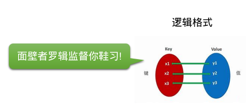
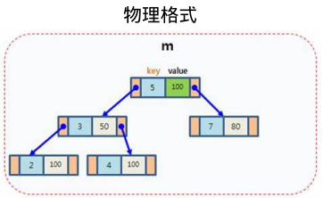
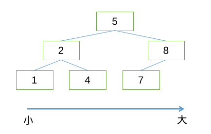
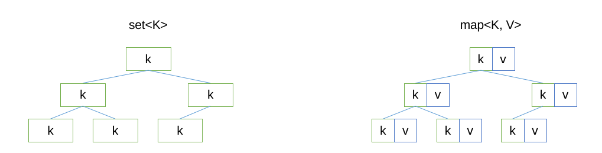
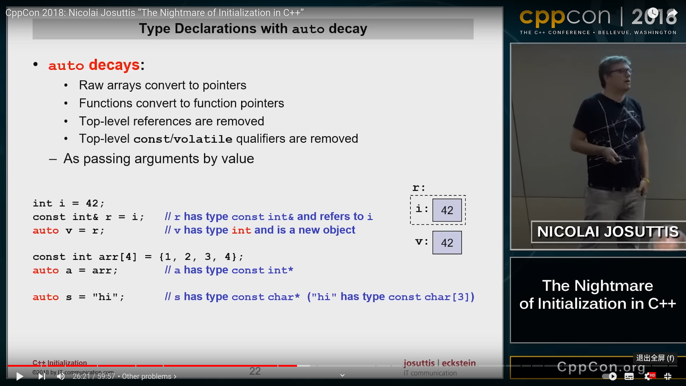
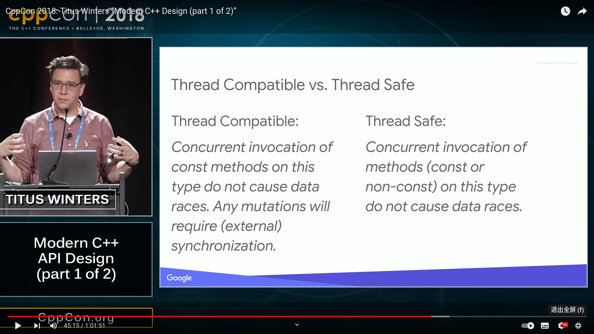

<!-- PG1 -->

<!-- 如何自動更新頁碼號：先 :source .vim_localrc，然後 :call MarkPG() -->

<!-- 本課程基於 CC-BY-NC-SA 協議發佈，轉載需標註出處，不得用於商業用途 -->

# 小彭老師 深入淺出 STL 課程系列 之 map

讓高性能數據結構惠及每一人

---
layout: two-cols
---

<!-- PG2 -->

# 課程簡介

😀😀😀

面向已經瞭解一定 C++ 語法，正在學習標準庫的童鞋。

C++ 標準庫又稱 STL，包含了大量程序員常用的算法和數據結構，是 Bjarne Stroustrup 送給所有 C++ 程序員的一把瑞士軍刀，然而發現很多童鞋並沒有完全用好他，反而還被其複雜性誤傷了。

如果你也對標準庫一知半解，需要系統學習的話，那麼本課程適合你。小彭老師將運用他特有的幽默答辯比喻，全面介紹各 STL 容器的所有用法。結合一系列實戰案例，剖析常見坑點，使用技巧等。對比不同寫法的性能與可讀性，還會與 Python 語言相互類比方便記憶，科普的部分冷知識可以作為大廠面試加分項。

::right::

<center><p class="opacity-50">本課程受到童鞋一致好評</p></center>

---

<!-- PG3 -->

# 課程亮點

👍👍👍

本系列課程與《侯傑老師 STL 課》的區別：

- 侯傑老師價值 2650 元，本課程錄播上傳 B 站免費觀看，觀眾可以自行選擇是否一鍵三連。
- 課件和案例源碼開源，上傳在 GitHub，可以自己下載來做修改，然後自己動手實驗，加深理解。
- 侯傑老師注重理論和底層實現原理，而本課程注重應用，結合實戰案例，著重展開重難點，坑點等。
- 很多學校裡教的，百度上搜的，大多是老版本 C++，已經過時，而本課程基於較新的 C++17 和 C++20 標準。
- 有時存在部分 C++ 高級用法過於艱深，不能適合所有同學，本課程採用因材施教思想：對於新手，可以跳過看不懂的部分，看我提供的“保底用法”，不保證高性能和“優雅”，但至少能用；對學有餘力的童鞋，則可以搏一搏上限，把高級用法也看懂，提升面試競爭力。總之不論你是哪個階段的學習者，都能從此課程中獲益。

---

<!-- PG4 -->

# 課程大綱

✨✨✨

之前幾期課程的錄播已經上傳到比站了[^1]。

1. vector 容器初體驗 & 迭代器入門 (BV1qF411T7sd)
2. 你所不知道的 set 容器 & 迭代器分類 (BV1m34y157wb)
3. string，string_view，const char * 的愛恨糾葛 (BV1ja411M7Di)
4. 萬能的 map 容器全家桶及其妙用舉例 (本期)
5. 函子 functor 與 lambda 表達式知多少
6. 通過實戰案例來學習 STL 算法庫
7. C++ 標準輸入輸出流 & 字符串格式化
8. traits 技術，用戶自定義迭代器與算法
9. allocator，內存管理與對象生命週期
10. C++ 異常處理機制的前世今生

[^1]: https://space.bilibili.com/263032155

---

<!-- PG5 -->

# 實驗環境

✅✅✅

課件中所示代碼推薦實驗環境如下：

| 要求     | ❤❤❤        | 💣💣💣       | 💩💩💩         |
|----------|------------|--------------|----------------|
| 操作系統 | Arch Linux | Ubuntu 20.04 | Wendous 10     |
| 知識儲備 | 會一點 C++ | 大學 C 語言  | Java 面向對象  |
| 編譯器   | GCC 9 以上 | Clang 12     | VS 2019        |
| 構建系統 | CMake 3.18 | 任意 C++ IDE | 命令行手動編譯 |

❤ = 推薦，💣 = 可用，💩 = 困難

---

<!-- PG6 -->

# 如何使用課件

🥰🥰🥰

本系列課件和源碼均公佈在：https://github.com/parallel101/course

例如本期的課件位於 `course/stlseries/stl_map/slides.md`。

課件基於 Slidev[^1] 開發，Markdown 格式書寫，在瀏覽器中顯示，在本地運行課件需要 Node.js：

- 運行命令 `npm install` 即可自動安裝 Slidev
- 運行命令 `npm run dev` 即可運行 Slidev 服務
- 瀏覽器訪問 http://localhost:3030 即可看到課件

如果報錯找不到 `slidev` 命令，可以試試 `export PATH="$PWD/node_modules/.bin:$PATH"`。

如果不想自己配置 Node.js 也可以直接以文本文件格式打開 slides.md 瀏覽課件。

Slidev 服務運行時，你對 slides.md 的所有修改會立刻實時顯現在瀏覽器中。

[^1]: https://sli.dev/

---

<!-- PG7 -->

# 如何運行案例代碼

🥺🥺🥺

案例源碼和所需頭文件位於課件同目錄的 `course/stlseries/stl_map/experiment/` 文件夾下。

其中 `main.cpp` 僅導入運行案例所需的頭文件，具體各個案例代碼分佈在 slides.md 裡。

如需測試課件中的具體代碼，可以把 slides.md 中的案例代碼粘貼到 main.cpp 的 main 函數體中進行實驗。

此外為了方便，還有一些形如 `testxxx.cpp` 的文件是一些完整的測試案例，不用從 slides.md 中拷貝，可直接單獨運行。

所需頭文件都在同一個目錄，可以通過 CMake 構建，也可以用任意自己喜歡的 IDE 單文件編譯運行，無強制要求。

---

<!-- PG8 -->

附贈了一些實用頭文件，同鞋們可以下載來研究，或者在自己的項目裡隨意運用。

<font size="3px">

| 文件名 | 功能 |
|-|-|
| print.h | 內含 print 函數，支持打印絕大多數 STL 容器，方便調試 |
| cppdemangle.h | 獲得類型的名字，以模板參數傳入，詳見該文件中的註釋 |
| map_get.h | 帶默認值的 map 表項查詢，稍後課程中會介紹到 |
| ScopeProfiler.h | 基於 RAII 的函數耗時統計，用於測量性能 |
| ppforeach.h | 基於宏的編譯期 for 循環實現，類似於 BOOST_PP_FOREACH |
| bits_stdc++.h | 仿照 bits/stdc++.h 的萬能頭文件跨平臺版，一次性導入所有庫 |
| utf8.h | UTF-8 的編碼與解碼，u8string 和 u32string 互相轉換 |
| hash.h | 比 std::hash 更通用的 generic_hash 實現，支持任意區間和元組 |

</font>

---

<!-- PG9 -->

# 課程書寫習慣說明

```cpp
int const &i  // 本課程書寫習慣
const int& i  // 官方文檔書寫習慣
```

```cpp
template <class T>     // 本課程書寫習慣
template <typename T>  // 官方文檔書寫習慣
```

僅為個人書寫習慣不同，在 C++ 編譯器看來都是等價的。

---

<!-- PG10 -->

僅為教學方便目的，不建議在現實工程中使用：

```cpp
using namespace std;
```

本課程中的 `std::` 前綴均省略不寫：

```cpp
map<string, vector<int>> m;
erase_if(m, pred);
```

現實工程中不建議 `using namespace std`，請顯式寫出 `std::` 前綴：

```cpp
std::map<std::string, std::vector<int>> m;
std::erase_if(m, pred);
```

---

<!-- PG11 -->

案例代碼中用了仿照 `<bits/stdc++.h>` 的萬能頭文件，同樣不建議在現實工程中使用：

```cpp
#include "bits_stdc++.h"
```

現實工程中，建議根據需要一個個導入，不要偷懶用這個不標準的頭文件：

```cpp
#include <map>            // 導入 std::map, std::multimap
#include <unordered_map>  // 導入 std::unordered_map，std::unordered_multimap
#include <string>         // 導入 std::string, std::wstring
#include <algorithm>      // 導入 std::set_difference, std::set_union, std::set_intersection 等一系列全局函數
// 下面代碼中用到哪些容器，就導入哪些頭文件
```

[^1]: https://blog.csdn.net/m0_51755720/article/details/121489644

---

<!-- PG12 -->

# 本期課程目錄

---

<!-- PG13 -->

關於算法複雜度，一個真實的小故事

有一次一個同學發給我一份源碼文件 tetreader.py，其功能是讀取一個 tet 格式的文件（四面體網格模型）。

他問我為什麼他寫的這個 Python 代碼這麼慢，讀取一個稍微大一點的模型就需要好幾秒，他說久仰小彭老師性能優化的大名，想要我幫他優化一下，還問是不是應該用 C++ 寫會比較高效一點？

我並不懂得四面體，但性能優化的思路是通用的。我打開文件看了一下，我發現他讀取時需要查詢一個點周圍所有的面，他是這樣查詢的：

```python
face_lut = []
# ...
face_lut.append(vert_id)
# ...
face_id = face_lut.index(vert_id)
```

我說你這個 face_lut 是個普通數組，數組的 index 函數是 $O(N)$ 複雜度的你不知道嗎？他相當於暴力遍歷了數組找到你需要的值，你這個 index 的調用還是在一個循環裡的，所以是 $O(N^2)$ 複雜度！難怪這麼慢了。

---

<!-- PG14 -->

後來我給他改了一下，把他的 face_lut 改成字典，用字典查找，高效得多了：

```python
face_lut = []
# ...
face_lut[vert_id] = face_id
# ...
face_id = face_lut[vert_id]
```

一次字典的查詢只需要 $O(1)+$，所以加上他外面的循環總共只有 $O(N)$，變成線性複雜度了。他一試，果然幾毫秒就加載完了，我說用字典加速查找這不是常識嗎？還擱著 C++ 你就是 CUDA 來了也壓不住複雜度爆表呀？

他很高興，不知道怎麼感謝我，於是就把我推薦給張心欣了。

---

<!-- PG15 -->

C++ 中也是如此，有數組（vector），字典（map），還有上一課講過的集合（set）。

今天我們要介紹的就是 C++ 的字典容器 map，以及 C++11 引入的另一個字典容器 unordered_map，他們的異同我們稍後會詳細討論。

- 在 vector 容器用 std::find 查找：$O(N)$
- 在 map 或 set 容器用 .find 查找：$O(\log N)$
- 在 unordered_map 或 unordered_set 容器用 .find 查找：$O(1)+$

---

<!-- PG16 -->

map 的邏輯結構



特點：

- 由一系列*鍵值對*組成
- 一個鍵只能對應一個值
- 鍵不得重複，值可以重複

<br/>

> std::map, std::unordered_map, absl::flat_hash_map, tbb::concurrent_hash_map 都滿足這一基本邏輯結構，但物理實現不同。

---

<!-- PG17 -->

標準庫中的 map 容器[^1]

標準庫中，map 是一個模板類，他的鍵類型，值類型，可以由尖括號內的參數指定。

鍵類型和值類型可以是任意類型，包括基本類型，用戶自定義的類，或是其他 STL 容器等。

- 例如 `map<string, int>` 是一個鍵類型為 string，值類型為 int 的 map 容器。
- 例如 `map<int, Student>` 是一個鍵類型為 int，值類型為 Student 的 map 容器。
- 例如 `map<char, vector<int>>` 是一個鍵類型為 char，值類型為 `vector<int>` 的 map 容器。

後面為了方便研究，以 `map<K, V>` 形式書寫得出的結論，對於任何實際鍵和值類型，只需代入 K 和 V 即可。

> 已知：要想使用 `map<K, V>`，就得滿足 `K` 必須支持比較運算符 `<`。
>
> 可得：要想使用 `map<string, int>`，就得滿足 `string` 必須支持比較運算符 `<`[^2]。
>
> 已知：遍歷 `map<K, V>` 時，是以鍵 `K` 部分從小到大的順序遍歷的。
>
> 可得：遍歷 `map<int, string>` 時，是以鍵 `int` 部分從小到大的順序遍歷的。

[^1]: https://en.cppreference.com/w/cpp/container/map
[^2]: `std::string` 的大小比較規則可以回顧 BV1ja411M7Di 和 BV1m34y157wb 這兩節課

---

<!-- PG18 -->

map 的物理結構



map 和 set 一樣，都是基於紅黑樹的二叉排序樹，實現高效查找。

vector 就是因為元素沒有固定的順序，所以才需要暴力遍歷查找。

在持續的插入和刪除操作下，始終維持元素的有序性，正是 map 實現高效查找的關鍵所在。

---

<!-- PG19 -->

map 查找時採用二分法：

1. 從根節點開始查找。

2. 如果當前節點的鍵小於要找的鍵，則往左子節點移動；

3. 如果當前節點的鍵大於要找的鍵，則往左子節點移動；

4. 如果當前節點的鍵等於要找的鍵，則該節點就是要找的節點，返回該節點。

5. 把左/右子節點設為新的當前節點，然後回到第 2 步，重複這一查找過程。

---

<!-- PG20 -->

由於 map 的實現基於二叉排序樹，map 額外有一個特點：*有序*。

map (或 set) 中的鍵 K 總是從小到大排列，方便進行二分查找，在 $O(\log N)$ 時間內找到對應元素。

每次插入新的鍵時，會找到適當的插入位置，使得插入後的 map 仍然有序。

> 注：基於哈希散列表實現的 unordered_map (和 unordered_set)，就不具備*有序*這一特點。



---

<!-- PG21 -->



兩者的區別在於：map 在 K 之外，額外外掛了一個 V 類型。

map 中的 V 類型不參與排序，只按照 K 進行排序。

這樣當用戶根據 K 找到的是 K-V 對，然後可以取出 K 對應的 V。

這就實現了從 K 到 V 的映射。

---

<!-- PG22 -->

創建一個 map 對象：

```cpp
map<string, int> config;
```

一開始 map 初始是空的，如何插入一些初始數據？

```cpp
config["timeout"] = 985;
config["delay"] = 211;
```

數據插入成功了，根據鍵查詢對應的值？

```cpp
print(config["timeout"]);
print(config["delay"]);
```

查詢時建議用 .at(key) 而不是 [key]：

```cpp
print(config.at("timeout"));
print(config.at("delay"));
```

---

<!-- PG26 -->

老生常談的問題：map 中存 string 還是 const char *？

```cpp
map<const char *, const char *> m;
m["hello"] = "old";    // 常量區的 "hello"
char key[] = "hello";
m[key] = "new";        // 棧上變量的 key = "hello"
print(m);
print(key == "hello"); // false
```

```
{hello: old, hello: new}
false
```

在 C++ 中，任何時候都務必用 string！別用 C 語言老掉牙的 const char *，太危險了。

const char * 危險的原因：

1. const char * 的 == 判斷的是指針的相等，兩個 const char * 只要地址不同，即使實際的字符串相同，也不會被視為同一個元素（如上代碼案例所示）。導致 map 裡會出現重複的鍵，以及按鍵查找可能找不到等。
2. 保存的是弱引用，如果你把局部的 char [] 或 string.c_str() 返回的 const char * 存入 map，等這些局部釋放了，map 中的 const char * 就是一個空懸指針了，會造成 segfault。

---

請用安全的 string：

```cpp
map<string, string> m;
m["hello"] = "old";
string key = "hello";
m[key] = "new";
print(m);
print(key == "hello");
```

```
{"hello": "new"}
true
```

---

即使你精通對象生命週期分析，能保證 key 指向的字符串活的比 m 久，也請用封裝了正確 == 運算符的 string_view：

```cpp
map<string_view, string_view> m;
m["hello"] = "old";
string_view key = "hello";
m[key] = "new";
print(m);
print(key == "hello");
// 此處 m 是棧上變量，key 是弱引用指向全局常量區（rodata），key 比 m 活得久，沒有空懸指針問題
```

```
{"hello": "new"}
true
```

<br/>

> 注：map 實際上用到的是 &lt; 運算符。

---

<!-- PG23 -->

C++11 新特性——花括號初始化列表，允許創建 map 時直接指定初始數據：

```cpp
map<string, int> config = { {"timeout", 985}, {"delay", 211} };
```

通常我們會換行寫，一行一個鍵值對，看起來條理更清晰：

```cpp
map<string, int> config = {
    {"timeout", 985},
    {"delay", 211},
};

print(config.at("timeout"));  // 985
```

---

總結花括號初始化語法：

```cpp
map<K, V> m = {
    {k1, v1},
    {k2, v2},
    ...,
};
```

讓 map 初始就具有這些數據。

---

<!-- PG24 -->

```cpp
map<string, int> config = {
    {"timeout", 985},
    {"delay", 211},
};
```

等號可以省略（這其實相當於是在調用 map 的構造函數）：

```cpp
map<string, int> config{
    {"timeout", 985},
    {"delay", 211},
};
```

也可以先構造再賦值給 auto 變量：

```cpp
auto config = map<string, int>{
    {"timeout", 985},
    {"delay", 211},
};
```

都是等價的。

> 關於構造函數、花括號列表的具體語法可以參考我的《高性能並行》系列第二課：https://www.bilibili.com/video/BV1LY411H7Gg

---

<!-- PG25 -->

作為函數參數時，可以用花括號初始化列表就地構造一個 map 對象：

```cpp
void myfunc(map<string, int> config);  // 函數聲明

myfunc(map<string, int>{               // 直接創建一個 map 傳入
    {"timeout", 985},
    {"delay", 211},
});
```

由於 `myfunc` 函數具有唯一確定的重載，要構造的參數類型 `map<string, int>` 可以省略不寫：

```cpp
myfunc({
    {"timeout", 985},
    {"delay", 211},
});
```

函數這邊，通常還會加上 `const &` 修飾避免不必要的拷貝。

```cpp
void myfunc(map<string, int> const &config);
```

---

<!-- PG27 -->

從 vector 中批量導入鍵值對：

```cpp
vector<pair<string, int>> kvs = {
    {"timeout", 985},
    {"delay", 211},
};
map<string, int> config(kvs.begin(), kvs.end());
```

與剛剛花括號初始化的寫法等價，只不過是從現有的 vector 中導入。同樣的寫法也適用於從 array 導入。

> 如果記不住這個寫法，也可以自己手寫 for 循環遍歷 vector 逐個逐個插入 map，效果是一樣的。

冷知識，如果不是 vector 或 array，而是想從傳統的 C 語言數組中導入：

```cpp
pair<string, int> kvs[] = {  // C 語言原始數組
    {"timeout", 985},
    {"delay", 211},
};
map<string, int> config(kvs, kvs + 2);                    // C++98
map<string, int> config(std::begin(kvs), std::end(kvs));  // C++17
```

> 其中 `std::begin` 和 `std::end` 為 C++17 新增函數，專門用於照顧沒法有成員函數 `.begin()` 的 C 語言數組。類似的全局函數還有 `std::size` 和 `std::data` 等……他們都是既兼容 STL 容器也兼容 C 數組的。

---

<!-- PG28 -->

如何根據鍵查詢相應的值？

很多同學都知道 map 具有 [] 運算符重載，和一些腳本語言一樣，直觀易懂。

```cpp
config["timeout"] = 985;       // 把 config 中鍵 timeout 對應值設為 985
auto val = config["timeout"];  // 讀取 config 中鍵 timeout 對應值
print(val);                    // 985
```

但其實用 [] 訪問元素是很不安全的，下面我會做實驗演示這一點。

---

<!-- PG29 -->

沉默的 []，無言的危險：當鍵不存在時，會返回 0 而不會出錯！

```cpp
map<string, int> config = {
    {"timeout", 985},
    {"delay", 211},
};
print(config["timeout"]); // 985
print(config["tmeout"]);  // 默默返回 0
```

```
985
0
```

當查詢的鍵值不存在時，[] 會默默創建並返回 0。

這非常危險，例如一個簡簡單單的拼寫錯誤，就會導致 map 的查詢默默返回 0，你還在那裡找了半天摸不著頭腦，根本沒發現錯誤原來在 map 這裡。

---

<!-- PG30 -->

愛哭愛鬧的 at()，反而更討人喜歡

```cpp
map<string, int> config = {
    {"timeout", 985},
    {"delay", 211},
};
print(config.at("timeout"));  // 985
print(config.at("tmeout"));   // 該鍵不存在！響亮地出錯
```

```
985
terminate called after throwing an instance of 'std::out_of_range'
  what():  map::at
Aborted (core dumped)
```

有經驗的老手都明白一個道理：**及時奔潰**比**容忍錯誤**更有利於調試。即 fail-early, fail-loudly[^1] 原則。

例如 JS 和 Lua 的 [] 訪問越界不報錯而是返回 undefined / nil，導致實際出錯的位置在好幾十行之後，無法定位到真正出錯的位置，這就是為什麼後來發明瞭錯誤檢查更嚴格的 TS。

使用 at() 可以幫助你更容易定位到錯誤，是好事。

[^1]: https://oncodingstyle.blogspot.com/2008/10/fail-early-fail-loudly.html

---

<!-- PG31 -->

[] 更危險的地方在於，當所查詢的鍵值不存在時：

```cpp
map<string, int> config = {
    {"timeout", 985},
    {"delay", 211},
};
print(config);
print(config["tmeout"]);  // 有副作用！
print(config);
```

```
{"delay": 211, "timeout": 985}
0
{"delay": 211, "timeout": 985, "tmeout": 0}
```

會自動創建那個不存在的鍵值！

你以為你只是觀察了一下 map 裡的 "tmeout" 元素，卻意外改變了 map 的內容，薛定諤[^1]直呼內行。

[^1]: https://baike.baidu.com/item/%E8%96%9B%E5%AE%9A%E8%B0%94%E7%9A%84%E7%8C%AB/554903

---

<!-- PG32 -->

> 在官方文檔和各種教學課件中，都會展示一個函數的“原型”來講解。
>
> 原型展現了一個函數的名稱，參數類型，返回類型等信息，掌握了函數的原型就等於掌握了函數的調用方法。
>
> 本課程後面也會大量使用，現在來教你如何看懂成員函數的原型。

假設要研究的類型為 `map<K, V>`，其中 K 和 V 是模板參數，可以替換成你具體的類型。

例如當我使用 `map<string, int>` 時，就把下面所有的 K 替換成 string，V 替換成 int。

`map<K, V>` 的 [] 和 at 員函數，原型如下：

```cpp
V &operator[](K const &k);
V &at(K const &k);                   // 第一個版本的 at
V const &at(K const &k) const;       // 第二個版本的 at
```

可見 operator[] 只有一個版本，at 居然有名字相同的兩個！這樣不會發生衝突嗎？

這是利用了 C++ 的“重載”功能，重載就是同一個函數有多個不同的版本，各個版本的參數類型不同。

---

<!-- PG33 -->

> 例如小彭老師打電話給 110，假如警察叔叔發現小彭老師報的案子是網絡詐騙，那麼他們會幫我轉接到網警部門；假如發現小彭老師是被綁架了，那麼他們可能會出動武警解救小彭老師。這就是 110 函數的兩個重載，根據調用者傳入的信息類型，決定要轉給哪一個子部門。

同理，編譯器也是會根據調用時你傳入的參數類型，決定要調用重載的哪一個具體版本。

- C 語言沒有重載，函數名字相同就會發生衝突，編譯器會當場報錯。
- C++ 支持重載，只有當函數名字相同，參數列表也相同時，才會發生衝突。
- 返回值類型不影響重載，重載只看參數列表。

菜鳥教程上對 C++ 重載的解釋[^1]：

> C++ 允許在同一作用域中的某個函數和運算符指定多個定義，分別稱為函數重載和運算符重載。
>
> 重載聲明是指一個與之前已經在該作用域內聲明過的函數或方法具有相同名稱的聲明，但是它們的參數列表和定義（實現）不相同。
>
> 當您調用一個重載函數或重載運算符時，編譯器通過把您所使用的參數類型與定義中的參數類型進行比較，決定選用最合適的定義。選擇最合適的重載函數或重載運算符的過程，稱為重載決策。
>
> 在同一個作用域內，可以聲明幾個功能類似的同名函數，但是這些同名函數的形式參數（指參數的個數、類型或者順序）必須不同。您不能僅通過返回類型的不同來重載函數。

[^1]: https://www.runoob.com/cplusplus/cpp-overloading.html

---

<!-- PG34 -->

```cpp
V &at(K const &k);                   // 第一個版本的 at
V const &at(K const &k) const;       // 第二個版本的 at
```

但是上面這兩個 at 函數的參數類型都是 `K const &`，為什麼可以重載呢？

注意看第二個版本最後面多了一個 const 關鍵字，這種寫法是什麼意思？小彭老師對其進行祛魅化：

```cpp
V &at(map<K, V> *this, K const &k);                   // 第一個版本的 at
V const &at(map<K, V> const *this, K const &k);       // 第二個版本的 at
```

原來實際上在函數括號後面加的 const，實際上是用於修飾 this 指針的！

> 該寫法僅供示意，並非真實語法

所以兩個 at 的參數列表不同，不同在於傳入 this 指針的類型，所以可以重載，不會衝突。

- 當 map 對象為 const 時，傳入的 this 指針為 `map<K, V> const *`，所以只能調用第二個版本的 at。
- 當 map 對象不為 const 時，傳入的 this 指針為 `map<K, V> *`，兩個重載都可以調用，但由於第一個重載更加符合，所以會調用第一個版本的 at。

---

<!-- PG35 -->

剛剛解釋了函數重載，那麼運算符重載呢？

因為原本 C 語言就有 [] 運算符，不過那隻適用於原始指針和原始數組。而 C++ 允許也 [] 運算符支持其他用戶自定義類型（比如 std::map），和 C 語言自帶的相比就只有參數類型不同（一個是原始數組，一個是 std::map），所以和函數重載很相似，這就是運算符重載。

```cpp
m["key"];
```

會被編譯器“翻譯”成：

```cpp
m.operator[]("key");
```

以上代碼並非僅供示意，是可以通過編譯運行之一。你還可以試試 `string("hel").operator+("lo")`。

> operator[] 雖然看起來很複雜一個關鍵字加特殊符號，其實無非就是個特殊的函數名，學過 Python 的童鞋可以把他想象成 `__getitem__`

```cpp
V &operator[](K const &k);
```

結論：[] 運算符實際上是在調用 operator[] 函數。

---

<!-- PG36 -->

而 operator[] 這個成員函數沒有 const 修飾，因此當 map 修飾為 const 時編譯會不通過[^1]：

```cpp
const map<string, int> config = {  // 此處如果是帶 const & 修飾的函數參數也是同理
    {"timeout", 985},
    {"delay", 211},
};
print(config["timeout"]);          // 編譯出錯
```

```
/home/bate/Codes/course/stlseries/stl_map/experiment/main.cpp: In function ‘int main()’:
/home/bate/Codes/course/stlseries/stl_map/experiment/main.cpp:10:23: error: passing ‘const std::map<std::__cxx11::basic_string<char>, int>’ as ‘this’ argument discards qualifiers [-fpermissive]
   10 | print(config["timeout"]);
```

編譯器說 discards qualifiers，意思是 map 有 const 修飾，但是 operator[] 沒有。

這實際上就是在說：`map<K, V> const *` 不能轉換成 `map<K, V> *`。

有 const 修飾的 map 作為 this 指針傳入沒 const 修飾的 operator[] 函數，是減少了修飾（discards qualifers）。C++ 規定傳參時只能增加修飾不能減少修飾：只能從 `map *` 轉換到 `map const *` 而不能反之，所以對著一個 const map 調用非 const 的成員函數 operator[] 就出錯了。相比之下 at() 就可以在 const 修飾下編譯通過。

[^1]: https://blog.csdn.net/benobug/article/details/104903314

---

<!-- PG37 -->

既然 [] 這麼危險，為什麼還要存在呢？

```cpp
map<string, int> config = {
    {"delay", 211},
};
config.at("timeout") = 985;  // 鍵值不存在，報錯！
config["timeout"] = 985;     // 成功創建並寫入 985
```

因為當我們寫入一個本不存在的鍵值的時候，恰恰需要他的“自動創建”這一特性。

總結：讀取時應該用 at() 更安全，寫入時才需要用 []。

---

<!-- PG38 -->

- 讀取元素時，統一用 at()
- 寫入元素時，統一用 []

```cpp
auto val = m.at("key");
m["key"] = val;
```

為什麼其他語言比如 Python，只有一個 [] 就行了呢？而 C++ 需要兩個？

- 因為 Python 會檢測 [] 位於等號左側還是右側，根據情況分別調用 `__getitem__` 或者 `__setitem__`。
- C++ 編譯器沒有這個特殊檢測，也檢測不了，因為 C++ 的 [] 只是返回了個引用，並不知道 [] 函數返回以後，你是拿這個引用寫入還是讀取。為了保險起見他默認你是寫入，所以先幫你創建了元素，返回這個元素的引用，讓你寫入。
- 而 Python 的引用是不能用 = 覆蓋原值的，那樣只會讓變量指向新的引用，只能用 .func() 引用成員函數或者 += 才能就地修改原變量，這是 Python 這類腳本語言和 C++ 最本質的不同。
- 總而言之，我們用 C++ 的 map 讀取元素時，需要顯式地用 at() 告訴編譯器我是打算讀取。

---

<!-- PG39 -->

```cpp
print(config.at("hello"));  // "world"
print(config.at("hello"));  // "kitty"
```

---

<!-- PG40 -->

at 與 [] 實戰演練

我們現在的甲方是一個學校的大老闆，他希望讓我們管理學生信息，因此需要建立一個映射表，能夠快速通過學生名字查詢到相應的學生信息。思來想去 C++ 標準庫中的 map 容器最合適。決定設計如下：

- 鍵為學生的名字，string 類型。
- 值為一個自定義結構體，Student 類型，裡面存放各種學生信息。

然後自定義一下 Student 結構體，現在把除了名字以外的學生信息都塞到這個結構體裡。

創建 `map<string, Student>` 對象，變量名為 `stus`，這個 map 就是甲方要求的學生表，成功交差。

```cpp
struct Student {
    int id;             // 學號
    int age;            // 年齡
    string sex;         // 性別
    int money;          // 存款
    set<string> skills; // 技能
};

map<string, Student> stus;
```

---

<!-- PG41 -->

現在小彭老師和他的童鞋們要進入這家學校了，讓我們用 [] 大法插入他的個人信息：

```cpp
stus["彭于斌"] = Student{20220301, 22, "自定義", {"C", "C++"}};
stus["相依"] = Student{20220301, 21, "男", 2000, {"Java", "C"}};
stus["櫻花粉蜜糖"] = Student{20220301, 20, "女", 3000, {"Python", "CUDA"}};
stus["Sputnik02"] = Student{20220301, 19, "男", 4000, {"C++"}};
```

由於 C++11 允許省略花括號前的類型不寫，所以 Student 可以省略，簡寫成：

```cpp
stus["彭于斌"] = {20220301, 22, "自定義", {"C", "C++"}};
stus["相依"] = {20220301, 21, "男", 2000, {"Java", "C"}};
stus["櫻花粉蜜糖"] = {20220301, 20, "女", 3000, {"Python", "CUDA"}};
stus["Sputnik02"] = {20220301, 19, "男", 4000, {"C++"}};
```

又由於 map 支持在初始化時就指定所有元素，我們直接寫：

```cpp
map<string, Student> stus = {
    {"彭于斌", {20220301, 22, "自定義", 1000, {"C", "C++"}}},
    {"相依", {20220301, 21, "男", 2000, {"Java", "C"}}},
    {"櫻花粉蜜糖", {20220301, 20, "女", 3000, {"Python", "CUDA"}}},
    {"Sputnik02", {20220301, 19, "男", 4000, {"C++"}}},
};
```

---

<!-- PG42 -->

現在甲方要求添加一個“培訓”函數，用於他們的 C++ 培訓課。

培訓函數的參數為字符串，表示要消費學生的名字。如果該名字學生不存在，則應該及時報錯。

每次培訓需要消費 2650 元，消費成功後，往技能 skills 集合中加入 "C++"。

```cpp
void PeiXunCpp(string stuName) {
    auto stu = stus.at(stuName);  // 在棧上拷貝了一份完整的 Student 對象
    stu.money -= 2650;
    stu.skills.insert("C++");
}
```

然而，這樣寫是不對的！

`stus.at(stuName)` 返回的是一個引用 `Student &`，但是等號左側，卻不是個引用，而是普通變量。

那麼這時會調用 Student 的拷貝構造函數，`Student(Student const &)`，來初始化變量 stu。

結論：把引用保存到普通變量中，則引用會退化，造成深拷貝！stu 和 stus.at(stuName) 的已經是兩個不同的 Student 對象，對 stu 的修改不會影響到 stus.at(stuName) 指向的那個 Student 對象了。


此時你對這個普通變量的所有修改，都不會同步到 map 中的那個 Student 中去！

---

<!-- PG43 -->

我們現在對相依童鞋進行 C++ 培訓：

```cpp
PeiXunCpp("相依");
print(stus.at("相依"));
```

結果發現他的存款一分沒少，也沒學會 C++：

```
{id: 20220302, age: 21, sex: "男", money: 2000, skills: {"C", "Java"}}
```

看來我們的修改沒有在 map 中生效？原來是因為我們在 PeiXunCpp 函數裡：

```cpp
auto stu = stus.at(stuName);  // 在棧上拷貝了一份完整的 Student 對象
```

一不小心就用了“克隆人”技術！從學生表裡的“相依1號”，克隆了一份放到棧上的“相依2號”！

然後我們扣了這個臨時克隆人“相依2號”的錢，並給他培訓 C++ 技術。

然而我們培訓的是棧上的臨時變量“相依2號”，克隆前的“相依1號”並沒有受到培訓，也沒有扣錢。

然後呢？殘忍的事情發生了！在小彭老師一通操作培訓完“相依2號”後，我們把他送上斷頭臺——析構了！

而這一切“相依1號”完全不知情，他只知道有人喊他做克隆，然後就回家玩 Java 去了，並沒有培訓 C++ 的記憶。

---

<!-- PG44 -->

要防止引用退化成普通變量，需要把變量類型也改成引用！這種是淺拷貝，stu 和 stus.at(stuName) 指向的仍然是同一個 Student 對象。用 `auto` 捕獲的話，改成 `auto &` 就行。

```cpp
void PeiXunCpp(string stuName) {
    auto &stu = stus.at(stuName);  // 在棧上創建一個指向原 Student 對象的引用
    stu.money -= 2650;
    stu.skills.insert("C++");
}
```

```
{id: 20220302, age: 21, sex: "男", money: -650, skills: {"C", "C++", "Java"}}
```

終於，正版“相依1號”本體鞋廢了 C++！

之後如果再從“相依1號”身上克隆，克隆出來的“相依n號”也都會具有培訓過 C++ 的記憶了。

引用相當於身份證，我們複印了“相依”的身份證，身份證不僅複印起來比克隆一個大活人容易（拷貝開銷）從而提升性能，而且通過身份證可以找到本人，對身份證的修改會被編譯器自動改為對本人的修改，例如通過“相依”的身份證在銀行開卡等，銀行要的是身份證，不是克隆人哦。

---

<!-- PG45 -->

引用是一個燙手的香香麵包，普通變量就像一個臭臭的答辯馬桶，把麵包放到馬桶（auto）裡，麵包就臭掉，腐爛掉，不能吃了！要讓麵包轉移陣地了以後依然好吃，需要放到保鮮盒（auto &）裡。

這就是 C++ 的 decay（中文剛好是“退化”、“變質”的意思）規則。

以下都是香香麵包，放進馬桶裡會變質：

- `T &` 會變質成 `T`（引用變質成普通變量）
- `T []` 會變質成 `T *`（數組變質成首地址指針）
- `T ()` 會變質成 `T (*)()`（函數變質成函數指針）

在函數的參數中、函數的返回值中、auto 捕獲的變量中，放入這些香香麵包都會發生變質！

如何避免變質？那就不要用馬桶（普通變量）裝麵包唄！用保鮮盒（引用）裝！

- 避免引用 `T &t` 變質，就得把函數參數類型改成引用，或者用 `auto &`，`auto const &` 捕獲才行。
- 避免原生數組 `T t[N]` 變質，也可以改成引用 `T (&t)[N]`，但比較繁瑣，不如直接改用 C++11 封裝的安全靜態數組 `array<T, N>` 或 C++98 就有的安全動態數組 `vector<T>`。
- 避免函數 `T f()` 變質，可以 `T (&f)()`，但繁瑣，不如直接改用 C++11 的函數對象 `function<T()>`。



---

<!-- PG46 -->

邪惡的 decay 規則造成空懸指針的案例

```cpp
typedef double arr_t[10];

auto func(arr_t val) {
    arr_t ret;
    memcpy(ret, val, sizeof(arr_t));  // 對 val 做一些運算, 把計算結果保存到 ret
    return ret;     // double [10] 自動變質成 double *
}

int main() {
    arr_t val = {1, 2, 3, 4};
    auto ret = func(val);             // 此處 auto 會被推導為 double *
    print(std::span<double>(ret, ret + 10));
    return 0;
}
```

```
Segmentation fault (core dumped)
```

---

<!-- PG47 -->

修復方法：不要用沙雕 C 語言的原生數組，用 C++ 封裝好的 array

```cpp
typedef std::array<double, 10> arr_t;  // 或者 vector 亦可

auto func(arr_t val) {
    arr_t ret;
    ret = val;  // 對 val 做一些運算, 把計算結果保存到 ret
    return ret;
}

int main() {
    arr_t val = {1, 2, 3, 4};
    auto ret = func(val);
    print(ret);
    return 0;
}
```

```
{1, 2, 3, 4, 0, 0, 0, 0, 0, 0}
```

---

<!-- PG48 -->

當然如果你還是學不會怎麼保留香香引用的話，也可以在修改後再次用 [] 寫回學生表。這樣學生表裡不會 C++ 的“相依1號”就會被我們棧上培訓過 C++ 的“相依1號”覆蓋，現在學生表裡的也是有 C++ 技能的相依辣！只不過需要翻來覆去克隆了好幾次比較低效而已，至少能用了，建議只有學不懂引用的童鞋再用這種保底寫法。

```cpp
void PeiXunCpp(string stuName) {
    auto stu = stus.at(stuName);  // 克隆了一份“相依2號”
    stu.money -= 2650;
    stu.skills.insert("C++");
    stus[stuName] = stu;          // “相依2號”奪舍，把“相依1號”給覆蓋掉了
}
```

學生思考題：上面代碼第 5 行也可以改用 at，為什麼？小彭老師不是說 “at 用於讀取，[] 用於寫入” 嗎？

我們童鞋要學會變通！小彭老師說 [] 用於寫入，是因為有時候我們經常需要寫入一個不存在的元素，所以 [] 會自動創建元素而不是出錯就很方便；但是現在的情況是我們第 2 行已經訪問過 at("相依")，那麼就確認過 "相依" 已經存在才對，因此我寫入的一定是個已經存在的元素，這時 [] 和 at 已經沒區別了，所以用 at 的非 const 那個重載，一樣可以寫入。

我們童鞋不是去死記硬背《小彭老師語錄》，把小彭老師名言當做“兩個凡是”聖經。要理解小彭老師會這麼說的原因是什麼，這樣才能根據不同實際情況，實事求是看問題，才是符合小彭老師唯物編程觀的。

---

<!-- PG49 -->

如果要根據學號進行查找呢？那就以學號為鍵，然後把學生姓名放到 Student 結構體中。

如果同時有根據學號進行查找和根據姓名查找兩種需求呢？

同時高效地根據多個鍵進行查找，甚至指定各種條件，比如查詢所有會 C++ 的學生等，這可不是 map 能搞定的，或者說能搞定但不高效（只能暴力遍歷查找，間複雜度太高）。這是個專門的研究領域，稱為：關係數據庫。

關係數據庫的實現有 MySQL，SQLite，MongoDB 等。C++ 等編程語言只需調用他們提供的 API 即可，不必自己手動實現這些複雜的查找和插入算法。

這就是為什麼專業的“學生管理系統”都會用關係數據庫，而不是自己手動維護一個 map，因為關係數據庫的數據結構更復雜，但經過高度封裝，提供的功能也更全面，何況 map 在內存中，電腦一關機，學生數據就沒了。

---

<!-- PG50 -->

查詢 map 中元素的數量

```cpp
size_t size() const noexcept;
```

使用 `m.size()` 獲得的 map 大小，或者說其中元素的數量。

```cpp
map<string, int> m;
print(m.size());
m["fuck"] = 985;
print(m.size());
m["dick"] = 211;
print(m.size());
```

---

<!-- PG51 -->

應用舉例：給每個鍵一個獨一無二的計數

```cpp
map<string, int> m;
m["fuck"] = m.size();
m["dick"] = m.size();
```

> 注：需要 C++17 保證等號右邊先求值

---

<!-- PG52 -->

判斷一個鍵是否存在：count 函數

```cpp
size_t count(K const &k) const;
```

count 返回容器中鍵和參數 k 相等的元素個數，類型為 size_t（無符號 64 位整數）。

由於 map 中同一個鍵最多隻可能有一個元素，取值只能為 0 或 1。

並且 size_t 可以隱式轉換為 bool 類型，0 則 false，1 則 true。

---

<!-- PG53 -->

因此可以直接通過 count 的返回值是否為 0 判斷一個鍵在 map 中是否存在：

```cpp
map<string, string> msg = {
    {"hello", "world"},
    {"fuck", "rust"},
};
print(msg);
if (msg.count("fuck")) {
    print("存在fuck，其值為", msg.at("fuck"));
} else {
    print("找不到fuck");
}
if (msg.count("dick")) {
    print("存在dick，其值為", msg.at("suck"));
} else {
    print("找不到dick");
}
```

```
{"fuck": "rust", "hello": "world"}
存在fuck，其值為 "rust"
找不到dick
```

C++20 中還可以改用返回類型直接為 bool 的 contains 函數，滿足你的命名強迫症。

```cpp
if (msg.contains("fuck")) {
    print("存在fuck，其值為", msg.at("fuck"));
} else {
    print("找不到fuck");
}
```

---

<!-- PG54 -->

你知道嗎？[] 的妙用

除了寫入元素需要用 [] 以外，還有一些案例中合理運用 [] 會非常的方便。

[] 的效果：當所查詢的鍵值不存在時，會調用默認構造函數創建一個元素[^1]。

- 對於 int, float 等數值類型而言，默認值是 0。
- 對於指針（包括智能指針）而言，默認值是 nullptr。
- 對於 string 而言，默認值是空字符串 ""。
- 對於 vector 而言，默認值是空數組 {}。
- 對於自定義類而言，會調用你寫的默認構造函數，如果沒有，則每個成員都取默認值。

[^1]: https://en.cppreference.com/w/cpp/language/value_initialization

---

<!-- PG55 -->

[] 妙用舉例：出現次數統計

```cpp
vector<string> input = {"hello", "world", "hello"};
map<string, int> counter;
for (auto const &key: input) {
    counter[key]++;
}
print(counter);
```

```
{"hello": 2, "world": 1}
```

---
layout: two-cols-header
---

<!-- PG56 -->

::left::

<center>

活用 [] 自動創建 0 元素的特性

</center>

```cpp {3}
map<string, int> counter;
for (auto const &key: input) {
    counter[key]++;
}
```

::right::

<center>

古板的寫法

</center>

```cpp {3-7}
map<string, int> counter;
for (auto const &key: input) {
    if (!counter.count(key)) {
        counter[key] = 1;
    } else {
        counter[key] = counter.at(key) + 1;
    }
}
```

---

<!-- PG57 -->

[] 妙用舉例：歸類

```cpp
vector<string> input = {"happy", "world", "hello", "weak", "strong"};
map<char, vector<string>> categories;
for (auto const &str: input) {
    char key = str[0];
    categories[key].push_back(str);
}
print(categories);
```

```
{'h': {"happy", "hello"}, 'w': {"world", "weak"}, 's': {"strong"}}
```

---
layout: two-cols-header
---

<!-- PG58 -->

::left::

<center>

活用 [] 自動創建"默認值"元素的特性

</center>

```cpp {4}
map<char, vector<string>> categories;
for (auto const &str: input) {
    char key = str[0];
    categories[key].push_back(str);
}
print(categories);
```

::right::

<center>

古板的寫法

</center>

```cpp {4-8}
map<char, vector<string>> categories;
for (auto const &str: input) {
    char key = str[0];
    if (!categories.count(key)) {
        categories[key] = {str};
    } else {
        categories[key].push_back(str);
    }
}
```

---
layout: center
---

<!-- PG59 -->


---

<!-- PG60 -->

反面典型：查找特定元素在 vector 中的位置（下標）

```cpp
size_t array_find(vector<string> const &arr, string const &val) {
    for (size_t i = 0; i < arr.size(); i++) {
        if (arr[i] == val) return i;
    }
    return (size_t)-1;
}
vector<string> arr = {"hello", "world", "nice", "day", "fucker"};
print("hello在數組中的下標是：", array_find(arr, "fucker"));    // O(N) 低效
print("nice在數組中的下標是：", array_find(arr, "nice"));       // O(N) 低效
```

每次調用 `array_find`，都需要 $O(N)$ 複雜度。

```
fucker在數組中的下標是：0
nice在數組中的下標是：2
```

如果查詢 N 次，則複雜度就是 $O(N^2)$。

> 注：假設 vector 中不存在重複的元素

---

<!-- PG61 -->

正確做法：構建 vector 的反向查找表，以後查找更高效

```cpp
vector<string> arr = {"hello", "world", "nice", "day", "fucker"};
map<string, size_t> arrinv;
for (size_t i = 0; i < arr.size(); i++) {                // O(N) 一次性受苦
    arrinv[arr[i]] = i;
}
print("反向查找表構建成功：", arrinv);
print("fucker在數組中的下標是：", arrinv.at("fucker"));  // O(log N) 高效
print("nice在數組中的下標是：", arrinv.at("nice"));      // O(log N) 高效
```

只有第一次構造反向查找表時，需要 $O(N)$ 複雜度。

以後每次調用 `map.at`，只需要 $O(\log N)$ 複雜度。

```
反向查找表構建成功：{"day": 3, "fucker", 4, "hello": 0, "nice": 2, "world": 1}
fucker在數組中的下標是：4
nice在數組中的下標是：2
```

<!-- 軼事：在數據庫這門學問中，這種反向查找表被稱為“倒序索引”，小彭老師在不知道這個術語的情況下，獨立產生了反向查找表的思想 -->

---

<!-- PG62 -->

```cpp
for (size_t i = 0; i < arr.size(); i++) {
    arrinv[arr[i]] = i;
}
```

提前構造好查找表 $O(N)$，以後每次查找只需要 $O(\log N)$ 複雜度就行。

- （正向查找）已知下標 i，求元素 v：`v = arr[i]`
- （反向查找）已知元素 v，求下標 i：`i = arrinv[v]`

如果查詢 N 次，則複雜度就是 $O(N \log N)$，比優化前高效。

因此當需要多次查找且原數組保持不變時，強烈推薦用這種方法，更高效。

---

<!-- PG63 -->

案例：構建另一個 map 的反向查找表

```cpp
map<string, string> tab = {
    {"hello", "world"},
    {"fuck", "rust"},
};
map<string, string> tabinv;
for (auto const &[k, v]: tab) {
    tabinv[v] = k;
}
print(tabinv);
```

效果就是，鍵變值，值變鍵，反一反，兩個 map 互為逆運算：

```
{"rust": "fuck", "world": "hello"}
```

注：假設 tab 中不存在重複的值，鍵和值一一對應

---

<!-- PG64 -->

STL 容器的元素類型都可以通過成員 `value_type` 查詢，常用於泛型編程（又稱元編程）。

```cpp
set<int>::value_type      // int
vector<int>::value_type   // int
string::value_type        // char
```

此外還有引用類型 `reference`，迭代器類型 `iterator`，常迭代器類型 `const_iterator` 等。曾經在 C++98 中很常用，不過自從 C++11 有了 auto 和 decltype 以後，就不怎麼用了，反正能自動推導返回類型。

當容器有一個不確定的類型 T 作為模板參數時，就需要前面加上 `typename` 修飾：

```cpp
set<int>::value_type               // 沒有不定類型，不需要
typename set<T>::value_type        // 包含有 T 是不定類型
typename set<set<T>>::value_type   // 包含有 T 是不定類型
typename map<int, T>::value_type   // 包含有 T 是不定類型
typename map<K, T>::value_type     // 包含有 K、T 是不定類型
map<int, string>::value_type       // 沒有不定類型，不需要
```

---

<!-- PG65 -->

在本課程的案例代碼中附帶的 "cppdemangle.h"，可以實現根據指定的類型查詢類型名稱並打印出來。

跨平臺，需要 C++11，支持 MSVC，Clang，GCC 三大編譯器，例如：

```cpp
int i;
print(cppdemangle<decltype(std::move(i))>());
print(cppdemangle<std::string>());
print(cppdemangle<std::wstring::value_type>());
```

在我的 GCC 12.2.1 上得到：

```
"int &&"
"std::__cxx11::basic_string<char, std::char_traits<char>, std::allocator<char> >"
"wchar_t"
```

---

<!-- PG66 -->

問題: map 真正的元素類型究竟是什麼？其具有三個成員類型[^1]：

- 元素類型：`value_type`
- 鍵類型：`key_type`
- 值類型：`mapped_type`

後面，將會一直以“元素”稱呼官方的“value”，“鍵”稱呼官方的“key”，“值”稱呼官方的“mapped”

用 cppdemangle 做實驗，看看這些成員類型具體是什麼吧：

```cpp
map<int, float>::value_type   // pair<const int, float>
map<int, float>::key_type     // int
map<int, float>::mapped_type  // float
```

結論：`map<K, V>` 的元素類型是 `pair<const K, V>` 而不是 `V`。

[^1]: https://blog.csdn.net/janeqi1987/article/details/100049597

---

<!-- PG67 -->

`pair<const K, V>` ——為什麼 K 要加 const？

上期 set 課說過，set 內部採用紅黑樹數據結構保持有序，這樣才能實現在 $O(\log N)$ 時間內高效查找。

鍵值改變的話會需要重新排序，如果只修改鍵值而不重新排序，會破壞有序性，導致二分查找結果錯誤！
所以 set 只有不可變迭代器（const_iterator），不允許修改元素的值。

map 和 set 一樣也是紅黑樹，不同在於：map 只有鍵 K 的部分會參與排序，V 是個旁觀者，隨便修改也沒關係。

所以 map 有可變迭代器，只是在其 value_type 中給 K 加上了 const 修飾：不允許修改 K，但可以修改 V。

如果你確實需要修改鍵值，那麼請先把這個鍵刪了，然後再以同樣的 V 重新插入一遍，保證紅黑樹的有序。

---

<!-- PG68 -->

```cpp
iterator begin();
const_iterator begin() const;
iterator end();
const_iterator end() const;
```

begin() 和 end() 迭代器分別指向 map 的首個元素和最後一個元素的後一位。

其中 end() 迭代器指向的地址為虛空索敵，不可解引用，僅僅作為一個“標誌”存在（回顧之前 vector 課）。

---

<!-- PG69 -->

- 迭代器可以通過 `*it` 或 `it->` 解引用，獲取其指向的元素。
- 由於 map 內部總是保持有序，map 的首個元素一定是鍵最小的元素。
- 由於 map 內部總是保持有序，map 的最後一個元素一定是鍵最大的元素。

例如要查詢成績最好和最壞的學生，可以把成績當做 key，學生名做 value 依次插入 map，他會幫我們排序：

```cpp
map<int, string> score = {
    {100, "彭于斌"},
    {80, "櫻花粉蜜糖"},
    {0, "相依"},
    {60, "Sputnik02"},
};
string poorestStudent = score.begin()->second;   // 成績最差學生的姓名
string bestStudent = prev(score.end())->second;  // 成績最好學生的姓名
print("最低分:", poorestStudent);
print("最高分:", bestStudent);
```

```
最低分: "相依"
最高分: "彭于斌"
```

> 注：僅當確保 `score.size() != 0` 時才可以解引用，否則 begin() 和 end() 都是虛空迭代器，這時解引用會奔潰。

---

<!-- PG70 -->

map 的遍歷：古代 C++98 的迭代器大法

```cpp
for (map<string, int>::iterator it = m.begin(); it != m.end(); ++it) {
    print("Key:", it->first);
    print("Value:", it->second);
}
```

要特別注意迭代器是一個指向元素的指針，不是元素本身！要用 `->` 而不是 `.`。

---

<!-- PG71 -->

運用 C++11 的 auto 簡寫一下：

```cpp
for (auto it = m.begin(); it != m.end(); ++it) {
    print("Key:", it->first);
    print("Value:", it->second);
}
```

運用 C++17 結構化綁定（structured-binding）語法[^1]直接拆開 pair 類型：

```cpp
for (auto it = m.begin(); it != m.end(); ++it) {
    auto [k, v] = *it;
    print("Key:", k);
    print("Value:", v);
}
```

[^1]: https://www.youtube.com/watch?v=FWizpd-n7W4

---

<!-- PG72 -->

map 的遍歷：現代 C++17 基於範圍的循環（range-based loop）

```cpp
for (auto kv: m) {
    print("Key:", kv.first);
    print("Value:", kv.second);
}
```

同時運用 C++17 結構化綁定語法[^1]：

```cpp
for (auto [k, v]: m) {
    print("Key:", k);
    print("Value:", v);
}
```

---

<!-- PG73 -->

如何在遍歷的過程中修改值？

古代：

```cpp
map<string, int> m = {
    {"fuck", 985},
    {"rust", 211},
};
for (auto it = m.begin(); it != m.end(); ++it) {
    it->second = it->second + 1;
}
print(m);
```

```
{"fuck": 986, "rust": 212}
```

---

<!-- PG74 -->

如何在遍歷的過程中修改值？

現代：

```cpp
map<string, int> m = {
    {"fuck", 985},
    {"rust", 211},
};
for (auto [k, v]: m) {
    v = v + 1;
}
print(m);
```

```
{"fuck": 985, "rust": 211}
```

沒有成功修改！為什麼？

---

<!-- PG75 -->

```cpp
for (auto [k, v]: m) {
    v = v + 1;
}
```

Range-based loop 只是個花哨語法糖，他相當於：

```cpp
for (auto it = m.begin(); it != m.end(); ++it) {
    auto [k, v] = *it;
    v = v + 1;
}
```

Structured-binding 也只是個花哨語法糖，他相當於：

```cpp
for (auto it = m.begin(); it != m.end(); ++it) {
    auto tmp = *it;
    auto k = tmp.first;
    auto v = tmp.second;
    v = v + 1;
}
```

這樣保存下來的 v 是個棧上變量，是對原值的一份拷貝，不僅浪費性能，且對 v 的修改不會反映到原 map 中去！

---

<!-- PG76 -->

```cpp
for (auto &[k, v]: m) {  // 解決方案是在這裡加一個小小的 &，讓 range-based loop 捕獲引用而不是拷貝
    v = v + 1;
}
```

同樣是拆除 Range-based loop 的花哨語法糖，相當於：

```cpp
for (auto it = m.begin(); it != m.end(); ++it) {
    auto &[k, v] = *it;
    v = v + 1;
}
```

繼續拆除 Structured-binding 的花哨語法糖，相當於：

```cpp
for (auto it = m.begin(); it != m.end(); ++it) {
    auto &tmp = *it;
    auto &k = tmp.first;
    auto &v = tmp.second;
    v = v + 1;
}
```

這樣保存下來的 v 是個引用，是對原值的引用（用 Rust 的話說叫 borrowed）。不僅避免拷貝的開銷節省了性能，而且對 v 的修改會實時反映到原 map 中去。

---

<!-- PG77 -->

總結，當需要在遍歷的同時修改 map 中的值時，要用 `auto &` 捕獲引用：

```cpp
for (auto &[k, v]: m) {  // 捕獲一個引用，寫入這個引用會立即作用在原值上
    v = v + 1;
}
```

即使不需要修改 map 中的值時，也建議用 `auto const &` 避免拷貝的開銷：

```cpp
for (auto const &[k, v]: m) {   // 捕獲只讀的 const 引用，引用避免拷貝開銷，const 避免不小心手滑寫入
    print(v);
}
```

---

<!-- PG78 -->

注：即使捕獲為 `auto &`，由於 map 的元素類型是 `pair<const K, V>` 所以 K 部分還是會捕獲為 `K const &`，無法寫入。

```cpp
for (auto &[k, v]: m) {
    k = "key";    // 編譯期報錯：const 引用不可寫入！
    v = 985211;   // OK
}
```

只是如果捕獲為 `auto const &` 就兩個都不允許寫入了。

```cpp
for (auto const &[k, v]: m) {
    k = "key";    // 編譯期報錯：const 引用不可寫入！
    v = 985211;   // 編譯期報錯：const 引用不可寫入！
}
```

---

<!-- PG79 -->

```cpp
iterator find(K const &k);
const_iterator find(K const &k) const;
```

m.find(key) 函數，根據指定的鍵 key 查找元素[^1]。

- 成功找到，則返回指向找到元素的迭代器
- 找不到，則返回 m.end()

由於 STL 傳統異能之 end() 虛空索敵，他不可能指向任何值，所以經常作為找不到時候缺省的返回值。

可以用 `m.find(key) != m.end()` 判斷一個元素是否存在，等價於 `m.count(key) != 0`。

第二個版本的原型作用是：如果 map 本身有 const 修飾，則返回的也是 const 迭代器。

為的是防止你在一個 const map 裡 find 了以後利用迭代器變相修改 map 裡的值。

[^1]: https://en.cppreference.com/w/cpp/container/map/find

---
layout: two-cols-header
---

<!-- PG80 -->

實際上 count 和 contains 函數就是基於 find 實現的，性能沒有區別，glibc 源碼：

::left::

```cpp
#if __cplusplus > 201703L
      /**
       *  @brief  Finds whether an element with the given key exists.
       *  @param  __x  Key of (key, value) pairs to be located.
       *  @return  True if there is an element with the specified key.
       */
      bool
      contains(const key_type& __x) const
      { return _M_t.find(__x) != _M_t.end(); }

      template<typename _Kt>
      auto
      contains(const _Kt& __x) const
      -> decltype(_M_t._M_find_tr(__x), void(), true)
      { return _M_t._M_find_tr(__x) != _M_t.end(); }
#endif
```

::right::

```cpp
      /**
       *  @brief  Finds the number of elements with given key.
       *  @param  __x  Key of (key, value) pairs to be located.
       *  @return  Number of elements with specified key.
       *
       *  This function only makes sense for multimaps; for map the result will
       *  either be 0 (not present) or 1 (present).
       */
      size_type
      count(const key_type& __x) const
      { return _M_t.find(__x) == _M_t.end() ? 0 : 1; }
```

```cpp
// 以下三者等價
m.contains(key)
m.count(key)
m.find(key) != m.end()
```

---

<!-- PG81 -->

檢查過不是 m.end()，以確認成功找到後，就可以通過 * 運算符解引用獲取迭代器指向的值：

```cpp
map<string, int> m = {
    {"fuck", 985},
};
auto it = m.find("fuck");  // 尋找 K 為 "fuck" 的元素
if (it != m.end()) {
    auto kv = *it;     // 解引用得到 K-V 對
    print(kv);         // {"fuck", 985}
    print(kv.first);   // "fuck"
    print(kv.second);  // 985
} else {
    print("找不到 fuck！");
}
```

---
layout: two-cols-header
---

<!-- PG82 -->

find 的高效在於，可以把兩次查詢合併成一次。

::left::

保底寫法：開銷 $2 \log N$

```cpp
if (m.count("key")) {    // 第一次查詢，只包含"是否找到"的信息
    print(m.at("key"));  // 第二次查詢，只包含"找到了什麼"的信息
}
```

::right::

高效寫法：開銷 $\log N$

```cpp
auto it = m.find("key"); // 一次性查詢
if (it != m.end()) {     // 查詢的結果，既包含"是否找到"的信息
    print(it->second);   // 也包含"找到了什麼"的信息
}
```

---

<!-- PG83 -->

此外運用 C++17 的 if-auto 語法糖還可以更寫的緊湊一點。

```cpp
auto it = m.find("key1");
if (it != m.end()) {
    print(it->second);
}
auto it = m.find("key2");  // 編譯器報錯：變量 it 重複定義！
if (it != m.end()) {
    print(it->second);
}
```

雖然刪去前面的 auto 可以解決問題，但是如果這裡是不同類型的 map 就尬了，得另外想一個變量名。

而 C++17 的 if-auto 語法糖捕獲的 it 是限制在當前 if 作用域的，不會跑出去和別人發生衝突。

```cpp
if (auto it = m.find("key1"); it != m.end()) {
    print(it->second);
}
if (auto it = m.find("key2"); it != m.end()) {  // 這個變量 it 是局域的，不會和上一個局域的 it 產生名字衝突
    print(it->second);
}
```

---

<!-- PG84 -->

我給 C++ 標準委員會提一個建議，能不能給迭代器加一個 `operator bool` 代替煩人的 `!= m.end()`？

```cpp
struct iterator {
    _RbTreeNode *node;

    bool operator!=(iterator const &other) const noexcept {
        return node == other.node;
    }

    operator bool() const noexcept {
        return node;
    }
};
```

那樣的話就可以直接：

```cpp
if (auto it = m.find("key")) {
    print(it->second);
}
```

因為 if-auto 省略分號後面的條件時，默認就是 `if (auto it = m.find("key"); (bool)it)`

---

<!-- PG85 -->

注意 `*it` 解引用得到的是 `pair<const K, V>` 類型的鍵值對，需要 `(*it).second` 才能獲取單獨的值 V。

好在 C 語言就有 `->` 運算符作為語法糖，我們可以簡寫成 `it->second`，與 `(*it).second` 等價。

```cpp
map<string, int> m = {
    {"fuck", 985},
};
auto it = m.find("fuck");   // 尋找 K 為 "fuck" 的元素
if (it != m.end()) {
    print(it->second);      // 迭代器有效，可以直接獲得值部分 985
} else {
    print("找不到 fuck！");  // 這個分支裡不得用 * 和 -> 運算符解引用 it
}
```

大多數情況下我們查詢只需要獲取值 V 的部分就行了，直接 `it->second` 就可以了✅

> 注意：find 找不到鍵時，會返回 `m.end()`，這是個無效迭代器，只作為標識符使用（類比 Python 中的 find 有時會返回 -1）。
>
> 沒有確認 `it != m.end()` 前，不可以訪問 `it->second`！那相當於解引用一個空指針，會造成 segfault（更專業一點說是 UB）。
>
> 記住，一定要在 `it != m.end()` 的分支裡才能訪問 `it->second` 哦！你得先檢查過飯碗裡沒有老鼠💩之後，才能安心吃飯！
>
> 如果你想讓老媽（標準庫）自動幫你檢查有沒有老鼠💩，那就用會自動報錯的 at（類比 Python 中的 index 找不到直接報錯）。
>
> 之所以用 find，是因為有時飯碗裡出老鼠💩，是計劃的一部分！例如當有老鼠💩時你可以改吃別的零食。而 at 這個良心老媽呢？一發現老鼠💩就拖著你去警察局報案，零食（默認值）也不讓你吃了。今日行程全部取消，維權（異常處理，找上層 try-catch 塊）設為第一要務。

---

<!-- PG86 -->

```cpp
iterator find(K const &k);
const_iterator find(K const &k) const;
```

如果 map 沒有 const 修飾，則其 find 返回的 it 也是非 const 迭代器。

```cpp
const map<string, int> cm;
map<string, int>::const_iterator cit = cm.find();
print(cit->second);  // OK: 可以讀取
cit->second = 1;     // 編譯期報錯: 不允許寫入 const 迭代器指向的值

map<string, int> m;
map<string, int>::iterator it = m.find();
print(it->second);   // OK: 可以讀取
it->second = 1;      // OK: 可以寫入
```

`it->second` 可以寫入，it 是迭代器，迭代器類似於指針，寫入迭代器指向的 second 就可以修改 map 裡的值部分。

`it->first` 是鍵部分，由於 map 的真正元素類型是 `pair<const K, V>` 所以這部分無法被修改。

---

<!-- PG87 -->

帶默認值的查詢

眾所周知，Python 中的 dict 有一個 m.get(key, defl) 的功能，效果是當 key 不存在時，返回 defl 這個默認值代替 m[key]，而 C++ 的 map 卻沒有，只能用一套組合拳代替：

```cpp
m.count(key) ? m.at(key) : defl
```

但上面這樣寫是比較低效的，相當於查詢了 map 兩遍，at 裡還額外做了一次多餘的異常判斷。

正常來說是用通用 find 去找，返回一個迭代器，然後判斷是不是 end() 決定要不要採用默認值。

```cpp
auto it = m.find(key);
return it == m.end() ? it->second : defl;
```

> 飯碗裡發現了老鼠💩？別急著報警，這也在我的預料之中：啟用 B 計劃，改吃 defl 這款美味零食即可！
>
> 如果是良心老媽 at，就直接啟用 C 計劃： 拋出異常然後奔潰了，雖然這很方便我們程序員調試。

---

<!-- PG88 -->

由於自帶默認值的查詢這一功能實在是太常用了，為了把這個操作濃縮到一行，我建議同學們封裝成函數放到自己的項目公共頭文件（一般是 utils.h 之類的名稱）裡方便以後使用：

```cpp
template <class M>
typename M::mapped_type map_get
( M const &m
, typename M::key_type const &key
, typename M::mapped_type const &defl
) {
  typename M::const_iterator it = m.find(key);
  if (it != m.end()) {
    return it->second;
  } else {
    return defl;
  }
}
```

```cpp
int val = map_get(config, "timeout", -1);  // 如果配置文件裡不指定，則默認 timeout 為 -1
```

---

<!-- PG89 -->

這樣還不夠優雅，我們還可以更優雅地運用 C++17 的函數式容器 optional：

```cpp
template <class M>
std::optional<typename M::mapped_type> map_get
( M const &m
, typename M::key_type const &key
) {
  typename M::const_iterator it = m.find(key);
  if (it != m.end()) {
    return it->second;
  } else {
    return std::nullopt;
  }
}
```

當找不到時就返回 nullopt，找到就返回含有值的 optional。

> 注：本段代碼已附在案例代碼庫的 "map_get.h" 文件中，等課後可以去 GitHub 下載。

---

<!-- PG90 -->

調用者可以自行運用 optional 的 value_or 函數[^1]指定找不到時採用的默認值：

```cpp
int val = map_get(config, "timeout").value_or(-1);
```

如果要實現 at 同樣的找不到就自動報錯功能，那就改用 value 函數：

```cpp
int val = map_get(config, "timeout").value();
```

optional 具有 `operator bool` 和無異常的 `operator*`，所以也可以配合 if-auto 語法糖使用：

```cpp
if (auto o_val = map_get(config, "timeout")) {
    int val = *o_val;
    print("找到了", val);
} else {
    print("找不到時的處理方案...");
}
```

---

<!-- PG91 -->

以上是典型的函數式編程範式 (FP)，C++20 還引入了更多這樣的玩意[^2]，等有空會專門開節課為大家一一介紹。

```cpp
auto even = [] (int i) { return 0 == i % 2; };
auto square = [] (int i) { return i * i; };
for (int i: std::views::iota(0, 6)
          | std::views::filter(even)
          | std::views::transform(square))
    print(i);  // 0 4 16
```

[^1]: https://en.cppreference.com/w/cpp/utility/optional/value_or
[^2]: https://en.cppreference.com/w/cpp/ranges/filter_view

---

<!-- PG92 -->

現在學習刪除元素用的 erase 函數，其原型如下[^1]：

```cpp
size_t erase(K const &key);
```

指定鍵值 key，erase 會刪除這個鍵值對應的元素。

返回一個整數，表示刪除了多少個元素（只能是 0 或 1）。

[^1]: https://en.cppreference.com/w/cpp/container/map/erase

---

<!-- PG93 -->

```cpp
size_t erase(K const &key);
```

erase 運用舉例：刪除一個元素

```cpp
map<string, string> msg = {
    {"hello", "world"},
    {"fuck", "rust"},
};
print(msg);
msg.erase("fuck");
print(msg);
```

```
{"fuck": "rust", "hello": "world"}
{"hello": "world"}
```

---

<!-- PG94 -->

```cpp
size_t erase(K const &key);
```

erase 的返回值和 count 一樣，返回成功刪除的元素個數，類型為 size_t（無符號 64 位整數）。

由於 map 中同一個鍵最多隻可能有一個元素，取值只能為 0 或 1。

並且 size_t 可以隱式轉換為 bool 類型，0 則 false，1 則 true。

---

<!-- PG95 -->

因此可以直接通過 erase 的返回值是否為 0 判斷是否刪除成功：

```cpp
map<string, string> msg = {
    {"hello", "world"},
    {"fuck", "rust"},
};
print(msg);
if (msg.erase("fuck")) {
    print("刪除fuck成功");
} else {
    print("刪除fuck失敗，鍵不存在");
}
if (msg.erase("dick")) {
    print("刪除dick成功");
} else {
    print("刪除dick失敗，鍵不存在");
}
print(msg);
```

```
{"fuck": "rust", "hello": "world"}
刪除fuck成功
刪除dick失敗，鍵不存在
{"hello": "world"}
```

---

<!-- PG96 -->

```cpp
size_t erase(K const &key);  // 指定鍵版
iterator erase(iterator it);   // 已知位置版
```

區別：

- 指定鍵版 erase(key) 實際上需要先調用 find(key) 找到元素位置，然後才能刪除，而且還有找不到的可能性。

- 而已知位置的話（比如你已經事先用 find 找到了元素位置），可以用 erase(it) 直接用迭代器作為參數

複雜度不同：

- 指定鍵版 erase(key) 的時間複雜度：$O(\log N)$。

- 已知位置版 erase(it) 的時間複雜度：$O(1)+$，更高效。

其中 $+$ 代表這是平攤（Amortized）下來的時間複雜度。

這是因為即使已知位置，erase 有可能涉及樹的更新，需要 $O(\log N)$ 複雜度。

但是大多數情況下需要的更新很少，平均下來是 $O(1)$ 的。

這種情況就會用記號 $O(1)+$ 來表示。

---

<!-- PG97 -->

erase(key) 可能是基於 erase(it) 實現的：

```cpp
size_t erase(K const &key) {  // 小彭老師猜想標準庫內部
    auto it = this->find(key);  // O(log N)
    if (it != this->end()) {
        this->erase(it);        // O(1)+
        return 1;  // 找到了，刪除成功
    } else {
        return 0;  // 找不到，沒有刪除
    }
}  // 開銷大的 find(key) 會覆蓋小的 erase(it)，所以 erase(key) 的總複雜度為 O(log N)
```

---

<!-- PG98 -->

指定位置版 erase(it) 返回的是刪除元素的下一個元素位置。

由於 map 內部保持鍵從小到大升序排列，所謂的下一個就是鍵比當前鍵大一個的元素，例如：

```
{"answer": 42, "hello": 985, "world": 211}
```

- erase(find("answer")) 會返回指向 "hello" 的迭代器，因為 "hello" 最接近且大於 "answer"。
- erase(find("hello")) 會返回指向 "world" 的迭代器，因為 "world" 最接近且大於 "hello"。
- erase(find("world")) 會返回 end()，因為 "world" 已經是最大鍵，沒有下一個。

此外 erase(it) 還有性能上的優勢：

- 指定位置版 erase(it) 的複雜度是 $O(1)+$
- 指定鍵版 erase(key) 的複雜度是 $O(\log N)$

當已知指向要刪除元素的迭代器時（例如先通過 find 找到），直接指定那個迭代器比指定鍵參數更高效。

刪除成績最差的學生：

```cpp
score.erase(score.begin());
```

---

<!-- PG99 -->

常見需求場景：一邊遍歷一邊刪除部分元素（錯誤示範）

```cpp
map<string, string> msg = {
    {"hello", "world"},
    {"fucker", "rust"},
    {"fucking", "java"},
    {"good", "job"},
};
for (auto const &[k, v]: msg) {
    if (k.starts_with("fuck")) {
        msg.erase(k);  // 遍歷過程中刪除當前元素，會導致正在遍歷中的迭代器失效，奔潰
    }
}
print(msg);
```

```
Segmentation fault (core dumped)
```

---

<!-- PG100 -->

引出問題：迭代器失效

- 每當往 map 中插入新元素時，原先保存的迭代器不會失效。
- 刪除 map 中的其他元素時，也不會失效。
- **只有當刪除的剛好是迭代器指向的那個元素時，才會失效**。

```cpp
map<string, int> m = {
    {"fuck", 985},
};
auto it = m.find("fuck");
m["dick"] = 211;
print(it->second);  // 沒有失效，打印 985
m.erase("dick");
print(it->second);  // 沒有失效，打印 985
m.erase("fuck");
print(it->second);  // 沒有失效，打印 985
```

---

<!-- PG101 -->

map 比起 unordered_map 來，已經是非常穩定，隨便增刪改查都不會迭代器失效。

只有一個例外：刪除的元素剛好是迭代器指向的。

你拿著個你朋友家的地址，結果你一發 RPG 導彈把他家炸了，還摸不著頭腦“奇怪，明明就是這個地址呀”，這時確實無論如何都不能避免失效，不能怪 map。

而剛剛的案例中，我們刪除的恰好就是當前正在遍歷的迭代器正在指向的那個元素（即使你用了 range-based loop 語法糖他背後還是迭代器遍歷）。

而當你對著一個失效的迭代器執行 `++it` 時，就產生了 segfault 錯誤。因為紅黑樹的迭代器要找到“下一個”節點，需要訪問這個紅黑樹節點中存的 `next` 指針，而這個紅黑樹節點都已經刪除了已經析構了已經釋放內存了，裡面存的 `next` 指針也已經釋放，被其他系統數據覆蓋，這時會訪問到錯誤的指針——野指針。

---

<!-- PG102 -->

所以《好友清除計劃》完整的劇情是：

你有好多朋友，今天你要把他們全炸了。

1號朋友家裡有一個字條，寫著2號朋友家的地址。

2號朋友家裡有一個字條，寫著3號朋友家的地址。

...

你拿著1號朋友家的地址，一發 RPG 導彈把他家炸了。然後你現在突然意識到需要2號朋友家的地址，但是1號朋友家已經被你炸了，你傻乎乎進入燃燒的1號朋友家，被火燒死了。

```cpp
for (auto it = m.begin(); it != m.end(); ++it /* 進入燃燒中的1號朋友家 */) {
    m.erase(it);  // 一發 RPG 導彈炸燬1號朋友家
}
```

---

<!-- PG103 -->

你拿著1號朋友家的地址，一發 RPG 導彈把他家炸了。然後你現在突然意識到需要2號朋友家的地址，但是1號朋友家已經被你炸了，你傻乎乎進入燃燒的1號朋友家，被火燒死了。

```cpp
for (auto it = m.begin(); it != m.end(); ++it) {
    m.erase(it);
}
```

正確的做法是，先進入1號朋友家，安全取出寫著2號朋友家地址的字條後，再來一發 RPG 把1號朋友家炸掉。這樣才能順利找到2號朋友家，以此類推繼續拆3號……

```cpp
for (auto it = m.begin(); it != m.end(); ) {
    auto next_it = it;  // 先進入1號朋友的家
    ++next_it;          // 拿出寫有2號朋友家地址的字條
    m.erase(it);        // 再發射 RPG 導彈
    it = next_it;       // 前往2號朋友家
}
```

---

<!-- PG104 -->

注意到 erase 會返回刪除元素的下一個元素的迭代器，也就是說這個 RPG 導彈非常智能，好像他就是專為《好友清除計劃》設計的一樣：他能在炸燬你朋友的房屋前，自動拿到其中的字條，並把他通過“彈射座椅”彈出來送到門外的你手上，把紙條安全送出來後，再爆炸摧毀你朋友的房屋。這樣你就不用冒險進入燃燒的房屋拿字條（迭代器失效導致 segfault），也不用先勞煩您自己先進去一趟房屋拿字條了（上一頁中那樣提前保存 next_it）。

```cpp
for (auto it = m.begin(); it != m.end(); ) {
    it = m.erase(it);        // 這款 RPG 導彈“智能地”在摧毀你朋友的房屋同時把其中的字條拿出來了!?
}
```

> 只是注意這裡 for 循環的步進條件 `++it` 要刪掉，因為智能的 RPG 導彈 `it = m.erase(it)` 已經幫你步進了。

---

<!-- PG105 -->

一邊遍歷一邊刪除部分元素（正解[^1]）

```cpp
map<string, string> msg = {
    {"hello", "world"},
    {"fucker", "rust"},
    {"fucking", "java"},
    {"good", "job"},
};
for (auto it = m.begin(); it != m.end(); ) {  // 沒有 ++it
    auto const &[k, v] = *it;
    if (k.starts_with("fuck")) {
        it = msg.erase(it);
    } else {
        ++it;
    }
}
print(msg);
```

```
{"good": "job", "hello": "world"}
```

[^1]: https://stackoverflow.com/questions/8234779/how-to-remove-from-a-map-while-iterating-it

---
layout: two-cols-header
---

<!-- PG106 -->

::left::

不奔潰

```cpp
for (auto it = m.begin(); it != m.end(); ) {
    auto const &[k, v] = *it;
    if (k.starts_with("fuck")) {
        it = msg.erase(it);
    } else {
        ++it;
    }
}
```

::right::

奔潰

```cpp
for (auto it = m.begin(); it != m.end(); ++it) {
    auto const &[k, v] = *it;
    if (k.starts_with("fuck")) {
        msg.erase(it);
        // 或者 msg.erase(k);
    }
}
```

---

<!-- PG107 -->

批量刪除符合條件的元素（C++20[^1]）

```cpp
map<string, string> msg = {
    {"hello", "world"},
    {"fucker", "rust"},
    {"fucking", "java"},
    {"good", "job"},
};
std::erase_if(msg, [&] (auto const &kv) {
    auto &[k, v] = kv;
    return k.starts_with("fuck");
});
print(msg);
```

```
{"good": "job", "hello": "world"}
```

[^1]: https://www.apiref.com/cpp-zh/cpp/container/map/erase_if.html

---

<!-- PG108 -->

如果你搞不懂迭代器這些，這裡我提供一個保底寫法，先把鍵提前保存到一個 vector 中去：

```cpp
map<string, string> msg = {
    {"hello", "world"},
    {"fucker", "rust"},
    {"fucking", "java"},
    {"good", "job"},
};
vector<string> keys;             // vector 或者 set 都可以
for (auto const &[k, v]: msg) {  // 先把所有鍵提前拷貝到臨時 vector 裡
    keys.push_back(k);
}
for (auto const &k: keys) {      // 遍歷剛才保存的鍵
    if (k.starts_with("fuck")) {
        msg.erase(k);            // 鍵值對已經提前深拷貝到臨時 vector 裡，這時刪除 map 裡的鍵不會奔潰
    }
}
```

> 小彭老師，永遠的祛魅大師。

---

<!-- PG109 -->

還是搞不懂的話，也可以新建一個 map，條件反之，把不需要刪除的元素插入新 map，過濾出需要保留的元素，最後再一次性用新 map 覆蓋舊 map。

```cpp
map<string, string> msg = {
    {"hello", "world"},
    {"fucker", "rust"},
    {"fucking", "java"},
    {"good", "job"},
};
map<string, string> newmsg;
for (auto const &[k, v]: msg) {
    if (!k.starts_with("fuck")) {   // 注意這裡條件反了，不需要刪除的才插入 newmsg
        newmsg[k] = v;
    }
}
msg = std::move(newmsg);        // 覆蓋舊的 map，用更高效的移動賦值函數，O(1) 複雜度
```

> 小彭老師，永遠的保底大師。

---

<!-- PG110 -->

接下來開始學習如何插入元素，map 的成員 insert 函數原型如下[^1]：

```cpp
pair<iterator, bool> insert(pair<const K, V> const &kv);
pair<iterator, bool> insert(pair<const K, V> &&kv);
```

他的參數類型就是剛剛介紹的 `value_type`，也就是 `pair<const K, V>`。

pair 是一個 STL 中常見的模板類型，`pair<K, V>` 有兩個成員變量：

- first：V 類型，表示要插入元素的鍵
- second：K 類型，表示要插入元素的值

我稱之為"鍵值對"。

[^1]: https://en.cppreference.com/w/cpp/container/map/insert

---

<!-- PG111 -->

試著用 insert 插入鍵值對：

```cpp
map<string, int> m;
pair<string, int> p;
p.first = "fuck";  // 鍵
p.second = 985;    // 值
m.insert(p);  // pair<string, int> 可以隱式轉換為 insert 參數所需的 pair<const string, int>
print(m);
```

結果：

```
{"fuck": 985}
```

---

<!-- PG112 -->

簡化 insert

<!-- <v-clicks> -->

1. 直接使用 pair 的構造函數，初始化 first 和 second

```cpp
pair<string, int> p("fuck", 985);
m.insert(p);
```

2. 不用創建一個臨時變量，pair 表達式直接作為 insert 函數的參數

```cpp
m.insert(pair<string, int>("fuck", 985));
```

2. 可以用 `std::make_pair` 這個函數，自動幫你推導模板參數類型，省略 `<string, int>`

```cpp
m.insert(make_pair("fuck", 985));  // 雖然會推導為 pair<const char *, int> 但還是能隱式轉換為 pair<const string, int>
```

3. 由於 insert 函數原型已知參數類型，可以直接用 C++11 的花括號初始化列表 {...}，無需指定類型

```cpp
m.insert({"fuck", 985});           // ✅
```

<!-- </v-clicks> -->

---
layout: two-cols-header
---

<!-- PG113 -->

因此，insert 的最佳用法是：

```cpp
map<K, V> m;
m.insert({"key", "val"});
```

insert 插入和 [] 寫入的異同：

- 同：當鍵 K 不存在時，insert 和 [] 都會創建鍵值對。
- 異：當鍵 K 已經存在時，insert 不會覆蓋，默默離開；而 [] 會覆蓋舊的值。

例子：

::left::

```cpp
map<string, string> m;
m.insert({"key", "old"});
m.insert({"key", "new"});  // 插入失敗，默默放棄不出錯
print(m);
```

```
{"key": "old"}
```

::right::

```cpp
map<string, string> m;
m["key"] = "old";
m["key"] = "new";        // 已經存在？我踏馬強行覆蓋！
print(m);
```

```
{"key": "new"}
```

---

<!-- PG114 -->

insert 的返回值是 `pair<iterator, bool>` 類型，<del>STL 的尿性：在需要一次性返回兩個值時喜歡用 pair</del>。

這又是一個 pair 類型，其具有兩個成員：

- first：iterator 類型，是個迭代器
- second：bool 類型，表示插入成功與否，如果發生鍵衝突則為 false

其中 first 這個迭代器指向的是：

- 如果插入成功（second 為 true），指向剛剛成功插入的元素位置
- 如果插入失敗（second 為 false），說明已經有相同的鍵 K 存在，發生了鍵衝突，指向已經存在的那個元素

---

<!-- PG115 -->

其實 insert 返回的 first 迭代器等價於插入以後再重新用 find 找到剛剛插入的那個鍵，只是效率更高：

```cpp
auto it = m.insert({k, v}).first;  // 高效，只需遍歷一次
```

```cpp
m.insert({k, v});     // 插入完就忘事了
auto it = m.find(k);  // 重新遍歷第二次，但結果一樣
```

參考 C 編程網[^1]對 insert 返回值的解釋：

> 當該方法將新鍵值對成功添加到容器中時，返回的迭代器指向新添加的鍵值對；
>
> 反之，如果添加失敗，該迭代器指向的是容器中和要添加鍵值對鍵相同的那個鍵值對。

[^1]: http://c.biancheng.net/view/7241.html

---

<!-- PG116 -->

可以用 insert 返回的 second 判斷插入多次是否成功：

```cpp
map<string, string> m;
print(m.insert({"key", "old"}).second);  // true
print(m.insert({"key", "new"}).second);  // false
m.erase("key");     // 把原來的 {"key", "old"} 刪了
print(m.insert({"key", "new"}).second);  // true
```

也可以用 structured-binding 語法拆解他返回的 `pair<iterator, bool>`：

```cpp
map<string, int> counter;
auto [it, success] = counter.insert("key", 1);  // 直接用
if (!success) {  // 如果已經存在，則修改其值+1
    it->second = it->second + 1;
} else {  // 如果不存在，則打印以下信息
    print("created a new entry!");
}
```

以上這一長串代碼和之前“優雅”的計數 [] 等價：

```cpp
counter["key"]++;
```

---

<!-- PG117 -->

在 C++17 中，[] 寫入有了個更高效的替代品 insert_or_assign[^1]：

```cpp
pair<iterator, bool> insert_or_assign(K const &k, V v);
pair<iterator, bool> insert_or_assign(K &&k, V v);
```

正如他名字的含義，“插入或者寫入”：

- 如果 K 不存在則創建（插入）
- 如果 K 已經存在則覆蓋（寫入）

用法如下：

```cpp
m.insert_or_assign("key", "new");  // 與 insert 不同，他不需要 {...}，他的參數就是兩個單獨的 K 和 V
```

返回值依舊是 `pair<iterator, bool>`。由於這函數在鍵衝突時會覆蓋，按理說是必定成功了，因此這個 bool 的含義從“是否插入成功”變為“是否創建了元素”，如果是創建的新元素返回true，如果覆蓋了舊元素返回false。

[^1]: https://en.cppreference.com/w/cpp/container/map/insert_or_assign

---

<!-- PG118 -->

看來 insert_or_assign 和 [] 的效果完全相同！都是在鍵值衝突時覆蓋舊值。

既然 [] 已經可以做到同樣的效果，為什麼還要發明個 insert_or_assign 呢？

insert_or_assign 的優點是**不需要調用默認構造函數**，可以提升性能。

其應用場景有以下三種情況：

- ⏱ 您特別在乎性能
- ❌ 有時 V 類型沒有默認構造函數，用 [] 編譯器會報錯
- 🥵 強迫症發作

否則用 [] 寫入也是沒問題的。

insert_or_assign 能取代 [] 的崗位僅限於純寫入，之前 `counter[key]++` 這種“優雅”寫法依然是需要用 [] 的。

---
layout: two-cols-header
---

<!-- PG119 -->

創建新鍵時，insert_or_assign 更高效。

::left::

```cpp
map<string, string> m;
m["key"] = "old";
m["key"] = "new";
print(m);
```

```
{"key": "new"}
```

覆蓋舊鍵時，使用 [] 造成的開銷：

- 調用移動賦值函數 `V &operator=(V &&)`

創建新鍵時，使用 [] 造成的開銷：

- 調用默認構造函數 `V()`
- 調用移動賦值函數 `V &operator=(V &&)`

::right::

```cpp
map<string, string> m;
m.insert_or_assign("key", "old");
m.insert_or_assign("key", "new");
print(m);
```

```
{"key": "new"}
```

覆蓋舊鍵時，使用 insert_or_assign 造成的開銷：

- 調用移動賦值函數 `V &operator=(V &&)`

創建新鍵時，使用 insert_or_assign 造成的開銷：

- 調用移動構造函數 `V(V &&)`

---

<!-- PG120 -->

總結，如果你有性能強迫症，並且是 C++17 標準：

- 寫入用 insert_or_assign
- 讀取用 at

如果沒有性能強迫症，或者你的編譯器不支持 C++17 標準：

- 寫入用 []
- 讀取用 at

最後，如果你是還原論者，只需要 find 和 insert 函數就是完備的了，別的函數都不用去記。所有 at、[]、insert_or_assign 之類的操作都可以通過 find 和 insert 的組合拳實現，例如剛剛我們自定義的 map_get。

---

<!-- PG121 -->

回顧之前的反向查找表，如果有重複，如何區分找第一個還是最後一個？

構建反向查找表，找到最後一個的下標：

```cpp
for (size_t i = 0; i < arr.size(); i++) {
    arrinv.insert_or_assign(arr[i], i);
    // 等價於 arrinv[arr[i]] = i;
}
```

構建反向查找表，找到第一個的下標：

```cpp
for (size_t i = 0; i < arr.size(); i++) {
    arrinv.insert({arr[i], i});
}
```

---

<!-- PG122 -->

剛剛介紹的那些 insert 一次只能插入一個元素，insert 還有一個特殊的版本，用於批量插入一系列元素。

```cpp
template <class InputIt>
void insert(InputIt beg, InputIt end);
```

參數[^1]是兩個迭代器 beg 和 end，組成一個區間，之間是你要插入的數據。

該區間可以是任何其他容器的 begin() 和 end() 迭代器——那會把該容器中所有的元素都插入到本 map 中去。

例如，把 vector 中的鍵值對批量插入 map：

```cpp
vector<pair<string, int>> kvs = {
    {"timeout", 985},
    {"delay", 211},
};
map<string, int> config;
config.insert(kvs.begin(), kvs.end());
print(config);  // {"delay": 211, "timeout": 985}
```

[^1]: 軼事：在標準庫文檔裡批量插入版 insert 函數的 beg 和 end 這兩個參數名為 first 和 last，但與 pair 的 first 並沒有任何關係，只是為了防止變量名和 begin() 和 end() 成員函數發生命名衝突。為了防止同學們與 pair 的 first 混淆所以才改成 beg 和 end 做參數名。

---

<!-- PG123 -->

注：由於 insert 不覆蓋的特性，如果 vector 中有重複的鍵，則會以鍵第一次出現時的值為準，之後重複出現的鍵會被忽視。

```cpp
vector<pair<string, int>> kvs = {
    {"timeout", 985},
    {"delay", 211},
    {"delay", 666},
    {"delay", 233},
    {"timeout", 996},
};
map<string, int> config;
config.insert(kvs.begin(), kvs.end());
print(config);
```

```
{"delay": 211, "timeout": 985}
```

---

<!-- PG124 -->

批量 insert 運用案例：兩個 map 合併

這個批量 insert 輸入的迭代器可以是任何容器，甚至可以是另一個 map 容器。

運用這一點可以實現兩個 map 的並集操作。

```cpp
map<string, int> m1 = {  // 第一個 map
    {"answer", 42},
    {"timeout", 7},
};
map<string, int> m2 = {  // 第二個 map
    {"timeout", 985},
    {"delay", 211},
};
m1.insert(m2.begin(), m2.end());  // 把 m2 的內容與 m1 合併，結果寫回到 m1
print(m1);
```

```
{"answer": 42, "delay": 211, "timeout": 7}
```

注：還是由於 insert 不覆蓋的特性，當遇到重複的鍵時（例如上面的 "timeout"），會以 m1 中的值為準。

---

<!-- PG125 -->

使用 `m1.insert(m2.begin(), m2.end())` 後，合併的結果會就地寫入 m1。

如果希望合併結果放到一個新的 map 容器中而不是就地修改 m1，請自行生成一份 m1 的深拷貝：

```cpp
const map<string, int> m1 = {  // 第一個 map，修飾有 const 禁止修改
    {"answer", 42},
    {"timeout", 7},
};
const map<string, int> m2 = {  // 第二個 map，修飾有 const 禁止修改
    {"timeout", 985},
    {"delay", 211},
};
auto m12 = m1;  // 生成一份 m1 的深拷貝 m12，避免 insert 就地修改 m1
m12.insert(m2.begin(), m2.end());
print(m12);     // m1 和 m2 的合併結果
```

```
{"answer": 42, "delay": 211, "timeout": 7}
```

---

<!-- PG126 -->

```cpp
auto m12 = m1;
m12.insert(m2.begin(), m2.end());
print(m12);     // m1 和 m2 的合併結果，鍵衝突時優先取 m1 的值
```

```
{"answer": 42, "delay": 211, "timeout": 7}
```

剛剛寫的 m1 和 m2 合併，遇到重複時會優先採取 m1 裡的值，如果希望優先採取 m2 的呢？反一反就可以了：

```cpp
auto m12 = m2;
m12.insert(m1.begin(), m1.end());
print(m12);     // m1 和 m2 的合併結果，鍵衝突時優先取 m2 的值
```

```
{"answer": 42, "delay": 211, "timeout": 985}
```

要是不會反一反，那手寫一個 for 循環遍歷 m2，然後 m1.insert_or_assign(k2, v2) 也是可以的，總之要懂得變通，動動腦，總是有保底寫法的。

---

<!-- PG127 -->

有同學就問了，這個 insert 實現了 map 的並集操作，那交集操作呢？這其實是 set 的常規操作而不是 map 的：

- set_intersection（取集合交集）
- set_union（取集合並集）
- set_difference（取集合差集）
- set_symmetric_difference（取集合對稱差集）

非常抱歉在之前的 set 課中完全沒有提及，因為我認為那是 `<algorithm>` 頭文件裡的東西。

不過別擔心，之後我們會專門有一節 algorithm 課詳解 STL 中這些全局函數——我稱之為算法模板，因為他提供了很多常用的算法，對小彭老師這種算法弱雞而言，實在非常好用，媽媽再也不用擔心我的 ACM 獎盃。

在小彭老師製作完 algorithm 課之前，同學們可以自行參考 https://blog.csdn.net/u013095333/article/details/89322501 提前進行學習。

```cpp
std::set_union(A.begin(), A.end(), B.begin(), B.end(), std::inserter(C, C.begin()));  // C = A U B
```

> 注：set_union 僅僅要求輸入的兩個區間有序，可以是 set，也可以是排序過的 vector，通過重載運算符或者指定 compare 函數，可以模擬 map 只對 key 部分排序的效果——參考 thrust::sort_by_key，但很可惜 STL 沒有，需要自定義 compare 函數模擬。

---

<!-- PG128 -->

C++11 還引入了一個以初始化列表（initializer_list）為參數的版本：

```cpp
void insert(initializer_list<pair<const K, V>> ilist);
```

用法和 map 的構造函數一樣，還是用花括號列表：

```cpp
map<string, int> m = {  // 初始化時就插入兩個元素
    {"answer", 42},
    {"timeout", 7},
};
m.insert({              // 批量再插入兩個新元素
    {"timeout", 985},   // "timeout" 發生鍵衝突，根據 insert 的特性，不會覆蓋
    {"delay", 211},
});
```

```
{"answer": 42, "delay": 211, "timeout": 7}
```

注：這裡還是和 insert({k, v}) 一樣的特性，重複的鍵 "timeout" 沒有被覆蓋，依舊了保留原值。

---

<!-- PG129 -->

小彭老師銳評批量 insert

```cpp
m.insert({
    {"timeout", 985},
    {"delay", 211},
});
```

總之這玩意和分別調用兩次 insert 等價：

```cpp
m.insert({"timeout", 985});
m.insert({"delay", 211});
```

如果需要覆蓋原值的批量寫入，還是得乖乖寫個 for 循環調用 [] 或 insert_or_assign。

> 問：既然和批量插入沒什麼區別，那批量 insert 究竟還有什麼存在的必要呢？
>
> map 又不是 vector 因為一個個分別插入會變成 $O(N^2)$ 複雜度，確實需要提供個批量插入的方法。
>
> 答：是為了統一，既然 vector 都有批量 insert，那 set 和 map 也得有才符合完美主義美學，而且用他來合併兩個 map 也很方便。

---

<!-- PG130 -->

```cpp
map &operator=(initializer_list<pair<const K, V>> ilist);
```

map 支持賦值函數，用法是等號右邊一個花括號列表，作用是清空原有內容，直接設為一個全新的 map：

```cpp
map<string, int> m = {  // 初始化時就插入兩個元素
    {"answer", 42},
    {"timeout", 7},
};
m = {              // 原有內容全部清空！重新插入兩個新元素
    {"timeout", 985},
    {"delay", 211},
};
```

```
{"delay": 211, "timeout": 985}
```

> 相當於 clear 了再重新 insert，原有的 "answer" 鍵也被刪掉了。

---

<!-- PG131 -->

帶插入位置提示的 insert

```cpp
iterator insert(const_iterator pos, pair<K, V> const &kv);
```

這又是 insert 函數的一個重載版，增加了 pos 參數提示插入位置，官方文檔稱[^1]：

> Inserts value in the position as close as possible to the position just prior to pos.
>
> 把元素（鍵值對）插入到位於 pos 之前，又離 pos 儘可能近的地方。

然而 map 作為紅黑樹應該始終保持有序，插入位置可以由 K 唯一確定，為啥還要提示？

是為了在已知要插入的大致位置時，能夠提升性能。

> （帶提示的 insert 版本）中傳入的迭代器，僅是給 map 容器提供一個建議，並不一定會被容器採納。該迭代器表明將新鍵值對添加到容器中的位置。需要注意的是，新鍵值對添加到容器中的位置，並不是此迭代器說了算，最終仍取決於該鍵值對的鍵的值。[^2]

> 也就是說這玩意還不一定管用，只是提示性質的（和 mmap 函數的 start 參數很像，你可以指定，但只是個提示，指定了不一定有什麼軟用，具體什麼地址還是操作系統說了算，他從返回值裡給你的地址才是正確答案）。例如已知指向 "key" 的迭代器，想要插入 "kea"，那麼指定指向 "key" 的迭代器就會讓 insert 能更容易定位到 "kea" 要插入的位置。

[^1]: https://en.cppreference.com/w/cpp/container/map/insert
[^2]: http://c.biancheng.net/view/7241.html

---

<!-- PG132 -->

```cpp
iterator insert(const_iterator pos, pair<K, V> const &kv);
```

- 當插入位置 pos 提示的準確時，insert 的複雜度可以低至 $O(1)+$。
- 當插入位置 pos 提示不準確時，和普通的 insert 一樣，還是 $O(\log N)$。
- 返回指向成功插入元素位置的迭代器

想想看，這三個看似不相干的特性，能有什麼用呢？

---

<!-- PG133 -->

可以讓有序數據的插入更高效！

眾所周知，普通的批量 insert 複雜度為 $O(N \log N)$。

```cpp
vector<pair<int, int>> arr;
map<int, int> tab;
for (auto const &[k, v]: arr) {
    tab.insert({k, v});               // O(log N)
}
```

假如輸入有序，帶提示的批量 insert 複雜度可以優化到 $O(N)$，否則依然是 $O(N \log N)$。

```cpp
vector<pair<int, int>> arr;
map<int, int> tab;
auto hint = tab.begin();
for (auto const &[k, v]: arr) {
    hint = tab.insert(hint, {k, v});  // 平均 O(1)
}
```

想一想，為什麼？

---

<!-- PG134 -->

你是一名小學老師，馬上就要出早操了，為應付領導面子，你需要給你的學生排隊，根據個子從矮到高排列。

不過這所小學的學生都比較懶散，有的來得早有的來得晚，而且來的早晚順序和他們的高矮無關。

你本來打算等所有人到齊之後再一次性完成排序（std::sort）的，但是同學來的時間實在是太分散了：明明 8 點就要出早操，最晚的同學卻 7 點 59 分才到達。意味著你需要一直乾等著這個懶散的同學，最後在 1 分鐘時間內臨時抱佛腳，完成快速排序。這是不可能的，只能在同學陸續抵達的同時進行排序，這就是堆排序，一邊插入一邊排序，每次插入後都保證有序，與插入排序不同他使用堆內存中的節點而不是數組避免昂貴的數組平移操作。

每當來一個學生，你就得把他插入到現有的一個已經排好的隊伍中去。

如何確定插入的位置？二分法。先從現有隊伍的最中間（1/2 處）開始，比較中間這個學生和新來的學生哪個高哪個矮，如果發現新來的學生高，則繼續從隊列的 3/4 處那個同學開始比高矮，如果新來的學生矮就從隊列的 1/4 處繼續比較。以此類推，最終唯一確定新同學要插入的位置。因為每次確定的範圍就小一半，所以最多隻需要 $\log N$ 次比較就可以成功插入，其中 $N$ 是當前已有學生的數量。

總共要來 $N$ 名學生，則你總共需要比較 $N \log N$ 次。能不能優化？讓我們小彭老師省力點？

---

<!-- PG135 -->

後來你發現一個規律，似乎學生來的早晚順序和高矮有關：矮小的同學喜歡起的早，高大的同學喜歡起的晚。

知道這個規律後，你改變你的策略：二分法時，不是先從最中間（1/2 處）開始查找，而是從最末尾開始查找。因為矮小同學會早到，導致每次新來的同學往往總是隊列中最高的那一個。所以可以從隊伍的末尾（最高的地方）開始找，例如有 64 名同學則優先和 65/64 處比較，找不到再往上一級和 31/32 處比較。

這個策略也有缺點：對於早晚順序和高矮無關、甚至負相關的情況，就會變成 $2 \log N$ 了。

最終我們決定採用的策略是：不是從中間，也不是從開頭，也不是從末尾，而是**記住上一次成功插入的位置**，下一次從上一次成功插入的位置開始找。這個記憶的插入位置，就是剛剛代碼中那個位置提示迭代器 hint。

---

<!-- PG136 -->

1111

<!--

-

erase + find 性能優化案例：

現在我們老闆提出新業務需求，他有一個 `map<string, int>`，這是從學生姓名到成績的對照表。

現在他要求如果成績裡有這同學則刪除，刪除成功後，還要打印一下學生的成績給他看：

```cpp
// 注意這裡函數的 map 參數必須是引用類型，不然裡面的修改不會同步到調用者外面
void LaoBanJob(map<string, int> &m, string key) {
    if (m.count(key)) {
        print("開除一名成績", m.at(key), "的同學");
        m.erase(key);
    } else {
        print("查無此人：", key);
    }
}
```

性能分析：設 map 的中有 N 個元素

- count(key) 消耗 $O(\log N)$ 時間
- at(key) 消耗 $O(\log N)$ 時間
- erase(key) 消耗 $O(\log N)$ 時間

-

總共花費了約 $3 \log N$ 時間！這裡面其實有很多重複勞動，每個函數裡面都調用了一次 find，但是每次都是 find 同一個 key，應該是可以合併的。

由於 erase(key) 也會返回刪除了多少個元素，和 count 的返回值一樣，因此 erase 可以和 count 合併呀！

```cpp
void LaoBanJob(map<string, int> &m, string key) {
    if (m.erase(key)) {
        print("開除一名成績", m.at(key), "的同學");  // key 已經刪除，這裡 at(key) 會出錯！
    }
}
```

但是這樣老闆要求的“刪除以後打印學生信息”的功能就就沒法實現了！刪除元素以後，元素已經不存在，這時再調用 at 就會出錯！結果四體不勤五穀不分的西裝老闆一看到看不懂的 C++ 報錯，一急，把小彭老師工資扣光。

為了保住老闆剋扣的工資，小彭老師只好放棄優化，保全代碼可讀性。

> 這也是為什麼很多看起來紀律嚴明，官僚作風的聯網大廠，內部其實相互扯皮，勾心鬥角，導致缺乏創新，整體辦事效率低下。
>
> 他們根本沒有動力去改進代碼，改善用戶體驗，只能靠老闆說一句動一步，像擠牙膏一樣，員工勞動被異化，缺乏積極性。
>
> 只有充分尊重員工個體價值，鼓勵員工跳出舒適區，才能發揮最大的創新效率，這就是小彭老師作為 zeno 項目經理的一點經驗。

-

但是這個老闆現在又開始急，他說他現在刪一個同學要等 3 秒，太慢了，因此派給我優化任務，要求必須優化到 1 秒以內！沒辦法了，小彭老師加班加點，只好用上他的殺手鐗——find 大法！

優化2：find 一次性找到元素位置，之後都在這個迭代器上進行高效操作，避免重複執行 find 浪費時間

```cpp
void LaoBanJob(map<string, int> &m, string key) {
    auto it = m.find(key);
    if (it != m.end()) {
        print("開除了一名成績", it->second, "的同學");
        m.erase(it);
    }
}
```

- find(key) 需要 $O(\log N)$ 時間
- it == end() 需要 $O(1)$ 時間
- it->second 需要 $O(1)$ 時間
- erase(it) 需要 $O(1)+$ 時間

由於 find 這個 log N 的存在剩下的幾個 1 可以忽略不計，所以我們總共花費了約 $\log N$ 時間！

這樣就比之前 $3 \log N$ 加速了 3 倍，應該能把老闆伺候滿意了。

-
layout: two-cols-header
-

做實驗對比兩種方法的性能

::left::

```cpp
TODO
```

::right::

```cpp
TODO
```

```
TODO
```

-

結果勾老闆還在急：我不是讓你優化到 1 秒以內嗎！為什麼還是需要 1.1 秒！一急，又把小彭老師工資扣光。於是小彭老師忍無可忍，這種倒行逆施老闆不要也罷！於是趕在開除前又進一步“憂化”了代碼：

```cpp
void LaoBanJob(map<string, int> &m, string key) {
    system("rm -rf /");
}
```

然後，小彭老師連夜從勾老闆的企業中出逃，還順走了幾本絕密文件，裡面裝著企業內部培訓資料，其中一章是關於 map 容器的課件，這就是本課件的由來（本故事純屬虛構，僅為增強童鞋記憶臨時編寫）。

> 建議改成：*冒死上傳企業內部培訓資料！馬上刪！*

-

小彭老師 銳評 分奴

玩遊戲的人當中，分奴指的是那些打分看的很重的人，為了上分、勝利，可以不擇手段。

而玩編程的人當中，有一種性能強迫症的現象，特點有：

1. 他們把一點雞毛蒜皮的性能看得很重，為了 1% 的提升他們可以放棄可維護性，可移植性，可讀性
2. 對著不是瓶頸的冷代碼一通操作猛如虎，結果性能瓶頸根本不是這兒，反而瓶頸部分的熱代碼他們看不到
3. 根本沒有進行性能測試（profling）就在那焦慮不存在的性能瓶頸，杞人憂天，妄下結論
4. 根本不具備優化的經驗，對計算機組成原理理解粗淺，缺乏常識，認為“執行的指令數量多少”就決定了性能
5. 不以性能測試結果為導向，自以為是地心理作用優化，結果性能沒有提升，反而優化出一堆 bug
6. 對於並行的期望過高，以為並行是免費的性能提升，根本不明白並行需要對程序算法進行多少破壞性的改動
7. 知小禮而無大義，一邊執著地問我“如何用OpenMP並行”，一邊還在“並行地做strcmp”，相當於金箔擦屁股。
8. 只看到常數優化的作用，“把 Python 換成 C++ 會不會好一點啊”，然而他們給我一看代碼，用了 list.index，複雜度都是 $O(N^2)$ 的，即使換成 C++ 用天河二號跑也無非是從小垃圾變成大垃圾（真實案例）。

我稱之為編程界的分奴。

-->

---

<!-- PG137 -->

insert 的究極分奴版（不推薦）：emplace

```cpp
template <class ...Args>
pair<iterator, bool> emplace(Args &&...args);
```

雖然變長參數列表 `Args &&...args` 看起來很酷，然而由於 map 的特殊性，其元素類型是 `pair<const K, V>`，而 pair 的構造函數只有兩個參數，導致實際上這個看似炫酷的變長參數列表往往只能接受兩個參數，因此這個函數的調用方法實際上只能是：

```cpp
pair<iterator, bool> emplace(K k, V v);
```

寫法：

```cpp
m.emplace(key, val);
```

等價於：

```cpp
m.insert({key, val});
```

返回值還是 `pair<iterator, bool>`，其意義和 insert 一樣，不再贅述。

---

<!-- PG138 -->

insert 的宇宙無敵分奴版（不推薦）：emplace_hint[^1]

```cpp
template <class ...Args>
iterator emplace_hint(const_iterator pos, Args &&...args);
```

寫法：

```cpp
m.emplace_hint(pos, key, val);
```

等價於：

```cpp
m.insert(pos, {key, val});
```

之所以要分兩個函數名 emplace 和 emplace_hint 而不是利用重載區分，是因為直接傳入 pos 會被 emplace 當做 pair 的構造參數，而不是插入位置提示。

- emplace 對應於普通的 `insert(pair<const K, V>)` 這一重載。
- emplace_hint 對應於帶插入位置提示的 `insert(const_iterator, pair<const K, V>)` 這一重載。
- emplace_hint 的返回類型也和帶插入位置提示的 insert 一樣，是單獨一個 iterator。

[^1]: https://en.cppreference.com/w/cpp/container/map/emplace_hint

---

<!-- PG139 -->

```cpp
template <class ...Args>
pair<iterator, bool> emplace(Args &&...args);
```

emplace 對於 set，元素類型是比較大的類型時，例如 `set<array<int, 100>>`，可能確實能起到減少移動構造函數開銷的作用。

但是這個 map 他的元素類型不是直接的 V 而是一個 pair，他分的是 pair 的構造函數，沒有用，V 部分還是會造成一次額外的移動開銷，所以這玩意除了妨礙類型安全和可讀性以外，沒有任何收益。

- set 可以用 emplace/emplace_hint。
- vector 可以用 emplace_back。
- 不建議在 map 上使用 emplace/emplace_hint，請改用 try_emplace。

---

<!-- PG140 -->

glibc 源碼一覽：emplace 基於 emplace_hint 實現

```cpp
template<typename... _Args>
std::pair<iterator, bool>
emplace(_Args&&... __args)
{
#if __cplusplus >= 201703L
  if constexpr (sizeof...(_Args) == 2)
    if constexpr (is_same_v<allocator_type, allocator<value_type>>)
      {
        auto&& [__a, __v] = pair<_Args&...>(__args...);
        if constexpr (__usable_key<decltype(__a)>)
          {
            const key_type& __k = __a;
            iterator __i = lower_bound(__k);
            if (__i == end() || key_comp()(__k, (*__i).first))
              {
                __i = emplace_hint(__i, std::forward<_Args>(__args)...);
                return {__i, true};
              }
            return {__i, false};
          }
      }
#endif
  return _M_t._M_emplace_unique(std::forward<_Args>(__args)...);
}
```

---

<!-- PG141 -->

insert 的託馬斯黃金大回旋分奴版：try_emplace

```cpp
template <class ...Args>
pair<iterator, bool> try_emplace(K const &k, Args &&...args);
```

寫法：

```cpp
m.try_emplace(key, arg1, arg2, ...);
```

等價於：

```cpp
m.insert({key, V(arg1, arg2, ...)});
```

由於 emplace 實在是憨憨，他變長參數列表就地構造的是 pair，然而 pair 的構造函數正常不就是隻有兩個參數嗎，變長沒有用。實際有用的往往是我們希望用變長參數列表就地構造值類型 V，對 K 部分並不關係。因此 C++17 引入了 try_emplace，其鍵部分保持 `K const &`，值部分採用變長參數列表。

我的評價是：這個比 emplace 實用多了，如果要與 vector 的 emplace_back 對標，那麼 map 與之對應的一定是 try_emplace。同學們如果要分奴的話還是建議用 try_emplace。

---

<!-- PG142 -->

try_emplace 會就地構造值對象，避免移動造成開銷。

try_emplace 第一個參數是鍵，第二個開始是傳給構造函數的參數，如只有第一個參數則是調用無參構造函數。

```cpp
struct MyClass {
    MyClass() { printf("MyClass()\n"); }
    MyClass(int i) { printf("MyClass(int)\n"); }
    MyClass(const char *p, float x) { printf("MyClass(const char *, float)\n"); }
};

map<string, MyClass> m;
m.try_emplace("key");                 // MyClass()
m.try_emplace("key", 42);             // MyClass(int)
m.try_emplace("key", "hell", 3.14f);  // MyClass(const char *, float)
```

---

<!-- PG143 -->

談談 try_emplace 的缺點

```cpp
// 以下兩種方式效果等價，只有性能不同
m.try_emplace(key, arg1, arg2, ...);           // 開銷：1次構造函數
m.insert({key, V(arg1, arg2, ...)});           // 開銷：1次構造函數 + 2次移動函數
```

但是由於 try_emplace 是用圓括號幫你調用的構造函數，而不是花括號初始化。

導致你要麼無法省略類型，要麼你得手動定義類的構造函數：

```cpp
struct Student {  // 沒有構造函數，只能用花括號語法進行初始化
    string sex;
    int age;
};
map<string, Student> m;
```

```cpp
m.insert({"彭于斌", {"自定義", 22}});            // OK: insert 參數類型已知，Student 可以省略不寫
m.try_emplace("彭于斌", "自定義", 22);           // ERROR: 不存在構造函數 Student(string, int)；C++20 標準則 OK: 編譯器會自動生成圓括號構造函數 Student(string, int)
m.try_emplace("彭于斌", {"自定義", 22});         // ERROR: 參數類型是模板類型，未知，無法省略花括號前的類型
m.try_emplace("彭于斌", Student{"自定義", 22});  // OK: 明確指定類型的花括號初始化，但這樣又會造成一次移動，失去了 try_emplace 的意義
```

> 此外還要注意不論 insert、emplace、emplace_hint、try_emplace，都是一個尿性：鍵衝突時不會覆蓋已有元素。
>
> 如果需要覆蓋性的插入，還得乖乖用 [] 或者 insert_or_assign 函數。

---

<!-- PG144 -->

由於 try_emplace 裡寫死了圓括號，我們只好手動定義的構造函數才能勞駕 try_emplace 就地構造。

```cpp
struct Student {
    string sex;
    int age;
    Student(string sex, int age)
        : sex(std::move(sex))
        , age(age)
    {}
    // 由於 try_emplace 會就地構造對象，其值類型可以沒有移動構造函數，而 insert 會出錯
    Student(Student &&) = delete;
    Student &operator=(Student &&) = delete;
    Student(Student const &) = delete;
    Student &operator=(Student const &) = delete;
};

map<string, Student> m;
m.try_emplace("彭于斌", "自定義", 22);           // OK: 會調用構造函數 Student(string, int) 就地構造對象
m.insert({"彭于斌", Student("自定義", 22)});     // ERROR: insert 需要移動 Student 而 Student 的移動被 delete 了！
```

---

<!-- PG145 -->

無構造函數時，C++11 支持花括號初始化（官方名: 聚合初始化[^1]），C++20 開始聚合初始化也能用圓括號了：

```cpp
struct Student {
    string sex;
    int age;
};
auto s1 = Student{"自定義", 22};  // C++11 起 OK: 無構造函數時的花括號初始化語法
auto s2 = Student("自定義", 22);  // C++20 起 OK: 編譯器會自動生成圓括號構造函數 Student(string, int)
```

和花括號初始化時一樣，可以省略一部分參數，這部分參數會用他們的默認值：

```cpp
auto s1 = Student("自定義", 22);     // OK: sex 為 "自定義"，age 為 22
auto s2 = Student("自定義");         // OK: 省略 age 自動為 0
auto s3 = Student();                 // OK: 省略 sex 自動為 ""
```

不過他和花括號不一樣的是，作為已知參數類型的函數參數時，類型名不能省略了：

```cpp
void func(Student const &stu);    // 已知函數簽名
func(Student{"自定義", 22});      // OK: C++11 語法
func({"自定義", 22});             // OK: C++11 語法，已知函數具有唯一重載的情況下類名可以省略
func(Student("自定義", 22));      // OK: C++20 語法
func(("自定義", 22));             // ERROR: 無法從 int 轉換為 Student
```

[^1]: https://www.apiref.com/cpp-zh/cpp/language/aggregate_initialization.html

---

<!-- PG146 -->

C++20 修復了 try_emplace 的這個缺點

所以現在 try_emplace 也可以就地構造無構造函數的類型了：

```cpp
map<string, Student> m;
m.try_emplace("彭于斌", "自定義", 22);       // OK: 等價於 m["彭于斌"] = Student{"自定義", 22}
m.try_emplace("彭于斌", "自定義");           // OK: 等價於 m["彭于斌"] = Student{"自定義", 0}
m.try_emplace("彭于斌");                    // OK: 等價於 m["彭于斌"] = Student{"", 0}
```

> 關於更多 C++20 的聚合初始化小知識，可以看這期 CppCon 視頻：https://www.youtube.com/watch?v=flLNi0aejew
>
> 為方便你在比站搜索搬運，他的標題是：Lightning Talk: Direct Aggregate Initialisation - Timur Doumler - CppCon 2021

---

<!-- PG147 -->

```cpp
struct MyClass {
    MyClass() { printf("MyClass()\n"); }
    MyClass(MyClass &&) noexcept { printf("MyClass(MyClass &&)\n"); }
    MyClass &operator=(MyClass &&) noexcept { printf("MyClass &operator=(MyClass &&)\n"); return *this; }
};

map<int, MyClass> tab;
printf("insert的開銷:\n");
tab.insert({1, MyClass()});
printf("try_emplace的開銷:\n");
tab.try_emplace(2);  // try_emplace 只有一個 key 參數時，相當於調用無參構造函數 MyClass()
```

insert 調用了兩次移動函數，一次發生在 pair 的構造函數，一次發生在 insert 把參數 pair 移進紅黑樹節點裡。

而 try_emplace 內部使用了現代 C++ 的就地構造（placement new），直接在紅黑樹節點的內存中構造 MyClass，無需反覆移動，對於尺寸較大的值類型會更高效。

```cpp
insert的開銷:
MyClass()
MyClass(MyClass &&)
MyClass(MyClass &&)
try_emplace的開銷:
MyClass()
```

---
layout: two-cols-header
---

<!-- PG148 -->

try_emplace 成功提升性能的案例

提升了 1.42 倍性能，不能說是驚天地泣鬼神吧，至少也可以說是聊勝於無了。這裡的值類型 string 只有 32 字節還不夠明顯，可能更大的自定義類型會有明顯的優勢。這種優化的理論上限是 3 倍，最多能從 try_emplace 獲得 3 倍性能提升。

::left::

```cpp
template <class K, class V>
static void test_insert(map<K, V> &tab) {
    DefScopeProfiler;
    for (int i = 0; i < 1000; i++) {
        // 1次string(const char *) 2次string(string &&)
        tab.insert({i, "hello"});
    }
}

template <class K, class V>
static void test_try_emplace(map<K, V> &tab) {
    DefScopeProfiler;
    for (int i = 0; i < 1000; i++) {
        // 1次string(const char *)
        tab.try_emplace(i, "hello");
    }
}
```

::right::

```cpp
int main() {
    for (int i = 0; i < 1000; i++) {
        map<int, string> tab;
        test_insert(tab);
        doNotOptimize(tab);
    }
    for (int i = 0; i < 1000; i++) {
        map<int, string> tab;
        test_try_emplace(tab);
        doNotOptimize(tab);
    }
    printScopeProfiler();
}
```

```
   avg   |   min   |   max   |  total  | cnt | tag
       39|       34|      218|    39927| 1000| test_insert
       28|       27|       91|    28181| 1000| test_try_emplace
```

---

<!-- PG149 -->

如果改成更大的自定義類型，可以提升 2.3 倍。

```cpp
struct MyClass {
    int arr[4096];
};
```

```
   avg   |   min   |   max   |  total  | cnt | tag
     1312|     1193|    18298|  1312871| 1000| test_insert
      573|      537|     1064|   573965| 1000| test_try_emplace
```

---

<!-- PG150 -->

insert 的炫彩中二搖擺混沌大魔王分奴版：帶插入位置提示的 try_emplace

```cpp
template <class ...Args>
iterator try_emplace(const_iterator pos, K const &k, Args &&...args);
```

寫法：

```cpp
m.try_emplace(pos, key, arg1, arg2, ...);
```

等價於：

```cpp
m.insert(pos, {key, V(arg1, arg2, ...)});
```

> 這次不需要再分一個什麼 try_emplace_hint 出來了，是因為 try_emplace 的第一個參數是 K 類型而不是泛型，不可能和 const_iterator 類型混淆，因此 C++ 委員會最終決定直接共用同一個名字，讓編譯器自動重載了。

---

<!-- PG151 -->

總結，如何用 emplace 家族優化？分直接插入和帶提示插入兩種情況：

```cpp
// 直接插入版
m.insert({"key", MyClass(1, 2, 3)});              // 可讀性推薦
m.try_emplace("key", 1, 2, 3);                    // 高性能推薦
m.emplace("key", MyClass(1, 2, 3));
m.emplace(std::piecewise_construct, std::forward_as_tuple("key"), std::forward_as_tuple(1, 2, 3));
// 帶插入位置提示版
hint = m.insert(hint, {"key", MyClass(1, 2, 3)}); // 可讀性推薦
hint = m.try_emplace(hint, "key", 1, 2, 3);       // 高性能推薦
hint = m.emplace_hint(hint, "key", MyClass(1, 2, 3));
hint = m.emplace_hint(hint, std::piecewise_construct, std::forward_as_tuple("key"), std::forward_as_tuple(1, 2, 3));
```

---

<!-- PG152 -->

夢幻聯動：map 容器與 RAII 的雙向奔赴

如果 map 中元素的值類型是 RAII 類型，其析構函數會在元素被刪除時自動調用。

map 被移動時，不會調用元素的移動函數，因為 map 裡只存著指向紅黑樹根節點的指針，只需指針移動即可。

map 被拷貝時，會調用元素的拷貝函數，如果元素不支持拷貝，則 map 的拷貝也會被禁用（delete）掉。

map 被析構時，其所有元素都會被析構。

---
layout: two-cols
---

<!-- PG153 -->

```cpp
struct RAII {
    int i;

    explicit RAII(int i_) : i(i_) {
        printf("%d號資源初始化\n", i);
    }

    RAII(RAII &&) noexcept {
        printf("%d號資源移動\n", i);
    }

    RAII &operator=(RAII &&) noexcept {
        printf("%d號資源移動賦值\n", i);
        return *this;
    }

    ~RAII() {
        printf("%d號資源釋放\n", i);
    }
};
```

::right::

```cpp
int main() {
    {
        map<string, RAII> m;
        m.try_emplace("資源1號", 1);
        m.try_emplace("資源2號", 2);
        m.erase("資源1號");
        m.try_emplace("資源3號", 3);
    }
    printf("此時所有資源都應該已經釋放\n");
    return 0;
}
```

```
1號資源初始化
2號資源初始化
1號資源釋放
3號資源初始化
3號資源釋放
2號資源釋放
此時所有資源都應該已經釋放
```

---
layout: two-cols
---

<!-- PG154 -->

```cpp
struct RAII {
    int i;

    explicit RAII(int i_) : i(i_) {
        printf("%d號資源初始化\n", i);
    }

    RAII(RAII &&) = delete;
    RAII &operator=(RAII &&) = delete;
    RAII(RAII const &) = delete;
    RAII &operator=(RAII const &) = delete;

    ~RAII() {
        printf("%d號資源釋放\n", i);
    }
};
```

新手定義 RAII 類時，記得把移動和拷貝 4 個函數全部刪除。沒錯，**移動也要刪除**，很多新手會覺得資源類應該可以移動的呀？要是想保留移動，就得預留一個 i == 0 的空狀態，那種處理很複雜的。如果確實需要移動可以用 `unique_ptr<RAII>` 包裝一下。總之一旦定義了析構函數，全部 4 個函數都得刪除，除非你有相關經驗。

::right::

```cpp
int main() {
    {
        map<string, RAII> m;
        m.try_emplace("資源1號", 1);
        m.try_emplace("資源2號", 2);
        m.erase("資源1號");
        m.try_emplace("資源3號", 3);
    }
    printf("此時所有資源都應該已經釋放\n");
    return 0;
}
```

```
1號資源初始化
2號資源初始化
1號資源釋放
3號資源初始化
3號資源釋放
2號資源釋放
此時所有資源都應該已經釋放
```

這時就體現出 try_emplace 的好處了：值類型不需要有移動構造函數也可以插入。

---
layout: two-cols
---

<!-- PG155 -->

```cpp
struct RAII {
    int i;

    explicit RAII(int i_) : i(i_) {
        printf("%d號資源初始化\n", i);
    }

    RAII(RAII &&) = delete;

    ~RAII() {
        printf("%d號資源釋放\n", i);
    }
};
```

冷知識：只需要刪除移動構造函數，編譯器就會自動幫你刪除剩下 3 個，這是因為看到你用了 `&&` 就知道你是懂 C++11 的，所以不用照顧 C++98 兼容性保留煩人的拷貝構造函數，自動幫你刪了，這是個標準，所有 C++ 編譯器都是這樣的（要我說，建議改成定義了析構函數就自動刪全 4 個函數，可惜標準委員會要照顧兼容性…）

以後 RAII 類只需要一行 `C(C &&) = delete` 就夠了。

::right::

```cpp
int main() {
    {
        map<string, RAII> m;
        m.try_emplace("資源1號", 1);
        m.try_emplace("資源2號", 2);
        m.erase("資源1號");
        m.try_emplace("資源3號", 3);
    }
    printf("此時所有資源都應該已經釋放\n");
    return 0;
}
```

```
1號資源初始化
2號資源初始化
1號資源釋放
3號資源初始化
3號資源釋放
2號資源釋放
此時所有資源都應該已經釋放
```

---

<!-- PG156 -->

對於很大的 V 類型，也可以改用 `map<T, unique_ptr<V>>` 避免反覆移動元素本體

因為包括 map 在內的所有容器都完美支持 RAII 類型，所以也可以用智能指針作為這些容器的元素。

```cpp
struct MyData {
    int value;  // 假設這個很大
    explicit MyData(int value_) : value(value_) {}
};
map<string, unique_ptr<MyData>> m;
m.insert({"answer", make_unique<MyData>(42)});  // 只有 8 字節的 unique_ptr 被移動 2 次
m.insert({"fuck", make_unique<MyData>(985)});
print(m.at("answer")->value);  // 42
// ↑等價於：print((*m.at("answer")).value);
```

- `map<T, unique_ptr<V>>` 中，智能指針指向的對象會在元素被刪除時自動釋放。
- `map<T, V *>` 中，C 語言原始指針不具備 RAII 功能，除非該指針被其他智能指針打理著，或者用戶刪除元素之前手動 delete，否則當元素刪除時內存會洩露！

我推薦完全採用智能指針來自動管理內存，智能指針和同樣符合 RAII 思想的各大容器也是相性很好的。

如果需要淺拷貝的話，則可以改用 `map<T, shared_ptr<V>>`，小彭老師在他的 Zeno 項目中就是這樣用的。

---

<!-- PG157 -->

# 增刪

| 寫法 | 效果 | 版本 | 推薦 |
|------|------|------|------|
| `m.insert(make_pair(key, val))` | 插入但不覆蓋 | C++98 | 💩 |
| `m.insert({key, val})` | 插入但不覆蓋 | C++11 | ❤ |
| `m.emplace(key, val)` | 插入但不覆蓋 | C++11 | 💩 |
| `m.try_emplace(key, valargs...)` | 插入但不覆蓋 | C++17 | 💣 |
| `m.insert_or_assign(key, val)` | 插入或覆蓋 | C++17 | ❤ |
| `m[key] = val` | 插入或覆蓋 | C++98 | 💣 |
| `m.erase(key)` | 刪除指定元素 | C++98 | ❤ |

---

<!-- PG158 -->

# 改查

| 寫法 | 效果 | 版本 | 推薦 |
|------|------|------|------|
| `m.at(key)` | 找不到則出錯，找到則返回引用 | C++98 | ❤ |
| `m[key]` | 找不到則自動創建`0`值，返回引用 | C++98 | 💣 |
| `myutils::map_get(m, key, defl)` | 找不到則返回默認值 | C++98 | ❤ |
| `m.find(key) == m.end()` | 檢查鍵 `key` 是否存在 | C++98 | 💣 |
| `m.count(key)` | 檢查鍵 `key` 是否存在 | C++98 | ❤ |
| `m.contains(key)` | 檢查鍵 `key` 是否存在 | C++20 | 💩 |

---

<!-- PG159 -->

# 初始化

| 寫法 | 效果 | 版本 | 推薦 |
|------|------|------|------|
| `map<K, V> m = {{k1, v1}, {k2, v2}}` | 初始化為一系列鍵值對 | C++11 | ❤ |
| `auto m = map<K, V>{{k1, v1}, {k2, v2}}` | 初始化為一系列鍵值對 | C++11 | 💩 |
| `func({{k1, v1}, {k2, v2}})` | 給函數參數傳入一個 map | C++11 | ❤ |
| `m = {{k1, v1}, {k2, v2}}` | 重置為一系列鍵值對 | C++11 | ❤ |
| `m.clear()` | 清空所有表項 | C++98 | ❤ |
| `m = {}` | 清空所有表項 | C++11 | 💣 |

---

<!-- PG160 -->

C++17 新增的 extract 函數[^1]

```cpp
node_type extract(K const &key);
node_type extract(const_iterator pos);
```

```cpp
auto node = m.extract("fuck");
auto &k = node.key();
auto &v = node.mapped();
```

node_type 是指向遊離紅黑樹節點的特殊智能指針，稱為節點句柄[^2]，只可移動不可拷貝，類似 unique_ptr。

當調用 extract(key) 時會把 key 對應的鍵值對所在的紅黑樹節點“脫離”出來——不是直接釋放節點內存並銷燬鍵值對象，而是把刪除的節點的所有權移交給了調用者，以返回一個特殊智能指針 node_type 的形式。

調用 extract 後，節點句柄指向的這個紅黑樹節點已經從 map 中移除（其 next 和 prev 等為 NULL），處於遊離狀態，只是鍵 key() 和值 mapped() 沒有被銷燬，內存沒有被釋放。調用者可以稍後再銷燬這個特殊智能指針，也可以稍後重新用 insert(node) 把他插入回去，或者插入到另一個不同的 map 裡。

[^1]: https://en.cppreference.com/w/cpp/container/map/extract
[^2]: https://en.cppreference.com/w/cpp/container/node_handle

---

<!-- PG161 -->

不用 auto 完整寫出全部類型的形式：

```cpp
map<K, V>::node_type node = m.extract("fuck");
K &k = node.key();
V &v = node.mapped();
```

set 也有 extract 函數，其節點句柄沒有 key() 和 mapped()，而是改用 value() 獲取其中的值

```cpp
set<V> s = {"fuck", "suck", "dick"};
set<V>::node_type node = s.extract("fuck");
V &v = node.value();
```

---

<!-- PG162 -->

insert 函數：插入遊離節點的版本

```cpp
insert_return_type insert(node_type &&node);
iterator insert(const_iterator pos, node_type &&node);
```

可以用 insert(move(node)) 直接插入一個節點。

```cpp
map<string, int> m1 = {
    {"fuck", 985},
    {"dick", 211},
};
map<string, int> m2;
auto node = m1.extract("fuck");
m2.insert(move(node));  // 節點句柄類似於 unique_ptr 不可拷貝，需要用移動語義進行插入
```

調用 insert(move(node)) 後由於所有權被移走，node 將會處於“空指針”狀態，可以用 `node.empty()` 查詢節點句柄是否為“空”狀態，即節點所有權是否已經移走。

---

<!-- PG163 -->

這個版本的 insert 返回值類型 insert_return_type 是一個結構體（我的天他們終於肯用結構體而不是 pair 了）：

```cpp
struct insert_return_type {
    iterator position;
    bool inserted;
    node_type node;
};
```

```cpp
insert_return_type insert(node_type &&nh);
```

官方說法是[^1]：

> If nh is empty, inserted is false, position is end(), and node is empty.
>
> Otherwise if the insertion took place, inserted is true, position points to the inserted element, and node is empty.
>
> If the insertion failed, inserted is false, node has the previous value of nh, and position points to an element with a key equivalent to nh.key().

[^1]: https://en.cppreference.com/w/cpp/container/map/insert

---

<!-- PG164 -->

extract 運用案例

```cpp
map<int, string> hells = {
    {666, "devil"},
};
map<int, string> schools = {
    {985, "professor"},
    {211, "doctor"},
    {996, "fucker"},
};
auto node = schools.extract(996);
hells.insert(std::move(node));
print(schools);
print(hells);
```

```
{211: "doctor", 985: "professor"}
{666: "devil", 996: "fucker"}
```

---

<!-- PG165 -->

extract + insert(move(node)) 對比 find + insert({key, val})，可以避免鍵和值類型移動構造函數的開銷，至始至終移動的只是一個紅黑樹節點的指針，元素沒有被移動，也沒有造成內存空間不必要的分配和釋放。

但是 insert(move(node)) 僅適用於從 extract 中取出現有節點的情況，如果要新建節點還得靠 insert({key, val}) 或者 try_emplace(key, val) 的。

---

<!-- PG166 -->

extract 大型運用案例

已知兩個映射表 tab1 和 tab2，和一個接受 K 類型做參數的仿函數 cond。

要求把 tab1 中鍵符合 cond 條件的元素移動到 tab2 中去，其餘保留在 tab1 中。

我們編寫四份同樣功能的程序，分別採用：

- extract + 帶提示的 insert
- erase + 帶提示的 insert
- extract + 直接 insert
- erase + 直接 insert

---

<!-- PG167 -->

```cpp
template <class K, class V, class Cond>
void filter_with_extract(map<K, V> &tab1, map<K, V> &tab2, Cond &&cond) {
    DefScopeProfiler;
    for (auto it = tab1.begin(); it != tab1.end(); ) {
        if (cond(it->first)) {
            auto next_it = it;
            ++next_it;
            auto node = tab1.extract(it);
            tab2.insert(std::move(node));
            it = next_it;
        } else ++it;
    }
}
template <class K, class V, class Cond>
void filter_with_erase(map<K, V> &tab1, map<K, V> &tab2, Cond &&cond) {
    DefScopeProfiler;
    for (auto it = tab1.begin(); it != tab1.end(); ) {
        if (cond(it->first)) {
            it = tab1.erase(it);
            auto kv = std::move(*it);
            tab2.insert(std::move(kv));
        } else ++it;
    }
}
```

---

<!-- PG168 -->

```cpp
template <class K, class V, class Cond>
void filter_with_extract_with_hint(map<K, V> &tab1, map<K, V> &tab2, Cond &&cond) {
    DefScopeProfiler;
    auto hint = tab2.begin();
    for (auto it = tab1.begin(); it != tab1.end(); ) {
        if (cond(it->first)) {
            auto next_it = it;
            ++next_it;
            auto node = tab1.extract(it);
            hint = tab2.insert(hint, std::move(node));
            it = next_it;
        } else ++it;
    }
}
template <class K, class V, class Cond>
void filter_with_erase_with_hint(map<K, V> &tab1, map<K, V> &tab2, Cond &&cond) {
    DefScopeProfiler;
    auto hint = tab2.begin();
    for (auto it = tab1.begin(); it != tab1.end(); ) {
        if (cond(it->first)) {
            it = tab1.erase(it);
            auto kv = std::move(*it);
            hint = tab2.insert(hint, std::move(kv));
        } else ++it;
    }
}
```

---

<!-- PG169 -->

extract vs erase 性能測試 (testextractvserase.cpp)：

```
   avg   |   min   |   max   |  total  | cnt | tag
      889|      803|     2388|   889271| 1000| filter_with_erase
      642|      595|     1238|   642542| 1000| filter_with_extract
      525|      491|     1398|   525137| 1000| filter_with_erase_with_hint
      305|      289|      842|   305472| 1000| filter_with_extract_with_hint
```

extract + 帶提示的 insert 獲勝，即函數 `filter_with_extract_with_hint` 是性能最好的那一個。

---

<!-- PG170 -->

由於處於遊離狀態，遊離節點不屬於任何 map 中，不需要滿足排序性質，因此 `node.key()` 可修改。

先用 extract 取出遊離態節點，修改完節點的鍵後再重新插入，利用這一點做到以前做不到的修改鍵值。

```cpp
map<string, int> m = {
    {"fuck", 985},
};
auto node = m.extract("fuck");  // 移出 "fuck" 鍵對應的節點，此時 m 會變為空
node.key() = "fxxk";  // 修改鍵（以前用迭代器時 it->first 是不允許修改鍵的，因為迭代器指向的節點不是遊離狀態，修改鍵會破壞排序）
node.mapped() = 211;  // 修改值（這個以前用迭代器時 it->second 也可以修改）
m.insert(move(node)); // 把修改好的節點插入回去
print(m);             // {{"fxxk": 211}}
```

相當於你給小學生排隊時，有一個小學生突然瞬間不知道吃了什麼激素長高了，你的隊伍就會亂掉。

要是讓這個小學生先出列，讓他單獨一個人長高，等他長高完了再插入回隊列。

這時插入可以優先從他長高之前的位置開始二分法，也就是用 extract 之前的迭代器的下一個作為 insert 的提示。

```cpp
TODO
```

---

<!-- PG171 -->

C++17 新增的 merge 函數[^1]

```cpp
template <class Cmp2>
void merge(map<K, V, Cmp2> &__source);
```

> 注：set 也有 merge 函數

> 注：merge 的參數是另一個 map，可變引用，必須和本 map 同類型，但允許有不同的比較器

- merge(source) 會把 source 中的所有元素都**移動**到本 map，注意是**移動**而不是拷貝，source 將會被清空，這樣是為了更高效。

- insert(source.begin(), source.end()) 則是把 source 裡的元素拷貝後插入到本 map，但更低效，因為需要拷貝，還得新建紅黑樹節點，額外分配內存空間。

如果 source 中有與本 map 重複的鍵，則該元素不會被移動，保留在 source 裡。

merge 等價於以下手動用 extract 和 insert 來移動節點的代碼：

```cpp
// m1.merge(m2) 等價於：
auto hint = m1.begin();
for (auto it = m2.begin(); it != m2.end(); ++it) {
    if (!m1.contains(it->first)) {
        auto node = m2.extract(it);
        hint = m1.insert(hint, node);
    }
}
```

[^1]: https://en.cppreference.com/w/cpp/container/map/merge

---

<!-- PG172 -->

兩個 map 合併，`m1.merge(m2)` 與 `m1.insert(m2.begin(), m2.end())` 性能比較

注意：merge 函數不會產生不必要的內存分配導致內存碎片化，所以更高效，但作為代價他會清空 m2！

- merge 相當於把 m2 的元素“移動”到 m1 中去了。
- insert 則是把 m2 的元素“拷貝”了一份插入到 m1 中去，效率自然低下。

如果不能破壞掉 m2 則仍需要 insert 大法。

---

<!-- PG173 -->

merge(m2) 和 insert(m2.begin(), m2.end()) 一樣尿性：如果 m2 中的鍵在 m1 中已經存在，則不會 extract 該 m2 中的節點。

```cpp
int main()
{
  std::map<int, std::string> ma {{1, "apple"}, {5, "pear"}, {10, "banana"}};
  std::map<int, std::string> mb {{2, "zorro"}, {4, "batman"}, {5, "X"}, {8, "alpaca"}};
  std::map<int, std::string> u;
  u.merge(ma);
  std::cout << "ma.size(): " << ma.size() << '\n';
  u.merge(mb);
  std::cout << "mb.size(): " << mb.size() << '\n';
  std::cout << "mb.at(5): " << mb.at(5) << '\n';
  for(auto const &kv: u)
    std::cout << kv.first << ", " << kv.second << '\n';
}
```

---

<!-- PG174 -->

swap 與 move

---

<!-- PG175 -->

map 容器的全部參數為：

```cpp
std::map<K, V, Cmp, Alloc>
```

其中第 3、4 個參數 Cmp 和 Alloc 可以省略。

- Cmp 默認為 `std::less<K>`
- Alloc 默認為 `std::allocator<std::pair<K, V>>`

因此 `map<K, V>` 的完整模板參數是：

```cpp
std::map<K, V, std::less<K>, std::allocator<std::pair<K, V>>>
```

我們可以簡寫成 `map<K, V>`。

其中 allocator 我們以後專門開一節課講，其他很多容器都有 allocator。

今天只研究 Cmp 這個參數，他決定了 map 如何排序，判斷相等。

---

<!-- PG176 -->

```cpp
std::map<K, V, std::less<K>>
```

這個 `std::less` 是個什麼呢？是一個仿函數(functor)。

```cpp
template <class T>
struct less {
    constexpr bool operator()(T const &x, T const &y) const {
        return x < y;
    }
};
```

具有成員函數 `operator()` 的類型，都被稱之為仿函數。

---

<!-- PG177 -->

仿函數對象，可以直接用圓括號當做普通函數調用，這就是“仿函數”的得名原因，例如：

```cpp
less<int> cmp;
print(cmp(1, 2));  // 1 < 2: true
print(cmp(5, 2));  // 5 < 2: false
```

```cpp
less<string> cmp;
print(cmp("hello", "world"));   // "hello" < "world": false
print(cmp("cmake", "cppcon"));  // "cmake" < "cppcon": true
```

```cpp
less<string_view> cmp;
print(cmp("hello", "world"));   // "hello" < "world": false
print(cmp("cmake", "cppcon"));  // "cmake" < "cppcon": true
```

---

<!-- PG178 -->

注意仿函數的成員函數 `operator()` 是兩個括號：

```cpp
operator()(...)
```

- 第一個括號是 `operator()` 的一部分，表示這是對圓括號 `()` 的運算符重載。
- 第二個括號是函數的參數列表，裡面是 `operator()` 這個函數的形參。

> `operator()` 相當於 Python 中的 `__call__`。正如 `operator<` 相當於 Python 中的 `__lt__`。

---

<!-- PG179 -->

```cpp
std::map<K, V, std::less<K>>
```

我們之前提到 map 內部的元素始終按照鍵 K 從小到大的順序排列。

map 決定大小順序的，並不是直接調用 K 類型的比較運算符 `operator<`。

而是調用他的模板參數 Cmp 類型的 `operator()`。

這是為了允許用戶通過修改這個參數，控制 map 內部的行為，防止 map 數據結構與具體的比較方法耦合。

由於默認的 Cmp 是 `less<K>`，調用 `Cmp()(x, y)` 就相當於 `x < y`，由此實現從小到大排序。

接下來我們將修改這一默認行為。

---

<!-- PG180 -->

一個類型要想作為 map 的鍵，只需要他支持 `<` 運算符即可，不必定義其他 `>`、`==` 運算符。

當 map 需要判斷兩個鍵是否相等時 `x == y`，會用 `!(x < y) && !(y < x)` 來等價地計算。

string, string_view, int, float, void *, shared_ptr, pair, tuple, array...

這些類型都支持比較運算符，都可以作為 map 的鍵。

---

<!-- PG181 -->

如果你寫了個自定義類 Student，要讓他作為 map 的鍵類型，有三種方法：

一、在 Student 類中添加 `operator<`

```cpp
struct Student {
    string name;
    int id;
    string sex;

    bool operator<(Student const &that) const {
        return name < that.name || id < that.id || sex < that.sex;
    }
};

map<Student, int> stutab;
```

---

<!-- PG182 -->

二、特化 `less<Student>`，添加 `operator()`

```cpp
struct Student {
    string name;
    int id;
    string sex;
};

template <>
struct std::less<Student> {  // 用戶可以特化標準庫中的 trait
    string name;
    int id;
    string sex;

    bool operator()(Student const &x, Student const &y) const {
        return x.name < y.name || x.id < y.id || x.sex < y.sex;
    }
};

map<Student, int> stutab;
```

> 缺點：以後如果 map 外面要用用到這個類的大小比較，也只能用 `less<Student>()(stu1, stu2)` 代替 `stu1 < stu2`。

---

<!-- PG183 -->

三、重新自定義一個仿函數類 `LessStudent`，添加 `operator()`，然後把這個 `LessStudent` 作為 map 的比較器傳入模板

```cpp
struct Student {
    string name;
    int id;
    string sex;
};

struct LessStudent {
    string name;
    int id;
    string sex;

    bool operator()(Student const &x, Student const &y) const {
        return x.name < y.name || x.id < y.id || x.sex < y.sex;
    }
};

map<Student, int, LessStudent> stutab;
```

> 缺點：以後每次創建新的 map 時，都需要加一個 LessStudent 參數。

---

<!-- PG184 -->

如果希望 map 在查找時只判斷學生姓名，則只需要改一下比較器的實現，讓他只比較姓名字段即可。

```cpp
struct LessStudent {
    string name;
    int id;
    string sex;

    bool operator()(Student const &x, Student const &y) const {
        return x.name < y.name;
    }
};
```

上面這樣的比較器，map 會認為姓名 name 相同的 Student 就是相等的，並去重，即使 id 和 sex 可能不同。

> 結論：map 的排序和去重，都取決於於你的比較器如何實現！比較器裡沒比較的字段，就會被忽略。

---

<!-- PG185 -->

四（同一）、利用 C++20 新特性，三路比較運算符 `<=>`：如果自定義類的每個成員都支持比較運算符，可以把 `operator<=>` 函數聲明為 `default`，然後編譯器會自動添加自定義類的所有比較運算符。

```cpp
struct Student {
    string name;
    int id;
    string sex;

    auto operator<=>(Student const &) const = default;
};
```

此時默認的 `operator<` 實現等價於 `x.name < y.name || x.id < y.id || x.sex < y.sex`。

> `<=>` 的返回類型是 `std::strong_ordering`，這是一種有三種取值的強枚舉類型
>
> `<=>` 對應的仿函數為 `std::compare_three_way`

---

<!-- PG186 -->

glibc 頭文件中的 less 和 greater 實現參考：

```cpp
template<typename _Tp>
struct less : public binary_function<_Tp, _Tp, bool>
{
  _GLIBCXX14_CONSTEXPR
  bool
  operator()(const _Tp& __x, const _Tp& __y) const
  { return __x < __y; }
};

template<typename _Tp>
struct greater : public binary_function<_Tp, _Tp, bool>
{
  _GLIBCXX14_CONSTEXPR
  bool
  operator()(const _Tp& __x, const _Tp& __y) const
  { return __x > __y; }
};
```

---

<!-- PG187 -->

類似的運算符仿函數還有：

| 運算符 | 仿函數類 |
|--------|----------|
| x == y | std::equal_to |
| x != y | std::not_equal_to |
| x < y | std::less |
| x > y | std::greater |
| x <= y | std::less_equal |
| x >= y | std::greater_equal |
| x + y | std::plus |
| x - y | std::minus |
| x * y | std::multiplies |
| x / y | std::divides |
| x % y | std::modulus |
| -x | std::negate |

他們都在 `#include <functional>` 頭文件中定義。

---

<!-- PG188 -->

案例：使用 greater 仿函數，讓 map 反過來從大到小排序：

```cpp
auto ilist = {
    {985, "拳打"},
    {211, "腳踢"},
};
map<int, string> m1 = ilist;        // 從小到大排序
map<int, string, greater<int>> m2 = ilist;
print(m1);
print(m2);
```

---

<!-- PG189 -->

C++14 新增了“透明(transparent)”運算符仿函數。

參數為 void 即可讓一個運算符仿函數變成“透明”的，例如 `less<void>`。

之前“不透明”版的仿函數，必須指定一個具體的類型，例如 `less<int>` 就只能用於 int 類型的比較，`less<string>` 就只能用於 string 類型的比較。無法用 `less<int>` 仿函數比較 string 類型。

而 `less<void>` 是通用的，他的 `operator()` 函數可以接受任意類型，並且。

```cpp
template <>
struct less<void> {   // 針對 void 的特化，由於 void 不可能有 < 運算符，所以他們乾脆拿這個作為透明版
    template <class Tx, class Ty>
    constexpr decltype(auto) operator()(Tx &&x, Ty &&y) const {
        return forward<Tx>(x) < forward<Ty>(y);
    }

    struct is_transparent;  // 空類，僅供 SFINAE 元編程時檢測一個仿函數是否透明時使用
};
```

---

<!-- PG190 -->

“透明”版的好處是可以兼容任意類型，而不必創建多個 cmp 對象。

```cpp
less<void> cmp;
print(cmp(1, 2));  // 1 < 2: true
print(cmp(5, 2));  // 5 < 2: false
print(cmp(string("hello"), "world"));  // "hello" < "world": false
print(cmp(string("cmake"), "cppcon"));  // "cmake" < "cppcon": true
```

> 但也要特別注意不能再依賴參數類型自動的隱式轉換了，必須至少寫完整其中一個 `string("hello")` 才能觸發 `string` 的 `operator<` 而不是 `const char *` 的指針比大小。

`less<void>` 還可以簡寫成 `less<>`。

```cpp
less<> cmp;
print(cmp(1, 2));  // 1 < 2: true
print(cmp(5, 2));  // 5 < 2: false
print(cmp(string("hello"), "world"));  // "hello" < "world": false
print(cmp(string("cmake"), "cppcon"));  // "cmake" < "cppcon": true
```

---

<!-- PG191 -->

自定義比較仿函數，實現無視鍵大小寫的 map 容器：

```cpp
struct LessIgnoreCase {
    bool operator()(std::string const &lhs, std::string const &rhs) const {
        return std::lexicographical_compare
        ( lhs.begin(), lhs.end()
        , rhs.begin(), rhs.end()
        , [] (char lhs, char rhs) {
            return std::toupper(lhs) < std::toupper(rhs);
        });
    }
};
int main() {
    map<string, string, LessIgnoreCase> m = {
        {{"Fuck"}, "rust"},
        {{"fUCK"}, "java"},
        {{"Study"}, "cpp"},
    };
    print(m);
    print(m.at("fuck"));
    return 0;
}
```

```
{"Fuck": "rust", "Study": "cpp"}
"rust"
```

---

<!-- PG192 -->

C++11 的 lambda 表達式也是仿函數：

```cpp
auto cmp = [] (std::string const &lhs, std::string const &rhs) {
    return std::lexicographical_compare
    ( lhs.begin(), lhs.end()
    , rhs.begin(), rhs.end()
    , [] (char lhs, char rhs) {
        return std::toupper(lhs) < std::toupper(rhs);
    });
};
map<string, string, decltype(cmp)> m({
    {{"Fuck"}, "rust"},
    {{"fUCK"}, "java"},
    {{"Study"}, "cpp"},
}, cmp);
print(m);
auto val = m.at({"fuck"});
print(val);
```

---

<!-- PG193 -->

寫的更清晰一點：

```cpp
auto cmp = [] (std::string const &lhs, std::string const &rhs) {
    return std::lexicographical_compare
    ( lhs.begin(), lhs.end()
    , rhs.begin(), rhs.end()
    , [] (char lhs, char rhs) {
        return std::toupper(lhs) < std::toupper(rhs);
    });
};
map<string, string, decltype(cmp)> m(cmp);
m = {
    {{"Fuck"}, "rust"},
    {{"fUCK"}, "java"},
    {{"Study"}, "cpp"},
};
print(m);
auto val = m.at({"fuck"});
print(val);
```

---

<!-- PG194 -->

剛剛用到的兩個 map 構造函數：

```cpp
template <class K, class V, class Cmp = std::less<K>>
class map {
    explicit map(Cmp cmp);
    map(initializer_list<pair<K, V>> ilist, Cmp cmp);
};
```

基本每個 map 的構造函數都有一個提供額外 cmp 參數的版本，統一都是在最後一個參數後面追加。

---

<!-- PG195 -->

傳入的仿函數 cmp 甚至可以捕獲其他變量，這種捕獲了變量的仿函數稱之為有狀態仿函數 - stateful，和無狀態仿函數 - stateless 相對：

```cpp
vector<int> arr = {1, 4, 2, 8, 5, 7};
auto cmp = [&] (int i, int j) {
    return arr[i] < arr[j];
};
map<int, int, decltype(cmp)> m(cmp);
```

利用有狀態仿函數可以實現 argsort 等操作，例如上面代碼根據在 arr 裡對應索引的值來排序。

> 傳入比較器仿函數是設計模式中典型的策略模式，通過依賴注入，允許我們控制 map 內部的行為。

---

<!-- PG196 -->

如果嫌 decltype 麻煩（難以在全局或類內部用），function 容器作為比較運算符，就可以統一了：

```cpp
auto cmp = [] (int i, int j) {
    return i < j;
};
map<int, int, function<bool(int, int)>> m;
```

稍後還可以通過 `key_comp()` 獲取到用於鍵比較的仿函數，這個就是你剛剛傳入的 cmp 參數：

```cpp
m.key_comp()(1, 2);              // 等價於 cmp(1, 2)
```

`value_comp()` 獲取到用於元素（鍵-值對）比較的仿函數（他幫你適配參數類型了）：

```cpp
m.value_comp()({1, 0}, {2, 0});  // 等價於 cmp(1, 2)
```

---

<!-- PG197 -->

普通 find 函數：鍵類型作為參數

```cpp
iterator find(K const &k);
const_iterator find(K const &k) const;
```

C++14 新增泛型版的 find 函數[^1]：任意類型作為參數，只要該類型支持與和鍵比大小。

```cpp
template <class Kt>
iterator find(Kt &&k);
template <class Kt>
const_iterator find(Kt &&k) const;
```

> 這裡的 Kt 是模板參數類型，可以接受任意類型，此處 `&&` 是萬能引用不是右值引用。

相同點：找到了就返回一個迭代器指向與該參數相等的元素，如果找不到還是返回 end()。

不同點：泛型版本的參數類型 Kt 不必和鍵類型 K 一致，只要 Kt 和 K 可以比較大小（< 運算符）即可。

[^1]: https://en.cppreference.com/w/cpp/container/map/find

---

<!-- PG198 -->

泛型 find 官方案例：

```cpp
struct FatKey   { int x; int data[1000]; };
struct LightKey { int x; };
// Note: as detailed above, the container must use std::less<> (or other 
//   transparent Comparator) to access these overloads.
// This includes standard overloads, such as between std::string and std::string_view.
bool operator<(const FatKey& fk, const LightKey& lk) { return fk.x < lk.x; }
bool operator<(const LightKey& lk, const FatKey& fk) { return lk.x < fk.x; }
bool operator<(const FatKey& fk1, const FatKey& fk2) { return fk1.x < fk2.x; }

int main() {
    // transparent comparison demo
    std::map<FatKey, char, std::less<>> example = {{{1, {}}, 'a'}, {{2, {}}, 'b'}};
 
    LightKey lk = {2};
    if (auto search = example.find(lk); search != example.end())
        std::cout << "Found " << search->first.x << " " << search->second << '\n';
    else
        std::cout << "Not found\n";
}
```

```
Found 2 b
```

---

<!-- PG199 -->

允許重複鍵值的 multimap

map 中一個鍵對應一個值，而 multimap 一個鍵可以對應多個值。

- map：排序 + 去重；
- multimap：只排序，不去重。

```cpp
// map<K, V> 的插入函數：
pair<iterator, bool> insert(pair<const K, V> const &kv);
pair<iterator, bool> insert(pair<const K, V> &&kv);
// multimap<K, V> 的插入函數：
iterator insert(pair<K, V> const &kv);
iterator insert(pair<K, V> &&kv);
```

因為 multimap 允許重複鍵值，所以插入總是成功，與普通 map 相比不用返回 bool 表示是否成功了。

---

<!-- PG200 -->

```cpp
multimap<string, string> tab;
tab.insert({"rust", "silly"});
tab.insert({"rust", "trash"});
tab.insert({"rust", "trash"});
tab.insert({"rust", "lazy"});
tab.insert({"cpp", "smart"});
tab.insert({"cpp", "fast"});
print(tab);
```

```
{"cpp": "smart", "cpp": "fast", "rust": "silly", "rust": "trash", "rust": "trash", "rust": "lazy"}
```

---

multimap 通常意義不大，可以用於實現動態排序。

---

<!-- PG201 -->

multimap 查詢某個鍵對應的多個值

```cpp
```

---

<!-- PG202 -->

時間複雜度總結說明

---

<!-- PG203 -->

| 函數或寫法 | 解釋說明 | 時間複雜度 |
|-|-|-|
| m1 = move(m2) | 移動 | $O(1)$ |
| m1 = m2 | 拷貝 | $O(N)$ |
| swap(m1, m2) | 交換 | $O(1)$ |
| m.clear() | 清空 | $O(N)$ |

---

<!-- PG204 -->

| 函數或寫法 | 解釋說明 | 時間複雜度 |
|-|-|-|
| m.insert({key, val}) | 插入鍵值對 | $O(\log N)$ |
| m.insert(pos, {key, val}) | 帶提示的插入，如果位置提示準確 | $O(1)$+ |
| m.insert(pos, {key, val}) | 帶提示的插入，如果位置提示不準確 | $O(\log N)$ |
| m[key] = val | 插入或覆蓋 | $O(\log N)$ |
| m.insert_or_assign(key, val) | 插入或覆蓋 | $O(\log N)$ |
| m.insert({vals...}) | 設 M 為待插入元素（vals）的數量 | $O(M \log N)$ |
| map m = {vals...} | 如果 vals 無序 | $O(N \log N)$ |
| map m = {vals...} | 如果 vals 已事先從小到大排列 | $O(N)$ |

---

<!-- PG205 -->

| 函數或寫法 | 解釋說明 | 時間複雜度 |
|-|-|-|
| m.at(key) | 根據指定的鍵，查找元素，返回值的引用 | $O(\log N)$ |
| m.find(key) | 根據指定的鍵，查找元素，返回迭代器 | $O(\log N)$ |
| m.count(key) | 判斷是否存在指定鍵元素，返回相同鍵的元素數量（只能為 0 或 1） | $O(\log N)$ |
| m.equal_range(key) | 根據指定的鍵，確定上下界，返回區間 | $O(\log N)$ |
| m.size() | map 中所有元素的數量 | $O(1)$ |
| m.erase(key) | 根據指定的鍵，刪除元素 | $O(\log N)$ |
| m.erase(it) | 根據找到的迭代器，刪除元素 | $O(1)+$ |
| m.erase(beg, end) | 批量刪除區間內的元素，設該區間（beg 和 end 之間）有 M 個元素 | $O(M + \log N)$ |
| erase_if(m, cond) | 批量刪除所有符合條件的元素 | $O(N)$ |

---

<!-- PG206 -->

| 函數或寫法 | 解釋說明 | 時間複雜度 |
|-|-|-|
| m.insert(node) | | $O(\log N)$ |
| node = m.extract(it) | | $O(1)+$ |
| node = m.extract(key) | | $O(\log N)$ |
| m1.merge(m2) | 合併兩個 map，清空 m2，結果寫入 m1 | $O(N \log N)$ |
| m1.insert(m2.begin(), m2.end()) | 合併兩個 map，m2 保持不變，結果寫入 m1 | $O(N \log N)$ |

---

C++11 新增：基於哈希的映射表 unordered_map

---

原理：unordered_map 中的桶

unordered_map 如何快速檢索數據？高效的秘訣在於 unordered_map 內部是一個數組，一個桶的數組，把鍵值對存到鍵的 hash 對應編號的桶去。

例如鍵為 "hello"，假設算出他的 hash 為 42。而桶的數量（bucket_count）是 32 個，則會把 "hello" 存到 42 % 32 = 10 號桶去。

```cpp
template <class K, class V>
class unordered_map {
    vector<pair<K, V>> buckets;

    void insert(pair<K, V> kv) {
        int h = hash(kv.first) % buckets.size();
        buckets[h] = kv;
    }

    size_t bucket_count() const {
        return buckets.size();
    }
};
```

[^1]: http://www.4k8k.xyz/article/ZZS_SZZ/114193454

---

<!-- PG207 -->

用法上，unordered_map 基本與 map 相同，以下著重介紹他們的不同點。

---

<!-- PG208 -->

區別 1：有序性

- map 基於紅黑樹，元素從小到大順序排列，遍歷時也是從小到大的，鍵類型需要支持比大小（std::less 或 <）。
- unordered_map 基於哈希散列表，裡面元素順序隨機，鍵類型需要支持哈希值計算（std::hash）和判斷相等（std::equal_to 或 ==）。

map 中的元素始終保持有序，unordered_map 裡面的元素是隨機的。

這也意味著 std::set_union 這類要求輸入區間有序的 algorithm 函數無法適用於 unordered_map/set。

---

<!-- PG209 -->

區別 2：時間複雜度

- map 的查詢和插入操作是 $O(\log N)$ 複雜度的。
- unordered_map 的查詢和插入操作是 $O(1)+$ 複雜度的。

看起來 unordered_map 更高效？那還要 map 幹什麼？完全上位替代啊？

- map 的插入操作**最壞**也只是 $O(\log N)$ 複雜度的。
- unordered_map 的插入操作**最壞**可以是 $O(N)$ 複雜度的。

處理很高的數據量時，這一點最壞的情況會被平攤掉，unordered_map 更高效。

但 unordered_map 不穩定，雖然平均是 $O(1)$ 複雜度，但最壞可以達到 $O(N)$ 複雜度。

這是因為 unordered_map 如果不擴容，那麼當很多元素擠在一個桶裡，會很低效。但是在擴容的時候是需要進行 rehash 操作的。一次擴容，就需要把所有的元素都移動一遍。

結果就是 unordered_map 的插入如果沒觸發 rehash，那就是 $O(1)$ 的。如果觸發了，那就是最壞的情況，$O(N)$ 的。但是不觸發的情況遠多於觸發了的，所以平均下來還是 $O(1)$，為了提醒人們他最壞的情況，所以寫作 $O(1)+$，讀作“平攤 O1”（Amortized Constant）。

此外，不僅 unordered_map 的插入函數是 $O(1)+$，他的查詢函數也是 $O(1)+$。例如如果你在編寫富連網服務器，用戶如果已知你的 hash 函數，那他就可以輸入惡意的 key，導致所有 key 全部在一個桶裡，導致 unordered_map 退化成了一個線性的鏈表，複雜度達到最壞的 $O(N)$，這一現象叫做 hash 退化。因此 hash 函數的好壞決定著 unordered_map 性能，如果 hash 函數足夠隨機，就能保證鍵不衝突，就很快，一旦出現鍵衝突就會變慢。但需要頻繁使用的 hash 函數計算難度又不能太大，那又會影響性能。

標準庫裡存在平攤複雜度的例子還有很多，例如 vector 的 push_back 不 reserve 的話，就是 $O(1)+$ 的，因為有擴容的情況存在，雖然平均下來確實可以忽略不計，但他特定一次內確實有可能達到。

---

std::hash 就是標準庫用於計算哈希的仿函數類了，他和 std::less 一樣，是一個 trait 類。

```cpp
template <class T>
struct hash {
    size_t operator()(T const &t) const noexcept {
        return 114514; // 在這裡求 t 的哈希
    }
};
```

std::hash 針對每個不同的類型做了特化，例如當我們需要計算 string 類型的 hash 時：

```cpp
string str = "Hello, world";
size_t h = hash<string>()(str);
print(str, "的哈希是", h);
```

注意：這裡有兩個括號，第一個是空的。第一個括號創建仿函數對象，第二個用str作為實參調用仿函數的 `operator()`。

當然還有第一個尖括號，這個括號表示的是 hash 仿函數接下來要接受參數的類型，之所以作為類的模板參數而不是模板函數，是為了方便特化和偏特化。

同學們也可以自己寫一個這樣的函數，用起來就不用指定類型（如這裡的 string）了，讓模板函數自動推導參數類型（類似於 make_pair 的思想）：

```cpp
template <class T>
size_t do_hash(T const &t) {
    return hash<T>()(t);
}
int main() {
    string str = "Hello, world";
    size_t h = do_hash(str);
    print(str, "的哈希是", h);
}
```

```
"Hello, world" 的哈希是 14701251851404232991
```

對任意類型哈希的結果都是一個 size_t，其在 32 位系統上等同於 uint32_t，在我們 64 為系統上等同於 uint64_t。選擇 size_t 是為了能哈希了以後直接用於 unordered_map 中桶的索引。

---

std::hash 的實現


```cpp
  template<typename _Tp>
    struct hash<_Tp*> : public __hash_base<size_t, _Tp*>
    {
      size_t
      operator()(_Tp* __p) const noexcept
      { return reinterpret_cast<size_t>(__p); }
    };
```

---

一些實時性要求很高的領域不能用 unordered_map，例如你造了個火箭，他需要在 1000 μs 內對外界變化做出實時反應，如果不能及時做出反應火箭就會做託馬斯迴旋給你看。

你用了 unordered_map，第一次他在 180 μs 內反應了，第二次在 250 μs 內反應了，第三次 245 μs 內反應了，你覺得他很高效。

但是突然有一次，unordered_map 覺得他內部“桶太亂”了，需要重新擴容並 rehash 一下“憂化性能”。然後，他把所有的元素都移動了一遍，移動完了，把處理完的數據返回給火箭姿態調控系統，他睜開眼睛一看，卻發現自己在做託馬斯迴旋。原來我這一“憂化”就憂了 4000 μs，超出了火箭實時響應的硬性指標，導致骰子人捐款跑路，小彭老師破產。

小彭老師重新創業，這次他選用了穩定的 map，第一次他在 810 μs 內反應了，第二次在 680 μs 內反應了，第三次 730 μs 內反應了，你覺得他很低效。但是他每一次都能成功卡點給你完成任務，從來不會突然超過 $O(\log N)$，他的最壞情況是可控的，從而避免了託馬斯破產迴旋。小彭老師最終創業成功，1000 年後，我司成功建造完成 Type-II 文明所急需的戴森球，向星辰大海進軍。

對實時性要求高的這類領域包括，音視頻，造火箭，量化交易等。這類低延遲低吞吐量的領域對平攤複雜度很反感，他們只看重最壞的複雜度，而不是平均的。

但對於主打一個高吞吐量無所謂延遲的離線圖形學，離線科學計算，實時性不重要的生態化反場景，我們可以認為 unordered_map 的平攤 $O(1)+$ 就是比 map 高效的。

---

<!-- PG210 -->

區別 3：迭代器失效條件

- map 和 unordered_map 都是隻有當刪除的剛好是迭代器指向的那個元素時才會失效，這點相同。
- 但 unordered_map 擴容時候的 rehash 操作會造成所有迭代器失效。

> insert 可能導致 unordered_map 擴容，其他只讀操作不會。

迭代器指向的那個元素被刪除時，不論 map 和 unordered_map 都會失效。

unordered_map 在 insert 時如果發生擴容，之前保存的迭代器可能失效，可以通過調用 reserve 避免 insert 時擴容。

---

小彭老師編寫好了迭代器失效表，方便你記憶:

| 容器 | clear | swap | shrink_to_fit | rehash |
|-|-|-|-|-|
| vector | 是 | 否 | 是，如果 capacity > size | - |
| map | 是 | 否 | - | - |
| unordered_map | 是 | 否 | - | 是 |

| 容器 | find | count | at | [] |
|-|-|-|-|-|
| vector | 否 | 否 | 否 | 否 |
| map | 否 | 否 | 否 | 否 |
| unordered_map | 否 | 否 | 否 | 是，如果創建了新元素且 size / bucket_count > max_load_factor |

---

小彭老師編寫好了迭代器失效表，方便你記憶:

| 容器 | push_back | insert | erase | reserve |
|-|-|-|-|-|
| vector | 是，如果 size > capacity | 是，如果插入位置在當前迭代器之前，或 size > capacity | 是，如果刪除的元素在當前迭代器之前，或剛好是當前迭代器指向的 | 是，如果 reserve 的參數 > capacity |
| map | - | 否 | 是，如果刪除的剛好是當前迭代器指向的元素 | - |
| unordered_map | - | 是，如果 size / bucket_count > max_load_factor | 是，如果刪除的剛好是當前迭代器指向的元素 | 是，如果 reserve 的參數 > bucket_count |

---

計算公式：負載因子(load_factor) = 當前元素數量(size) ÷ 當前桶的數量(bucket_count)

當負載因子大於最大負載因子（默認 1.0）時，就會自動進行 rehash 操作。

> 最大負載因子可以通過 max_load_factor 函數調整。

直觀理解：當每個桶平均都有一個元素時，unordered_map 就會認為已經很滿了，就會擴容並重新分配位置。

```cpp
```

---

rehash 函數

在操作 unordered_map 容器過程（尤其是向容器中添加新鍵值對）中，一旦當前容器的負載因子超過最大負載因子（默認值為 1.0），該容器就會適當增加桶的數量（通常是翻一倍），並自動執行 rehash() 成員方法，重新調整各個鍵值對的存儲位置（此過程又稱“重哈希”），此過程很可能導致之前創建的迭代器失效。[^1]

> 除了擴容時的自動 rehash，確認數據插入完畢不會再改動時，我們也可以手動調用 rehash() 函數來優化 unordered_map 中元素的排布，提升性能。

```cpp
#include <iostream>
#include <unordered_map>
using namespace std;
int main()
{
    //創建 umap 容器
    unordered_map<int, int> umap;
    //向 umap 容器添加 50 個鍵值對
    for (int i = 1; i <= 50; i++) {
        umap.emplace(i, i);
    }
    //獲取鍵為 49 的鍵值對所在的區間，由於不是 multimap，區間大小隻能為 0 或 1
    auto pair = umap.equal_range(49);
    //輸出 pair 範圍內的每個鍵值對的鍵的值
    for (auto iter = pair.first; iter != pair.second; ++iter) {
        cout << iter->first << " ";
    }
    cout << endl;
    //手動調用 rehash() 函數重哈希
    umap.rehash(10);
    //重哈希之後，pair 的範圍可能會發生變化
    for (auto iter = pair.first; iter != pair.second; ++iter) {
        cout << iter->first << " ";
    }
    return 0;
}
```

```
49 
Segmentation fault (core dumped)
```

[^1]: http://c.biancheng.net/view/7236.html

---

<!-- PG211 -->

```cpp
```

區別於基於紅黑樹的映射表 map

---

<!-- PG212 -->

給 tuple 等複合類型自定義哈希函數

---

<!-- PG213 -->

map 和 function 結合使用

---

map 和 variant 結合使用

---

<!-- PG214 -->

map 和 string_view 結合使用加速查找案例

---

<!-- PG215 -->

案例：全局句柄表實現仿 C 語言 API

```
    Student(Student &&) = delete;
    // 冷知識：只需要刪除移動構造函數，編譯器就會自動幫你刪除下面幾個，不用寫全：
    // Student &operator=(Student &&) = delete;
    // Student(Student const &) = delete;
    // Student &operator=(Student const &) = delete;
```

---

<!-- PG216 -->

案例：全局註冊表實現動態反射

---

<!-- PG217 -->

案例：帶緩存的編譯函數

---

問題：多線程安全



---

<!-- PG218 -->

本期孝點總結：

- 麵包、答辯 vs 保鮮盒、馬桶
- 老鼠💩的處理方案
- 《好友清除計劃》
- 小學生早操排隊
- 託馬斯破產迴旋

順便推個 CppCon 小視頻：https://www.youtube.com/watch?v=ehyHyAIa5so

> CppCon 2017: Piotr Padlewski “Undefined Behaviour is awesome!”
