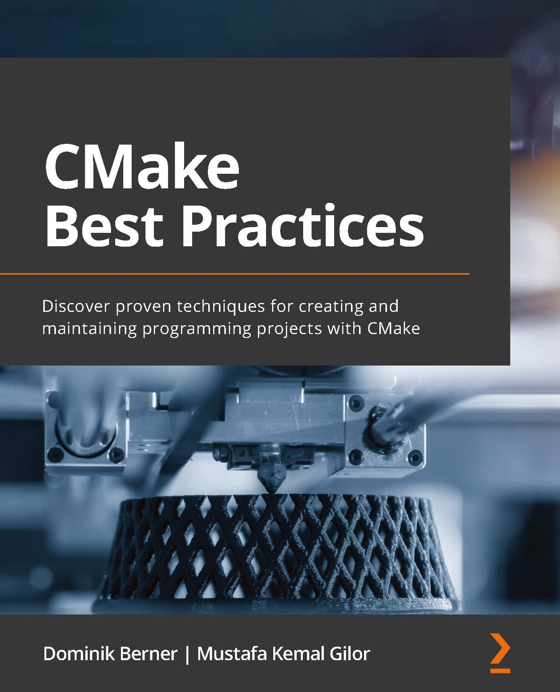

# CMake Best Practices

*Discover proven techniques for creating and maintaining programming projects with CMake *

*(使用CMake創建和維護項目)*

* 作者：Dominik Berner, Mustafa Kemal Gilor  
* 譯者：陳曉偉
* 首次發佈時間：2022年5月27日([來源](https://www.amazon.com/dp/1803239727))

> 翻譯是譯者用自己的思想，換一種語言，對原作者想法的重新闡釋。鑑於我的學識所限，誤解和錯譯在所難免。如果你能買到本書的原版，且有能力閱讀英文，請直接去讀原文。因為與之相較，我的譯文可能根本不值得一讀。
>
> 
 — 雲風，程序員修煉之道第2版譯者

PDF可在本庫的[Release頁面](https://github.com/xiaoweiChen/CMake-Best-Practices/releases)獲取。

## 本書概述

CMake是一個強大的工具，用於執行各種各樣的任務，所以很難找到一個起點進行學習CMake。這本書更專注於了最常見的任務，邊實踐邊學習CMake。CMake文檔很全面，但缺少具有代表性的例子，說明如何將源碼組合在一起，特別是互聯網上還有有很奇淫技巧和過時的解決方案。本書的重點是幫助讀者把需要做的事情串在一起，編寫CMake，從而創建簡潔和可維護的項目。

閱讀本書後，不僅可以掌握CMake的基礎知識，而且還可以通過構建大型複雜項目和創建在任何編程環境中運行的構建示例。還可以使用集成和自動化的各種工具，以提高整體軟件質量的方法，例如：測試框架、模糊測試器和自動生成文檔。編寫代碼只是工作的一半，本書還會引導讀者對程序進行安裝、打包和分發，這些都是為使用CI/CD的現代開發工作流程需要的基礎功能。

讀完這本書，將能以最好的方式使用CMake建立和維護複雜的軟件項目。

#### 關鍵特性

- 理解CMake是什麼，如何工作，如何與其交互
- 瞭解如何正確地創建和維護結構良好的CMake項目
- 探索工具和技術，以最大程度的使用CMake管理項目

#### 將會學到

- 構建結構良好的CMake項目

- 跨項目模塊化和重用CMake代碼

- 將各種靜態分析、檢測、格式化和文檔生成工具集成到CMake項目中

- 嘗試進行跨平臺構建

- 瞭解如何使用不同的工具鏈

- 為項目構建一個定義良好，且可移植的構建環境

  

## 適讀人群

這本書針對軟件工程師和構建系統維護人員，他們經常使用C或C++，使用CMake可以更好地完成他們的日常任務。對C++和一般編程知識有所瞭解的話，會有助於您更好地理解書中的例子。

## 作者簡介

**Dominik Berner**是一位擁有20年專業軟件開發經驗的軟件工程師、博客作者和演講者。主要使用C++，還參與了許多軟件項目，從為初創公司的外科手術模擬器編寫前沿軟件，到為MedTech行業的大型企業維護大型平臺，再到為介於兩者之間的公司創建物聯網解決方案。他相信，良好設計和維護的構建環境是使團隊高效編寫軟件，並創建高質量軟件的關鍵因素之一。當他不寫代碼的時候，偶爾會去博客寫一些文章，或者在會議上發表一些關於軟件開發的演講。

> "我想感謝為本書做出貢獻的人們:合著者Mustafa Gilor，他補充了我的專業知識；Kinnari Chohan是一個出色的編輯；Gebin George啟動了這本書，以及Packt的整個團隊。非常感謝我們的技術評審，Richard von Lehe, Horváth V.和Toni Solarin-Sodara。最後，感謝我的家人，Brigitte、Alice和Theo，在我寫這本書的時候給予我耐心和支持!"  
>
> 
 —Dominik Berner

**Mustafa Kemal Gilor**是一位經驗豐富的專業人員，從事電信、國防工業和開源軟件的性能關鍵軟件開發。他的專長是高性能和可擴展的軟件設計、網絡技術、DevOps和軟件架構。他對計算機的興趣在童年時期就顯現出來了。他在12歲左右學習編程破解MMORPG遊戲，從那時起他就一直在編寫軟件。他最喜歡的編程語言是C++，並且喜歡做框架設計和系統編程，也是CMake的堅定倡導者。他的職業生涯中，維護了許多代碼庫，並將許多遺留(非CMamek)項目移植到CMake。

> "首先，我要感謝我的合著者，Packt Publishing的Dominik Berner，以及所有用他們寶貴的工作使這本書成為可能的技術審評。我還要感謝我生命中最善良、最理解我的人——我的妻子Büşra，在寫作的過程中，她給了我所需要的支持和鼓勵。最後，我要感謝家人和朋友Gürcan Pehlevan, Ramazan Cömert, Mustafa Hergül, Habip İşler，以及Ahmet Aksoy，感謝他們在整個過程中對我的信任和支持。"  
>
> 
 —Mustafa Kemal Gilor 

## 審評者介紹

**Richard Von Lehe** 住在明尼蘇達州的雙城地區。過去的幾年中，他在軟件項目中經常使用CMake，包括正畸建模、建築控制、無人機避免碰撞和專用打印機。閒暇時，他喜歡和家人以及他們的寵物兔子Gus一起放鬆。他還喜歡騎自行車和彈吉他。

**Toni Solarin-Solada** 是一名軟件工程師，專門設計抽象底層操作系統服務的跨平臺編程庫。

## 本書相關

* github地址：https://github.com/xiaoweiChen/CMake-Best-Practices
* 譯文的LaTeX 環境配置：https://www.cnblogs.com/1625--H/p/11524968.html 
  * 禁用拼寫檢查：https://blog.csdn.net/weixin_39278265/article/details/87931348

* vscode中配置latex：https://blog.csdn.net/Ruins_LEE/article/details/123555016
* 原書示例：https://github.com/PacktPublishing/CMake-Best-Practices

