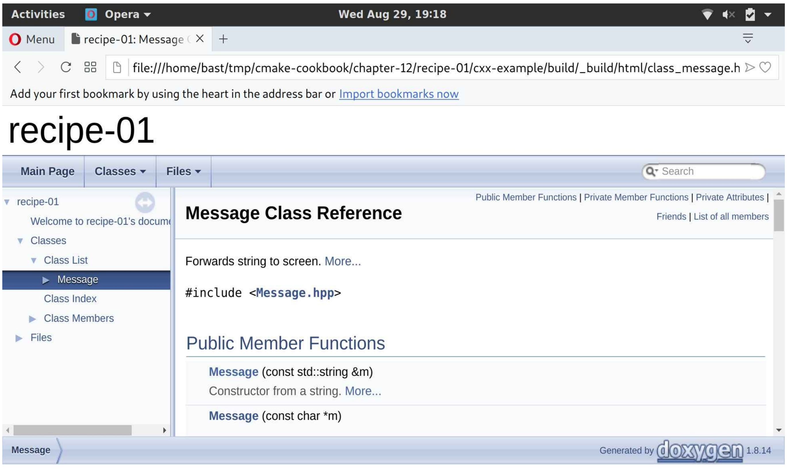

# 12.1 使用Doxygen構建文檔

**NOTE**:*此示例代碼可以在 https://github.com/dev-cafe/cmake-cookbook/tree/v1.0/chapter-12/recipe-01 中找到，其中包含一個C++示例。該示例在CMake 3.5版(或更高版本)中是有效的，並且已經在GNU/Linux、macOS和Windows上進行過測試。*

Doxygen(http://www.doxygen.nl )是非常流行的源代碼文檔工具。可以在代碼中添加文檔標記作為註釋，而後運行Doxygen提取這些註釋，並以Doxyfile配置文件中定義的格式創建文檔。Doxygen可以輸出HTML、XML，甚至LaTeX或PDF。本示例將展示，如何使用CMake來構建Doxygen文檔。

## 準備工作

使用前幾章中介紹的消息庫的簡化版本。目錄結構如下:

```shell
.
├── cmake
│    └── UseDoxygenDoc.cmake
├── CMakeLists.txt
├── docs
│    ├── Doxyfile.in
│    └── front_page.md
└── src
    ├── CMakeLists.txt
    ├── hello-world.cpp
    ├── Message.cpp
    └── Message.hpp
```

我們仍然在`src`子目錄下放置源代碼，並且在CMake子目錄中有自定義的CMake模塊。由於重點是文檔，所以消除了對UUID的依賴，並簡化了源代碼。最大的區別是頭文件中的大量代碼註釋：

```c++
#pragma once

#include <iosfwd>
#include <string>

/ * ! \file Message.hpp * /

/*! \class Message
* \brief Forwards string to screen
* \author Roberto Di Remigio
* \date 2018
* /

class Message {
public:
  /*! \brief Constructor from a string
  * \param[in] m a message
  */
  Message(const std::string &m) : message_(m) {}
  /*! \brief Constructor from a character array
  * \param[in] m a message
  */
  Message(const char * m): message_(std:: string(m)){}
  
  friend std::ostream &operator<<(std::ostream &os, Message &obj) {
    return obj.printObject(os);
  }
private:
  /*! The message to be forwarded to screen */
  std::string message_;
  /*! \brief Function to forward message to screen
  * \param[in, out] os output stream
  */
  std::ostream &printObject(std::ostream &os);
};
```

這些註釋的格式是`/*!*/`，幷包含一些Doxygen可以理解的特殊標記(參見http://www.stack.nl/~dimitri/Doxygen/manual/docblocks.html )。

## 具體實施

首先，來看看根目錄下的`CMakeLists.txt`：

1. 我們聲明瞭一個C++11項目：

   ```cmake
   cmake_minimum_required(VERSION 3.5 FATAL_ERROR)
   project(recipe-01 LANGUAGES CXX)
   set(CMAKE_CXX_STANDARD 11)
   set(CMAKE_CXX_EXTENSIONS OFF)
   set(CMAKE_CXX_STANDARD_REQUIRED ON)
   ```

2. 為動態庫和靜態庫，以及可執行文件定義了輸出目錄：

   ```cmake
   include(GNUInstallDirs)
   set(CMAKE_ARCHIVE_OUTPUT_DIRECTORY
   	${CMAKE_BINARY_DIR}/${CMAKE_INSTALL_LIBDIR})
   set(CMAKE_LIBRARY_OUTPUT_DIRECTORY
   	${CMAKE_BINARY_DIR}/${CMAKE_INSTALL_LIBDIR})
   set(CMAKE_RUNTIME_OUTPUT_DIRECTORY
   	${CMAKE_BINARY_DIR}/${CMAKE_INSTALL_BINDIR})
   ```

3. 將`cmake`子目錄追加到`CMAKE_MODULE_PATH`。這是需要CMake找到我們的自定義模塊：

   ```cmake
   list(APPEND CMAKE_MODULE_PATH "${CMAKE_SOURCE_DIR}/cmake")
   ```

4. `UseDoxygenDoc.cmake`自定義模塊。將在後面討論它的內容:

   ```cmake
   include(UseDoxygenDoc)
   ```

5. 然後添加`src`子目錄:

   ```cmake
   add_subdirectory(src)
   ```

`src`子目錄中的`CMakeLists.txt`文件包含以下構建塊:

1. 添加了消息庫:

   ```cmake
   add_library(message STATIC
     Message.hpp
     Message.cpp
     )
   ```

2. 然後，聲明`add_doxygen_doc`函數。這個函數可以理解這些參數：BUILD_DIR、DOXY_FILE、TARGET_NAME和COMMENT。使用`cmake_parse_arguments`標準CMake命令解析這些參數：

   ```cmake
   function(add_doxygen_doc)
     set(options)
     set(oneValueArgs BUILD_DIR DOXY_FILE TARGET_NAME COMMENT)
     set(multiValueArgs)
     
     cmake_parse_arguments(DOXY_DOC
       "${options}"
       "${oneValueArgs}"
       "${multiValueArgs}"
       ${ARGN}
     )
   
     # ...
   endfunction()
   ```

3. Doxyfile包含用於構建文檔的所有Doxygen設置。一個模板`Doxyfile.in`文件作為函數參數`DOXY_FILE`傳遞，並解析為`DOXY_DOC_DOXY_FILE`變量。使用如下方式，配置模板文件`Doxyfile.in`:

   ```cmake
   configure_file(
     ${DOXY_DOC_DOXY_FILE}
     ${DOXY_DOC_BUILD_DIR}/Doxyfile
     @ONLY
     )
   ```

4. 然後，定義了一個名為`DOXY_DOC_TARGET_NAME`的自定義目標，它將使用Doxyfile中的設置執行Doxygen，並在`DOXY_DOC_BUILD_DIR`中輸出結果:

   ```cmake
   add_custom_target(${DOXY_DOC_TARGET_NAME}
     COMMAND
       ${DOXYGEN_EXECUTABLE} Doxyfile
     WORKING_DIRECTORY
       ${DOXY_DOC_BUILD_DIR}
     COMMENT
       "Building ${DOXY_DOC_COMMENT} with Doxygen"
     VERBATIM
     )
   ```

5. 最後，為用戶打印一條狀態信息:

   ```cmake
   message(STATUS "Added ${DOXY_DOC_TARGET_NAME} [Doxygen] target to build documentation")
   ```

可以像往常一樣配置項目：

```shell
$ mkdir -p build
$ cd build
$ cmake ..
$ cmake --build .
```

可以通過調用自定義文檔目標來構建文檔:

```shell
$ cmake --build . --target docs
```

您將注意到構建樹中出現了一個`_build`子目錄。它包含Doxygen從源文件生成的HTML文檔。用瀏覽器打開`index.html`將顯示Doxygen歡迎頁面。

如果導航到類列表，例如：可以瀏覽Message類的文檔:



## 工作原理

默認情況下，CMake不支持文檔構建。但是，我們可以使用`add_custom_target`執行任意操作。需要注意的是，需要確保構建文檔所需的工具(本例中是Doxygen和Perl)在系統上可用。

此外，請注意`  UseDoxygenDoc.cmake`自定義模塊只做以下工作:

* 執行對Doxygen和Perl可執行程序的搜索
* 定義函數

使用`add_doxygen_doc`函數對文檔目標進行創建。這個顯式模式要優於隱式模式，我們也認為這是很好的實踐方式：不要使用模塊來執行類似宏(或函數)的操作。

為了限制變量定義的範圍和可能出現的副作用，我們使用函數而不是宏實現了`add_doxygen_doc`。這種情況下，函數和宏都可以工作(並且會產生相同的結果)，但是建議優先使用函數而不是宏，除非需要修改父範圍中的變量。

**NOTE**:*在cmake 3.9中添加了`FindDoxygen.cmake`模塊。實現了`doxygen_add_docs`函數，其行為與我們在本示例中給出的宏類似。要了解更多細節，請訪問https://cmake.org/cmake/help/v3.9/module/FindDoxygen.html 查看在線文檔。*

