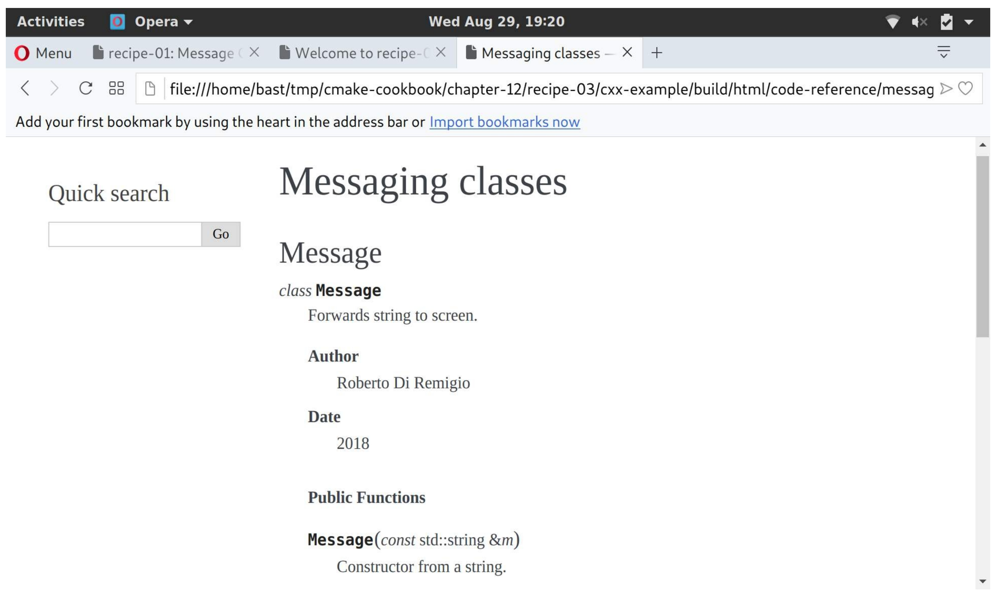

# 12.3 結合Doxygen和Sphinx

**NOTE**:*此示例代碼可以在 https://github.com/dev-cafe/cmake-cookbook/tree/v1.0/chapter-12/recipe-03 中找到，其中包含一個C++示例。該示例在CMake 3.5版(或更高版本)中是有效的，並且已經在GNU/Linux、macOS和Windows上進行過測試。*

我們有一個C++項目，因此Doxygen是生成源代碼文檔的理想選擇。然而，我們也希望發佈面向用戶的文檔，例如：介紹設計選擇。所以我們想使用Sphinx，因為生成的HTML也可以在移動設備上查看，而且可以部署文檔進行在線閱讀(https://readthedocs.org )。本教程將演示如何使用Breathe插件(https://breathe.readthedocs.io )組合Doxygen和Sphinx。

## 準備工作

這個示例的目錄結構，類似於之前的兩個示例:

```shell
.
├── cmake
│    ├── FindPythonModule.cmake
│    ├── FindSphinx.cmake
│    └── UseBreathe.cmake
├── CMakeLists.txt
├── docs
│    ├── code-reference
│    │    ├── classes-and-functions.rst
│    │    └── message.rst
│    ├── conf.py.in
│    ├── Doxyfile.in
│    └── index.rst
└── src
    ├── CMakeLists.txt
    ├── hello-world.cpp
    ├── Message.cpp
    └── Message.hpp
```

`docs`子目錄現在同時包含一個` Doxyfile.in`和一個`conf.py.in`模板文件。模板文件中，分別設置了Doxygen和Sphinx。此外，還有一個`code-referenc`子目錄。

`code-referenc`子目錄中的文件包含Breathe指令，用來在Sphinx中包含doxygen生成的文檔：

```txt
Messaging classes
=================
Message
-------
..  doxygenclass:: Message
    :project: recipe-03
    :members:
    :protected-members:
    :private-members:
```

這將輸出Message類的文檔。

## 具體實施

`src`目錄中的`CMakeLists.txt`文件沒有改變。主`CMakeLists.txt`文件中有修改：

1. 包含` UseBreathe.cmake`自定義模塊：

   ```cmake
   list(APPEND CMAKE_MODULE_PATH "${CMAKE_SOURCE_DIR}/cmake")
   include(UseBreathe)
   ```

2. 調用`add_breathe_doc`函數，這個函數是在自定義模塊中定義的，它接受關鍵字參數，來設置Doxygen和Sphinx：

   ```cmake
   add_breathe_doc(
     SOURCE_DIR
       ${CMAKE_CURRENT_SOURCE_DIR}/docs
     BUILD_DIR
       ${CMAKE_CURRENT_BINARY_DIR}/_build
     CACHE_DIR
       ${CMAKE_CURRENT_BINARY_DIR}/_doctrees
     HTML_DIR
       ${CMAKE_CURRENT_BINARY_DIR}/html
     DOXY_FILE
       ${CMAKE_CURRENT_SOURCE_DIR}/docs/Doxyfile.in
     CONF_FILE
       ${CMAKE_CURRENT_SOURCE_DIR}/docs/conf.py.in
     TARGET_NAME
       docs
     COMMENT
       "HTML documentation"
     )
   ```

讓我們看一下`UseBreatheDoc.cmake`模塊，其遵循了與我們在前兩個示例中描述的顯式模式。具體描述如下:

1. 文檔生成依賴於Doxygen:

   ```cmake
   find_package(Doxygen REQUIRED)
   find_package(Perl REQUIRED)
   ```

2. 還依賴於Python解釋器和Sphinx:

   ```cmake
   find_package(PythonInterp REQUIRED)
   find_package(Sphinx REQUIRED)
   ```

3. 此外，還必須找到breathe的Python模塊。這裡，我們使用`FindPythonModule.cmake`模塊:

   ```cmake
   include(FindPythonModule)
   find_python_module(breathe REQUIRED)
   ```

4. 定義了`add_breathe_doc`函數，這個函數有一個單值關鍵字參數，我們將使用`cmake_parse_arguments`命令解析它:

   ```cmake
   function(add_breathe_doc)
     set(options)
     set(oneValueArgs
       SOURCE_DIR
       BUILD_DIR
       CACHE_DIR
       HTML_DIR
       DOXY_FILE
       CONF_FILE
       TARGET_NAME
       COMMENT
       )
     set(multiValueArgs)
   
     cmake_parse_arguments(BREATHE_DOC
       "${options}"
       "${oneValueArgs}"
       "${multiValueArgs}"
       ${ARGN}
       )
   
     # ...
   
   endfunction()
   ```

5. `BREATHE_DOC_CONF_FILE`中的Sphinx模板文件，會通過`conf.py`配置到的`BREATHE_DOC_BUILD_DIR`目錄下：

   ```cmake
   configure_file(
     ${BREATHE_DOC_CONF_FILE}
     ${BREATHE_DOC_BUILD_DIR}/conf.py
     @ONLY
     )
   ```

6. 相應地，Doxygen的`BREATHE_DOC_DOXY_FILE`模板文件配置為`BREATHE_DOC_BUILD_DIR`中的Doxyfile:

   ```cmake
   configure_file(
     ${BREATHE_DOC_DOXY_FILE}
     ${BREATHE_DOC_BUILD_DIR}/Doxyfile
     @ONLY
     )
   ```

7. 添加`BREATHE_DOC_TARGET_NAME`自定義目標。注意，只有Sphinx在運行時，對Doxygen的調用才發生在`BREATHE_DOC_SPHINX_FILE`中:

   ```cmake
   add_custom_target(${BREATHE_DOC_TARGET_NAME}
     COMMAND
       ${SPHINX_EXECUTABLE}
         -q
         -b html
         -c ${BREATHE_DOC_BUILD_DIR}
         -d ${BREATHE_DOC_CACHE_DIR}
         ${BREATHE_DOC_SOURCE_DIR}
         ${BREATHE_DOC_HTML_DIR}
     COMMENT
       "Building ${BREATHE_DOC_TARGET_NAME} documentation with Breathe, Sphinx and Doxygen"
     VERBATIM
     )
   ```

8. 最後，打印一條狀態信息:

   ```cmake
   message(STATUS "Added ${BREATHE_DOC_TARGET_NAME} [Breathe+Sphinx+Doxygen] target to build documentation")
   ```

9. 配置完成後，構建文檔:

   ```shell
   $ mkdir -p build
   $ cd build
   $ cmake ..
   $ cmake --build . --target docs
   ```

該文檔將在`BREATHE_DOC_HTML_DIR`子目錄中可用。啟動瀏覽器打開`index.html`文件後，可以導航到Message類的文檔:



## 工作原理

儘管在聲明定製的`BREATHE_DOC_TARGET_NAME`目標時只調用了Sphinx，但這裡Doxygen和Sphinx都在運行。這要感謝Sphinx的`conf.py`文件中的以下設置:

```python
def run_doxygen(folder):
  """Run the doxygen make command in the designated folder"""

  try:
      retcode = subprocess.call("cd {}; doxygen".format(folder), shell=True)
    if retcode < 0:
      sys.stderr.write(
      "doxygen terminated by signal {}".format(-retcode))
  except OSError as e:
    sys.stderr.write("doxygen execution failed: {}".format(e))


def setup(app):
  run_doxygen('@BREATHE_DOC_BUILD_DIR@')
```

Doxygen將生成XML輸出，Breathe插件將能夠與所選擇的Sphinx文檔樣式一致的形式，呈現XML輸出。

