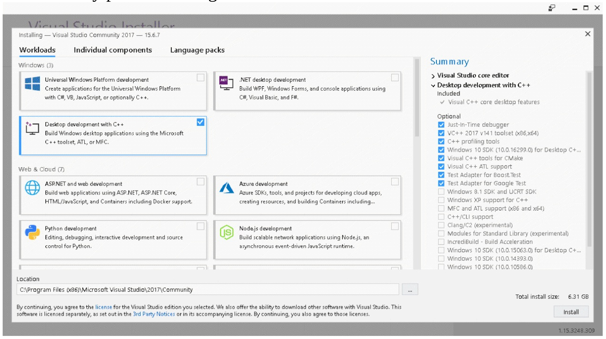
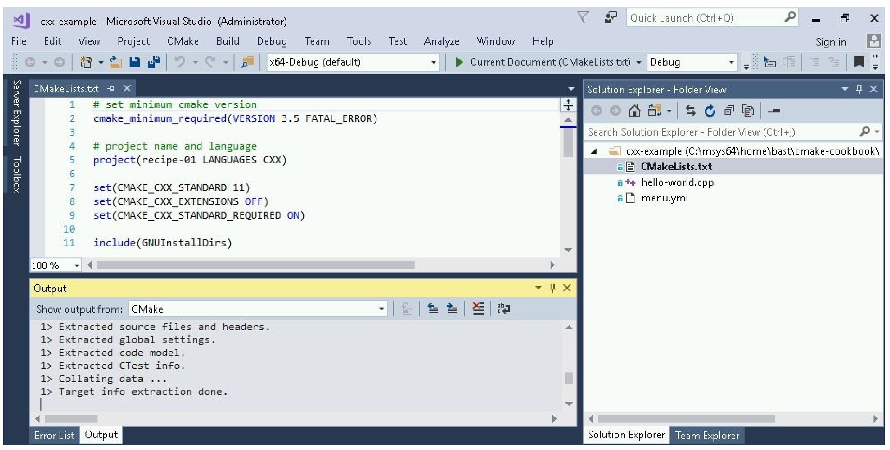
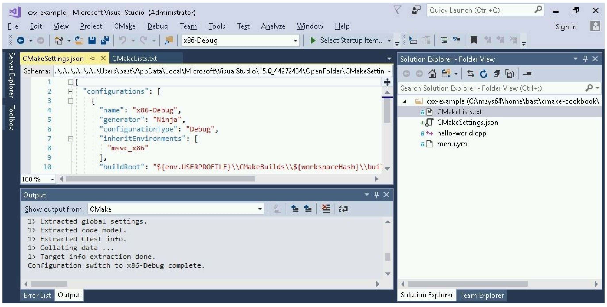

# 13.1 使用CMake構建Visual Studio 2017項目

**NOTE**:*此示例代碼可以在 https://github.com/dev-cafe/cmake-cookbook/tree/v1.0/chapter-13/recipe-01 中找到，其中包含一個C++示例。該示例在CMake 3.5版(或更高版本)中是有效的，並且已經在GNU/Linux、macOS和Windows上進行過測試。*

早期版本的Visual Studio要求開發人員在不同的Windows版本中編輯源代碼並運行CMake命令，但Visual Studio 2017引入了對CMake項目的內置支持( https://aka.ms/cmake )，它允許在同一個IDE中發生整個編碼、配置、構建和測試工作流。本示例中，不需要使用命令行，我們將直接使用Visual Studio 2017構建一個簡單的“hello world”CMake示例項目。

## 準備工作

首先，下載並安裝Visual Studio Community 2017 (https://www.visualstudio.com/downloads/ )。在撰寫本文時，這個版本是免費的，有30天的試用期。我們將遵循的視頻中的步驟:https://www.youtube.com/watch?v=_lKxJjV8r3Y

運行安裝程序時，在左側面板上選擇`Desktop development with C++`，並在右側的Summary面板上選擇用於CMake的Visual C++工具：



Visual Studio 2017 15.4中，還可以為Linux平臺進行構建。為此，在工具集中選擇`Linux development with C++`:


選擇後，只要配置Linux服務器的訪問權限，就可以從Visual Studio中同時對Windows和Linux機器進行構建。我們不在本章中演示這種方法。

這個示例中，我們將在Windows上構建一個二進制文件，我們的目標是配置和構建以下示例代碼(`hello-world.cpp`)：

```c++
#include <cstdlib>
#include <iostream>
#include <string>
const std::string cmake_system_name = SYSTEM_NAME;
int main() {
  std::cout << "Hello from " << cmake_system_name << std::endl;
  
  return EXIT_SUCCESS;
}
```

## 具體實施

創建相應的源碼：

1. 創建一個目錄，並將`hello-world.cpp`放在新目錄中。

2. 目錄中，創建一個`CMakeLists.txt`文件，其內容為:

   ```cmake
   # set minimum cmake version
   cmake_minimum_required(VERSION 3.5 FATAL_ERROR)
   
   # project name and language
   project(recipe-01 LANGUAGES CXX)
   
   set(CMAKE_CXX_STANDARD 11)
   set(CMAKE_CXX_EXTENSIONS OFF)
   set(CMAKE_CXX_STANDARD_REQUIRED ON)
   
   include(GNUInstallDirs)
   set(CMAKE_ARCHIVE_OUTPUT_DIRECTORY
     ${CMAKE_BINARY_DIR}/${CMAKE_INSTALL_LIBDIR})
   set(CMAKE_LIBRARY_OUTPUT_DIRECTORY
     ${CMAKE_BINARY_DIR}/${CMAKE_INSTALL_LIBDIR})
   set(CMAKE_RUNTIME_OUTPUT_DIRECTORY
     ${CMAKE_BINARY_DIR}/${CMAKE_INSTALL_BINDIR})
   
   # define executable and its source file
   add_executable(hello-world hello-world.cpp)
   
   # we will print the system name in the code
   target_compile_definitions(hello-world
     PUBLIC
       "SYSTEM_NAME=\"${CMAKE_SYSTEM_NAME}\""
     )
   
   install(
     TARGETS
       hello-world
     DESTINATION
       ${CMAKE_INSTALL_BINDIR}
     )
   ```

3. 打開Visual Studio 2017，然後通過下面的`File ->Open ->
   Folder`，選擇到新創建的包含源文件和`CMakeLists.txt`的文件夾下。

4. 打開文件夾後，請注意CMake配置步驟是如何運行的(面板底部)：

   

5. 現在，可以右鍵單擊`CMakeLists.txt`(右面板)，並選擇`Build`:

   

6. 構建項目(參見底部面板上的輸出):

   

7. 這就成功地編譯了可執行文件。下一小節中，我們將學習如何定位可執行文件，並更改構建和安裝路徑。

## 工作原理

我們已經看到Visual Studio 2017能很好地對接CMake，並且已經能夠在IDE中配置和構建代碼。除了構建步驟之外，還可以運行安裝或測試步驟。可以通過右鍵單擊`CMakeLists.txt`(右面板)，訪問這些文件。

然而，配置步驟是自動運行的，我們可能更想去修改配置選項。我們還想知道實際的構建和安裝路徑，以便測試我們的可執行文件。為此，我們可以選擇`CMake -> Change CMake Settings`，如下圖所示:



面板左上角，可以檢查和修改生成器(本例中是Ninja)、設置、參數以及路徑。構建路徑在前面的顯示中可以看到。這些設置被分組為構建類型(`x86-Debug`、`x86-Release`等等)，我們可以在面板欄頂部的中間部分，通過選擇切換構建類型。

現在知道了構建路徑，可以測試編譯後的可執行文件:

```shell
$ ./hello-world.exe

Hello from Windows
```

當然，構建和安裝路徑可以進行修改。

## 更多信息

* Visual Studio支持CMake:  https://aka.ms/cmake
* 使用CMake，基於Visual C++開發Linux應用：https://blogs.msdn.microsoft.com/vcblog/2017/08/25/visual-c-for-linux-development-with-cmake/
* Visual Studio官方文檔：https://www.visualstudio.com/vs/features/ide/