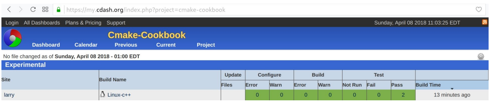
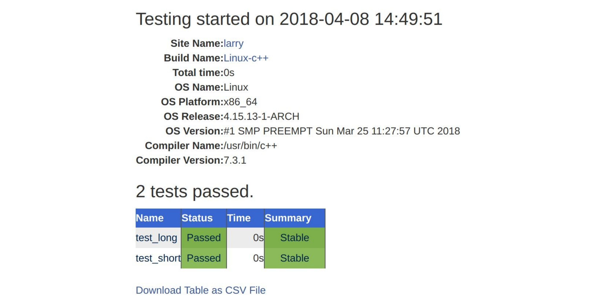

# 14.1 將測試部署到CDash

**NOTE**:*此示例代碼可以在 https://github.com/dev-cafe/cmake-cookbook/tree/v1.0/chapter-14/recipe-01 中找到，其中包含一個C++示例。該示例在CMake 3.5版(或更高版本)中是有效的，並且已經在GNU/Linux、macOS和Windows上進行過測試。*

本示例中，我們將擴展第4章第1節的測試示例，並將測試結果部署到https://my.cdash.org/index.php?project=cmake-cookbook ，這是在Kitware為社區提供的公共面板( https://my.cdash.org )的基礎上，為本書創建的專屬面板。

## 準備工作

我們將從重用第1節中的示例源代碼，該測試將整數作為命令行參數進行求和。該示例由三個源文件組成:`main.cpp`、`sum_integer.cpp`和`sum_integers.hpp`。我們還將重用第4章(創建和運行測試)中的`test.cpp`文件，但這裡將它重命名為`test_short.cpp`。我們將使用`test_long.cpp`擴展這個例子:

```c++
#include "sum_integers.hpp"

#include <numeric>
#include <vector>

int main() {
  
  // creates vector {1, 2, 3, ..., 999, 1000}
  std::vector integers(1000);
  std::iota(integers.begin(), integers.end(), 1);

	if (sum_integers(integers) == 500500) {
  	return 0;
  } else {
  	return 1;
  }
}
```
然後，將這些文件組織成以下文件樹:

```shell
.
├── CMakeLists.txt
├── CTestConfig.cmake
├── src
│    ├── CMakeLists.txt
│    ├── main.cpp
│    ├── sum_integers.cpp
│    └── sum_integers.hpp
└── tests
    ├── CMakeLists.txt
    ├── test_long.cpp
    └── test_short.cpp
```

## 具體實施

現在，我們將演示如何配置、構建、測試。最後，將示例項目的測試結果提交到面板的過程：

1. 源目標在`src/CMakeLists.txt`中定義，如下：

   ```cmake
   # example library
   add_library(sum_integers "")
   
   target_sources(sum_integers
     PRIVATE
     	sum_integers.cpp
     PUBLIC
     	${CMAKE_CURRENT_LIST_DIR}/sum_integers.hpp
     )
   
   target_include_directories(sum_integers
     PUBLIC
     	${CMAKE_CURRENT_LIST_DIR}
     )
   
   # main code
   add_executable(sum_up main.cpp)
   
   target_link_libraries(sum_up sum_integers)
   ```

2. `tests/CMakeLists.txt`中定義了測試：

   ```cmake
   add_executable(test_short test_short.cpp)
   target_link_libraries(test_short sum_integers)
   
   add_executable(test_long test_long.cpp)
   target_link_libraries(test_long sum_integers)
   
   add_test(
     NAME
     	test_short
     COMMAND
     	$<TARGET_FILE:test_short>
     )
   
   add_test(
     NAME
     	test_long
     COMMAND
     	$<TARGET_FILE:test_long>
     )
   ```

3. 主`CMakeLists.txt`文件引用前面的兩個文件，這個配置中的新元素是`include(CTest)`，這樣就可以向CDash儀錶板報告結果：

   ```cmake
   # set minimum cmake version
   cmake_minimum_required(VERSION 3.5 FATAL_ERROR)
   
   # project name and language
   project(recipe-01 LANGUAGES CXX)
   
   # require C++11
   set(CMAKE_CXX_STANDARD 11)
   set(CMAKE_CXX_EXTENSIONS OFF)
   set(CMAKE_CXX_STANDARD_REQUIRED ON)
   
   # process src/CMakeLists.txt
   add_subdirectory(src)
   enable_testing()
   
   # allow to report to a cdash dashboard
   include(CTest)
   
   # process tests/CMakeLists.txt
   add_subdirectory(tests)
   ```

4. 另外，我們創建文件`CTestConfig.cmake`與主`CMakeLists.txt`文件位於同一目錄中。這個新文件包含以下幾行：

   ```cmake
   set(CTEST_DROP_METHOD "http")
   set(CTEST_DROP_SITE "my.cdash.org")
   set(CTEST_DROP_LOCATION "/submit.php?project=cmake-cookbook")
   set(CTEST_DROP_SITE_CDASH TRUE)
   ```

5. 我們現在已經準備好配置和構建項目：

   ```shell
   $ mkdir -p build
   $ cd build
   $ cmake ..
   $ cmake --build .
   ```

6. 構建後，運行測試集，並向面板報告測試結果：

   ```shell
   $ ctest --dashboard Experimental
   
   Site: larry
   Build name: Linux-c++
   Create new tag: 20180408-1449 - Experimental
   Configure project
   Each . represents 1024 bytes of output
   . Size of output: 0K
   Build project
   Each symbol represents 1024 bytes of output.
   '!' represents an error and '*' a warning.
   . Size of output: 0K
   0 Compiler errors
   0 Compiler warnings
   Test project /home/user/cmake-recipes/chapter-15/recipe-01/cxx-example/build
   Start 1: test_short
   1/2 Test #1: test_short ....................... Passed 0.00 sec
   Start 2: test_long
   2/2 Test #2: test_long ........................ Passed 0.00 sec
   100% tests passed, 0 tests failed out of 2
   Total Test time (real) = 0.01 sec
   Performing coverage
   Cannot find any coverage files. Ignoring Coverage request.
   Submit files (using http)
   Using HTTP submit method
   Drop site:http://my.cdash.org/submit.php?project=cmake-cookbook
   Uploaded: /home/user/cmake-recipes/chapter-14/recipe-01/cxx-example/build/Testing/20180408-1449/Build.xml
   Uploaded: /home/user/cmake-recipes/chapter-14/recipe-01/cxx-example/build/Testing/20180408-1449/Configure.xml
   Uploaded: /home/user/cmake-recipes/chapter-14/recipe-01/cxx-example/build/Testing/20180408-1449/Test.xml
   Submission successful
   ```

7. 最後，可以在瀏覽器中看到測試結果(本例中，測試結果上報到 https://my.cdash.org/index.php?project=cmake-cookbook ):

   

## 工作原理

可以從更高級的角度展示工作流，CTest運行測試並在XML文件中記錄結果。然後，將這些XML文件發送到CDash服務器，在那裡可以瀏覽和分析它們。通過單擊數字`2`，獲得關於通過或失敗測試的更多的細節信息(本例中，沒有失敗的測試)。如下圖所示，詳細記錄了運行測試的機器的信息，以及時間信息。同樣，單個測試的測試輸出也可以在線瀏覽。



CTest支持三種不同的提交模式：

* 實驗性構建
* 夜間構建
* 持續構建

我們使用了` ctest --dashboard Experimental `(實驗性構建提交)，因此，測試結果顯示在實驗模式之下。實驗模式對於測試代碼的當前狀態、調試新的儀錶板腳本、調試CDash服務器或項目非常有用。夜間構建模式，將把代碼更新(或降級)到最接近最近夜間構建開始時的存儲庫，這些可以在`  CTestConfig.cmake `中設置。其為接收更新頻繁的項目的所有夜間測試提供一個定義良好的參考。例如，夜間開始時間可以設置為世界時的"午夜"：

```cmake
set(CTEST_NIGHTLY_START_TIME "00:00:00 UTC")
```

持續模式對於集成工作流非常有用，它將把代碼更新到最新版本。

**TIPS**:*構建、測試和提交到實驗面板只需要一個命令—` cmake --build . --target Experimental`*

## 更多信息

這個示例中，我們直接從測試目標部署到CDash。我們將在本章後面的第3和第4部分中，使用專用的CTest腳本。

CDash不僅可以監視測試是否通過或失敗，還可以看到測試時間。可以為測試計時進行配置：如果測試花費的時間超過分配的時間，它將被標記為失敗。這對於基準測試非常有用，可以在重構代碼時自動檢測性能測試用例的性能情況。

有關CDash定義和配置設置的詳細討論，請參見官方CDash文檔，網址為 https://public.kitware.com/Wiki/CDash:Documentation