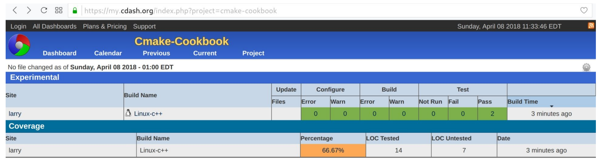
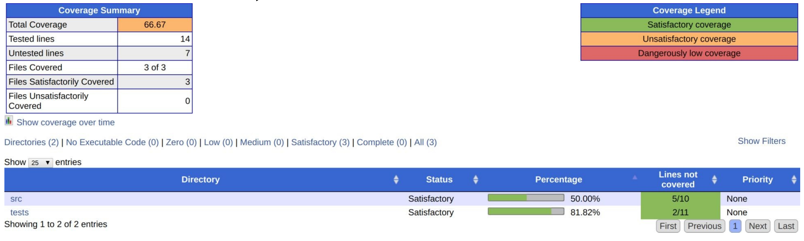
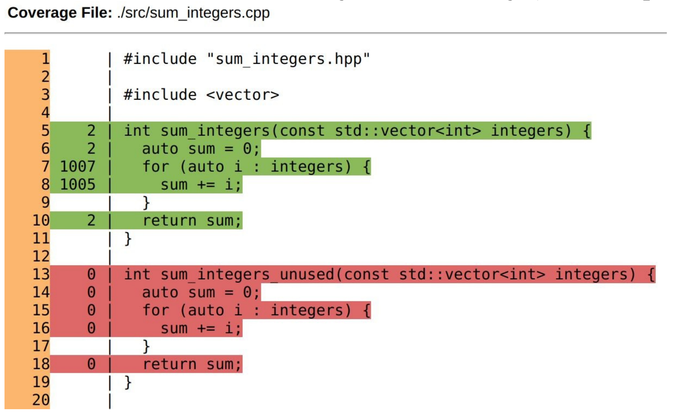

# 14.2 CDash顯示測試覆蓋率

**NOTE**:*此示例代碼可以在 https://github.com/dev-cafe/cmake-cookbook/tree/v1.0/chapter-14/recipe-02 中找到，其中包含一個C++示例。該示例在CMake 3.5版(或更高版本)中是有效的，並且已經在GNU/Linux、macOS和Windows上進行過測試。*

本示例中，我們將測試覆蓋率報告給CDash，面板上將能夠逐行瀏覽測試覆蓋率分析，以便識別未測試或未使用的代碼。

## 準備工作

我們將擴展前一節的源代碼，在`src/sum_integers.cpp`中做一個小的修改，添加一個函數` sum_integers_unused `:

```c++
#include "sum_integers.hpp"

#include <vector>

int sum_integers(const std::vector integers) {
  auto sum = 0;
  
  for (auto i : integers) {
  	sum += i;
  }
  
  return sum;
}

int sum_integers_unused(const std::vector integers) {
  auto sum = 0;
  
  for (auto i : integers) {
  	sum += i;
  }
  
  return sum;
}
```

我們使用gcov(https://gcc.gnu.org/onlinedocs/gcc/Gcov.html )通過覆蓋率分析檢測這個未使用的代碼。

## 具體實施

通過以下步驟，我們將使用覆蓋率分析，並將結果上傳到面板：

1. 主`CMakeLists.txt`和`tests/CMakeLists.txt`文件與前一個示例相同。

2. 我們將擴展`src/CMakeLists.txt`，並提供一個選項來添加用於代碼覆蓋率的編譯標誌。此選項默認啟用:

   ```cmake
   option(ENABLE_COVERAGE "Enable coverage" ON)
   
   if(ENABLE_COVERAGE)
     if(CMAKE_CXX_COMPILER_ID MATCHES GNU)
       message(STATUS "Coverage analysis with gcov enabled")
       target_compile_options(sum_integers
         PUBLIC
         	-fprofile-arcs -ftest-coverage -g
         )
       target_link_libraries(sum_integers
         PUBLIC
         	gcov
         )
     else()
     	message(WARNING "Coverage not supported for this compiler")
     endif()
   endif()
   ```

3. 然後，配置、構建，並將結果上傳CDash:

   ```shell
   $ mkdir -p build
   $ cd build
   $ cmake ..
   $ cmake --build . --target Experimental
   ```

4. 最後一步，執行測試覆蓋率分析:

   ```cmake
     Performing coverage
     Processing coverage (each . represents one file):
     ...
     Accumulating results (each . represents one file):
     ...
       Covered LOC: 14
       Not covered LOC: 7
       Total LOC: 21
       Percentage Coverage: 66.67%
   Submit files (using http)
     Using HTTP submit method
     Drop site:http://my.cdash.org/submit.php?project=cmake-cookbook
     Uploaded: /home/user/cmake-recipes/chapter-14/recipe-02/cxx-example/build/Testing/20180408-1530/Build.xml
     Uploaded: /home/user/cmake-recipes/chapter-14/recipe-02/cxx-example/build/Testing/20180408-1530/Configure.xml
     Uploaded: /home/user/cmake-recipes/chapter-14/recipe-02/cxx-example/build/Testing/20180408-1530/Coverage.xml
     Uploaded: /home/user/cmake-recipes/chapter-14/recipe-02/cxx-example/build/Testing/20180408-1530/CoverageLog-0.xml
     Uploaded: /home/user/cmake-recipes/chapter-14/recipe-02/cxx-example/build/Testing/20180408-1530/Test.xml
     Submission successful
   ```

5. 最後，可以在瀏覽器中驗證測試結果(本例的測試結果報告在 https://my.cdash.org/index.php?project=cmake-cookbook ):

   

## 工作原理

測試覆蓋率為66.67%。為了得到更深入的瞭解，我們可以點擊百分比，得到兩個子目錄的覆蓋率分析:



通過瀏覽子目錄鏈接，我們可以檢查單個文件的測試覆蓋率，甚至可以逐行瀏覽摘要(例如，`src/sum_integs.cpp`)：



運行測試時，綠線部分已經被覆蓋，而紅線部分則沒有。通過這個方法，我們不僅可以標識未使用的/未測試的代碼(使用`sum_integers_used`函數)，還可以查看每一行代碼被遍歷的頻率。例如，代碼行`sum += i`已經被訪問了1005次(在`test_short`期間訪問了5次，在`test_long`期間訪問了1000次)。測試覆蓋率分析是自動化測試不可或缺的功能，CDash為我們提供了一個界面，可以在瀏覽器中圖形化地瀏覽分析結果。

## 更多信息

為了更多的瞭解該特性，我們推薦讀者閱讀下面的博客文章，它更深入的討論了CDash的覆蓋特性：https://blog.kitware.com/additional-coverage-features-in-cdash/