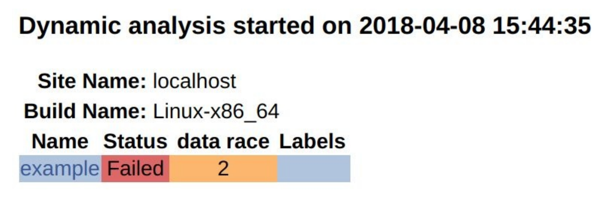

# 14.4 使用ThreadSaniiser向CDash報告數據爭用

**NOTE**:*此示例代碼可以在 https://github.com/dev-cafe/cmake-cookbook/tree/v1.0/chapter-14/recipe-03 中找到，其中包含一個C++示例。該示例在CMake 3.5版(或更高版本)中是有效的，並且已經在GNU/Linux、macOS和Windows上進行過測試。*

在這個示例中，我們將重用前一個示例中的方法，但是使用ThreadSanitizer或TSan，結合CTest和CDash，來檢查數據競爭，並將它們報告給CDash。ThreadSanitizer的文檔可以在網上找到，https://github.com/google/sanitizers/wiki/ThreadSanitizerCppManual

## 準備工作

這個示例中，我們將使用以下示例代碼(`example.cpp`):

```c++
#include <chrono>
#include <iostream>
#include <thread>

static const int num_threads = 16;

void increase(int i, int &s) {
  std::this_thread::sleep_for(std::chrono::seconds(1));
  std::cout << "thread " << i << " increases " << s++ << std::endl;
}

int main() {
  std::thread t[num_threads];
  
  int s = 0;
  
  // start threads
  for (auto i = 0; i < num_threads; i++) {
  	t[i] = std::thread(increase, i, std::ref(s));
  }
  
  // join threads with main thread
  for (auto i = 0; i < num_threads; i++) {
  	t[i].join();
  }
  
  std::cout << "final s: " << s << std::endl;
  
  return 0;
}
```

這個示例代碼中，我們啟動16個線程，每個線程都調用`increase`函數。`increase`函數休眠1s，然後打印並遞增一個整數`s`。我們預計此示例代碼將顯示數據競爭，因為所有線程讀取和修改相同的地址，而不需要任何顯式同步或協調。換句話說，我們期望在代碼末尾打印的最終`s`，每次的結果都不同。代碼有bug，我們將嘗試在ThreadSanitizer的幫助下識別數據競爭。如果不運行ThreadSanitizer，我們可能不會看到代碼有任何問題:

```shell
$ ./example

thread thread 0 increases 01 increases 1
thread 9 increases 2
thread 4 increases 3
thread 10 increases 4
thread 2 increases 5
thread 3 increases 6
thread 13 increases 7
thread thread 7 increases 8
thread 14 increases 9
thread 8 increases 10
thread 12 increases 11
thread 15 increases 12
thread 11 increases 13

5 increases 14
thread 6 increases 15
final s: 16
```

## 具體實施

1. 文件`CMakeLists.txt`首先定義一個受支持的最低版本、項目名稱、受支持的語言。在本例中，定義了C++11標準項目:

   ```cmake
   cmake_minimum_required(VERSION 3.5 FATAL_ERROR)
   
   project(recipe-04 LANGUAGES CXX)
   
   set(CMAKE_CXX_STANDARD 11)
   set(CMAKE_CXX_EXTENSIONS OFF)
   set(CMAKE_CXX_STANDARD_REQUIRED ON)
   ```

2. 接下來，找到線程庫，定義可執行文件，並將其鏈接到線程庫:

   ```cmake
   find_package(Threads REQUIRED)
   
   add_executable(example example.cpp)
   
   target_link_libraries(example
     PUBLIC
     	Threads::Threads
     )
   ```

3. 然後，提供編譯選項和代碼，並鏈接到ThreadSanitizer:

   ```cmake
   option(ENABLE_TSAN "Enable ThreadSanitizer" OFF)
   
   if(ENABLE_TSAN)
     if(CMAKE_CXX_COMPILER_ID MATCHES GNU)
       message(STATUS "ThreadSanitizer enabled")
       target_compile_options(example
       PUBLIC
       	-g -O1 -fsanitize=thread -fno-omit-frame-pointer -fPIC
       )
       target_link_libraries(example
         PUBLIC
           tsan
         )
     else()
     	message(WARNING "ThreadSanitizer not supported for this compiler")
     endif()
   endif()
   ```

4. 最後，編譯測試用例:

   ```cmake
   enable_testing()
   
   # allow to report to a cdash dashboard
   include(CTest)
   
   add_test(
     NAME
     	example
     COMMAND
     	$<TARGET_FILE:example>
     )
   ```

5. ` CTestConfig.cmake`沒有變化:

   ```cmake
   set(CTEST_DROP_METHOD "http")
   set(CTEST_DROP_SITE "my.cdash.org")
   set(CTEST_DROP_LOCATION "/submit.php?project=cmake-cookbook")
   set(CTEST_DROP_SITE_CDASH TRUE)
   ```

6. `dashboard.cmake `需要為TSan進行簡單修改:

   ```cmake
   set(CTEST_PROJECT_NAME "example")
   cmake_host_system_information(RESULT _site QUERY HOSTNAME)
   set(CTEST_SITE ${_site})
   set(CTEST_BUILD_NAME "${CMAKE_SYSTEM_NAME}-${CMAKE_HOST_SYSTEM_PROCESSOR}")
   
   set(CTEST_SOURCE_DIRECTORY "${CTEST_SCRIPT_DIRECTORY}")
   set(CTEST_BINARY_DIRECTORY "${CTEST_SCRIPT_DIRECTORY}/build")
   
   include(ProcessorCount)
   ProcessorCount(N)
   if(NOT N EQUAL 0)
     set(CTEST_BUILD_FLAGS -j${N})
     set(ctest_test_args ${ctest_test_args} PARALLEL_LEVEL ${N})
   endif()
   
   ctest_start(Experimental)
   
   ctest_configure(
     OPTIONS
     	-DENABLE_TSAN:BOOL=ON
     )
     
   ctest_build()
   ctest_test()
   
   set(CTEST_MEMORYCHECK_TYPE "ThreadSanitizer")
   ctest_memcheck()
   
   ctest_submit()
   ```

7. 讓我們以這個例子為例。通過`CTEST_CMAKE_GENERATOR`選項來設置生成器:

   ```shell
   $ ctest -S dashboard.cmake -D CTEST_CMAKE_GENERATOR="Unix Makefiles"
   
   Each . represents 1024 bytes of output
   . Size of output: 0K
   Each symbol represents 1024 bytes of output.
   '!' represents an error and '*' a warning.
   . Size of output: 0K
   ```

8. 在面板上，我們將看到以下內容:

   

9. 我們可以看到更詳細的動態分析:

   

## 工作原理

該示例`CMakeLists.txt`的核心部分:

```cmake
option(ENABLE_TSAN "Enable ThreadSanitizer" OFF)

if(ENABLE_TSAN)
  if(CMAKE_CXX_COMPILER_ID MATCHES GNU)
    message(STATUS "ThreadSanitizer enabled")
    target_compile_options(example
    PUBLIC
    	-g -O1 -fsanitize=thread -fno-omit-frame-pointer -fPIC
    )
    target_link_libraries(example
      PUBLIC
        tsan
      )
  else()
  	message(WARNING "ThreadSanitizer not supported for this compiler")
  endif()
endif()
```

`dashboard.cmake`也需要更新:

```cmake
# ...

ctest_start(Experimental)

ctest_configure(
  OPTIONS
  	-DENABLE_TSAN:BOOL=ON
  )

ctest_build()
ctest_test()

set(CTEST_MEMORYCHECK_TYPE "ThreadSanitizer")
ctest_memcheck()

ctest_submit()
```

和上一個示例一樣，我們也可以在本地查看ThreadSanitizer的輸出:

```shell
$ mkdir -p build
$ cd build
$ cmake -DENABLE_TSAN=ON ..
$ cmake --build .
$ cmake --build . --target test

Start 1: example
1/1 Test #1: example ..........................***Failed 1.07 sec
0% tests passed, 1 tests failed out of 1
$ ./build/example
thread 0 increases 0
==================
WARNING: ThreadSanitizer: data race (pid=24563)
... lots of output ...
SUMMARY: ThreadSanitizer: data race /home/user/cmake-recipes/chapter-14/recipe-04/cxx-example/example
```

## 更多信息

對使用OpenMP的應用TSan是很常見的，但是請注意，在某些情況下，OpenMP會在TSan下生成誤檢的結果。對於Clang編譯器，一個解決方案是用`-DLIBOMP_TSAN_SUPPORT=TRUE`重新編譯編譯器本身及其`libomp`。通常，以合理的方式使用TSan可能需要重新編譯整個工具堆棧，以避免誤報。在使用pybind11的C++項目的情況，我們可能需要重新編譯Python，並啟用TSan來獲得有意義的東西。或者，Python綁定可以通過使用TSan抑制而被排除在外，如 https://github.com/google/sanitizers/wiki/threadsanitizersuppression 。例如：如果一個動態庫同時被一個經過TSan的二進制文件和一個Python插件調用，那麼這種情況可能是不可能使用TSan。

下面的博客文章討論瞭如何添加對動態分析工具的支持：https://blog.kitware.com/ctest-cdash-add-support-for-new-dynamic-analysis-tools/