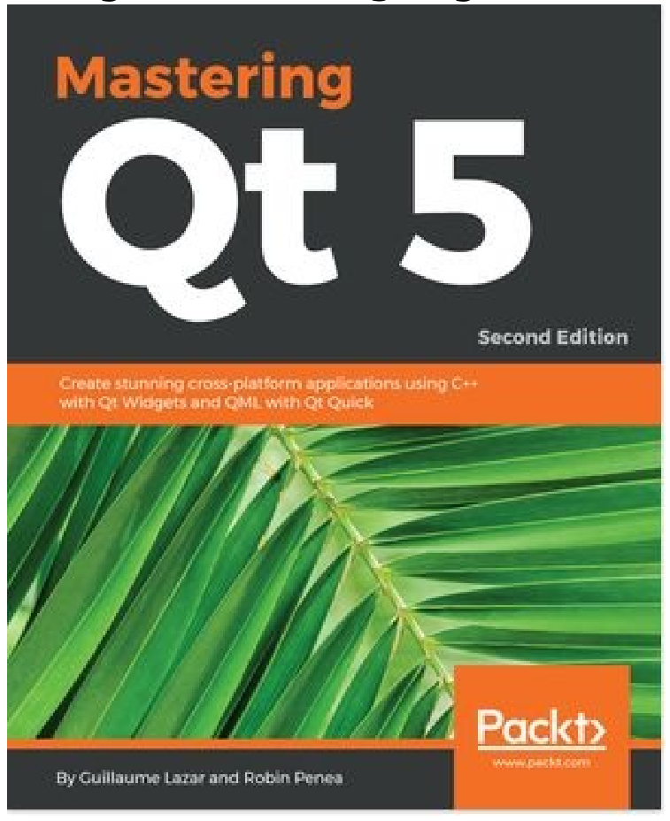
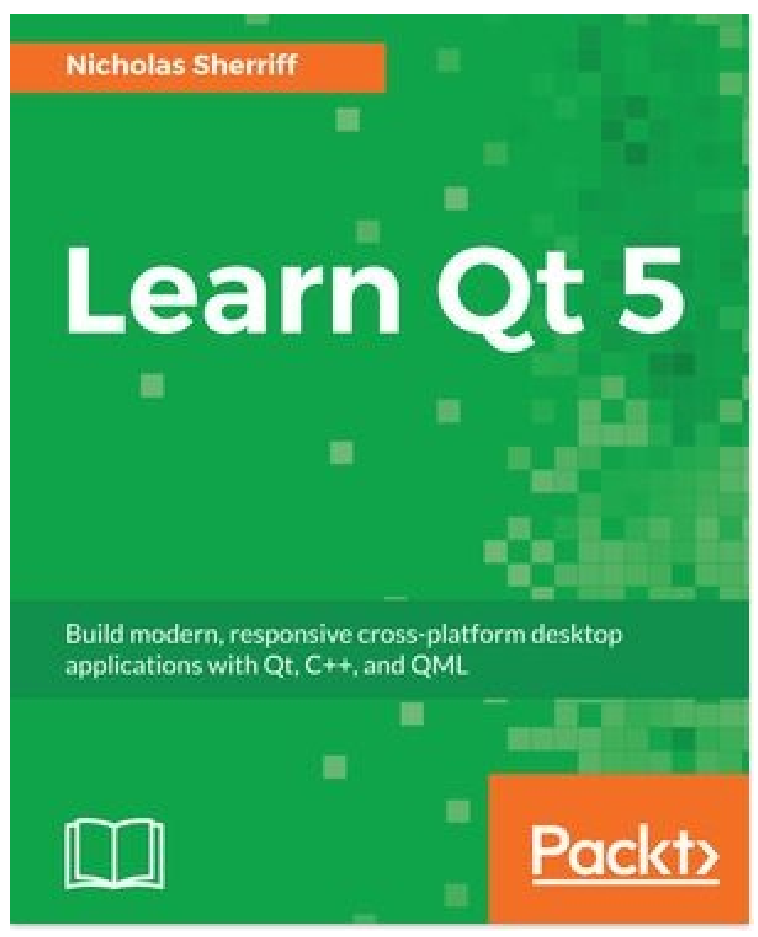

# 第16章 可能感興趣的書

如果你喜歡本書，你可能會對Packt的其他書感興趣:

**Mastering Qt 5 - Second Edition**

Guillaume Lazar, Robin Penea

ISBN: 978-1-78899-539-9

* 使用Qt Widgets和Qt Quick 2創建漂亮的UI
* 使用Qt框架開發功能強大的跨平臺應用程序
* 使用Qt設計器設計GUI，並在其中構建用於UI預覽的庫
* 在C++中處理用戶與Qt信號/插槽機制的交互
* 準備跨平臺項目來託管第三方庫
* 使用Qt動畫框架來創造驚人的效果
* 使用Qt和嵌入式平臺部署移動應用程序
* 使用Qt Gamepad與遊戲平板交互

**Learn QT 5**

Nicholas Sherriff

ISBN: 978-1-78847-885-4

* 安裝/配置Qt框架和Qt Creator IDE
* 使用QMake控制創建一個新的多項目解決方案
* 用QML實現一個豐富的用戶界面
* 學習QtTest的基礎知識，以及如何集成單元測試
* 構建自我感知的數據實體，這些數據實體和JSON進行互相轉換
* 使用SQLite和CRUD管理數據
* 接觸互聯網並使用RSS
* 生成應用程序包以分發給其他用戶